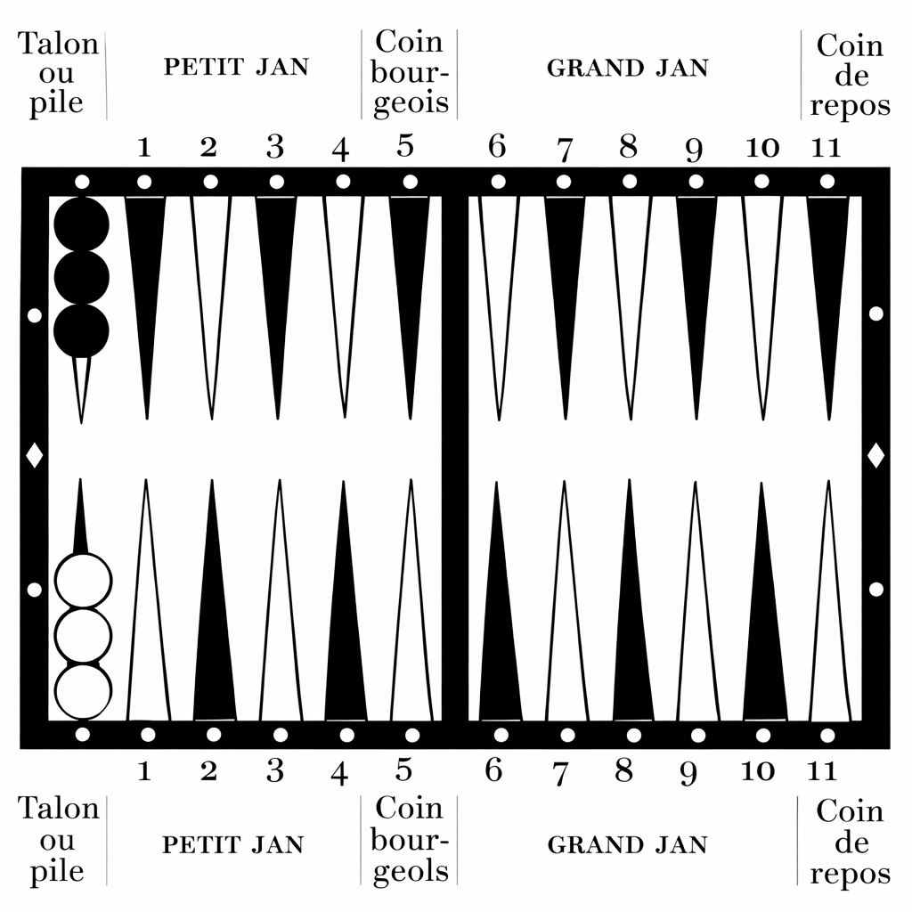

# Table des matières

[toc]

# Note de la rédaction

Ceci est une œuvre originale : ses éléments constitutifs n’avaient jamais, dans toute l’histoire humaine, été publiés en cette combinaison, et nul numéro international normalisé du livre ne la recouvrait. Cela étant dit, **nihil sub sole novum** ; et, s’agissant de la littérature du grand Trictrac, l’assertion se vérifia plus exactement qu’à l’ordinaire.

Si ce petit traité devait avoir un prédécesseur textuel, l’on eût pu soutenir que le troisième et dernier volume de « L’Académie universelle des jeux », ouvrage anonyme publié en 1802 par Ballanche et en 1806 par Costes et Leroy, en fût un. Cela étant, cette compilation ne fut rien moins qu’une édition-omnibus, non créditée, de « Le Jeu du Trictrac » et de « Suite du Trictrac », ouvrages anonymes publiés en 1698 chez Charpentier, ainsi que des « Principes du jeu du Trictrac à la portée des commençants », autre ouvrage anonyme paru en 1749 chez Guillyn. Le choix d’user de l’édition Ballanche de préférence aux autres fut arrêté sur des bases strictement techniques, en ce qu’elle suivait les normes modernes de l’orthographe française, y compris l’abandon du *s* médial. L’on pourrait encore ajouter que, quoique la typographie de Ballanche eût été objectivement belle, ses schémas n’en demeurèrent pas moins proprement exécrables, si bien qu’il fallut, **quantum fieri potuit**, prendre d’autres arrangements.

Comme si cette genèse n’eût point été assez alambiquée, une autre complication survint à propos d’un livre intitulé « Le Jeu du Trictrac ou les principes de ce jeu », de J. M. Fallavel, publié chez Nyon en 1776. Il n’était rien de plus ni de moins qu’une version substantiellement augmentée de l’ouvrage auparavant édité par Charpentier ; mais il ne pouvait raisonnablement servir de texte de copie, attendu que non seulement l’on en avait retranché toute illustration, mais encore qu’il observait une orthographe surannée, laquelle rendait la reconnaissance optique de caractères extrêmement sujette à l’erreur et, pour lors, indûment laborieuse. La méthode retenue fut donc d’intégrer seulement les divergences entre le traité de Fallavel et celui publié par Ballanche, tout en suivant pour l’essentiel ce dernier.

Néanmoins, nous nous estimâmes tenus par l’honneur de rendre à chacun de nos collaborateurs le tribut qui lui était dû — non seulement aux vivants, mais encore aux morts — en commençant par Maître Euverte Jollivet, jurisconsulte, théologien, philosophe, historien et poète d’Orléans, lequel non seulement fut le premier qui eût consigné par écrit les règles du Trictrac (exploit pour lequel il se vit immortalisé sur la couverture même du présent ouvrage), mais encore composa un poème de quatorze mille vers en langue latine célébrant la vie de Gustave Adolphe, Rex Suecorum.

Il ne faudrait point toutefois que vous confondissiez le susdit Euverte Jollivet avec Étienne de Jollivet, lequel écrivit lui aussi des vers, non point sur les rois, mais seulement sur le jeu auquel ils se livraient ; naturellement, ce ne fut que ce dernier que nous eussions inclus dans le présent ouvrage. Quant au reste de nos poètes, ils furent M. Cassan et Jacques Robbe, lesquels composèrent la seule partie de ce livre qui ne fût point rédigée en langue française.

Nous remerciâmes également nos compositeurs d’énigmes : Charles van Tenac, secrétaire de la sous-préfecture de Rochefort, commis des travaux hydrauliques de la Marine et professeur de mathématiques à l’école de maistrance, puis sous-préfet de Langres ; George Light ; et le lieutenant-colonel Félix-Julien « Laun » Delaunay, capitaine d’artillerie de la marine et inspecteur des études à l’École polytechnique. Nos remerciements allèrent encore à notre bibliographe, Michel Malfilâtre, auquel nous demeurâmes redevables d’avoir reconstruit une version plausible du jeu de Toccategli, que nous insérâmes ici pour l’agrément de ceux qui préféreraient un soupçon de Gemütlichkeit autrichienne à la logique pure et glacée de Pascal et de Laplace. Ses notes — bien plus complètes que celles que nous eussions jamais pu fournir — se peuvent consulter à l’adresse suivante :
[https://trictrac.org](https://trictrac.org).

Enfin, nous remerciâmes le présentateur bordelais de YouTube Philippe Lalanne, dont le tutoriel vidéo, d’une durée de quarante heures, se peut visionner à l’adresse suivante : [https://tinyurl.com/ztusmdje](https://tinyurl.com/ztusmdje). Il administre également le site Web [https://salondesjeux.fr](https://salondesjeux.fr).

Encore une fois : ceci est une œuvre originale, tenue par rien ni personne, sinon par la tradition vivante qu’incarne la communauté des joueurs. Partout où la pureté antiquaire entra en conflit avec le télos désiré (savoir, un manuel d’instruction exact à l’usage de ladite communauté), la première dût être sacrifiée à Hermès pour le bénéfice de la seconde. Les erreurs franches d’auteur (telles que d’avoir inséré par méprise l’Allemagne à la place de l’Autriche) et les contenus viciés par la marche du temps (tels que l’ancien emploi de bobèches pour l’illumination nocturne au lieu de l'éclairage électrique zénithal) furent corrigés sans commentaire. Nous ajoutâmes encore des éléments substantiels : un certain nombre de parties consignées en *narrative*, un règlement de tournoi, des systèmes alternatifs de marque, des principes stratégiques aisés à mettre en œuvre, des problèmes, un glossaire français-allemand-danois-latin, ainsi que des pièces en langues française et latine. Enfin, ce qui ne tombait pas dans notre propos arrêté fut délibérément, mais silencieusement, omis. Cela vaut principalement pour la « Suite du Trictrac », qui englobait les règles d’une variante de Trictrac et de trois jeux de tables divers. Il existe d’amples matériaux par lesquels l’on pourra apprendre, exempli causa, Toutes-Tables, Jacquet et Revertier ; notre guide, lui, consacre les règles du Trictrac, et de ce seul jeu.

Autre modification par rapport à nos sources : la numérotation des *flèches*. Dans la littérature existante, nul système ne prévalut sur les autres. Certains livres suivaient l’usage français en comptant le *talon* de chaque joueur pour zéro, et, pour lors, le *coin de repos* pour onze ; d’autres adoptaient l’usage américain, faisant du *talon* la première *flèche* et du *coin de repos* la douzième, le *coin de repos* de l’adversaire étant, par pure fiction (puisque ce point ne peut jamais être occupé par le joueur), la treizième, et le *talon* adverse la vingt-quatrième. D’autres encore employaient des lettres en lieu et place de chiffres, et l’ordonnancement variait selon que **J** et **U** fussent tenus pour variantes typographiques de **I** et **V** (et, pour lors, omis) ou pour lettres à part entière. Pour des raisons techniques, nous élûmes d’user partout du système américain, en signalant les exceptions quand il y en eût. Nos sources, cependant, usaient quasi universellement du système français. Que l’on ne tienne point cela pour un aveu de regret ni de faute : la chose nous met seulement en conformité avec l’usage prévalant dans d’autres jeux de tables.

En somme : ceci n’est point un artefact historique destiné aux philologues et aux antiquaires. Nous n’eûmes pas pour objet de figer le Trictrac dans une vitrine, mais de lui donner un texte clair pour continuer à vivre. Ceux d’entre vous qui désireraient un graphe déterministe, dendriforme, de filiations (plutôt qu’une sorte de nuage de probabilités quantique) pourraient encore demeurer insatisfaits ; bien que nous eussions retenu un seul témoin, le laisser tel quel eût été mathématiquement peu satisfaisant, et, si nous eussions choisi l’autre candidat, nous eussions causé une duplication de labeur tout à fait superflue. Qu’il soit noté que les numérisations de nos textes sources se trouvent communément et librement disponibles, et que notre dessein directeur fut toujours de forger une référence technique pour la pratique d’un jeu dont les règles n’ont point changé de manière matérielle depuis l’an de grâce 1698. Pour l’utile information de ceux d’entre vous qui composent notre lectorat-cible, veuillez noter que les coupures de partie surviennent aux Chapitres [De l’excellence de ce jeu et de l’origine de son nom](#De-l’excellence-de-ce-jeu-et-de-l’origine-de-son-nom), ainsi qu’à [De la marche du jeu en narrative](#De-la-marche-du-jeu-en-narrative).

# Avant-propos

Le jeu de Trictrac tient, on le sait, une place fort honorable parmi les jeux sérieux, il est, avec le jeu des Échecs, ainsi qu’avec le jeu de Dames, un amusement pour les personnes qui cherchent à se distraire des travaux de l’esprit, il demande moins de combinaisons que le jeu des Échecs et il l’emporte sur le jeu de Dames par la préférence que lui a toujours accordée la haute société.

Le Trictrac a peut-être un peu perdu de cette préférence depuis que le Whist a fait son entrée dans le monde, mais on joue encore beaucoup au Trictrac et l’on y jouera pendant bien longtemps encore.

Nous nous abstiendrons de rappeler ici ce qui a été dit touchant l’origine de ce jeu, nous ne dirons pas s’il nous est venu du Nord ou du Midi, des Grecs ou des Romains, nous pourrions peut-être, à force de dissertations, arriver à une conclusion négative, peut-être aussi, en y mettant un peu de bonne volonté, le faire venir de quelque contrée de l’Asie, attribuer son invention à quelque *Palamède*, et alors nous exposer à commettre une grosse erreur, sans beaucoup intéresser le lecteur.

Notre ambition d’ailleurs se borne à offrir aux personnes qui veulent acquérir les premières connaissances de ce jeu, et cela dans un cadre fort restreint, la conduite d’une partie pour la mener à bonne fin, les règles et les termes en usage ; à cela nous avons ajouté un assez grand nombre de figures, ce qui permettra de se rendre, à première vue, un compte exact de ce que donne la description, relativement à la place que les dames doivent occuper.

Puisse ce petit traité mériter les suffrages des débutants auxquels il s’adresse et aussi être utile aux personnes qui auraient un renseignement à trouver relativement aux règles du Trictrac.

# Instructions préliminaires sur le jeu de Trictrac


(Position de départ.)

Ce jeu tire son nom du bruit que l’on fait en y jouant.

On joue au Trictrac sur une plateau appelée *tablier* ou également Trictrac, ce que tout le monde connaît.

Voici en quoi consiste le tablier :



On joue avec quinze dames de chaque côté, de deux couleurs différentes ; deux dés, trois *jetons* pour marquer les points, et deux *fichets*[^fn41] pour mettre dans les *trous* que l’on gagne, servent à jouer le Trictrac.

On ne joue qu’à deux : ce sont les joueurs eux-mêmes qui mettent les dés dans leurs *cornets*.

On commence ce jeu par faire chacun trois *piles*[^fn63] de dames, que l’on pose sur la première *flèche*[^fn40] du Trictrac ; de façon que celui pour lequel on a de la considération ait les siennes à droite. Lorsqu’un homme joue avec une dame ou une demoiselle, il est d’usage et de la politesse de lui donner les noires.

Par le même principe, l’on donne le choix des *cornets* et l’on présente les dés à la personne pour laquelle on doit avoir de la déférence, on jette les dés sur le tablier, et celui qui a de son côté le dé qui marque le plus haut point gagne la *primauté* et joue les points de ce premier *coup*[^fn48].

Parmi les différents coups de dés que l’on peut faire, les *doublets* ont des noms particuliers que l’on ne peut se dispenser de savoir.

[^fn63]: *Piles* ou *talon*. On annonce *piles* ou *talon* la première *flèche* où on range les dames en commençant.
[^fn40]: *Flèches*. Il y en a vingt-quatre, ordinairement blanches et vertes.

## Doublet

On appelle *doublet* tout coup dont les points sont semblables, et *simple* ou *coup simple*, tous les autres dont les points sont inégaux.

⚀⚀ Doublet d’as, ou rafle d’as, s’appelle *Ambesas*[^fn9], *Bezet*, *Bézas*, etc. (on dit *ambesas ne font pas grand fracas* ou, si l’on aime le latin, *ambesas in primis, est signum perditionis*)

⚁⚁ Doublet de deux, s’appelle *Ambesdeux*, *Binet*, *Doublé*, *Double deux*[^fn23], *Tous les deux*, etc. (on dit *ambesdeux quelquefois heureux*, *binet trop tôt, soupirs en bandeau*, *binet parfait, l’adversaire se tait*, ou *tous les dieux*)

⚂⚂ Doublet de trois, s’appelle *Ternes*[^fn84] ou *Tournes* (par dérision *lanternes*).

⚃⚃ Doublet de quatre, s’appelle *Quaternes*, *Quarnes*, *Carmes*[^fn11], etc. (on dit *quarnes donnent l’alarme*)

⚄⚄ Doublet de cinq, s’appelle *Quines*[^fn66] (on dit *qui ne me le font les garçons* ou *quines, grises mines*)

⚅⚅ Doublet de six, s’appelle *Sonnez*[^fn78], *Sonnet*, *Sonnés* ou *Sannes* (on dit *sonnez les vêpres*, *sonnez le glas, double trépas*, *sonnez au corbillard, il est déjà plein*, et *sonnez à la trompette, le diable est mort*).

On ne dit jamais *rafle* au Trictrac et tout coup de deux points égaux est appelé *doublet*.

Il faut avoir soin que les dés aillent donner contre la *bande* du tablier du côté de l’adversaire pour éviter les abus qui pourraient se produire si les dés tombaient mollement.

Si l’un des dés se trouvait incliné et qu’il y eût lieu de douter si le coup est valable ou non, il faudrait que celui qui l’aurait jeté pût couvrir avec l’autre celui des dés qui ne serait pas placé solidement, car dans le cas contraire ce serait à recommencer.

Il est permis à un joueur de *rompre les dés* de l’adversaire en y portant la main, mais seulement si l’on n’a pu compter aucun des points, à moins de convention contraire.

Si les dés sortent du tablier, ou vont sur le bord, quoique bien posés, ils ne comptent pas, la règle veut qu’ils soient dans l’enceinte du tablier. Cependant, le coup serait bon si le premier de ces dés allait dans une moitié du tablier et l’autre dans la suivante.

Il est permis d’arrêter avec le fond du *cornet* un dé qui pirouetterait sur l’un de ses angles, mais il est préférable de le laisser s’arrêter de lui-même.

[^fn9]: *Bezet* ou *Ambesas*. Se disent, l’un ou l’autre, quand on amène deux *as*.


## Comment les points sont nommés

L’usage veut que celui qui joue nomme ses points, il comptera ainsi *deux et as*, *trois et deux*, *quatre et trois*, et ainsi de suite, en annonçant le point le plus élevé en premier ; on ne dira donc pas : *cinq et six*, mais *six et cinq*. Les doublets : *double as* ou *ambesas*, *double deux* ou *ambesdeux*, etc.


(Numérotation française.)

D’abord il est à propos, suivant ce que portent les dés, de jouer deux dames de ses *piles* sur les *flèches* qui répondent aux nombres de ces mêmes dés, ce que l’on appelle *abattre du bois*[^fn1] ; on joue autrement, si l’on veut, en n’abattant qu’une dame, ce qui se dit *jouer tout d’une*[^fn88], la même chose se pratique à l’égard de tous les autres nombres que l’on peut exprimer en jouant *tout d’une*, si vous en exceptez *sonnez*, et *six et cinq*, que l’on doit abattre absolument, parce que les règles du jeu ne permettent point de mettre une dame seule dans son *coin de repos*[^fn19], encore moins dans celui de l’adversaire.

On appelle *jouer par transport*, quand au lieu de tirer du *talon* la dame, ou les dames que l’on a à jouer, on les prend dans le jeu même où elles sont déjà *abattues*. C’est ainsi, par exemple, que l’on ne peut prendre son *coin de repos*, ou faire les *cases* avancées du *grand jan*, que par *transport*.

[^fn1]: *Abattre du bois*, c’est exprimer les points des dés, en abattant du *talon* ou *piles*, deux dames à la fois, qui servent à faire le *petit jan*, si le cas arrive, et par la suite des *cases*, dans la *table* du *grand jan*.
[^fn88]: *Tout d’une*, se joue d’une seule dame des *piles*, ou par *transport*, lorsqu’elle est abattue.
[^fn19]: *Coin de repos* est la onzième *case*. Il ne se peut prendre qu’en y mettant deux dames à la fois, et on ne peut le quitter, pour passer au *jan de retour*, qu’en les ôtant de même toutes deux ensemble. Ce *coin* se prend par *puissance* quand l’adversaire n’a pas le sien ; mais quand on le peut prendre *par effet* (naturellement), il n’est pas permis de le prendre par puissance.

Il est presque toujours de l’intérêt du joueur de commencer par faire des *cases*[^fn12]. On commence d’abord à *caser*[^fn16] dans la première *table*[^fn81], où les dames sont en *piles* ; on passe ensuite dans la seconde, où est le *coin de repos*.

Lorsque l’on joue ses dames, on ne doit jamais compter les *flèches* d’où elles partent, soit que l’on *abatte du bois*, ou que l’on joue les dames *abattues*.

La *marche*[^fn52] s’apprend facilement, en observant que le nombre *pair* va toujours de *flèche* blanche en *flèche* blanche, et le nombre *impair* de *flèche* blanche en *flèche* noire, et également de *flèche* noire en *flèche* blanche.

La *partie de Trictrac*, autrement dite le *Tour*[^fn85], est de douze *trous*. À mesure que l’on les prend, on les marque sur les *bandes*[^fn5] du Trictrac trouées des deux côtés vis-à-vis de chaque *flèche*. Si l’un des joueurs les prend de suite sans que l’adversaire en ait pris aucun, cela s’appelle gagner un *tour bredouille*[^fn10] ; cependant, il ne se paye double que lorsque les joueurs en sont convenus avant de commencer.

Il faut, pour marquer un *trou*, avoir gagné douze points ; les points que l’on gagne se marquent avec les *jetons* au bout et devant les *flèches* du Trictrac, savoir : 

* deux points devant la *flèche* de l’as, 
* quatre points entre la *flèche* du trois et celle du quatre, 
* six points contre la *bande de séparation* devant la *flèche* du six, 
* huit points dans la seconde *table* près la *bande*, 
* dix points devant la *flèche* du dix ou près la *bande du fond*.

À l’égard des douze points qui font le *trou*, *partie simple*[^fn57] ou *double*, ils se marquent avec le *fichet* sur la *bande* du Trictrac, à commencer du côté où les dames sont en *piles*.

Le premier qui marque ne se sert que d’un *jeton* ; quand il a gagné douze points, sans être interrompu par l’adversaire, il marque deux *trous*, ce qui se nomme indifféremment *partie double*, *partie une-et-deux*, ou *partie bredouille*[^fn56].

Celui qui gagne des points en second les marque avec deux *jetons* ; quand il en prend douze sans interruption, il marque de même deux *trous*, *partie bredouille* ; lorsqu’il est interrompu, l’adversaire, en marquant les points qu’il gagne, lui ôte un de ses *jetons*, ce qui s’appelle *débredouiller*[^fn30]. Il est de la bienséance de se *débredouiller* soi-même, sans attendre que l’adversaire le fasse. Pour lors, celui qui parvient le plus tôt au nombre de douze points ne marque qu’un *trou*, ce qui s’appelle *partie simple*.

Le joueur qui marque un ou deux *trous*, non seulement efface tous les points qu’avait l’adversaire avant le coup de dés, mais encore (s’il juge à propos de tenir) conserve ce qu’il a de points au delà des douze pour le *trou*. Il peut cependant arriver que du même coup l’adversaire soit *battu à faux*[^fn7] : pour lors il marque de son côté en *bredouille* les points qui lui sont donnés.

Celui qui a gagné un ou deux *trous* de son dé a la liberté de *s’en aller*[^fn3], c’est-à-dire de lever les dames qu’il *empile* de nouveau, pour recommencer à les *abattre*, et faire de nouveaux *pleins*[^fn62], jusqu’à ce que l’un des deux ait gagné le *tour* ou la *partie complète* du Trictrac ; en s’en allant, il ne se conserve aucun des points qui lui sont restés ; de même, il efface ceux de l’adversaire, qui ne marque jamais, qu’après le coup joué, ceux qu’il gagne *battu à faux*[^fn8], autrement dit, par *jan qui ne peut*[^fn44]. Si, au contraire, les points qu’il gagne et qui lui font marquer le *trou* proviennent du dé de l’adversaire, il ne peut *s’en aller*, et il conserve tous les points qui lui restent au delà des douze, qui lui ont fait marquer le *trou*.

[^fn12]: *Case*. On nomme *case*, deux dames sur une même *flèche*, et lorsqu’il n’y en a qu’une, c’est une *demi-case*, ou *dame découverte*, qui peut être *battue*. 
[^fn16]: *Caser*, faire des *cases*, *tabler*, est placer deux dames sur la même flèche.
[^fn81]: *Tablier, table*. Le *tablier* est généralement tout le Trictrac, et les quatre *tables* en sont la plus grande partie ; pour les distinguer, on leur donne les noms de *jans* qui s’y font.
[^fn52]: *Marche* du Trictrac, s’entend du droit que chaque joueur a de faire le tour des *tables*, en commençant à son *talon*, et finissant à celui de l’adversaire.
[^fn85]: *Tour* de Trictrac. Il faut douze *trous* pour gagner le *tour*, qui signifie la *partie* entière.
[^fn5]: *Bandes*. Ce sont les bords percés vis-à-vis les *flèches*. Chaque joueur y marque les *trous* qu’il gagne. Celui qui joue les dés doit toujours les faire toucher la bande de l’adversaire, et au jan de retour on compte la bande pour une *flèche* ou lame.
[^fn10]: *Bredouille*. Quand l’un des joueurs gagne douze points de suite, sans être interrompu par l’adversaire, il marque deux *trous*, ce que l’on appelle *partie bredouille*. Celui qui gagne des points en second, pour faire voir qu’il est en *bredouille*, les marque avec deux *jetons*, que l’on nomme aussi *bredouille*. On appelle aussi *grande bredouille* une partie gagnée sans que l’adversaire ait pris un *trou*.
[^fn56]: *Partie bredouille, partie une et deux sans bouger, partie une et deux*, se dit quand on gagne douze points de suite, sans être interrompu par l’adversaire, et que l’on marque deux *trous*. Si on les gagne d’un seul coup, et que l’on ait déjà des points marqués en bredouille, c’est *partie une et deux sans bouger* ; c’est-à-dire, que celui qui gagne les *trous* ne dérange point son *jeton*, mais il ôte celui de l’adversaire dont il efface les points. Quand les joueurs n’ont que chacun un *jeton* sur jeu, c’est une marque qu’il n’y a point de *bredouille* ; mais quand il n’y a qu’un *jeton* ou trois sur jeu, c’est une preuve que l’un des deux joueurs est en *bredouille*.
[^fn57]: *Partie simple*, *partie simple sans bouger*. Une *partie simple* se produit lorsqu’un joueur marque douze points consécutifs, sans être interrompu par l’adversaire, et qu’il ne gagne ainsi qu’un seul *trou*. Lorsque l’on dit *partie simple sans bouger*, cela signifie que le joueur ayant déjà des points en bredouille gagne le *trou* d’un seul coup et ne déplace pas son propre *jeton*, mais enlève celui de l’adversaire, effaçant ses points.
[^fn30]: *Débredouiller*. On entend par ce terme interrompre l’adversaire dans les points qu’il a gagnés, et s’il les avait marqués avec deux *jetons*, il faut en ôter un pour le *débredouiller*. Quand on est *débredouillé* de part et d’autre, celui qui gagne le premier douze points ne marque qu’un **trou**, ce que l’on appelle *partie simple*.
[^fn7]: *Battre à faux*. Quand l’un et l’autre des points des dés du joueur répondent à deux *flèches* garnies de deux dames ou cases, et que les deux points réunis vont à une autre dame découverte, on appelle cela *battre à faux*, ou par *jan qui ne peut* : elle vaut autant à l’adversaire qu’elle eût valu au joueur s’il l’eût battue pour lui.
[^fn3]: *Aller, s’en aller*. Terme dont on se sert, lorsque l’on a gagné un ou plusieurs *trous* de son dé, et que son jeu n’est pas si beau que celui de l’adversaire : pour lors on dit, *je m’en vais* : on lève les dames pour les remettre en *piles*, et l’on recommence.
[^fn62]: *Plein* veut dire deux dames sur chacune des six *flèches* d’une *table*. Il s’applique au *petit jan*, au *grand jan* et au *jan de retour*.
[^fn8]: *Battre à faux*. Se faire donner des points. Il est quelquefois à propos de découvrir ses dames, pour se faire *battre à faux* et donner des points, comme il est prudent de les couvrir, suivant les circonstances de son jeu.
[^fn44]: *Jan qui ne peut*, voir *battre à faux*.

# Des jans

On partage le tour du *tablier* en quatre parties égales, que l’on appelle *tables* ; et chacune de ces *tables* porte le nom de *jan*. Dans le jeu ordinaire, chaque joueur en a deux ; et quand on *passe au retour*, chaque joueur en a quatre, composés chacun de six flèches. Dans le jeu ordinaire, les deux jans de chaque joueur sont devant lui, près de la bande où il marque ses *trous* : et ces jans, dont il sera parlé ci-après, sont connus, l’un sous le nom de *petit jan*, et l’autre sous celui de *grand jan*.

On compte huit jans[^fn43] au Jeu de Trictrac :—

1. le *jan de trois coups* ou *de six tables* ;
2. le *jan de deux tables* ou *des deux coins* ;
3. le *contre-jan[^fn45] de deux tables* ;
4. le *jan de méséas* ou le *jan des as du coin* ;
5. le *contre-jan de méséas* ou le *contre-jan des as du coin* ;
6. le *petit jan*, *petit plein*, ou le *plein du petit jan* ;
7. le *grand jan*, *grand plein*, ou le *plein du grand jan* ; et
8. le *jan de retour*, *plein de retour*, ou le *plein du jan de retour*.

Outre cela il y a trois *jans* dites *abandonnés*, // add stuff here dont:

1. le *jan de rencontre* ;
2. la *pile de misère* ;
3. *Margot la fendue*.

## Du jan de trois coups

Le *jan de trois coups*, autrement dit *jan de six tables*, se fait quand en trois coups, en commençant la partie et toutes les fois que l’on recommence après avoir *levé*[^fn50] toutes les dames, on *abat* six dames de suite, savoir : cinq dans la première *table*, et une dans la seconde à la première *flèche*, comme dans la figure ci-après, en observant que l’on n’est point obligé de faire ce *jan*, si l’on ne veut ; il suffit que l’on ait amené du troisième coup le nombre convenable, pour qu’il vaille quatre points : et pour lors on fait la *case* qui paraît la plus avantageuse dans la *table* du *grand jan* de deux des quatre dames *abattues* dans la *table* du *petit jan*.

Ainsi, le joueur qui a les dames noires a d’abord fait *cinq et quatre*, puis *trois et un* ; il fait maintenant *six et deux*, lesquels trois coups joués *tout à bas* couvrent naturellement les six premières *flèches* en partant du talon.

Il marque quatre points de son *jan de trois coups* et joue son coup *tout à bas* en 3, 7.

[^fn50]: *Lever les dames*, c’est la même chose que *s’en aller*. Au *jan de retour*, on *lève* (quand toutes les dames sont passées dans la *table* de ce *jan*) toutes les dames qui ne s’y peuvent jouer.


## Du jan de deux tables

Le *jan de deux tables* se fait lorsque l’on n’a que deux dames *abattues*, l’adversaire n’ayant point son *coin*[^fn19], et que les nombres des dés du joueur vont, l’un, de l’une de ses dames à son coin, et l’autre, de son autre dame à celui de l’adversaire : ce coup vaut quatre points par *simple*, et six par *doublet* ; et l’on *abat* d’autres dames des *piles* ; car on ne peut prendre son *coin* qu’en y mettant deux dames à la fois, et l’on ne peut en mettre ni une, ni deux dans celui de l’adversaire.

Chaque joueur peut faire ce *jan* une fois seulement, et le premier qui le fait n’empêche pas le second de le faire après, pourvu qu’il n’ait aussi que deux dames *abattues*, que les deux *coins* soient vides et que les nombres de ses dés aillent, l’un, d’une dame à son *coin*, et l’autre, de son autre dame à celui de l’adversaire, ce qui s’appelle *battre*[^fn6] les deux *coins*.

[^fn19]: *Coin de repos* est la douzième *case*. Il ne se peut prendre qu’en y mettant deux dames à la fois, et on ne peut le quitter, pour passer au *jan de retour*, qu’en les ôtant de même toutes deux ensemble. Ce coin se prend par *puissance* quand l’adversaire n’a pas le sien ; mais quand on le peut prendre par effet, il n’est pas permis de le prendre par *puissance*.
[^fn6]: *Battre* se dit du *coin* de l’adversaire, ou de ses dames, si elles sont découvertes, et que les points des dés aillent des dames du joueur à ce *coin* vide, ou à ces dames découvertes.

## Du contre-jan de deux tables

Le *contre-jan de deux tables* se fait lorsque l’on *bat à faux* les deux *coins*, c’est-à-dire lorsque le joueur n’a que deux dames à bas, et alors que l’adversaire a déjà pris son *coin*, l’un des nombres de ses dés va, de l’une de ses dames, à son *coin* vide, et l’autre nombre, de son autre dame, au *coin* garni de l’adversaire : pour lors il perd quatre points par *simple*, et six par *doublet*. 

Ce coup n’arrive que très rarement et ne peut arriver, ainsi que le *jan de deux tables*, qu’une fois par *partie* au commencement du jeu, parce qu’il n’a plus lieu lorsque l’on a plus de deux dames *abattues*.

## Du jan de méséas

Le *jan de méséas* se fait lorsque ayant pris son *coin*, sans avoir d’autres dames abattues, l’adversaire n’ayant pas le sien, on amène un ou deux *as* : ce coup vaut, dans le premier cas, quatre points, et six dans le second par *doublet*.

Le joueur amène *quatre et as*, il marque quatre points pour ce coup et joue ensuite *tout à bas* en 2, 5 pour étendre son jeu.


## Du contre-jan de méséas

Le *contre-jan de méséas* est rare : il se fait quand le joueur, ayant son *coin*, sans avoir d’autres dames *abattues*, et l’adversaire le sien, amène un ou deux as, auquel cas on perd quatre ou six points.

## Du petit jan

Le *petit jan* aurait, suivant un auteur ancien, été ainsi nommé parce que l’on n’y fait que cinq *cases*, par opposition au *grand jan* et au *jan de retour* où l’on en fait six, la raison pour laquelle on ne fait que cinq *cases* dans le *petit jan* ou dans la première *table*, quoiqu’il y ait six *flèches* comme dans les autres, est que l’on ne compte pas le *talon* ou la première *flèche* pour une *case*, puisque *l’as* se met sur la seconde *flèche*, le *deux* sur la troisième et le *cinq* sur la sixième où se fait le *coin bourgeois*, près de la *bande de séparation* des deux *tables*. 

Il convient de noter ici qu’aucun système de notation pour numéroter les flèches ne prévalut jamais sur les autres ni ne s’érigea en norme ; toutefois, les deux plus importants sont la convention française, qui compte le *talon* de chaque côté pour la zéroième *flèche* et le coin de repos pour l’onzième, et la convention américaine, qui compte le talon de son propre côté pour la première *flèche*, le coin de repos pour la *douzième*, le *coin de repos* de l’adversaire pour la treizième, et le *talon* de l’adversaire pour la vingt-quatrième. Le choix de l’une ou de l’autre vous appartiendrait, pourvu que vous vous y tinssiez avec constance, si d’aventure votre main ne vous eût été forcée (le plus souvent par la technologie). Nous employons la convention américaine dans le présent ouvrage, parce qu’il s’agit d’un livre illustré et que les outils dont nous nous servîmes l’exigèrent. Nous suivons, dans le présent livre, la convention américaine, parce qu’il s’agit d’un ouvrage illustré, et que les outils dont nous nous servîmes l’exigeaient.

Cela dit, les dénominations verbales des *flèches* demeurent invariables et ne dépendent d’aucune numérotation : ainsi, la *flèche* sur lequel les dames se posent en *tas* au commencement du jeu, qu’on le comptât pour la zéroième ou la première *flèche*, s’appelle toujours le *talon* ; la *flèche* du *petit jan* le plus proche du *pont* ou *bande de séparation* s’appelle toujours le *coin bourgeois* ; la seconde *flèche* du *grand jan* s’appelle toujours la *case du Diable* ; la cinquième *flèche* du *grand jan* s’appelle toujours la *case de l’écolier* ; et la sixième *flèche* du *grand jan* s’appelle toujours le *coin de repos* ou le *coin*.

Le *petit jan*, ou *petit plein*, se fait donc dans la première *table* où sont les *piles* de dames en commençant : on le fait assez commodément quand on n’amène que du *petit jeu*, comme *ambesas*, *deux et as*, *trois et as*, etc. ; mais pour peu que les dés amènent du gros, il ne faut pas s’y arrêter.

On peut *remplir*[^fn67] son *petit jan*, d’une, de deux, et même de trois façons par *simple* ; et chaque façon vaut quatre points.

On peut encore remplir d’une façon par *doublet*, ou de deux façons par l’une et l’autre partie du *doublet*, autrement dite *double-doublet* ; et chaque façon vaut six points.

Quoique le *talon* ne soit pas, dans certains traités, compté pour une *case*, puisque l’on ne commence à compter la première que de la seconde *flèche* où l’on met *l’as*, il faut cependant que ce talon soit garni au moins de deux dames pour faire son *petit plein*, ou pour le *conserver*, parce que sans cela le *plein* n’aurait pas lieu.

Le joueur qui a les dames noires amène *trois et as* ; ce coup est heureux, car il *remplit* son *petit jan*. Avant de jouer son coup il doit marquer quatre points pour son *plein*, après quoi il joue *tout à bas* en 2 et 4, sans pouvoir s’en dispenser sous peine de faire *école*[^fn34].


Il est de prudence, quand on a gagné un ou deux *trous* de son *petit jan*, de *s’en aller*, particulièrement lorsque l’adversaire a son jeu bien *avancé*[^fn4], c’est-à-dire beaucoup de dames dans sa seconde *table*, avec lesquelles il *battrait*[^fn6] celles que le joueur aurait *découvertes*, et son *coin*, s’il avait le sien, et le forcerait de *passer* l’une de ses dames dans la *table* de son *petit jan*, où elle serait *battue*, et pourrait empêcher, ou du moins ôterait la facilité de faire le *grand jan*, parce que l’on aurait une dame de moins.

On ne peut, pour *conserver* son *petit jan*, prendre son *coin de repos*[^fn19] par *puissance*, en jouant *quines* pour *sonnez* ; les règles de ce jeu étant que l’on ne doit pas prendre son coin par *puissance*, lorsque l’on peut le prendre par *effet*[^fn37]. On est donc obligé de *rompre*[^fn74], à moins qu’il n’y ait *passage libre*[^fn58] dans la *table* du *grand jan* de l’adversaire, pour *passer* dans celle de son *petit jan* : encore ne peut-on y *passer* que dans le cas où il ne peut plus faire son *petit jan* ou *petit plein*.

Celui qui *s’en va* a le dé pour recommencer.

[^fn67]: *Remplir* veut dire placer deux dames sur chacune des six *flèches* d’une *table*. Il s’applique au *petit jan*, au *grand jan* et au *jan de retour*.
[^fn4]: *Avancer*. On entend par *avancer son jeu*, jouer ses dames dans la *table* de son *grand jan*, pour prendre plus tôt son *coin* ; battre celui de l’adversaire, et ses dames découvertes, s’il s’arrête à faire son *petit jan*.
[^fn6]: *Battre*. Se dit du *coin* de l’adversaire, ou de ses dames, si elles sont découvertes, et que les points des dés aillent des dames du joueur à ce *coin* vide, ou à ces dames découvertes.
[^fn37]: *Effet*, se dit du coin que l’on ne peut prendre par *puissance*, quand on le peut prendre «naturellement».
[^fn74]: *Rompre son plein*, c’est être obligé de lever l’une des dames qui le composent, faute de pouvoir exprimer les points des dés avec d’autres dames.
[^fn58]: *Passage libre* ou bien *passage ouvert*. C’est une *flèche* totalement vide, sur laquelle on emprunte *passage* pour jouer une dame plus loin, ou une *flèche* où il n’y a qu’une dame sur laquelle on se repose pour battre plus loin une autre *dame découverte*, en assemblant les nombres des deux dés.
[^fn34]: *École*. On dit faire une *école*, marquer une *école*, ou envoyer à *l’école*, quand l’un des joueurs oubliant de marquer les points qu’il gagne, l’adversaire les marque pour lui ; c’est ce que l’on appelle envoyer à l’école.

## Du grand jan

Le *grand jan* peut être ainsi appelé, non seulement parce que l’on y fait six cases par opposition au *petit jan*, où l’on n’en fait que cinq, le *talon* y tenant lieu de la sixième, mais aussi parce que d’une seule *tenue* dans le *grand jan* on peut faire le *tour* entier du Trictrac et finir la partie : au lieu qu’il arrive rarement que l’on puisse prendre plus de deux ou trois *trous* dans le petit jan et dans le *jan de retour*, sans être obligé de *s’en aller* et de recommencer. C’est, on le voit, dans le *grand jan* que se font les plus grands coups.

Le *grand jan* se fait dans la seconde *table*, et se nomme aussi *grand plein* ; quand on *remplit* d’une façon, par *simple*, on gagne quatre points : de deux façons, huit points, et de trois façons douze points.

D’une façon, par *doublet*, six points : de deux façons, ou *double doublet*, douze points ; on ne peut *remplir* de deux ni de trois façons, que lorsqu’il ne s’en faut que d’une dame que l’on ait son *plein*.

Le joueur qui a les noires amène *ambesdeux* ; il *remplit* de deux façons, par *doublet* : c’est six points pour chaque façon, un *trou* *sans bouger*, et comme il est en *bredouille*, ce sont deux *trous* *sans bouger* qu’il marque, et voulant *tenir*, joue *transport* de 4 en 8 pour remplir.


On appelle *remplir* d’une façon, lorsque l’on ne peut mettre sur la dame qui est la seule *découverte*[^fn25] dans la *table* du *grand jan*, qu’une seule des autres dames ; quand bien même on rassemblerait les nombres des deux dés.

[^fn25]: *Dame découverte* est une *flèche* sur laquelle il n’y a qu’une dame qu’on appelle *demi-case*.

On ne peut *remplir* que d’une façon, lorsqu’il manque au *plein* une *case* entière, ou deux *demi-cases* ; et l’on ne remplit point du tout du coup, lorsqu’il en manque davantage, parce que les nombres amenés par les dés ne se divisent pas, comme ils peuvent s’additionner en les réunissant ; et que l’on ne peut pas, par exemple, d’un *cinq* provenant de l’un des dés, faire un *trois et deux* ni un *quatre et as*, comme d’un *trois et deux* ou d’un *quatre et as* provenant des deux dés, on peut en faire un *cinq*.

On *remplit* de deux façons, lorsque l’on peut mettre deux dames sur celle qui est *découverte*, c’est-à-dire amenant *cinq et as*, on peut *remplir* du *cinq* et de *l’as* séparément.

Enfin, *remplir* de trois façons est lorsque l’on peut mettre trois dames sur celle qui est *découverte*, une de chacun des points des dés séparément, et la troisième des points des deux dés joints ensemble, ce qui arrive, par exemple, lorsque l’on amène *cinq et as*, et que l’on *remplit* de *l’as*, du *cinq*, et du *cinq et as*.

Amenant *quatre et trois*, on peut aussi *remplir* de trois façons : du *trois*, du *quatre*, et du *quatre et trois*, et ainsi des autres nombres.

(Grand jan *rempli de deux façons* par *doublet*)


*Remplir* par *doublet* d’une façon, est, lorsque l’on ne peut mettre qu’une dame sur celle qui est *découverte*, en rassemblant même les points des deux dés ; on peut aussi *remplir* par *doublet* de deux façons, autrement dit, par *double doublet*, amenant *ternes*, et remplissant du *trois* et du *six* ; ou bien amenant *ambesdeux* (on dit aussi *binet*), et remplissant du *deux* et du *quatre*. Cette explication doit aussi servir pour le *petit jan* et le *jan de retour*.

On peut *remplir* de deux façons par *doublet*, quand il ne manque qu’une dame au *plein*, et que parmi celles qui restent à jouer il s’en trouve deux qui peuvent également l’une et l’autre venir occuper cette place par le moyen du *doublet* que l’on a fait. Par exemple, on a vu qu’il manquait au joueur qui avait les dames noires une dame en 8, pour remplir son *grand jan*, il a fait *ambesdeux*, et a pu *remplir* de 6, par *deux*, et de 4, par *deux* et *deux*. Voilà ce que l’on appelle *remplir* de deux façons par *doublet*. Le joueur a marqué six points pour chaque dame qui peut *remplir*, quoique l’on n’en mette qu’une.

Mais si ce même joueur n’avait point de dame en 4 ou en 6, il ne *remplirait* que par *doublet*. De même, s’il lui manquait toute la case 8 et qu’il fit *quarnes*, il ne *remplirait* que par *doublet*, parce qu’il lui faudrait les deux dames en 4 pour *remplir*.

S’il manquait deux dames au *plein*, la première que l’on y met ne compte pas, ce n’est que la dernière qui remplit.

Cette explication doit aussi servir pour le *petit jan* et pour le *jan de retour*.

On ne peut *remplir* de deux ni de trois façons, que lorsqu’il ne s’en faut qu’une dame que l’on ait son *plein*.

Pour se procurer l’avantage de *remplir* de plusieurs façons, il est bon de mettre une dame seule sur l’une des *flèches* du *grand jan*, lorsqu’il ne reste plus que cette *demi-case*[^fn12] à faire, et principalement lorsque l’adversaire n’a rien, ou trop peu de points, pour qu’il puisse, quelles que soient les dés qu’il amène, gagner le *trou*.

Dans d’autres circonstances, on doit en user de même, pour ne pas perdre son jeu, au risque de donner un ou deux *trous* à l’adversaire, avec lesquels il *s’en va*. C’est ce qui s’apprend en jouant.

*Mettre dedans* se dit donc d’une dame que l’on expose seule *découverte* sur la *flèche* vide qui reste à garnir pour faire le *plein*. On ne *met* guère *dedans* que pour avoir une occasion prochaine de *remplir* le coup suivant ; ainsi, en *mettant dedans*, il faut qu’il ne manque qu’une dame au *plein* pour le coup d’après ; car s’il en manquait deux, ce ne serait pas une occasion prochaine de *remplir*, à moins que d’amener précisément, et à point nommé, les nombres dont on peut avoir besoin, ce dont on ne doit nullement se flatter.

Quoique l’on *remplisse* de deux ou trois façons, et que les dames aillent, ou portent sur la même, on n’est cependant pas obligé de les y jouer ; il suffit d’y en mettre une à son choix ; et des trois autres, on joue celle que l’on veut, que l’on place convenablement à son jeu, soit pour se faire donner des points, en se faisant *battre à faux*, ou éviter que l’on en donne, *en se couvrant*.

Après que le *jan* ou *plein* est fait, autant de fois que l’on joue les dés et que l’on le *conserve*[^fn22], on gagne et l’on marque quatre points par *simple*, et six par *doublet*, il en est de même du *petit jan* et du *jan de retour*, et il est de la prudence, quand on voit que son jeu s’avance trop, et que celui de l’adversaire est plus beau, ou se prépare à le devenir, de *s’en aller* ; autrement on pourrait être *enfilé*[^fn38], et perdre la partie, quand bien même l’adversaire n’aurait pas encore pris un *trou*.

Quand on *tient*[^fn83], à la faveur de huit points que l’on a de reste, et que l’on a un jeu fort avancé, il faut ôter la dernière dame qui est dans la *table* du *petit jan*, afin que l’adversaire ne la *batte* point *à faux*, que l’on puisse achever le *trou* le coup suivant, et *s’en aller*. En usant de cette précaution, on a encore l’avantage, qu’en amenant *six et cinq*, *six et quatre*, etc. faute de *six* à jouer, on *conserve* le *plein*, et l’on gagne quatre points, pour achever le *trou*.

Si cependant le jeu de l’adversaire est plus *passé*, il faut *tenir* : et pour lors il marque deux points, pour le *six* que l’on n’a pu jouer.

Observez que l’on est obligé de *rompre* le *plein*, lorsque l’on amène un nombre que l’on ne peut jouer dans ses *tables*, s’il y a du jour dans la *table* du *grand jan* de l’adversaire, pour *passer* dans celle de son *petit jan*. On doit pour lors jouer la dame de l’une des *cases*, qui va directement à ce *passage*, en comptant les points de l’un des dés, et la mettant dans la *table* de son *petit jan*, à la *flèche* où elle va, en comptant les points des deux dés ensemble, bien entendu que cette *flèche* est vide ; car, s’il y avait une dame, on la *battrait*, on ne pourrait y mettre une autre dame, et par conséquent on ne serait pas obligé de *rompre*.

On est quelquefois obligé de *rompre* par le *coin de repos*, lorsque l’adversaire ne peut plus faire son *grand jan* ou *grand plein*, et que la septième *flèche*, où vont ces deux dames, par un *sonnez*, est totalement vide.

Après avoir *rompu*, on peut refaire son *plein* ; ce qui vaut quatre points par *simple*, *remplissant* d’une façon ; huit points, de deux, aussi par *simple* ; et douze points de trois façons ; six points par *doublet*, et douze points par *double doublet*. Ce coup est assez ordinaire.

Il arrive quelquefois qu’un joueur est *enfilé*, sans qu’il y ait de sa faute, quand les dés lui sont totalement contraires, et qu’il ne peut faire son *plein*. Cet évènement est l’effet du hasard.

[^fn22]: *Conserver*, s’applique à tous les *jans*. Chaque coup que l’on joue et que l’on *conserve*, on gagne des points.
[^fn38]: *Enfilade*, être *enfilé*. C’est rompre son *plein*, *découvrir* ses dames, et donner *passage* à l’adversaire, au moyen duquel il tient plus longtemps, et marque des points pour son *plein*, pour les dames qu’il bat, et pour celles que l’on ne peut jouer.
[^fn83]: *Tenir*, ne pas *s’en aller*. Il est permis au joueur qui marque un ou plusieurs *trous* provenus des points de ses dés, de *tenir* ou de *s’en aller* ; on est obligé de *tenir* quand le *trou* ou les points pour l’achever, proviennent du dé de l’adversaire.

## Du jan de retour

Le *jan de retour* se fait dans la *table* du *petit jan* de l’adversaire, où étaient ses dames en *piles*, lorsque l’on a commencé la partie, en *remplissant* : et tant que l’on *tient*, on gagne, et l’on marque comme aux deux *jans* précédents.

On ne peut à ce *jan*, quand il ne reste plus qu’une *demi-case* à faire, être censé *remplir* de trois façons, si l’on a encore son *coin de repos*, quand bien même les deux autres dames, et l’une de celles du *coin*, iraient juste sur cette *demi-case*. On ne *remplit* pour lors que de deux façons, parce que les deux dames du coin ne peuvent en sortir séparément : et il arrive souvent, que, faute de les avoir sorties à temps, on est obligé de *rompre*, et de *passer* les autres dames, sans espoir de pouvoir remplir.

*Rompre* est un terme opposé à celui de *conserver* ; c’est être obligé de *rompre* son *plein* en en tirant une ou deux dames.

Si celui qui peut *conserver* *rompait* par mégarde, il *serait à l’école*, quoiqu’il eût marqué ses points ou non.

*S’en aller*, *je m’en vais*, sont les termes dont se sert le joueur, qui voyant le jeu de son adversaire plus beau que le sien, le *dégarnit*, remet ses dames au talon et oblige à recommencer la partie, cela s’appelle *reprise*.


En effet, si le joueur qui a les dames noires amène *six et cinq*, regardant son jeu, il voit qu’il a huit points faits et que la dame 8 *bat tout d’une* la dame 19 de son adversaire, ce qui lui vaut quatre points ; il a donc en tout douze points, il pourrait faire un **trou** ; il prend alors le *fichet*, le met dans le *trou* 1 et il efface tout en disant *partie simple*, *je m’en vais*, et l’on recommence.

La *case* du *coin* y est égale aux autres ; ainsi on peut la faire à deux fois.

On doit prendre garde en *passant au retour* de s’arrêter le plus loin que l’on peut de l’ancien *talon* de l’adversaire afin d’avoir plus de ressources pour jouer de gros points, et par la même raison quand on commence à faire son *jan de retour*, on doit tant qu’il est possible le garnir par le *coin bourgeois* de l’adversaire et par les *flèches* qui le suivent, parce que si l’on commence à *caser* par les dernières *flèches*, on s’expose souvent à ne pas *remplir* à cause des dames qui s’accumulent les unes sur les autres et qui se trouvent *passées* avant que l’on ait pu remplir.

Ici, il s’agit de faire le *jan de retour*. Si le joueur faisait *sonnez* ou *quines*, il perdrait ses deux dames 16. S’il faisait *six et cinq*, il les perdrait aussi. La situation de son jeu est curieuse, mais il fait heureusement *quatre et deux*, et il peut remplir en marquant quatre points et jouant de 16/17, en 19/20. Son *jan de retour* est *rempli*.


Quand l’adversaire n’a plus que deux ou trois *cases* à *passer* et que l’on a occasion de sortir du *coin*, on doit le faire parce que l’on se trouve souvent embarrassé pour l’avoir voulu conserver trop longtemps.

Ce *coin* alors risque peu d‘être *battu*. Mais, dans un commencement de retour on ne s’en défait point, à moins d’y être forcé parce que l’adversaire, ayant alors plusieurs cases, le battrait presque à tout coup.

S’il ne restait plus qu’une *demi-case* à faire au *jan de retour* on ne pourrait être censé *remplir* de trois façons, si l’on avait son *coin de repos*, quand même les deux autres dames et l’une de celles du *coin* iraient juste sur cette *demi-case*. On ne remplit pour lors que de deux façons, parce que les deux dames du *coin* ne peuvent en sortir séparément : et il arrive souvent, comme on l’a déjà observé, que faute de les avoir sorties à temps, on est obligé de *rompre*, et de *passer* les autres dames sans espoir de pouvoir *remplir*.

Il est probable que lorsque l’on fait le *jan de retour*, l’adversaire n’y a plus de dames. Par cette raison, le joueur n’ayant pas à craindre d’y être *battu*, doit étendre les siennes, en commençant par faire des *demi-cases*.

Quand toutes les dames sont *passées* dans cette *table*, on *lève*, c’est-à-dire, on met *hors du Trictrac*[^fn42] les dames qui battent juste sur la *bande*[^fn210], en commençant toujours par les plus éloignées ; n’étant permis de *lever* que celles qui ne se peuvent jouer, et de ne point jouer *tout d’une*, à moins que ce ne soit pour *conserver* le *plein*. Celui qui a *levé* le premier, gagne quatre points, si son dernier coup est *simple* ; si c’est un *doublet*, il gagne six points, lesquels lui restent, ainsi que le dé pour recommencer, et il oblige l’adversaire à *lever* aussi ses dames, quand bien même il aurait encore son *plein*.

Il est d’usage, quand les deux joueurs ont *rompu*, et qu’il n’y a plus lieu de douter qui doit avoir *levé* le premier, que celui qui a le moins de dames à *lever* tire pour le dernier coup, d’accord avec l’adversaire, pour savoir si les nombres de ses dés seront par *simple* ou par *doublet*.

Le joueur qui *s’en est allé* a pris le *fichet*, l’a mis dans le *trou* A, en disant *je m’en vais*, et les deux joueurs reprennent le jeu.

*Reprendre le jeu*, c’est recommencer à jouer après avoir marqué un ou deux *trous* et *s’en être allé*. En effet, après avoir *rompu*, le joueur avec les dames noires reprend le *cornet*, et jetant les dés sur le *tablier*, il fait *cinq et quatre* qu’il joue *tout à bas* en 5, 6 et la reprise continue.


[^fn42]: *Hors du Trictrac*, veut dire hors du jeu ; c’est pourquoi à mesure que l’on lève les dames, on les met dans l’autre *table* vide, parce que sur la bande elles seraient en danger de tomber.
[^fn210]: Le privilège de ce *jan* est de compter la *bande* pour une *flèche* ; par conséquent si l’un des joueurs ayant son *plein* n’a plus qu’un *six* à jouer, et qu’il amène *six et as*, il *conserve* encore, parce qu’en comptant la *bande* pour une flèche, il joue sa dame *tout d’une*, hors de la *table*, et de même *quatre et trois*, ou *cinq et deux* ; mais il ne lui est permis de jouer ce coup *tout d’une*, qu’en faveur de la *conservation* de son *plein*.

## Des jans dits « abandonnés »

Au cours du XVIIème siècle trois *jans* furent progressivement abandonnés. Il s’agit du *jan de rencontre*, de la *pile de misère* ou bien *de malheur* et de *Margot la fendue*.

On vit jusqu’à présent que toutes les situation de jeu permettant de marquer des points s'appelaient des *jans*. Or parmi les trois situations de jeu, que nous appelons généralement *jan*, disparues, seule la première a été nommée « *jan* ». Il est fort possible que le *jan de rencontre* existe depuis le tout début du jeu de Trictrac. Par contre on peut penser que les deux autres *jans* sont apparus après, suite à l'expérience des joueurs. En effet ces deux *jans* correspondent à des situations de jeu non réellement prévisible à la création du jeu. Leurs appellations sont très évocatrices mais demandent des explications.

Nous allons maintenant détailler les trois jans et expliquer pourquoi nous en reprendrons deux dans nos principales règles et le troisième en option de jeu.

### Jan de rencontre

#### Définition

Lorsque pour le tout premier coup du *tour* (voire de la partie entière), le premier à jouer a amené un simple ou un doublet, si son adversaire à son tour amène le même *simple* ou le même *doublet*, il y a *jan de rencontre*.

Ceci n'est valable que pour le tout premier coup du *tour*, et non pour les *relevés* qui peuvent survenir au cours de la partie.

#### Gains du jan de rencontre

Le jan de rencontre rapporte au deuxième joueur :

* 4 points pour un *simple*.
* 6 points pour un *doublet*.

#### Explications

Le *jan de rencontre* fut abandonné probablement pour la simple raison qu’il n’est obtenu que par la chance et en aucune manière par le raisonnement.

Il avait pourtant toute sa justification. En effet, remarquons que ce *jan* a probablement fait partie du premier lot de règles du fait de son appellation de « *jan* ». Notons aussi que l’ensemble du jeu est basé sur une logique sûre et une grande impartialité. Partant de cela, on ne voit pas comment le (ou les) concepteur de ce jeu aurait pu inclure un jan qui ne ferait que profiter à un seul des deux joueurs, le second, un peu à l’image de la fève dans le gâteau !

Non, le raisonnement ne put être que le suivant :

1. Le premier joueur n’a obtenu le droit de l’être que par la chance.
2. Le premier joueur a, du fait de cette chance, la possibilité de marquer les 4 ou 6 premiers points de la partie avant son adversaire par *jan de 6 tables*, *jan de 2 tables*, *jan de mézéas*, *petit jan* ou *grand jan*.
3. Si l’on ne considère que le *grand jan*, le plus couru mais aussi le plus éloigné dans le temps, on voit que pour le réaliser il faut, partant du *talon*, faire un minimum de : 2 × 11 + 2 × 10 + 2 × 9 + 2 × 8 + 2 × 7 + 2 × 6 = 102 points de dé. Or, un coup de dé amène en moyenne 7 points. Par conséquent, le *grand jan* peut être espéré au bout de 102 ÷ 7 soit 15 coups.
4. On peut déduire de tout cela, que le premier joueur, par le pur hasard qui lui permit de commencer la partie le premier, acquérit le privilège de bénéficier d’un avantage d’un coup sur quinze sur son adversaire pour parvenir le premier au *grand jan*, et donc d’en marquer le premier les 4 ou 6 points.

Si l’on en reste là, le jeu est donc déséquilibré en faveur du premier joueur.

L’application du *jan de rencontre* rétablit, au mieux, l'équilibre des chances entre les deux joueurs. En effet, il donne à son tour, au deuxième joueur : 1 chance sur 18 pour un coup simple identique et, 1 chance sur 36 pour un doublet identique, pour obtenir les 4 ou 6 premiers points de la partie.

#### Conclusion

Par souci d’équité, nous reviendrons aux sources du jeu de Trictrac, en appliquant toujours, dans nos règles, le *jan de rencontre*.

**Nota:** on ne peut parler du jan de rencontre sans parler d’une pratique, auparavant très répandu, pour décider qui commencerait le premier : la méthode de *coup et dés*.

### Coup et dés

Cette méthode, très usitée jusqu'au XIXème siècle pour décider qui débuterait la partie, consistait pour un joueur quelconque à lancer les deux dés avec force contre la bande opposée du tablier. Une fois les dés stabilisés, le joueur qui avait le dé le plus fort, plus près de sa bande que l'autre dé, commençait en jouant les dés ainsi lancés. Cette manière de procéder, rapide, interdisait au premier joueur de commencer par un *doublet*. En cas de *doublet*, il fallait recommencer.

Le second joueur avait donc l’avantage sur le premier de pouvoir commencer par un *doublet*. Ceci pourrait justifier le fait de ne pas jouer le *jan de rencontre*, la compensation par le *doublet* possible étant suffisante.

#### Nota sur l'ancienne manière de lancer les dés

Pour être bons, les dés devaient percuter la *bande* opposée, ou seulement les dames si les *flèches* adjacentes à cette *bande* étaient occupées, avant de se stabiliser dans le tablier. Cette méthode était justifiée par le fait que les dés étaient pourvus d’angles aiguës et non arrondis comme nos dés modernes (si l’on ne parle point des dés de précision, qui ont encore des angles aiguës). Par ce fait ils n’étaient pas en mesure de rouler librement sur le fond du tablier et nécessitaient un lancer plus dynamique. Aujourd’hui ceci n’est plus vrai, surtout avec l’utilisation de *cornets* à *lèvre* facilitant le culbutage des dés à leur sortie.

### Pile de misère

Aussi appelé *pile de malheur*, ce *jan* dut apparaître au cours de la vie du jeu de Trictrac suite à l’expérience des joueurs.

Tous les auteurs des principaux traités des XVIIIᵉ et XIXᵉ siècle ont déploré son abandon.

#### Définition

Lorsqu’un joueur, par le fait de ne pouvoir point *passer au retour*, est amené à empiler toutes ses dames sur son coin de repos, il réalise pour sa dernière dame empilée la *pile de misère*.

#### Gains de la pile de misère

Le joueur qui réalise la *pile de misère* ou la *conserve* marque :

* 4 points par *simple*.
* 6 points par *doublet*.

Comme toujours, les points doivent être marqués avant de toucher les dames pour les jouer.

#### Télos de la pile de misère

La menace de la *pile de misère* pour le joueur adverse doit l’amener à *ouvrir* des *passages* dans son *grand jan* pour l’interdire.

#### Limitation de la pile de misère

La *pile de misère*, comme son nom l’indique, n’est que le résultat du malheur que vous inflige l’adversaire en vous empêchant de *passer* vos dames *au retour*.

En aucun cas lorsqu’il ne vous reste plus qu’une ou deux dames à empiler sur votre *coin de repos* pour réaliser la *pile de misère* et que votre coup de dés vous permet de le faire, vous ne pouvez marquer les points de la *pile de misère* pour sa réalisation si ce même coup de dés vous permet aussi de passer, légalement, au moins une dame au jeu de retour. Cependant, rien ne vous empêche de la réaliser, mais elle ne compte pas.

Dans le cas où vous avez réalisé une *pile de misère* qui ne compte pas, si au coup suivant vos passages sont à nouveau bloqués, alors vous marquez les points de *conservation* de la pile de misère.

La *pile de misère* réalisée *en passant* ne compte pas : si par une dame on réalise la *pile de misère* et que pour jouer le second dé on la *rompt*, on ne marque aucun point.

#### Conclusion

Bien que ce jan soit d’une extrême rareté nous l’appliquerons toujours dans nos règles du jeu de Trictrac, donnant raison à tous ceux qui ont déploré sa suppression.

### Margot la fendue

Cette expression « gauloise » caractérisant un certain *jan* est peut être à l'origine de son « oubli » au cours du XVIIème siècle, *Margot la fendue* désignant une « femme de petite vertu ».

On peut lire dans un texte écrit en 1604, intitulé « La fricassée crotestyllonnée », long recueil de chansons de jeu et proverbe de l’époque en Normandie, ce passage qui atteste, d’une part que le jeu de Trictrac était alors joué avec ce *jan*, et d’autre part de la signification populaire de l’expression « *Margot la fendue* » :

```Petit jan, grand jan,
Petit jan, grand jan,
Margot la fendue, et tous ses gens
```

Ce petit texte est suffisamment explicite pour que nous n’y ajoutons aucun commentaire.

#### Définition


Lorsqu’un joueur est en mesure, sur son coup de dé, d’amener une de ses dames sur une *flèche* vide entourée de deux *demi-cases* de l’adversaire, il réalise *Margot la fendue*.

Nous ne pensons pas nécessaire d’expliquer la relation qu’il y a entre la figure de jeu et le métier de notre Margot. Le jeu de Trictrac est un jeu de guerre, incluant le repos du guerrier (c’est-à-dire, passage obligé dans le BMC).

#### Exemple


Les Noirs amènent *cinq et deux*, ils réalisent deux fois *Margot la fendue* (à leur dépens) par d’une part 12/17 pour le *cinq*, et d’autre part 12/19 *tout d’une*.

Les Blancs marquent deux fois 2 points, soit 4 points.

#### Gains

Le joueur adverse de celui qui réalise *Margot la fendue* marque :

* 2 points par *simple* et par manière (jusqu'à 3 manières).
* 4 points par *doublet* et par manière (jusquà 2 manières).

Les points doivent être marqués avant de lancer les dés pour le coup suivant.

#### Limitation de Margot la fendue

Devant le peu de littérature sur ce *jan*, nous ne l’appliquerons que s’il est réalisé *à vrai* (comme pour les *battages*). On voit mal comment on pourrait réclamer des points pour n'avoir pu rendre visite à Margot !

#### Intérêt de Margot la fendue

Elle permet, principalement, d’avancer des *dames découvertes* dans le *grand jan*. Si elles sont placées sur des *cases alternes*, elles sont exposées à être battues mais leur positions relatives exposent aussi l’adversaire à donner des points pour *Margot la fendue*. Cela tend à accélérer le *remplissage* du *grand jan*.

D’une manière générale elle permet de prendre plus de risque en exposant l’adversaire à des pertes.

#### Conclusion

Attendu que *Margot la fendue* modifie considérablement la manière de jouer, elle ne sera pas adoptée dans les règles principales ; pour lors, elle ne saura point être jouée que par accord mutuel préalable.

# Des dames battues dans les différentes tables

La valeur des coups, par rapport aux dames *battues à vrai* ou *à faux*, est différente selon les *tables* où ces dames se trouvent ; mais en général on peut observer que la façon de *marquer*, relativement aux dames *battues* dans la *table* du *petit jan* et dans la dernière *table* du *retour*, est la même, et que la différence de valeur qui se trouve entre les dames *battues* dans les *tables* du *grand jan* ne roule que sur deux points par chacune des façons dont ces dames peuvent être *battues* ; c’est-à-dire que ce qui vaut quatre ou six points dans la première et dans la dernière *table*, ne vaut que deux ou quatre points dans la seconde et dans la troisième, comme il sera expliqué ci-après.

## Dames battues dans la table du grand jan.

Chaque dame *battue* dans la *table* du *grand jan* de l’adversaire vaut deux points, lorsque l’on la *bat* d’une façon par *simple* ; quatre points, quand on la *bat* de deux façons, et six points, si on la *bat* de trois façons. Ainsi, amenant *cinq et trois*, on peut la *battre*, du *trois*, du *cinq*, et du *cinq et trois*. C’est à quoi on doit bien prendre garde.

Quand on la *bat* par *doublet*, d’une façon on gagne quatre points ; et huit, de deux façons, que l’on nomme *double doublet*. Cette seconde est quand on amène *quarnes*, et quand on la *bat* du quatre, et double quatre, qui font huit ; ainsi des autres *doublets*.

Il faut faire attention, que, d’un seul coup de dés, on peut *battre* quatre dames, et plus, de celles que l’adversaire a *découvertes*, tant dans sa *table* du *grand jan* que dans celle de son *petit jan*.

Pour *battre les dames* de l’adversaire, le joueur peut, en comptant les siennes, se *reposer*[^fn71] sur lui, comme sur l’une des *flèches* vides de l’adversaire, ou sur celles où il n’a qu’une *demi-case* ; avec cette différence que l’on ne peut se *reposer* sur aucune *demi-case* de l’adversaire, pour *passer* au *jan de retour*. Pour cet effet, il faut que la *flèche* soit totalement vide ; au lieu qu’une dame seule sur cette *flèche* est un vide sur lequel on peut se reposer, pour *battre* plus loin.

[^fn71]: *Repos pour battre* s’entend lorsque l’adversaire a une *dame découverte* dans la *table* de son *grand jan* que l’on *bat* de l’un des dés ; c’est un *passage* sur lequel on peut se *reposer*, comme sur une *flèche* vide, pour *battre* une autre *dame découverte* dans la *table* de son *petit jan*, sur laquelle vont les points des deux dés joints ensemble.

## Dames battues dans la table du petit jan.

On a déjà dit que la *table* du *petit jan* était celle dans laquelle sont les *piles* en commençant : chaque dame que l’on y *bat* par *simple* vaut quatre points ; et *six*, lorsque l’on la *bat* par *doublet*.

Il faut observer que dans cette *table* on ne peut *battre* aucune des dames de l’adversaire de deux, ni de trois façons, que l’on n’ait une ou plusieurs dames *passées* dans la *table* de son *grand jan*, ce qui arrive quand on a *tenu* au *grand plein*. Il en est de même quand on a *tenu* au *petit plein*, et que l’on a été obligé pour le *conserver* de *passer* une dame dans la *table* du *petit jan* de l’adversaire ; auquel cas on peut *battre* ses dames de deux ou trois façons. Chaque dame que l’on y *bat* de deux façons vaut huit points par *simple*, et douze points par *double doublet* ; mais ces coups sont extrêmement rares.

## Dames battues dans les tables de retour.

On peut encore *battre* les dames de l’adversaire, dans sa première et seconde *table*, lorsqu’il les y a *passées* pour faire son *jan de retour*, ou qu’il a été obligé de les y *passer*, pour *conserver* son *grand plein* ou *grand jan*, de même que son *petit jan* : et pour lors on gagne, comme il est dit ci-devant, aux *tables* du *grand* et *petit jan*.

## Jan qui ne peut, ou battre à faux.

*Battre à faux*, ou *jan qui ne peut*, est la même chose ; chaque dame que l’on *bat à faux*, dans la *table* du *grand jan* de l’adversaire, lui vaut deux points par *simple*, et quatre par *doublet*, et dans la *table* de son *petit jan*, quatre points par *simple*, pour chaque dame *battue à faux*, et six points par *doublet*.

On *bat à faux* dans cette dernière *table*, lorsque les dames de l’adversaire, où répondent l’un et l’autre des points des dés séparément, sont *couvertes*[^fn24], et que celles de la *table* de son *petit jan*, où vont les mêmes points joints ensemble, sont *découvertes*.

On se sert encore de ce terme de *jan qui ne peut*, pour le *coin battu à faux*, comme pour une dame qui ne peut être jouée.

Par exemple : dans la figure ci-dessous, la dame 9 *bat* la dame 19 par *quines* ou *quines tout d’une* ; mais remarquez que le premier *quines* ne trouve pas de place à pouvoir se reposer parce qu’il porte sur la *case* 14 dans le jeu de l’adversaire ; par conséquent, la dame 9 *bat à faux* la dame 19 et l’adversaire marque six points.


# De l’onzième flèche, ou coin de repos

Ce coin est bien nommé *coin de repos* ; tant que l’on ne l’a point, on est très exposé à être *battu*, lorsque l’adversaire a le sien, et particulièrement bien des dames dans la *table* de son *grand jan*, soit *cases* ou *demi-cases* ; il ne faut donc pas négliger de le prendre, dès que l’on en trouve l’occasion favorable ; pour cet effet, il est bon de se conserver, autant que l’on le peut, une ou deux dames sur la cinquième *flèche* du *petit jan*, que l’on appelle le *coin bourgeois*[^fn20], afin d’avoir des *six* à jouer, pour prendre ce *coin de repos*.

Celui qui le prend le premier peut *battre* celui de l’adversaire ; et il le *bat* effectivement, lorsque ayant des dames dans la *table* de son *grand jan*, soit *cases* ou *demi-cases*, les nombres des dés vont, l’un et l’autre de deux de ses dames, directement au coin de l’adversaire ; ce coup par *simple* vaut quatre points, et six par *doublet* ; mais on ne peut *battre* le *coin* de l’adversaire, d’un ou deux *as*, que l’on n’ait une ou deux dames en *surcase*[^fn80] sur le sien.

Il faut observer, que quand on n’a point son *coin*, ni l’adversaire le sien, on peut le prendre *par puissance* ; c’est-à-dire, lorsque l’on amène *six et cinq*, on le prend par *cinq et quatre* ; de même lorsque l’on amène *quatre et deux*, par *trois et as*, et cetera, mais il n’est permis de le prendre *par puissance*, que lorsque l’on n’a point de dames avec lesquelles on puisse le prendre *par effet* ; et comme on ne peut prendre son *coin* qu’en y mettant deux dames à la fois, de même on ne peut les en ôter pour *passer* dans les *tables* de l’adversaire, et y faire le *jan de retour*, que toutes deux ensemble ; et pour chaque dame que l’on ne peut jouer, on perd deux points : c’est ce qui s’apprend facilement en jouant.

Quand on remplit son *jan de retour* ou en *effet* ou par *puissance*, par une dame de son *coin* qui ne peut sortir seule, on ne doit marquer par celles qui peuvent remplir *en effet* et ne rien marquer par celle du *coin*.

Il ne manque au joueur qui a les blanches qu’une dame en 20, pour *remplir* son *jan de retour*, il amène *cinq et trois*, il remplit de trois façons ; savoir : de 17 par *trois*, de 15 par *cinq* et de 12 par *cinq et trois* ; mais comme la dame 12 ne peut pas sortir seule pour aller occuper la place 20 vide, ce joueur marquera huit points pour les deux dames 15/17 et ne comptera rien pour celle du *coin*.


Quand on peut prendre son coin par *doublet* en y *transportant* une *case* entière, on doit toujours le faire, à moins que l’on ait besoin de ce coup-là pour *couvrir* d’autres dames qui sont exposées.

Il faut faire attention quand on *passe* au *jan de retour* de sortir le *coin* comme on l’a dit, quand on est près de *remplir* et particulièrement lorsque l’adversaire n’a plus que que deux ou trois *cases* dans la *table* de son *grand jan* ; autrement on serait obligé de *passer* ses dames si l’on amenait un ou deux *as* et l’on manquerait le *plein de retour*.

[^fn20]: *Coin bourgeois* est la cinquième *case* dans la *table* du *petit jan*. Il est à propos d’y avoir une ou deux dames, pour faciliter la prise du *coin de repos*, quand on ne l’a pas.
[^fn80]: *Surcase*. C’est une troisième dame sur une case déjà faite. Voir *dame surnuméraire*.

## Avantages du coin.

Les avantages du *coin* sont donc :

1. Que quand il est *garni* il ne peut pas ètre *battu* ;
2. Qu’il donne le droit de *battre* le vide ;
3. Qu’il rend ce *coin* vide plus difficile à être pris ;
4. Que les dames dans *ce coin* sont dans le poste le plus avantageux pour dominer le jeu de l’adversaire et le *battre* souvent quand il se découvre.

## Modèles de réflexions sur ce qui doit engager à prendre son coin, ou à ne le prendre pas.

C’est la comparaison de notre jeu avec celui de l’adversaire, et surtout de ses points avec les nôtres, qui doit nous déterminer à prendre, ou à différer de prendre notre *coin*. Par exemple, vous avez deux dames *abattues* dans votre *petit jan*, l’une sur la troisième *flèche*, et l’autre sur la cinquième, dans votre *coin bourgeois* ; vous avez outre cela deux *cases* faites dans votre *grand jan*, la sixième, et la septième dite la *case du Diable*. Votre adversaire a pareillement deux *cases* faites dans le sien, la sixième et la huitième. 


Vous faites *cinq et quatre* : vous devez prendre votre *coin*, quoique vous ayez déjà deux dames *découvertes* dans votre *petit jan*, et que vous en *découvriez* encore deux dans votre *grand jan* ;

1. parce que votre adversaire n’a aucun point ;
2. parce qu’il est peu à portée de *battre* vos dames, n’ayant absolument que le *sonnez*, c’est-à-dire, un coup sur trente-six, qui puisse lui donner le *trou* ;
3. parce que vous pouvez vous *couvrir* aisément ;
4. et enfin, parce que vous ôtez à votre adversaire le droit de prendre son *coin* par *puissance*, que vous acquérez le droit de le *battre*, et que vous lui en rendez la prise difficile.

Ordinairement on doit prendre son *coin* (ainsi que l’on l’a déjà remarqué) lorsqu’il se présente par *doublet*, quoique l’adversaire ait huit ou dix points, parce que l’on ne se découvre pas ; mais si on a besoin de se couvrir ailleurs, il faut le faire comme dans l’exemple suivant.

Vous avez trois dames *abattues* dans votre *petit jan*, la première sur la deuxième *flèche*, la seconde sur la cinquième *flèche*, et la troisième dans votre *coin bourgeois*, avec une *case* faite dans le *grand jan*, sur la huitième *flèche*, tandis que votre adversaire a son *coin de repos*, une dame dans son *coin bourgeois*, et de plus dix points en *bredouille*. 


Vous faites *quarnes* : vous pourriez prendre votre *coin* par *doublet*, sans vous *découvrir* de nouveau ; mais si vous examinez le jeu de votre adversaire—si vous faites attention qu’il a dix points et son *coin* garni—vous conviendrez qu’il est fort à craindre pour vous qu’il ne vous *batte*, et qu’il ne marque *partie double* : ainsi vous devez vous *couvrir* partout, puisque vous le pouvez, et différer de prendre votre *coin* à une autre occasion.

Dans un autre cas, votre adversaire a son *coin de repos*, deux *cases* faites sur les septième et huitième *flèches*, et trois dames *abattues* dans son *petit jan* sur les troisième, quatrième et cinquième *flèches*, avec dix points en *bredouille*. De votre côté, vous avez deux *cases* faites dans votre *grand jan*, la huitième et la dixième, votre *coin bourgeois*, et une dame sur la troisième flèche de votre *petit jan*, avec six points de reste. 


Vous faites *quatre et deux* : vous pourriez prendre votre *coin de repos* ; mais ce serait le coup du monde le plus imprudent, puisque vous laisseriez deux *dames découvertes* dans votre *grand jan*, lesquelles pouvant être *battues* de plus de cinquante façons, donneraient à coup sûr *partie double* à votre adversaire à qui il ne manque que deux points ; au lieu qu’en ne le prenant pas, et vous *couvrant* dans tout votre jeu, comme vous pouvez le faire, votre adversaire n’a que quatre coups pour *battre le coin*, qui sont : *quines*, *sonnez*, *six et cinq*, et *cinq et six*. Vous devez donc *abattre* le *quatre* et le *couvrir* du *deux*.

## Observation essentielle.

Pour vous faire connaître l’avantage que vous auriez donné à votre adversaire en prenant votre *coin*, voyez les tables des *combinaisons*[^fn21] ci-après, et comptez tous les coups qui pouvaient lui donner la partie.

|                                                              | Combinaisons |
| ------------------------------------------------------------ | ------------ |
| La *demi-case* de la dixième *flèche* pouvait être *battue* du *coin* de votre adversaire par tous les 3, faisant treize *combinaisons*, savoir : 2/1 ; 1/2 ; 3/1 ; 1/3 ; 3/2 ; 2/3 ; 3/3 ; 4/3 ; 3/4 ; 5/3 ; 3/5 ; 6/3 ; 3/6, ci | 13           |
| Elle pouvait être *battue* de la *case du Diable* ou de la huitième *flèche* de votre adversaire, de six façons par le 7, savoir : 4/3 ; 3/4 ; 5/2 ; 2/5 ; 6/1 ; 1/6, ci | 6            |
| Elle pouvait encore être *battue* de la septième *flèche*, de cinq façons par le 8, savoir : 4/4 ; 5/3 ; 3/5 ; 6/2 ; 2/6, ci | 5            |
| De la cinquième *flèche*, de trois façons par le 10, savoir : 5/5 ; 6/4 ; 4/6, ci | 3            |
| De la quatrième *flèche*, de deux façons par le 11, savoir : 6/5 ; 5/6, ci | 2            |
| Et de la troisième *flèche* de votre adversaire, d’une seule façon par 6/6 ou *sonnez*, ci | 1            |
| **Ce qui revient à trente façons, dont la seule dame de votre dixième flèche pouvait être battue, ci** | **30**       |
| La *demi-case* de votre huitième *flèche* pouvait être *battue* du *coin* de l’adversaire par tous les 5, faisant quinze *combinaisons*, savoir : 3/2 ; 2/3 ; 4/1 ; 1/4 ; 5/1 ; 1/5 ; 5/2 ; 2/5 ; 5/3 ; 3/5 ; 5/4 ; 4/5 ; 5/5 ; 6/5 ; 5/6, ci | 15           |
| Elle pouvait encore être *battue* de la huitième *flèche* de l’adversaire, de quatre façons par le 9, savoir : 6/3 ; 3/6 ; 5/4 ; 4/5, ci | 4            |
| De la septième *flèche*, de trois façons par le 10, savoir : 5/5 ; 6/4 ; 4/6, ci | 3            |
| Et de la cinquième *flèche*, d’une seule façon par *sonnez*, ci | 1            |
| **Ce qui revient encore à vingt-trois *combinaisons*, par lesquelles la *dame découverte* sur votre huitième *flèche* pouvait être *battue*, ci** | **23**       |

En sorte que les deux seules *dames découvertes* dans votre *grand jan* donnaient à votre adversaire cinquante-trois *combinaisons* de dés pour marquer *partie double*, si vous eussiez fait la sottise de prendre votre *coin*, sans compter les coups qui pouvaient porter sur la dame de votre *petit jan*, qui restait *découverte* sur la seconde flèche.

Ceux qui commencent à apprendre le jeu, et ceux même qui y ont déjà fait des progrès, ne sauraient trop approfondir cette observation, qui renferme une partie de ce qui fait la science du Trictrac.

On peut voir par-là que souvent, en découvrant telle ou telle dame, on croit n’avoir que trois ou quatre points contraires, tandis que l’on en a dix et douze fois plus à craindre.

[^fn21]: *Combinaison* s’entend du calcul des différents points des dés, pour connaître les coups qui sont pour ou contre soi, se procurer l’avantage des premiers en se faisant *battre à faux*, et éviter les derniers en se couvrant à propos.

### Autre exemple.

Vous avez votre *plein* dans le *grand jan*, à l’exception du *coin de repos*, une *surcase* sur la dixième *flèche*, et quatre dames dans votre *petit jan*, dont trois au *talon* et une sur la cinquième *flèche*, sans aucun point d’ailleurs. De son côté votre adversaire a son *plein*, à l’exception de la neuvième *flèche* qui est vide, une dame *surnuméraire* à son *coin de repos*, et quatre dames dans son *petit jan*, dont une sur la quatrième *flèche*, deux sur la cinquième, et une sur la sixième dans son *coin bourgeois*, avec huit points en *bredouille*.


C’est à vous à jouer ; vous faites *quatre et deux* : vous pouvez prendre votre *coin* par la *surnuméraire* de votre dixième *flèche*, et par une dame prise de la *case du Diable* ; mais vous vous *découvrez* sur cette même *case*, et votre adversaire a huit points : devez-vous prendre votre *coin* ou le différer?

Examinons les jeux : vous êtes déjà *découvert* dans votre *petit jan* sur la cinquième *flèche*, et si vous vous *découvrez* encore dans votre *grand jan* sur la huitième flèche, vous aurez contre vous 6/6 ; 6/5 ; 6/4 ; 6/3 ; 6/1 ; 5/5 ; 5/4 ; 5/3 ; 5/2 ; 5/1, qui donnent *partie double* à votre adversaire ; le *six et deux* qui ne lui vaut que deux points, n’étant pas suffisant pour la lui donner. Voilà donc dix hasards faisant dix-huit combinaisons à craindre, si vous prenez votre coin.

Mais si vous ne le prenez pas, votre adversaire peut le *battre* par 6/6 ; 6/5 ; 6/3 ; 6/2 ; 6/1 ; 5/5 ; 5/3 ; 5/2 ; 5/1 ; 3/3 ; 3/2 ; 3/1 ; 2/2 ; 2/1, ce qui fait quatorze hasards ou vingt-quatre *combinaisons*, pour lui donner *partie double*. Vous ne devez donc pas balancer entre dix-huit et vingt-quatre : vous devez prendre votre *coin* sans hésiter, et cela avec d’autant plus de raison que par 6/6 ; 6/4 ; 6/2 ; 5/5 ; 5/4 ; 4/4, il vous *bat à faux* dans votre *petit jan*, et que par 4/3 ; 4/2 ; 4/1 ; 3/3 ; 3/2, il vous *bat* pareillement *à faux* dans votre *grand jan*, ce qui fait dix-huit *combinaisons* en votre faveur pour vous donner des points, indépendamment de l’espérance très prochaine que vous avez de *remplir* le coup suivant par tous les 3 et par tous les 7.

Il est facile en toute occasion de comparer le plus avec le moins de danger pour se déterminer sagement à prendre, ou à différer de prendre son *coin*, à se *couvrir* ou à se *découvrir* à propos.

# Des combinaisons des dés

Pour connaître les coups qui sont pour ou contre soi, il est à propos de savoir combien il y a de *combinaisons* des deux dés, afin de s’en garantir dans les circonstances critiques, ou d’en tirer avantage dans les occasions où l’on peut avancer ses dames, pour les faire *battre à faux* par l’adversaire ; et c’est ce dont les Tables et les Démonstrations ci-après donneront une connaissance suffisante, pour peu que l’on veuille se les rendre familières par l’usage, et les appliquer aux circonstances.

La première de ces Tables servira à faire connaître les combinaisons des onze nombres, depuis 2 jusqu’à 12 inclusivement, qui peuvent être amenés par les deux dés réunis ; et la seconde présentera les combinaisons des points, depuis 1 jusqu’à 6, qui peuvent être amenés également par un dé seul, ou par les deux dés ensemble.

## Combinaisons des onze nombres, ou points différents, qui peuvent être amenés dans les divers coups de dés du jeu de Trictrac


## Démonstration desdites combinaisons, et conséquences qui en découlent.

Pour démontrer que deux cubes, ou deux dés de six faces chacun, produisent en effet trente-six *combinaisons* différentes, on peut supposer que les points de chacun de ces dés se suivent, le premier depuis 1 jusqu’à 6 ; et l’autre depuis 7 jusqu’à 12 : au moyen de quoi, l’un de ces dés ne pouvant jamais mener les points de l’autre, on n’aura ni *doublets* ni *combinaisons insensibles* : d’après cela on n’a qu’à combiner chacune des faces du premier avec chacune des faces du second de ces dés, et l’on aura un produit de six multipliés par six, faisant trente-six, ainsi qu’il suit, savoir :

```
1/7 ; 1/8 ; 1/9 ; 1/10 ; 1/11 ; 1/12 faisait 6 combinaisons
2/7 ; 2/8 ; 2/9 ; 2/10 ; 2/11 ; 2/12 faisait 6 combinaisons
3/7 ; 3/8 ; 3/9 ; 3/10 ; 3/11 ; 3/12 faisait 6 combinaisons
4/7 ; 4/8 ; 4/9 ; 4/10 ; 4/11 ; 4/12 faisait 6 combinaisons
5/7 ; 5/8 ; 5/9 ; 5/10 ; 5/11 ; 5/12 faisait 6 combinaisons
6/7 ; 6/8 ; 6/9 ; 6/10 ; 6/11 ; 6/12 faisait 6 combinaisons
TOTAL : 36 combinaisons.
```

Ou, ce qui revient au même, avec les dés ordinaires :

```
1/1 ; 1/2 ; 1/3 ; 1/4 ; 1/5 ; 1/6 faisait 6 combinaisons
2/1 ; 2/2 ; 2/3 ; 2/4 ; 2/5 ; 2/6 faisait 6 combinaisons
3/1 ; 3/2 ; 3/3 ; 3/4 ; 3/5 ; 3/6 faisait 6 combinaisons
4/1 ; 4/2 ; 4/3 ; 4/4 ; 4/5 ; 4/6 faisait 6 combinaisons
5/1 ; 5/2 ; 5/3 ; 5/4 ; 5/5 ; 5/6 faisait 6 combinaisons
6/1 ; 6/2 ; 6/3 ; 6/4 ; 6/5 ; 6/6 faisait 6 combinaisons
QUANTITÉ PAREILLE : 36 combinaisons.
```

Il résulte donc de la Table ci-devant :

1. Qu’il y a trente-six *combinaisons* réelles des deux dés, savoir, vingt-et-un apparentes et *sensibles*, et quinze non apparentes ou *insensibles*.

   **N.B.** Les *combinaisons sensibles* sont celles qui sont en évidence, ou les véritables produits des dés ; et les *insensibles* sont celles qui ne paraissent point : par exemple, dans le nombre trois, qui ne peut se faire que par *deux et un*, le dé qui a amené le *deux* pouvait amener *l’as* ; et celui qui a amené *l’as* pouvait également amener le *deux*. Ainsi, quoique l’on amène le même nombre, ce ne sont pas les mêmes dés qui le produisent.

2. Que la différence des vingt-et-un *combinaisons sensibles*, aux quinze *combinaisons insensibles*, vient des six *doublets* qui ne se trouvant qu’une fois dans les deux dés, doivent être par conséquent plus rares que les coups *simples* qui peuvent se faire chacun de deux façons.

3. Que le 7 arrivant de 6 façons, a par conséquent 6 *combinaisons* ;

   le 8 et le 6 chacun de 5 façons, faisant ensemble 10 *combinaisons* ;

   le 9 et le 5 chacun de 4 façons, faisant ensemble 8 *combinaisons* ;

   le 10 et le 4 chacun de 3 façons, faisant ensemble 6 *combinaisons* ;

   le 11 et le 3 chacun de 2 façons, faisant ensemble 4 *combinaisons* ;

   le 12 et le 2, ainsi que tous les *doublets*, chacun de 1 façon, faisant ensemble 2 *combinaisons*.

   **Quantité pareille, 36.**

4. Que par conséquent les gradations des *combinaisons* depuis deux jusqu’à sept vont en augmentant, et depuis *sept* jusqu’à *douze* en diminuant, à mesure que les points augmentent.

5. Que le *sept*, qui est le milieu des dés entre le point *deux* et le point *douze*, a le plus de *combinaisons*, puisqu’il arrive de six façons, et qu’il a par conséquent six *combinaisons* à lui seul, en y comprenant les réelles *insensibles*.

6. Que puisque le *sept* a le plus de *combinaisons*, il est constant qu’il doit arriver le plus souvent ; c’est pourquoi il est à propos de *découvrir* la dame où va ce nombre, en comptant du *coin* de l’adversaire, quand on n’aura à craindre que deux coups, comme 5/2 et 2/5, et à espérer quatre coups, comme 6/1 ; 1/6 ; 4/3 ; 3/4.

7. Que si on prend les points des dés, tantôt unis et tantôt séparés, selon qu’ils peuvent être favorables ou contraires, il en résultera un nouvel ordre de *combinaisons* qui méritent d’autant plus d’attention que les nombres qui peuvent se faire avec un seul dé ont un grand avantage sur les autres, quand on est libre de les prendre séparément ou conjointement.

8. Que des onze nombres que l’on peut faire avec deux dés, cinq peuvent se faire également par un seul dé et avec les deux dés ensemble, comme *six*, *cinq*, *quatre*, *trois* et *deux* ; au lieu que *douze*, *onze*, *dix*, *neuf*, *huit* et *sept* ne peuvent se faire qu’avec deux dés : et ce sont les premiers de ces nombres, considérés sous leurs différents rapports (soit comme provenant d’un seul dé séparément ou des deux dés réunis), qui changent et qui multiplient en quelque sorte le nombre des *combinaisons*, comme on le verra par la seconde table ci-après, et par la comparaison de cette table avec la première.

9. Que parmi les cinq points qui peuvent également se faire avec un seul dé et avec deux, le plus gros doit arriver plus souvent qu’aucun des inférieurs, quand on est libre d’unir ou de séparer les points, parce qu’il a plus de *combinaisons* que les autres.

10. Que si l’on prend, par exemple, dans la able des combinaisons ci-devant, toutes celles où il entre un six en un seul dé, on trouvera onze *combinaisons sensibles* ou *insensibles* ; savoir : 6/1 ; 1/6 ; 6/2 ; 2/6 ; 6/3 ; 3/6 ; 6/4 ; 4/6 ; 6/5 ; 5/6 ; et *sonnez* ou 6/6. Et que si l’on cherche de même tous les coups dont les points réunis font la somme de *six*, on en trouvera cinq, qui sont 5/1 ; 1/5 ; 4/2 ; 2/4 ; 3/3 ou *ternes* : en sorte que sur les trente-six différents coups de dés que l’on peut faire, le *six* a lui seul seize façons de se montrer, dont onze provenant d’un seul dé, et cinq des deux dés réunis. Et que les autres nombres au-dessous de *six*, y compris même *l’as* qui ne peut se faire que par un dé, ayant pareillement onze *combinaisons* chacun sur un dé, ne diffèrent que par les *combinaisons* qu’ils ont sur les deux dés, lesquelles sont ci-devant rapportées. Tellement qu’en ajoutant toutes ces *combinaisons* les unes aux autres, on en trouve quatre-vingt-un, savoir :

```
Le 6 a, comme on l’a dit, 16 combinaisons ;
le 5......................15 ;
le 4......................14 ;
le 3......................13 ;
le 2......................12 ; et
le 1, qui ne peut se faire qu’avec un dé, 11.
Revenant ensemble à ladite quantité de....81.
```

11. Que chacun des six points ci-dessus, paraissant donc onze fois en un seul dé, dans les trente-six *combinaisons* ci-devant, et plus ou moins avec les deux dés réunis, selon la nature du point, il s’ensuit que pour connaître combien on a de coups contre soi sur l’un de ces six points, il faut ajouter dix au nombre sur lequel on est découvert : en sorte que si l’on est découvert sur un *cinq*, en combinant bien, on trouvera que l’on a quinze coups contre soi, et sur le *six*, seize. C’est ce que la table ci-après rendra encore plus sensible.

## Combinaisons des points qui peuvent également être amenés par l’un des deux dés pris séparément, ou avec les deux dés réunis


## Raisons des différences de la première à la seconde table.

Si l’on veut savoir sur quels points tombent les quarante-cinq *combinaisons* de différence de cette dernière table à la première, on verra par la comparaison de l’une avec l’autre,

|                                                              | Combinaisons |
| ------------------------------------------------------------ | ------------ |
| 1. Que *l’ambesas* ou le point *deux*, qui n’est employé qu’une fois dans les *combinaisons* des dés de la première table, est employé deux fois dans les combinaisons des points pris ensemble ou séparément, de la seconde table ; l’une comme faisant partie des faces d’un seul dé, à cause de *l’as* ; et l’autre comme produit par les deux dés réunis pour composer un deux. |              |
| **Partant, différence de**                                   | **1**        |
| 2. Que le point *trois*, qui n’est porté dans la première table que pour deux *combinaisons*, est employé six fois dans la seconde, tant par *combinaisons sensibles* que par *combinaisons insensibles* ; savoir, quatre fois comme provenant des *combinaisons* faites sur *l’as* et sur le *deux* par un seul dé pris séparément, et deux fois comme produit par les deux dés réunis. |              |
| **Partant, différence de**                                   | **4**        |
| 3. Que le point *quatre*, qui n’est compté que pour trois *combinaisons* dans la première table, l’est pour huit dans la dernière ; savoir, cinq dans les *combinaisons* sur *l’as*, le *deux* et le *trois*, prises d’un seul dé séparément, et trois dans celles des deux dés réunis. |              |
| **Partant, différence de**                                   | **5**        |
| 4. Que le *cinq*, qui n’est porté dans la première table que pour quatre *combinaisons*, l’est pour douze dans l’autre ; savoir, huit dans les *combinaisons* sur *l’as*, le *deux*, le *trois* et le *quatre*, prises d’un seul dé séparément, et quatre dans celles des deux dés réunis. |              |
| **Partant, différence de**                                   | **8**        |
| 5. Que le *six*, qui n’est employé que pour cinq *combinaisons* dans la première table, l’est pour quatorze dans la dernière ; savoir, neuf dans les *combinaisons* sur *l’as*, le *deux*, le *trois*, le *quatre* et le *cinq*, prises d’un seul dé, et cinq dans celles des deux dés réunis. |              |
| **Partant, différence de**                                   | **9**        |
| 6. Que le *sept*, qui n’est porté dans la première table que six fois, est employé douze fois dans la dernière, par les *combinaisons* doubles sur chacune des six faces d’un seul dé. |              |
| **Partant, différence de**                                   | **6**        |
| 7. Que le *huit*, qui n’est employé que cinq fois dans la première table, se trouve employé neuf fois dans l’autre, par les doubles *combinaisons* tirées d’un seul dé sur le *deux*, le *trois*, le *cinq* et le *six*, et par la combinaison simple sur le *quatre*. |              |
| **Partant, différence de**                                   | **4**        |
| 8. Que le *neuf*, qui n’est compté dans la première table que pour quatre *combinaisons*, est employé huit fois dans la dernière, par les doubles *combinaisons* prises d’un seul dé, sur le *trois*, le *quatre*, le *cinq* et le *six*. |              |
| **Partant, différence de**                                   | **4**        |
| Que le *dix*, qui ne forme que trois *combinaisons* dans la première table, en fait cinq dans la seconde, dont deux doubles sur le *quatre* et sur le *six*, et une simple sur le *cinq*, également prises d’un seul dé. |              |
| **Partant, différence de**                                   | **2**        |
| Que le *onze*, qui n’est employé que pour deux *combinaisons* dans la première table, l’est pour quatre dans la dernière, par les doubles *combinaisons*, pareillement prises d’un seul dé, sur le *cinq* et le *six*. |              |
| **Partant, différence de**                                   | **2**        |
| Qu’enfin le *sonnez* ou le point *douze* ne pouvant se faire que d’une façon, et étant également employé dans l’une et l’autre table pour une seule *combinaison*, il ne se trouve par conséquent aucune différence entre elles. |              |
| **Ci**                                                       | **0**        |
| **Quantité pareille à la différence**                        | **45 comb.** |

## Résumé des différences de l’une à l’autre table ci-devant ; ou tableau de comparaison entre les combinaisons de la premiere de ces tables et les combinaisons de la seconde, avec les différences qui en résultent entr’elles.


## Avis sur les combinaisons des dés.

Pour se rendre familiers les calculs des *combinaisons*, il faut distinguer d’abord les nombres au-dessus de *six* qui ne peuvent se faire que par les deux dés réunis, de ceux au-dessous de *sept* qui peuvent être amenés également par un seul dé, ou par les deux dés ensemble.

À l’égard des premiers, il faut se souvenir que le *sonnez*, ou le point *douze*, n’a qu’une *combinaison* ; que le point *onze* en a deux ; que le *dix* en a trois ; que le *neuf* en a quatre ; que le *huit* en a cinq ; que le *sept* en a six ; et que par conséquent plus ces six nombres vont en diminuant, plus leurs *combinaisons* vont en augmentant ; c’est-à-dire, que l’on court plus de risque d’être *découvert* sur le *sept* que sur le *huit* ; sur le *neuf* que sur le *dix* ; sur *l’onze* que sur le *douze* ; et à plus forte raison, beaucoup plus sur le *sept* que sur le *douze* ; puisque suivant la liste des *combinaisons*, le *sept* doit se montrer six fois, tandis que le *douze* n’en doit paraître qu’une ; et qu’ainsi c’est éloigner le danger, que de se *découvrir* sur les plus grands de ces nombres, pour se *couvrir* sur les plus petits, quand on ne peut pas se *couvrir* partout.

Il en est tout autrement des nombres inférieurs, c’est-à-dire, des nombres au-dessous de *sept*, si on les considère aussi comme produits par les deux dés réunis ; puisqu’en ce cas le *six* a cinq *combinaisons*, tandis que le *cinq* n’en a que quatre ; que le *quatre* en a trois ; que le *trois* n’en a que deux, et que le *deux* n’en a qu’une ; et que par conséquent à mesure que ces nombres diminuent, leurs *combinaisons* diminuent aussi ; c’est-à-dire, que l’on court moins de risque d’être découvert sur les plus petits de ces nombres que sur les plus grands ; sur le *deux* que sur le *trois* ; sur le *trois* que sur le *quatre* ; sur le *quatre* que sur le *cinq* ; sur le *cinq* que sur le *six* ; et à plus forte raison beaucoup moins sur le *deux* que sur le *six* ; puisque suivant la même liste des *combinaisons*, le *deux* ne doit arriver qu’une fois, tandis que le *six* en doit paraître cinq ; et qu’ainsi il y a cinq à parier contre un, que celui-ci se montrera plutôt que celui-là.

Mais si l’on considère ces nombres inférieurs comme pouvant également être amenés par un seul dé séparément, ou par les deux dés ensemble, il faut se souvenir que le nombre des *combinaisons* en devient alors beaucoup plus considérable, puisqu’il est de onze sur *l’as* ; de douze sur le *deux* ; de treize sur le *trois* ; de quatorze sur le *quatre* ; de quinze sur le *cinq* ; de seize sur le *six*, et de quatre-vingt-un au total, comme on l’a démontré ; c’est-à-dire, dans le rapport de neuf à quatre, avec les *combinaisons* ordinaires des dés, qui ne sont que de trente-six.

D’après ces principes et ces calculs tout faits, il ne s’agit, pour en faire l’application à propos, que de voir sur quels nombres on est découvert ; si c’est dans le *grand jan*, ou dans le *petit jan* ; et de quelles façons on peut être *battu* ; car on peut être *battu* par un et par deux dés ; par chaque dé séparément et par les deux ensemble ; par *simple*, ou par *doublet* ; *à vrai* ou *à faux* ; et si l’on a des coups contre soi, on peut aussi en avoir pour soi.

Pour cet effet, il faut s’accoutumer à compter d’abord les hasards que l’on a, ou que l’on aurait contre soi en jouant de telle ou de telle façon, afin de ne s’exposer qu’autant que l’on ne peut pas faire autrement, ou que cela est nécessaire pour embellir son jeu, et pour en retirer un plus grand avantage. Il faut compter de même les hasards que l’on peut avoir pour soi, et comparer ensuite les chances pour se conduire en conséquence : mais il faut se souvenir que les *doublets* n’ont qu’une *combinaison* chacun, et que les coups *simples* en ont deux ; ce qui a fait dire que *les coups simples du Trictrac sont doubles, et que les coups doubles sont simples* : qu’ainsi dès que l’on connaît le nombre des hasards que l’on a pour soi ou contre soi, on n’a qu’à doubler ce nombre (sauf les *doublets* qui ne doivent être comptés qu’une fois) pour connaître toutes les *combinaisons* qui peuvent être favorables ou contraires.

Si donc les *dames découvertes* sont éloignées de sept à douze *flèches* de celles de l’adversaire, et que conséquemment elles ne puissent être *battues* que par les deux dés réunis ; c’est la première table des *combinaisons* qu’il faudra consulter sur les nombres par lesquels ces dames peuvent être *battues*.

Si au contraire ces *dames découvertes* ne sont éloignées que depuis une jusqu’à six *flèches* de celles de l’adversaire, et que par conséquent elles puissent être *battues* également par un seul dé pris séparément, ou par les deux dés ensemble ; c’est à la seconde table des *combinaisons* qu’il faudra avoir recours, relativement aux nombres au-dessous de sept par lesquels ces mêmes dames peuvent être *battues*.

Dans le premier cas, par exemple, on ne peut être *battu* que par les deux dés ensemble, quand on est découvert dans son *petit jan*, et que l’adversaire n’y ayant point de dames, ne peut y atteindre que par celles de son *grand jan* ; et vice versa, lorsque les *dames découvertes* sont avancées dans la *table* du *grand jan*, tandis que toutes celles de l’adversaire sont encore dans la *table* de son *petit jan*.

Dans le second cas, on peut être *battu* par l’un et par l’autre dé de l’adversaire, ensemble ou séparément, lorsque l’on a une ou plusieurs *dames aventurées*[^fn26] dans son *grand jan* (comme dans l’exemple ci-devant rapporté par observation, au sujet du *coin de repos*), tandis que l’adversaire a déjà plusieurs *cases* faites dans le sien. Or dans ces cas-là, vous n’avez qu’à ajouter dix (comme on l’a dit) à chacun des nombres par lesquels ces *dames aventurées* peuvent être *battues* d’un seul dé, pour savoir combien vous avez de coups à craindre sur ce même dé, indépendamment des *combinaisons* qu’il peut y avoir d’ailleurs, à raison des dames plus éloignées qui peuvent aussi les *battre*, mais qui ne peuvent les atteindre qu’au moyen des deux dés réunis. *(Voyez le section [Sur les nombres 7 et 8, et sur les nombres 9 et 12](#Sur-les-nombres-7-et-8,-et-sur-les-nombres-9-et-12.) sous le chapitre [De la conduite que l’on doit tenir en ce jeu](#De-la-conduite-que-l’on-doit-tenir-en-ce-jeu.) ci-après.)*

Et dans un cas d’une autre espèce, s’il ne manquait qu’une dame à votre *plein*, vous n’auriez de même qu’à ajouter dix à chacun des points par lesquels vous pourriez *remplir* de l’un ou de l’autre des deux dés, pour connaître combien vous avez de *combinaisons* favorables sur un seul dé, indépendamment de celles qui peuvent résulter des deux dés réunis, à raison des dames éloignées que vous auriez encore en arrière, et qui pourraient aussi *remplir*.

[^fn26]: *Dame aventurée* est celle que l’on avance toute seule, et que l’on ne prévoit pas pouvoir couvrir promptement.

## Résultat.

Il demeure donc pour constant et suffisamment démontré :

1. Que les deux dés dont on se sert pour jouer au Trictrac, produisent ensemble onze nombres différents, ou onze points de différente étendue.
2. Que ces onze nombres produisent vingt et un hasards ou vingt et une *combinaisons* sensibles.
3. Que ces vingt et un hasards forment trente-six coups de dés, en y joignant les quinze *combinaisons* insensibles.
4. Et qu’enfin, si on a la liberté d’unir ou de séparer les dés à son choix, ces trente-six coups de dés peuvent encore, sinon se varier, du moins se répéter, se multiplier en quelque sorte, et se porter (comme on l’a vu par la seconde table) jusqu’à quatre-vingt-un combinaisons ; savoir, quarante-cinq *sensibles*, dont 36 prises d’un seul dé, et 9 provenant des deux dés réunis ; et trente-six *insensibles*, dont 30 prises d’un seul dé, et 6 provenant des deux dés ensemble.

**N.B.** On s’est peut-être un peu trop étendu sur ce chapitre ; mais s’il est aisé de comprendre que deux dés de six points chacun forment ensemble trente-six combinaisons en les multipliant l’un par l’autre, il n’est pas trop aisé de concevoir comment ils peuvent en certains cas en former quatre-vingt-un : et c’est ce qu’il était important de faire connaître, parce que c’est de la connaissance ou de la théorie de ces combinaisons, et surtout de leur application dans la pratique, que dépend l’habileté du joueur, qui sans cela jouerait machinalement, ou ne suivrait qu’une routine dont il ne saurait pas rendre raison.

# De quelques autres règles du Trictrac

*Dame touchée, dame jouée*[^fn29], à moins que l’on n’ait pris la précaution de dire *j’adoube*.

Celui qui *case* mal ou qui fait une *fausse case*, par méprise ou de propos délibéré, peut être contraint de remettre ses deux dames à leur place, et l’adversaire est maître de les lui faire jouer à sa volonté ; soit en les portant où elles doivent aller, selon le point amené, quand même elles devraient rester à *découvert*, ou tomber l’une et l’autre sur une *case* déjà faite ; soit en lui faisant jouer d’une seule dame les deux nombres que ces dés ont produits, et en faisant *passer* cette dame (s’il se peut) au *jan de retour* ; soit enfin en laissant la *fausse case* en l’état où elle est, au cas qu’elle convienne mieux à son jeu, quand même celui qui l’a faite voudrait en revenir.

Quand on gagne des points en second, qui doivent être marqués *bredouille*, et que l’on oublie de les marquer avec deux *jetons*, on ne peut marquer partie *bredouille*, et on ne doit marquer qu’un *trou*.

Qui marque plus ou moins qu’il ne doit marquer, ou qui oublie de marquer les points qu’il gagne de son dé ou de celui de l’adversaire, est envoyé à *l’école* du plus comme du moins, et de ce qu’il a oublié de marquer.


**Exemple :** Le joueur qui a les dames noires fait *sonnez*. Il *bat* les deux *coins* par *doublet*, c’est six points, il *bat* encore les deux dames 18/19, par *doublet*, c’est dix points en tout, seize points en *bredouille* ; deux *trous* et quatre points de reste.

S’il joue son coup sans marquer aucun de ces points, il fait *école* de seize points et l’adversaire doit marquer deux *trous* et quatre points de reste. D’autre part, s’il ne marquait que dix points des deux dames battues, il fait *école* du reste, et l’adversaire doit marquer ce qu’il a fait ci-dessus.

Il arrive quelquefois qu’un joueur fait des *écoles* exprès, pour empêcher l’adversaire de lever ses dames et de *s’en aller* ; ce qui le conduirait à perdre le *tour*. Il est bon alors d’examiner s’il est de notre avantage de lui laisser faire cette *école* et de la marquer : cela dépend de nous ; et nous devons consulter là-dessus la disposition de notre jeu et celui de notre adversaire.

On est maître de laisser faire *l’école* sans la marquer, ou de forcer l’adversaire de marquer les points qu’il gagne ; et s’il en marque sans les gagner, de l’obliger de reculer son *jeton*, pour empêcher de faire *l’école* ; mais il faut observer que tout ceci doit se faire avant que de jouer un autre coup, autrement on n’y serait plus reçu.

Il n’est pas permis, pour le bien de son jeu, de n’envoyer à *l’école* que d’une partie de cette même *école* ; c’est-à-dire, de ne marquer, par exemple, que deux ou quatre points pour une *école*, qui serait de six ou de huit points. Les règles de ce jeu veulent que l’on y envoie de tous les points que le joueur n’a pas marqués ; en sorte que celui qui a fait *l’école*, s’il y trouve son avantage, peut obliger son adversaire de la marquer toute entière.

On n’envoie point à *l’école de l’école*[^fn35] ; mais celui qui envoie mal à propos à *l’école*, et en a marqué les points, est envoyé lui-même à *l’école* de ce qu’il a marqué mal à propos ; et on l’oblige de démarquer les points de cette prétendue *école*.

Qui gagne huit points, et n’en marque que six, est envoyé à *l’école* des deux points qu’il a marqués de moins ; et de même, qui gagne six points et en marque huit, est envoyé à *l’école* des deux points qu’il a marqués de trop.

Tant que l’on n’a point joué, ni touché ses dames, si on gagne huit ou dix points, et que l’on n’en ait marqué que quatre, ou tel autre nombre au-dessous de ce que l’on a gagné, on est reçu à marquer le surplus, quoique l’on ait quitté son *jeton*, parce que l’on peut toujours l’avancer. Il n’en est pas de même de celui qui a marqué de trop ; car *l’école* du trop marqué est faite dès qu’il a quitté son *jeton*, parce que l’on ne peut le reculer.

Quand on veut *s’en aller*, et que l’on a des points de reste au-delà des douze pour le *trou*, il ne faut pas les marquer, autrement il ne serait plus permis de *s’en aller*.

Celui qui *s’en va* après avoir marqué le *trou* qu’il a gagné de son dé, et qui a oublié de démarquer ses points, ne peut être envoyé à *l’école* de ces points marqués ; cependant il faut les démarquer, parce qu’il ne doit plus lui en rester.

Si au contraire il *tient*, et qu’il oublie (après avoir marqué son *trou*) de démarquer les points qui lui ont servi à le prendre, il est envoyé à *l’école* des points marqués : cependant s’il en avait au-delà des douze, il n’est envoyé à *l’école* que de ce qui est marqué de plus que ce qui doit lui en rester.


**Exemple :** Les deux joueurs ont chacun six points. L’un (avec les dames noires) amène *sonnez*, il bat son adversaire de 8 en 20 et croit le battre encore en 22 et en 24, ce qui selon lui fait dix-huit points, lesquels, avec six qu’il avait, font trois *trous*, il les marque et ensuite joue son coup.

Mais, il ne devait marquer qu’un *trou*, parce que les deux dames 22 et 24 sont *battues à faux*. Il fait *école* du reste, c’est-à-dire de douze points.

L’adversaire oblige à démarquer deux *trous* et en marque quatre à son profit ; deux pour *l’école* de douze points, lesquels, venant du *talon*, sont en *bredouille* et deux pour les dames 22 et 24 *battues à faux* qui font encore douze points en *bredouille*.

Celui qui, gagnant deux *trous*, n’en marque qu’un, n’est plus reçu à marquer l’autre dès qu’il y a eu un coup de joué ; aussi ne peut-il être envoyé à *l’école* de ce *trou*, parce que l’on n’envoie point à *l’école* des *trous*, quoique l’on puisse y être envoyé de plus que d’un *trou*, en points oubliés à marquer.

Celui qui a marqué des points pour le *plein* qu’il aurait pu faire, et que pourtant il n’a pas fait, pour avoir touché une autre dame que celle qui devait y servir, est envoyé à *l’école* de ce qu’il a marqué, et obligé de jouer la dame qu’il a touchée : cependant, s’il était plus avantageux à l’adversaire de faire faire le *plein*, il peut y contraindre, et ne marque pas moins pour lui les points de *l’école*.

L’adversaire ne peut obliger de *passer* une dame dans sa première *table*, pour *conserver* le *petit jan*, tant qu’il peut faire le sien ; et par la même raison, on ne peut, pour *conserver* le *grand jan*, *passer* une dame dans celui de l’adversaire, pour y rester, tant qu’il peut le faire : cependant, on peut emprunter ce *passage*, lorsqu’il est vide, pour transporter une dame dans la *table* de son *petit jan*, s’il n’y en a point à la flèche jusqu’où va le nombre des deux dés.

Il est permis de changer de dés, et d’arrêter avec le bas du *cornet* un dé qui pirouette, comme aussi de *rompre* ceux de l’adversaire à la sortie du *cornet*, si on craint quelque coup dangereux ; mais il faut *rompre* très promptement, de sorte que ni l’un ni l’autre ne puisse dire quel nombre avaient amené les dés il ne faut cependant pas *rompre* souvent, car on se ferait passer pour mauvais joueur.

Lorsque l’on est convenu de ne point *rompre*, si on *rompt* les dés, l’adversaire peut jouer le nombre qui lui est le plus avantageux.

Il ne faut point lever les dés, que celui qui les a joués ne les ait vus et nommés.

Les dés qui vont sur les *bandes*, et ceux qui ne sont pas sur leur cube, quoique dans le Trictrac, sont nuls.

Quand un dé se casse, la partie qui paraît se compte, et le coup est bon : cependant, si les deux faces cassées étaient dessous, et que les deux autres représentassent chacune leurs points, le coup serait nul, parce que l’on ne joue pas avec trois dés.

On ne peut mettre, en faisant le *jan de retour*, une ni deux dames dans le *coin* de l’adversaire, quoiqu’il ne l’ait plus, et qu’il ne puisse le *reprendre*[^fn73] : mais on peut y emprunter *passage*.

Quand on a quitté le *coin de repos*, on peut le *reprendre* par *puissance*, ou *par effet* : dans le premier cas, il faut que l’adversaire n’ait plus le sien.

On ne peut lever au *jan de retour*, que toutes les dames ne soient *passées* dans cette table, à moins que ce ne soit pour conserver ce plein : pour lors, on peut jouer *tout-d’une* sur la *bande*, même plus d’une fois si le cas arrive.

On est obligé de jouer dans la *table* du *jan de retour* tout ce qui peut y être joué : par cette raison, on ne doit jamais tirer une dame *hors du Trictrac* que par défaut, c’est-à-dire, quand les points excèdent le nombre des *flèches* qui se trouvent entre la dame la plus reculée et le *bord* du Trictrac.

Celui qui a *levé* le premier gagne quatre points, si son dernier coup est simple : si c’est un *doublet*, il gagne six points et a le dé pour recommencer, ainsi qu’il est expliqué dans la section [Du jan de retour](#Du-jan-de-retour) dans le chapitre [Des jans](#Des-jans) ci-devant.

[^fn35]: *École de l’école*. On n’envoie point à *l’école de l’école*, c’est-à-dire, que si l’on fait une école, oubliant de marquer les points que l’on gagne, l’adversaire ne s’en aperçoit pas, ou oublie de les marquer ; on ne peut l’envoyer à l’école parce qu’il n’y a pas envoyé.

## Lois du coin

Un joueur ne peut prendre son *coin* qu’en y portant deux dames à la fois, soit qu’elles partent d’une même *case* par *doublet*, soit qu’elles viennent de deux *cases* ou *demi-cases* par un coup *simple*.

On peut prendre le coin par *puissance*, quand on peut porter deux dames à la fois dans le *coin* vide de l’adversaire.

Un joueur est libre de prendre ou de ne pas prendre son *coin*, à l’exception toutefois du cas où，pour conserver son *petit jan*, il ne peut pas se dispenser de le prendre. Il y aurait alors *école* s’il ne le prenait pas.

Lorsqu’un joueur peut prendre son *coin* par *effet* et par *puissance* en même temps, il est obligé de le prendre par *effet* : s’il le prenait par *puissance*, il ferait *fausse case*[^fn17], alors il serait forcé de *passer au retour* si cela se pouvait, et de jouer comme l’adversaire le voudrait ; ainsi il perdrait le droit de prendre son *coin* par *effet* ce coup-là.

Il faut qu’un joueur ait son *coin* garni pour *battre* celui de l’adversaire, et que ce dernier n’ait pas encore pris le sien.

Le *coin* peut être *battu* plusieurs fois de suite, jusqu’à ce qu’il soit garni.

Le *coin* garni ne peut *battre* le *coin* vide, s’il n’a que les deux dames nécessaires ; mais il y une exception à faire à cet égard. Si le joueur n’ayant *d’abattues* que les deux dames qui garnissent son *coin*, amène un *as* ou *ambesas* : alors il *bat* le *coin* vide de son adversaire, et c’est ce que l’on appelle *jan de méséas*, ou les *as du coin*.

Mais si dans cette circonstance le *coin* de l’adversaire se trouve garni, l’autre le *bat à faux*. C’est ce que l’on appelle *contre-jan de méséas*.

Si le *coin* garni a une *dame surnuméraire*, c’est-à-dire, s’il est garni de trois dames, cette troisième dame en *surcase* peut servir par un *as* à battre le *coin* vide, conjointement avec une autre dame du jeu.

Si le *coin* garni a deux *dames surnuméraires*, le *coin* vide pourrait être *battu* par *ambesas* ou par *ambesdeux*.

Pour battre les deux coins par *jan de deux tables* (connu aussi comme *jan des deux coins*), il faut n’avoir que deux dames *abattues*, que les deux *coins* soient vidés et faire un coup qui porte ces deux dames séparément, la première dans un *coin* et la seconde dans l’autre.

Mais quand celui qui n’a que deux dames *abattues* fait un coup qui les porte chacune dans un *coin*, et que celui de l’adversaire se trouve garni, alors on *bat à faux* les deux *coins*. C’est ce que l’on appelle *contre-jan de deux tables*.

Celui qui *bat* les deux *coins* n’empêche pas que son adversaire ne puisse les battre à son tour dans les mêmes circonstances.

Quand on *passe au retour*, on ne peut *prendre le coin* vide de l’adversaire, quand même il ne pourrait plus le *reprendre*.

En *passant au retour*, on ne peut pas ôter une dame seule du *coin*, il faut que l’on les òte toutes deux à la fois.

Pour *passer au retour*, une dame seule peut se reposer sur le *coin* vide de l’adversaire, pourvu qu’elle n’y reste pas.

Le *coin* dégarni peut être *battu à l’ordinaire* comme si on ne l’avait pas pris.

Quand on a *quitté le coin*, on peut le *reprendre* selon la manière ordinaire.

Le *jan de retour* n’a point de *coin* sujet aux règles précédentes : on peut placer indifféremment une ou deux dames dans l’ancien *talon* de l’adversaire.

Celui qui *remplit* son *jan de retour* de trois façons *par effet* et *par puissance* ne doit marquer que pour les dames avec lesquelles il peut remplir réellement.

Si l’on amène un *sonnez*, on ne peut jouer son coup qu’en transportant son coin dans le *grand jan* de l’adversaire, pour *passer* de là *au retour*, il est obligé de le faire si la *flèche* où va ce *sonnez* est vide, et que l’adversaire ne soit plus en état de *faire son plein*.

[^fn17]: *Fausse case*. Celui qui voulant faire une case se trompe, et touche une autre dame que celle qui y peut servir, fait *fausse case*, et est obligé de remettre cette dame à sa place, ou l’adversaire peut la lui faire jouer à sa volonté.

## Lois du plein.

Le plein d’un *jan*, quel qu’il soit, vaut par *simple*, quatre points quand il n’est fait que par un *façon*, huit points par deux *façons* et douze points par trois *façons* : lorsque le *plein* se fait par *doublet*, il vaut six points par *doublet* et douze points par *double doublet*. Ainsi chaque dame avec laquelle on peut *remplir* vaut quatre points par *simple* et six par *doublet*.

Lorsque l’on peut *remplir* et que l’on ne le fait pas, il y a lieu à *l’école*.

Le joueur qui *remplit*, lorsqu’il joue sa dame avant d’avoir marqué ses points fait *école*.

Le joueur qui, ayant marqué les points de son *plein*, joue ensuite sans *remplir*, fait *école* et *fausse case*.

Conserver son *plein* vaut à chaque coup joué, quatre points par *simple* et six par *doublet* ; mais le joueur qui, pouvant *conserver*, *rompt* son *plein*, fait *école*.

Celui qui joue avant d’avoir marqué les points de *conservation* doit être envoyé à *l’école*.

On fait aussi *école* quand, après avoir marqué pour *conserver*, on vient à *rompre* par oubli.

Il y a encore lieu à *l’école* contre le joueur qui, ayant marqué pour *conserver*, n’a réellement pas moyen de *conserver*.

Le joueur qui pouvant *remplir* de plusieurs façons en oublie quelqu’une, fait *école* de ce qu’il a oublié.

Celui qui, ayant son *plein*, fait un coup qu’il ne peut jouer, *conserve par impuissance*[^fn23], et gagne, comme s’il *conservait* à l’ordinaire, quatre points par *simple*, et six par *doublet* ; mais pour chaque dame qu’il ne peut jouer, il perd deux points que son adversaire marque à son profit.

Lorsque l’on ne peut *rompre* qu’en jouant une seule des dames de son *coin*, on *conserve par impuissance*. Mais si l’on peut *rompre* en jouant les deux dames de son *coin*, sans pouvoir jouer d’ailleurs, on ne *conserve* pas, et l’on est obligé de *transporter* son *coin*.

Quand on *remplit* et que l’on *rompt* dans le même coup, on ne doit rien marquer ; c’est ce que l’on appelle *remplir en passant*.

Le joueur qui *remplit* par un dé, et qui ne peut pas jouer l’autre, même en *rompant*, *remplit* réellement ; mais son adversaire marque deux points pour le dé qu’il n’a pas pu jouer.

Celui qui peut *conserver* son *petit jan* en *passant* une dame *au retour*, avec les conditions requises, fait école s’il ne *conserve* pas, et l’on peut l’obliger de *passer*.

[^fn23]: *Conserver par impuissance*. On conserve par *impuissance* au *plein du grand jan*, quand on ne rompt point faute de *passage*, et que l’on ne peut jouer, on gagne comme si l’on conservait en jouant ; mais l’adversaire marque deux points pour chaque dame non jouée.

## Lois du retour.

*Passer au retour*, c’est porter ses dames dans le jeu de son adversaire : pour y *passer*, on compte de la même manière que pour *battre*.

On ne peut placer une dame dans le jeu de son adversaire, à moins que ce ne soit sur une *flèche* entièrement vide.

On ne peut placer aucune dame dans le *grand jan* de l’adversaire, à moins qu’il ne puisse plus y faire son plein.

Pour porter une dame dans le *petit jan* de l’adversaire, il faut que l’on emprunte le *passage* sur une *flèche* vide de son *grand jan*.

Quoique l’adversaire soit en état de remplir son *grand jan*, on peut s’y reposer sur une *flèche* vide, pourvu que l’on ne s’y arrête pas.

Pour dégarnir le *coin*, il faut en ôter les deux dames ensemble.

On ne peut jamais *prendre le coin dégarni* de l’adversaire, même s’il ne peut le *reprendre*.

Une dame seule peut se reposer sur le *coin dégarni* de l’adversaire, mais elle ne peut y rester.

Le *coin dégarni* peut être *battu* à la manière ordinaire.

Après avoir *quitté son coin*, on peut le *reprendre* par *effet* à l’ordinaire ou par *puissance* si l’adversaire n’a pas le sien.

Quand on ne peut jouer son coup qu’en *rompant* et en *passant au retour*, et que l’on refuse de le faire, on peut y être forcé.

Lorsqu’après avoir joué une dame seule, conformément au nombre amené par un dé, le joueur ne peut plus jouer le nombre amené par l’autre dé, il peut être obligé de remettre la dame jouée à la première place, et de jouer celle qu’il est possible de *passer au retour*. Au surplus, l’autre joueur est, en pareille cas, libre de laisser la dame jouée où le premier l’a mise, mais s’il ne la fait pas déplacer, il doit marquer deux points pour la dame non jouée, sous peine *d’école*.

La dame qui se trouve au *retour* parmi d’autres dames peut *battre* et être *battue* selon la manière ordinaire, et elle vaut plus ou moins de points à raison du *jan* où elle est posée.

Si deux *demi-cases* sont passées parmi les dames de l’adversaire, celui-ci peut se reposer sur l’une pour *battre* l’autre à la manière ordinare : mais s’il est obligé de se reposer sur une case entière *passée au retour*, il *bat à faux* la dame découverte à la manière ordinaire.

Une dame *passée au retour* ne peut pas être *couverte* par une dame de l’adversaire.

Celui qui n’a pour jouer son coup que deux dames dans son *coin*, et qui n’en peut jouer qu’une troisième déjà *passée au retour*, ainsi que les douze autres, est dans le cas de *l’impuissance*[^fn47] ; c’est-à-dire que s’il amène, par exemple, *six et as*, ayant son *plein*, une *surcase* en 23, et son *coin* 12 garni, il *conserve par impuissance* et joue son *as* de 23 en 24 et ne peut pas jouer de *six*, car il ne peut pas ôter une dame seule de son *coin* ; il ne peut pas non plus les ôter toutes deux, parce que l’une irait dans le *coin* de l’adversaire où l’on ne peut point mettre de dame : il ne peut enfin tirer du tablier aucune dame parce qu’il n’a pas tout dedans, il *conserve* donc *par impuissance*.


## Lois de sortie.

1. On ne peut point tirer de dames hors du tablier avant qu’elles soient toutes dans le *jan de retour*.

2. La seconde est qu’il faut jouer dans le *jan de retour* tout ce qui peut y être joué.

3. Il suit de là que l’on ne doit tirer les dames hors du tablier que par défaut ; c’est-à-dire, lorsque le point amené par les dés excède le nombre des *flèches* qui se trouvent entre la dame la plus reculée et le bord du Tablier.

4. On nomme *point excédant* celui qui ne peut pas être joué dans le tablier à la manière ordinaire.

Le joueur qui fait un coup, dont un point est *excédant*, et l’autre ne l’est pas, doit lever une dame pour son *point excédant*, et jouer l’autre dame dans le tablier à la manière ordinaire.

5. Celui qui fait un coup de deux *points excédants*, doit mettre deux dames *hors du tablier*.

6. Le joueur qui amène deux points, dont aucun n’est *excédant*, mais qui, en jouant *tout d’une*, pourraient servir à jeter une dame hors du tablier, doit jouer les deux points séparément.

7. Quand un coup ou partie d’un coup peut être joué de différentes façons, on est libre de jouer de l’endroit que l’on veut, sans pouvoir être forcé par l’adversaire à jouer les dames les plus reculées.

8. Le joueur qui, pour tirer une dame *hors du tablier*, au lieu de prendre la plus reculée, en prend une autre, et veut ensuite la remettre pour lever la plus reculée, peut être forcé par l’adversaire à jouer celle qu’il a levée.

9. Celui qui achève le premier de lever toutes ses dames gagne quatre points par *simple*, et six par *doublet* : il termine le jeu, et oblige l’autre à *dégarnir*, quand même son jan de retour serait plein ; il marque ses points et garde le dé pour la *reprise* suivante.

10. Si l’adversaire avait des points lors de la *sortie*, ils subsistent également pour la *reprise* suivante ; car si l’un ou l’autre des joueurs en *dégarnissant* son jeu pour recommencer, démarquait ses points, il ferait *école*.

11. Le joueur qui gagne un *trou* en achevant de sortir peut dire qu’il *s’en va*, sans faire *école* des points qui peuvent lui rester.

N.B. Comme on est dans l’usage **à Paris** de jouer indifféremment toutes les dames qui portent sur le bord du Trictrac, ainsi que l’on l’a observé sous le numéro trois de ces lois, il en résulte d’un côté que la partie en est beaucoup plutôt finie, non-seulement parce que l’on lève presque tous les coups, deux dames à la fois ; mais encore parce que l’on voit bientôt quel est celui des deux joueurs qui aura *levé* le premier, et que sans attendre qu’il ait *levé* toutes ses dames, on fait tirer celui qui en a le moins pour le *doublet*, c’est-à-dire, pour favoir s’il amenera un coup *simple* ou un *doublet*, et s’il marquera en conséquence quatre ou six points pour ce dernier coup qui devient le premier de la reprise suivante. Il en résulte d’un autre côté, que la plupart des lois ci-dessus, et notamment celles rapportées sous les numéros 1, 3, 4, et 6, sont regardées comme **nulles**, n‘étant point observées.

## Des écoles en général.

Pour établir une règle générale sur le temps auquel chaque *école* est censée faite, et sur le temps accordé à l’adversaire pour la marquer, il faut considérer les joueurs sous deux différents rapports. À chaque coup, et tour à tour, l’un des joueurs est en premier, et l’autre en second. Celui qui jette les dés est en premier, et l’autre n’est qu’en second, pour tous les événements de ce coup-là.

D’un autre côté il faut considérer toutes les différentes *écoles* sous deux espèces : les unes se font *par trop*, quand on marque plus que l’on ne doit ; et les autres *par moins*, quand on ne marque pas tout ce que l’on devrait marquer.

On peut marquer en plusieurs temps, ou à différentes reprises les points d’un même coup. Par exemple, si on *bat le coin*, une dame au *grand jan*, et une dame au *petit jan*, par *simple* ; on peut marquer dix points tout à la fois, ou bien quatre points pour le *coin*, deux points pour la dame du *grand jan*, et quatre points pour celle du *petit jan*, sans que l’on puisse y trouver à redire ; et cela parce que le *jeton* peut avancer, mais il ne peut pas reculer.

Quand celui qui est en premier fait *école par moins*, elle est censée faite dès qu’il a touché ses dames pour jouer son coup ; mais jusque-là il peut y revenir, quand même l’adversaire l’aurait déjà marquée à son profit : et si le premier en touchant ses dames, et avant que d’avoir marqué ses points, disait : *j’adoube*[^fn2], il serait encore à temps de les marquer, parce *qu’adouber* n’est pas *jouer* ; mais sans cette précaution, l’adversaire doit les marquer pour lui-même avant que de jeter les dés pour le coup suivant, sans quoi il n’y serait plus reçu.

Comme celui qui est en second devient en premier à son tour quand c’est à lui à jouer, la même règle a lieu à son égard pour *l’école par moins*, qui est censée faite dès qu’il a touché ses dames pour jouer son coup, à moins qu’il n’ait pris la précaution de dire : *«j’adoube»* ; et l’adversaire doit pareillement marquer cette *école* à son profit, avant que de jeter les dés pour le coup suivant.

De même quand l’un ou l’autre des joueurs fait *école par trop*, elle est censée faite dès que le *jeton* est lâché ou le *fichet* changé, parce que l’on ne peut point reculer, c’est-à-dire, sans perte. Quand un joueur a trop avancé son *jeton* ou son *fichet*, l’adversaire le fait revenir ; mais il en coûte à celui qui a fait la faute. **À Paris** cependant on juge que si l’on n’a point touché ses dames, le *fichet* peut reculer sans *école*.

Il faut marquer les *écoles par trop*, comme celles *par moins*, avant que de jeter les dés pour le coup suivant, sans quoi on n’y serait plus reçu : et celui qui avait marqué plus de points ou de *trous* qu’il ne devait, acquiert le droit de les garder, par le risque qu’il a couru de porter la peine de son erreur, si l’autre s’en fut aperçu.

[^fn2]: *Adouber*, *j’adoube*. Mot de précaution, dont on se sert pour avoir la liberté de toucher ses dames et les arranger.

### Écoles simples

Un joueur fait *école* quand il ne marque pas les points que le coup de dé lui donne. Par exemple, chacun des joueurs ayant fait en commençant *six et cinq*, qu’ils n’ont pu jouer qu’en mettant *tout à bas*, et n’ayant par conséquent l’un et l’autre que deux dames abattues, le premier vient ensuite à faire *sonnez* : il *bat* les deux *coins* par *doublet* ; c’est six points. Il *bat* de même les deux dames de l’adversaire, l’une dans son *grand jan*, de quatre points, et l’autre dans son *petit jan*, de six points : c’est en tout seize points en *bredouille*, ou deux *trous* et quatre points de reste. S’il joue son coup sans les marquer, il fait *école* de ces seize points, et l’adversaire doit prendre deux *trous*, et marquer quatre points de reste.

Un joueur qui ne marque qu’une partie des points que son coup lui vaut, fait *école* du surplus. Par exemple, si dans le coup précédent, il ne marquait que les dix points des deux dames *battues*, il ferait *école* du reste, que l’adversaire marquerait en *bredouille*. Le temps de cette école est le même que pour la précédente, tant pour la faire que pour la marquer.

Un joueur qui marque plus de points que son coup ne lui en donne, fait *école* de ce qu’il marque de trop. Par exemple, si dans le coup ci-devant rapporté, il s’imaginait que les deux dames *battues* par *doublet* valent chacune six points, et qu’il marquât deux *trous*, et six points de reste, il ferait *école* de deux points, parce que la dame qui est dans le *grand jan* ne vaut que quatre points.

Celui qui est *battu à faux*, et qui ne marque pas ce qui lui revient, ou qui n’en marque qu’une partie, ou qui en marque plus qu’il ne faut, fait *école* du plus comme du moins. Par exemple, le joueur qui a jeté les dés n’a que deux dames abattues, qui sont dans son *coin de repos*, tandis que l’adversaire qui a aussi son *coin* a en outre une case faite sur la septième *flèche*, avec une dame seulement sur la sixième, dans le *coin bourgeois* : le premier fait *six et as* : il *bat à faux* le coin garni de l’adversaire par *contre-jan de méséas* ; c’est quatre points : il *bat* encore *à faux* la dame du *coin bourgeois* ; c’est quatre autres points, huit en tout. Or si cet adversaire jette les dés à son tour, sans avoir marqué ces huit points, il fait *école* de huit points ; s’il n’en marque que quatre, il fait école des quatre autres ; et s’il en marque dix, il fait école de deux.

### Fausse école

Un joueur qui envoie l’autre à *l’école* mal à propos, fait *école* lui même d’autant de points qu’il en a marqués pour ce coup-là : c’est ce que l’on appelle *fausse école*[^fn36]. Par exemple, celui qui a jeté les dés a une *case* faite sur la huitième *flèche*, dite la *case du Diable*, et deux *demi-cases*, l’une sur la septième, et l’autre sur la dixième : l’adversaire de son côté a trois *cases* faites dans son *grand jan*, la septième, la huitième et la onzième ; avec deux dames dans son *petit jan*, l’une sur la quatrième *flèche*, et l’autre sur la sixième. 


Le premier fait *cinq et trois* : il ne *bat* point, et joue comme il convient, en *abattant* le cinq, et en se couvrant pour le trois sur la dixième *flèche*, par la dame qui était en *demi-case* sur la septième. Le second voyant que par *cinq et trois*, les dames des huitième et dixième *flèches* du premier portent dans son *coin* vide à lui second, envoie ce premier à *l’école*, pour n’avoir pas marqué quatre points du *coin battu*. C’est une *fausse école*, en ce que le premier n’ayant pas son *coin*, ne peut pas *battre* celui de l’adversaire. Le joueur doit donc effacer ces quatre points pris mal à propos par l’adversaire, et les marquer lui-même à son profit.

Dans un autre cas, le joueur a son *plein* dans le *grand jan*, à l’exception d’une dame qui lui manque sur la septième *flèche* : il a outre cela une dame en *surcase* sur chacune des huitième, neuvième, et dixième *flèches*, avec une dame qui lui reste dans son *petit jan*, sur la cinquième *flèche*. L’adversaire a de son côté sept dames dans son *coin de repos*, trois sur l’onzième *flèche*, deux sur la dixième, et deux sur la neuvième, avec une dame seulement sur la septième. 


Le premier fait *cinq et deux* : il le joue *tout d’une* de la surnuméraire de sa dixième *flèche* dans sa dix-septième, qui correspond à la huitième *flèche* de l’adversaire et qui est vide, afin de se conserver encore l’espérance de pouvoir *remplir*. Après qu’il a joué, celui-ci l’envoie à *l’école* de quatre points, parce qu’il suppose que le premier ne s’est pas aperçu qu’il *remplissait* par le deux, de la dame qui lui restait dans son *petit jan*. Le premier efface ces quatre points, et en marque quatre à son profit ; parce que c’est une *fausse école*, puisqu’il n’aurait *rempli qu’en passant*, s’il eût joué la dame de son *petit jan*, et qu’il n’avait par conséquent rien à marquer pour ce coup-là.

### Augmentation d’école

Un joueur fait *augmentation d’école*[^fn96], quand après avoir fait une véritable *école* que l’adversaire a marquée, il s’imagine que l’adversaire s’est trompé, le démarque, et marque à son profit. Par exemple, celui qui a jeté les dés n’a que quatre dames *abattues* ; savoir, deux dans son *coin de repos*, et deux dans son *coin bourgeois* ; tandis que l’adversaire a aussi son *coin de repos*, une *case* faite sur la neuvième *flèche* et une *demi-case* sur la septième. 


Le premier amène *cinq et as* : il *bat* de son *coin* la *dame découverte* du second : c’est deux points ; il en marque quatre, croyant *battre* au *petit jan*. Dès que le *jeton* est lâché, le second efface deux points des quatre que le premier a marqués, et en marque deux à son profit : il est en règle. Le joueur, entêté à croire que la dame *battue* vaut quatre points, efface les deux points de l’adversaire, et en marque six en tout ; savoir, quatre pour la *dame découverte* qu’il a *battue*, et deux pour la prétendue *fausse école*. Dès que le premier a marqué à son profit les deux points de la *fausse école* prétendue, il a encouru *l’augmentation d’école*. Ainsi le second doit remettre le *jeton* du premier à sa véritable place, et marquer quatre points à son profit ; savoir, deux pour la première *école*, et deux pour *l’augmentation d’école*.

Il est à observer que si le premier effaçait seulement les deux points de l’adversaire, sans en marquer deux à son profit, à cause de la prétendue *fausse école*, il ne serait point *augmentation d’école* ; parce qu’un joueur ne fait point de faute en touchant les pièces de son adversaire : il ne fait faute qu’en touchant les siennes propres. Ainsi ce n’est pas en démarquant la juste *école* que l’on encourt *l’augmentation d’école* ; mais seulement en marquant les points de la prétendue *fausse école*.

Dans un autre cas, le joueur a six dames *abattues* dans son *petit jan* ; savoir, une *demi-case* sur la deuxième, troisième, quatrième et sixième *flèches*, et une *case* entière sur la cinquième. L’adversaire de son côté a son *coin bourgeois*, et deux *demi-cases* sur les septième et huitième *flèches*, avec six points en *bredouille*. 


Le premier ayant amené *six et cinq*, *battait* de son *coin bourgeois* la *dame découverte* du second sur sa huitième *flèche* ; mais ne s’en étant pas aperçu, il n’a pas marqué les deux points que ce coup lui donnait. Le second l’envoie à *l’école* et marque ces deux points qui, avec les six qu’il avait, lui font huit points. Le joueur, piqué d’avoir fait cette *école*, veut l’examiner, et par préoccupation, au lieu de compter depuis son *coin bourgeois* jusqu’à la *case du Diable* de son adversaire, il compte depuis la cinquième *flèche* de son *petit jan*, où il a une *case* faite, jusqu’à sa seizième *flèche* (également la neuvième *flèche* de l’adversaire) ; et comme il n’y a point de dames sur cette neuvième *flèche*, il croit que l’adversaire a marqué une *fausse école* ; et en conséquence il démarque deux points à cet adversaire, et en marque deux à son profit en *bredouille*. Celui-ci voyant que le joueur lui a démarqué deux points, et qu’il en a marqué deux à son profit, examine de nouveau les deux jeux, et s’étant assuré que le joueur avait fait *école* de deux points, il efface à son tour les deux points que le premier vient de marquer, et en marque quatre à son profit ; savoir, deux pour la première *école*, et deux pour *l’augmentation d’école*, ou pour les deux points que le joueur avait marqués mal à propos, ce qui fait en tout dix points à l’adversaire.

Voilà ce que l’on appelle *augmentation d’école*, qu’il ne faut pas confondre, comme on le fait souvent à tort, avec l’*école de l’école* dont il sera parlé ci-après. Il y a une grande différence de l’une à l’autre, puisque celle-ci ne se marque pas, et que celle-là se marque si bien, que si le joueur qui a fait la première *école*, voulait s’opiniâtrer à ne pas en demander la raison à l’adversaire, ils pourraient achever le *tour* à force de marquer et de s’effacer mutuellement. Le nom *d’augmentation d’école* convient parfaitement ici, puisque le joueur qui n’avait d’abord fait *école* que de deux points, l’a rendue de quatre par son entêtement.

On doit remarquer à ce sujet que *l’augmentation d’école* ne se règle pas sur ce que valait la première *école*, mais sur ce que *marque* celui qui l’a faite ; et si, dans le cas présent, le joueur eût marqué quatre points au lieu de deux, l’adversaire en aurait marqué six, qui, joints aux six autres points qu’il avait déjà en *bredouille*, lui auraient donné partie double. Ainsi une *école* de deux points lui en aurait coûté dix-huit, attendu que quelques points marqués mal à propos n’ôtent pas le droit de gagner *bredouille* à celui qui l’avait naturellement, pourvu qu’il s’en aperçoive, et qu’il les efface à temps, sans oublier de remettre sa *bredouille*.

### École de l’école.

L’*école de l’école*, comme on l’a dit, ne se marque point ; c’est-à-dire que si un joueur est à *l’école* quand il oublie de marquer les points que le coup lui donne, il ne fait jamais *école* pour avoir oublié de marquer une *école* de l’adversaire : ainsi l’un des joueurs oubliant de marquer des points, si l’autre oublie de l’envoyer à *l’école*, le premier ne peut pas y envoyer le second pour cette cause-là. De même, si l’un marque plus de points qu’il ne doit en marquer, l’autre doit reculer son *jeton* et marquer à son profit ; mais s’il ne fait qu’une de ces choses, ou s’il ne les fait ni l’une ni l’autre, on ne peut pas l’envoyer à *l’école* pour cela. *L’école de l’école ne se marque point.*

### École de privilège

Si un joueur *rompt* son *jan de retour*, pouvant le *conserver* en vertu du *privilège*, il fait *école*. Par exemple, si l’un des joueurs, ayant son *jan de retour* formé, et une dame en *surcase* sur chacune des troisième, quatrième, et cinquième *flèches* de l’ancien *petit jan* de l’adversaire, amène *cinq et quatre* ; et qu’il prenne la dame en *surcase* de la cinquième *flèche*, avec une dame de la sixième *case* qu’il *découvre*, pour jouer l’une et l’autre par *transport* auprès de la *bande*, où était le *talon* de cet adversaire ; il fait *école* de quatre points, parce qu’il pouvait *conserver par privilège*, en jouant les *surcases* des troisième et quatrième *flèches* sur le bord ; et cette école est faite dès le moment qu’il a touché la dame de la sixième *flèche*.

### École particulière.

Un joueur qui fait un *trou* *sans bouger*, et qui efface par distraction les points qu’il avait, fait *école* de tous ces points effacés ; quand bien même il aurait laissé ceux de son adversaire, qui sont en même nombre, sans les mettre de son côté. Si par la même distraction, au lieu d’effacer dix points, par exemple, en remettant son *jeton* au *talon*, il le mettait ensuite à la place du huit, il ne ferait *école* que de deux points ; et ainsi des autres places où il pourrait laisser son *jeton* avant que de jouer son coup : le *jeton* lâché fait *l’école* ; mais si, ayant pris son *jeton* par distraction, il le remettait à la même place, sans l’avoir mis ailleurs, il ne ferait point *école*.

### Autres.

Un joueur qui achève un *trou*, sans avoir aucun point de reste, et qui après l’avoir marqué, oublie d’effacer ses points, fait école de ces mêmes points. On ne fait point école, quand après avoir marqué un ou deux *trous*, on oublie d’effacer les points de l’adversaire : on peut le faire le coup suivant, et l’adversaire doit lui-même les effacer par honnêteté ; mais quand on ne s’en va pas après avoir pris le *trou*, on fait école de tous les points marqués que l’on ne doit pas avoir.

Un joueur qui marque un *trou* croyant avoir de quoi le marquer, et touche ensuite ses dames pour jouer ou pour *s’en aller*, fait *école* de tout ce qui lui manquait pour le *trou*. L’adversaire le fait démarquer, et marque à son profit autant de points que le premier en avait marqués de trop : l’adversaire a en outre le droit de le faire jouer à son désavantage, les dames qu’il avait *levées* pour *s’en aller*.

### École de partie ou de *trou*, et école de points.

On ne fait pas école de *partie* ou de **trou** ; mais on fait *école* de *douze points et plus*. Cette règle demande explication. — Quand on dit que l’on ne marque pas *école* de partie, cela s’entend surtout de la *bredouille* : par exemple, si l’un des joueurs étant en *bredouille* achève un *trou*, ou fait douze points *sans bouger*, et qu’il ne marque qu’un *trou* au lieu d’en marquer deux ; l’adversaire ne peut pas marquer à son profit le *trou* oublié : *on ne fait pas école de partie*. — De même, si le joueur n’étant pas en *bredouille* marque deux *trous* pour un, croyant avoir la bredouille, l’adversaire lui fait démarquer le *trou* marqué de trop ; mais il ne peut pas le prendre lui-même. — De même encore si le joueur fait un *trou*, et que sans le marquer, il touche ses dames pour jouer ou pour s’en aller, (à moins que ce ne soit le dernier *trou* du tour, soit *simple*, soit en *bredouille*,) il n’est plus à temps de le marquer ; mais l’adversaire ne peut pas le marquer non plus : *il est perdu pour tous deux* ; on ne fait pas école de partie. — Il en est de même d’un *trou* que l’on marque de trop par inadvertance ; l’adversaire le fait démarquer et ne le marque point à son profit. — Voilà ce que l’on entend par *école de partie*, ou *école de trou*.

Mais on fait *école de douze points et plus*. Si le joueur, par exemple, ayant dix points, en fait quatorze, ou davantage, dans un seul coup, et qu’il ne marque qu’un *trou*, sans *s’en aller*, l’adversaire marque les douze points, ou plus, à son profit ; ce sont deux *trous* qu’il doit prendre : *il est en bredouille*, parce que le premier l’a remis au talon par le *trou* qu’il a marqué. Cette école est de *points*, et non pas de *partie* : il est censé que le premier n’a pas aperçu tous les points qui lui revenaient, et qu’il n’en a vu qu’autant qu’il lui en fallait pour marquer le *trou*.

### Autre exemple d’une école de points.

Les deux joueurs ont chacun six points : le premier a cinq cases faites dans son *grand jan* : il ne lui manque que la *case de l’écolier*, sur *l’onzième flèche*, pour avoir son *plein* : les cinq dames restantes sont dans la première *table* ; savoir, une sur la troisième *flèche*, deux sur la quatrième, une sur la cinquième, et la dernière sur la sixième, dans le *coin bourgeois*. De son côté l’adversaire n’a que trois cases de faites dans son *grand jan*, dont une sur la septième *flèche*, une autre sur la neuvième, et son *coin de repos* avec une *dame surnuméraire* : le surplus de ses dames est encore dans la *table* de son *petit jan* ; savoir, une au *talon*, deux sur la seconde *flèche*, une sur la troisième, une sur la cinquième, et trois dans son *coin bourgeois*. 


Le premier amène *sonnez* : il bat de la *case du Diable* la *dame découverte* de l’adversaire sur la cinquième *flèche* de son *petit jan*, et croit encore battre les deux autres qui sont au *talon* et sur la troisième *flèche* ; ce qui, selon lui, fait dix-huit points ; lesquels avec les six points qu’il avait déjà font trois *trous* qu’il marque, et joue ensuite son coup : cependant de tout cela, il ne devait marquer qu’un *trou*, parce que ces deux dernières dames, tant du *talon* que de la troisième *flèche*, sont *battues à faux* : il fait donc école du surplus qui est de douze points. L’adversaire l’oblige en conséquence à démarquer deux *trous*, et en marque lui-même quatre à son profit ; savoir, deux pour *l’école* de douze points, lesquels venant du *talon*, sont en bredouille, et deux pour les deux dames *battues à faux*, qui font encore douze points en *bredouille*.

Une preuve que cela doit être ainsi, c’est que si l’on suppose que le second ne se fût pas aperçu de *l’école* du premier, il perdait quatre *trous* ; savoir, deux que le joueur aurait marqués de trop, et deux que lui, second, n’aurait pas marqués pour ses deux dames *battues à faux*. Il doit gagner ce qu’il risquait de perdre : *la loi doit être égale*.

Mais si l’on envisage la chose sous un autre point de vue, et que l’on suppose qu’après avoir laissé marquer ces trois *trous* par le joueur, l’adversaire comptant sur l’exactitude de celui avec qui il joue, croie sans examen que ses deux dames du talon et de la troisième *flèche* sont *battues à vrai* ; il fait lui-même *école de douze points*, puisque ces deux dames sont *battues à faux* : or dans cette supposition, le premier peut-il envoyer le second à *l’école* le coup suivant, pour les douze points que ce dernier n’aura pas marqués par trop de confiance ? *Il le peut, sans doute, mais il ne le doit pas* ; les deux *trous* qu’il a marqués lui étant acquis par la faute de l’adversaire, qui n’est plus en droit de les lui faire démarquer : car en supposant que le joueur n’eût d’abord marqué qu’un *trou*, comme il le devait, et que l’adversaire n’eût pas marqué les deux dames *battues à faux*, le premier marquerait alors une école de douze points en *bredouille*, qui seraient deux *trous* : ainsi ces deux *trous* se trouvent déjà marqués pour lui : *ils doivent subsister de droit* par le risque qu’il a couru d’en porter la peine ; mais il ne doit pas en marquer deux nouveaux. 

### École sans école, ou faute sans école.

Celui qui *s’en va*, pourvu qu’il ait de quoi faire un *trou*, ne peut point faire *d’école* dont l’adversaire puisse profiter, parce qu’il est censé renoncer au surplus de son jeu, et n’en prendre que ce qu’il lui faut pour *s’en aller* : il peut marquer plusieurs *trous*, s’il a de quoi les prendre, ou n’en marquer qu’un, et même point, sans que l’adversaire puisse rien marquer à son profit : car de même que celui qui *s’en va* perd tous les points qu’il peut avoir au-dessus de douze ; il est maître aussi de renoncer aux *trous* qu’il pourrait marquer, sans que l’adversaire soit en droit d’y trouver à redire.

### Exemple fait à plaisir du plus grand coup que l’on puisse faire au Trictrac, et question y relative.

Les jeux étant disposés de façon que l’un des joueurs ait quatre *cases* faites dans son *grand jan*, et deux *demi-cases* sur les huitième et neuvième *flèches* ; en sorte qu’il lui reste cinq dames dans son *petit jan*, une sur chaque *flèche*, non compris le *talon* (où il n’y en a point), et par conséquent très-bien placées pour *remplir* ; tandis que de son côté l’adversaire a cinq dames au *talon*, et toutes les autres en *demi-cases* sur chacune des dix prochaines *flèches* (non compris le *coin de repos*). 


Dans cet état, si le premier vient à faire *sonnez*, qui est le plus beau coup de dés que l’on puisse faire en telle occurrence :–

1. il *remplit* par *doublet*, ce qui lui vaut six points ;
2. il *bat le coin* de l’adversaire, qui lui vaut encore six points ;
3. il *bat* en outre les cinq dames de son *grand jan*, de deux façons chacune, par *double-doublet* ; ce qui vaut huit points pour chaque dame, et par conséquent quarante points pour les cinq ;
4. il *bat* enfin les cinq autres *dames découvertes* de son *petit jan*, d’une seule façon par *doublet* ; ce qui vaut encore six points pour chacune, et trente points pour les cinq.

Tellement qu’en réunissant tous ces points, on en trouve *quatre-vingt-deux* ; ce qui fait douze *trous* et dix points de reste *étant en bredouille* ; et seulement onze *trous* et dix points de reste, *sans bredouille*, en défaulquant un *trou* pour la *partie simple*, dans laquelle on suppose qu’il a été *débredouillé*, et qui ne doit être comptée, par cette raison, que pour un *trou* ; et en comptant les autres *doubles*, parce qu’après un grand coup, on rentre en *bredouille* pour tous les autres *trous* à prendre du même coup. Mais s’il a été *débredouillé* avant ce grand coup, il avait donc quelques points auparavant : or le moins qu’il pût en avoir, c’est deux, lesquels avec les quatre-vingt-deux ci-dessus, font quatre-vingt-quatre, qui font justement quatorze *trous* s’il a la *bredouille*, et seulement treize s’il ne l’a pas : d’où il résulte que dans l’un ou l’autre cas, ce coup seul est plus que suffisant pour faire le *tour* du Trictrac, et pour gagner par conséquent une *partie entière*.

Dans cette disposition, on suppose que le joueur qui vient de gagner la partie par ce grand coup, quand il n’aurait eu d’ailleurs aucun *trou* ; considérant qu’il n’est pas en *bredouille*, et oubliant qu’il pouvait y *rentrer* pour tous les points du même coup *en sus* du premier *trou*, se contente de diviser ces quatre-vingt-quatre points par douze, pour savoir combien il doit marquer de *trous*, et ne compte en conséquence ces mêmes quatre-vingt-quatre points, par prévention ou par étourderie, que comme *sept parties simples* : doit-il perdre le surplus ? Est-il censé alors renoncer au surplus de son jeu suivant l’article «École sans école, ou faute sans école» ci-devant, et s’exposer à perdre une partie qui lui est acquise ? Cela n’est pas à présumer, et la bonne foi de l’adversaire devrait même s’y opposer ; mais enfin *la règle le condamne*. Il ne fait pas l’école des *trous* qu’il néglige de marquer, selon l’article «École de partie de *trou* et école de points», et conséquemment l’adversaire ne peut pas les marquer à son profit ; mais l’adversaire peut laisser le joueur à la place où il s’est mis lui-même, sans faire semblant de s’apercevoir de cette lourde bévue. *Le jeu ne demande que faute.*

### École de deux jetons.

L’un des joueurs, par exemple, a son *plein* dans le *grand jan*, à l’exception de la *case de l’écolier*, qui est vide ; et il a en outre une dame sur chacune des cinq *flèches* de son *petit jan*, non compris le *talon*. L’autre a son *coin de repos*, une *case* faite sur chacune des huitième, neuvième, et dixième *flèches*, une *demi-case* sur la septième, deux dames dans son *coin bourgeois*, deux sur la quatrième *flèche* et deux autres au *talon*. 


Le premier a huit points : il jette les dés et fait *six et quatre*. Il bat la *demi-case* de son adversaire par le *six*, en partant du *coin*, et par le *six et quatre*, en partant de la *case du Diable* : c’est quatre points, deux pour chaque façon : *il oublie qu’il en a déjà huit de marqués* ; il prend un *jeton* au *talon* pour marquer les quatre points qu’il vient de faire, et le met à la place du quatre. Dès qu’il a lâché ce second *jeton*, il fait *école* des huit points qui étaient marqués par le premier. L’adversaire efface ces huit points, les marque à son profit, et laisse au joueur les quatre derniers qu’il vient de marquer.

Il est à propos d’observer à ce sujet que quoique *le jeu ne demande que faute*, et que l’on puisse à la rigueur marquer cette *école*, il n’est cependant pas d’usage de le faire : on se contente d’effacer les huit premiers points du joueur, sans les marquer contre lui : et cela paraît juste, en ce que s’il eût fait *l’école* des quatre derniers points, l’adversaire alors les aurait marqués à son profit ; mais les huit points du premier lui seraient restés. Ils auraient donc eu, l’un huit points, et l’autre quatre ; en sorte que la différence entre eux n’aurait été à cet égard que de quatre points : or en effaçant les huit premiers points du joueur, et ne lui laissant que les quatre derniers qu’il a marqués, l’adversaire n’en doit point avoir, pour que *la différence soit la même*.

### Obligation de marquer l’école entière.

Quand on envoie à *l’école*, il faut tout marquer. Lorsqu’un des joueurs a commencé d’envoyer l’autre à l’école, il doit marquer tous les points que le même coup lui donne, et celui qui refuse de le faire peut y être forcé ; par exemple, le premier a son *plein* dans la *table* du *grand jan*, à l’exception d’une *demi-case* sur la septième *flèche* ; en sorte qu’il lui reste quatre dames dans la *table* de son *petit jan*, une sur la cinquième *flèche*, une autre sur la deuxième, et deux au *talon*. Le second qui a six points, et dont le jeu est beaucoup plus avancé, a son *plein* fait, deux dames en *surcase* dans son *coin*, et une *surnuméraire* à la *case de l’écolier*. 


Le premier fait *quatre et deux*, et ne s’aperçoit pas qu’il peut *remplir* : il abat le deux du *talon*, et joue le quatre par *transport* de la deuxième *flèche* dans le *coin bourgeois*. L’adversaire l’envoie à *l’école* de quatre points pour n’avoir pas *rempli*, lesquels avec les six qu’il avait, en font dix qu’il marque, et se dispose à jeter les dés. Le premier s’aperçoit alors que non seulement il *remplissait* de sa cinquième *flèche* par le deux, mais encore du *talon* par *quatre et deux* ; et voyant que son adversaire a très mauvais jeu, puisqu’il ne peut conserver que par *sonnez*, ou *six et as*, il l’oblige à marquer encore *quatre points* qui lui donnent un *trou* et deux points de reste, *sans pouvoir s’en aller* ; et celui-ci ne peut pas le refuser, soit qu’il n’y eût pas pris garde, ou qu’il eût voulu l’ignorer.

### École faite à dessein par moins.

L’un des joueurs a son *plein* dans le *grand jan*, à l’exception d’une dame qui lui manque sur la *case du Diable* où il n’a qu’une *demi-case* ; mais il a pour remplir, quatre dames dans son *petit jan*, dont une au *talon*, une sur chacune des deuxième et troisième flèches, et la dernière dans son *coin bourgeois*. De son côté l’adversaire a huit points, son *plein* fait, une *surcase* dans son *coin*, et une *dame surnuméraire* sur la *case de l’écolier*, avec une autre dame dans son *coin bourgeois*.


Le premier fait *quatre et trois* ; il *remplit*, c’est quatre points qu’il marque et joue son coup. Le second qui voit que la *dame découverte* qu’il a dans son *coin bourgeois* est *battue à faux*, fait semblant de ne pas s’en apercevoir, et se dispose à jeter les dés pour le coup suivant ; car s’il marque ces quatre points, il prend le *trou* et ne peut pas *s’en aller* avec son mauvais jeu ; au lieu qu’en faisant cette *école à dessein*, il a espérance de conserver le coup d’après, d’avoir partie et de lever : mais le premier, en avertissant à temps le second de marquer, est en droit de l’y forcer, et celui-ci ne peut pas refuser de le faire.

### École faite à dessein par trop.

L’un des joueurs a quatre points, son *plein* dans le *grand jan*, hormis une dame qui lui manque sur la *case du Diable* ; une *surcase* dans le *coin de repos*, et une *dame surnuméraire* sur chacune des dixième et onzième *flèches*, avec une seule dame dans son *petit jan* sur la quatrième *flèche*, la seule par conséquent qui lui reste pour *remplir*. L’autre joueur a pareillement son *plein*, à l’exception d’une *demi-case* sur la huitième *flèche* ; mais il a pour remplir, une dame dans son *coin bourgeois*, une autre dame sur la quatrième *flèche*, et deux sur la deuxième. 


Le premier amène *quatre et as* : il *remplit* ; c’est quatre points, et quatre qu’il avait font huit en tout ; il les marque et joue son coup par *transport* de la quatrième *flèche* sur la huitième, pour le quatre, et de la *surcase* de l’onzième *flèche* dans le *coin*, pour l’as. L’adversaire, au lieu de marquer *deux points* pour sa dame *battue à faux*, en marque *six* : il fait *à dessein école* de quatre points, afin que le premier, voulant relever cette *école*, marque un *trou* et ne puisse pas *s’en aller*. Celui-ci, qui connaît la ruse, démarque les quatre points que l’adversaire a marqués de trop, et *renonce* au profit qu’il pourrait faire, en ne marquant rien pour cela. On ne peut pas le forcer à marquer ces quatre points, parce que celui qui démarque une *école* est libre d’en profiter ou d’y renoncer.

Mais en supposant que l’adversaire, pour tendre un piège au premier, n’eût marqué que *quatre points*, au lieu d’en marquer six pour sa dame *battue à faux*, il ne faisait école que de *deux points* ; et celui-ci pouvait sans danger démarquer ces deux points, et les marquer à son profit, parce que cela ne lui achevait pas le *trou*, puisqu’il n’aurait eu en tout que dix points. Alors l’adversaire, pour en venir à ses fins, n’avait qu’à faire *augmentation d’école*, en démarquant les deux points du premier ; et celui-ci ne pouvait plus refuser de marquer cette augmentation, suivant l’article 10 ci-devant («Obligation de marquer l’école entière»), parce qu’il aurait commencé à marquer, et que l’on est obligé de marquer tout ce qui est du même coup. Le premier aurait donc été engagé malgré lui à marquer un *trou* sans pouvoir s’en aller.

La réponse à cela est que le premier peut et doit refuser de marquer cette *augmentation d’école*, parce qu’elle n’est point censée du même coup, puisqu’elle provient d’une nouvelle action de l’adversaire, où le coup n’a point de part. Au surplus, toutes ces rubriques ne sont, dans le fait, qu’un jeu de chicane et de mauvaise foi, qui ne doit point avoir lieu entre honnêtes gens.

### École rétroactive.

L’école suivante s’appelle *rétroactive*, parce que l’on y efface *après coup* des points qui avaient été marqués à propos. Par exemple, l’un des joueurs a son *plein* dans le *grand jan*, à l’exception d’une dame sur l’onzième *flèche*, où il n’a qu’une *demi-case* ; mais il a pour le faire, une dame au *talon* et une sur la seconde *flèche*, dans son *petit jan*, avec une *dame surnuméraire* sur chacune des septième et huitième *flèches*. L’autre joueur n’a que quatre *cases* dans son *grand jan*, la huitième, la neuvième, l’onzième, et le *coin* : en sorte qu’il lui reste sept dames dans son *petit jan*, dont deux au *talon*, une sur chacune des seconde et troisième *flèches*, et trois dans le *coin bourgeois*. 


Le premier jette les dés et fait *cinq et quatre* : il *remplit* de deux façons : ce sont huit points qu’il marque ; mais au lieu de prendre la *surnuméraire* de la septième *flèche* pour achever son *plein*, il prend par erreur celle de la huitième, que son adversaire l’oblige de jouer et de porter en *surcase* dans le *coin*, comme elle peut y aller *naturellement* par le *quatre* ; et le met par là dans l’impossibilité de remplir du coup : c’est pourquoi l’adversaire l’envoie à *l’école* de huit points, en tirant de son côté le *jeton* qui les marquait au profit du joueur.

Si l’on voulait disputer sur le coup, et que l’on prétendît que l’adversaire n’a pas le droit d’ôter de sa place un *jeton* qui y a été mis à propos ; qu’il doit se contenter de marquer huit points pour la faute postérieure que le joueur vient de faire en ne remplissant pas ; que l’on ne doit faire rétrograder que le *jeton* qui fait faute, et non celui qui a été lâché à propos, etc. 

On tranchera toutes ces difficultés en renvoyant les disputants à la **règle fondamentale** que l’on doit perdre pour une *école* ce que l’on aurait gagné si on ne l’eût point faite. Or si l’adversaire se bornait à marquer huit points, sans effacer ceux du joueur, ils seraient aussi avancés l’un que l’autre, ayant chacun huit points ; au lieu que celui-ci ayant fait *école* de huit points (comme on en convient), il doit y en avoir seize de différence de la perte au gain.

# De la façon de conduire son jeu

En commençant une partie, il est bon de mettre *tout à bas* les points au-dessous de *six*, et de jouer *tout d’une* quand on amène *six et as*, *six et deux*, et *six et trois*.

Il faut à ce jeu beaucoup d’attention, et se faire une habitude, quand on a joué les dés, de regarder avant que de toucher ses dames, si on ne *bat* pas le *coin*, ou les *dames découvertes* de l’adversaire, d’une ou de plusieurs façons. Les habiles joueurs voient d’un coup d’œil, même avant que de jouer, ou que l’adversaire joue, tout ce qui est pour ou contre : aussi ne fait-on plus *d’école*, quand on est parvenu à ce degré.

On doit profiter de toutes les occasions que l’on a, de faire des *cases*, et cependant ne point trop se *découvrir*, ni trop *avancer son jeu*, de crainte de *passer* des dames et de rendre le *plein* difficile.

Il faut se conserver autant que l’on le peut, des *six* à jouer, soit pour *remplir*, ou pour prendre le *coin de repos*.

On ne doit point tenter de faire le *petit jan*, à moins que l’on n’amène en commençant des *as*, des *deux*, et des *trois* : deux ou trois coups doivent en décider.

Quand l’adversaire s’arrête à faire le *petit jan*, il faut *avancer son jeu*, en jouant *tout d’une*, et étendre ses dames dans la *table* du *grand jan*, afin de prendre plutôt le *coin* ; battre le sien et ses *dames découvertes*.

L’on doit faire par préférence la *case* huitième, qui est la *case du Diable* ; et quand on aura le choix de plusieurs *cases*, préférer celles à la suite des autres, afin de lier son jeu, et d’éviter les *cases alternes*[^fn15], lesquelles en rendant le *plein* difficile, mettent celui qui les a, en danger d’être souvent *battu* :

On doit s’attacher à remarquer les coups qui sont les plus contraires à l’adversaire, et se découvrir sur ces nombres-là ; principalement quand il n’aura qu’un coup pour lui, et qu’il y en aura deux contre.

Quand le *grand jan* de l’adversaire est fait, si son jeu est pressé, il faut remarquer quel nombre il ne pourrait jouer sans *rompre*, comme *sonnez*, *six et cinq*, *quines*, ou *six et quatre* ; et ôter les dames qui sont sur la *flèche* où vont ces nombres : vous l’obligez par là de *rompre* et de *passer* sa dame au *retour*, dans la *table* de votre *petit jan*.

Quand le jeu de l’adversaire est mauvais, et qu’il ne lui manque que quatre points pour achever son *trou*, il est bon de se couvrir afin qu’il ne *batte* point ; car s’il *bat*, il marque le *trou* *partie une* ou *deux*, et *s’en va*.

Son jeu étant dans cette disposition, si on lui donnait, en le *battant à faux*, suffisamment de points pour achever le *trou*, et qu’il affectât de ne point s’en apercevoir, il faut l’obliger à marquer ces points : par ce moyen il ne peut *s’en aller*. Cependant s’il ne manquait au joueur que les points de cette *école* volontaire, ou non, pour achever le *trou*, il doit en profiter, parce qu’en prenant le *trou*, il efface tous les points de l’adversaire.

Quand on fait son *grand jan*, il est bon de se rendre *maître du jeu*, afin de *s’en aller* quand on aura gagné le *trou* ; principalement quand le jeu de l’adversaire est bien préparé. On y réussit, en *couvrant*, ou en ôtant les dames qu’il pourrait *battre à faux*, par *jan qui ne peut* : mais s’il avait encore deux *cases* à faire, ou qu’il n’eût pas son *coin*, on ne risque rien d’étendre ses dames dans la *table* du *petit jan*, pour les faire *battre à faux*.

Pour *conserver* le *grand jan* plus longtemps, on doit *passer* ses dames, autant que l’on le peut, sur la première *flèche* de sa seconde *table*, pour s’ôter les *six* à jouer ; parce que si on en amène un, on *conserve par impuissance*, ne l’ayant pas à jouer, et l’adversaire ne marque que deux points, pour chaque dame que l’on ne joue pas.

Quand un joueur, après avoir *passé* toutes ses dames dans sa seconde *table*, peut encore jouer son coup de plus d’une façon sans *rompre*, il doit jouer, autant qu’il est possible, les dames les plus proches du *coin*, et se réserver les plus éloignées, pour les gros points qui peuvent lui venir.

Quand on est obligé de *rompre* le *grand jan* par *cinq et quatre*, et que l’adversaire est aussi près de *rompre*, il est quelquefois plus avantageux de *découvrir* deux dames, au risque qu’elles soient *battues*, que de lui livrer *passage* : par ce moyen s’il amène *cinq et quatre*, *quines*, *six et quatre* ou *six et cinq*, il est aussi obligé de *rompre*.

On nomme *enfilade*, la mauvaise disposition d’un jeu, lorsque les dés sont totalement contraires, et que l’on ne peut faire le *plein*. Si ce malheur arrive, et qu’il reste encore une ou deux *cases* à faire, il faut mettre des dames sur ces *flèches* vides : on bouche par ce moyen le *passage* à l’adversaire ; et si son jeu est avancé, on l’oblige de *s’en aller*, après avoir marqué les points qu’il a gagnés pour son *plein* et pour avoir *battu* : cependant s’il ne lui fallait plus qu’un ou deux *trous* pour gagner la partie, il faudrait jouer autrement.

Lorsque l’adversaire a fait son *plein*, et que l’on n’a point encore son *coin*, il faut le prendre, quand on devrait se *découvrir* ; car tous les coups qu’il jouerait, outre quatre points que chacun d’eux lui vaudrait pour *conserver*, il *battrait* encore ce *coin*, qui lui vaudrait aussi chaque coup, quatre points par *simple*, et six par *doublet*.

Il faut avoir attention, quand on *passe* au *jan de retour*, de sortir le *coin*, quand on est près de *remplir*, et particulièrement lorsque l’adversaire n’a plus que deux *cases* dans la *table* de son *grand jan* ; autrement on serait obligé de *passer* ses dames, si on amenait un ou deux as, et on manquerait le *plein de retour*.

Il faut jouer suivant les règles, et autant qu’il sera possible, suivant la position de son jeu et de celui de l’adversaire : il faut surtout avoir beaucoup de prudence, et ne pas *tenir*, sans une espèce de certitude de n’être point *enfilé*.

[^fn15]: *Cases alternes* se dit des cases entre chacune desquelles il y a une *flèche* vide. Elles rendent le *plein* difficile, et mettent celui qui les a en danger d’être souvent *battu*.

## Modèles de réflexions sur ce qui peut engager à tenir, ou à s’en aller à propos.

Rien n’est si difficile et si nécessaire au Trictrac, que de savoir *tenir* à propos et *s’en aller* de même. Comme les *combinaisons* des jeux sont presque infinies, il est impossible de donner des règles ou des conseils pour tous les cas ; mais d’après l’examen et la comparaison des jeux plus ou moins avancés, on peut faire quelques-unes des réflexions suivantes.

1. On ne risque presque jamais rien à *s’en aller*, et l’on risque souvent beaucoup à *tenir*, même avec beau jeu, parce qu’il ne faut qu’un mauvais coup de dés pour détruire les plus belles espérances.
2. En prenant le nombre *sept* comme terme moyen du produit des deux dés, et qui ayant en effet le plus de *combinaisons*, doit arriver le plus souvent, ainsi que l’on l’a démontré, il faut avoir au moins vingt-et-un points à jouer, quand on a son *plein*, pour *tenir* trois coups, ou pour prendre le *trou* ; car on ne doit pas trop compter sur les points que l’adversaire peut donner en *battant à faux*, et l’on doit encore moins se flatter d’amener deux *doublets* de suite, pour n’avoir à *tenir* que deux coups.
3. Si le jeu de votre adversaire est moins avancé que le vôtre ; s’il peut *remplir* de plusieurs façons ; s’il est en état de *conserver* assez long-temps pour vous forcer à *rompre*, et à lui donner *passage* ; il serait de la plus grande imprudence de *tenir* dans ces cas-là, comme il serait contre votre intérêt de *vous en aller* en pareilles circonstances.
4. Dès que l’on donne quatre points ou davantage à l’adversaire, il faut ordinairement *s’en aller*, et ne pas faire la guerre à ses dépens ; parce que celui qui *s’en va*, efface généralement tous les points ; au lieu que celui qui *tient*, n’efface pas les points qu’il donne à l’adversaire, soit pour les dames qu’il ne peut pas jouer, soit pour celles qu’il *bat à faux*.
5. Lorsque vous *remplissez* de deux façons par *doublet*, et que vous ne pouvez pas vous couvrir dans votre *petit jan*, pour être *maître du jeu*, vous devez vous *en aller* sans balancer, même avec dix points de reste ; surtout si vous donnez des points à votre adversaire ; si son jeu est plus étendu que le vôtre, et qu’il puisse à son tour *remplir* de plusieurs façons ; parce qu’en supposant qu’il vous donnât un *trou* ou deux en vous *battant à faux*, vous ne pourriez pas vous *en aller* sur son dé : il deviendrait par conséquent maître du jeu et pourrait vous *enfiler* ; mais s’il ne vous manquait qu’un *trou* pour finir la partie, vous devriez *tenir* sans hésiter, parce que vous seriez presque sûr que votre adversaire vous le donnerait en un coup ou deux.
6. Lorsque votre adversaire a son *coin*, et que vous n’avez pas le vôtre, ou lorsqu’en général son jeu est plus beau que le vôtre ; si avec les points que vous avez déjà, vous venez à le *battre* et à prendre le *trou*, n’hésitez pas à vous *en aller*, et estimez-vous heureux d’en avoir une si belle occasion.
7. Outre l’avantage de se défaire d’un mauvais jeu, celui qui *s’en va* a encore l’avantage de jouer le premier ; ainsi c’est deux fois de suite qu’il jette les dés, chaque fois qu’il *s’en va*.
8. Les mêmes raisons que l’on vient de donner pour *s’en aller*, doivent engager l’adversaire à *tenir*, s’il était dans le cas.
9. Si au contraire votre adversaire avait son *plein*, deux dames en *surcase* dans son *coin*, et une autre *dame surnuméraire* sur la *case de l’écolier*, avec six points de reste, et qu’il n’eût par conséquent que *sonnez*, ou *six et as* pour *conserver* ; tandis que venant de *remplir* de trois façons, il vous resterait encore trois dames dans votre *petit jan*, qu’il pourrait *battre à faux* ; vous devriez *tenir* sans hésiter, parce que le jeu de votre adversaire serait fort avancé, et qu’il ne pourrait *conserver* qu’une fois tout au plus ; au lieu que vous seriez en état de *conserver* quatre ou cinq fois, et que pendant ce temps-là, il ne pourrait pas éviter de vous donner *passage* et d’essuyer une *enfilade*.
10. Vous ne devez donc en général vous engager à *tenir*, que sur des avantages presque certains ; soit lorsque vous voyez le jeu de l’adversaire fort avancé, relativement au vôtre ; soit lorsque votre adversaire est découvert en beaucoup d’endroits et que vous êtes en état de le *battre* partout ; soit enfin lorsqu’en vous *en allant*, vous renonceriez à six, huit, ou dix points sans nécessité, ou sans aucune raison qui vous engageât à *lever* : dans tous lesquels cas vous devez *tenir*, parce que l’on ne joue bien qu’autant que l’on tire de son jeu, tout le parti que l’on peut en tirer : mais souvenez-vous que les habiles joueurs *s’en vont* souvent, et *passent* rarement au *retour*. Quelque beau que paraisse un jeu, un mauvais coup de dés le dérange souvent sans ressource. Il faut *tenir* avec discernement, et *s’en aller* de même.

## Conseils généraux pour bien jouer le Trictrac.

1. Apportez la plus grande attention (on ne saurait trop le répéter) à éviter les *écoles* : il y en a de tant d’espèces, qu’il faut être continuellement sur ses gardes pour n’en point faire : faites-vous donc une habitude de ne jamais jouer votre coup, ni toucher vos dames, que vous n’ayez regardé auparavant si vous ne *battez* point.

2. Observez également avec attention si votre adversaire ne fait point *d’écoles*, pour les marquer s’il en fait, dans le cas où il est de votre intérêt d’en profiter. Ne point faire *d’écoles*, et relever exactement celles de l’adversaire, sont deux avantages si grands, qu’ils suffisent souvent pour assurer le gain des parties.

3. Dans les deux ou trois premiers coups de dés, ayez toujours devant les yeux, les cas rares du j*an de six tables* ou *de trois coups*, du *jan* et *contre-jan de deux tables* ou des *deux coins*, et du *jan* et *contre-jan de méséas* ou *des as du coin*. À l’égard du *jan de six tables*, dès que l’on a joué un coup *tout d’une*, on ne peut plus le faire, et c’est alors une attention dont vous êtes délivré.

4. Au commencement d’une partie, on joue ordinairement *tout à bas* les points au-dessous de *six*, et *tout d’une* les points qui sont *six* et au-dessus jusqu’à *dix*, et jamais jusqu’à *onze* ; mais il n’y a rien de réglé là-dessus, et c’est l’idée du joueur, ou la connaissance qu’il peut avoir du jeu de son adversaire, qui doit le déterminer.

   On remarquera cependant que le point *dix*, à le jouer *tout d’une*, fait une dame trop *aventurée* ; que cette dame court grand risque de n’être pas couverte promptement ; et que par conséquent elle peut être souvent *battue* par l’adversaire, sans pouvoir être secourue : d’ailleurs, quand on pourrait la *couvrir* du premier ou du second coup, ce serait commencer le plein du *grand jan*, par où les bons joueurs le finissent pour l’ordinaire ; c’est-à-dire, par la *case de l’écolier*, qu’ils gardent tant qu’ils peuvent, pour la dernière, par les raisons ci-après déduites à l’article 5.

   Que quoique le neuf risque un peu moins que le *dix*, on le joue rarement *tout d’une* ; mais que le *huit*, le *sept* et le *six* se jouent communément *tout d’une*, parce que ce sont les points qui ont le plus de *combinaisons*, et que l’on est par là plus assuré de pouvoir couvrir aisément.

   Que malgré cela, il y a bien des joueurs qui pensent que celui qui a le dé, a quelque avantage de jouer *tout d’une* les deux premiers coups, quand il a amené de gros points ; non seulement parce qu’il peut plus facilement *battre* les dames de son adversaire, à mesure que celui-ci les *abat* sans les *couvrir*, ou le gêner dans son *petit jan*, et l’empêcher de le faire ; mais encore parce qu’il se met en état, par ce moyen, de *battre* les deux *coins* par le *jan de deux tables*, ou de prendre plutôt le sien ; et que s’il s’expose aussi de son côté à être battu en s’avançant de la sorte, le risque qu’il court dans le *grand jan*, étant moindre que celui que son adversaire court dans le *petit jan*, il a lieu d’espérer qu’il pourra se couvrir avant que l’adversaire puisse prendre le *trou*.

   Qu’au surplus l’une et l’autre de ces façons de jouer, a son objet particulier ; puisque quand on joue *tout d’une*, c’est dans l’espérance, comme on l’a dit, de *battre*, de faire des *cases*, ou de prendre plutôt son *coin* ; et que quand on met *tout à bas*, c’est pour profiter de l’occasion de faire un *petit jan*, si elle se présente, ou pour faire ensuite des *cases* plus facilement dans le *grand jan*, à raison du *bois* que l’on a *abattu* dans la première *table*.

5. À mesure que les jeux s’étendent, ne perdez pas l’occasion de faire une *case* dans le *grand jan*, lorsque vous le pouvez sans risque ; et si vous avez à choisir, préférez la *case du Diable*, parce que le *plein* est très difficile à faire, quand il s’achève par cette *case*-là ; ou si vous croyez devoir faire de préférence, les *cases* les plus avancées, pour être plus à portée de *battre* votre adversaire, il faut cependant en excepter *la case de l’écolier* que les habiles joueurs gardent ordinairement pour la dernière, tant pour finir le *plein* par cette *case*-là, que pour être moins exposé à *passer* des dames qui deviennent inutiles dès qu’elles sont *passées*. Mais lorsque vous avez fait, ou tenté de faire votre *petit jan* ; que par conséquent vous avez beaucoup de *bois à bas* ; et que des débris de ce *petit jan*, vous pouvez, pour ainsi dire, faire des *cases* à tout coup ; c’est votre jeu alors de faire les *cases* les plus *avancées*, parce que vous avez beaucoup de dames en arrière, pour faire face aux événements ; et qu’à moins d’amener plusieurs *sonnez* de suite, ou des dés absolument contraires, vous n’avez pas à craindre l’inconvénient de *passer* des dames et de perdre votre jeu.

6. Comme il est très important d’avoir son *coin*, soit pour empêcher l’adversaire de le *battre*, s’il a le sien, soit pour *battre* celui de l’adversaire, s’il ne l’a pas, ou ses dames si elles sont *découvertes*, profitez de la première occasion qui se présentera de prendre le vôtre, pourvu toutefois que vous ne vous *découvriez* pas trop ; surtout lorsque votre adversaire ayant déjà six, huit, ou dix points, vous risqueriez de lui donner la partie : auquel cas il faut différer de le prendre à une autre occasion.

7. Tant qu’il n’y a qu’un *coin* garni, vous devez examiner à chaque coup, si le vide n’est point *battu* : s’il l’est, le marquer, quand c’est vous qui le *battez*, et envoyer votre adversaire à *l’école*, s’il le *bat* sans le marquer, ou s’il le marque sans le *battre*.

8. Dès que les deux *coins* sont garnis, et que chacun des joueurs a plus de deux dames *abattues*, vous avez un embarras de moins dans l’examen de votre jeu ; mais pour lors vous devez tourner toute votre attention du côté des dames *battues* ou à *battre*, et voir la façon dont elles le sont, ou peuvent l’être ; c’est-à-dire, si c’est par *simple* ou par *doublet*, *à vrai* ou *à faux*, pour vous ou contre vous.

9. La différence des couleurs sur les *flèches*, soulage et guide l’œil pour connaître d’abord si vous *battez* ou non. Par nombre pair, le blanc ne peut *battre* que le blanc, et le vert ne peut *battre* que le vert ; et par nombre impair, le vert ne peut *battre* que le blanc, et le blanc ne peut *battre* que le vert.

10. Pour n’avoir point de disputes sur les coups de dés, ou sur les points que l’on a amenés, il faut surtout éviter deux inconvénients : le premier, c’est de ne point lever les dés, ni les couvrir avec la main, que celui qui les a jetés ne les ait vus, et qu’il n’ait énoncé son point : le second, c’est de ne point jeter les dés que l’adversaire n’ait joué, ou commencé de jouer son coup ; car si, pour vous trop presser, il voit votre point avant que d’avoir joué, il peut profiter contre vous-même des lumières que vous lui donnez, et des avantages que votre coup prématuré lui fournit, sans que vous puissiez l’en empêcher.

Après ces attentions particulières ; il est essentiel de s’accoutumer peu à peu à connaître les *combinaisons* des dés, et à examiner les points favorables ou contraires que l’on peut avoir en découvrant telle ou telle dame : c’est par là principalement que les habiles joueurs se font connaître : c’est pour cela que l’on a dressé les tables ci-devant, avec les démonstrations qui les accompagnent : c’est enfin pour se rendre ces combinaisons familières, ou pour se familiariser avec leurs calculs, que l’on a déjà rapporté ci-devant, et que l’on rapportera encore ci-après, divers exemples, tant sur la façon dont se font ces calculs, que sur la manière d’en faire l’application et d’en tirer parti.

On peut considérer deux choses dans les *combinaisons* des dés ; primo, la différence des points entre eux, suivant laquelle vous trouverez, comme on l’a dit, vingt-et-un *combinaisons sensibles* ; secundo, la différence des points par rapport aux dés, selon laquelle vous trouverez que ces dés peuvent souffrir encore quinze *combinaisons insensibles* et réelles, quoique non apparentes ; lesquelles jointes aux premières, sont trente-six en tout.

Si vous prenez deux dés de différente couleur, et que vous compariez un point avec un autre ; en cherchant, par exemple, la différence qu’il y a entre un *sonnez* et un *six et cinq*, vous trouverez que ces deux points ne diffèrent entre eux que d’une unité ; mais d’ailleurs ils vous paraîtront aussi faciles à faire l’un que l’autre. *Sonnez* ne peut se faire que d’une façon, qui est par deux *six*, et *six et cinq* ne peut se faire aussi que d’une façon, qui est par un *six* et par un *cinq*. Cela supposé, ne devrait-on pas amener aussi souvent *sonnez* que *six et cinq* ? Cependant l’expérience prouve le contraire, puisque l’on fait plus souvent *six et cinq* que *sonnez* ; ce qui ne peut provenir que de la différence des dés : car chaque dé pris séparément, n’a qu’un *six* à donner pour faire *sonnez* ; au lieu que chaque dé pris séparément, a un *six* et un *cinq* à fournir pour faire *six et cinq* : par conséquent, il n’y a en deux dés, que deux seules faces pour faire *sonnez*, au lieu qu’il y en a quatre pour faire *six et cinq* ; savoir, le *six* et le *cinq* du dé blanc, le *six* et le *cinq* du dé noir.

Ce que l’on dit ici du *sonnez*, doit s’entendre de tous les doublets qui n’ont chacun qu’une façon de se montrer ; et ce que l’on dit du *six et cinq*, doit s’entendre de tout coup *simple*, qui peut toujours se faire de deux façons par rapport à la différence des dés : en sorte donc, (comme on le voit et comme on l’a déjà dit,) que tout coup *double* est simple, et tout coup *simple* est double, ainsi que l’on vient de l’expliquer.

Voilà en général ce que l’on doit observer sur les points des deux dés réunis. Mais si on prend ces points, tantôt unis et tantôt séparés, selon les circonstances, on trouvera d’autres différences qui méritent d’autant plus d’attention, que le nombre des combinaisons en est plus considérable.

Or selon ces nouveaux rapports, et suivant la seconde table ci-devant, on a vu :—

1. Que le *six*, le *cinq*, le *quatre*, le *trois* et le *deux*, peuvent également se faire avec un seul dé, ou avec les deux dés ; au lieu que les six autres nombres, à compter depuis *sept* jusqu’à *douze* inclusivement, ne peuvent se faire qu’avec les deux dés.
2. Que le *six* pris d’un seul dé, combiné avec chacun des points, ou chacune des faces de l’autre dé, se montre six fois par *combinaisons sensibles*, et cinq fois seulement par *combinaisons insensibles*, faisant ensemble onze *combinaisons*, lesquelles jointes aux cinq autres *combinaisons*, tant *sensibles qu’insensibles*, que le nombre *six*, provenant des deux dés réunis, donne par lui-même, suivant la première table ci-devant, font en tout seize *combinaisons*.
3. Que le *cinq*, le *quatre*, le *trois*, le *deux* et *l’as*, ont pareillement onze combinaisons chacun, par un seul dé combiné avec tous les points de l’autre dé, et plus ou moins par les deux dés, selon la nature du point ; savoir, quatre combinaisons pour le *cinq*, trois pour le *quatre*, deux pour le *trois*, et une pour le *deux* ; l’as n’en ayant point par lui-même, attendu qu’il ne peut pas se faire avec deux dés dont les points sont égaux.
4. Que toutes ces *combinaisons* réunies, montent ensemble à la quantité de quatre-vingt-un ; savoir, six fois onze d’une part, avec un seul dé, faisant soixante-six, dont trente-six en *combinaisons sensibles*, et trente en *combinaisons insensibles* ; et quinze d’autre part, avec les deux dés réunis, dont neuf en *combinaisons sensibles*, et six en *combinaisons insensibles*.
5. Qu’enfin, pour connaître toutes les *combinaisons* des nombres au-dessous de *sept*, qui peuvent se faire également par un ou par deux dés, on n’a qu’à ajouter dix à chacun de ces nombres, comme on l’a déjà dit et répété plus d’une fois, parce que cette règle, simple par elle-même, épargne ou abrège bien des calculs, et que par cette raison on ne saurait trop la rappeler. En sorte donc que quand on dit que l’on a tous les *six*, tous les *cinq*, ou tous les *quatre* pour soi, ou contre soi, cela signifie que l’on a seize, quinze ou quatorze combinaisons favorables, ou contraires sur ces nombres-là, selon leur nature ; et moins à proportion sur les nombres inférieurs, indépendamment de celles qui résulteront des nombres au-dessus de *six*, qui ne peuvent se faire qu’avec les deux dés.

Voyez au surplus ce qui a été dit sur les combinaisons des dés, dans le chapitre « Des combinaisons », ci-devant, qu’il est important de bien connaître.

## Exemples des calculs de combinaisons, sur les nombres qui ne peuvent se faire que par les deux dés réunis.

### Sur le nombre 7.

Le nombre des *combinaisons* que peuvent produire sur les vingt-quatre *flèches* du *tablier*, les trente dames des deux joueurs, étant indéfini, pour ne pas dire infini ; et chaque changement de *combinaison*, ou d’arrangement dans les jeux, exigeant un choix particulier parmi les différentes manières de jouer chaque coup de dés ; les points d’ailleurs et les *trous* que les joueurs peuvent avoir respectivement, influant encore diversement dans la façon de conduire son jeu, il n’est pas possible, (comme on doit le sentir, et comme on l’a déjà fait observer,) de donner des règles pour tous les cas : mais on peut, en faveur des commençants, rapporter quelques exemples, dont le développement sera comme le germe des premières réflexions qu’ils feront dans la pratique. Et pour commencer par le nombre *sept* qui doit arriver le plus souvent, parce qu’il a plus de *combinaisons* qu’aucun de ceux qui ne peuvent se faire qu’avec deux dés ; on suppose que l’un des joueurs a deux *cases* seulement sur les sixième et septième *flèches*, pendant que l’autre a pris son *coin* en deux coups, par *sonnez* et par *quines*, et que du troisième coup, il a fait *cinq et quatre* qu’il vient de jouer *tout à bas*.


Le premier jette les dés à son tour, et fait *cinq et deux*. Doit-il mettre *tout à bas* ? Doit-il jouer *tout d’une* ? Quel parti doit-il prendre ?

Pour répondre à ces questions, ou pour agir avec prudence, il est certain qu’il doit jouer *tout d’une* sur sa septième *case* ; et en voici les raisons. La dame qu’il mettrait dans son *coin bourgeois* pour le *cinq*, risquerait beaucoup d’être *battue* du *coin de repos* de l’adversaire, par le *sept* ; parce que ce nombre peut arriver de six façons, ainsi que l’on peut le voir par la première table des combinaisons, qui sont 6/1 ; 1/6 ; 5/2 ; 2/5 ; 4/3 ; 3/4, et que tous ces points seraient contre le joueur, dont les deux cases ne bouchent aucun *passage*. D’ailleurs il aurait encore à craindre d’être *battu* par le *dix*, sur la *dame découverte* de sa seconde *flèche*, par la double *combinaison* du *six et quatre* ; le *quines* étant pour lui, parce que le *passage* du *cinq*, en partant du coin de l’adversaire, est fermé par la *case du Diable* qui se trouve faite. En sorte donc qu’en jouant *tout à bas*, le joueur aurait huit *combinaisons* contraires pour une favorable ; c’est-à-dire, que sur les trente-six *combinaisons* des deux dés, il en aurait à peu près le quart contre lui, tandis qu’il n’aurait qu’un seul coup pour lui ; au lieu qu’en jouant *tout d’une*, il se met hors d’atteinte.

Au contraire la dame du *coin bourgeois* de l’adversaire ne peut être *battue* de la sixième *flèche* du joueur, que par *sonnez* ; et ce *sonnez* est pour l’adversaire, parce qu’il a son *coin de repos*, et que ce coin bouche le *passage* : nouvelle preuve de l’avantage que donne le *coin* à celui qui peut le prendre de bonne heure : il est en quelque sorte à couvert dans ses retranchements, et plus à portée que partout ailleurs de battre l’ennemi. Celui-ci au contraire, est pour ainsi dire, toujours en échec et toujours en crainte : ses dames ne marchent qu’en tremblant, ou ne peuvent avancer que deux à deux : son jeu est peu lié : ses *cases* sont surchargées[^fn109] ; et de là vient souvent la difficulté d’en faire de nouvelles, et la difficulté plus grande encore de faire son plein : de là les *enfilades* et la perte des parties. Au reste, si cette dame du *coin bourgeois* est *battue à faux* par le *sonnez*, elle peut être *battue à vrai* par le *six et cinq*, et celle de la quatrième *flèche* par le *sonnez*. Au moyen de quoi ce *sonnez* est autant pour l’un que pour l’autre ; mais comme ces nombres *six et cinq* et *sonnez*, ont peu de *combinaisons* par eux-mêmes, et que d’ailleurs l’adversaire peut aisément se *couvrir*, *abattre du bois*, ou faire de nouvelles *cases*, selon ce qui lui conviendra le mieux, il doit jouer plus hardiment, parce qu’il court moins de risque, et qu’il est plutôt dans le cas d’attaquer que de se défendre.

[^fn109]: *Surcharger une case*, c’est mettre plusieurs dames en *surcase*.

### Sur le nombre 7, et sur le nombre 8.

Après quelques coups joués de part et d’autre, qui ont changé la disposition des jeux, le joueur, outre ses deux cases des septième et huitième *flèches*, est parvenu à prendre son *coin*, et a de plus une *case* faite dans son *petit jan* sur la troisième *flèche*, avec une *demi-case* sur la première, ses six autres dames étant encore en *piles*.

D’un autre côté l’adversaire qui avait déjà son *coin*, a fait deux nouvelles *cases* dans son *grand jan* sur la septième et sur l’onzième *flèches*, une autre *case* au *petit jan* dans son c*oin bourgeois*, et deux *demi-cases* sur les seconde et cinquième *flèches* : ses cinq autres dames sont au *talon*. 


Le premier jette les dés et amène *cinq et as*. Quoiqu’il ait son *coin*, et malgré ses deux cases sur les septième et huitième *flèches*, il ne peut pas prudemment se *montrer* à *découvert* dans son *coin bourgeois*, parce que des six *combinaisons* ci-dessus mentionnées, il n’en aurait que deux de favorables (voire 6/1 et 1/6), et que les quatre autres seraient contre lui. D’ailleurs cette *dame découverte* sur la cinquième *flèche* se trouverait exposée à de nouveaux dangers, relativement à l’onzième *case* de l’adversaire, qui pourrait la battre par le nombre huit ; c’est-à-dire, par *quarnes*, et par les doubles *combinaisons* du 5/3 et du 6/2, faisant cinq nouvelles *combinaisons*, qui jointes aux quatre autres restantes du *sept*, font en tout neuf combinaisons contraires, (le quart juste de la totalité), pour deux favorables.

Quant à la dame de la seconde *flèche*, le joueur ne doit ni la déplacer ni la *couvrir*, parce que les trois *combinaisons* du *sonnez* et du *six et cinq*, qui peuvent la *battre*, ne peuvent la battre qu’*à faux*. Il doit donc jouer *tout d’une* pour se tirer d’embarras.

### Sur les nombres 7 et 8, et sur les nombres 9 et 12.

Le même joueur, après d’autres coups, se trouve avoir quatre *cases* dans son *grand jan*, la septième, la neuvième, la dixième, et le *coin* ; et trois autres *cases* dans son *petit jan*, la seconde, la cinquième, et la sixième, avec une seule dame au *talon*. L’adversaire de son côté, a aussi quatre cases dans son *grand jan*, la septième, la huitième, l’onzième, et le *coin* ; et sept dames dans son *petit jan*, dont trois au *talon*, deux sur la seconde *flèche*, une sur la cinquième, et une sur la sixième, dans le *coin bourgeois*. 


Le premier fait *trois et deux* : il pourrait jouer *tout d’une*, du *talon* dans le *coin bourgeois*, ou faire la quatrième *case* ; mais il doit faire la huitième, parce que la plupart des points qui lui étaient contraires, lui deviennent par-là favorables. L’examen que l’on va faire du coup joué de cette façon, demande un peu d’application de la part des commençants, parce qu’il y a quatre dames qui peuvent *battre*, et trois qui peuvent être *battues* ; mais il ne faut pas se rebuter pour ces sortes de difficultés qui deviennent ensuite familières par l’usage.

Considérez donc que l’adversaire peut *battre*, de son *coin*, la dame que le joueur vient de découvrir sur la sixième *flèche*, par le nombre *sept* ; et celle de la cinquième *flèche*, par le nombre *huit* ; savoir, l’une par *deux et cinq*, et l’autre par *deux et six*, faisant quatre *combinaisons*.

Considérez en second lieu, que l’adversaire peut encore *battre* de sa onzième *case*, la *dame découverte* du *coin bourgeois*, par le nombre *huit* ; et celle de la cinquième *flèche*, par le nombre *neuf* ; savoir, l’une par *trois et cinq*, et l’autre par *trois et six*, faisant quatre autres *combinaisons*, et huit en tout.

Mais d’un autre côté, l’adversaire peut aussi *battre à faux*, de son *coin*, la *dame découverte* de la sixième *flèche*, par le nombre *sept* ; et celle de la cinquième *flèche*, par le nombre *huit* ; savoir, l’une par *six et as* et par *quatre et trois* ; et l’autre par *quarnes*, et par *cinq et trois*, faisant sept *combinaisons*.

De plus l’adversaire peut aussi *battre à faux*, de sa onzième *case*, la dame du *coin bourgeois*, par le nombre *huit* ; et celle de la cinquième *flèche* par le nombre *neuf* ; savoir, l’une par *quarnes* et par *six et deux* ; et l’autre par *cinq et quatre*, faisant cinq autres *combinaisons*. — Le joueur a donc douze *combinaisons* favorables, contre huit de contraires ; ce qui revient à trois contre deux.

Si nous examinons maintenant l’effet que peuvent produire les trois *cases* des septième, huitième *flèches*, et du *coin* de l’adversaire, relativement aux trois *dames découvertes* du joueur, tant au *talon* que sur les cinquième et sixième *flèches*, nous trouverons que l’adversaire *bat à la vérité*, de sa huitième *case*, la dame de la cinquième *flèche*, par *sonnez* ; mais d’un autre côté il *bat à faux*, de sa septième *case*, la dame de la sixième *flèche*, par ce même *sonnez* : ainsi l’une va pour l’autre. L’adversaire *bat* encore, de la *case du Diable*, la dame du *coin bourgeois*, par *six et cinq* ; mais d’un autre côté il *bat à faux*, de son *coin*, la dame du *talon*, par *sonnez* : c’est encore l’une pour l’autre, à très peu de chose près. De manière que les hasards sur ces dames éloignées se trouvant compensés, il résulte de l’examen ci-dessus, que la façon dont le coup a été joué, est la plus avantageuse suivant les règles ; surtout si vous joignez à cet avantage, celui de faire une cinquième *case* ; avantage qui mériterait la préférence quand les hasards *pour et contre* seraient égaux de part et d’autre.

On observe cependant que si l’adversaire avait huit ou dix points, il ne faudrait pas *s’exposer* à faire cette huitième *case* ; mais plutôt jouer *tout d’une* dans le *coin bourgeois*, pour ne lui rien donner. Par ce moyen en effet, le joueur n’ayant point de *dames découvertes*, n’aurait plus rien à craindre ; mais aussi son jeu ne serait plus si beau.

### Sur les nombres 7, 8, et 9, et sur les nombres 10 et 11.

Pendant que l’un des joueurs s’est amusé à préparer un *petit jan*, l’autre qui s’en est aperçu, a poussé son jeu en avant pour tâcher de le traverser. Celui-ci a pris son *coin de repos* et formé deux autres *cases* sur les dixième et onzième *flèches* ; tandis que celui-là n’a encore que deux *cases* et trois *demi-cases* dans sa première *table* ; savoir, une case sur chacune des deux premières *flèches* non comptant le *talon*, et une *demi-case* sur chacune des trois *flèches* suivantes. Le joueur dont le jeu est avancé dans la seconde *table*, a eu occasion, chemin faisant, de marquer huit points qui sont en *bredouille*. C’est à lui à jouer, et selon toutes les apparences, il doit prendre au moins deux *trous*, d’après l’examen ci-après du jeu de son adversaire.


|                                                              | Comb.    |
| ------------------------------------------------------------ | -------- |
| La *dame découverte* dans le *coin bourgeois*, peut être *battue* du *coin de repos*, par les six *combinaisons* sur le *sept* ; de l’onzième *case*, par les cinq *combinaisons* sur le *huit* ; et de la dixième *case*, par les quatre combinaisons sur le *neuf* ; |          |
| Ce qui fait                                                  | 15       |
| La *dame découverte* sur la cinquième *flèche*, peut aussi être *battue*, du *coin*, par les cinq *combinaisons* sur le huit ; de l’onzième *case*, par les quatre *combinaisons* sur le neuf ; et de la dixième *case*, par les trois *combinaisons* sur le dix ; |          |
| Faisant ensemble                                             | 12       |
| Enfin la *dame découverte* sur la quatrième *flèche*, peut de même être *battue* du *coin*, par les quatre *combinaisons* sur le *neuf* ; de l’onzième *case*, par les trois *combinaisons* sur le dix ; et de la dixième *case*, par les deux *combinaisons* sur le onze ; |          |
| Ce qui fait encore                                           | <u>9</u> |
| **Montant ensemble toutes lesdites combinaisons, à la quantité de** | **36**   |

Sur quoi l’on pourrait observer que le nombre total des *combinaisons* des deux dés, n’étant pareillement que de trente-six, suivant la première table, il résulterait du calcul ci-dessus, que ces quantités étant égales, le joueur les aurait toutes pour lui, et ne saurait manquer de prendre les deux *trous* : que cependant il est évident qu’il n’a aucune des *combinaisons* sur les nombres *deux*, *trois*, *quatre*, *cinq* et *six*, non plus que sur le *sonnez* ; puisque par les nombres *six* et au-dessous, il ne peut pas atteindre les *dames découvertes*, et que par le *sonnez*, il va au-delà. En sorte donc qu’il lui manque seize *combinaisons* sur les trente-six, pour les avoir toutes en sa faveur, et que par conséquent il n’en peut avoir que vingt ; ce qui est vrai, si l’on supprime du calcul ci-devant, toutes celles qui sont répétées sur les nombres *huit*, *neuf* et *dix* ; mais il n’est pas moins vrai d’un autre côté, qu’il a quinze combinaisons sur la dame du *coin bourgeois*, douze sur celle de la quatrième *flèche*, et neuf sur celle de la troisième, ainsi que l’on vient de l’établir.

|                                                              | +=   | Comb.  |
| ------------------------------------------------------------ | ---- | ------ |
| Puisque s’il n’avait que son *coin*, par exemple, sans avoir d’autres *cases* dans sa seconde *table*, il pourrait *battre*, comme on l’a dit, la dame du *coin bourgeois*, par les six *combinaisons* sur le 7, ci | 6    |        |
| Il pourrait *battre* aussi celle de la cinquième *flèche*, par les cinq *combinaisons* sur le 8, ci | 5    |        |
| Et celle de la quatrième, par les quatre *combinaisons* sur le 9, ci | 4    |        |
| Faisant ensemble                                             |      | 15     |
| De même, s’il n’avait que la *case de l’écolier* toute seule, sans le *coin* ni autre *case*, il pourrait battre la dame du *coin bourgeois*, par les cinq *combinaisons* sur le 8, ci | 5    |        |
| Celle de la cinquième *flèche*, par les quatre *combinaisons* sur le 9, ci | 4    |        |
| Et celle de la quatrième, par les trois *combinaisons* sur le 10, ci | 3    |        |
| Faisant ensemble                                             |      | 12     |
| Enfin, s’il n’avait que la case de la dixième *flèche*, au lieu d’en avoir trois, il pourrait *battre* encore la dame du *coin bourgeois*, par les quatre *combinaisons* sur le 9, ci | 4    |        |
| Celle de la cinquième *flèche*, par les trois *combinaisons* sur le 10, ci | 3    |        |
| Et celle de la quatrième, par les deux *combinaisons* sur le 11, ci | 2    |        |
| Faisant ensemble                                             |      | 9      |
| **Quantité pareille**                                        |      | **36** |

Or ayant ces trois *cases* faites, qui toutes séparément peuvent *battre*, comme on voit, les trois *dames découvertes*, il doit réunir à son avantage toutes les *combinaisons* que chacune de ces *cases* lui donnerait en particulier. D’où l’on doit conclure qu’il peut arriver que l’on ne *batte* point, quoique l’on ait pour soi un plus grand nombre de combinaisons que les deux dés réunis n’en peuvent fournir ; et cela par la raison que l’on peut avoir plusieurs fois les mêmes *combinaisons* sur certains nombres, et en manquer sur d’autres nombres, comme dans l’exemple dont il s’agit. Au surplus, au lieu de considérer ces nombres 15, 12, et 9, comme des nombres entiers, on doit les regarder chacun en particulier, comme le numérateur d’une fraction, dont le dénominateur commun est 36. Au moyen de quoi ces trois nombres représenteront 15⁄36, 12⁄36, et 9⁄36. Mais ces fractions réunies composeront également un entier, parce que le nombre des combinaisons par lesquelles les trois *dames découvertes* peuvent être battues, est égal à celui des *combinaisons* que les deux dés donnent au total.

Voyons maintenant la liste de tous les points que ces hasards produisent, savoir :


**Nota :** Numérotation française. Veuillez prendre connaissance que la troisième *flèche* correspond à la quatrième, la quatrième à la cinquième, la neuvième à la dixième, et la dixième à l’onzième.

En sorte que des vingt *combinaisons* ci-dessus, par lesquelles les trois *dames découvertes* de la première *table* peuvent être *battues*, les moins avantageuses donnent quatre points à celui qui en a déjà huit en *bredouille*, et lui achèvent les deux *trous* ; ce qui le rend maître de *s’en aller*, pour détruire les préparatifs du *petit jan* de son adversaire, ou de *tenir*, pour profiter des avantages qu’il peut avoir sur lui.

Par la liste des mêmes *combinaisons*, on peut voir qu’il y en a huit qui valent quatre points chacune, six qui valent huit points, et six autres qui en valent douze, ou deux *trous* *sans bouger*, si l’on a la *bredouille* ; ce à quoi l’on doit encore faire attention.

## Modèle des calculs de combinaisons sur différents nombres indistinctement, amenés par les dés.

Dans l’exemple fait à plaisir du plus grand coup que l’on puisse faire au Trictrac, ci-devant rapporté à l’article [École sans école, ou faute sans école](#École-sans-école,-ou-faute-sans-école.) sous la section [Des écoles en général](#Des-écoles-en-général.) du chapitre [De quelques autres règles du Trictrac](#De-quelques-autres-règles-du-Trictrac), dans lequel le joueur est supposé avoir son *plein*, à l’exception de deux *demi-cases* sur les huitième et neuvième *flèches*, et avoir pour le faire, une dame sur chacune des cinq *flèches* de son *petit jan* (y non compris le *talon*, qui est vide) ; tandis que l’adversaire qui n’a pas encore son *coin*, est *découvert* d’ailleurs sur ses dix autres *flèches*, sur lesquelles il n’a partout qu’une seule dame, à la réserve du *talon* où il lui en reste *cinq* ; on veut savoir par curiosité combien le premier a de coups ou de *combinaisons* pour lui, soit pour *battre*, soit pour *remplir* ; et par conséquent combien l’adversaire en a à craindre, relativement à leur position respective.


Pour cet effet, il faut compter et suivre par ordre chacun des trois objets en particulier que cette proposition renferme ; savoir :—

1. De combien de façons le *coin* vide de l’adversaire peut être *battu*.
2. De combien de façons chacune de ses dix *dames découvertes* peut aussi être battue.
3. Et enfin, de combien de façons le joueur peut faire son *plein*.

Cela peut accoutumer les commençants à se faire une méthode sûre dans ces sortes de calculs, et conséquemment à ne pas *s’exposer* témérairement sans nécessité, quand ils connaîtront le danger qu’il y a d’avoir plusieurs *dames découvertes*.

En commençant donc par le *coin* vide, on remarquera que le joueur n’ayant point de *dames surnuméraires* dans le sien, ne peut *battre* de son *coin* celui de l’adversaire par aucune des *combinaisons* sur *l’as*. On observera encore que si ce *coin* vide pouvait être *battu* par un seul dé pris séparément, ou par une seule dame, il pourrait l’être de près de cinquante façons, savoir :—

|                                                              | Comb.     |
| ------------------------------------------------------------ | --------- |
| De l’onzième *case* du joueur, par toutes les *combinaisons* sur le 2, à l’exception du *bezet*, du deux et as, et de *l’as* et *deux* ; |           |
| c’est-à-dire, par                                            | 9         |
| De la dixième *case*, par tous les 3, hormis les doubles *combinaisons* du 3 et 1, et du 2 et 1 ; |           |
| c’est-à-dire, aussi par                                      | 9         |
| De la neuvième en *demi-case*, par tous les 4, exceptés *quarnes*, et les doubles *combinaisons* du 4 et 1, et du 3 et 1 ; |           |
| c’est-à-dire encore par                                      | 9         |
| De la huitième aussi en *demi-case*, par tous les 5, exceptés *quines*, et les doubles *combinaisons* du 5 et 1, et du 4 et 1 ; |           |
| c’est-à-dire, par                                            | 10        |
| Et de la septième *case*, par tous les 6, hors les *doubles* combinaisons du 6 et 1, et du 5 et 1 ; |           |
| c’est-à-dire, par                                            | <u>12</u> |
| Tellement que si on avait la liberté d’unir ou de séparer les dés à son choix, ce *coin* vide pourrait être *battu* de quarante-neuf façons, en ne partant que des dames du *grand jan* ; |           |
| ci                                                           | 49        |

Mais comme le *coin* ne peut être *battu* que par deux dames à la fois, et conséquemment par les deux dés ensemble, c’est la première table des *combinaisons* qu’il faut consulter, ou plutôt la disposition des jeux, selon laquelle le joueur voit, ou doit voir, qu’il peut le *battre* de plus de vingt façons, en y comprenant les *combinaisons insensibles* ; savoir :—

|                                                     | Comb.  |
| --------------------------------------------------- | ------ |
| De cinq façons, en commençant par les 2, qui sont,  |        |
| 2/2 ; 2/3 ; 2/4 ; 2/5 ; 2/6, ci                     | 5      |
| De cinq autres façons par les 3, qui sont,          |        |
| 3/2 ; 3/3 ; 3/4 ; 3/5 ; 3/6, ci                     | 5      |
| De quatre autres façons par les 4, qui sont,        |        |
| 4/2 ; 4/3 ; 4/5 ; 4/6, ci                           | 4      |
| De quatre autres façons par les 5, qui sont,        |        |
| 5/2 ; 5/3 ; 5/4 ; 5/6, ci                           | 4      |
| Et enfin de cinq autres façons par les 6, qui sont, |        |
| 6/2 ; 6/3 ; 6/4 ; 6/5 ; 6/6, ci                     | 5      |
| **Revenant ensemble à la quantité de**              | **23** |
|                                                     |        |

En sorte que sur les trente-six *combinaisons* que les deux dés, pris conjointement, peuvent fournir, suivant ladite première table, il y en a près des deux tiers en faveur du joueur contre l’adversaire, à l’égard du *coin* seulement.

**Nota.** Les treize *combinaisons* qui manquent pour compléter les trente-six combinaisons de la première table, sont, 1/1 ; 2/1 ; 1/2 ; 3/1 ; 1/3 ; 4/1 ; 1/4 ; 4/4 ; 5/1 ; 1/5 ; 5/5 ; 6/1 ; 1/6.

En suivant la même route par rapport à chacune des dix *dames découvertes* de l’adversaire, et en distinguant celles qui pouvant également être *battues*, par un ou par deux dés, sont soumises à la seconde table des *combinaisons* ci-devant de celles qui ne pouvant être *battues* que par les deux dés ensemble, ne doivent se rapporter qu’à la première de ces tables ; on verra que la *dame découverte* sur la *case de l’écolier*, près du *coin*, peut seule être battue de plus de quatre-vingt-dix façons, et que les autres dames sont plus ou moins exposées à proportion de leur proximité ou de leur éloignement, savoir : la *dame découverte* sur l’onzième *flèche*, en partant du, et y comprenant le, *talon*, peut être *battue*, savoir :—

|                                                              |          | Comb.      |
| ------------------------------------------------------------ | -------- | ---------- |
| **Suivant la seconde table des combinaisons,**               |          |            |
| Du *coin* du joueur, par toutes les *combinaisons* sur le 2, faisant ensemble | 12       |            |
| De l’onzième *case*, par tous les 3, faisant                 | 13       |            |
| De la dixième *case*, par tous les 4, faisant                | 14       |            |
| De la neuvième, en *demi-case*, par tous les 5, faisant      | 15       |            |
| De la huitième, en *demi-case*, par tous les 6, faisant      | 16       |            |
| Somme totale                                                 |          | 70         |
| **Suivant la première table des combinaisons,**              |          |            |
| De la septième *case*, par les six *combinaisons* sur le 7, ci | 6        |            |
| De la sixième, en *demi-case*, par les cinq *combinaisons* sur le 8, ci | 5        |            |
| De la cinquième, en *demi-case*, par les quatre *combinaisons* sur le 9, ci | 4        |            |
| De la quatrième, en *demi-case*, par les trois *combinaisons* sur le 10, ci | 3        |            |
| De la troisième, en *demi-case*, par les deux *combinaisons* sur le 11, ci | 2        |            |
| Et de la deuxième, en *demi-case*, par la seule *combinaison* sur le 12, ci | 1        |            |
| Somme totale                                                 |          | <u>21</u>  |
| L’onzième dame de l’adversaire peut donc être *battue*, comme on voit, de quatre-vingt-onze façons, ci |          | 91         |
| N.B. On pourrait abréger ces calculs, si on voulait, en les faisant par soustraction ; c’est-à-dire, en cherchant dans les tables de *combinaisons* toutes celles qui ne *battent* pas la dame en question, pour les déduire ensuite du total desdites *combinaisons* ; de manière que le restant indiquât le nombre de celles que l’on désire de connaître. Par exemple, n’y ayant à retrancher sur les quatre-vingt-un *combinaisons* de la seconde table que les onze *combinaisons* sur l’as, qui n’ont pas lieu dans le cas présent, il doit en effet en rester soixante-dix pour *battre* ladite dame. |          |            |
| De même, sur les trente-six *combinaisons* de la première table, n’y ayant à déduire que les quinze *combinaisons* des points au-dessous de *sept*, déjà pris dans la seconde table, il n’en doit rester effectivement que vingt-et-un pour battre la même dame ; lesquelles, jointes aux soixante-dix premières *combinaisons*, font ensemble quatre-vingt-onze, conformément au total ci-contre : et cette opération, qui serait plus courte et plutôt faite que la première, reviendrait au même pour le fond. Au surplus, en les faisant l’une et l’autre, elles se servent, comme on voit, réciproquement de preuve. |          |            |
| La 9e dame de l’adversaire, ou la *dame découverte* sur sa dixième *flèche*, peut pareillement être *battue* par tous les 3, par tous les 4, par tous les 5 et par tous les 6 ; ce qui fait cinquante-huit *combinaisons* suivant la seconde table ; lesquelles, jointes aux vingt-et-un *combinaisons* que donnent le 7, le 8, le 9, le 10, le 11 et le 12 suivant la première table, montent ensemble à la quantité de |          | 79         |
| La 8e *dame découverte* peut être battue par les mêmes *combinaisons* que la 9e, à l’exception néanmoins des *combinaisons* sur le nombre 3, qui ne peut l’atteindre ; c’est-à-dire, par 79 moins 13, ou par |          | 76         |
| La 7e idem par 66 moins 14 ; c’est-à-dire, par tous les 5 et par tous les 6 de la seconde table, faisant trente-et-un *combinaisons*, et par les vingt-et-un *combinaisons* sur les six derniers nombres de la première Table, faisant ensemble |          | 52         |
| La 6e idem par 52 moins 15 ; c’est-à-dire, par les seize *combinaisons* sur le 6, et par les mêmes vingt-et-un *combinaisons* sur les six derniers nombres de la première Table, faisant ensemble |          | 37         |
| Ce qui fait contre les cinq dames seulement du *grand jan* de l’adversaire, trois cent vingt-cinq *combinaisons*, ci |          | 325        |
| À l’égard des cinq autres dames pareillement *découvertes* dans son *petit jan*, lesquelles à cause de leur éloignement ne peuvent être *battues* que par les deux dés réunis : la 5e, dans le *coin bourgeois*, peut être *battue* par toutes les cases du *grand jan* du joueur ; c’est-à-dire, par toutes les *combinaisons* que fournissent les six derniers nombres de la première table desdites *combinaisons*, ci | 21       |            |
| La 4e peut être *battue* par les mêmes *combinaisons*, à l’exception de celles sur le nombre 7 qui ne peut l’atteindre ; c’est-à-dire, par 21 moins 6, ou par | 15       |            |
| La 3e idem par 15 moins 5 ; c’est-à-dire, par les dix *combinaisons* sur les nombres 9, 10, 11 et 12, ci | 10       |            |
| La 2e idem par 10 moins 4 ; c’est-à-dire, par les six *combinaisons* sur les nombres 10, 11 et 12, ci | 6        |            |
| Et la 1re idem par 6 moins 3 ; c’est-à-dire, par les trois *combinaisons* sur les nombres 11 et 12, ci | <u>3</u> |            |
| Somme totale                                                 | 55       | <u>55</u>  |
| En sorte que les dix *dames découvertes* de l’adversaire peuvent être *battues* de trois cent quatre-vingt façons, ci |          | 380        |
|                                                              |          |            |
| Par rapport enfin aux *combinaisons* par lesquelles le joueur peut faire son *plein* : comme il ne peut *remplir* qu’en portant deux dames à la fois de son *petit jan* sur les deux *demi-cases* qui lui restent à faire dans son *grand jan*, ce n’est pas sur un seul dé, ni conséquemment dans la seconde table, qu’il faut chercher ces *combinaisons* ; mais par l’inspection du jeu même, selon la disposition duquel on voit que ce *plein* peut se faire également par quatre doublets, qui sont *ternes*, *quarnes*, *quines* et *sonnez*, et par les doubles combinaisons sur les 6/2, 6/3, 6/4, 6/5, 5/2, 5/3, 5/4, 4/2 et 4/3, faisant en tout vingt-deux *combinaisons* pour remplir, ci |          | 22         |
| Lesquelles, jointes aux vingt-trois *combinaisons* d’une part, par lesquelles le *coin* vide peut être *battu*, ci |          | 23         |
| Et aux trois cent quatre-vingt *combinaisons* d’autre part, par lesquelles les dix *dames découvertes* peuvent pareillement être *battues* suivant les calculs ci-devant, ci |          | <u>380</u> |
| Forment ensemble un total de quatre cent vingt-cinq *combinaisons* en faveur du joueur contre son adversaire ; lequel nombre est celui que l’on désirait de connaître, et la solution par conséquent du problème proposé, ci |          | 425        |

**Nota.** On a vu par le même article [École sans école, ou faute sans école](#École-sans-école,-ou-faute-sans-école.) ci-devant cité, que le grand coup dont il s’agit valait à celui qui le faisait onze *trous* et dix points de reste, sans *bredouille* : or ce qu’il y a de singulier en ceci, c’est qu’en regardant les trente-six *combinaisons* des dés comme l’équivalent d’un *trou*, et en divisant en conséquence les 425 *combinaisons* ci-dessus par 36, on trouve pour quotient 11 29/36 *trous*, faisant, à très peu de chose près, 5/6 ou 10 points ; mais on ne donne cette remarque, ni comme une règle à suivre, ni comme une preuve de la justesse des calculs, puisque le joueur n’a pu gagner ces onze *trous* et dix points qu’en amenant *sonnez* ; car s’il eût amené *bezet*, non seulement il n’aurait pas *rempli*, ni *battu* le *coin*, mais il n’aurait gagné que quatre points en tout, au lieu de quatre-vingt-deux, quoique la disposition des jeux fût la même, et que par conséquent le nombre des *combinaisons* n’eût pas changé.

À l’égard de ce nombre prodigieux de *combinaisons*, on sent bien, sans qu’il soit nécessaire de le démontrer, que pour peu que l’on changeât la disposition des jeux, ces *combinaisons* ne seraient plus les mêmes. Par exemple, si on couvrait seulement par une dame du *talon* la dame la plus avancée qui est sur l’onzième *flèche*, le joueur aurait d’abord quatre-vingt-onze *combinaisons* de moins en sa faveur sur cette *case*-là : il perdrait d’un autre côté la *combinaison* que le *sonnez* lui donnait sur la quatrième *flèche* du *petit jan* de l’adversaire, correspondante par le *six* à cette onzième *flèche*, puisque cette *combinaison* serait contre lui : et enfin il *battrait à faux* par le même *sonnez* la *dame découverte* sur cette quatrième *flèche*, et donnerait par conséquent six points à l’adversaire. Et si cette *dame aventurée* de l’onzième *flèche* était *couverte* par la dame de la dixième, il y aurait encore soixante-dix-neuf *combinaisons* à déduire, puisqu’alors, n’y ayant plus de dame sur cette dixième *flèche*, il n’y aurait point de *combinaisons* à chercher sur une *flèche* vide, non plus que sur la *case* que l’on supposerait faite. Ainsi, à mesure que l’adversaire serait *à couvert* et que son jeu serait lié, il acquerrait de nouvelles *combinaisons* à son avantage, tandis que le joueur en perdrait.

D’un autre côté, si on ôtait au joueur une dame seulement de sa septième *case*, pour la remettre au *talon*, non-seulement il ne *battrait* pas le *coin* par *sonnez*, mais il ne *remplirait* pas ; et ce dernier article seul, en lui ôtant un ou deux *trous*, ou en les lui donnant de moins, lui ôterait encore, comme on l’a vu, plus de vingt *combinaisons* favorables.

De même, si on remettait au *talon* l’une ou l’autre des dames qu’il a en *demi-cases* sur les huitième et neuvième *flèches*, on lui ôterait encore plus de *combinaisons* favorables, parce que ces dames étant plus avancées, ont en effet plus de *combinaisons* pour *battre* le *coin* et les dames de l’adversaire de plusieurs façons. En un mot, s’il y avait d’autres changements dans l’arrangement des dames, soit d’un côté ou de l’autre, ce seraient d’autres calculs à faire, et d’autres *combinaisons* par conséquent.

### Observations relatives à la façon de conduire son jeu en différentes circonstances.

#### Sur l’attention que l’on doit avoir, dès le commencement d’une partie, de ne rien négliger, si l’on veut jouer avec avantage.

Il n’y a guère que les habiles joueurs qui sachent profiter de tout dans un commencement de partie. La plupart des autres suivent la première idée qui leur vient, sans faire réflexion qu’une seule dame mal jouée entraîne quelquefois la perte entière d’un *tour* de Trictrac. Par exemple, l’un des joueurs a une case sur la dixième *flèche*, et une *demi-case* sur la septième, trois dames sur la troisième *flèche*, et le reste au *talon*. L’adversaire a son *coin de repos*, une *case* sur la huitième *flèche*, une autre *case* dans son *coin bourgeois*, et le surplus de ses dames en *piles*. 


Le premier amène *six et as*. Il est naturel *d’abattre* le *six*, pour *couvrir* sa *demi-case* ; et quant à *l’as*, il paraît assez indifférent de le jouer *tout à bas*, ou de la troisième *flèche* sur la quatrième ; mais point du tout : la chose n’est rien moins qu’indifférente, et ce serait jouer contre les principes que d’abattre *l’as*, parce que cette dame peut être *battue* par *six et cinq* ; au lieu qu’en jouant *l’as* de la troisième *flèche* sur la quatrième, cette nouvelle dame tourne au profit du joueur par *sonnez* ; et il y a partage pour le *neuf*, le *six et trois* étant encore pour lui qui n’a par conséquent que le *cinq et quatre* à craindre. La différence d’une manière de jouer à l’autre lui est donc de moitié plus favorable.

#### Sur l’importance de se donner un six, quand il ne manque qu’une dame au plein.

Puisque le *six* a plus de combinaisons par lui-même que tous les autres nombres que l’on peut amener avec deux dés, soit unis ou séparés, il est donc bien important, quand il ne manque qu’une dame au *plein*, de se donner un *six* plutôt que tout autre point ; car outre que le *six* a seize *combinaisons* pour se montrer, il vous donne encore par son éloignement, l’espérance d’avancer peu à peu, et de profiter, chemin faisant, des *combinaisons* qui sont propres aux points inférieurs. Ce *six* par un *as* devient un *cinq* le coup suivant ; par un *deux*, il devient un *quatre*, etc. ; au lieu que si vous vous étiez donné un *quatre*, vous ne pourriez pas en faire un *cinq*, et encore moins un *six*. 

Par exemple : l’un des joueurs a son *plein*, à l’exception d’une *demi-case* sur la dixième *flèche* ; une *dame surnuméraire* sur la septième, et trois dames en arrière pour *remplir*, sur les seconde, quatrième et sixième *flèches* de son *petit jan*. L’autre joueur a son *plein*, à l’exception d’une *case* entière sur la septième *flèche*, qui est vide par conséquent ; une *surcase* dans son *coin de repos*, et quatre dames dans son *petit jan*, dont deux dans le *coin bourgeois*, et les deux autres sur les troisième et quatrième *flèches*. 


Le premier fait *quines* ; il ne *remplit* pas : il a quatre dames à pouvoir jouer.

1. S’il jouait sa *dame surnuméraire* et celle du *coin bourgeois*, par *transport* dans le *coin de repos* et sur l’onzième *case* déjà faite, il en *passerait* deux ; ce serait très mal joué.
2. La dame qui est sur la quatrième *flèche* peut remplir par un *six* le coup d’après ; c’est celle qu’il faut surtout ménager, et la laisser où elle est.
3. S’il joue de la sixième sur l’onzième, et de la seconde sur la septième *flèche*, il lui reste un *six* et un *trois* pour *remplir* ; mais il *passe* une dame, et *surcharge* la septième flèche.
4. Au lieu que s’il joue *tout d’une*, de la seconde *flèche* dans son *coin*, il se donne un *six*, un *quatre* et un *trois*, qui sont préférables à un *six* et un *trois* seulement. Outre cela, il place avantageusement sa dame dans le *coin*, pour pouvoir *passer au retour* par l’ouverture du jeu de son adversaire ; ce à quoi on doit faire attention, quand on est forcé de *passer* une dame ou deux, et que l’on peut choisir.

#### Sur la préférence que l’on doit donner au cinq, quand on ne peut pas se donner un six.

Quand on ne peut pas se donner un *six*, et que l’on peut se donner un *cinq* ou un *quatre*, le *cinq* doit être préféré par les raisons énoncées dans l’Observation précédente ; et en général le plus gros point jusqu’à *six* est toujours préférable au moindre, soit pour *remplir*, soit pour *conserver*. Par exemple : l’un des joueurs a son *plein*, à l’exception d’une dame qui lui manque sur l’onzième *flèche* ; il a de plus une *dame surnuméraire* dans le *coin*, une autre sur la septième *flèche*, et une *case* dans son *petit jan* sur la quatrième *flèche*. L’autre joueur a pareillement son *plein*, à l’exception d’une *demi-case* sur la septième *flèche* ; et quatre dames dans son *petit jan*, dont trois dans le *coin bourgeois*, et l’autre sur la cinquième *flèche*. 


Le premier fait *trois et deux* : il ne *remplit* pas : il peut jouer *tout d’une* de la quatrième sur la neuvième *flèche*, ou par *transport* de la quatrième sur la sixième et sur la septième ; ou enfin de la quatrième sur la sixième, et de la septième sur la dixième.

Jouer de la quatrième sur les sixième et septième *flèches* serait très mal joué, parce qu’il aurait *deux dames surnuméraires* sur la septième *flèche*, et qu’au contraire on doit *étendre son jeu* autant qu’il est possible : d’ailleurs il s’ôterait une dame reculée qui reste sur la quatrième *flèche*, et qui par un *sept* peut *remplir* par six *combinaisons* différentes. Il reste à voir entre les deux autres façons quelle est la meilleure.

S’il joue *tout d’une* de la quatrième sur la neuvième, il ne se donne ni *six* ni *cinq* pour le coup suivant ; il n’aura qu’un *quatre* et un *deux*, qui font ensemble vingt-six *combinaisons* ; mais s’il joue *par transport* de la quatrième sur la sixième, et de la septième sur la dixième, il aura un *cinq* et un *as*, qui font également vingt-six *combinaisons*, mais dont le *cinq* est plus reculé, et par conséquent préférable, parce qu’il pourra jouir, chemin faisant, des *combinaisons* des points inférieurs : ajoutez à cela que ce *cinq*, dans le *coin bourgeois*, peut être *battu à faux*, et que c’est une raison de plus de le placer de la sorte, quand on a son *grand jan* garni et qu’il est avantageux de se faire donner des points. Il doit donc jouer de la quatrième sur la sixième pour le *deux*, et de la septième sur la dixième pour le *trois*, plutôt que de toute autre façon.

#### Sur le choix que l’on doit faire de deux points inférieurs de préférence à un point supérieur, quand il ne manque de même qu’une dame au plein.

Quand on peut dans un même coup se donner un point supérieur, ou deux inférieurs, on doit préférer les deux inférieurs, parce que la somme de leurs *combinaisons* surpasse toujours celle du point supérieur. Par exemple : l’un des joueurs a son *plein*, à l’exception d’une dame qui lui manque sur la *case de l’écolier* : il a de plus une *dame surnuméraire* dans son *coin*, deux autres sur la septième *flèche*, et une dame dans le *petit jan* sur la seconde *flèche*. L’autre joueur a son *plein*, à l’exception d’une *case* qui lui reste à faire sur la neuvième *flèche* ; mais il a pour *remplir*, une *surcase* sur chacune des septième et huitième *flèches*, une *case* dans le *coin bourgeois*, et une dame sur la troisième *flèche*. 


Le premier fait *deux et as* : il ne *remplit* pas : il peut jouer *tout d’une* de la seconde sur la cinquième *flèche*, et se donner un *six* pour le coup suivant, qui est le point qui donne le plus d’espérance ; mais s’il joue par *transport* ses deux *dames surnuméraires* de la septième *flèche*, sur les huitième et neuvième *cases*, il se donne un *trois* et un *deux* qui valent mieux que le seul *six* ; puisque celui-ci n’a que seize *combinaisons*, et que le *trois* et le *deux* en ont ensemble vingt-cinq. On doit ajouter que la dame de la seconde *flèche*, restant en arrière, peut remplir par *cinq et quatre*, *six et trois*, et profiter, chemin faisant, des *combinaisons* des points inférieurs.

#### Sur la case dite de l’écolier, par laquelle on doit achever le plein autant que faire se peut.

On doit, tant que l’on peut, garnir son *grand jan*, de façon que l’on puisse achever le *plein*, comme on l’a dit, par la *case de l’écolier*, ou par celle qui la touche, parce que quand le *plein* doit se former par la *case du Diable*, ou par les deux *cases* voisines, il est ordinairement plus difficile : on peut rarement se donner des *six* et des *cinq* : d’ailleurs les dames *passent* plus communément et deviennent par-là inutiles ; mais cette maxime n’est pas sans exception. Par exemple : l’un des joueurs a trois *cases* faites dans le *grand jan* ; savoir, le *coin de repos*, la *case de l’écolier*, sur l’onzième *flèche*, et celle de la septième *flèche*, avec une *dame surnuméraire* sur cette dernière *case*, de façon qu’il lui reste huit dames dans son *petit jan*, dont trois au *talon*, et une sur chacune des cinq premières *flèches* (non compris le *talon*). L’autre joueur a pareillement trois *cases* dans son *grand jan*, une sur chacune des septième, huitième et neuvième *flèches* ; et neuf dames dans son *petit jan*, dont six au *talon*, deux sur la quatrième *flèche*, et une sur la cinquième. 


Le premier fait *cinq et quatre* : il peut former, à son choix, la huitième, la neuvième, ou la dixième *case*. Suivant ce que l’on vient de dire, il devrait, ce semble, faire la huitième, et réserver la dixième pour achever le *plein* ; mais dans la position où il se trouve, il doit au contraire faire la dixième de préférence, par la raison que les *dames découvertes* qu’il avait sur les quatrième, cinquième et sixième *flèches*, pouvaient être *battues* par 6/4 ; 6/5 ; 6/6 ; au lieu qu’en faisant la dixième *case*, il *couvre* tout son jeu, et que la seule *dame découverte* qui puisse être *battue* sur la quatrième *flèche*, ne peut l’être qu’*à faux*, et tourne à son profit.

#### Sur la nécessité d’étendre son jeu, quand il ne manque pareillement qu’une dame au plein.

On ne saurait trop *étendre son jeu* quand il ne manque qu’une dame au *plein*. Si l’on a une ou deux *cases* dans le *petit jan*, il faut, tant que l’on peut, les mettre en *demi-cases*, pour se donner le plus de moyens de *remplir* qu’il est possible : de cette manière, non seulement on a plus d’espérance d’achever le *plein* ; mais il arrive très souvent que l’on *remplit* de plusieurs façons, ce qui est un très grand avantage. 

Par exemple : l’un des joueurs a son *plein*, à l’exception d’une dame qui lui manque sur l’onzième *flèche*, où il n’a qu’une *demi-case* ; mais il a pour le faire, quatre dames dans son *petit jan*, dont une au *talon*, et les trois autres dans le *coin bourgeois*. L’autre joueur a quatre *cases* et demi dans son *grand jan* ; de sorte qu’il lui manque la *case* entière de la neuvième *flèche* ; et la *demi-case* de la septième ; mais il a encore six dames dans son *petit jan*, une sur chacune des second et quatrième, avec une *case* sur chacune des cinquième et sixième *flèches*. 


Le premier amène *trois et as*. Il peut jouer *tout d’une*, du *talon* sur la cinquième *flèche*, pour se donner un *six* ; mais il n’aurait de cette façon qu’un *six* et un *cinq*, pour remplir le coup suivant, qui font trente-et-un *combinaisons* ; au lieu que s’il joue deux de ses dames du *coin bourgeois* sur les septième et neuvième *flèches*, il aura pour remplir le coup d’ensuite, *quines*, *six et quatre*, tous les *cinq*, tous les *quatre*, et tous les *deux*, qui font ensemble quarante-quatre *combinaisons*. *Quines* d’ailleurs *remplit* de deux façons par *doublet*, et 5/4 ; 5/2 ; 4/2 *remplissent* aussi chacun de deux façons. Il est donc très important *d’étendre son jeu* en pareille circonstance, et de disposer ses *cases* en *demi-cases*, pour avoir plus de façons de *remplir*.

#### Sur le choix que l’on peut faire d’un coup simple ou d’un doublet, quand il manque une case entière au plein, et de la préférence que l’on doit donner au premier, à danger égal.

Quand il manque une *case* entière au *plein*, on doit, à danger égal, préférer un point *simple* à un *doublet*, parce que le coup *simple* a toujours deux *combinaisons*, au lieu que le *doublet* n’en a qu’une. 

Par exemple : l’un des joueurs a son *plein*, à l’exception de l’onzième case ; mais il a pour *remplir*, deux *dames surnuméraires* sur la septième *flèche*, et trois autres dames dans son *petit jan*, dont une sur la troisième *flèche*, et deux sur la quatrième. L’autre joueur a pareillement son *plein* hormis la dixième *case*, et cinq dames dans son *petit jan*, dont deux sur la quatrième *flèche*, une sur la cinquième, et deux sur la sixième, dans le *coin bourgeois*. 


Le premier fait *binet* : il ne *remplit* pas. Il lui manque, comme on l’a dit, toute la *case de l’écolier* : il ne lui convient pas de *mettre dedans*, parce que l’adversaire a huit points. Il y a bien des joueurs qui lui feraient avancer la *case* qu’il a sur la quatrième *flèche*, dans son *coin bourgeois*, pour se donner un *quines* ; cependant il est plus avantageux pour lui *d’étendre son jeu*, et de préférer les points *simples* au *doublet* : en voici la preuve. — S’il pousse cette quatrième *case* dans son *coin bourgeois*, il aura pour remplir, *quines*, en partant de la sixième *flèche* ; *quarnes*, en partant de la sixième ; et *cinq et quatre*, en partant de l’une et de l’autre de ces *flèches*, qui ne font en tout que quatre *combinaisons* ; au lieu que s’il joue de la quatrième sur la sixième *flèche*, pour *binet* l’un, et de la septième sur la neuvième, pour *binet* l’autre, il aura le coup suivant, 4/2 ; 5/2 ; 5/4 pour *remplir*, qui font six *combinaisons*. D’ailleurs il n’a contre lui, pour être battu sur cette sixième *flèche*, que 5/2 ; 5/3 ; 5/5 ; 5/6, faisant sept *combinaisons*. Il n’a pareillement contre lui, pour que l’adversaire *remplisse*, que 6/4 ; 6/5 ; 6/6 ; 5/4 ; 4/4, faisant huit autres *combinaisons* ; c’est-à-dire, que le premier joueur n’a en tout que quinze combinaisons contraires ; au lieu qu’il a pour lui 6/1 ; 6/2 ; 6/4 ; 6/6 ; 4/4 ; 4/3, faisant dix combinaisons qui *battent à faux* la dame du *coin bourgeois* ; 6/3 ; 6/4 ; 6/6 ; 5/4 ; 5/5, faisant huit *combinaisons*, pour *battre à faux* la dame de la quatrième *flèche* ; et 6/4 ; 6/5 ; 5/5, faisant encore cinq *combinaisons*, pour *battre à faux* celle de la troisième *flèche* : en sorte qu’il a vingt-trois *combinaisons* favorables contre quinze contraires.

Remarquez que si le joueur n’avait que quatre ou six points, tandis que l’adversaire en aurait huit ou dix en *bredouille*, et même sans *bredouille*, il ne faudrait pas risquer ce coup-là : il faudrait alors pousser la quatrième *case* sur la sixième *flèche* ; mais à points égaux, il doit le faire par les raisons que l’on vient d’en donner.

#### Sur le temps propre à mettre dedans, quand il ne manque qu’une case au plein.

Lorsque votre jeu est bien disposé par comparaison à celui de votre adversaire ; qu’il ne vous manque qu’une *case* pour avoir votre *plein* ; et qu’en *mettant* une dame *dedans*, vous avez les plus grandes espérances de *remplir* le coup prochain, sans que votre adversaire, quelque point qu’il amène, puisse prendre le *trou* ; vous devez le faire et profiter de tous vos avantages. 

Par exemple : vous avez votre *plein*, à l’exception de la septième *case* ; mais vous avez pour *remplir*, deux dames au *talon*, et une dame sur chacune des troisième, quatrième et cinquième *flèches* de votre *petit jan*. De son côté votre adversaire a aussi cinq *cases* faites dans son *grand jan*, où il ne lui manque que la dixième pour avoir son *plein* ; mais il a une dame *passée* dans son *coin*, deux autres dames en *surcase* sur les septième et huitième *flèches*, et une *case*, ou deux dames seulement dans son *petit jan*, sur la cinquième *flèche* ; de façon que son jeu est *pressé*, et même très *avancé* relativement au vôtre. 


C’est à vous à jouer : vous faites *cinq et deux* : vous *mettez dedans* le *deux*, en le *transportant* de la cinquième *flèche* sur la septième, et vous *abattez* le *cinq* du *talon*, dans votre *coin bourgeois*, pour avoir plus de moyens de *remplir* le coup d’après. Ainsi votre adversaire ne peut vous *battre* qu’en amenant un *six*. — Par *six et as* et par *six et trois*, qui sont pour lui les points les plus avantageux, il gagne huit points et ne vous donne rien. — Par *six et deux*, il n’en gagne que deux, et il en donne quatre. — Par *six et quatre*, il en gagne huit ; mais il en donne autant. — Par *six et cinq*, il n’en gagne que quatre, et il en donne huit. — Et par *sonnez*, il en gagne dix ; mais il en donne douze. — D’un autre côté, il ne peut *remplir* que par 3/2 ; 5/2 ; 5/3 ; et 5/5, faisant sept *combinaisons*. — Par 3/2, il ne peut pas vous atteindre, et par 5/2 ; 5/3 ; 5/5, il vous *bat à faux*. Au moyen de quoi, s’il n’a aucun point d’ailleurs, comme on le suppose, il ne lui est pas possible d’en prendre assez pour marquer le *trou* ; et vous faites d’autant mieux de profiter de cette occasion de *mettre dedans*, que votre jeu en devient incomparablement plus beau ; puisqu’en vous donnant tous les *as*, tous les *trois*, tous les *quatre*, et tous les *six*, vous avez les deux tiers des *combinaisons* pour *remplir* le coup suivant, et même de plusieurs façons ; indépendamment de celles par lesquelles vous pouvez être *battu à faux* : ou pour mieux dire, vous n’avez absolument contre vous, pour vous empêcher de faire votre *plein*, que *quines* et *cinq et deux*.

#### Sur l’attention que l’on doit avoir au jeu, et surtout aux points de l’adversaire, avant que de hasarder à mettre dedans.

Avant donc que de hasarder à *mettre dedans*, ayez égard au jeu de votre adversaire, et aux points qu’il peut avoir, pour ne pas courir le risque de perdre l’avantage de votre jeu sur le sien, en lui fournissant vous-même par imprudence, ou par trop de précipitation, les moyens de prendre le *trou* et de *s’en aller*. Si votre adversaire avait huit ou dix points avec un mauvais jeu ; plus le vôtre serait beau, et moins vous devriez vous exposer. Dans l’exemple rapporté par l’observation précédente, et en supposant que votre adversaire eût dix points, voyons d’abord de combien de façons vous pouvez jouer votre *cinq et deux*, et les *combinaisons* qui résultent de chacune de ces façons, pour pouvoir les comparer, et prendre ensuite avec connaissance de cause, le parti le plus convenable.

|                                                              | Comb.   |
| ------------------------------------------------------------ | ------- |
| 1° En jouant *tout à bas* ; c’est-à-dire, en *abattant* le *cinq* dans le *coin bourgeois*, et en couvrant, pour le *deux*, la dame qui est sur la troisième *flèche*, vous vous ôtez tous les *six* et tous les *cinq*, pour faire votre *plein*, et vous laissez en outre trois *dames découvertes*, les plus avancées de votre *petit jan*, lesquelles pourraient être *battues* par 6/1 ; 6/2 ; 6/3, faisant six *combinaisons* ; en sorte qu’en y ajoutant les sept autres *combinaisons* par lesquelles l’adversaire peut *remplir*, il aurait treize *combinaisons* favorables pour achever le *trou* et *s’en aller*, ci | 13      |
| 2° En *abattant* le *cinq*, et en couvrant la dame de la cinquième *flèche* par celle de la troisième, vous en laissez pareillement trois *découvertes*, tant au talon que sur les quatrième et sixième flèches, qu’il peut battre par 6/2 ; 6/4 ; 6/6, faisant cinq *combinaisons*, qui jointes à celles par lesquelles il peut *remplir*, font en tout douze *combinaisons* en sa faveur, ci | 12      |
| 3° En *abattant* de même le *cinq*, et en le *couvrant* de la dame qui est sur la quatrième *flèche*, vous en laissez pareillement trois *découvertes*, tant au *talon* que sur la troisième et sur la cinquième *flèches*, qu’il peut battre par 6/2 ; 6/4 ; 6/6, faisant idem avec les sept combinaisons de son *plein*, douze *combinaisons* à son profit, ci | 12      |
| 4° En *abattant* encore le *cinq*, et en *mettant dedans* le *deux*, par *transport* de la dame de la cinquième *flèche* sur la septième, suivant la façon indiquée par l’observation précédente, vous embellissez votre jeu, il est vrai ; mais vous donnez à votre adversaire les *six* qui lui manquent pour faire son *plein*, ce qui serait fort mal joué ; parce qu’autant que l’on le peut, on ne doit ni s’ôter les six quand on les a, ni les donner à l’adversaire quand il ne les a pas : d’ailleurs par cette façon de jouer, vous avez cinq *dames découvertes* qu’il peut *battre*, savoir : a) celle de la septième *flèche*, par onze *combinaisons* différents sur le *six*, qui sont 6/1 ; 1/6 ; 6/2 ; 2/6 ; 6/3 ; 3/6 ; 6/4 ; 4/6 ; 6/5 ; 5/6 ; 6/6 ; b) celle de la sixième *flèche*, dans votre *coin bourgeois*, par deux *combinaisons* sur le 6/1, ou sur le *sept* ; c) celle de la quatrième *flèche*, par deux autres *combinaisons* sur le 6/3, ou sur le *neuf* ; d) celle de la troisième *flèche*, par deux autres *combinaisons* encore sur le 6/4, ou sur le *dix* ; e) et celle qui reste au *talon*, par une combinaison sur le *douze*, qui est le *sonnez*, faisant en tout dix-huit *combinaisons*, qui jointes aux sept autres *combinaisons* par lesquelles il peut *remplir*, en font vingt-cinq contre vous, plus que suffisantes, sans doute, pour lui donner le *trou*, avec lequel il ne manquera pas de *s’en aller*, ci | 25      |
| 5° En jouant *tout d’une*, du *talon* sur la huitième *case*, vous *passeriez* une dame, et vous en auriez quatre autres *découvertes*, tant au *talon* que sur les troisième, quatrième, et cinquième *flèches*, qu’il pourrait *battre* par 6/6 ; 6/4 ; 6/3 ; 6/2 ; c’est-à-dire, par sept *combinaisons*, faisant avec celles de son *plein*, quatorze *combinaisons* favorables pour lui, ci | 14      |
| 6° En jouant idem *tout d’une*, par *transport* de la troisième *flèche* sur la dixième, vous *passez* également une dame, et vous en laissez encore deux *découvertes* sur les quatrième et cinquième *flèches*, qu’il peut *battre* chacune de deux façons, l’une par 6/3 et l’autre par 6/2, faisant avec celles de son *plein*, onze *combinaisons* à son avantage, ci | 11      |
| 7° En jouant de même *tout d’une*, par *transport* de la quatrième *flèche* sur l’onzième, vous perdez aussi une dame, et vous donnez à votre adversaire le 6/4 et le 6/2, pour vous *battre* sur votre troisième et sur votre cinquième *fleches*, faisant avec son *plein*, le même nombre de *combinaisons* contre vous, ci | 11      |
| 8° En jouant encore *tout d’une*, par *transport* de la cinquième *flèche* dans le coin, vous perdez également une dame, et vous lui donnez contre vous les doubles *combinaisons* du 6/4 et du 6/3, sur votre troisième et sur votre quatrième *flèches* ; c’est-à-dire, quatre *combinaisons* qui, avec celles par lesquelles il peut *remplir*, font pareillement onze *combinaisons* en sa faveur, ci | 11      |
| 9° En *passant* le *cinq*, de la troisième *flèche* sur la huitième, et en jouant le *deux*, de la quatrième sur la sixième, dans le *coin bourgeois*, vous perdez de même une dame, et vous en laissez également deux découvertes sur les cinquième et sixième *flèches*, qu’il peut *battre* aussi de deux façons chacune, l’une par 6/2 et l’autre par 6/1, faisant idem avec celles de son *plein*, onze combinaisons pour lui contre vous, ci | 11      |
| 10° En *passant* idem le *cinq*, de la troisième *flèche* sur la huitième, et en *mettant dedans* le *deux*, par *transport* de la cinquième sur la septième, vous perdez également une dame, et vous retombez dans l’inconvénient de donner à votre adversaire les *six* qu’il n’a pas : d’ailleurs il peut vous battre, comme on l’a fait voir, de onze façons sur ce *six*, de deux autres façons sur le *neuf*, ou sur votre troisième *flèche*, par le 6/3, faisant treize *combinaisons* contre vous, qui avec les sept *combinaisons* de son plein, font en tout vingt *combinaisons* à son avantage, ci | 20      |
| 11° En *passant* le *cinq*, de la quatrième *flèche* sur la neuvième, et en *abattant* le *deux*, du *talon*, pour couvrir la dame de la troisième *flèche*, vous perdez pareillement une dame, et vous restez à *découvert* sur votre cinquième *flèche* et au *talon* ; c’est-à-dire, sur le 6/2 et sur le 6/6, faisant trois *combinaisons*, qui jointes à celles de son *plein*, en font dix contre vous à son profit, ci | 10      |
| 12° En *passant* idem le *cinq*, de la quatrième *flèche* sur la neuvième, et en portant le *deux*, de la troisième *flèche* sur la cinquième, pour *couvrir* tout, vous ne donnez rien à votre adversaire ; et il ne lui reste par conséquent que les sept *combinaisons* par lesquelles il peut *remplir*, et que l’on ne peut pas lui ôter. Votre jeu, à la vérité, n’est plus si beau, puisque vous perdez une dame, et qu’il ne vous reste d’ailleurs que quatre *combinaisons* pour faire votre *plein*, qui sont 6/6 ; 2/2 ; et la double *combinaison* du 6/2 ; mais c’est pourtant le parti qu’il faut prendre, si vous cherchez celui où il y a le moins de risque ; d’autant plus que si votre adversaire vient à faire un *six*, ou un *quatre*, *quarnes*, ou *sonnez*, son jeu est tout-à-fait perdu ; au lieu qu’avec les *six* qui vous restent, vous pouvez en faire, comme on l’a dit, des *as*, des *deux*, des *trois*, etc., et profiter, chemin faisant, des *combinaisons* de ces points inférieurs, ci | 7       |
| 13° En *passant* idem le cinq, de la quatrième *flèche* sur la neuvième, et en *mettant dedans* le *deux*, de la cinquième sur la septième ; vous perdez une dame ; vous donnez à l’adversaire, comme on l’a dit, les *six* qu’il n’a pas, et les onze combinaisons qui en dépendent ; lesquelles jointes à celles du 6 et 4, par lesquelles il peut vous *battre* sur votre troisième *flèche*, et à celles par lesquelles il peut *remplir*, font en tout vingt *combinaisons* qui lui sont favorables et qui vous sont contraires, ci | 20      |
| 14° En *passant* le cinq, de la cinquième *flèche* sur la dixième, et en *abattant* le *deux*, du *talon*, pour *couvrir* la dame de la troisième *flèche*, vous perdez de même une dame, et vous restez à *découvert* sur la dame de votre quatrième *flèche*, qu’il peut *battre* par le 6/3, et sur celle qui reste au *talon*, qu’il peut encore *battre* par le 6/6, faisant avec son *plein*, dix combinaisons en sa faveur, ci | 10      |
| 15° En *passant* enfin le *cinq*, de la cinquième *flèche* sur la dixième, et en jouant le *deux*, de la quatrième *flèche* sur la sixième, dans le *coin bourgeois*, vous perdez également une dame, et vous en laissez deux autres *découvertes*, tant dans votre *coin bourgeois* que sur votre troisième *flèche*, lesquelles peuvent être *battues*, l’une par 6/1 et l’autre par 6/4, faisant, avec les *combinaisons* par lesquelles l’adversaire peut remplir, onze *combinaisons* pour lui contre vous, ci | 11      |
| **Nota.** Les autres façons de jouer le 5/2 dont il s’agit — telles, par exemple, que de *passer* le *cinq*, de la troisième *flèche* sur la huitième, et *d’abattre* ensuite le *deux*, du *talon* sur cette troisième *flèche*, ou bien de *passer* le *cinq*, de la cinquième *flèche* sur la dixième, et de porter ensuite le *deux*, de la troisième sur la même cinquième *flèche* — reviennent à ce que l’on appelle jouer *tout d’une*, suivant les articles 5° et 6° ci-devant. |         |
| Tellement qu’en réunissant toutes les *combinaisons* qui vous sont contraires, selon ces différentes façons de jouer, elles montent ensemble à la quantité de cent quatre-vingt-dix-huit, ci | **198** |

Nous verrons tout-à-l’heure à combien monteront celles qui vous sont favorables.

#### Sur la nécessité d’éloigner le danger, ou d’avoir du moins plus de combinaisons pour soi que contre soi, quand on ne peut pas entièrement se mettre à couvert．

Dans le cas où il ne vous serait pas possible de vous *couvrir* partout, vous devez du moins faire en sorte d’éloigner le danger, ou d’avoir plus de *combinaisons* pour vous que contre vous : et pour ne pas sortir de l’exemple ci-devant rapporté dans la 8e Observation («temps propre à mettre dedans, quand il ne manque qu’une case au plein») vous avez le même jeu et le même *cinq et deux* à jouer. 


Comme vous ne pouvez pas vous garantir tout-à-fait du péril, puisque vous ne sauriez empêcher que votre adversaire ne puisse faire son *plein* : aimant mieux d’ailleurs courir quelque risque, que de perdre votre jeu, vous voulez bien donner quelque chose au hasard, pour tâcher du moins de partager la chance et d’en tirer parti ; mais vous ne voudriez rien hasarder sans cause, ni vous *découvrir* sans avantage, si la chose était possible．Il s’agit donc d’examiner quelles sont les combinaisons qui peuvent être pour vous et de quelle façon vous devez jouer pour avoir le moins de coups à craindre et le plus à espérer, relativement au jeu de votre adversaire.

|                                                              | Comb.     |           |
| ------------------------------------------------------------ | :-------- | :-------- |
| 1° En jouant *tout à bas* : la dame qui se trouve *découverte* dans le *coin bourgeois*, sur votre sixième *flèche*, peut être *battue à faux* par 4/3 ; 4/4 ; 5/2 ; 5/3 ; 5/5 ; 6/2 ; 6/4 ; 6/5 ; 6/6, faisant neuf hasards ou quinze *combinaisons* pour vous, en comptant doubles les *coups simples* et simples les *doublets*, comme on l’a expliqué ci-devant, ci | 15        | —         |
| Sur quoi déduisant cinq *combinaisons* d’une part, qui sont 5/2 ; 5/3 ; 5/5, par lesquelles l’adversaire peut *remplir*, et la double *combinaison* du 6/2 d’autre part, par laquelle il peut vous *battre à vrai* sur la dame de votre cinquième *flèche*, il ne vous reste sur celle-ci, toutes déductions faites, que | —         | 8         |
| La cinquième, ou la dame qui est *découverte* sur cette cinquième flèche, peut être *battue à faux* par 4/4 ; 5/3 ; 5/4 ; 6/3 ; 6/5 ; 6/6, faisant | 10        | —         |
| Sur lesquelles déduisant les deux *combinaisons* du 5/3, par lesquelles l’adversaire peut faire son *plein*, et les deux *combinaisons* du 6/3, par lesquelles il peut vous *battre à vrai* sur votre quatrième *flèche*, il ne reste pour vous sur cette cinquième dame, ci | —         | 6         |
| La quatrième peut aussi être *battue à faux* par 5/4 ; 5/5 ; 6/4 ; 6/6, faisant | 6         | —         |
| Sur lesquelles, déduisant la seule *combinaison* du 5/3, par laquelle il peut faire son *plein*, sans autre déduction de *combinaisons* par lesquelles il puisse vous *battre* d’ailleurs à son profit, il reste par conséquent cinq *combinaisons* pour vous sur cette quatrième dame, ci | <u>—</u>  | <u>5</u>  |
| En sorte donc que suivant cette première façon de jouer, vous pourriez être *battu à faux* par trente-et-un *combinaisons* ; mais vous n’en auriez réellement pour vous que dix-neuf, qui sont 4/3 ; 4/4 ; 6/4 ; 6/5 ; 6/6, sur la dame de votre sixième *flèche* ; 4/4 ; 5/4 ; 6/5 ; 6/6, sur celle de la cinquième ; et 5/4 ; 6/4 ; 6/6, sur celle de la quatrième, ci | 31        | 19        |
| D’un autre côté, vous pourriez *remplir* le coup suivant, par 4/4 ; 4/3 ; 4/2 ; 4/1 ; 3/2 ; 3/1 ; 2/1, faisant treize *combinaisons* en votre faveur, ci | <u>13</u> | <u>13</u> |
| Au moyen de quoi vous auriez quarante-quatre *combinaisons* pour vous, s’il n’y avait point de déductions à faire ; mais comme vous ne pouvez pas vous dispenser de prélever les coups ci-devant détaillés, par lesquels votre adversaire peut vous *battre* ou *remplir*, parce que ses points se marquent avant les vôtres, quand il est en premier, ces quarante-quatre *combinaisons* favorables pour vous, se réduisent à trente-deux, ci | 44        | 32        |
| (Nota : Il n’y aurait point de déductions à faire dans le cas où l’adversaire ne jugerait pas à propos de *s’en aller* après avoir marqué le *trou* ; parce que les mêmes *combinaisons* qui lui auraient servi à *battre* l’une de vos dames, ou à faire son plein, serviraient contre lui pour les autres dames qu’il *battrait à faux*, et chacun marquerait alors de son côté ce qu’il aurait à marquer, selon l’évènement du jeu, ou le produit des dés.) |           |           |
| 2° En *abattant* le *cinq*, et en jouant le *deux*, de la troisième *flèche* sur la cinquième : votre dame du *coin bourgeois*, peut être *battue à faux*, comme on vient de le dire, par quinze *combinaisons* qui se réduisent à huit : savoir, 4/3 ; 4/4 ; 6/4 ; 6/5 ; 6/6, ci | 15        | 8         |
| Et celle de la quatrième *flèche*, idem, par six *combinaisons*, qui se réduisent à cinq ; savoir, 5/4 ; 6/4 ; 6/6, ci | <u>6</u>  | <u>5</u>  |
| On ne parle pas de la dame qui reste au *talon*, parce qu’elle ne peut pas être *battue à faux*, et par conséquent elle n’est pas pour vous. |           |           |
| Tellement donc que selon cette seconde façon de jouer, vous pouvez être *battu à faux*, par vingt-et-un *combinaisons* qui se réduisent à treize, déduction faite des coups en faveur de votre adversaire, suivant le total ci-dessus, ci | 21        | 13        |
| Mais d’un autre côté, vous pouvez remplir par 6/3 ; 6/2 ; 6/1 ; 3/2 ; 3/1 ; 2/2 ; 2/1, faisant | <u>13</u> | <u>13</u> |
| Au moyen de quoi vous aurez trente-quatre *combinaisons* favorables, qui ne doivent être comptées que pour vingt-six, ci | 34        | 26        |
| 3° En *abattant* le *cinq*, et en le *couvrant* de la dame qui est sur la quatrième *flèche* ; celle de votre cinquième *flèche* peut être *battue à faux* de dix façons, qui sont, comme on l’a dit, 4/4 ; 5/3 ; 5/4 ; 6/3 ; 6/5 ; 6/6, ci | 10        | —         |
| Sur lesquelles, déduisant les deux seules *combinaisons* du 5/3, par lesquelles l’adversaire peut faire son *plein*, sans autre déduction de *combinaisons* par lesquelles il puisse vous *battre* d’ailleurs à son profit, il reste par conséquent huit *combinaisons* pour vous sur cette cinquième dame, ci | —         | 8         |
| L’autre *dame découverte* sur la troisième *flèche* peut idem être *battue à faux* par 5/5 ; 6/5, faisant | 3         | —         |
| Mais comme l’adversaire peut *remplir* par le 5/5, il ne vous reste sur cette dame que la double *combinaison* du 6/5, ci | <u>—</u>  | <u>2</u>  |
| En sorte que vous n’auriez pour être *battu à faux* que treize combinaisons qui même se réduiraient à dix, ci | 13        | 10        |
| À quoi, ajoutant celles par lesquelles vous pourriez *remplir*, qui sont 6/4 ; 6/2 ; 6/1 ; 4/2 ; 4/1 ; 2/1 ; 1/1, faisant | <u>13</u> | <u>13</u> |
| Le total des combinaisons que vous auriez pour vous, suivant cette troisième façon de jouer, serait de vingt-six qui ne devraient être comptées que pour vingt-trois, par les raisons ci-devant déduites, ci | 26        | 23        |
| 4° En *abattant* le *cinq*, et en *mettant dedans* le *deux*, la *dame découverte* sur votre septième *flèche* peut être *battue à faux* par 3/3 ; 4/2 ; 4/3 ; 5/1 ; 5/2 ; 5/4 ; 5/5, faisant | 12        | —         |
| Mais comme indépendamment des onze *combinaisons* sur le *six*, par lesquelles votre adversaire peut vous *battre*, sur cette septième *flèche*, suivant l’article 4 de l’Observation précédente, il peut *remplir* d’ailleurs par 5/2 et par 5/5, faisant trois *combinaisons* avec lesquelles il doit marquer le *trou* et *s’en aller*, il ne reste pour vous sur cette septième dame, que | —         | 9         |
| La sixième, ou celle de votre *coin bourgeois*, peut être *battue à faux* de quinze façons différentes, qui sont, comme on l’a dit, 4/3 ; 4/4 ; 5/2 ; 5/3 ; 5/5 ; 6/2 ; 6/4 ; 6/5 ; 6/6, ci | 15        | —         |
| Sur quoi déduisant cinq *combinaisons* d’une part, qui sont 5/2 ; 5/3 ; 5/5, par lesquelles l’adversaire peut *remplir*, et sept *combinaisons* d’autre part, qui sont 6/2 ; 6/4 ; 6/5 ; 6/6, par lesquelles il peut vous *battre à vrai* sur d’autres dames, il ne vous reste sur celle-ci, que trois *combinaisons*, ci | —         | 3         |
| La quatrième peut aussi être *battue à faux*, comme on l’a dit, de six façons, qui sont |           |           |
| Sur lesquelles, déduisant la combinaison du 5/5, par laquelle il peut faire son *plein*, et les trois combinaisons du 6/4 et du 6/6, par lesquelles il peut vous *battre* ailleurs à son profit, il ne reste pour vous sur cette quatrième dame, que | —         | 2         |
| La troisième enfin peut idem être *battue à faux* de trois façons, par 5/5 et 6/5, ci | 3         | —         |
| Mais attendu que l’adversaire *remplit* par le 5/5, et qu’il vous *bat* d’ailleurs à son profit par le 6/5 sur votre sixième *flèche*, il ne vous reste rien par conséquent sur cette troisième dame, ci | -         | 0         |
| La dame qui reste au *talon* ne peut être battue que par *sonnez*, comme on l’a observé, et ce *sonnez* n’est pas pour vous. |           |           |
| En sorte donc que vous pourriez être *battu à faux* par trente-six *combinaisons*, mais vous n’auriez réellement pour vous que quatorze, ci | 36        | 14        |
| Les quatorze *combinaisons* qui sont pour vous, suivant le total ci-dessus, sont 3/3 ; 4/2 ; 4/3 ; 5/1 ; 5/4, sur la dame de la septième *flèche* ; 4/3 et 4/4, sur celle de la sixième ; 5/4, sur celle de la quatrième ; et rien sur la dame de la troisième *flèche*. |           |           |
| D’un autre côté vous pourriez *remplir* le coup d’après, comme on l’a dit ci-devant, par tous les *as*, tous les *trois*, tous les *quatre*, et tous les *six*, montant ensemble, selon la seconde table des combinaisons, à | 54        | 54        |
| Joignez à cela, que vous *rempliriez* de deux façons par chacun des hasards suivants, savoir : 6/4 ; 6/3 ; 6/1 ; 5/1 ; 4/3 ; 4/2 ; 4/1 ; 3/3 ; 2/1 ; et de trois façons par 3/1 : ce qui fait encore l’équivalent de vingt-et-un *combinaisons* en comptant doubles les neuf premiers de ces hasards, et triple le dernier ; mais comme ils sont censés avoir déjà été comptés une fois pour le *plein*, dans les cinquante-quatre combinaisons ci-devant, dont ils sont partie, on ne les employera ici que sur le pied d’une *combinaison* chacun, sauf néanmoins le dernier qui sera compté double, ci | <u>11</u> | <u>11</u> |
| Au moyen de quoi vous auriez pour vous, suivant cette quatrième façon de jouer, plus de cent *combinaisons* favorables, qui ne devraient cependant être comptées que pour soixante dix-neuf, par les raisons ci-devant mentionnées, ci | 101       | 79        |
| Mais encore une fois, par cette façon de jouer, vous donneriez à votre adversaire les *six* qu’il n’a pas ; ce que l’on doit toujours éviter, principalement quand cet adversaire a dix points, et qu’il a d’ailleurs un mauvais jeu. Il vaut mieux en pareille circonstance, gagner moins et courir moins de risque. |           |           |
| 5° En jouant *tout d’une*, du *talon* sur la huitième *case* : votre *dame découverte* sur la cinquième *flèche*, peut être *battue à faux* par dix combinaisons qui se réduisent à six, suivant l’article 1 de la présente section, ci | 10        | 6         |
| La quatrième idem par six *combinaisons*, qui sont 5/4, 5/5, 6/4, 6/6, ci | 6         | —         |
| Sur lesquelles, déduisant la *combinaison* du 5/5, par laquelle l’adversaire peut faire son *plein*, et la double *combinaison* du 6/4, par laquelle il peut vous *battre à vrai* sur votre troisième *flèche*, il ne reste par conséquent sur cette quatrième dame, que trois *combinaisons* pour vous, ci | —         | 3         |
| La troisième peut aussi être *battue à faux* par trois *combinaisons* qui se réduisent à deux, suivant l’article 3 de la même section, ci | <u>3</u>  | <u>2</u>  |
| En sorte que vous pouvez être *battu à faux* par dix-neuf *combinaisons* qui, déduction fait des coups en faveur de votre adversaire, se réduisent à onze, ci | 19        | 11        |
| D’un autre côté, vous pouvez remplir par 6/4 ; 6/3 ; 6/2 ; 4/3 ; 4/2 ; et 3/2, faisant | <u>12</u> | <u>12</u> |
| Au moyen de quoi, vous avez, par cette cinquième façon de jouer, trente-et-une *combinaisons* favorables, qui ne doivent cependant être comptées que pour vingt-trois, ci | 31        | 23        |
| Mais encore une fois, par cette façon de jouer, vous donneriez à votre adversaire les *six* qu’il n’a pas ; ce que l’on doit toujours éviter, principalement quand cet adversaire a dix points, et qu’il a d’ailleurs un mauvais jeu. Il vaut mieux en pareille circonstance, gagner moins et courir moins de risque. |           |           |
| 6° En jouant *tout d’une*, par *transport* de la troisième *flèche* sur la quatrième : la *dame découverte* sur votre cinquième *flèche* peut être *battue à faux* de dix façons qui se réduisent à six, conformément à l’article 1 ci-devant, ci | 10        | 6         |
| Et celle qui reste pareillement *découverte* sur la quatrième *flèche*, de six façons qui se réduisent à cinq, suivant le même article, ci | <u>6</u>  | <u>5</u>  |
| Montant ensemble à seize *combinaisons*, réduites à onze par les raisons ci-devant mentionnées, ci | 16        | 11        |
| D’un autre côté, vous pouvez *remplir* par 6/6 ; 6/3 ; 6/2 ; 3/2, faisant | <u>7</u>  | <u>7</u>  |
| En sorte que suivant cette sixième façon de jouer, vous n’avez pour vous que vingt-trois *combinaisons* favorables, qui ne doivent même être comptées que pour dix-huit, ci | 23        | 18        |
| 7° En jouant pareillement *tout d’une*, par *transport* de la quatrième *flèche* sur l’onzième : votre dame de la cinquième *flèche* peut idem être *battue à faux* par dix *combinaisons* qui se réduisent à huit, suivant l’article 3, ci | 10        | 8         |
| Celle de la troisième *flèche*, idem par trois *combinaisons* réduites à deux, suivant la même article, ci | 3         | 2         |
| Et vous pouvez remplir également par sept *combinaisons* qui sont 6/6 ; 6/4 ; 6/2 ; 4/2, ci | <u>7</u>  | <u>7</u>  |
| Tellement que suivant cette septième façon de jouer, vous n’avez pour vous que vingt *combinaisons* favorables ; encore se réduisent-elles à dix-sept, ci | 20        | 17        |
| 8° En jouant encore *tout d’une*, par *transport* de la cinquième *flèche* dans le *coin* : votre dame de la quatrième *flèche* peut idem être *battue à faux*, suivant l’article 1, par six *combinaisons*, qui sont 5/4 ; 5/5 ; 6/4 ; 6/6, ci | 6         | —         |
| Sur quoi, déduisant la *combinaison* du 5/5, par laquelle l’adversaire peut faire son *plein*, et la double *combinaison* du 6/4, par laquelle il peut vous *battre à vrai* sur votre troisième *flèche*, il ne reste par conséquent que trois *combinaisons* pour vous sur cette quatrième dame, conformément à l’article 5, ci | —         | 3         |
| La dame de la troisième *flèche* peut aussi être *battue à faux* par trois *combinaisons* réduites à deux, suivant l’article 3, ci | 3         | 2         |
| Et vous pouvez de même *remplir* par sept *combinaisons* : savoir, 6/6 ; 6/4 ; 6/3 ; 4/3, ci | <u>7</u>  | <u>7</u>  |
| En sorte que selon cette huitième façon de jouer, vous n’avez que seize *combinaisons* favorables, qui se réduisent à douze, ci | 16        | 12        |
| 9° En *passant* le *cinq*, de la troisième *flèche* sur la huitième, et en jouant le *deux*, de la quatrième sur la sixième : la *dame découverte* sur cette sixième flèche peut être *battue à faux*, comme on l’a dit, de quinze façons qui se réduisent à huit, suivant l’article 1, ci | 15        | 8         |
| Celle qui est sur la cinquième peut aussi l’être (*à faux*) de dix façons qui se réduisent à huit, suivant l’article 3, ci | 10        | 8         |
| Et vous pouvez également *remplir* de sept façons, qui sont 6/6 ; 6/2 ; 6/1 ; 2/1, ci | <u>7</u>  | <u>7</u>  |
| De manière que, suivant cette neuvième façon de jouer, vous avez trente-deux *combinaisons* favorables, qui se réduisent à vingt-trois, ci | 32        | 23        |
| 10° En *passant* idem le *cinq*, de la troisième *flèche* sur la huitième, et en *mettant* le deux *dedans* : votre dame de la septième *flèche* peut ètre *battue à faux* par douze *combinaisons* qui se réduisent à neuf, suivant l’article 4, ci | 12        | 9         |
| Celle de la quatrième *flèche* peut idem être *battue à faux* par six *combinaisons* qui se réduisent à deux, suivant le même article 4, ci | 6         | 2         |
| Et vous pouvez *remplir* par tous les *six* et par tous les *trois*, faisant ensemble vingt-neuf *combinaisons*, ci | 29        | 29        |
| Vous pouvez encore *remplir* de deux façons par 3/3 et par 6/3, faisant l’équivalent de quatre *combinaisons*, que l’on ne comptera cependant ici que pour deux, par les raisons déduites dans l’article 4 sus-énoncé, ci | 2         | 2         |
| En sorte que vous auriez pour vous, suivant cette dixième façon de jouer, quarante-neuf *combinaisons* favorables, qui se réduiraient à quarante-deux, en défalquant celles par lesquelles l’adversaire pourrait vous *battre* d’ailleurs ou faire son *plein*, ci | 49        | 42        |
| 11° En *passant* le *cinq*, de la quatrième *flèche* sur la neuvième, et en *abattant* le deux ; votre dame de la cinquième *flèche* peut être *battue à faux* de dix façons, qui se réduisent à huit, suivant l’article 3 ci-devant, ci | 10        | 8         |
| (Celle qui reste au *talon* est pour l’adversaire.)          |           |           |
| Et vous pouvez *remplir* par 6/4 ; 6/2 ; 4/4 ; 4/2, faisant  | <u>7</u>  | <u>7</u>  |
| En sorte que, suivant cette onzième façon de jouer, vous n’auriez pour vous que dix-sept *combinaisons* favorables, qui même se réduiraient à quinze, ci | 17        | 15        |
| 12° En *passant* idem le *cinq*, de la quatrième *flèche* sur la neuvième, et en *couvrant* la cinquième de la troisième : vous ne pouvez pas être *battu à faux*, puisque toutes vos dames sont *couvertes*, et que ne donnant rien au hasard, on ne peut rien vous donner ; mais vous pouvez *remplir*, comme on l’a dit, par 6/6 ; 6/2 ; et 2/2, faisant quatre *combinaisons* pour vous, ci | 4         | 4         |
| 13° En *passant* idem le *cinq*, de la quatrième *flèche* sur la neuvième, et en *mettant* le deux *dedans* : votre *dame découverte* sur la septième *flèche* peut être *battue à faux* par douze *combinaisons*, qui se réduisent à neuf, suivant l’article 4, ci | 12        | 9         |
| Et celle de la troisième *flèche* peut aussi être *battue à faux* par trois combinaisons ; mais ces trois *combinaisons* se réduisent à zéro, suivant le même article, ci | 3         | 0         |
| D’un autre côté vous pouvez *remplir* le coup suivant, par tous les *six* et par tous les *quatre*, faisant ensemble trente combinaisons, ci | 30        | 30        |
| Et même de deux façons par 6/4, ce qui fait encore l‘équivalent de deux *combinaisons* que l’on ne comptera cependant que pour une, par les raisons énoncées audit article, ci | <u>1</u>  | <u>1</u>  |
| De manière que suivant cette treizième façon de jouer votre 5/2, vous auriez quarante-six *combinaisons* favorables, qui se réduiraient néanmoins à quarante, ci | 46        | 40        |
| 14° En *passant* le *cinq* de la cinquième *flèche* sur la dixième et en *abattant* le *deux* : la dame qui vous reste au *talon* est pour l’adversaire ; mais celle de la quatrième *flèche* peut être *battue à faux* par six *combinaisons* qui se réduisent à cinq, suivant l’article 1, ci | 6         | 5         |
| Et vous pouvez *remplir* par 6/4 ; 6/3 ; 4/4 ; et 4/3, faisant | 7         | 7         |
| En sorte que, suivant cette quatorzième façon de jouer, vous n’auriez que treize *combinaisons* en votre faveur, qui même ne devraient être comptées que pour douze, ci | <u>13</u> | <u>12</u> |
| 15° Enfin, en *passant* idem le *cinq*, de la cinquième *flèche* sur la dixième, et en poussant le *deux* de la quatrième *flèche* sur la sixième, dans votre *coin bourgeois* : cette cinquième dame peut être *battue à faux* par quinze *combinaisons* qui sont, comme on l’a dit, 4/3 ; 4/4 ; 5/2 ; 5/3 ; 5/5 ; 6/2 ; 6/4 ; 6/5 ; 6/6, ci | 15        | —         |
| Sur quoi, déduisant cinq *combinaisons* d’une part, qui sont 5/2 ; 5/3 ; et 5/5, par lesquelles l’adversaire peut *remplir*, et la double *combinaison* du 6/4 d’autre part, par laquelle il peut vous *battre à vrai* sur la dame de votre troisième *flèche*, il ne vous reste sur celle-ci, conformément à l’article 1, que | —         | 8         |
| La troisième peut idem être *battue à faux* par trois *combinaisons* qui se réduisent à deux, suivant l’article 3, ci | 3         | 2         |
| Et vous pouvez *remplir* par 6/6 ; 6/4 ; 6/1 ; et 4/1, faisant | <u>7</u>  | <u>7</u>  |
| Tellement que suivant cette quinzième et dernière façon de jouer votre coup, vous auriez vingt-cinq *combinaisons* favorables, qui, déduction faite de celles en faveur de votre adversaire, se réduiraient à dix-sept, ci | 25        | 17        |

**Nota.** On sent bien que pour suivre tous ces calculs et toutes ces diverses *combinaisons* avec fruit, il faut avoir un Trictrac devant les yeux, et disposer les jeux, selon les différents coups indiqués.

Il s’agit maintenant de comparer le *pour* et le *contre* dans ces différentes façons de jouer, et de se déterminer en conséquence, ou pour celle qui présente le moins de risques, ou pour celle qui offre le plus d’avantages, ou pour celle enfin qui, sans être si avantageuse, donne du moins plus lieu à l’espérance qu’à la crainte ; et c’est ce que le tableau ci-après, servant de récapitulation aux Observations [Sur le temps propre à mettre dedans, quand il ne manque qu’une case au plein](#Sur-le-temps-propre-à-mettre-dedans,-quand-il-ne-manque-qu’une-case-au-plein.) et [Sur l’attention que l’on doit avoir au jeu, et surtout aux points de l’adversaire, avant que de hasarder à mettre dedans](#Sur-l’attention-que-l’on-doit-avoir-au-jeu,-et-surtout-aux-points-de-l’adversaire,-avant-que-de-hasarder-à-mettre-dedans.), fera suffisamment connaître. On y verra, avec le numéro de chaque article :

1. Les quinze façons différentes de jouer le coup dont il est question dans lesdites sections.
2. Les *combinaisons* que donne chacune de ces façons de jouer, en faveur du joueur contre son adversaire, suivant le détail ci-devant, soit que l’on les prenne telles qu’elles se présentent d’abord, sans déduction de celles qui sont en faveur de l’adversaire, soit que l’on ne veuille les prendre qu’après cette déduction ;
3. Les combinaisons que donnent pareillement ces diverses façons de jouer, en faveur de l’adversaire contre le joueur, suivant l’Observation [Sur l’attention que l’on doit avoir au jeu, et surtout aux points de l’adversaire, avant que de hasarder à mettre dedans](#Sur-l’attention-que-l’on-doit-avoir-au-jeu,-et-surtout-aux-points-de-l’adversaire,-avant-que-de-hasarder-à-mettre-dedans.),
4. Et enfin les différences qui résultent des unes et des autres à l’avantage du joueur ; soit que l’on compare les premières combinaisons sans déduction, qui sont pour lui ; ou celles qui lui restent toutes déductions faites, avec celles qui sont pour l’adversaire.

#### Résultat du détail précedent.

Il résulte du détail ci-devant,

|                                                              | Comb.    |
| ------------------------------------------------------------ | -------- |
| Que les façons de jouer indiquées par les articles 4, 10, et 13, et surtout par l’article 4, paraissent les plus avantageuses ; mais il ne faut pas perdre de vue que votre adversaire a dix points avec un mauvais jeu relativement au vôtre, et qu’en *mettant* une dame *dedans* sur la septième *flèche*, non-seulement vous lui donnez les *six* qu’il n’a pas, avec les onze *combinaisons* par lesquelles il peut *battre* cette même dame, et dont vous augmentez par conséquent le nombre de celles qu’il peut avoir d’ailleurs contre vous, ci | 11       |
| Mais vous diminuez encore le nombre des *combinaisons* qui étaient pour vous sur les autres dames qu’il *battait à faux* ; puisque celle de votre *coin bourgeois*, qui, suivant l’article 1, vous donnait huit *combinaisons* favorables, toutes déductions faites, n’en donne plus que trois suivant l’article 4. D’où il suit que vous perdez cinq *combinaisons* sur cette sixième dame, ci | 3        |
| Que de même, la dame de votre quatrième *flèche*, qui vous donnait cinq *combinaisons* favorables, toutes déductions faites, suivant l’article 1, n’en vaut plus que deux suivant l’article 4, et que par conséquent vous perdez encore trois *combinaisons* sur cette quatrième dame, ci | 3        |
| Que de même enfin la dame de votre troisième *flèche*, qui vous donnait aussi, toute déduction faite, deux *combinaisons* favorables, suivant l’article 3, ne vous en donne aucune suivant les articles 4 et 13. Ce qui fait encore une différence en moins, de deux *combinaisons* sur cette troisième dame, ci | <u>2</u> |
| En sorte que par ce seul *six*, ou par cette seule dame *mise dedans*, vous donnez à l’adversaire vingt-une *combinaisons* contre vous, sur l’article 4, dont onze en augmentation des siennes, et dix en diminution des vôtres, ci | 21       |

Que si vous joignez à ces vingt-et-un *combinaisons*, celles par lesquelles il peut vous battre d’ailleurs dans votre *petit jan*, ou par lesquelles il peut faire son *plein*, suivant les Observations [Sur le temps propre à mettre dedans, quand il ne manque qu’une case au plein](#Sur-le-temps-propre-à-mettre-dedans,-quand-il-ne-manque-qu’une-case-au-plein.) et [Sur l’attention que l’on doit avoir au jeu, et surtout aux points de l’adversaire, avant que de hasarder à mettre dedans](#Sur-l’attention-que-l’on-doit-avoir-au-jeu,-et-surtout-aux-points-de-l’adversaire,-avant-que-de-hasarder-à-mettre-dedans.), et que vous en compariez le total, non à celui des combinaisons que vous pouvez avoir pour vous sur ce coup-là, mais au total des *combinaisons* que les deux dés réunis peuvent produire, qui n’est que de trente-six, vous conviendrez que ce serait lui donner trop d’avantage sur vous, puisqu’il en aurait plus des trois quarts en sa faveur.

Que par conséquent vous devez renoncer à l’envie que vous pourriez avoir de *mettre dedans*, conformément à l’une ou à l’autre des façons de jouer indiquées par les articles 4, 10, et 13 ci-devant énoncés.

Que d’un autre côté, en vous *couvrant* partout, suivant l’article 12, non-seulement vous perdez une dame ; mais vous avez encore moins de *combinaisons* pour vous, que l’adversaire n’en a pour lui.

Que de quelque façon que vous jouiez d’ailleurs, vous en avez plus de favorables que vous n’en avez de contraires.

Que ne voulant point *passer* de dames, ni perdre votre jeu, il ne vous reste donc plus que les trois premiers articles dans lesquels vous puissiez faire un choix.

Que le second et le troisième doivent être rejetés, non-seulement parce qu’ils ont beaucoup moins de *combinaisons* favorables que le premier ; mais parce qu’ils donnent à l’adversaire le *sonnez* pour *battre*, qui lui est absolument contraire pour *remplir*.

Et que par conséquent vous devez vous déterminer pour le premier ; tant parce qu’ayant trente-deux *combinaisons* favorables (toutes déductions faites) contre treize seulement de contraires, il y a près de deux et demi contre un à parier pour vous ; que principalement parce que vous vous mettez à l’abri du *quarnes*, du *six-quatre*, et du *sonnez*, qui sont les coups que l’adversaire ait le plus à craindre ; et qu’au contraire tous ces coups-là sont pour vous.

Qu’enfin si vous vous ôtez les *six* en jouant de la sorte (ce qui peut nuire à votre *plein*), votre adversaire vous dédommage d’un autre côté, en vous donnant huit points par 6/4, douze par 4/4, et dix-huit par 6/6, sans ceux qu’il vous donne d’ailleurs par 4/3, 5/4, 6/5, etc. Qu’au surplus s’il *remplit* par 5/2, 5/3, 5/5, il vous *bat à faux* par ces mêmes nombres ; et que si vous n’avez plus de *six* ni de *cinq* à jouer, sans être obligé de *passer* des dames, il vous reste encore, comme on l’a dit, treize façons de *remplir*, tandis que le jeu de votre adversaire se perd entièrement par tous les *six*, et par tous les *quatre*, puisque par ces nombres-là, il ne peut pas même *mettre dedans*, et qu’il court par conséquent le plus grand risque d’être *enfilé*.

#### Sur la nécessité de bien examiner le jeu de l’adversaire, quand il est sur le point de remplir, afin de lui donner les coups qui lui sont contraires.

Quand les joueurs de part et d’autre, sont sur le point de *remplir*, il est important avant que de jouer, de bien examiner les jeux, et surtout celui de l’adversaire, pour voir les coups qu’il peut avoir contre lui, afin de les lui donner : et pour continuer à nous servir de l’exemple ci-devant rapporté dans l’Observation [Sur le temps propre à mettre dedans, quand il ne manque qu’une case au plein](#Sur-le-temps-propre-à-mettre-dedans,-quand-il-ne-manque-qu’une-case-au-plein.), parce que tous les calculs en sont faits ; vous avez encore, par supposition, le même jeu et le même 5/2 à jouer. 


Vous voyez que votre adversaire qui conserve pareillement son jeu et ses dix points, a particulièrement contre lui, les *as*, les *quatre*, et les *six* pour l’empêcher de *remplir* ; qu’il ne peut pas même *mettre dedans* par 6/1 ni par 6/4, et moins encore par 4/4 ou par 6/6 ; et que par conséquent il est de votre intérêt de lui donner ces coups-là contre lui, pour tâcher de lui faire perdre la partie par son propre dé. Ainsi vous devez jouer *tout à bas* suivant l’article 1 de l’Observation [Sur le temps propre à mettre dedans, quand il ne manque qu’une case au plein](#Sur-le-temps-propre-à-mettre-dedans,-quand-il-ne-manque-qu’une-case-au-plein.), et cela par les raisons suivantes ;

1. Par 6/1, il vous *bat*, il est vrai ; mais s’il a deux combinaisons pour lui sur le *sept*, il en a quatre contre lui sur le même nombre, par le 4/3 et le 5/2 ; en sorte qu’à cet égard, le moins favorable pour vous, vous ne risquez qu’un contre deux. Il peut *remplir*, à la vérité, par le 5/2, et *battre* par le 6/1 ; ce qui lui donne les deux contre un : mais cela n’empêche pas qu’il ne vous *batte à faux* par 5/2, comme vous ne l’empêcheriez pas de faire son plein, quand même toutes vos dames seraient *couvertes*.
2. Par 6/4, il vous donne huit points, comme on l’a dit, et vous ne lui donnez rien, parce que vous avez *couvert* la dame de votre troisième *flèche*.
3. Par 4/4, il vous donne douze points ; c’est-à-dire, un ou deux *trous* *sans bouger*, et vous ne lui donnez rien.
4. Et par 6/6, il vous donne dix-huit points, *partie une* ou *deux*, et six points de reste, et vous ne lui donnez rien. Le seul avantage qu’il peut trouver à cela, c’est que puisque vous avez ôté les deux dames que vous aviez au *talon*, il peut, par ce *sonnez*, y porter la *dame surnuméraire* qu’il a dans son *coin*, sans déranger son jeu ; tandis que de votre côté, en vous ôtant les *six*, vous vous êtes privé d’une grande ressource pour faire votre *plein* : mais si vous n’aviez ôté qu’une dame du *talon*, soit pour jouer le *cinq*, soit pour couvrir le *deux*, ou pour jouer *tout d’une*, selon les façons de jouer indiquées par les articles 2, 3, 5, 11, et 14 de l’État de comparaison ci-devant ; le *sonnez* en ce cas aurait été pour votre adversaire, et non pas contre lui ; attendu qu’il aurait battu celle qui serait restée au talon, et qu’après avoir marqué le *trou*, il n’aurait pas manqué de plier bagage avec son mauvais jeu. D’ailleurs en jouant suivant l’un ou l’autre de ces articles, non-seulement vous auriez eu beaucoup moins de *combinaisons* favorables pour vous, que suivant l’article 1 comme on peut le voir par ledit État de comparaison ; mais par les trois derniers, vous auriez perdu fort inutilement une dame, puisque votre jeu n’en aurait pas été plus beau.

En supposant donc que par *quarnes*, *sonnez*, ou quelque autre nombre, votre adversaire vous donnât le *trou* ; pour lors après l’avoir marqué et effacé ces dix points, rien ne vous empêcherait plus de *mettre dedans* le coup suivant, et de jouer conformément à l’Observation [Sur le temps propre à mettre dedans, quand il ne manque qu’une case au plein](#Sur-le-temps-propre-à-mettre-dedans,-quand-il-ne-manque-qu’une-case-au-plein.), afin de pouvoir *remplir* le coup prochain, si vous ne *remplissiez* pas le coup même ; pourvu toutefois que vous n’ameniez ni *quines*, ni *six et cinq*, ni *sonnez*, parce qu’en ce cas vous seriez obligé (comme on l’a déjà observé) de *passer* deux dames.

**Nota.** On s’est un peu étendu sur l’exemple qui a donné lieu aux Observations [Sur la case dite de l’écolier, par laquelle on doit achever le plein autant que faire se peut](#Sur-la-case-dite-de-l’écolier,-par-laquelle-on-doit-achever-le-plein-autant-que-faire-se-peut.), [Sur la nécessité d’étendre son jeu, quand il ne manque pareillement qu’une dame au plein](#Sur-la-nécessité-d’étendre-son-jeu,-quand-il-ne-manque-pareillement-qu’une-dame-au-plein.), [Sur le choix que l’on peut faire d’un coup simple ou d’un doublet, quand il manque une case entière au plein, et de la préférence que l’on doit donner au premier, à danger égal](#Sur-le-choix-que-l’on-peut-faire-d’un-coup-simple-ou-d’un-doublet,-quand-il-manque-une-case-entière-au-plein,-et-de-la-préférence-que-l’on-doit-donner-au-premier,-à-danger-égal.) et [Sur le temps propre à mettre dedans, quand il ne manque qu’une case au plein](#Sur-le-temps-propre-à-mettre-dedans,-quand-il-ne-manque-qu’une-case-au-plein.), parce que c’est un de ces coups ordinaires, ou une de ces situations qui arrivent le plus fréquemment, et que par conséquent on est souvent dans le cas de faire l’application des maximes et des calculs rapportés dans ces mêmes observations.

#### Sur la nécessité de mettre dedans, pour forcer l’adversaire à s’en aller, quand on a un mauvais jeu, et que l’on craint d’être enfilé.

Quand de part et d’autre, il ne manque qu’une *case* au *plein* ; si votre jeu est *pressé*, ou fort avancé relativement à celui de votre adversaire, et que vous couriez risque d’être *enfilé*, s’il vient à *remplir* avant vous ; vous ne devez pas hésiter à *mettre dedans*, pour le forcer à *s’en aller*, parce qu’il vaut mieux perdre un *trou* ou deux que de perdre la partie entière. 

Par exemple : vous avez le même jeu que l’on a supposé à votre adversaire par l’Observation [Sur le temps propre à mettre dedans, quand il ne manque qu’une case au plein](#Sur le-temps-propre-à-mettre-dedans,-quand-il-ne-manque-qu’une-case-au-plein.), et votre adversaire a le vôtre. 


C’est à vous à jouer : vous faites 5/4 : vous ne *remplissez* pas, et vous lui donnez huit points. Vous pourriez jouer le *quatre*, de la cinquième *flèche* sur la neuvième, et *passer* le *cinq*, de la septième dans votre *coin* ; mais considérant que vous auriez alors deux dames de *passées*, et qu’il ne vous resterait pour faire votre *plein*, que 5/2 ; 5/1 ; 2/1, faisant six *combinaisons* ; tandis que d’un autre côté, le jeu de votre adversaire est fort étendu, qu’il peut *remplir* par treize *combinaisons* qui sont 6/6 ; 6/4 ; 6/3 ; 6/2 ; 4/3 ; 4/2 ; 3/2, et *tenir* longtemps après que vous auriez *rompu* ; vous vous déterminez à *mettre dedans* le *cinq*, et vous jouez le *quatre*, par *transport* de la cinquième *flèche* sur la neuvième. Par ce moyen vous vous donnez tous les *as*, tous les *deux*, et tous les *trois*, faisant trente-six *combinaisons* pour *remplir* le coup suivant, au cas qu’après avoir *battu* et marqué un ou deux *trous*, votre adversaire ne jugeât pas à propos de *s’en aller* : d’ailleurs vous pouvez *remplir* de deux façons par 3/2 ou 3/1 ; de deux autres façons par *doublet*, en amenant *bezet* ; et de trois façons par 2/1, au moyen desquelles vous marqueriez *partie une et deux*, et vous *vous en iriez*.

#### Sur le choix que l’on doit faire des points que l’on peut se donner pour remplir, par comparaison au jeu de l’adversaire.

Lorsque les jeux sont disposés de façon qu’il ne manque qu’une dame au *plein* de votre adversaire, et qu’il ne peut le faire qu’au moyen d’un *six*, tandis qu’il vous manque une *case* entière pour avoir le vôtre ; vous devez faire en sorte que les mêmes points qui peuvent lui servir à *remplir*, tournent à votre profit et à son désavantage, en vous *couvrant* sur le *six*, et en vous *découvrant* sur les autres points qui peuvent être pour vous. 

Par exemple : votre jeu est tel qu’il ne vous manque que la *case de l’écolier* sur l’onzième *flèche* pour avoir votre *plein* ; mais vous avez pour le faire, cinq dames dans votre *petit jan*, dont deux au *talon*, une sur la quatrième *flèche*, et deux sur la cinquième, avec deux points en *bredouille*. De son côté votre adversaire a aussi deux points et son *plein*, moins une dame sur la dixième *flèche* où il n’a qu’une *demi-case* ; mais il a pour *remplir*, quatre dames en arrière, dont une sur la troisième *flèche*, et trois sur la cinquième. 


Vous êtes premier : vous faites 5/2 : vous *battez* de trois façons, du *deux*, du *cinq*, et du *cinq et deux*. C’est six points, qui avec les deux que vous aviez, en font huit : vous devez les marquer d’abord, et jouer ensuite *tout à bas*, le *cinq*, dans votre *coin bourgeois*, et le *deux*, sur la troisième *flèche*, afin que les mêmes points par lesquels votre adversaire peut faire son plein, tournent contre lui-même. Vous voyez en effet, par l’exposition de son jeu, qu’il lui faut un *six* pour *remplir* de sa cinquième *flèche*, ou un *huit* pour *remplir* de la troisième : or tous les *six* qu’il peut faire d’un seul dé, achèvent la partie pour vous qui avez déjà huit points : 6/1 ; 6/3 ; 6/4 ; 6/6, ainsi que 6/2 et 6/5. Les plus avantageux pour lui, *battent à faux* la dame de votre *coin bourgeois*, ou celles de votre troisième et de votre quatrième *flèche*, et vous donnent au moins les quatre points qui vous manquent. Ces deux *dames découvertes* sur les troisième et quatrième *flèches*, ne peuvent être *battues qu’à faux*, et sont pour vous par conséquent. À l’égard du *huit*, il est partagé : le 4/4 est pour vous : le 6/2, et le 6/3 pour l’adversaire. Par le 6/2, il *remplit* de deux façons qui lui valent huit points, mais il en donne quatre. Par le 5/3, ainsi que par le 6/5, il *bat* et *remplit* tout à la fois, ce qui lui vaut pareillement huit points ; mais par le 6/5, il en donne autant. D’ailleurs les huit points qu’il prend par l’un ou l’autre de ces trois coups, ne suffisent pas pour lui donner le *trou* ; et quand ils suffiraient, il est évident que le plus grand nombre des *combinaisons* est pour vous, puisqu’indépendamment du 4/4 et des 6/1 ; 6/3 ; 6/4 ; 6/6, dont on vient de parler, vous avez encore les 4/3 ; 5/4 ; 5/5 qui vous sont favorables et qui perdent son jeu : en sorte que vous ne pouvez pas mieux jouer dans la circonstance, et que d’ailleurs vous disposez parfaitement votre jeu pour *remplir* le coup suivant.

Cet exemple bien considéré, ainsi que celui de l’Observation [Sur la nécessité de bien examiner le jeu de l’adversaire, quand il est sur le point de remplir, afin de lui donner les coups qui lui sont contraires](Sur-la-nécessité-de-bien-examiner-le-jeu-de-l’adversaire,-quand-il-est-sur-le-point-de-remplir,-afin-de-lui-donner-les-coups-qui-lui-sont-contraires.) ci-devant, qui peut s’y rapporter, suffira aux personnes intelligentes pour en faire une juste application dans une infinité de cas que l’on ne saurait détailler ici.

#### Sur l’attention que l’on doit avoir en remplissant de rester maître du jeu, quand on n’a pas au moins de quoi tenir trois coups.

On doit avoir attention en *remplissant*, de demeurer *maître du jeu* ; c’est-à-dire, de se conserver le droit de *tenir*, ou de *s’en aller*, en se *couvrant* pour éviter d’être *battu à faux*. Voici un exemple qui peut servir de modèle pour plusieurs autres.

L’un des joueurs a son *plein* et quatre points faits ; une *surcase* sur la neuvième *flèche* ; et deux dames dans son *petit jan*, l’une sur la quatrième *flèche*, et l’autre sur la sixième, dans son *coin bourgeois*. L’autre joueur n’a que quatre *cases* de faites dans son *grand jan*, qui sont les plus avancées ; et deux *demi-cases* sur les septième et huitième *flèches*, avec cinq dames dans son *petit jan* ; savoir, une au *talon*, deux sur la deuxième *flèche*, et les deux autres en *demi-cases* sur les quatrième et cinquième *flèches*. 


Le premier amène *binet* : il *conserve* par *doublet* ; c’est six points pour lui. Suivant les règles ordinaires, il devrait jouer *tout d’une*, de la quatrième sur la huitième flèche, et laisser *découverte* la dame de son *coin bourgeois*, pour être *battue à faux* : mais si vous faites attention qu’il avait quatre points, et qu’il vient d’en faire six, vous comprendrez qu’il ne lui convient pas d’être *battu à faux* le coup suivant ; car si cela arrivait, il serait contraint de marquer deux *trous* sans pouvoir *s’en aller* ; en sorte qu’il serait probablement *enfilé*, parce qu’il peut rompre ensuite dès le premier coup, par un *six et cinq*, et que l’adversaire a vraisemblablement encore quatre ou cinq coups à jouer. Il doit donc jouer de la neuvième *flèche* sur l’onzième, et de la quatrième sur la sixième, pour se *couvrir* et se donner un *sonnez*, au moyen duquel il *conservera* immanquablement le coup prochain. Par-là il est sûr d’achever le *trou*, ou les deux *trous* de son dé s’il *conserve* la *bredouille*, et de rester *maître du jeu* ; c’est-à-dire, de pouvoir *s’en aller* ; ce qui est un grand avantage dans sa position.

#### Sur l’obligation où l’on se trouve quelquefois d’ouvrir son jeu pour se couvrir.

Il faut quelquefois ouvrir son jeu pour se *couvrir*. Ceci doit s’entendre d’un jeu où il ne manquerait qu’une dame au *plein*, tandis que l’adversaire aurait le sien fait, et que son jeu serait même fort avancé ; or pour l’empêcher de *battre* et de prendre le *trou*, on ôte la *dame découverte* du jeu, qui pourrait être *battue*, en même temps que l’on lui donne *passage* pour l’obliger à *rompre* : au lieu que sans cela il pourrait *battre*, *conserver* par *impuissance*, marquer le *trou* et *s’en aller*.

Supposons donc que vous ayez votre *plein* à l’exception d’une dame sur la septième *flèche*, et qu’il vous reste quatre dames dans votre *petit jan*, dont deux au *talon*, et une sur chacune des seconde et troisième *flèches* ; que de son côté votre adversaire ait son *plein*, et une dame en *surcase* sur chacune des neuvième, dixième, et onzième *flèches*, avec quatre points faits. 


Vous amenez *deux et as* : vous devez vous couvrir sur la septième *flèche*, quoique votre adversaire n’ait que quatre points ; car s’il vient à faire un *six*, il a la partie sûre ; il *conserve* par *impuissance* ; et vous *bat* sur cette septième *flèche* de deux façons, ou par *doublet*, ce qui lui donne toujours la partie : c’est pourquoi ne pouvant point *couvrir* la dame de cette septième *flèche*, vous devez l’ôter d’où elle est, et laisser plutôt cette *flèche* vide, que de risquer que votre dame soit *battue*. Vous jouez donc le *deux*, de la septième *flèche* sur la neuvième, et *l’as*, de la seconde *flèche* sur la troisième que vous *couvrez* par ce moyen ; de façon que vous êtes entièrement *couvert*, et qu’il vous reste encore assez de dames, tant au *talon* que sur la troisième *flèche*, pour *fermer* l’ouverture que vous faites à votre adversaire, qui n’ayant point de dames à pouvoir *passer au retour*, risque de *rompre* et d’être *enfilé*.

##### Autre exemple.

L’un des joueurs a son *plein*, moins une dame qui lui manque pour achever la dixième *case* ; mais il a dans son *petit jan* une dame sur chacune des seconde et quatrième *flèches*, et deux sur la cinquième. L’autre joueur a son *plein* formé ; deux *dames surnuméraires* dans son *coin* ; et une en *surcase* sur l’onzième *flèche*, avec onze *trous* et huit points faits ; de façon que son jeu est très avancé.


Le premier fait *binet*. Avant que de jouer, il doit considérer que l’adversaire n’a que *sonnez* et 6/1 pour *conserver*, ce qui fait trois *combinaisons* qui lui achèvent le *tour*. D’ailleurs le joueur ne peut *couvrir* la dame de la dixième *flèche* qu’en *revirant*, et il laisse par-là une *dame découverte* qui pouvant être *battue* facilement, augmente de beaucoup les espérances de l’adversaire. Que faire dans cet embarras ? Le voici. Il faut que le joueur donne *passage* à l’adversaire pour l’obliger à *rompre* : pour cet effet il doit jouer la *dame découverte* de sa dixième *flèche* dans le *coin*, pour donner à l’adversaire un lieu de *repos* pour *passer au retour* ; et la dame de la quatrième *flèche* sur la sixième, dans le *coin bourgeois*, pour laisser une place au *sonnez* que cet adversaire pourrait faire. Le joueur se délivre par là de la crainte où il aurait été de voir *battre* sa *dame découverte*, ou de voir *conserver* par *sonnez*, ce qui était également dangereux pour lui.

Dans cet état des choses, si on examine la disposition des jeux, on trouvera que l’adversaire *rompt* par 6/6 ; 6/5 ; 6/2 ; 5/5 ; 5/3 ; 5/2 ; 5/1 ; 4/2 ; 4/1 ; 3/3 ; 3/2 ; 3/1 ; 2/2 ; 2/1 ; 1/1 ; et qu’il *conserve* ou *bat* par 6/4 ; 6/3 ; 6/1 ; 5/4 ; 4/4 ; 4/3 ; ce qui lui donne quinze hasards contraires, contre six favorables, ou si vous voulez, vingt-cinq contre onze, en y joignant les *combinaisons* insensibles.

Mais en supposant que le premier eût *reviré* (c’est-à-dire, qu’il eût *couvert* la dame de sa dixième *flèche* par une de celles de la huitième, et la dame de sa quatrième *flèche* par celle de la seconde) de façon qu’il ne lui fût resté que deux dames sur chacune des quatrième et cinquième *flèches* de son *petit jan* : alors on trouvera que l’adversaire aurait été obligé de *rompre* par tous les *quatre* et au-dessous ; savoir, par 4/4 ; 4/3 ; 4/2 ; 4/1 ; 3/3 ; 3/2 ; 3/1 ; 2/2 ; 2/1 ; 1/1, et qu’il aurait pu *conserver* ou *battre* par tous les *cinq* et au-dessus ; savoir, par 6/6 ; 6/5 ; 6/4 ; 6/3 ; 6/2 ; 6/1 ; 5/5 ; 5/4 ; 5/3 ; 5/2 ; 5/1, ce qui ne lui aurait donné que dix hasards contraires contre onze favorables, ou si vous voulez seize contre vingt.

Or par la première façon de jouer ci-dessus, on a pu voir que l’adversaire n’avait que onze *combinaisons* favorables, au lieu qu’il en a vingt par celle-ci. Il est donc vrai de dire qu’en préférant la première, le joueur rend son jeu meilleur de près de moitié.

La comparaison que l’on vient de faire de ces deux façons de jouer le même coup, peut être appliquée utilement à plusieurs autres. À force de se rendre ces réflexions familières, on parvient à les faire promptement.

#### Sur les efforts que l’on doit faire pour obliger l’adversaire à rompre son plein, quand on a déjà rompu le sien, en ne lui laissant pour cet effet que le moins de passage possible.

Lorsqu’un *joueur* a *rompu* son *plein*, et qu’il a lieu de craindre d’être *enfilé*, il doit faire tous ses efforts pour obliger l’adversaire à *rompre* aussi le sien ; surtout si le jeu de cet adversaire est déjà avancé : pour cet effet il ne lui laissera (au risque même de perdre quelques *trous*) que le moins de *passage* qu’il lui sera possible. 

Par exemple ; le premier a huit points et toutes ses dames dans son *grand jan* ; savoir, cinq dans son *coin de repos*, quatre sur l’onzième *flèche*, deux sur la dixième, trois sur la neuvième, et une sur la septième ; de façon que la huitième *flèche*, dite la *case du Diable*, est absolument vide. L’adversaire de son côté a dix points et son *plein*, avec une *dame surnuméraire* dans son *coin*, et deux autres dames *passées au retour*, l’une sur la quatrième, et l’autre sur la seconde *flèche* de l’ancien *petit jan* du premier. 


Celui-ci (premier) jette les dés et fait *ambesas* : il pourrait jouer *tout d’une* de sa *dame découverte* qui est sur la septième *flèche*, et qui peut être *battue* ; mais considérant que l’adversaire a une *surcase* dans son *coin*, qui aurait trop de facilité à *passer*, trouvant deux *flèches* vides, il aime mieux risquer d’être *battu* et obliger probablement cet adversaire à *rompre* que de lui donner tant de *passage*. Il pourrait aussi jouer la *surcase* de sa neuvième *flèche* sur la dixième, pour *ambesas* l’un, et la quatrième dame de l’onzième *flèche*, dans son *coin*, pour *ambesas* l’autre ; mais il veut se ménager des dames reculées pour pouvoir jouer de gros points : ainsi il se détermine à jouer les deux *surnuméraires* de l’onzième *flèche* dans son *coin*.

Or dans l’état où le joueur a mis son jeu, l’adversaire n’a pour *conserver*, que 1/1 ; 2/1 ; 3/1, qu’il peut jouer de ses dames *passées au retour*, 5/2 ; 5/3 ; 5/4 ; 5/5 ; 5/6, de la *surcase* du *coin*, et 5/1 qu’il peut jouer, partie dans le *grand jan* du premier, à partir de la même *surcase*, et partie dans le *retour* : c’est en tout neuf coups qu’il a pour *conserver*, faisant seize *combinaisons*. Mais si le joueur eût ôté la dame de sa septième *flèche*, l’adversaire, outre les neuf coups que l’on vient d’indiquer, pouvait encore conserver par 6/1 ; 6/2 ; 6/3 ; 6/4 ; 6/6, qui sont en tout quatorze coups, ou vingt-cinq combinaisons.

Le premier a donc bien fait de laisser sa *dame découverte* où elle est, puisqu’elle ôte à l’adversaire cinq coups, ou neuf *combinaisons* qui sont plus du tiers du *passage*, ou des moyens que ce dernier aurait eus sans cela, de *passer* et de *conserver*. D’ailleurs si cette dame ou *demi-case*, peut être *battue* par 5/1 ; 6/1 ; 6/2 ; 6/3 ; 6/4 ; 6/5 ; 6/6, faisant treize *combinaisons*, elle peut aussi être *battue à faux* par 3/3 ; 4/2 ; 4/3 ; 4/4, ainsi que par 5/2 ; 5/3 ; 5/4 ; 5/5, quoique ces coups soient favorables à l’adversaire pour *conserver*, comme on vient de le dire ; ce qui fait pareillement treize *combinaisons* pour le joueur sur cette même *demi-case*. Au moyen de quoi, y ayant plus de coups et autant de *combinaisons* en faveur de cette *dame découverte*, que de coups et de combinaisons contraires, c’est une raison de plus de l’avoir laissée en place.

#### Sur le cas où l’on peut passer une dame au retour, plutôt que de perdre son jeu.

L’un des joueurs a son *plein*, à l’exception de l’onzième *case* ; mais il a pour *remplir*, une *dame surnuméraire* sur la neuvième *flèche*, une autre dame au *talon* et sur chacune des troisième, quatrième et cinquième *flèches*, avec huit points de reste. L’autre a pareillement son *plein*, hors la *case de l’écolier*, et le reste de ses dames en *piles*, sans aucun point d’ailleurs. Le premier fait *quines*.


1. Il peut jouer dans son *coin bourgeois*, pour *quines* l’un, et de la troisième *flèche* sur la huitième, pour *quines* l’autre ; mais outre qu’il resserre son jeu, il s’expose à être *battu* dans son *coin bourgeois* par 6/5 ; 5/5 ; 5/4 ; 5/2 ; sans compter ce qu’il peut perdre sur sa dame de la cinquième *flèche*, par 6/6 ; 6/5 ; 6/4 ; 6/2.
2. Il peut jouer *tout d’une*, du *talon* sur sa onzième *flèche*, pour *mettre dedans* ; mais il risque de donner huit points par 6/2 ou 2/2, et six points par 4/2.
3. Il peut enfin *passer au retour* la *dame surnuméraire* de sa neuvième *flèche*, dans le *coin bourgeois* de l’adversaire ; et c’est le parti qu’il doit prendre, parce que cette façon de jouer est beaucoup plus avantageuse. En effet, si l’adversaire fait *quines* à son tour, il *bat* à la vérité par *doublet* cette dame *passée au retour*, ce qui lui vaut six points ; mais il en donne douze d’un autre côté, à cause des deux dames qu’il *bat à faux* sur la troisième et sur la cinquième *flèches* du premier ; et il est forcé en outre de *passer* dans son *coin* la *case* de sa septième *flèche*, parce qu’il ne peut ni jouer *tout à bas*, ni se reposer sur la sixième pour jouer *tout d’une*, à cause de cette même dame *passée au retour* ; ce qui n’accommode pas son jeu. S’il fait *six et cinq*, il donne quatre points sur la quatrième *flèche*, et en prend huit, tant sur la cinquième *flèche* que sur la dame *passée au retour* ; mais ces huit points lui deviennent inutiles, parce que le premier marque le *trou*. S’il fait *quatre et trois*, il ne prend rien ; mais il se voit presque forcé de jouer *tout à bas*, et de s’exposer conséquemment à être *battu*, non seulement par les 6/2 ; 6/4 ; 6/6, du *grand jan* du premier ; mais encore par tous les *as* et par tous les *deux*, de sa dame *passée au retour*. En sorte donc qu’en prenant le dernier parti, celui-ci joue le plus prudemment qu’il est possible dans la circonstance où il se trouve.

#### Sur les efforts que l’on doit faire pour se couvrir, quand on a été obligé de passer une dame au retour, et que cette dame est très exposée.

L’un des joueurs, après avoir d’abord pris son *coin*, au commencement du jeu, par deux fois *six et cinq*, a fait ensuite beaucoup de petits points qui l’ont engagé à tenter un *petit jan*. Il en est venu à bout ; et pour le *conserver*, il a été forcé le coup précédent, par un *six et trois*, de *porter au retour* une dame qu’il avait sur la dixième flèche. En sorte qu’en cet état il se trouve avoir son *petit plein* (voire, le *plein* de son *petit jan*), son *coin de repos*, et une dame *passée* dans le *coin bourgeois* de l’adversaire, avec huit points. L’adversaire de son côté a aussi son *coin de repos*, la *case de l’écolier* qui l’avoisine, quatre autres *cases* au *petit jan* sur les quatre premières *flèches* excepté le *talon*, et trois dames au *talon*, sans aucun point d’ailleurs. 


Le premier amène *six et cinq* : il *rompt* son *plein*, et ce point est encore assez favorable pour lui. Il doit le jouer sans balancer, de son *coin bourgeois* sur l’onzième *flèche*, pour le *cinq*, et en *surcase* dans son *coin de repos*, pour le *six*. En voici la raison. Sa dame *passée au retour* est tellement exposée à être *battue* par tous les *cinq*, tous les *quatre*, tous les *trois*, tous les *deux*, tous les *as* (ce qui compose soixante-cinq *combinaisons*, suivant la seconde table) ; et même de deux ou trois façons à chaque coup, qu’elle risque de lui coûter le *tour* entier, s’il n’a pas le bonheur de la *couvrir* à temps ; c’est-à-dire, avant que l’adversaire ne lui bouche les *passages*, en avançant des dames dans son *grand jan*. C’est pourquoi le joueur doit étendre son jeu et se donner le plus de moyens qu’il pourra, de secourir cette dame captive ; et c’est pour cela qu’il a dû jouer son *six et cinq* de la manière que l’on vient de le dire, parce que par-là il se donne les six *combinaisons* du *sept*, et les cinq *combinaisons* du *huit*, pour tâcher de la *couvrir*. Que si la chose ne lui réussit pas au premier coup, il doit s’étendre encore, s’il peut, sur la dixième *flèche*, pour se ménager les quatre *combinaisons* du *neuf*. La crainte d’être *battu* tout à la fois, et sur sa dame *passée au retour*, et sur celles qu’il expose sur les dixième et onzième *flèches*, ne doit pas l’arrêter. Il faut savoir sacrifier quelques points à propos, et même quelques *trous* pour sauver, s’il est possible, la perte de la partie entière.

#### Sur la prévoyance que l’on doit avoir en jouant un coup, de quelle manière on pourra jouer le coup suivant.

L’un des joueurs a huit points, et l’autre en a dix. Ils *passent* mutuellement *au retour*. Le premier a huit dames dans son *coin de repos*, deux sur l’onzième *flèche*, quatre sur la dixième, et une au *retour*, sur la troisième *flèche* de l’ancien *petit jan* de l’adversaire. Celui-ci de son côté a six dames dans son *coin*, trois sur l’onzième *flèche*, deux sur la dixième, et quatre dans la troisième *table*, dont une sur chacune des septième et neuvième *flèches*, et deux sur la *case du Diable* de l’ancien *grand jan* du premier.


Le premier fait *deux et as* : il joue le *deux* sans trop de réflexion, de sa dame *passée au retour*, dans l’ancien *talon* de l’adversaire ; et *l’as*, de sa dixième *flèche* sur l’onzième. L’adversaire joue à son tour, et fait *ambesas* : il le porte *tout d’une*, de la dame qu’il avait sur la septième *flèche* de l’ancien *grand jan* du premier, sur la cinquième de son ancien *petit jan*. Après quoi le premier jette de nouveau les dés et, pour son malheur, amène *ambesdeux*, le seul coup qu’il eût à craindre pour *découvrir* son jeu. Il est donc obligé de le jouer de sa dixième *flèche*, et d’y laisser une *dame découverte* qui probablement lui coûtera la partie.

Cet exemple peut servir à prouver qu’un habile joueur ne doit pas borner ses vues au seul coup qu’il joue actuellement : elles doivent encore s’étendre sur les coups prochains. — Si on fait l’analyse du jeu du premier de nos joueurs avant son fatal *ambesdeux*, on trouvera qu’il ne risquait d’être *découvert* par aucun des points suivants, 6/6 ; 6/5 ; 6/4 ; 6/3 ; 6/2 ; 6/1 ; 5/5 ; 5/4 ; 5/3 ; 5/2 ; 5/1 ; 4/4 ; 4/3 ; 4/2 ; 4/1 ; 3/3 ; 3/2 ; 3/1 ; 2/1 ; 1/1, en sorte qu’il n’y a que le seul *ambesdeux* qu’il vient de faire, qui le mette dans la nécessité de se *découvrir* : mais il pouvait d’autant mieux prévoir ce coup-là qu’il est unique, et il pouvait le parer en jouant son *deux et as* antécédent, de deux des quatre dames de sa dixième *flèche* sur les deux *cases de l’écolier* et du *coin* : nouvelle preuve que l’on ne doit rien négliger, et que le danger se trouve souvent où on le soupçonne le moins.

Si l’on objectait que le joueur aurait également perdu la partie par 3/3 ; 3/2 ; ou 3/1, parce qu’il n’aurait point eu de *trois* à jouer, et que son adversaire avait dix points ; ce serait une raison de plus qui eût dû l’empêcher de jouer précédemment son *deux et as* comme il l’a joué ; parce qu’ayant déjà cinq *combinaisons* contre lui, il ne devait pas s’exposer à en avoir six. D’ailleurs, en supposant que la partie ne fût pas la dernière du tour, ces cinq *combinaisons* ne donnaient passagèrement que deux ou quatre points à l’adversaire, suffisants à la vérité pour lui faire prendre le *trou* ; mais elles ne mettaient pas le joueur dans le cas de se *découvrir* ; au lieu que par cette sixième *combinaison*, la dame de sa dixième *flèche* peut rester long-temps *découverte*, et être exposée par conséquent à être souvent *battue*.

#### Sur les ressources que l’on doit chercher à tirer de son jeu, à la fin d’une partie, quand elle paraît décidée en faveur de l’adversaire, par la disposition du sien ; et sur l’attention que l’on doit avoir particulièrement de se garantir des coups qui lui sont contraires.

L’un des joueurs n’a que quatre *cases* dans son *grand jan*, la septième, la huitième, l’onzième et le *coin*, avec une *dame surnuméraire* sur la *case du Diable* ; de façon qu’il lui reste six dames dans sa première *table*, dont trois au *talon*, et une sur chacune des seconde, troisième et cinquième *flèches*. L’autre joueur, dont le jeu est beaucoup plus avancé, a son *plein*, à l’exception de l’onzième *case* ; mais il a pour le faire, une dame sur la cinquième *flèche* de son *petit jan*, et une *surcase* dans le *grand jan* sur chacune des septième, huitième, neuvième et dixième *flèches*.


Le premier amène *six et as*. Il a dix *trous* et quatre points en *bredouille* ; et l’adversaire a onze *trous* avec huit points. Le jeu de ce dernier, comme on voit, lui donne les plus grandes espérances, puisque tout coup *simple* où il n’entrera point de *cinq*, lui achève le *tour*, et qu’il n’a de contraire que les *doublets*. Il n’est pas au pouvoir du premier de détruire les dispositions heureuses du jeu du second : ce qu’il peut faire de mieux dans une circonstance si délicate, c’est de tirer de son propre jeu tout le parti dont il est susceptible, comme on va l’expliquer.

La première idée qui se présente, c’est de faire tout naturellement la *case* qu’il y a à faire sur la neuvième *flèche*, en y portant la dame de la troisième *flèche*, et la *surnuméraire* de la huitième ; mais ne nous pressons point, et ne perdons pas de vue que si l’adversaire achève son *plein* par 6/4 ; 6/3 ; 6/2 ; 6/1 ; 4/3 ; 4/2 ; 4/1 ; 3/2 ; 3/1 ; 2/1, faisant vingt *combinaisons* qui terminent la partie à son avantage : si c’est principalement sur ces dispositions qui lui sont favorables, et qui se trouvent renfermées dans son propre jeu, que le joueur n’a point de prise ; cet adversaire, d’un autre côté, a tous les *cinq*, pris d’un seul dé, qui lui sont contraires et qui l’empêchent de *remplir*. D’après cela, voyons à présent si par cette première façon de jouer, le joueur n’aurait pas augmenté les avantages de l’adversaire, loin de chercher à les contre-balancer par quelque endroit, ne pouvant pas les affaiblir. Et d’abord on aperçoit des *passages* dans le jeu du premier, par où ce même *cinq* (qui ne *remplit* pas) fera gagner la partie au second ; savoir, *cinq et six* qui *bat* de la huitième *case* de celui-ci, la *dame découverte* sur la quatrième *flèche* de celui-là ; *cinq et trois* qui *bat* du *coin* de l’adversaire, cette même *dame découverte* sur la quatrième *flèche* ; et *quines* qui bat encore la même dame par la neuvième *case* de l’adversaire. Voilà donc cinq nouvelles combinaisons qui achèvent la partie dans le cas où ce dernier ne *remplirait* pas. Reste à savoir si le joueur n’a pas quelque autre ressource à lui opposer.

Pour cet effet, il faut qu’il renonce à l’occasion qu’il a de faire une *case*, qu’il abatte le *six*, et qu’il pousse *l’as*, de la quatrième *flèche* sur la cinquième, dans son *coin bourgeois*.

Il s’agit maintenant d’examiner cette seconde façon de jouer ; et d’abord l’on comprend aisément que l’adversaire ne perd rien de ses espérances pour *remplir*, puisqu’étant renfermées dans son propre jeu, comme on l’a dit, le joueur ne saurait y donner atteinte ; qu’ainsi en lui donnant pour battre, les nombres qu’il a pour *remplir*, tels que 4/3 ; 6/3 ; 6/4 ; c’est ne lui rien donner, puisqu’il a ces nombres en lui-même, et qu’il ne lui faut que quatre points pour finir la partie : mais on peut remarquer,

1. Que le *quines* qui *battait*, de la neuvième *case*, la *dame découverte* sur la quatrième *flèche*, ne peut plus la *battre*, puisque cette dame se trouve actuellement sur la cinquième *flèche*, dans le *coin bourgeois* ; et que ce *quines* au contraire, est maintenant contre l’adversaire, et lui ferait perdre la partie, parce que le *passage* du cinq étant fermé, et par la septième et par la dixième case du joueur, il ne pourrait battre qu’*à faux*, les *dames découvertes* des deuxième et cinquième *flèches*.
2. Que le *six et cinq* qui *battait*, de la huitième *case*, la même *dame découverte* sur la quatrième *flèche*, tombe maintenant sur une *flèche* vide ; et que ce coup-là, ci-devant pour l’adversaire, est présentement contre lui, et lui ferait également perdre la partie, parce que le *passage* du *cinq* et du *six*, étant bouché par les quatre cases du joueur, l’adversaire ne pourrait pareillement *battre* qu’*à faux*, par ce *six et cinq*, les *dames découvertes* sur la première et sur la cinquième *flèches*.
3. Que le *cinq et trois* qui *battait* également du *coin*, cette dame de la quatrième *flèche*, porte de même sur une *flèche* vide, et n’est à présent ni pour l’un ni pour l’autre.
4. Que si l’adversaire a pour lui la double *combinaison* du *cinq et quatre* pour *battre* de sa neuvième *case* la dame du *coin bourgeois* ; et la *combinaison* simple du *sonnez*, pour *battre* de la même case, la dame de la seconde flèche ; il a contre lui d’un autre côté, la double *combinaison* du *six et cinq*, et la *combinaison* simple du *quines*, comme on vient de l’expliquer : qu’ainsi les chances étant égales à cet égard, on ne saurait disconvenir que cette seconde façon de jouer ne soit préférable à la première.
5. Qu’enfin si l’on considère la position respective des joueurs, et que l’on fasse attention aux points qu’ils ont chacun, ou à ceux qui leur restent à prendre de part et d’autre, on conviendra que s’il suffit à l’adversaire de *battre* ou de *remplir* d’une façon, pour gagner la partie, il ne faut pas qu’il *batte à faux* moins de deux dames pour la lui faire perdre ; et que la dernière façon de jouer, remplissant à cet égard les vues du joueur, par *quines* et par *six et cinq*, est par conséquent la mieux combinée et la plus avantageuse.

### Tout se joue en rigueur au Trictrac.

Quoique nous avons parlé en plus d’un endroit de la rigueur avec laquelle on doit observer les règles du Trictrac, nous croyons devoir insister ici d’une manière plus particulière sur cette rigoureuse pratique. Les commençants qui jouent sans intérêt, ne s’attachent guère à relever certaines petites *écoles*, ou du moins se contentent de les faire apercevoir, sans les marquer à leur profit. On les voit la plupart du temps tâtonner, toucher sans scrupule plusieurs dames, pour en jouer une seule ; et s’il leur arrive de faire une *fausse-case*, ils en reviennent sans façon, usant de la même indulgence pour celles de l’adversaire. Mais il peut résulter divers inconvénients de ces sortes de négligences, et entre autres,

1. On contracte une mauvaise habitude, et quand il s’agit par la suite de jouer vis-à-vis d’un rigide observateur des règles, on est totalement déconcerté.
2. L’indulgence pour les *écoles* et les *fausses-cases*, est cause que l’on s’applique moins à les éviter, et que l’on en devient moins habile joueur.
3. L’intérêt commun des deux joueurs demande que l’on ne pardonne rien au Trictrac, parce que deux ou quatre points que l’on aura négligé de prendre dans une occasion, causent souvent la perte de la partie. C’est pourquoi il est bon de faire remarquer en passant, que quand un inférieur refuse par politesse de profiter de certains avantages, la personne qualifiée qu’il a pour adversaire, doit s’exécuter elle-même, surtout si le jeu est intéressé.
4. Négliger d’observer les règles, c’est en quelque façon avilir ses propres amusements, et dégrader un jeu qui, par la multitude et la diversité de ces mêmes règles, par les calculs et les *combinaisons* qu’il exige, par l’attention et l’intelligence qu’il requiert, par les finesses et les difficultés dont il est susceptible, a toujours été regardé comme le jeu des honnêtes gens. Une tolérance en exige une autre : si l’un des joueurs fait une grâce, il acquiert le droit d’en demander une à son tour, laquelle sera peut-être dans un autre genre ; et bientôt tout deviendra arbitraire : on ne saura plus à quoi s’en tenir.
5. Enfin si dans certaines cotteries, on peut quelquefois se relâcher de cette louable rigidité, on doit au moins se souvenir que la pratique opposée convient mieux, afin que dans l’occasion, ceux qui observent les règles, ne soient pas taxés d’intérêt ou d’impolitesse, quand ils joueront dans toute la rigueur des règles.

Le mot de précaution *j’adoube*, ne doit communément être employé que pour ranger des dames qui débordent de leurs places, ou, quand on en soulève quelqu’une, pour s’assurer de la couleur d’une flèche qui se trouve masquée : encore faut-il que ce mot soit prononcé avant que de rien toucher, sans quoi on n’y a point d’égard. Les règles sont établies pour contenir les gens de mauvaise foi, et les honnêtes gens doivent s’y conformer. Il faut donc s’accoutumer de bonne heure à ne porter la main sur la dame que l’on veut jouer, que lorsque l’on est bien décidé sur la place que l’on lui destine. Bref, au Trictrac, tout doit être *clair, net, et précis*, même au risque d’être ridiculisé comme étant, soi-disant, excessivement rigide ; nous conseillons à celles qui désirent introduire les concepts de bienséance et de bonne compagnie de jouer à un jeu plus adapté à leurs goûts, comme le Quadrille.

# Conseils généraux

## Sur la manière de conduire son jeu.

En commençant à jouer, il est bon de mettre *tout à bas*, les points au-dessous de six, et tout d’une quand on amène six et as, six deux et six trois.

Il faut à ce jeu beaucoup d’attention et se faire un usage, quand on a joué les dés, de regarder si l’on ne *bat* pas l’adversaire, soit son *coin*, ou ses *dames découvertes*, d’une ou plusieurs façons.

On doit profiter de toutes les occasions que l’on a de faire des *cases*, et cependant ne point trop se *découvrir*, ni trop avancer son jeu, de crainte de *passer les dames*, et de rendre le *plein* difficile.

Il faut se conserver, autant que l’on le peut, des *six* à jouer, soit pour *remplir*, ou pour prendre le *coin du repos*.

On ne doit point tenter de faire le *petit jan*, à moins que l’on n’amène en commençant des *as*, *deux* et *trois* : deux ou trois coups doivent en décider.

Quand l’adversaire s’arrête à faire le *petit jan*, il faut *avancer son jeu*, en jouant *tout d’une*, et étendre ses dames dans la *table* du *grand jan*, afin de prendre plutôt le *coin*, *battre* le sien, et ses *dames découvertes*.

On doit faire par préférence la *case* septième, qui est la *case du Diable*[^fn13] ; et quand on aura le choix de plusieurs *cases*, préférer celles à la suite des autres.

On doit s’attacher à remarquer les coups qui sont les plus contraires à l’adversaire, et se découvrır sur ces nombres, principalement quand il n’aura qu’un coup pour lui, et qu’il y en aura deux contre.

Quand le *grand jan* de l’adversaire est fait, si son jeu est pressé, il faut remarquer quel nombre il ne pourrait jouer sans rompre, comme *sonnez*, six cinq, *quines*, ou six quatre, etc. ; ôter les dames qui sont sur la *flèche* ou vont ces nombres, on l’oblige par là de *rompre*, et de passer sa dame dans la *table* de votre *petit jan*.

Quand le jeu de l’adversaire est mauvais, et qu’il ne lui manque que quatre points pour achever son *trou*, il est bon de se *couvrir*, afin qu’il ne *batte* point ; car s’il *bat*, il marque le *trou* *partie une* ou *deux* et *s’en va*.


(Les Noirs ont 5 points.)

Si son jeu étant dans cette disposition, on luí donnait, en le *battant à faux*, suffisamment de points pour achever le *trou*, et qu’il affectât de ne s’en point apercevoir, il faut l’obliger à marquer ces points : par ce moyen il ne peut *s’en aller*. Si cependant il ne manquait que les points de cette *école* volontaire, ou non, pour achever le *trou*, on doit en profiter, parce que l’on efface tous ses points.

Quand on fait son *grand jan*, il est bon de se rendre maitre du jeu, afin de *s’en aller* quand on aura gagné le *trou*, principalement quand le jeu de l’adversaire est bien préparé. On y réussit, en *couvrant* ou ôtant les dames qu’il pourrait *battre à faux*, par *jan qui ne peut* ; mais s’il avait encore deux *cases* à faire, ou qu’il n’eùt point son coin, on ne risque rien d‘étendre ses dames dans la *table* du *petit jan*, pour les faire *battre à faux*.

Pour *conserver* le *grand jan* plus longtemps, on doit passer ses dames, autant que l’on le peut, sur la première *flèche* de sa seconde *table*, pour s’ôter les *six* à jouer ; parce que si l’on en amène un, on *conserve*, ne l’ayant pas à jouer, et l’adversaire ne marque que deux points, pour chaque dame que l’on ne joue pas.

Quand on est obligé de *rompre* le *grand jan* par *cinq et quatr*e, et que l’adversaire est aussi près de *rompre*, il est quelquefois plus avantageux de *découvrir* deux dames, au risque qu’elles soient battues, que de lui livrer *passage* ; par ce moyen, s’il amène *cinq et quatre*, *quines*, *six et quatre* ou *six et cinq*, il est aussi obligé de *rompre*.

On nomme *enfilade*, lorsque les dés sont totalement contraires, et que l’on ne peut faire le *plein*. Si ce malheur arrive, et qu’il reste encore une ou deux *cases* à faire, il faut mettre des dames sur ses *flèches* vides, on *bouche* par ce moyen le *passage* à l’adversaire ; et si son jeu est avancé, on l’oblige de *s’en aller*, après avoir marqué les points qu’il a gagnés pour son *plein*, et avoir *battu* : cependant s’il ne lui fallait plus qu’un ou deux *trous* pour gagner la partie, il faudrait jouer autrement.

Lorsque l’adversaire a fait son *plein*, et que l’on n’a point encore son *coin*, il faut le prendre, quand on devrait se *découvrir* ; car tous les coups qu’il jouerait, outre quatre points que chacun d’eux lui vaudrait, pour *conserver*, il battrait encore ce *coin*, qui lui vaudrait chaque coup quatre points par *simple*, et six par *doublet*.

Il faut avoir attention, quand on *passe au jan de retour*, de sortir le *coin*, quand on est près de *remplir*, et particulièrement lorsque l’adversaire n’a plus que deux *cases* dans la *table* de son *grand jan* ; autrement on serait obligé de *passer* ses dames, si l’on amenait un ou deux *as*, et l’on manquerait le *plein de retour*.

Il faut jouer autant qu’il sera possible, suivant les règles et la position de son jeu et de celui de l’adversaire ; mais avoir beaucoup de prudence, et ne pas *tenir*, sans une espèce de certitude de n’ètre point *enfilé*.

On ne parvient point à bien jouer au Trictrac, que l’on ne se fasse une grande habitude, dès que l’on a joué les dés, de regarder, avant de toucher ses dames, si l’on ne *bat* point celles de l’adversaire, ou son *coin* : les habiles joueurs voient même d’un coup d‘œil, avant de jouer, ou que l’adversaire joue, tout ce qui est pour ou contre : aussi ne fait-on plus *d’école* quand on est parvenu à ce degré.

## Rentrer en bredouille

Comme il peut arriver des cas où les points qu'on fait avec ceux que l’on a peuvent embarrasser les commençants et leur faire faire des *écoles*, nous croyons qu’il est à propos de donner deux tables pour leur apprendre à marquer exactement la somme de leurs points.

La première de ces deux tables sera pour tous les points que l’on peut faire dans un grand coup étant en *bredouille*, et la seconde pour tous ceux que l’on peut faire dans un grand coup qui nous fait *rentrer en bredouille* après l'avoir perdue. Nous porterons cette première table jusqu’à 14 *trous*, 8 points de reste qui est le plus grand coup de Trictrac que l’on puisse faire, comme on peut le voir ci-devant dans un exemple fait à plaisir que nous en donnons.

On se sert du terme de *rentrer en bredouille* quand celui qui avait été *débredouillé* vient à faire un grand coup, par lequel il a de quoi marquer trois trous à la fois.

Les nombres qui sont marqués au haut de la Table allant de gauche à droite, qui sont, 0, 2, 4, 6, 8, 10, expriment les différents points que l'on peut avoir lorsqu’on fait un grand coup, et ceux. qui commencent en bas, comme 2, 4, 6, 8, 10, 12, 14, et cetera, sont ceux que l’on peut faire dans un seul coup étant en *bredouille*.

Celui qui aura fait un grand coup en *bredouille*, et qui saura en compter les points, n’a qu’à en chercher la somme dans les nombres descendants à main gauche et choisir en haut le nombre des points qu’il avait, il trouvera dans l’angle commun ou de concours, le nombre des trous qu’il doit marquer, de les points de reste, s’il y en a.

Par exemple, vous avez 10 points en bredouille ; et vous en faites 32 dans un seul coup.

Prenez en haut le nombre 10 qui est au-dessus de la colonne **F** pour le nombre des points que vous avez ; prenez ensuite la bande traversale **G** où vous trouverez 32, qui est le nombre des points que vous venez de faire ; suivez ces deux colonnes de haut en bas et de gauche à droite, vous trouverez dans l’angle commun les deux chiffres 6/6 qui signifient 6 *trous* et 6 points de reste.

Nous donnerons ici aussi une seconde table pour apprendre à marquer exactement tous les points d’un grand coup qui fait *rentrer en bredouille* ; on y verra combien il faut avoir de points faits et combien il en faut faire pour *rentrer en bredouill*e, c’est-à-dire, pour marquer trois *trous* à la fois, ou cinq, ou sept, et cetera, avec les points de reste s’il y en a. On se sert de cette seconde table comme de la première.


## Le plus grand coup que l’on puisse faire au Trictrac


Le joueur fait *sonnez*. Additionnez tous les chiffres qui sont autour de la figure et vous trouverez 82.

[^fn13]: *Case du Diable* est la septième en comptant des piles ou talon. On la nomme ainsi parce que le *plein* se fait difficilement, quand il s’achève par cette *case*.


---


# De l’excellence de ce jeu et de l’origine de son nom.

Je ne dirai rien de l’antiquité de ce jeu, et je n’entreprendrai pas de décider si ce sont les Français ou les Autrichiens qui en ont été les inventeurs : je sais qu’il y a eu des gens qui ont donné cette gloire aux Autrichiens, et que plusieurs autres l’ont attribuée aux Français ; mais je crois que si l’on en juge par ce qui nous paraít journellement, on se déterminera facilement en faveur des Français, et que l’on conviendra que l’on joue mieux ce beau Jeu à la Cour de France qu’à celle de Vienne.

L’excellence, la beauté et la sincérité qui se rencontrent dans ce Jeu, font que le beau monde qui a de la politesse, s’y applique avec beaucoup de soin, en fait son jeu favori, et le préfère aux autres jeux. En effet, ce beau jeu a tant de noblesse et de distinction, que nous voyons qu’il est plus a la mode que jamais : les Dames principalement y ont une très grande attache ; il semble qu’il y ait une sympathie entr’elles et celles dont on se sert pour jouer à cet aimable jeu : les premières aimant beaucoup la variété et le changement auxquels les dernières sont exposées par les divers nombres que les *dés*[^fn132] amènent. Celles-ci ont une vivacité et une gaieté qui leur est naturelle ; celles là en ont une artificielle, par le prompt et léger mouvement que les joueurs leur font faire.

Quant au nom de ce jeu, plusieurs prétendent qu’il lui vient du bruit qui se fait en jetant les dés, en remuant les dames, parce que ce bruit rend un son qui semble répéter incessamment tric-trac, ou tic-tac. Mais j’aimerais mieux, à l’exemple d’une personne qui savait ce jeu en perfection, lui donner une origine plus noble, et la tirer, comme lui, des deux mots Grecs τρείς τραχείς que l’on peut écrire en lettres vulgaires, *tris, trachus*, et qui signifient, *trois fois difficile à jouer et à comprendre* : car, comme il dit fort bien, cela marque que ce jeu donne beaucoup de peine à le pénétrer et à se défendre de l’empire du dé, qui tyrannise et qui rompt souvent les mesures les mieux prises.

# De ce qui est nécessaire pour jouer, et combien on peut jouer ensemble.

Pour jouer à ce jeu, il faut avoir un Trictrac[^fn266] ou Damier qui ait vingt-quatre *flèches*[^fn166] ou *lames*[^fn184] blanches et vertes, ou d’autre couleur, et le long de la bande ou bord, des *trous* qui soient percés vis-à-vis chaque flèche. Le Trictrac doit être choisi grand et beau : ceux d‘ébène et d’ivoire tout unis, sont meilleurs que ceux qui sont ornés d’ouvrages à la mosaïque, parce que les pièces rapportées se décollent trop facilement, outre qu’il s’y amasse beaucoup de poussière.

Les pièces qui doivent accompagner le Trictrac sont quinze *dames*[^fn122] de chaque côté, qui soient de différentes couleurs, deux *cornets*[^fn121] des dés, trois *jetons* pour *marquer*[^fn190] les points, et deux *fichets*[^fn165] pour marquer les **trous**[^fn268] ou *parties*[^fn201].

L’on ne peut jouer que deux ensemble, et l’on ne joue qu’avec deux dés, dont les deux joueurs se servent, et mettent eux-mêmes les dés dans leurs *cornets*.

Les dames sont appelées indifféremment dames ou *tables*.

Il faut, pour commencer à jouer, que chacun mette d’abord ses dames en masse sur deux ou trois piles, dans la première *flèche*[^fn166] ou *lame*[^fn184] du Trictrac ; et surtout l’on doit observer qu’il est de la bienséance de tourner le jeu de manière que le tas de dames soit du côté de derrière, c’est-à-dire, qu’il faut jouer en venant vers le joueur.

Pour jouer le soir, il est nécessaire d’avoir deux petits chandeliers (*bobèches*), que l’on place sur les bords du Trictrac de chaque côté ; et pour lors, comme la lumière est égale, il est indifférent de quel côté l’on mette le tas des dames. // edit for historical

L’honnêteté veut que vous donniez le choix des dames blanches ou noires à la personne que vous considérez, ou qui est plus âgée que vous, ou qui joue chez vous. Les dames blanches sont plus estimées honorables ; néanmoins ceux qui ont la vue faible aiment mieux avoir les noires, parce qu’ils voient plus facilement ce qu’ils gagnent ou perdent sur le jeu de leur adversaire, lorsqu’il a les blanches.

L’on pratique même à présent, que celui qui joue contre les dames, leur donne les tables ou dames noires, parce que le noir de l’ébène relève et fait paraître davantage la blancheur de leurs mains, ce qui leur fait plaisir.

L’on doit pareillement donner le choix des *cornets*.

Pour ce qui est des dés, l’on présente le dé à celui que l’on considère, pour tirer à qui l’aura, ou bien on lui donne les deux pour tirer *coup et dés*[^fn133] ; auquel cas celui qui a de son côté le plus haut point, a le coup, c’est-à-dire, qu’il joue ce qui est marqué par les deux dés.

Quoique l’on ne puisse jouer que deux ensemble, cependant si l’on est plusieurs, et que l’on veuille avoir beaucoup de plaisir, l’on peut jouer tour à tour ; en sorte que le vainqueur demeure toujours, et joue avec tous les autres, jusqu‘à ce qu’il soit vaincu.

Si l’on ne veut pas jouer tour à tour, on peut s’associer, ou, si l’on est faible, prendre un conseil, du consentement de celui contre qui on joue ; autrement il n’est permis à qui que ce soit de conseiller, ni dire aucune chose, ou même faire quelque signe et mouvement qui puisse faire connaître à un des joueurs qu’il gagne ou perd quelques points, ou qu’il doit faire une *case*[^fn106] préférablement à une autre.

# De la manière de nommer et appeler les dés ; et comment on doit jouer.

Il faut toujours nommer le plus gros dé le premier. Par exemple, *six et deux*, *quatre et trois*, *cinq et as*, etc.

Tous les nombres impairs, comme *six et cinq*, *quatre et trois*, etc. sont appelés *simples*[^fn249] au Trictrac ; les nombres, au contraire, qui sont égaux, par exemple, deux *six*, deux *cinq*, deux *quatre*, sont appelés *doublets*[^fn141].

Les *doublet*s ont leurs noms particuliers en ce jeu : les deux *as* s’appellent *ambesas*[^fn94], *beset*, ou *tous les as*. Les deux *deux*, *ambesdeux*, *binet*, *doublé*, ou *double deux* ; les deux *trois*, *ternes*[^fn258] ou *tournes* ; les deux *quatre*, *quarnes*[^fn105], *quaternes*, ou *carmes*[^fn11]. Les deux *cinq*, *quines*[^fn232]. Les deux *six*, *sonnez*[^fn252], *sennes*, ou *sannes*.

Tous les *doublets* ont de petits quolibets, ou mots rimés, qu’il faut savoir, pour ne pas paraître novice en ce jeu.

Si en commençant on fait *ambesas*, l’on dit : *ambesas in primis, est signum perditionis* ; ou bien, *ambesas ne font pas grand fracas*. À *binet* ou *ambesdeux*, l’on dit *tous les deux*, ou, *tous les deux quelquefois heureux* ; ou *double deuil, c’est mort de père et de mère*. À *ternes*, l’on dit, *lanternes*. À *quarnes*, *donne l’alarme*. À *quines*, *grise mine*. À *sonnez*, *sonnez la trompette, le diable est mort* ; ou bien l’on dit, *sennes, grosses étrennes*. Outre les quolibets ci-dessus, chacun en forge à sa fantaisie ; mais il n’est point essentiel de les savoir ni d’en forger.

L’ordre du jeu veut que si l’on amène d’abord *ambesas*, il faut jouer deux dames du *tas*, et les accoupler sur *l’as*, qui est la première *flèche* ou *lame* qui joint la *lame* sur laquelle est le *tas* ou la *pile*[^fn212] des dames, et cela s’appelle *abattre du bois*[^fn90] ; ou bien l’on peut jouer une dame seule et la mettre sur la seconde *lame*, et cela s’appelle jouer *tout d’une*[^fn264].

Il en est de même de tous les autres nombres que l’on peut *abattre*, ou jouer *tout d’une* dame, à la réserve de *six et cinq* qu’il faut nécessairement *abattre*, parce que l’on ne saurait mettre a une dame seule dans le *coin du repos*, comme il sera montré au Chapitre [Du coin de repos](#Du-coin-de-repos.).

Lorsque l’on veut accoupler deux dames ensemble, il n’en faut pas perdre l’occasion, ce qui s’appelle en ce jeu, *caser*[^fn110].

L’on commence ordinairement à faire ses *cases* dans la *table* où est le *tas* des dames, qui est la première. L’on passe ensuite dans la *table* du *coin de repos*[^fn114], qui est la seconde ; et quand le progrès du jeu y conduit, on passe dans celles de son adversaire, comme vous le verrez ci-après.

Il faut observer que, soit que l’on *abatte du bois*, soit que l’on joue en commençant, ou dans le cours du jeu, l’on ne compte jamais pour jouer les nombres que l’on a amenés, la flèche d’où l’on part.

[^fn11]: *Carmes*. Quand les dés amènent deux quatre, on les nomme ainsi. Mais attention, terme malformé! On dit *quarnes* du préférence ou, encore mieux, *quaternes* (tiré du mot latin *quaterni*). 

# De la manière de jouer ou jeter les dés ; et quand le coup est bon, ou non.

Il faut pousser les dés fort, en sorte qu’ils touchent la *bande* de celui contre qui l’on joue.

Le dé est bon partout dans le Trictrac, excepté quand les deux dés sont l’un sur l’autre, ou sur la *bande*, ou au bord du Trictrac, ou même s’ils sont dressés l’un contre l’autre, en sorte que tous deux ne soient pas sur leurs cubes.

Sur le *tas* ou la *pile* des dames, sur une ou deux dames, sur les *jetons* ou sur l’argent, le dé est bon, pourvu qu’il soit sur son cube, de manière qu’il puisse porter sur le dé, c’est-à-dire, qu’un autre dé demeure dessus sans tomber.

Le dé qui est en l’air, c’est-à-dire, qui pose un peu sur une dame, et est soutenu par la *bande* du Trictrac contre laquelle il appuie, ne vaut rien, et pour savoir s’il est en l’air ou non, celui qui a joué le coup doit tirer doucement la dame sur laquelle il est : s’il reste dessus, il est bon, parce que c’est une preuve qu’il est bien sur son cube ; si au contraire il tombe, c’est une marque qu’il était en l’air , et par conséquent qu’il n’est pas bon.

Les gros dés sont plus sujets à rester en l’air que les moyens, parce qu’ils ne peuvent pas trouver place entre les dames comme les petits, outre que le grand bruit qu’ils font est très-incommode.

Si en jetant les dés, il en passe ou saute un dans une des *tables* du Trictrac, et que l’autre demeure dans l’autre *table*, le coup est bon.

Il arrive quelquefois que les dés étant poussés fort, pirouettent et tournent long-temps, principalement quand ils sont usés, ce qui est ennuyeux : ainsi, l’on peut du fond du *cornet* arrêter le dé qui pirouette ; ce qui ne fait tort ni avantage aux joueurs, parce qu’il est incertain sur quel nombre il restera.

L’on peut changer de dés tant que l’on veut ; et lorsque l’on appréhende quelque coup, il est permis de *rompre les dés*[^fn246] de son adversaire.

Il y a néanmoins plusieurs personnes qui jouent sous la condition de ne point *rompre*.

Lorsque l’on est convenu de ne point *rompre*, si inopinément l’on *rompt*, celui à qui on *rompt*, peut jouer tel nombre qu’il voudra, quand il n’y a point eu d’autre peine imposée dans la convention.

Et comme souvent, par la situation du jeu, le nombre que l’on choisit, quoique le meilleur, n’apporte pas un grand profit, et qu’il nous reste le chagrin que l’on ait *rompu* notre dé impunément, il faut, en convenant de ne point *rompre*, établir et imposer une peine contre celui qui *rompra*, afin que la crainte de la peine empêche que l’on ne viole la convention.

La peine est arbitraire, ou d’une certaine somme, ou d’une certaine quantité de points ou de *trous* ; en un mot, on l’impose telle que l’on le veut.

# Des Jans.

Le fameux auteur dont je vous ai parlé au Chapitre [De l’excellence de ce jeu et de l’origine de son nom](#De-l’excellence-de-ce-jeu-et-de-l’origine-de-son-nom.), dit que le mot de *jan*[^fn170], qui est appliqué généralement à tous les coups de ce beau jeu, vient de Janus, à qui les Romains donnaient plusieurs faces, et que l’on l’a mis en usage dans le Trictrac, pour désigner symboliquement la diversité des faces de ce jeu : et en effet le mot de *jan* ne signifie, au Trictrac, autre chose qu’un coup qui apporte perte ou profit aux joueurs, et quelquefois l’un et l’autre tout ensemble, comme vous verrez dans la suite.

Il y a dans ce jeu plusieurs *jans* :—

1. le *jan de trois coups*,
2. le *jan de deux tables,*
3. le *contre-jan de deux tables*,
4. le *jan de méséas*,
5. le *contre-jan de méséas*,
6. le *petit jan*,
7. le *grand jan*, et
8. le *jan de retour*.

Outre lesquels il y a une infinité de *jans de récompense*[^fn174], et de *jans qui ne peut*, que l’on nomme autrement *infaute*, ou *impuissance*.

Autrefois il y avait encore en ce jeu, au nombre des *jans*, le *jan de rencontre*[^fn175], dont il sera parlé dans le Chapitre [De ce qui n’est plus en usage, afin que rien ne vous soit caché.

## Du jan de trois coups.

Le *jan de trois coups* se fait, quand au commencement d’une partie l’on abat en trois coups six dames toutes de suite, c’est-à-dire, depuis le *tas* jusques et comprise la *case* de *sonnez*.

Ce *jan* vaut quatre points à celui qui le fait : il ne saurait valoir davantage, ne pouvant être fait par *doublet*.

Remarquez que, pour profiter de ce *jan*, l’on n’est pas obligé de jouer le dernier coup, mais l’on peut marquer quatre points pour son *jan*, et faire une case dans son *grand jan* avec le *bois* qui est *abattu* dans le *petit jan*.

L’on appelle *petit jan*, la première *table* où les dames sont empilées, parce que l’on y fait son *petit jan* ou *petit plein*. La seconde *table* est appelée *grand jan*, parce que l’on y fait son *grand jan* ou *grand plein*. Il n’est donc pas nécessaire *d’abattre* le dernier coup pour profiter du *jan de trois coups* ; mais avant de faire la *case* dans le *grand jan*, ou même de toucher son *bois*, il faut marquer quatre points pour son *jan* ; car si on oublie de marquer les points que l’on gagne, l’autre les marque pour lui ; cela s’appelle, au Trictrac, envoyer à *l’école*[^fn144], et c’est une règle générale pour tous les autres coups ou *jans* de ce jeu.

## Du jan de deux tables.

Le *jan de deux tables* se fait, lorsqu’au commencement d’une partie vous n’avez que deux dames *abattues*, qui sont placées de manière que de votre dé vous pouvez mettre une de ces dames dans votre *coin de repos*, et l’autre dans celui de votre adversaire.

Ce *jan* par *simple* vaut quatre points, et six par *doublet*, que vous marquez : et quoiqu’en effet vous ne puissiez pas mettre ces dames dans l’un ni dans l’autre de ces *coins*, ne pouvant être pris que par deux dames à la fois ; cependant, parce que vous avez la puissance de les y mettre, vous en avez le profit ; en un mot, c’est un des hasards de ce jeu, qui profite à celui qui le fait.

## Du contre-jan de deux tables.

Le *contre-jan de deux tables* se fait lorsque votre adversaire ayant son *coin*, vous n’avez que deux dames abattues en tout votre jeu, dont vous *battez* les deux *coins* ; et comme le *coin* de celui contre qui vous jouez, se trouve pris, c’est pour vous un *jan qui ne peut*, qui produit à votre adversaire quatre points par *simple*, et six par *doublet*, dont vous l’envoyez à *l’école*, s’il oublie de les marquer.

## Du jan de méséas.

Le *jan de méséas* se fait, quand au commencement d’une partie l’on a pris son *coin de repos*, sans avoir aucune autre dame *abattue* dans tout son jeu ; alors si l’on fait un *as*, c’est *jan de méséas*, qui vaut quatre points. Si l’on fait deux *as*, il vaut six points.

## Du contre-jan de méséas.

Le *contre-jan de méséas* se fait lorsqu’au commencement d’une partie, vous avez pris votre *coin* sans avoir aucune autre dame *abattue*, après que celui contre qui vous jouez a pris le sien ; alors, si vous faites des *as*, le *coin* de votre adversaire, qui est plein, est pour vous un obstacle, ou *jan qui ne peut*, et ce *contre-jan de méséas* vaut à votre adversaire quatre points par *simple*, et six par *doublet*. Ce coup arrive rarement, mais il ne faut pas laisser d’y prendre garde.

## Du petit jan.

Le *petit jan* ou *petit plein*, est lorsque l’on a douze dames toutes couvertes dans la première *table* où est le *tas* de *bois* ou dames ; ce jan, quand on le fait, si c’est par *simple*, il vaut quatre points, par *doublet* six, par deux *moyens simples* il vaut huit, par trois *moyens* douze, c’est-à-dire, quatre pour chaque *moyen* ; par *doublet*, par deux *moyens*, il vaut douze.

Il faut surtout se souvenir de marquer ce que l’on gagne par le coup qui achève le *petit jan*, avant de *couvrir*[^fn125] ou faire la *case* qui reste à faire.

Comme les dés communs (à différence des dés de précision) ne sont pas parfaitement cubes, ceux qui sont plus plats sur quatre et trois, ou cinq et deux, font plus souvent *petit jan*, que ceux qui le sont sur six et as.

Tant que vous pouvez *conserver*[^fn116] ce *petit jan*, vous gagnez quatre points par *simple*, et six par *doublet*, chaque coup de dés que vous jetez.

## Du grand jan.

Le *grand jan* ou *grand plein* est, quand on a douze dames *couvertes* dans la seconde *table* du Trictrac.

Quand on *remplit* son *grand jan*, on gagne, comme au *petit jan*, quatre points pour chaque *moyen simple*, six points par *doublet*. 

Le *grand jan* étant fait, l’on gagne, tant que l’on le *conserve*, quatre points par *simple*, et six par *doublet*, chaque coup de dés que l’on joue.

## Du jan de retour.

Quand le *grand jan* est *rompu*, l’on passe ses dames dans la première *table* de celui contre qui l’on joue, et on les conduit dans la seconde *table*, c’est-à-dire, dans celle où était d’abord le *tas* de *bois* de l’adversaire ; et dès que l’on est parvenu à remplir toutes les *cases* de cette dernière *table*, on a fait son *jan de retour*.

Mais pour passer, il faut trouver des *passages*[^fn204] ouverts entièrement, c’est-à-dire, que la *case* ou *flèche* sur laquelle vous prenez *passage* soit absolument nue ou vide ; car s’il y a une dame, c’est un *passage* pour *battre* cette dame, et même une qui serait plus loin, mais non pas pour passer.

Quand on fait son *jan de retour*, et tant que l’on le *conserve*, on gagne autant qu’au *grand* et *petit jans*.

Celui qui, au *jan de retour*, ne peut pas jouer tous les nombres qu’il a faits, perd deux points pour chaque dame qu’il ne peut jouer, soit que le nombre qu’il a amené soit *doublet* ou *simple*.

Le *jan de retour* étant *rompu*, on *lève* à chaque coup, selon les dés, les dames du Trictrac, et celui qui a plutôt *levé*, gagne quatre points par simple, et six par doublet ; ensuite de quoi on remet les dames en *pile* ou *tas*, on recommence à *abattre du bois*, et faire de nouveaux pleins ou jans, jusqu’à ce que l’on ait gagné les douze *trous* qui composent la partie entière du Trictrac, appelée autrement le *tour*.

## Du jan de récompense.

Dans le cours de ce beau jeu, le *jan de récompense*[^fn174] et le *jan qui ne peut* arrivent une infinité de fois.

Le *jan de récompense* arrive, lorsque les nombre des dés tombent sur une *dame découverte*[^fn126] de celui contre qui l’on joue.

On appelle une *dame découverte*, celle qui est seule sur une flèche ; quand il y en a deux accouplées, c’est une *case*, les *dames* sont *couvertes*[^fn125] et *ferment*[^fn206] le *passage*.

Dans la *table* du *petit jan*, on gagne sur chaque *dame découverte* quatre points par *simple*, et six par *doublet* : si l’on *bat* par deux *moyens simples*, on gagne huit points, et par trois *moyens* douze ; par l’un et l’autre *doublet*, on gagne pareillement douze ; dans l’autre *table*, on ne gagne que deux points par *simple* pour chaque *moyen*, et quatre points par *doublet* aussi pour chaque *moyen*.

Le *jan de récompense* arrive encore, quand ayant son coin de repos, l’on frappe le *coin* de celui contre qui l’on joue, lequel est vide, et l’on gagne quatre points par *simple*, et six par *doublet*.

Vous verrez dans la suite la démonstration de tous ces coups, qui vous lèvera tous les doutes que vous pourriez avoir.

## Du jan qui ne peut.

Le *jan qui ne peut*, arrive toutes les fois que les coups de dés, c’est-à-dire, les nombres amenés frappent et tombent sur une *dame découverte* de celui contre qui l’on joue, et que les *passages* se trouvent *fermés* par des *cases*.

Il arrive encore au *jan de retour*, quand on ne peut jouer les nombres que l’on a amenés.

La démonstration que vous trouverez dans les Chapitres suivants, vous apprendra facilement tous ces coups.

# Comment on doit marquer ce que l’on gagne.

D’abord que l’on a jeté les dés, il faut regarder si l’on gagne ou si l’on perd quelque chose, avant que de toucher à son *bois*, et de le marquer ; car après que l’on a touché ses dames, on n’y est plus reçu, et de plus, on vous oblige de jouer ce que vous avez touché, parce que c’est une règle inviolable, que *bois touché doit être joué*, excepté toutefois quand les dames touchées ne peuvent absolument point être jouées, comme, par exemple, si l’une donnait dans votre *coin* qui n’est pas encore *pris*, et où une dame ne saurait entrer ni sortir seule, ou bien qu’elle donnât dans le *grand jan* de votre adversaire avant qu’il fût *rompu*.

Pour éviter ces inconvénients, lorsque l’on ne veut pas jouer ses dames, mais seulement voir la couleur de la *lame* ou *flèche*, pour compter plus facilement les points que l’on gagne, il faut, avant de toucher son bois, dire, *j’adoube*[^fn91] ; ce terme fait connaître que ce n’est pas pour jouer que vous touchez les dames.

Il faut donc, avant que de toucher son *bois*, marquer ce que l’on gagne ; si l’on y manque, l’adversaire vous envoie à *l’école*, c’est-à-dire, marque ce que vous deviez marquer, avec ce que vous lui donnez sur les dames que vous lui *battez* par *jan qui ne peut*, c’est-à-dire, par des *passages bouchés*.

L’on marque ce que l’on gagne, savoir, deux points[^fnB], au bout et devant la *flèche* ou *lame* de *l’as* ; quatre points devant la *lame* du *trois*, ou plutôt entre la *lame* du *trois* et celle du *quatre* ; six points devant la *lame* du *cinq*, ou contre la *bande* de séparation ; huit points au-delà de la *bande* de séparation devant la *lame* du *six* ; dix points devant les *lames* du *huit*, du *neuf* ou du *dix*. Douze points font le *trou*, ou partie double ou simple, que l’on marque avec un *fichet* sur la *bande* du Trictrac, en commençant du côté de la *pile* des dames.

Si votre adversaire ayant jeté le dé, joue ce qu’il a amené avant que de marquer et qu’il gagne par *jan de récompense*, c’est-à-dire, en vous battant des dames par des *passages ouverts*, vous l’envoyez pareillement à *l’école*, et marquez pour vous ce qu’il gagne avec ce qu’il perd par obstacle sur les dames que vous avez découvertes, et qui bat contre lui pour *jan qui ne peut*.

Si, au contraire, lorsque vous avez jeté les dés, voyant que vous ne gagnez rien, vous jouez ce que vous avez amené, et que votre adversaire ne marque pas ce que vous lui donnez par obstacles, et jette les dés sans l’avoir marqué, vous marquez pour vous ce qui était pour lui, et l’envoyez à *l’école*.

Qui comptant ce qu’il gagne, dit, *je gagne huit points*, et n’en marque que six, d’abord qu’il a touché son *bois* pour jouer, il peut être envoyé à *l’école* de deux points.

Qui, au contraire, dit, *je gagne six points*, et en marque huit, peut être envoyé à *l’école* de deux, si-tôt qu’il a lâché son *jeton*[^fn176], avant même d’avoir touché son *bois*, parce que dès que le *jeton* est abandonné, *l’école* est faite, et l’on ne peut reculer sans être envoyé à *l’école*. 

Mais celui qui d’un coup gagne plusieurs points, peut fort bien marquer quatre, puis huit ou dix points, et enfin le *trou*, pourvu qu’il les marque avant de *toucher son bois*, ou de jouer, parce que l’on n’appelle point avoir touché son bois, quand on a dit, *j’adoube*.

Celui qui joue ou jette les dés, marque toujours ce qu’il gagne, avant que l’on puisse marquer ce qu’il perd.

Celui qui marque le *trou*, efface tous les points que l’autre avait.

# De la bredouille.

L’on appelle être en *bredouille*[^fn103], quand on a gagné des points sans que l’adversaire en ait gagné depuis ; et si l’on en gagne douze sans être interrompu, ils valent deux *trous*, que l’on appelle *partie bredouille* ou *partie double*.

Cependant l’on prend souvent douze points sans être interrompu, et même davantage, et néanmoins on ne gagne pas la partie *bredouille*.

Par exemple, d’un coup de dés vous gagnerez quatre points. Je jette les dés ensuite et fais un *sonnez* ou un *quines*, qui me vaut six points sur une dame que je vous *bats* par *passage ouvert*[^fn205] ; du même coup vous gagnez douze points sur deux dames que je vous bats par *impuissance* ou *jan qui ne peut* : vous gagnez ces douze points tout de suite et sans interruption, puisque vous les gagnez après moi ; mais parce que vous aviez quatre points, vous ne marquerez qu’un *trou* *sans bouger*[^fn247] ces quatre points que vous aviez et que j’ai interrompus par les six que j’ai gagnés, étant compris les premiers sur les douze que vous gagnez sans interruption ; de sorte que les quatre qui vous restent, la *partie simple* marquée, sont censés être restés des douze derniers que vous avez gagnés.

Mais si vous aviez huit points *simples*, et moi autant en *bredouille*, et que d’un coup de dés vous gagnassiez dix-huit points, alors, comme dix-huit et huit font vingt-six, vous marqueriez *partie une, deux et trois*, et deux points sur l’autre ; c’est-à-dire, que la première *partie* serait *simple*, parce qu’elle serait composée des huit points que vous aviez et que j’avais interrompus ; et l’autre serait *double*, l’interruption que j’avais faite étant cessée, au moyen de ce que vous avez effacé, en marquant votre premier *trou*, les huit que j’avais en *bredouille*.

Pour distinguer le *double* d’avec le *simple*, celui qui le premier gagne des points, les marque avec un seul *jeton*. Celui qui interrompt et en gagne après, les marque avec deux *jetons*. Si celui qui a marqué le premier avec un seul *jeton*, gagne encore deux points, il les marque et ôte un *jeton* à son adversaire, ou lui dit de l’ôter pour faire voir qu’il est *débredouillé*[^fn130], et que le premier qui achèvera la partie, la marquera *simple*.

Il est d’un honnête homme de se *débredouiller*, sans attendre que son adversaire le lui dise, et il serait à propos d‘établir une peine contre celui qui ne le fait pas ; car souvent on est si échauffé, que l’on oublie de dire à son adversaire de se *débredouiller*. L’on observe néanmoins que l’on est reçu à dire que l’on a *débredouillé*, jusqu’à ce que l’adversaire ait marqué la partie ; dans lequel temps, s’il la marque double, on lui dit qu’il est *débredouillé* : mais si l’on eût joué quelques coups depuis, l’on n’y serait plus reçu, à moins que l’adversaire ne voulût convenir de bonne foi qu’il a été *débredouillé*.

Il n’en est pas de même de celui qui, pouvant marquer en *bredouille* les points qu’il gagne, les marque seulement *simples*, c’est-à-dire, avec un seul *jeton* ; car du moment qu’il a joué son *bois* ou les dés, il ne peut plus dire qu’il doit être en *bredouille*.

Il peut cependant advenir que, par ce même coup, l’adversaire fût *battu à faux*[^fn100] ; alors il marque de son côté en *bredouille* les points qui lui sont donnés.

La même chose s’observe à l‘égard de celui qui, gagnant partie *bredouille*, la marque seulement *simple*. Il ne peut être envoyé à *l’école*, parce que l’on n’envoie point à *l’école de trou*[^fn149] ; mais dès qu’il a joué, il n’est plus reçu à dire qu’il a oublié de marquer la partie double, et il se doit imputer son peu d’attention.

# Du coin de repos.

Le *coin de repos* est la onzième *case*, non comprise celle du *tas* ou *pile* des dames. Il se nomme *coin de repos*, parce que celui qui l’a est véritablement en repos ; au lieu que celui qui ne l’a pas, est toujours exposé à être *battu* ; ainsi, l’on doit chercher à prendre son *coin* le premier.

Pour prendre son *coin*, il faut avoir toujours, s’il est possible, des dames sur les *cases* de *quines* et de *sonnez*, qui sont appelées *les coins bourgeois*.

Le *coin* ne se peut prendre qu’avec deux dames à la fois.

Il se peut prendre *par puissance*[^fn227] ou *par effet*.

Il se prend *par puissance*, quand votre adversaire n’a pas le sien, et que de votre dé vous pourriez mettre deux dames dans son *coin*, lesquelles pourtant vous n’y mettez pas, parce que cela l’empêcherait de faire son *grand jan* ; mais parce que vous en avez la *puissance*, vous prenez le vôtre, ce qui est un grand avantage.

Il se prend *par effet*, lorsque de votre dé vous avez deux dames qui *battent* dans votre *coin*.

De même que vous ne pouvez prendre votre *coin* qu’avec deux dames, vous ne pouvez aussi le quitter que vous n’ôtiez les deux dames à la fois.

Remarquez que quand vous pourrez prendre votre *coin* *par effet*, vous ne devez pas le prendre *par puissance*, et que cette *puissance* vous est absolument défendue quand votre homme a son *coin*.

# La manière de compter ce que l’on gagne ou perd.

Lorsque vous avez votre *coin*, et que votre homme n’a pas le sien, chaque coup de dés que vous jouez vous vaut quatre ou six points, si vous *battez* son *coin* de deux dames ; c’est-à-dire, quatre par *simple*, et six par *doublet*.

Par exemple, si votre jeu était disposé comme en la figure ci-après, et que vous eussiez les dames noires, si vous faisiez *six et cinq*, vous *battriez le coin*[^fn99] de votre adversaire par un moyen simple, qui vous vaudrait quatre points ; car par *six et cinq*, vous *battriez* son *coin* de deux dames. Vous le *battriez* du *six*, en comptant depuis votre sixième *case*, (je dis depuis, parce que c’est une règle générale, que l’on ne compte point l’endroit d’où l’on part, soit du *tas*, ou de quelqu’autre *case* que ce soit) ; et du *cinq*, en comptant depuis la septième ; outre cela, vous gagneriez encore quatre points sur la dame qu’il a *découverte* en la huitième *case*, parce que vous la *battriez* par deux *moyens*, et que dans la seconde *table*, qui est celle du *grand jan*, chaque *moyen simple* vaut deux points : le premier *moyen* par lequel vous la *battriez* serait du *cinq*, en comptant depuis votre dixième *case* ; et le second moyen, ce serait en assemblant les nombres de *six* et de *cinq*, qui font en tout onze, en comptant depuis votre quatrième *case* ; plus, vous gagneriez quatre points sur la dame qu’il a découverte en la cinquième case, en comptant depuis la vôtre septième, parce que vous la battriez par un moyen simple qui vaut quatre points dans la première *table* ; de manière que *six et cinq* vous vaudrait douze points, c’est-à-dire, une partie *bredouille*, qu’il faudrait d’abord marquer ; puis vous pourriez facilement couvrir vos deux *demi-cases*, prenant le *cinq* sur la cinquième pour couvrir la dixième, et le *six* sur la première pour couvrir la septième ; et de cette manière vous auriez très-beau jeu pour faire votre *grand jan* ; car il vous resterait *sonnez*, *six et cinq*, et *six et quatre*, avec lesquels vous rempliriez.


Vous marqueriez donc de ce *six et cinq* deux *trous* avant que de *caser*, et votre homme marquerait quatre pour la dame qu’il a *découverte* en sa première *case*, que vous *battez* par *passages fermés*, ses *cases* six et sept étant pleines.

Ce qui paraît le plus difficile aux commençants, est de connaître quand ils *battent* ou non, et de compter ce qu’ils gagnent ou perdent.

Une règle certaine, est que les nombres pairs tombent toujours sur la même couleur d’où ils partent, comme du noir au noir, ou du vert au vert, et du blanc au blanc. Les nombres impairs, au contraire, tombent toujours sur une autre couleur.

Les plus nouveaux en ce jeu pourront néanmoins, en peu de temps, compter tant la perte que le gain, s’ils se donnent la peine d’ouvrir leur *Trictrac*, de le disposer suivant les figures qui sont ici à la tête, et de suivre ce que j’ai dit et dirai ci-après.


Votre jeu étant disposé comme en la figure ci-devant, si vous faisiez un *quines*, vous ne pourriez pas *battre le coin* de votre adversaire, parce que pour le battre d’un *quines*, il faut compter depuis votre septième *case*, sur laquelle il n’y a qu’une dame ; et comme le *coin* est différent des autres dames, qu’il ne peut point être *battu* du *cinq* et du *quines*, c’est-à-dire, de l’un et l’autre *doublet*, en assemblant les nombres, qui font en tout dix, cela ne vous vaudrait rien pour le *coin* ; mais vous gagneriez huit points sur la dame que votre adversaire a *découverte* en sa huitième *case*, parce que vous la *battriez* par *doublet* et par deux *moyens*, et que chaque *moyen* vaut quatre points dans la seconde *table*, quand on *bat* par un *doublet*. Le premier *moyen* par lequel vous *battriez* cette dame, ce serait du *cinq*, en comptant depuis votre dixième case ; et le second, ce serait du *quines* ; les deux nombres assemblés, en comptant depuis votre cinquième case.

A l‘égard de la dame de votre adversaire, *découverte* en sa cinquième *case*, vous la *battriez* en comptant depuis votre huitième *case* ; mais elle serait contre vous, parce que le *passage* du *quines*, qui est sur la dixième *case*, est *fermé* par deux dames qui y sont accouplées ; ainsi cela lui vaudrait six points, cette dame étant dans sa première *table*, où chaque *moyen* par *doublet* vaut six points.

Si sur ce même jeu vous faisiez *sonnez*, vous *battriez* d’abord le *coin*, parce que vous avez deux dames en votre sixième *case* ; vous *battriez* éncore la dame de votre adversaire, qui est en sa cinquième *case*, parce que vous avez le *passage ouvert* dans son *coin* ; vous *battriez* aussi celle qu’il a *découverte* en sa huitième *case*, en comptant de la vôtre troisième : ainsi ce coup vous vaudrait, parce que c’est un *doublet*, six du *coin*, six de la dame qui est en la cinquième *case*, et quatre sur celle qui est sur la huitième, qui font seize points, c’est-à-dire, une *partie double*, et quatre sur l’autre.

Ce même coup vaudrait six points à votre adversaire, parce que vous *battriez* contre vous la dame qu’il a *découverte* en sa première *case*, en comptant de la vôtre dixième, le *passage* qui est sur sa septième *case* étant *fermé*.

Il est bon de vous dire qu’il y a cette différence entre les *doublets* et les coups *simples*, qu’aux *doublets* il n’y a jamais qu’un *passage*, lequel se trouvant *fermé* par une case, cela fait un *jan qui ne peut* ; au lieu qu’aux coups *simples*, comme les deux nombres sont différents, il y a deux *passages* ; ainsi, quand l’un se trouve *fermé*, il suffit que l’autre soit ouvert pour gagner : par exemple, si en la même figure, ayant les dames noires, vous faisiez *six et as*, vous gagneriez quatre points sur la dame de votre adversaire, *découverte* en sa cinquième *case*, parce que vous la *battriez* en comptant depuis votre coin : cependant le passage du *six* est fermé, puisque sa sixième *case* est pleine ; mais cela ne vous fait aucun préjudice, parce que vous comptez d’abord par *l’as*, dont le passage se trouve ouvert dans le *coin* de votre adversaire, et du même trait, le *six* vous porte sur sa dame.

La dame qui est *découverte* en la huitième *case*, vous vaudrait encore deux points, en comptant de la vôtre huitième ; elle ne vous vaudrait que deux points, parce que n’ayant aucune dame sur votre neuvième flèche, vous ne pouvez pas la *battre* du *six* ; ainsi vous ne la *battez* que par un *moyen*, les deux nombres assemblés.

Je ne vous ai rapporté ce coup, que pour vous faire mieux sentir et entendre ce que c’est que *passage ouvert* ou *fermé* ; car un meilleur coup pour vous (votre jeu étant disposé comme dessus) ce serait de faire un *quarnes*, lequel vous vaudrait premièrement six du *coin*, en comptant de votre huitième *case* ; huit sur la dame de votre adversaire, *découverte* en sa huitième case, parce que vous la *battriez* du *quatre*, en comptant de votre coin, et du *quarnes*, en comptant de votre septième *case* ; enfin, il vaudrait six sur la dame qui est *découverte* en la cinquième *case* de vorre adversaire. Quoique ce coup ne vaille que six, et six font douze, et huit font vingt points, et qu’il s’en puisse faire de plus grands, néanmoins il est très beau, en ce que vous ne donnez aucun point à votre adversaire.

Si votre jeu étant ainsi disposé, vous faisiez *six et as*, ou bien *bezet*[^fn101], vous ne *battriez* point le *coin* de votre adversaire, parce que le *coin* seul ne peut battre le *coin* ; ainsi, pour battre du *six et as*, il faudrait avoir une *surcase*[^fn112] sur le *coin* ; et pour le battre du *bezet*, il en faudrait deux, c’est-à-dire, deux dames, outre les deux du coin.

# Des cases, du privilège de s’en aller, et des écoles.

Pour bien *caser* à propos, et ne vous pas donner des obstacles, il faut, quand votre adversaire est fermé par en-haut, ne pas vous presser de faire les *cases* basses ou *avancées*[^fn95] ; parce que si vous faites *gros jeu*, vous *battriez* infailliblement contre vous les *dames* qu’il aura *découvertes* dans les cases première et seconde.

Les *cases* basses, ce sont celles qui sont le plus près de votre adversaire. Il ne faut pas se hâter de les faire quand votre jeu est pressé et que vous avez beaucoup de *bois* sur les cases de *quines* et de *sonnez*, autrement vous vous *enfileriez*[^fn157] vous-même.

Les *cases* que l’expérience montre les plus difficiles à faire, sont la septième et la dixième, que l’on appelle, par cette raison, les *cases maudites* ou *du Diable* ; mais aux bons joueurs qui ont de la conduite, rien n’est plus difficile que merveilles. Pour les bien faire, c’est qu’il faut observer et pratiquer bien soigneusement, d’agencer et caser les dames par conjonction et assemblage les unes avec les autres, parce qu’il est mieux de les placer ainsi, *quia jungunt* : la pratique montre plus aisément que le discours ni les préceptes.

Pour pouvoir faire ces *cases* plus facilement, il faut tâcher d’avoir toujours des *six* à jouer.

Lorsque l’on veut *caser*, et que l’on veut voir les *lames* seulement, il faut dire, « *j’adoube* » ; autrement, votre homme peut vous faire jouer le *bois* que vous toucherez, ce qui souvent gâte votre jeu.

Quand on fait un grand coup, comme un *sonnez* ou *quines*, qui fait passer votre jeu, si vous gagnez de ce coup assez de points pour achever votre troú, vous pouvez vous *en aller*, c’est-a-dire, *lever vos dames*[^fn185] et recommencer la partie, qui est un grand avantage ; car souvent il arrive que ces grands coups, non seulement passent votre jeu, mais encore font gagner plusieurs parties à votre adversaire, par le moyen des dames que vous lui *battez* contre vous ; et *vous en allant*, il ne gagne rien.

Lorsque l’on veut *s’en aller*, il faut dire *« je m’en vais »* avant de rompre son jeu, ou du moins en le rompant.

Il faut bien prendre garde de ne pas *tenir*[^fn257] mal à propos, quand le jeu de votre adversaire est plus avancé et plus beau que le vôtre, ou que le vôtre se passe, de peur de courir à *l’enfilade*.

Celui qui *s’en va* a le dé, et peut jouer sans crainte d’être envoyé à *l’école*, faute d’avoir ôté son *jeton* ; mais celui qui, achevant son *trou*, le marque et joue son *bois* sans ôter son *jeton*, est envoyé à *l’école* de ce qu’il est marqué par le *jeton* ; si cependant il avait des points de reste, il n’est envoyé à *l’école* que de ce qui se trouve marqué au-dessus des points qui lui étaient restés.

Remarquez que vous ne pouvez plus envoyer votre adversaire à *l’école* du *jeton* ou des points qu’il a oubliés, ou même des points qu’il a marqués mal à propos, d’abord que vous avez joué depuis.

Quand on achève le *trou* et que l’on veut *s’en aller*, on le peut, tant que l’on tient son *jeton*, ou que l’on ne l’a point ôté de sa place ; mais si l’on a des points de reste, et que l’on les ait marqués, on ne peut plus *s’en aller*.

Il faut se déterminer promptement, n‘étant pas permis de tenir après que l’on a dit, je m’en vais, ni de s’en aller après avoir dit, je tiens. Celui qui veut *s’en aller* ne doit pas jouer son *bois*, autrement il ne peut *s’en aller*.

Il faut donc bien remarquer que l’on ne peut *s’en aller* que lorsque l’on a achevé le *trou* de son dé, et non quand on l’achève du dé ou de la perte de son adversaire.

Qui *s’en va*, perd tous les points qu’il a de reste.

Il est très dangereux de vouloir entretenir un *jan* trop longtemps, et se fier sur l’espérance de faire *petit jeu*[^fn46], ou de recevoir des points ; car souvent il arrive que l’on est obligé de *rompre*, comme on le voit dans la figure ci-jointe.


Votre jeu, par exemple, est les dames noires : votre *grand jan* est fait, vous avez six points marqués ; vous avez *tenu*, dans l’espérance que votre adversaire vous donnerait quatre points sur la dame que vous avez *découverte* en votre cinquième *case* ; cependant il ne vous a rien donné, parce qu’il a fait *six et trois*, et qu’il n’a rien dans sa neuvième case : le coup suivant vous faites un *sonnez*, et croyant n’être pas obligé de *rompre* et pouvoir *conserver* votre *plein*, vous marquez avec les six points que vous avez, et six points pour votre *plein*, une partie bredouille, et vous *vous en allez*, tant parce que vous donnez six points à votre adversaire, que parce que votre jeu étant avancé, il pourrait *remplir* et vous *enfiler*.

Mais d’abord que vous avez touché votre bois, votre adversaire vous fait démarquer vorre partie *bredouille*, et vous envoie à *l’école* de six points, que vous avez marqués mal à propos pour votre *plein*, parce qu’il fallait le *rompre*, et lever une dame de votre huitième *case*, pour la passer par la neuvième de votre adversaire dans sa troisième : ainsi, votre adversaire qui gagne six points sur la dame que vous lui avez battue contre vous, et six points dont il vous envoie à *l’école*, marque une partie bredouille.

J’ai dit qu’il vous envoyait à *l’école*, d’abord que vous avez touché votre *bois*, parce que l’on n’envoie pas à *l’école* du *fichet* ; c’est-à-dire, qu’encore que vous eussiez marqué un, deux ou trois *trous*, et même davantage, vous pouvez les démarquer sans crainte d‘être envoyé à *l’école*, pourvu que vous n’ayez pas touché votre *bois*, joué le dé, ou ôté votre *jeton*, et icelui abandonné.

Observez cependant que si votre adversaire, croyant, aussi bien que vous, que vous avez gagné, ou feignant de le croire, avait *levé ses dames*, ou du moins une partie, en même temps que vous, il ne serait plus recevable à vous envoyer à *l’école*, étant censé avoir quitté la partie ; comme celui qui jouant aux cartes, brouille et mêle son jeu.

Quand on fait son *jan*, *grand* ou *petit*, ou *de retour*, il faut avoir soin de marquer ce que l’on gagne sur les *dames découvertes*, ou par le *plein* que l’on achève, avant que de *remplir* ou faire la *case* qui reste à faire.

Si votre adversaire achevant son *petit jan*, marque les points qu’il gagne, et que par inadvertance il joue la dame avec laquelle il pouvait *remplir*, pour un autre nombre, en sorte qu’après il ne puisse plus *remplir* ; comme par exemple, si ayant fait *cinq et deux*, et ne pouvant remplir que du *deux*, il joue le *cinq* avec la dame dont il devait jouer le *deux* pour faire son *jan*, vous pouvéz l’envoyer à *l’école*, faute d’avoir fait son *plein* ; c’est-à-dire, que vous prenez pour vous les points qu’il avait marqués pour son *plein*, lequel il n’a point fait ; et après, si son jeu est avantagé, et que vous voyiez qu’il ne pût gagner de son *petit jan* le *trou*, et que vous espériez pouvoir le faire passer dans votre *petit jan*, vous pouvez lui faire rejouer son *bois*, et lui faire faire son *petit jan*. Mais s’il avait son jeu reculé et des dames dans son *petit jan*, avec lesquelles il pût encore *remplir*, il faudrait laisser les choses en l‘état qu’il les aurait mises.

Si au contraire votre adversaire achevant son *petit jan*, ne marque pas les points qu’il gagne, et qu’il ne fasse pas son *plein*, soit par mégarde, soit à dessein, parce que son jeu étant avancé, il craint d’être obligé de passer dans votre *petit jan*, vous pouvez d’abord l’envoyer à *l’école* des points qu’il a dû marquer pour son *petit jan*, et ensuite lui faire faire son *plein*, s’il est avantageux pour vous qu’il le fasse.

Si ayant fait son *petit jan*, il a des dames avancées dans son *grand jan*, qu’il fasse un nombre par lequel il puisse passer dans votre *petit jan*, et qu’au lieu de passer, il *rompt* son *petit jan*, soit à dessein, soit par méprise, vous pouvez l’envoyer à *l’école* des points qu’il n’a pas marqués pour son jan qu’il conservait, et outre cela le faire rejouer et passer dans votre *petit jan*.

A l‘égard du *grand jan*, si votre adversaire marque les points qu’il gagne en l’achevant, et que néanmoins il ne le fasse point, parce qu’il a joué la dame avec laquelle il pouvait *remplir*, pour une autre marque, vous l’envoyez à *l’école*, et prenez pour vous les points qu’il a marqués ; mais vous ne le faites point rejouer et faire son *plein*, parce que vous avez intérêt qu’il n’en fasse point, afin de *l’enfiler*.

Le même s’observe pour le *jan de retour*, que vous avez pareillement interêt que votre adversaire ne fasse point.

Si votre adversaire, ayant *levé* le premier au *jan de retour*, marque les points qu’il gagne, et qu’ensuite, ayant empilé ses dames pour recommencer, il ôte par mégarde son *jeton*, vous pouvez, dès qu’il aura jeté le dé, l’envoyer à l’école des points qu’il s’est ôtés.

Celui qui, ayant quatre ou six points marqués, marque ce qu’il gagne avec un autre *jeton*, comme par exemple huit points, peut, dès qu’il a joué son *bois* ou jeté le dé, être envoyé à *l’école* des quatre ou six points qu’il avait, et auxquels il n’a pas pris garde.

On ne peut pas envoyer à *l’école* d’un *trou* entier, c’est-à-dire, d’un *trou* que l’on aurait oublie de marquer, ou que l’on aurait marqué de trop par mégarde, comme si l’on avait marqué partie double, au lieu de simple.

Cependant, on envoie quelquefois à l’école de plus que d’un *trou*, quand par exemple l’on fait un *sonnez* qui vaut dix-huit ou vingt points, et que l’on joue son *bois* avant d’avoir marqué ce que l’on gagnait par ce *sonnez*.

Lorsque ce n’est pas vous qui avez jeté le dé, vous pouvez toucher votre *bois* sans crainte d‘être envoyé à *l’école*, ni obligé de jouer le *bois* que vous avez touché : par exemple, votre adversaire fait *quines*, dont il ne gagne que quatre points, et ce *quines* lui gâte son jeu ; vous croyez qu’il en a assez pour un *trou*, et qu’il *s’en ira* ; vous *levez* trois ou quatre dames de votre jeu pour vous en aller aussi ; en même temps votre adversaire qui ne *s’en est* point *allé*, et ne le pouvait, n’ayant point achevé la partie, veut vous envoyer à *l’école*, faute d’avoir marqué ce qu’il vous donnait avant que de toucher votre *bois* : mais il ne le peut, parce que n’étant pas à vous à jouer, vous pouvez toucher votre *bois*, le lever et le remettre, et vous n‘êtes à *l’école* de ce qui vous est donné par votre adversaire, que lorsque vous avez jeté le dé sans le marquer.

L’on n’envoie point à *l’école de l’école*[^fn147] ; c’est-à-dire, que si votre adversaire fait *une école*, oubliant de marquer ce qu’il gagne, et que vous ne l’en ayez pas envoyé à *l’école*, il ne peut pas vous envoyer à *l’école*, faute par vous de l’y avoir envoyé.

Mais si votre adversaire, croyant que vous avez fait une *école*, vous y envoie, alors ce n’est plus à *l’école de l’école*, et vous pouvez fort bien l’envoyer à *l’école* de ce dont il vous a envoyé à *l’école* mal à propos.

Observez qu’il se trouve des gens qui font *des écoles* exprès, pour ôter les moyens à leur adversaire de *s’en aller*.

Quand cela arrive, il faut prendre garde s’il vous est avantageux de laisser faire *l’école* et de la marquer, ou si vous avez intérêt de l’empêcher ; cela dépend absolument de vous, et vous devez consulter là-dessus la disposition de votre jeu, et celle du jeu de votre adversaire. Il vous est libre de laisser faire *l’école* sans la marquer, où de la marquer, ou bien de dire à votre adversaire de marquer ce qu’il gagne ; et s’il marque des points, quoiqu’il ne gagne rien, vous pouvez lui faire ôter son *jeton*, afin, par ce moyen, de l’empêcher de faire *l’école* : mais il faut que tout cela soit fait dans le même instant, c’est-à-dire, sans attendre qu’un autre coup soit joué.

Quand on envoie a *l’école*, il faut y envoyer de tous les points qui ont été oubliés à marquer, n‘étant pas permis, pour mieux faire son jeu, de n’y envoyer que de deux, quatre ou six points : ainsi celui qui est envoyé à *l’école* peut, si c’est son avantage, vous obliger de marquer *l’école* toute entière ; ce qui n’est point contraire à ce qui est dit ci-devant, que l’on n’envoie point à *l’école de l’école*. On ne peut être contraint d’envoyer à *l’école* ; on ne peut pareillement être mis à *l’école* de ce que l’on n’à pas entièrement marqué *l’école* : mais, du moment que l’on marque une partie de *l’école*, l’adversaire peut obliger de marquer le tout.

# De la manière de battre une dame, et de remplir son jan par plusieurs moyens.

Quoique je vous ai déjà montré la manière de *battre* une dame par plusieurs *moyens*, néanmoins, comme dans les exemples que je vous ai rapportés, celui de *battre* une dame par plusieurs *moyens* dans la première *table*, qui est celle du *petit jan*, n’y est point, j’ai cru devoir vous en faire une démonstration particulière, et j’y ai ajouté celle de la manière de remplir par plusieurs *moyens*, afin de vous donner uh parfait éclaircissement de tous les coups.

L’on peut *battre* une dame par plusieurs *moyens*, comme, par exemple, en la figure ci-jointe, votre adversaire, après avoir marqué une partie *bredouille* de son *petit jan*, a voulu *tenir*, et a été obligé de passer une de ses dames dans votre cinquième *case*.


Vous avez les dames noires, et vous faites un *cinq et trois*, qui vous vaut, sur la dame qu’il a *découverte* en sa neuvième *case*, six points ; sur celle qui en est la septième, quatre, et sur celle qu’il a passée en votre cinquième *case*, huit points : vous en gagnez six sur celle qui est en la neuvième *case*, parce que vous la *battez* par *trois* *moyens*, qui vous valent chacun deux points ; vous la *battez* du *trois*, en comptant de votre *coin* ; du *cinq* en comptant de votre neuvième *case* ; et du *cinq et trois*, en comptant de votre sixième *case* : celle qui est en la septième *case* vous vaut quatre points, parce que vous la *battez* par deux *moyens*, savoir, du *cinq*, en comptant de votre *coin*, et du *cinq et trois*, en comptant de votre huitième *case*.

A l‘égard de celle qui est passée en votre cinquième *case*, vous la *battez* du *cinq*, en comptant de votre *tas*, et du *trois*, en comptant de votre seconde case, qui sont deux moyens qui vous valent chacun quatre points.

Un plus beau coup pour vous sur ce jeu-là, serait un *quines*, qui vous vaudrait huit points sur la première, parce que vous la battriez du *doublet* et *double doublet*[^fn142] ; le second vous vaudrait autant ; et le troisième, qui est dans votre cinquième *case*, vous vaudrait six points, qui feraient vingt-deux points, c’est-a-dire, *partie double*, et dix points de reste.

Il y aurait encore sur ce même jeu, *quarnes* ou *ternes*, qui vous vaudraient chacun vingt points, savoir, six du *coin*, six sur la dame qui est passée en la cinquième *case*, et huit sur les deux autres.

A l’égard de la manière de faire son *jan*, quand on dit que pour chaque *moyen* que l’on *remplit* son *jan*, l’on marque quatre par *simple*, et six par *doublet*, cela s’entend quand on n’a plus qu’une *demi-case* à faire ; car si l’on avait encore une *case* entière, quoique d’un coup de dé l’on y pût mettré les deux dames à la fois par *simple* ou par *doublet*, ce ne serait toujours qu’un *moyen*.

Mais si vous n’aviez, comme en la figure ci-jointe, qu’une *demi-case* à faire, et que votre jeu fut les dames noires :


Pour lors, si vous faisiez *six et trois*, ou *quatre et deux*, comme vous *rempliriez* du *trois* et du *six*, et que ce serait par *simple*, chaque *moyen* vous vaudrait quatre points ; et si vous faisiez *ternes*, comme vous rempliriez du *trois* et du *ternes*, chaque *moyen* vous vaudrait six points, étant par *doublet*, etc.

Mais de la manière que le jeu de votre adversaire est disposé en la même figure, s’il faisait un *sonnez*, encore qu’il n’ait qu’une *demi-case* à faire, et que sur son *tas* il lui reste deux dames, néanmoins cela ne serait compté que pour un *moyen*, et ne lui vaudrait que six points.

Quoique l’on ne puisse faire sortir les dames de son *coin*, ni les y mettre l’une sans l’autre, néanmoins plusieurs personnes prétendent que, si au *jan de retour* l’on peut *remplir* par plusieurs *moyens*, et que comptant du *coin* l’on *batte* juste sur la *demi-case* qui reste à *remplir*, l’on doit marquer, pour la *puissance*, quatre par *simple*, et six par *doublet*, quoiqu’en *effet* l’on ne puisse sortir une dame du coin, pour remplir la *demi-case*.

Comme en la figure ci-jointe, où vous avez les dames noires, si vous faites *six et trois*, vous pouvez, suivant cette opinion, remplir par trois *moyens* : du *six*, comptant de la neuvième *case* ; du *trois*, comptant de la sixième ; du *six et trois* par *puissance*, comptant de votre *coin*.


Si au contraire, votre adversaire, en la même figure, faisait *six et as* ; comme il n’a point *d’as* pour *remplir*, quoique par *six et as*, en comptant de son coin, il *batte* juste la *demi-case* qui lui reste à *remplir*, néanmoins cela ne lui vaudrait rien ; mais s’il faisait *quatre et trois*, cela lui vaudrait huit points, parce qu’il *remplirait* du *quatre*, comptant de la neuvième case, et du *quatre et trois* par *puissance*, comptant de son *coin*.

Si la dame de votre adversaire, qui est en la septième *case*, s’était sur la sixième, et que celle qu’il a en la neuvième *case* fût passée dans le *petit jan*, alors, s’il faisait *six et as*, il ne pourrait pas dire qu’il remplit de *l’as* et qu’il n’a point de *six* ; mais il serait obligé de jouer un *six*, de la dame qu’il aurait en sa sixième *case*, et partant, ne *remplirait* point. Mais si, outre da dame qu’il aurait en sa sixième *case*, il en avait encore une en la septième ou en la huitième, il gagnerait par *six et as* huit points, parce qu’il *remplirait* de *l’as* et du *six et as* par *puissance*, comptant de son *coin* ; parce que, suivant cette opinion, pour profiter de cette *puissance*, il faut, non seulement pouvoir *remplir* d’une autre dame, mais encore il faut pouvoir jouer tous les nombres que l’on a amenés, et cela indépendamment du *coin* ; car, par exemple, si faisant *quatre et trois*, votre adversaire avait un *quatre*, et point de *trois*, il serait obligé, s’il remplissait du *quatre*, de *rompre* en même temps pour jouer le *trois*, ou de sortir de son *coin*, s’il avait le *passage ouvert*, pour en jouer son *quatre et trois*, et par conséquent il ne pourrait point faire de *plein* ce coup-là, et ainsi ne gagnerait rien.

La raison qui détermine ceux qui sont de cet avis, est que la beauté de ce jeu consistant principalement dans l’adversité des coups et rencontres, ce coup, qui arrive rarement, doit être admis.

Ils donnent pour exemple le *jan de deux tables* par lequel on gagne, parce que l’on a la *puissance* de mettre de son dé une dame dans son coin, et l’autre dans celui de son adversaire, quoiqu’en *effet* on ne les mette point.

Ils disent encore que l’on a le privilége de prendre son *coin*, quand de son dé l’on amène deux nombres avec lesquels on pourrait mettre deux dames dans le *coin* de son adversaire, lequel néanmoins il n’est pas permis de prendre.

Ils ajoutent que ce coup doit être considéré comme un hasard et rencontre, qui profite à celui qui le fait, quand il a d’autres dames pour remplir par *effet*, de même que le *jan de mézéas* profite à celui qui, ayant son *coin*, fait un ou deux *as* lorsqu’il n’a point d’autres dames *abattues*, et que l’autre n’a pas son *coin* ; que ce coup n’a point été inventé pour être joué, non plus que le *jan de deux tables*, mais seulement parce qu’il n’arrive pas souvent, afin de flatter l’espérance du joueur, qui, voyant ce seul coup pour se sauver, le souhaite avec empressement.

Ceux qui sont de sentiment contraire, répondent que, pour gagner et faire son *plein* par un, deux ou trois *moyens*, il faut absolument pouvoir *couvrir* la dernière *demi-case* avec chacune des dames qui y *battent* ; qu’ainsi, en la figure précédente, où, ayant les dames noires, vous avez fait *six et trois*, ce coup ne vous vaut que huit points, parce que vous ne pouvez effectivement *remplir* que du *trois* et du *six*. Cela est si vrai, que si le *six* et le *trois* vous manquaient, quoiqu’en comptant du *coin* vous *battiez* juste la *demi-case* qui reste à *couvrir*, vous ne gagneriez cependant rien, comme ceux de la première opinion en conviennent ; qu’une règle certaine est que, pour chaque *moyen* que l’on *remplit*, on gagne quatre points par *simple*, et six points par *doublet* ; et que, puisque l’un ne gagne rien lorsque l’on ne peut *couvrir* la dernière *demi-case* qu’en comptant du *coin*, il n’est pas juste que, lorsque l’on la *remplit* d’une autre dame, l’on assemble les deux nombres que le dé a amenés, pour dire que l’on *remplit* encore, en comptant du *coin*, puisqu’il est constant que ni l’une ni l’autre des deux dames qui sont dans le *coin*, ne peuvent jamais être jouées seules pour *couvrir* et faire le *plein de retour*.

Voila quelles sont les diverses opinions sur ce coup, que j’ai rapportées ici seulement pour satisfaire le lecteur ; car aujourd’huí ce coup ne fait plus de difficulté, la dernière opinion ayant prévalu, et l’on ne gagne point sur le *plein* ou *jan de retour* que l’on fait en comptant du *coin*, si l’on n’a une *surcase* sur le *coin*, avec laquelle on puisse effectivement *remplir*.

# Démonstration de la manière de lever et rompre le jan de retour.

Quand d’un *jan de retour* on a gagné une *partie simple* ou *double*, il vaut mieux s’en aller que de lever jusqu’à la fin, à moins qu’il n’y eût espérance de gagner encore beaucoup de points.

L’on ne lève point que l’on n’ait passé toutes les dames dans le *petit jan*.

Il est dangereux, au *jan de retour*, de n’avoir pas sorti de son *coin* ; il y a néanmoins des coups favorables, comme par exemple, en la figure suivante, où ayant les dames noires, vous avez encore votre *coin* : votre *plein* est fait, et vous avez une *surcase* sur la quatrième *lame* ; en cet état, vous faites un *six et as* ; vous ne pouvez pas sortir de votre *coin*, parce que *l’as* donnerait dans le *coin* de votre adversaire, où une dame ne peut entrer seule ; vous ne pouvez point jouer de *six* avec les dames qui sont dans votre *coin*, parce que les dames des *coins* n’en peuvent sortir l’une sans l’autre ; vous ne pouvez pas non plus jouer le *six* avec les dames qui sont passées dans le *petit jan* de votre adversaire, qui composent votre *jan de retour*, parce que l’on ne peur lever aucunes dames du *jan de retour*, que toutes ne soient passées dans le *petit jan* ; ainsi vous conserverez votre *plein*, et jouerez un *as* avec la *surcase* que vous avez sur la quatrième *lame*, et votre adversaire marquera deux points pour le *six* que vous ne pouvez pas jouer.


Si sur ce même jeu vous faisiez *cinq et as*, ce serait un très mauvais coup ; car vous seriez obligé de *rompre* et de jouer le *cinq* avec une des dames qui sont en la cinquième *case*, et *l’as* avec la *surcase* qui est sur la quatrième : cependant vous auriez encore l’espérance de *refaire*[^fn235] votre *plein*, si le coup suivant vous pouviez sortir de votre *coin*.

Quand toutes les dames sont passées dans le *petit jan*, on *lève* à chaque coup de dés tout ce qui bat juste sur le bord, selon le nombre que l’on a amené, autrement on ne peut point *lever*, mais il faut jouer ce qui ne bat point sur le bord, comme en la figure précédente, où votre adversaire fassant *quines*, ne peut rien *lever*, à cause que sa quatrième *case*, qui bat juste sur le bord, est vide : ainsi, pour jouer son *quines*, il faut qu’il mette sur la *lame* du *tas* les dames qui sont en sa cinquième *case*. Si cependant il n’avait rien en sa cinquième *case*, il *lèverait* les dames qui seraient en sa troisième ou seconde *case* ; parce que, du moment qu’il n’y a point de dames derrière la case d’où doit partir le nombre qui bat sur le bord, on *lève* les plus éloignées ; ainsi les *cases* de *quines*, *quarnes* et *ternes* étant vides, on *lève*, pour un *sonnez*, les dames qui sont sur la deuxième *case* ; si cette case est encore vide, on *lève* celles qui sont sur la première, etc.

Celui qui a *levé* le premier toutes ses dames, gagne quatre points par *simple*, et six par *doublet* ; c’est-à-dire, que le dernier coup qu’il joue, s’il fait un *doublet*, il marque six points ; s’il fait un nombre *simple*, il n’en marque que quatre, avec les autres points qui peuvent lui être restés d’ailleurs ; et outre cela, il a le dé pour recommencer une autre partie.

# De la grande bredouille.

La *grande bredouille*[^fn104] est quand l’un des joueurs gagne le *tour* ou la partie du Trictrac, qui est composée de douze *trous*, sans interruption : le profit de la *grande bredouille* est de gagner double de ce qui est en jeu, quand on est convenu de jouer *grande bredouille*.

Mais cela n’est guère en usage présentement.

Quand on la jouait autrefois, on marquait, pour s’en souvenir, sur le bord du Trictrac, avec un *jeton* percé : on peut à présent, si on la veut jouer, se servir de la même marque ou d’un petit drapeau que l’on nomme *étendard*[^fn159].

Il faut néanmoins remarquer que celui qui gagne le premier des *trous*, n’a pas besoin de se servir d’aucune marque, cela n‘étant nécessaire qu’à celui qui marque après, pour faire connaitre qu’il est en *grande bredouille*, c’est-à-dire, que son adversaire n’a pris aucun *trou* depuis lui.

Quand on interrompt la *grande bredouille*, il faut avoir soin de la faire démarquer, pour éviter les disputes, surtout quand on joue sans témoins.

// This needs revision.

# Des régles pour connaître combien il y a de coups en deux dés, et voir promptement combien il y en a pour et contre.

Pour entendre et retenir plus facilement le contenu en ce Chapitre, il faut considérer que le Trictrac se joue avec deux dés qui, portant six nombres, six carrés ou six faces, produisent par nécessité trente-six coups, parce que les règles des sciences étant certaines, et l’arithmétique nous ayant enseigné que, pour savoir combien un nombre est dans un autre, il fallait multiplier l’un par l’autre, six fois six faisant trente-six, il est impossible que dans deux dés il y ait ni plus ni moins de trente-six coups.

Et quoiqu’il paraisse d’abord, en comptant tous les coups que produisent deux dés, qu’il n’y en ait que vingt-et-un, comme effectivement il est vrai qu’il n’y en a pas davantage en un sens : savoir, *six et as*, *six et deux*, *six et trois*, *six et quatre*, *six et cinq*, *sonnez*, *cinq et as*, *cinq et deux*, *cinq et trois*, *cinq et quatre*, *quines*, *quatre et as*, *quatre et deux*, *quatre et trois*, *quarnes*, *trois et as*, *trois et deux*, *ternes*, *deux et as*, *ambesdeux*, et enfin *ambesas* ; néanmoins, quand on veut penétrer plus avant, il n’est pas moins vrai de dire qu’il y a trente-six coups, et cela est d’une certitude réelle et incontestable, comme je vais le faire voir.

Quoiqu’il semble que *six et as*, et *as et six* ne soient qu’une même chose, il est pourtant vrai que cette même chose se produit en deux façons, et se doit compter deux fois, comme il est aisé de le voir par la table suivante ; car, puisque dans chaque dé il y a un *as* et un *six*, il faut que dans les deux dés il y ait deux *as* et deux *six* ; et par conséquent *six et as* sont deux coups, parce que le dé qui a produit un *as* une fois, peut une autre fois faire un *six*, et ainsi de l’autre.

De sorte que tous les coups se divisant ou en *doublet*, ou en coups qui ne le sont pas, que nous appelons *simples*, et n’y ayant que six *doublets*, qui sont *ambesas*, *ambesdeux*, *ternes*, *quarnes*, *quines* et *sonnez* ; ces six coups *doublets* étant retranchés de vingt-et-un coups qui s’appellent, il n’en reste que quinze ; lesquels se produisant chacun deux fois, font trente coups ; et les six *doublets* ne se pouvant produire ni être dans le dé qu’une fois, font trente-six coups.

Cela étant bien établi, bien entendu, bien vrai, et bien démontré, il faut s’en faire une règle, et dire, au Trictrac, que tout *doublet* est simple, parce qu’il ne peut se produire qu’une fois, et que tout *simple*, c’est-à-dire qui n’est pas *doublet*, est double, parce qu’il peut être produit deux fois.

Après l‘établissement de cette vérité, qu’il y a trente-six coups au Trictrac, il faut passer à voir l’utilité de cette connaissance, qui est très grande ; car à tout moment on doit examiner combien il y a de coups pour et contre soi, ce qui se fait en un instant : quand on voit qu’il n’y a qu’un coup pour soi, on conclut nécessairement qu’il y en a trente-cinq contre.

S’il y en a vingt pour soi, on sait en même temps qu’il y en a seize contre.

Et c’est cette connaissance qui vous détermine à jouer d’une façon ou d’une autre.

Comme on ne peut douter qu’à la banque, où il y a plus de billets blancs que de noirs, on en tire plutôt un blanc qu’un noir, on doit dire de même au Trictrac, que celui qui a vingt coups pour lui, doit en amener plutôt un de ces vingt, que non pas un des seize qui sont contre lui.

Ce n’est pas pourtant une chose assurée et certaine, le jeu n‘étant jamais sans hasard, où la fortune se joue très souvent de la prudence : cependant, quoique l’on présume de la fortune, personne de bon sens ne dira qu’il ne vaille mieux avoir vingt coups pour soi, que de n’en avoir que seize.

## Moyen de compter combien il y a de coups pour ou contre soi.

Pour compter avec plus de facilité combien il y a de coups pour ou contre soi, il y a deux règles qui vous l’apprendront sans peine.

Pour les comprendre, vous avez vu dans les Chapitres précédents que l’on *bat*, ou que l’on est *battu* en trois *manières* différentes, ou d’un dé seul, ou d’un autre dé seul, ou du nombre que les deux dés assemblés composent.

Par exemple, si vous faites *six et cinq*, vous voyez premièrement si vous battez celui contre qui vous jouez par un *cinq*, et puis vous voyez si vous le battez par un *six*, et en troisième lieu vous joignez ces deux nombres ensemble, qui font onze, et vous voyez si vous le battez par onze points.

Voici deux règles qu’il faut savoir toutes les fois qu’il faut assembler le nombre des deux dés.

## Première règle.

Si le nombre des deux dés assemblés passe six points, il ne peut y avoir qu’un, ou deux, ou trois, ou quatre, ou cinq, ou six coups.

S’il faut douze pour battre, il n’y a qu’un coup, parce que douze ne vient et n’est qu’une fois dans les deux dés.

S’il faut onze points pour battre, il n’y a que deux coups, qui sont *six et cinq*, et *cinq et six*, desquels il n’y en a qu’un qui s’appelle, savoir, *six et cinq*.

S’il faut dix points, il y a trois coups, *six et quatre*, *quatre et six*, et *quines*, dont il n’y en a que deux qui s’appellent, savoir, *six et quatre*, et *quines*.

S’il en faut neuf, il y a quatre coups, *six et trois*, et *trois et six*, *cinq et quatre*, et *quatre et cinq*, desquels il n’y en a encore que deux qui s’appellent, savoir, *six et trois*, et cinq et quatre.

S’il en faut huit, il y a cinq coups, qui sont *six et deux*, et *deux et six*, *cinq et trois*, et *trois et cinq*, et *quarnes*, desquels il n’y en a que trois qui s’appellent, qui sont *six et deux*, *cinq et trois*, et *quarnes*.

Sil en faut sept, il y a six coups, qui sont *six et as*, et *as et six*, *cinq et deux*, et *deux et cinq*, *quatre et trois*, et *trois et quatre*, desquels il n’y en a que trois qui s’appellent, savoir, *six et as*, *cinq et deux*, et *quatre et trois*.

Voilà la manière de compter, quand on est au-delà de six points, et qu’il faut assembler le produit des deux dés, pour *battre* celui contre lequel on joue.

## Seconde règle.

Il y a une autre règle à pratiquer, lorsque l’on peut *battre* ou être *battu* par un dé seul, jusqu’à six points.

Et rien n’est plus aisé que d’entendre cette règle.

On doit se souvenir qu’il faut toujours ajouter un dix au point sur lequel on peut être battu.

Si, par exemple, on est découvert sur un *six*, ajoutant dix et six, cela fait seize, et partant, il y a seize coups ; savoir, *ternes*, *cinq et as* et *as et cinq*, *quatre et deux* et *deux et quatre*, *six et as* et *as et six*, *six et deux* et *deux et six*, *six et trois* et *trois et six*, *six et quatre* et *quatre et six*, *six et cinq* et *cinq et six*, et enfin *sonnez* ; desquels seize coups il n’y en a néanmoins que neuf qui s’appellent, qui sont *six et as*, *six et deux*, *six et trois*, *six et quatre*, *six et cinq*, *quatre et deux*, *cinq et as*, *ternes*, et *sonnez*. Mais parce que de ces neuf, les sept premiers se produisent deux fois, cela fait que l’on compte seize coups, suivant ce qui est observé ci-devant.

Si vous êtes découvert sur un *cinq*, ajoutant dix, cela fait quinze, et partant, il y a quinze coups, savoir, *trois et deux* et *deux et trois*, *quatre et as* et *as et quatre*, *cinq et as* et *as et cinq*, *cinq et deux* et *deux et cinq*, *cinq et trois* et *trois et cinq*, *cinq et quatre* et *quatre et cinq*, *quines*, *cinq et six* et *six et cinq*, desquels il n’y a que huit coups qui s’appellent, qui sont *trois et deux*, *quatre et as*, *cinq et as*, *cinq et deux*, *cinq et trois*, *cinq et quatre*, *cinq et six*, et *quines*.

Si vous êtes découvert sur un *quatre*, ajoutant dix, cela fait quatorze, et partant, il y a quatorze coups ; savoir, *ambesdeux*, *trois et as* et *as et trois*, *quatre et as* et *as et quatre*, *quatre et deux* et *deux et quatre*, *quatre et trois* et *trois et quatre*, *quatre et cinq* et *cinq et quatre*, *quatre et six* et *six et quatre*, et *quarnes*, desquels il n’y a que huit coups qui s’appellent, qui sont *ambesdeux*, *trois et as*, *quatre et as*, *quatre et deux*, *quatre et trois*, *quatre et cinq*, *quatre et six*, et *quarnes*.

Si vous ếtes découvert sur un *trois*, ajoutant dix, cela fait treize, partant, il y a treize coups ; savoir, *deux et as* et *as et deux*, *trois et as* et *as et trois*, *trois et deux* et *deux et trois*, *trois et quatre* et *quatre et trois*, *trois et cinq* et *cinq et trois*, *trois et six* et *six et trois*, et *ternes*, desquels il n’y a que sept coups qui s’appellent ; savoir, *deux et as*, *trois et as*, *trois et deux*, *trois et quatre*, *trois et cinq*, *trois et six*, et *ternes*.

Si vous êtes découvert sur un *deux*, ajoutant dix, cela fait douze ; partant, il y a douze coups : savoir, *deux et as* et *as et deux*, *deux et trois* et *trois et deux*, *deux et quatre* et *quatre et deux*, *deux et cinq* et *cinq et deux*, *deux et six* et *six et deux*, et *ambesdeux* ; desquels il n’y a que sept coups qui s’appellent, qui sont *deux et as*, *deux et trois*, *deux et quatre*, *deux et cinq*, *deux et six*, et *ambesdeux*.

Si vous êtes découvert sur un, ajoutant dix, cela fait onze ; partant, il y a onze coups, savoir, *as et deux* et *deux et as*, *as et trois* et *trois et as*, *as et quatre* et *quatre et as*, *as et cinq* et *cinq et as*, *as et six* et *six et as*, et *bezet*, desquels il n’y a que six coups qui s’appellent, qui sont, *as et deux*, *as et trois*, *as et quatre*, *as et cinq*, *as et six*, et *bezet*.

Rien n’est plus simple, plus aisé, ni plus certain, que cette manière de compter.

Néanmoins, il est nécessaire d’observer que ces deux règles n’ont lieu que lorsquil n’y a point de *passages fermés* entre la dame que l’on *bat*, et celle d’où l’on *bat* ; car s’il y en avait, cela augmenterait les coups contraires, et ces règles ne se trouveraient plus véritables.

A l‘égard de la différence qu’il y a entre ces deux règles, c’est que dans la première, quand il faut assembler les deux des pour *battre*, plus vous êtes loin, plus vous êtes en sûreté.

Dans la seconde, lorsque vous êtes *battu* par un dé seul, plus vous êtes près, plus vous êtes *à couvert*.

Vous voyez donc, par ces deux règles, tous les coups par lesquels on peut toucher et battre une *dame découverte*, en quelque case qu’elle soit placée.

Vous pouvez, si vous voulez, réduire tous ces coups à ceux qui s’appellent, et dire, pour battre une dame sur douze, il n’y a qu’un coup, qui est *sonnez*, lequel, quoique *doublet*, est ici appelé *simple*, parce qu’il ne se produit qu’une seule fois, n’y ayant dans les deux dés que deux *six*, et par conséquent, que pour faire une seconde fois *sonnez*, il faudrait que ce fût avec les deux mêmes *six*.

Sur onze, il y a un coup *double*, parce qu’il se peut produire différemment, le dé qui a fait un *six* pouvant faire un *cinq*, et celui qui fait un *cinq* pouvant faire un *six*.

Sur dix, deux coups, dont l’un *double* et l’autre *simple*.

Sur neuf, deux coups *doubles*.

Sur huit, trois coups, deux *doubles* et un *simple*.

Sur sept, trois coups *doubles*.

Sur six, neuf coups, dont sept *doubles*.

Sur cinq, huit coups, dont sept *doubles*.

Sur quatre, huit coups, dont six *doubles*.

Sur trois, sept coups, dont six *doubles*.

Sur deux, sept coups, dont cinq *doubles*.

Et sur un, six coups, dont cinq *doubles*.

Tout ce que dessus ne vous apprend que deux choses : la première, qu’il y a trente-six coups en deux dés, parce qu’au Trictrac tout coup double est simple, et tout coup simple, au contraire, est double, par les raisons ci-devant expliquées.

La seconde vous montre la manière de compter, ou pour mieux dire, la manière de voir et de lire dans le Trictrac même, combien il y a de coups pour et contre soi.

Et bien que cela semble peu de chose, c’est pourtant le seul fondement sur lequel tout le jeu du Trictrac a été composé ; et ce n’est que par-là que l’on apprend comment il faut jouer, placer ses dames et conduire son jeu ; c’est par-là que l’on sait le moyen de *prendre* son *coin* ; c’est par-là que l’on voit si l’on doit continuer son jeu, ou lever, et comme l’on dit, s’en aller ; enfin , c’est par-là que l’on voit ce que l’on doit craindre ou espérer, et dans tout le cours du jeu on connait aisément lequel des deux joueurs a l’avantage.

# Du Tarif de la valeur des coups.

Je vous ai marqué ci-devant ce que produisaient toutes les rencontres de ce jeu, à mesure que je vous en ai expliqué le cours ; mais comme cela se trouve dispersé dans plusieurs Chapitres, j’ai cru que je devais, pour votre utilité, ramasser le tout dans un seul Chapitre.

|                                                              | Points par simple par moyen | Points par doublet par moyen | Nombre de moyens possibles | Bénéficiaire |
| ------------------------------------------------------------ | --------------------------- | ---------------------------- | -------------------------- | ------------ |
| **« JAN RARE »**                                             |                             |                              |                            |              |
| *Jan de six tables*                                          | 4                           | n/a                          | 1                          | joueur       |
| *Jan de deux tables*                                         | 4                           | 6                            | 1                          | joueur       |
| *Jan de méséas*                                              | 4                           | 6                            | 1                          | joueur       |
| *Contre-jan de deux tables*                                  | 4                           | 6                            | 1                          | adversaire   |
| *Contre-jan de méséas*                                       | 4                           | 6                            | 1                          | adversaire   |
| **« JAN DE RÉCOMPENSE »**                                    |                             |                              |                            |              |
| *Battre à vrai* une dame située dans la *table* des *grands jans* | 2                           |                              | 1, 2 ou 3                  | joueur       |
|                                                              |                             | 4                            | 1 ou 2                     | joueur       |
| *Battre à vrai* une dame située dans la *table* des *petits jans* | 4                           |                              | 1, 2 ou 3                  | joueur       |
|                                                              |                             | 6                            | 1 ou 2                     | joueur       |
| *Battre le coin* adverse                                     | 4                           | 6                            | 1                          | joueur       |
| **« JAN QUI NE PEUT »**                                      |                             |                              |                            |              |
| *Battre à faux* une dame située dans la *table* des *grands jans* | 2                           | 4                            | 1                          | adversaire   |
| *Battre à faux* une dame située dans la *table* des *petits jans* | 4                           | 6                            | 1                          | adversaire   |
| Pour chaque dé non jouable (*dame impuissante*)              | 2                           | 2                            | n/a                        | adversaire   |
| **« JAN DE REMPLISSAGE »**                                   |                             |                              |                            |              |
| Faire un *petit jan*, un *grand jan* ou un *jan de retour*   | 4                           |                              | 1, 2, ou 3                 | joueur       |
|                                                              |                             | 6                            | 1 ou 2                     | joueur       |
| *Conserver* un *petit jan*, un *grand jan* ou un *jan de retour* | 4                           | 6                            | 1                          | joueur       |
| **« AUTRE »**                                                |                             |                              |                            |              |
| *Sortir* le premier toutes ses dames                         | 4                           | 6                            | n/a                        | joueur       |

# De la conduite que l’on doit tenir en ce jeu.

Après vous avoir montré le cours de cet admirable jeu, comme il doit être accompagné d’une grande conduite, il est nécessaire de vous dire les principales maximes qui peuvent y servir.

Il faut, pour jouer à ce jeu, une grande présence d’esprit, beaucoup de modération, et point d’emportement.

Quand vous jouerez avec des inconnus, prenez bien garde que les dés soient bons et carrés, et que l’on ne vous en glisse de faux.

Si d’abord vous faites *petit jeu*[^fn181], tâchez de faire *petit jan* ; si vous amenez du *gros jeu*, passez au *grand jan*.

Il faut, dès que l’on a jeté les dés, examiner si l’on gagne quelque chose, ou si l’on perd, et marquer son gain.

Celui-là ne jouera jamais bien, qui ne considère point l’essence du jeu avant que de caser, s’il est *pressé* ou non, s’il est en *bredouille* ou non, s’il a plusieurs ou peu de points marqués, s’il est maître de finir la partie ou non.

Il ne faut point affecter le *petit jan*, quand d’abord on ne fait point d’as et de deux ; on connaît après deux ou trois coups si le dé en dit, et c’est *vétiller* que de s’y amuser trop long-temps, à moins que son adversaire n’y soit arrêté aussi.

Le *jan de deux tables* ne doit pareillement point être forcé ni recherché ; il y faut néanmoins prendre garde, et à son contraire, de même qu’aux *jans de méséas* et *contre jans de méséas*.

Quand d’un *petit jan* vous aurez gagné une *partie double* ou *simple*, *levez* et *vous en allez* avec la prérogative du dé qui vous reste, de peur qu’en tenant vous ne soyez obligé de passer une de vos dames dans le *petit jan* de votre adversaire : car cela est capable de vous faire perdre le *tour*, c’est-à-dire, la partie entière de Trictrac, ou du moins une grande quantité de points et de *trous*, outre que cela yous ôte une dame pour faire votre *grand jan* : c’est-là principalement où doit être la conduite du bon joueur, de tenir et de s’en aller à propos. Il faut se déterminer selon la situation de votre jeu, et la disposition de celui de votre adversaire : s’il s’était amusé à son petit jan, aussi bien que vous, que son jeu fut encore bien reculé, et que vous *prissiez votre coin de repos*, vous feriez fort bien de *tenir*, parce que du débris de votre *petit jan*, vous auriez bientôt fait votre *grand jan*.

Si votre adversaire s’est arrêté à son *petit jan*, et que vous ne vous y soyez pas amusé, avancez le plus que vous pourrez pour le *battre*, et gagnez les points d’un *trou* simple ou double, du moins pour empêcher qu’il ne gagne la *partie bredouille*.

Si son *petit jan* étant fait, vous aviez votre *coin* et quelques dames dans votre seconde *table*, il ne faudrait pas *caser*, mais *étendre*[^fn160] vos dames seules, parce que vous auriez de cette façon plus de coups pour *battre son coin* que par *doublet*.

Si son jeu est fort avancé, et qu’il ne lui manque plus que quatre points pour gagner le *trou*, tâchez de lui *fermer* les *passages*, afin que s’il fait un grand coup, il ne puisse passer dans votre *petit jan*, et qu’il soit obligé de *rompre* : si, au contraire, il lui manque huit points, laissez-lui le *passage* sur vous.

Les bons joueurs ne s’arrêtent guère au *petit jan*, qui n’est en effet qu’une *vétille*.

Si vous ne vous êtes pas amusé au *petit jan*, ou que vous l’ayez *rompu*, avancez le plus que vous pourrez votre *grand jan*, faisant toujours des *cases* ou *demi-cases*, selon néanmoins la disposition du jeu de votre adversaire, et les points qu’il aura marqués ; s’il avait, par exemple, six ou huit points, et que son jeu se pressât, il ne faudrait pas risquer et vous tenir *découvert*, parce que s’il venait à vous *battre* et gagner le *trou*, il *s’en irait*, et par-là vous seriez frustré de toutes vos espérances.

Si votre adversaire, jouant le premier, fait un gros coup et le joue *tout d’une dame*, il ne faut pas faire comme lui, et vous exposer à être *battu* ; car il n’y a que les dames éloignées que l’on peut laisser quelque temps *découvertes*.

Celui qui d’abord fait des *cases* avancées, tient son adversaire en respect ; mais il s’expose à ne pas si tôt *prendre son coin*.

Il faut toujours être attentif à son jeu pour bien *caser*, et ne pas oublier à marquer ce que l’on gagne : on doit aussi avoir l’œil sur le jeu de son adversaire, remarquer ses manières et les fautes qu’il fait, pour en faire son profit. S’il est timide et malheureux, il faut avancer et hasarder ; si au contraire il est hardi, et qu’il ait le dé heureux, il ne faut rien risquer et se tenir couvert autant qu’il sera possible.

L’on doit faire les *cases* septième et dixième, préférablement à d’autres ; elles sont appelées les *cases du Diable*, parce qu’elles sont plus difficiles à faire, à cause qu’elles se trouvent dans une certaine distance de *pile* ou *tas* des dames qui leur ôte les *six*.

Il y a de la science et même un grand avantage à faire toujours les *cases* les plus éloignées, quand, par la disposition de son jeu, on en a le choix.

Il faut surtout, dans tout le cours du jeu, s’attacher à remarquer les coups qui sont les plus contraires à votre adversaire, et *vous découvrir*[^fn196] sur ses nombres, afin que s’il les fait, il vous donne des points par *jan qui ne peut*.

Si son *grand jan* était fait avant le vôtre et que son jeu fût bien *pressé*, il faudrait voir quel nombre il ne pourrait jouer sans rompre, comme *sonnez*, *quines*, *six et cinq*, *six et quatre*, ou autre nombre, et ôter les dames que vous auriez sur les flèches où ces nombres battent, afin que faisant un de ces nombres, il fût obligé de *rompre* et passer dans votre *petit jan*.

Quand le jeu de votre adversaire est mauvais, et qu’il a huit ou dix points, il ne faut jamais laisser une *dame découverte* qui puisse être *battue* ; car s’il la frappe et qu’il gagne le *trou*, il lève et *s’en va*.

Si son jeu étant aussi mauvais, vous lui donnez assez de points pour achever le *trou*, et qu’il veuille faire *l’école*, dites-lui de marquer, afin, par ce moyen, de l’empêcher de pouvoir *s’en aller* : si cependant vous aviez des points, et que *l’école* qu’il ferait put vous achever votre *trou*, il ne faudra rien dire, mais marquer votre *trou* ; parce que de cette manière vous ôteriez toujours à votre adversaire le moyen de *s’en aller*, puisque vous lui effaceriez tous les points qu’il aurait.

Pour ne pas oublier à marquer tous les points ou *trous* que vous gagnerez par votre *jan*, que vous ferez ou que vous *conserverez*, ou sur les *dames* que votre adversaire aura *découvertes*, et que vous *battrez* par *passages ouverts*, ou bien même par le *coin* de votre adversaire, que vous *battrez* pareillement ; il faut tâcher de vous mettre dans la tête le tarif de tous les coups de ce jeu, comme un financier s’y met celui des monnaies, afin de ne se point tromper dans la valeur des espèces ; et il serait bon, dans les commencements, de l’avoir toujours devant soi.

Quand on dit *le coin*, au Trictrac, on entend toujours parler du *coin de repos*, qui est l’onzième *case*.

Il ne faut jamais *presser son jeu*, de crainte qu‘étant avancé on ne soit accablé par de gros coups, qui très-souvent se suivent.

Quand on gagne le *trou* simple ou double, il faut examiner si l’on doit *tenir* ou *s’en aller* ; et pour le connaitre, il faut faire comparaison de son jeu avec celui de son adversaire, voir lequel est mieux disposé et plus avancé, lequel a plus de bois à bas et plus de cases faites : si le vôtre est en meilleur état, vous devez tenir, c’est-à-dire, marquer les points qui pourront vous être restés, et jouer les nombres que vous avez amenés ; mais, si les deux jeux étaient égaux, et que vous donnassiez plusieurs points, il faut *vous en aller* avec l’avantage du jeu qui vous reste.

Si, lorsqu’il y aura de l’égalité, vous aviez beaucoup de points de reste, et que vous ne donnassiez rien, vous pourriez *tenir*, à cause des points restés.

Le *grand jan* demande beaucoup plus de conduite que le *petit jan* ; il faut, lorsque l’on le fait, bien examiner la disposition de son jeu, combien il manque de *trous* pour gagner le tour, voir si l’on a beaucoup ou peu de points de reste, combien on peut encore jouer de coups sans rompre, s’il est avantageux de s’en faire donner ou de ne s’en point faire donner : la pratique du jeu apprend cela mieux que toute instruction verbale.

Cependant, je vous dirai que si votre adversaire était fort avancé, qu’il fût obligé de *rompre* son *jan*, et que vous, au contraire, vous eussiez encore deux dames, ou même une seule dans votre *petit jan*, alors il est à propos de vous en faire donner ; c’est-à-dire, de tenir ces dames, ou une, découverte dans les *cases* de *quines* ou de *quarnes*, afin que votre adversaire faisant un gros nombre, il batte ces dames contre lui, tous les *passage*s étant *fermés*, puisque votre *plein* serait fait.

Mais si votre adversaire n’avait pas encore son *grand jan*, et qu’il ne fallait plus qu’une *demi-case*, ou même une *case*, qu’il eût du *bois abattu* et disposé pour *couvrir* sa *demi-case*, ou *faire la case*, que vous eussiez votre *jan*, lequel serait déjà avancé ; alors, s’il ne vous manquait que quatre points, il ne faudrait pas vous en faire donner, parce que votre adversaire, vous en donnant et achevant votre *trou* de sa perte, vous ne pourriez plus *vous en aller*, et vous vous feriez *enfiler* : néanmoins, s’il ne vous fallait plus qu’un *trou*, il n’y aurait plus de risque pour vous ; au contraire, vous joueriez mal si vous ne tâchiez pas d’en recevoir.

Les bons joueurs ne manquent pas de remarquer les nombres que le dé amène plus souvent, et tâchent toujours d’avoir ces nombres, soit pour *caser* ou *battre le coin*, et surtout quand il faut fermer son *jan*.

Mais une règle générale est qu’il faut toujours avoir, s’il est possible, des *six* pour *caser*, car les grands coups, sur la fin, perdent entièrement un jeu quand on n’a point de *six*, et conduisent à *l’enfilade*.

Quand on n’a pas son *coin de repos*, il faut avoir les *lames* de *sonnez* et de *quines*, appelés les *coins bourgeois*, garnis, sur-tout quand celui contre qui l’on joue a le sien ; mais hors de ce cas, il vaut mieux tenir la *case* de *quines* vide, parce qu‘étant pleine, elle presse le jeu et ôte les *six*.

Pour *battre le coin*, il faut avoir égard aux dés ; s’ils sont plats sur *cinq et deux*, on prendra les cases *sept* et *dix* ; s’ils le sont sur *quatre et trois*, on fera les *huit* et *neuf* plutôt que d’autres.

On appelle *enfilade*, lorsque le malheur vous poursuit tellement, que vous ne pouvez pas faire votre *plein*, et que vous faites des coups contraires en si grande quantité, que vous êtes obligé de mettre vos dames l’une sur l’autre, sans pouvoir *caser* ; en telle sorte que votre adversaire qui a le vent en poupe, ayant fait son *grand jan*, le *conserve* et passe ses dames par les *passages* qui se trouvent dans votre *grand jan*, et les place dans votre *petit jan*.

Lorsque cela arrive, s’il vous reste encore une ou deux *cases* à faire, et qu’il manque à votre adversaire beaucoup de *trous* pour gagner le *tour*, il faut risquer des *demi-cases* pour lui *fermer* les *passages*, et tâcher de l’obliger de *rompre* son *jan*, et par ce moyen, vous retirer s’il est possible du naufrage.

Je dis, s’il lui manque encore beaucoup de *trous*, car s’il ne lui en fallait qu’un ou deux, il ne faudrait rien *découvrir*, autrement ce serait lui donner à gagner plus facilement.

Lorsque votre jeu est tellement reculé que votre adversaire a fait son *grand jan* avant même que vous ayez pris votre *coin*, comme à chaque coup qu’il joue il gagne des points par son *plein* et par votre *coin* qu’il *bat*, il faut, pour lui ôter cette source de points, prendre votre *coin*, quand vous devriez vous *découvrir*.

*L’enfilade* arrive encore, quand on a retenu mal à propos un *grand jan*, dans l’espérance de recevoir des points que l’on n’a point recus, ou bien même lorsque l’on n’a pas pu *s’en aller*, et qu’enfin on a été obligé de *rompre* son *plein*, en sorte que celui contre qui l’on joue, trouve des *passages ouverts*, et *conserve* le sien.

Si étant pressé par quelque gros coup, vous trouviez un *passage* dans le jeu de votre adversaire, passez-y une dame, pour vous conserver encore quelques coups à jouer sans *rompre*.

Pour *conserver* son *grand jan* plus longtemps, il faut passer ses dames, autant que l’on peut, sur la première *case* de la seconde *table*, pour s’ôter les *six* à jouer ; cela vous épargne une dame, et vous ne perdez que deux points.

Quand on est obligé de *rompre* son *grand jan* par *cinq et quatre*, ou *quatre et trois*, il vaut mieux *découvrir* deux dames, au hasard d’y perdre quelques points, que de donner si-tôt *passage* à l’adversaire, parce qu’ayant le *passage ouvert*, il *conserverait* plus longtemps son *plein*.

Après les *grands jans rompus*, l’on passe au *jan de retour*.

Beaucoup de bons joueurs n’en font point, parce que, comme ils savent le danger qu’il y a de *tenir* mal à propos un grand jan, ils *s’en vont*, et ne viennent jamais à cette extrémité ; néanmoins on y est quelquefois forcé, surtout quand un des joueurs a été *enfilé*.

Dans le *jan de retour*, l’on tient une toute autre conduite qu’au grand et petit jan ; car, au lieu qu’en faisant ceux-là on se *découvre* et fait des *cases*, tant que l’on peut, en celui-ci, au contraire, comme l’on ne craint plus d’être battu, l’on touche ses dames toutes *découvertes*, c’est-à-dire, que l’on ne fait d’abord que des *demi-cases*.

Il y a néanmoins en ce jan de retour un grand écueil, qui est très dangereux ; c’est lorsque vous n’avez pu quitter votre *coin de repos*, dont les dames ne peuvent sortir que toutes deux à la fois : alors, si votre jeu est pressé, vous êtes contraint de passer vos dames, et enfin il arrive souvent que vous ne pouvez plus faire votre plein.

Pour éviter ce danger, il faut d’abord ménager votre jeu, ne pas *couvrir* les dames les plus éloignées, ne pas perdre les occasions de passer vos dames, et ne pas vous obstiner mal à propos à empêcher votre adversaire de passer, et si-tôt qu’il n’a plus que deux *cases* dans son *grand jan*, sortir de votre *coin* : quand il en aurait encore trois, il faudrait le sortir, si la disposition de votre jeu le demandait ; car c’est selon votre jeu et celui de votre adversaire qu’il faut se régler.

Il y a une si grande diversité de manières de jouer, qu’il n’est pas possible de donner des avis sur tous les coups : la disposition du jeu doit être principalement considérée ; il faut éviter les coups que l’expérience nous a fait connaître être dangereux, suivre l’exemple des habiles joueurs, et dans les grands embarras, se confier en la fortune.

Il faut jouer, autant qu’il sera possible, suivant les règles : la plus générale de ce jeu est qu’il faut au commencement avancer son jeu le plus que l’on peut ; la raison en est, qu’il faut tâcher de *prendre le coin* le premier, parce qu’il est plus facile de le *prendre* quand les deux coins sont vides, puisque l’on le peut *prendre* non seulement sur soi, mais encore par le nombre que vous donne celui de votre homme, comme il est expliqué au Chapitre [Du coin de repos](#Du-coin-de-repos.).

Celui qui a son *coin* premier, se trouvant fort avancé, frappe, et toujours plus aisément, dans le jeu de lautre, qui, le voyant plus près de lui, *serre* et contraint son jeu, pour se mettre à couvert, ce qui est un très grand désavantage ; car il est encore de règle qu’il ne faut pas *serrer son jeu*[^fn76].

Il faut surtout savoir *mettre une dame dedans* à propos, quand l’adversaire n’a pas de points, et qu’il n’en peut pas gagner assez pour son *trou*.

Il est de la prudence du joueur de voir la conséquence qu’il y a d‘être *couvert*, quand, particulièrement il s’agit d’une *partie*, et davantage, quand il question de deux par une *bredouille*, et bien plus encore, quand il y va du *tour* ou d’une *enfilade* ; c’est à quoi l’on doit avoir une application principale pendant tout le cours du jeu, parce que c’est ordinairement par les *enfilades* que l’on perd ou que l’on gagne.

Sur la fin du jeu, il ne se faut pas avancer que le moins que l’on pourra ; et si les dés faisaient ce que l’on pourrait souhaiter, il serait à désirer qu’ils amenassent du gros au commencement, et du petits à la fin, pour continuer longtemps, et éviter les *enfilades*.

L’on doit néanmoins donner quelque chose au hasard, puisque le succès du jeu arrive, partie par la science, et partie par le sort.

La science des nombres serait d’une grande utilité, mais l’on n’en peut rien dire de précis, sinon que ce qui arrive plus souvent en deux dés, c’est le nombre sept : il y en a plusieurs raisons ; il vient en six façons, et tous les autres coups ne viennent qu’en une, deux, trois, quatre ou cinq façons : *ambesas* ou *beset*, *double deux*, *double*, ou *binet*, *ternes*, *quarnes*, *quines* et *sonnez*, ne viennent qu’en une manière ; *trois* et *onze* viennent en deux ; *quatre* et *dix* viennent en trois ; *cinq* et *neuf* viennent en quatre ; *six* et *huit*, viennent en cinq ; et *sept* viennent en six tout seul.

Outre cette raison, qui est sensible, il y en a une inconnue, qui est que ce qui fait le milieu, vient d’ordinaire le plutôt : cette démonstration est trop abstraite pour l’expliquer ici.

On remarque seulement que *sept* est le milieu des deux dés ; et bien qu’il semble que deux dés ne pouvant faire que *douze*, le nombre de *six* en soit le milieu, cela n’est pas néanmoins véritable.

Il est bien vrai que *six* est la moitié de *douze*, mais il y a de la différence entre la moitié et le milieu ; et puis *six* n’est le milieu de *douze*, que lorsque l’on commence à compter par un ; mais au Trictrac, où l’on ne peut jamais faire un point tout seul, sept est le milieu, se trouvant entre cinq nombres d’une part, et cinq nombres de l’autre. Il y a encore une autre démonstration : prenez le plus haut d’un dé, ce sera un *six* ; et puis prenez le plus bas de l’autre, se sera un *as*, dont *sept* est le milieu.

Aussi, chaque dé étant composé de six faces, savoir, de quatre, qui sont les quatre côtés, et de la face de dessus et de dessous ; et étant composés de sorte que le dessus et le dessous font toujours *sept*, on voit bien que *sept* est le milieu de deux dés où l’on ne compte que le dessus, puisque *quatorze* est le total du dessus et du dessous de deux dés : c’ese pour cela que *douze* et *deux*, qui font quatorze, ne sont également l’un et l’autre qu’une fois dans le dé ; comme *onze* et *trois*, qui font *quatorze*, n’y sont que deux fois ; et *dix* et *quatre*, qui font aussi quatorze, n’y sont que trois fois, de même du reste ; il n’y a que *sept* qui se fasse par six façons.

# Des privilèges et des usages de ce jeu.

Il y a dans ce jeu six privilèges qu’il faut mettre à profit.

L’un est de lever, quand on a gagné de son dé le *trou* simple ou double.

L’autre, est que celui qui lève et s’en va, conserve le dé pour recommencer.

Le troisième, de prendre son *coin* par *puissance*, c’est-à-dire, quand, par les nombres amenés, on pourrait prendre celui de l’adversaire, qui est vide.

Le quatrième, de *rompre les dés*[^fn226] à l’adversaire, quand il n’y a point eu de convention contraire.

Le cinquième, de changer de dés.

Le sixième, de lever, au *jan de retour*, le six sur le cinq, le cinq sur le quatre, le quatre sur le trois, etc.

Quant aux usages de ce jeu, on y a introduit de petits quolibets, pour détourner une attention sombre ; car bien que ce jeu demande de l’application, il serait ennuyeux de le jouer lentement ; il faut, au contraire, que tout soit sûr et impromptu. C’est pour cela qu’afin d’égayer les joueurs, l’on a introduit des mots pour rire sur tous les coups. Je vous ai déjà dit, au Chapitre III, ceux qui se disent sur chaque doublet ; voici ceux que l’on dit sur les autres coups.

Quand celui qui fait son *petit jan*, a commencé par les plus éloignées, ou que faisant son *grand jan*, il a pressé son jeu, faisant quelques cases trop proches, on lui dit : *vous bridez votre cheval par la queue*[^fn173].

Si, par plusieurs coups semblables, il a été obligé de mettre un grand nombre de dames sur une même *flèche*, on dit : *voilà un bidet bien chargé*.

Lorsque l’on a plusieurs *dames découvertes*, et que l’adversaire fait un grand coup sans rien battre, on dit en raillant : *marquez tout*.

Si l’adversaire ayant plusieurs dames découvertes, ne peut en couvrir aucune du coup qu’il amène, on dit tout de même en raillant : *couvrez tout*.

Quand l’adversaire fait un coup qui tombe sur une *flèche* vide, entre deux *dames découvertes*, on dit : *Margot la fendue*[^fn189].

Lorsqu’il y a trois *cases* séparées par des *flèches* vides, on dit : *Voilà un rateau[^fn233], mais le jeu n’en est pas beau.*

Si l’on fait *deux et as*, on dit : *Deux et as n’embarrassent pas.*

Si l’on fait *trois et deux*, l’on dit : *trous hideux.*

Quand on fait *six et trois*, on dit : *Compagnon, sauve-toi.*

Si l’on fait *six et quatre*, l’on dit : *S’il éclate, il rompra.*

Quand on remue deux dames pour jouer un nombre que l’on aurait pu jouer avec une seule dame, l’on dit : *Un bon charpentier l’aurait fait tout d’une pièce.*

Lorsque l’on fait un nombre avec lequel on ne peut faire que les *cases* qui sont déjà faites, l’on dit : *Voilà une belle case à faire.*

Outre tous les quolibets ci-dessus, chacun en invente à sa fantaisie, pour égayer le jeu, et jouer plus agréablement.

# Des Lois du Jeu du Trictrac.

Dans le cours de cet admirable jeu, je vous ai marqué les *lois*[^fn186] et règles qui s’y observent ; pour votre plus grande commodité, je les ai rassemblées dans ce Chapitre.

Ceux qui regardent jouer ne doivent rien dire, ni faire aucun signe à l’un des joueurs ; ils peuvent néanmoins décider les contestations qui arrivent, mais il faut qu’ils attendent que l’on leur demande leur avis.

**Dame touchée doit être jouée**, quand on n’a point dit, *j’adoube*, avant de la toucher, c’est-à-dire, en portant la main dessus.

Qui marque les points pour son plein, et cependant ne le fait pas, parce qu’il a joué pour un autre nombre la dame avec laquelle il pouvait couvrir, est envoyé à *l’école* des points qu’il avait marqués, et il ne lui est pas permis de rejouer et *faire son plein*.

Celui qui *case* mal, par exemple, qui joue *cinq et quatre* pour *quatre et trois*, peut être obligé, dès qu’il a lâché ses dames, ou de rester là, ou de jouer d’une seule dame les deux nombres qu’il a amenés, si faire se peut.

L’on doit jeter les dés également, et les faire toucher la *bande* de l’adversaire, et non pas affecter de les laisser couler doucement pour faire petit nombre.

Il est permis de changer de dés, et de rompre quelquefois les dés de celui contre qui l’on joue.

L’on ne doit point lever les dés, que celui qui les a jetés n’ait vu et nommé, et même joué les nombres qu’il a amenés ; car s’il en disconvenait et qu’il n’y eût aucuns témoins, celui qui a joué a droit de l’emporter, comme il a nommé auparavant.

Quand un dé pirouette, on peut l’arrêter du fond du *cornet*, ou d’une chiquenaude, et il est bon.

Le dé sorti du Trictrac, ou qui reste sur le bord, ou même qui reste sur l’autre dé, n’est pas bon.

Quand un dé se casse, la partie qui paraît se compte, et le coup est bon.

Si les deux parties paraissent, c’est-à-dire, que les deux fractures soient dessous et servent de cube, le coup n’est pas bon, parce que l’on ne joue pas avec trois dés.

Le dé qui est sur une dame, et qui appuie contre le Trictrac, n’est pas bon, s’il est en l’air ; et pour savoir s’il est sur son cube, celui qu’il a joué doit tirer doucement la dame ; s’il y reste, il est bon.

Qui joue son *bois* avant de marquer ce qu’il gagne, ne peut plus le marquer après, et est envoyé à *l’école*.

Qui jette les dés avant d’avoir marqué ce qu’il gagne par *jan qui ne peut*, n’est pas recevable à le marquer après, et est envoyé à *l’école*.

On ne peut être forcé d’envoyer à *l’école* ; mais celui qui y est envoyé, peut obliger de marquer l’école toute entiêre, n’étant pas permis de n’y envoyer que d’une partie pour mieux faire son jeu.

Celui qui a marqué les points du *jan de trois coups*, n’est pas obligé de le faire. (Il peut se faire par *puissance*.)

On peut obliger l’adversaire de marquer les points qu’il gagne, ou ceux que l’on lui donne par *jan qui ne peut*, mais non pas une *école*.

Qui marque trop ou trop peu, est envoyé à *l’école du plus* ou *du moins* ; et s’il *s’en est allé*, on l’oblige de *demeurer*.

Celui qui marque le *trou*, *double* ou *simple*, efface tous les points de l’autre.

Celui qui achève le *trou* de son dé, peut *s’en aller*, sans crainte d’être envoyé à l’école faute d’avoir démarqué ses points et ôté son *jeton*.

Quand on veut *s’en aller*, il ne faut pas marquer les points que l’on a de reste ; ou si l’on n’a pas de points de reste, il ne faut pas jouer son *bois* ; en un mot, tant que l’on tient son *jeton*, ou que l’on ne l’a pas touché ni joué son *bois*, on peut *s’en aller* ; mais si l’on a marqué ou joué son *bois*, on est obligé de *tenir*.

Qui, marquant le *trou*, joue son *bois* sans ôter son *jeton*, est envoyé à *l’école* de tous les points marqués.

Si néanmoins celui qui a oublié le *jeton* avait des points de reste, il n’est envoyé à *l’école* que du surplus.

Celui qui oublie de marquer ses points avec deux *jetons*, ne peut pas marquer le *trou* *bredouille*, et ne doit marquer qu’un *trou*.

Lorsque l’on est en *bredouille*, et que l’adversaire interrompt, l’on doit ôter le deuxième *jeton* (la *bredouille*).

Celui qui *lève* et *s’en va*, perd les points qu’il a de reste, mais le dé lui demeure.

Tant que l’adversaire peut faire son *petit jan*, il ne peut vous obliger d’y passer une dame pour vous faire conserver votre *petit jan* ; mais s’il ne peut plus le faire, il peut vous y contraindre et vous envoyer à *l’école*, faute d’avoir passé et marqué les points de votre *petit plein*.

On ne peut *prendre son coin* qu’avec deux dames, ni le *quitter* qu’en ôtant deux dames à la fois.

On ne le peut prendre par *puissance*, quand on le peut prendre par effet, ni quand l’adversaire a le sien.

Il n’est pas permis au *jan de retour* de mettre une ni deux dames dans le *coin* de l’adversaire, quoiqu’il l’ait *quitté* et qu’il ne puisse plus le *reprendre*[^fn240].

Celui qui a quitté son *coin* le peut encore *reprendre*, ou par *effet* si l’autre a le sien, ou par *puissance* s’il ne l’a plus.

On ne peut *passer au jan de retour*[^fn208], quand la flèche sur laquelle on prend *passage* n’est pas entièrement vide.

Chaque dame qui ne peut être jouée, perd deux points (*jan impuissant*).

On ne peut placer aucune dame dans le jeu de son adversaire, tant qu’il peut faire son *plein*.

L’on ne peut lever aucune dame au *jan de retour*, qu’après que toutes les dames sont entrées dans la *table* du *petit jan*.

Celui qui a levé le premier au *jan de retour*, a le dé pour recommencer, outre les points qu’il gagne, suivant le coup qu’il a fait.

# Des avantages qui peuvent être donnés.

Ceux qui savent ce jeu en perfection, peuvent donner des *avantages*[^fn300] à ceux qui n’y sont pas assez grands maîtres pour jouer contre toutes personnes.

Ces avantages sont le dé, qui est le plus faible.

*Quines* ou *sannes*, abattu ; le coin de repos.

*Quarnes* abattu et le coin, ou tel autre nombre que l’on voudra.

Les coins de quines et sannes, que l’on appelle bourgeois et marchand, qui sont de bonnes places de provision.

Ou bien un, deux, trois, quatre, cinq, six, et même sept *trous* ou parties, et encore davantage, selon la force ou la faiblesse de celui qui reçoit l’avantage.

J’ai même vu des joueurs qui donnaient jusqu‘à quatre *trous* à des personnes qui étaient d’égale force, sous la condition qu’ils avaient d’abord le dé, et encore à toutes les relevées.

Ainsi, l’on ne peut pas ici régler précisément l’avantage que chacun doit donner ou recevoir ; cela dépend absolument de la volonté de ceux qui jouent. Eux seuls peuvent connaître leur force et conduite, savoir la faiblesse de ceux contre qui ils doivent jouer , et sur cela, faire un avantage proportionné qui puisse mettre la fortune dans l‘équilibre.

[^fn300]: *Avantages* donnés à un joueur : au début du *tour* ou de la *partie*, un joueur réputé le plus faible peut se voir octroyé par son adversaire un certain nombre de facilités de jeu. Cela peut être par exemple : la *primauté* du dé, de gros doublets d’avance, la concession de quelques *trous*, jouer sans marquer les écoles, etc. Il s’agit alors d’une partie à handicap.

# De ce qui n’est plus en usage.

Trois choses ne sont plus en usage dans ce jeu ; savoir, *jan de rencontre*[^fn175], *Margot la fendue*, et la *pile de malheur*[^fn213] (également, *de misère*).

*Jan de rencontre* se faisait quand, en commençant une partie, le second coup était semblable au premier : si ayant le dé, vous faisiez quine, et que votre adversaire en fit autant, ce jan valait quatre par simple, et six par doublet.

Quant à *Margot la fendue*, beaucoup ont entendu parler de ce mot, qui n’en savent ni la signification ni l’application, ni l’usage : mais comme en toutes choses on peut apprendre, il ne faut pas que les filles et honnêtes demoiselles prennent ces paroles et termes pour obscurs et sales ; ils sont très anciens et peuvent innocemment être prononcés, même par une fille devant son père, si tant est que l’on la joue, ce qui ne se fait plus guère, bien qu’en ce beau jeu l’on n’y puisse avoir trop de rencontres.

Pour donc savoir ce que c’est de *Margot la fendue*, il faut que vous sachez que c’est quand votre dé tombe par son nombre entre deux *dames découvertes*, et non sur aucune d’icelles : pour moi je trouve qu’il ne faut pas abréger ni ôter cette rencontre, car comme l’on gagne, on perd en comptant les *dames découvertes*, ou au contraire n’y pouvant venir au moyen des obstacles et chemins remplis ; je trouve qu’il est très convenable de proposer aussi dans le hasard de *rencontre* de tomber en une flèche ou bande vide, entre deux dames nues et découvertes : ce qui est très rare entre toutes les rencontres ; mais au jeu et en ses lois, il n’y a que ce que l’on convient entre ceux-là qui jouent, et ne crois pas qu’il faille rien ôter en un jeu qui ne consiste qu’en promptitude et vivacité d’esprit, comme celui-ci qui n’a point de semblable. Qui la joue perd deux par *simple*, et quatre par *doublet*, s’il tombe sur une flèche entre deux dames découvertes.

La *pile de malheur* est quand, ayant rompu votre plein, le malheur vous poursuit tellement que vous ne pouvez passer aucunes dames pour faire votre jan de retour ; au contraire, vous êtes forcé de trousser votre jeu sur votre *coin*, où vous *chargez* tellement *le bidet*, qu’il arrive à la fin que toutes vos dames sont absolument sur votre *coin* ; quand elles y sont toutes empilées, on nomme cela la *pile de malheur* : elle arrive rarement ; mais lorsqu’elle arrivait, l’on marquait quatre points par *simple*, et six par *doublet*.

Aujourd’hui la *pile de malheur* ne produit quoi que ce soit à celui qui la fait.

# Le Trictrac à écrire

Ce que l’on appelle Trictrac *à écrire*[^fn267], ne change rien à la manière de jouer, non plus que le Piquet à écrire au jeu de Piquet.

Pour jouer le Trictrac à écrire, il faut avoir un crayon et deux cartes, où au haut de chacune l’on écrit le nom d’un joueur, et chacun marque sur sa carte les points qu’il gagne, au lieu de les marquer avec les pièces d’or ou d’argent, ou les *jetons*.

Il faut seulement observer qu’au Trictrac à écrire, on ne saurait gagner ni perdre des points, que l’un des joueurs n’ait six *cases*.

Du reste, l’on marque jusqu’à ce que la partie soit gagnée ; l’ancienne manière de marquer est même plus réjouissante et moins embarrassante, puisque pour écrire ce que l’on gagne et ce que l’on perd, il faut un temps qui serait mieux employé à donner attention à son jeu, auquel on ne saurait en trop avoir.

# Dictionnaire des termes du Trictrac

Quoiqu’il y ait đéjà un Dictionnaire à la fin du Jeu précédent, nous avons pourtant cru devoir laisser celui-ci, tant pour ne pas tronquer ce nouveau Jeu, que parce qu’il se trouve dans ce Dictionaire des explications de termes qui ne sont pas dans l’autre.

*Abattre du bois*, c’est, au Trictrac, abattre beaucoup de dames de dessus le premier tas, pour faire plus facilement des cases dans la suite.

*Accoucher ses dames*, c’est les mettre deux a deux sur une flèche.

*Adouber*, c’est toucher une dame pour ne la pas jouer, mais seulement pour arranger son jeu ; et pour ne pas cependant être obligé de la jouer, on doit dire, avant que d’y porter la main, *j’adoube.*

*Ambesas*, se dit quand on amene deux as.

*Avancer*, en termes de Trictrac, signifie prendre son coin le premier, qui est un très-grand avantage.

*Bandes de Trictrac* : ce sont les bords percés de *trous* vis-à-vis chaque flèche.

*Bander les dames*, c’est les charger, c’est-à-dire, en trop mettre sur une flèche.

*Battre une dame*. c’est la frapper, ou tomber dessus : on dit, *battre le coin*.

*Beset* : au Trictrac, signifie deux as en dés.

*Bidet* : on dit *charger le bidet*, ce qui signifie mettre grand nombre de dames sur une flèche : ce terme était autrefois usité, mais aujourd’hui on ne s’en sert plus.

*Bois* : au Trictrac, signifie les dames avec lesquelles on joue.

*Bredouille* : se dit quand on prend douze points, et alors on marque deux parties au lieu d’une. On appelle aussi *bredouille* le *jeton* qui sert à marquer la *bredouille*.

*Carmes* : signifie deux quatre, que les deux đés amènent à la fois : on les appelle aussi *quadernes* ou *carnes*.

*Cases* : se dit au Trictrac de deux dames qui sont posées sur une même ligne ou flèche marquée sur le tablier où l’on joue, et qui empêchent les dames du parti contraire de passer outre. Le septième point s’appelle la *case du Diable*, parce que c’est la plus difficile à faire. Une *demi-case* est quand il n’y a qu’une dame abattue : on dit aussi *faire des cases* : *hautes cases*, sont celles qui sont les plus éloignées de votre adversaire, et *basses cases*, celles qui sont le plus près.

*Caser*, est lorsque l’on peut accoupler deux dames ensemble, et c’est la même chose que faire des cases.

*Coin* : qui dit simplement le *coin*, entend le *coin de repos*, appelé ainsi parce qu’en effet on a l’esprit tranquille, au Trictrac, quand on s’est emparé de ce *coin* ; c’est toujours la onzième case, non comprise celle du tas des dames. On dit encore, *coin bourgeois*, qui est la case de *quines* et de *sannes*.

*Cornet* : c’est un petit vaisseau qui est ordinairement de corne, et dont on se sert pour jouer au Trictrac.

*Couvrir* : on dit *couvrir une dame*, c’est-à-dire, en mettre deux l’une contre l’autre ; ce qui s’appelle autrement *caser*.

*Dames* : c’est au Trictrac des morceaux d’ivoire, d’os ou de bois, plats et arrondis : on les appelle encore *tables* ; il y a les blanches et les noires.

*Dames accouplées* : ce sont deux dames placées l’une contre l’autre sur une flèche.

*Dames couvertes* : c’est la même chose que dames accouplées.

*Dame découverte* : c’est une dame seule placée sur une lame.

*Dés* : petits os carrés, marqués de tous côtés de points, et dont on se sert pour jouer au Trictrac : il n’en faut que deux.

*Débredouiller* : c’est lorsque celui qui marque deux *jetons* est obligé d’en ôter un.

*Doublet* : c’est un jet de *dé* qui amène deux points semblables, comme deux as, deux quatre, deux trois, et le reste.

*Double doublet* : c’est un jet de *dé* double.

*Empiler* : on dit *empiler les dames* ; c’est leş mettre en tas sur la première flèche du Trictrac, qui doit être tourné de manière que la pile des dames soit du côté de derrière.

*Enfilade* : est un obstacle que l’on trouve à faire passer les dames d’un côté du tablier à l’autre, qui fait perdre ordinairement la partie : on dit, *courir à l’enfilade*.

*Enfiler* : on dit, au jeu du Trictrac, qu’une personne est *enfilée*, pour dire que l’on lui a bouché les *passages* par où elle pouvait couler ses dames d’un côté du *tablier* à l’autre ; si bien que l’on dit *enfiler son homme*, par la même explication de ce terme.

*École* : on dit envoyer à l‘*école*, faire une *école*, marquer une *école* ; et cette école, est lorsque l’on oublie à marquer les points que l’on gagne.

*Étendre* : on dit, *étendre ses dames*.

*Fiche* : au Trictrac, c’est une manière de clou d’ivoire ou d’os, dont on se sert pour mette dans les *trous*, pour marquer combien on a de parties.

*Flèche* : Voyez *Lame*.

*Gagner* : on dit, au Trictrac, *gagner sans bouger* ; *gagner le trou*, ou la partie ; *gagner partie bredouille* ; c’est la partie entière du Trictrac.

*Impuissance* : Voyez *Jan qui ne peut*. 

*Infaute* : c’est la même chose qu’impuissance.

*Jan* : se dit, au Trictrac, quand il y a douze dames abattues deux à deux ; qui font le plein d’un des côtés du Trictrac. Il y a plusieurs sortes de jans.

*Jan qui ne peut* : c’est quand on trouve l’endroit bouché par où on voulait faire passer une dame ; les autres jans sont suffisamment expliqués au Chapitre IV // cross ref here. On peut y voir. Il y en a qui font dériver ce mot de Janus, auquel les Romains donnaient plusieurs faces, et que l’on a mis en usage dans le Trictrac, pour marquer la diversité des faces de ce jeu.

*jeton* : petite pièce ronde faite d’ivoire, et dont on se sert au Trictrac pour marquer le jeu. Il y a un *jeton* percé pour marquer la grande bredouille, quand on la joue.

*Jouer* : on dit, au Trictrac, *jouer tout d’une*, c’est-à-dire, jouer une dame seule et la mettre sur une seconde lame.

*Lames* : certaines marques longues, terminées en pointes, et tracées au fond du Trictrac : il y en a vingt-quatre : elles sont blanches et vertes, ou d’autre couleur ; c’est sur ces lames que l’on fait les cases. On les appelle autrement, *flèches* ou *languettes*.

*Languette* : Voyez *Lame*.

*Lever les dames* : c’est lorsqu’une parcie est finie, et que l’on peut en recommencer une autre.

*Margot la fendue* : c’est quand l’adverse partie fait un coup qui tombe sur une flèche vide entre deux dames découvertes. Ce terme n’est plus en usage.

*méséas* : on dit, *jan de méséas*. Voyez l’explication au Chapitre IV // cross ref here. Il y a aussi le *contre-jan de méséas* : il est aussi expliqué au même Chapitre.

*Moyen* : Il y a, au Trictrac, les moyens pour battre, moyens pour remplir, moyens de compter, et moyens simples ; ce sont des voies qui servent à parvenir au gain que l’on espère, si elles ne sont pas traversées par d’autres.

*Obstacles* : on appelle obstacles, lorsque voulant passer on trouve les passages bouchés.

*Partie* : on dit *partie bredouille*, qui veut dire gagner douze points sans interruption ; *partie simple*, c’est douze points gagnés à plusieurs reprises.

*Passage ouvert* : c’est au Trictrac une seule dame sur une case, ce que l’on appelle *dame découverte* ; et *passage fermé*, c’est lorsqu’il y en a deux.

*Piles de bois* ou *de dames* : ce sont les dames entassées sur la onzième case du Trictrac.

*Quadernes* : Voyez Carmes.

*Quines* : terme du jeu du Trictrac ; ce sont deux cinq qui viennent en un même coup de dés.

*Remplir* : on dit au Trictrac, *remplir son grand jan*, c’est-à-dire, tâcher d’avoir douze dames *couvertes* dans la seconde *table* du Trictrac.

*Rompre* : on dit *rompre le dé* ; c’est porter vitement la main sur les dés après quel son adversaire les a jetés.

*Sannes* : terme de Trictrac, qui signifie deux six en dés.

*Sonnez* : Voyez *Sannes*. 

*Sortir* : on dit au Trictrac, *sortir de son coin*.

*Tables*, se dit au Trictrac des deux côtés du tablier où l’on joue des dames ou petits morceaux de bois arrondis, dont on fait des *cases*. On dit, *table* du *petit jan*, et c’est la première *table* où les dames sont empilées : on appelle aussi *table* du *grand jan*, celle qui est de l’autre côté, parce que c’est là que l’on fait ce *jan*.

*Table*. Ce mot se prend aussi pour les dames mêmes.

*Tablier*. Voyez Table.

*Tas de bois*. Voyez Pile.

*Ternes*, terme de Trictrac ; c’est un doublet qui arrive quand le dé amène deux trois.

*Trictrac*, jeu qui se joue avec deux dés, suivant le jet desquels chaque joueur ayant quinze dames, les dispose artistement sur des pointes marquées dans le tablier, et, selon les rencontres, gagne ou perd plusieurs points, dont douze font gagner une partie, et les douze parties, le tour ou le jeu.

*Trictrac*, se dit aussi du tablier sur lequel on joue le jeu, qui est de bois ou d’ébène, qui a d’assez grands rebords pour arrêter les dés que l’on jette, et retenir les dames que l’on arrange.

*trou de Trictrac* : il en faut douze de chaque côté, percés chacun vis-à-vis les flèches.

*trou*, au Trictrac, signifie les parties, et il faut gagner douze *trous* pour une partie.

------

# De la marche de jeu en narrative

Elle se compose de diverses positions et d‘épisodes que j’indiquerai par progression, et qui se développeront successivement dans les chapitres dont se compose cette première partie.

Vouloir définir le *petit* et le *grand jan*, etc., ce serait procéder à l’inverse des opérations de l’entendement humain ; or ici, comme dans l’étude d’une langue ou d’une science exacte, il faut procéder à la manière de Condillac, en passant du connu à l’inconnu *a magis noto ad minus notum*.

## Épisodes du Jan de six tables et du petit Jan.


Damon étant vis-à-vis de Cloris à la table du Trictrac (voir la planche ci-dessus) elle lui dit de prendre les quinze dames blanches ou les quinze noires, et de les mettre en pile, soit dans le coin à sa droite, soit dans celui à sa gauche ; il sélectionne les dames blanche et les met à sa gauche. Ensuite voici ce qu’elle lui apprend :

Les dames, ainsi empilées, forment ce que l’on appelle le *talon*[^fn256]. La région du Trictrac où les deux joueurs s’accordent à placer les *talons* se nomme le *petit jan*. Elle ignore l’étymologie de ce mot jan, mais cela ne fait rien à leur affaire.

On a toujours trois *jetons*, avec lesquels on marque les points que l’on prend. Deux points se marquent sur la pointe de la 4ᵉ *flèche* y compris le *talon* ; quatre points sur celle de la 6ᵉ ; six points contre la *bande* du milieu (le *pont*) ; huit points de l’autre côté du *pont* ; et dix points contre la dernière *bande*.

Lorsque l’on prend des points le second, on marque en *bredouille*, c’est-à-dire avec deux *jetons* que l’on conserve jusqu’à ce que l’adversaire prenne de nouveaux points, auquel cas on est *débredouillé*, et l’on ôte un des deux *jetons*.

On prend deux dés, on les agite dans son *cornet*, du *bord* duquel on touche le fond du Trictrac, et on les lance de manière à ce qu’ils ne reviennent qu’après avoir été renvoyés de la bande opposée.

Le dé s’énonce en commençant par le plus gros nombre : par exemple, si l’on amène un 3 et un 4, on dit *quatre et trois*. S’il vient deux nombres égaux, cela fait un doublet. Tous les doublets ont des noms particuliers qui n’appartiennent qu’au Trictrac :

* Le double as s’appelle *ambesas* ou *besas*
* Le double deux *binet* ou *ambesdeux*

* Le double 3 *ternes*

- Le double 4 *quaternes* ou *quarnes*
- Le double 5 *quines*
- Le double 6 *sonnez*

Ce sont les termes techniques.

Le premier coup se joue, soit en prenant deux dames au *talon* pour les deux nombres que l’on a faits, et les jouant chacune sur la *flèche* éloignée de ce même talon d’autant de *flèches*, celle du talon non comprise, qu’il y a de points dans chacun de ces nombres ; soit en prenant pour les deux nombres une seule dame que l’on joue sur la *flèche* éloignée du *talon* d’autant de *flèches*, celle-ci non comprise, qu’il y a de points dans les deux nombres ensemble.

Par exemple, si Cloris fait *six et deux*, elle compte les *flèches*, et pose une dame sur la septième (la sixième après celle du *talon*), laquelle se trouve de l’autre côté du *pont* (voire de la *bande* du milieu) dans le *grand jan*. Elle compte de même les *flèches* pour arriver à la troisième, qui se trouve bien en deçà du pont dans le *petit jan*, et elle pose une autre dame dessus. Ou bien, comptant toutes les *flèches* jusqu’à la neuvième pour le montant de *six et deux*, elle la trouve au commencement du *grand jan*, et y pose une dame ; cela s’appelle jouer *tout d’une*.

Au second coup, elle suit le même procédé, mais elle peut prendre, soit du *talon* (*abattre du bois*), soit des dames déjà jouées (*abattues*). Si par exemple, elle a *cinq et trois*, après avoir joué le *trois*, elle peut jouer le *cinq* ou d’une dame du *talon*, en la plaçant à la sixième *flèche*, celle du *talon* comprise, ou prendre celle déjà jouée de la cinquième et la *transporter*[^fn265] dans le *grand jan* à cinq de distance, non compris celle d’où elle la prend ; et ainsi de l’autre dame. Elle jouerait *tout d’une* si elle voulait. Elle peut jouer également du *talon* les deux nombres en deux ou en une seule dame ; en un mot, elle peut jouer de deux dames, ou d’une seule, en prenant du *talon* ou des dames placées antérieurement sur les *flèches*. Aux autres coups, on a encore plus de facilité pour le choix.

Il suit de là que l’on doit considérer toutes les *flèches* sur lesquelles il y a des dames comme autant de *talons* d’où l’on peut prendre l’une ou l’autre, ou les deux dames, ou la seule dame que l’on veut jouer.

On appelle *case* toute *flèche* sur laquelle il y a au moins deux dames placées.

Lorsque l’on commence la partie, l’un des joueurs jette les dés ; et le premier coup appartient à celui du côté de qui se trouve le plus gros dé. Si c’est un doublet, le coup est nul, et l’autre joueur prend les dés à son tour, pour savoir à qui le premier coup appartiendra.

Ces notions établies, Damon jette les dés et amène 2 et as. Le deux se trouvant plus proche de lui, il joue 2 et as, en plaçant une dame sur la 2ᵉ et une dame sur la 3ᵉ *flèche*, y compris celle du *talon*.

À son tour, Cloris amène 4 et 3 qu’elle joue à la 20ᵉ et à la 21ᵉ *flèche* ; Damon 4 et 3 aussi, qu’il joue à la 4ᵉ et à la 5ᵉ *flèche*.

Il lui vient 3 et 2, qu’elle joue d’une dame prise de la 20ᵉ *flèche* à la 18ᵉ, et d’une autre de la 21ᵉ aussi à la 18ᵉ. Damon, après, amène 6 et 5.

C’est à présent que Damon va se trouver faire le *jan de six tables*, c’est-à-dire qu’il va avoir six dames sur ses six premières *flèches*, après celle du *talon*. Il marque pour cela quatre points, mais avant de jouer, car **il faut toujours marquer ses points d’abord** : c’est un des principes fondamentaux du jeu. Si on jouait avant de marquer, on serait mis à *l’école*, c’est-à-dire que l’adversaire marquerait, en punition, les points comme si on les avait oubliés ; et on est censé les oublier lorsque l’on ne les marque pas à temps.

Il faut observer, à l’égard du *jan de six tables*, *primo*, qu’il ne doit se faire que dans les trois premiers coups, passé lesquels il n’a pas lieu ; *secundo*, que l’on n’est pas obligé de le jouer tel que l’on l’a amené. Ainsi Damon pourrait jouer 6 et 5 en prenant des 3ᵉ et 4ᵉ *flèches* pour porter sur la 10ᵉ, ou autrement. Cependant Cloris lui fait placer deux dames du *talon* (ce qui, dans ce récit, fut compté pour sa 1ʳᵉ flèche **mais la 24ᵉ flèche de Damon**, quoique dans les autres ouvrages on l’eût parfois compté pour sa 0ᵉ ou marqué de lettres) à la 6ᵉ et la 7ᵉ *flèche*, pour essayer une autre position.

Cloris fait après cela 5 et 4 qu’elle joue de deux dames du talon à la 20ᵉ et à la 21ᵉ flèche (voir la planche ci-dessous).


Damon amène 2 et as, et joue deux dames du *talon* à la 2ᵉ et à la 3ᵉ *flèche*.

Cloris fait une deuxième fois 4 et 3, qu’elle joue de la 20ᵉ et de la 19ᵉ *flèche* à la 16ᵉ.

Damon fait 4 et 3 qu’il joue à la 4ᵉ et à la 5ᵉ *flèche*.

Cloris amène ensuite 2 et as, qu’elle joue à la 22ᵉ et à la 23ᵉ *flèche*.

Damon fait 2 et as, qu’il joue ensemble (on dit *tout d’une*) à la 4ᵉ *flèche*.

Cloris fait encore 2 et as, qu’elle joue comme devant.

Damon fait *ambesas*, qu’il joue *tout d’une* à la 3ᵉ *flèche*.

Cloris fait encore 2 et as, et les joue de même.

Damon amène 3 et 2, et enfin il fait *le plein du petit jan*, ou *le petit jan* proprement dit.

*Le plein du petit jan a donc lieu lorsque l’on est arrivé à avoir, dans cette région du Trictrac, autant de cases qu’elle renferme de flèches.*

Damon fait donc son *plein*, puisqu’il peut jouer la *dame surnuméraire* qui reste au *talon* à la 6ᵉ *flèche* par 3 et 2, ou celle à la 3ᵉ *flèche* par le 3, ou celle à la 4ᵉ *flèche* par le 2. Il *remplit* même de trois façons, puisqu’il a le choix pour *couvrir* la dame à la 6ᵉ *flèche* par une des trois à la 1ᵉ, 3ᵉ, 4ᵉ. Il ne *remplirait* que d’une ou de deux façons, si une ou deux de ses *dames surnuméraires* étaient, ou au *talon*, ou toutes en *surcase* sur la 3ᵉ ou 4ᵉ *flèche*, ou que plusieurs d’elles fussent plus loin qu’à la 6ᵉ *flèche*. Or, il doit marquer quatre points pour chaque façon, ce qui fait douze, lesquels, joints aux quatre du *jan de six tables* qu’il a déjà, font un total de seize ; mais douze points donnent un *trou* ; il marque donc un *trou*, partie simple, plus un *trou* partie double, pour la *bredouille*, puisque Cloris n’a pas pris de points ; et elle a déjà dit que l’on était *en bredouille*, quand on prenait des points après son adversaire, ou tant qu’il n’en prenait pas, ce qui donne le droit de marquer double les *trous*. En outre il lui reste quatre points.

Il résulte donc, *que lorsque l’on fait le plein du petit jan, on marque autant de fois 4 points qu’il y a de façons dont on remplit, c’est-à-dire lorsque l’on pourrait jouer pour compléter la case manquante de l’une des dames en surcase sur les flèches précédentes, pour chacun des deux nombres, ou d’une seule dame pour les deux nombres ensemble.*


Après avoir pris ses deux *trous*, Damon joue *tout d’une* de la 4ᵉ *flèche* à la 6ᵉ (voir la planche ci-dessus).

Cloris amène une quatrième fois 2 et as, et elle fait la *case* à la 21ᵉ *flèche*.

Damon fait 5 et 3, et comme il peut les jouer sans déranger son *plein*, avec la dame de *surcase* à la 3ᵉ *flèche*, il *conserve* ou *tient*, et en conséquence il marque quatre points, ce qui lui fait huit. Il joue la dame de la 3ᵉ *flèche* à la 11ᵉ *tout d’une*.

Cloris amène 3 et 2, qu’elle joue du *talon* à la 21ᵉ *flèche* et à la 22ᵉ.

Damon fait *binet* et il *tient* encore, parce qu’il peut jouer de la 7ᵉ *flèche* à la 11ᵉ *tout d’une*. Il gagne six points à cause du *doublet*, ce qui donne l’occasion de dire *que l’on compte 2 points de plus, toutes les fois que l’on amène un doublet*. Mais huit points qu’il avait font avec ceux-ci quatorze, pour lesquels il prend deux *trous* et marque deux de reste.

Après cela Cloris fait 2 et as, qu’elle joue de la 21ᵉ *flèche* à la 20ᵉ.

Damon fait *quaternes*. Mais quelle est sa position en ce cas ? Peut-il, pour conserver, placer des dames dans les régions de Cloris ? Il ne peut pas en placer dans son *grand jan*, par la raison qu’elle peut y faire son *plein* ; mais comme elle a une flèche vide (voire la 19ᵉ), il peut emprunter le passage dans son *grand jan* par l’intermédiaire de la 15ᵉ *flèche*, et venir placer une de ses dames de la 11ᵉ *flèche* dans son *petit jan*, où elle ne peut plus faire de *plein*, sur la 19ᵉ *flèche*. Il *tient* donc encore. D’où elle énonce un troisième principe que : *tenir ou conserver, c’est pouvoir, sans déranger son plein, jouer ses dames surnuméraires, tant dans ses deux jans que dans le petit jan de l’adversaire.* Par conséquent il a 6 points, à cause du *doublet*, et 2 qu’il avait font 8. Il joue *tout d’une* de la 11ᵉ *flèche* dans le *petit jan* de Cloris à la 19ᵉ.

Cloris jette les dés et amène *sonnez*, qu’elle joue du *talon* à la 18ᵉ *flèche*.

Damon répète *quaternes* qu’il peut jouer de l’autre dame à la 11ᵉ *flèche*, de même sur la 19ᵉ *flèche* du *petit jan* de Cloris. Il tient donc une quatrième fois et a six points de plus, lesquels, avec huit qu’il avait, font quatorze. Il prend deux *trous* et marque deux points de reste (en *bredouille*) ; mais Cloris lui dit de *s’en aller*, parce que son jeu ne serait plus bon. On a le droit de *s’en aller*, lorsque l’on a marqué un ou plusieurs *trous* ; c’est-à-dire que l’on efface tous les points restant de part et d’autre, on relève les dames et on les remet au *talon* pour recommencer sur nouveaux frais.

## Du Jan de deux tables, du coin de repos et des dames battues à vrai.


Damon a le dé, c’est-à-dire la faculté de jouer le premier dans ce *relevé*-ci, faculté qu’a toujours celui qui *s’en va*. Il amène 6 et 5, qu’il joue *naturellement* à la 6ᵉ et à la 7ᵉ *flèche* (voir la planche ci-dessus) car il ne peut les jouer *tout d’une*, attendu que la 12ᵉ *case*, autrement appelée le *coin de repos*, ne peut se faire qu’en y plaçant les deux dames à la fois.

Cloris amène 2 et as, qu’elle joue *tout à bas*[^fn263] ou *naturellement*.

Damon fait ensuite 4 et as ; il joue l’as de la 7ᵉ flèche à la 8ᵉ, et le 4 de la 6ᵉ flèche à la 10ᵉ.

Cloris fait 2 et 3, qu’elle joue encore *tout à bas*.

Damon amène 4 et 3 ; il gagne encore quatre points, parce qu’il fait le *Jan de deux tables*.

*Or, le Jan de deux tables arrive, lorsque, de deux dames abattues et passées dans le grand Jan, l’adversaire n’ayant pas son coin fait, on pourrait, par les nombres que l’on a amenés, en mettre une dans son coin, et l’autre sur le coin de l’adversaire, ce qui s’appelle battre les deux coins.*

En effet, Damon pourrait placer sa dame sur la 10ᵉ *flèche* vers la 13ᵉ du *grand jan* de Cloris par le nombre 3, et sa dame sur la 8ᵉ *flèche* vers la 12ᵉ du sien, par le nombre 4. Il le pourrait en droit ; mais comme cela n’est pas admis en réalité, il en résulte une indemnité qui consiste à prendre quatre points.

S’il eût amené 5 et 2, il eût également *battu* les deux *coins* ; car il n’importe pas que ce soit l’une des deux dames qui *batte* toujours le même *coin*. Si, ces deux dames étant à la 9ᵉ et à la 10ᵉ flèche, il eût amené *ternes*, il eût encore *battu* les deux *coins* par le même principe, et, en outre, il eût compté deux points de plus à cause du *doublet*.

Mais si Cloris avait sa case faite sur la 13ᵉ *flèche*, Damon, au lieu de gagner quatre points, en eût perdu quatre, parce qu’il aurait *battu à faux* les deux coins.

On nomme cet épisode le *contre-jan de deux tables*. On verra bientôt ce que c’est que *battre à faux*.


Damon, du reste, a joué du talon à la 4ᵉ flèche et à la 5ᵉ (voir la planche ci-dessus).

Cloris fait *ambesas*, qu’elle joue *tout à bas* ou *comme il est venu*, expression équivalente.

Damon amène 4 et 2 ; alors il fait la 12ᵉ *case*, ou autrement *il prend son coin*. Cette *case* ne peut se faire, ceci étant déjà dit, qu’en y plaçant deux dames à la fois ; c’est la plus importante, c’est le pivot du jeu, et c’est celle qui joue le plus grand rôle. Damon avec elle va pouvoir dominer dans le jeu de Cloris.

Le principal but du jeu consiste à *faire le plein* dans le *grand Jan* ; mais, avant de le faire, on peut gagner des points, comme on vient de le voir, et comme on va le voir encore mieux.

Il y a encore une autre manière de *prendre son coin*, c’est lorsque l’on amène des dés tels qu’en diminuant un point sur chaque nombre, on puisse, avec les dames que l’on a dans son grand Jan, faire son *coin*, comme si on eût réellement amené les nombres ainsi diminués. Cela s’appelle *prendre le coin par puissance* : par exemple, si Damon eût amené 5 et 4, il eût fait de même son *coin* en diminuant un point sur le 5 et un sur le 3. C’est un privilège qui fait partie du jeu ; mais dès que l’adversaire a fait son *coin*, on ne peut plus faire le sien de cette manière.

Au tour de Cloris, elle fait 6 et 5, qu’elle joue de la 23ᵉ *case* à la 17ᵉ et la 18ᵉ *flèche*.

Damon amène 5 et as. Il marque alors quatre points de plus, parce que le total de ces nombres qui fait 6 arrive juste sur la dame à la 18ᵉ *flèche* de Cloris, et que par le nombre 5 il arrive sur sa dame à la 17ᵉ *flèche* ; or, il aurait le droit de placer les deux dames de son *coin* sur les deux dames de Cloris à la 17ᵉ et la 18ᵉ *flèche* ; mais comme cela n’est pas admis en réalité, il en résulte pour lui une indemnité de quatre points qu’il ajoute aux quatre qu’il a déjà. On appelle cela, *battre à vrai*.

Il joue 5 et as *tout d’une* du *talon* à la 7ᵉ *flèche*.

Cloris fait 6 et 5, qu’elle joue de la 22ᵉ *flèche* à la 16ᵉ, et de la 24ᵉ *flèche* à la 19ᵉ, ne pensant pas à faire son *coin* par la 17ᵉ et la 18ᵉ *flèche*.

Damon amène 4 et 3 ; il en résulte six points de plus pour lui : *primo*, quatre points, parce qu’il *bat* la dame à la 16ᵉ *flèche* de Cloris, par le nombre 4, puisqu’il pourrait placer dessus une de ses deux dames du *coin* ; *secundo*, quatre autres points, parce qu’il bat sa dame à la 19ᵉ flèche par le 4 et 3 ; et par la même raison six points et huit qu’il avait font quatorze, pour lesquels il prend deux *trous* et marque deux de reste.

Ce n’est pas seulement de la 12ᵉ *case* qu’il pourrait *battre*, mais de toute autre flèche où il aurait seulement une dame, pourvu que les nombres qu’il amènerait correspondissent juste aux distances entre les *flèches* sur lesquelles il aurait des dames, et les *dames découvertes* placées sur les *flèches* de Cloris. *Donc, on bat, lorsque, des dames que l’on a dans son jeu, on peut, pour arriver aux dames découvertes placées dans le jeu de l’adversaire, compter une distance d’autant de flèches qu’il y a de points, soit dans l’un et l’autre, l’un ou l’autre, ou les deux nombres ensemble que l’on a amenés.*

Damon joue 4 et 3 tout d’une de son *talon* à la 8ᵉ *flèche*.

Cloris amène 3 et as, qu’elle joue tout d’une à la 20ᵉ *flèche*.

Damon amène 6 et 5 : oh ! alors il prend 20 points, et voici comment :

*Donc, on bat le coin de son adversaire toutes les fois que l’on a des dames sur les flèches qui sont éloignées de ce même coin, dans la proportion des nombres que l’on a faits par les dés.*

Il suit de là que, pour *battre le coin* par *doublet*, il faut avoir deux dames sur la *case* qui est éloignée du *coin* d’une quantité correspondante aux dés que l’on a amenés. Ainsi, si Damon eût fait *quines*, il n’eût pas *battu le coin*, parce qu’il n’a qu’une dame à la 8ᵉ *flèche*, la seule d’où l’on puisse en prendre deux pour les mettre sur le *coin* de Cloris.

Il pourrait placer une des dames de son *coin* par 5 sur celle à la 17ᵉ *flèche* qui se trouve dans le *grand jan* de Cloris, et l’autre par 6 sur celle à la 18ᵉ ; or, cela lui vaut quatre points. Ensuite, il pourrait placer l’une de ces deux dames par 6 et 5 sur celle à la 23ᵉ *flèche*, et sa dame à la 8ᵉ *flèche* sur celle à la 19ᵉ *flèche* qui se trouve dans le *petit jan* de Cloris, ce qui lui vaut huit points ; car toutes les dames battues dans les *petits jans* donnent deux points de plus que dans le *grand jan*, voilà donc douze points. De plus, il a l’arrière 6 et 5 qui part de la 7ᵉ *flèche*, puisqu’il pourrait, par 6 et 5, placer la dame qu’il a à la 7ᵉ *flèche* sur celle de la 18ᵉ *flèche* du *grand jan* de Cloris, qui se trouve ainsi *battue* par 6 et 5, et lui donne 2 points ; et l’arrière 6 et 5 de la 5ᵉ *flèche* à la 16ᵉ qui lui donne aussi deux points ; de sorte que la dame à la 16ᵉ *flèche* de Cloris est *battue* par le point de 6 et 5 ; celle à la 17ᵉ *flèche* par le point de 5 ; celle à la 18ᵉ par le point de 6 et 5, et celle à la 23ᵉ par le point de 6 et 5 seulement. Tout cela ne fait encore que 16 points. Mais il est un nouveau bénéfice que Damon ne connaît point : il *bat le coin* de Cloris ; c’est-à-dire, comme elle ne l’a pas encore fait, il pourrait placer dessus ses deux dames de la 7ᵉ *flèche* et de la 8ᵉ, et comme ce n’est également qu’un droit, une puissance sans réalité, il en résulte une indemnité de quatre points pour lui ; ce qui fait vingt. vingt et deux qu’il avait font vingt-deux points, pour lesquels il prend deux *trous*, et a dix points de reste.

Si Cloris avait son *coin* fait, il cesserait de le *battre*, mais il ne le *battrait* pas non plus *à faux* ; il n’en est pas de ceci comme du *jan de deux tables*.

Si Cloris avait eu des *dames découvertes* sur toutes les *flèches* de ses deux *jans*, et que Damon eût eu des dames sur toutes les siennes, il aurait *battu* toutes ses dames les unes après les autres, comme on peut le voir dans la planche ci-dessous.


En effet, on voit qu’il eût battu la dame que Cloris a à la 14ᵉ *flèche* par le 5, le 6 et le 6 et 5, au moyen de ses dames aux 3ᵉ, 8ᵉ, et 9ᵉ *flèches*, ensuite sa dame à la 15ᵉ *flèche*, de même par le 5, le 6 et le 6 et 5, au moyen de ses dames aux 3ᵉ, 9ᵉ, et 10ᵉ *flèches* ; ainsi du reste. D’après quoi, il faut poser en principe que : lorsqu’il y a plusieurs *dames découvertes* dans le jeu de l’adversaire, chacune d’elles est *battue* séparément et indépendamment des autres, et qu’ainsi la même dame que l’on a sur une *flèche* peut battre plusieurs de celles de l’adversaire, puisqu’elle se trouve successivement, à leur égard, dans les distances correspondantes au nombre amené.

En voilà assez sur les dames battues, pour apprendre à une débutante ce que c’est que *battre à vrai*. La pratique lui apprendra à suivre l’application de ce qui vient d’être établi.

## Du Jan de Méséas et des dames battues à faux.

Damon, après avoir pris plusieurs *trous*, s’en alla, et ils recommencèrent un nouveau relevé (voir la planche ci-dessous).


Il amena *sonnez*, qu’il ne put jouer autrement qu’à la 6ᵉ *flèche*.

Cloris fit 5 et 4 qu’elle *abattit*.

Il répéta le *sonnez*, et alors il *prit son coin par puissance*.

Elle amena 6 et 5, avec lesquels elle fit la 14ᵉ case.

Damon amena 6 et as, et alors il gagna quatre points, parce qu’il pourrait, en droit, placer une des dames de son *coin* dans celui de Cloris, et qu’il était indemnisé pour ce droit de quatre points ; cela s’appelle le *jan de méséas*. S’il eût amené *ambesas*, il eût gagné 6 points.

*Donc, le jan de méséas arrive lorsqu’ayant fait son coin et n’ayant pas d’autres dames abattues, on amène un as.*

Si le coin de Cloris eût été fait, alors Damon eût perdu quatre points, c’est ce que l’on appelle le *contre-jan de méséas*.


Sans s’appliquer maintenant à détailler tous les *coups* que Damon et Cloris avaient joués, supposons qu’ils fussent dans une position telle que Cloris eût son *coin* (voir la planche ci-dessus), que ses 14ᵉ, 17ᵉ, et 18ᵉ *cases* fussent faites, et qu’elle eût des *dames isolées* ou *découvertes* sur les 19ᵉ, 22ᵉ, et 24ᵉ flèches. Damon, entre autres dés, amena 6 et as. Cloris dit qu’il perdait quatre points ; pourquoi les perdait-il ? Parce que l’as et le 6 qui partaient de son *coin* trouvaient faites ses *cases* à la 13ᵉ *flèche* et à la 18ᵉ, qui lui fermaient les passages, et que, par conséquent, il n’avait pas le droit ou la puissance d’y faire passer une des dames de son *coin* pour la placer sur la *dame découverte* que Cloris avait à la 19ᵉ *flèche* ; il ne la *battait* qu’*à faux*.

*Donc, on bat à faux lorsque l’on amène des nombres qui n’arrivent sur les dames découvertes du jeu de son adversaire, qu’en passant sur des cases faites.*

Damon avait *battu à faux* la dame de Cloris à la 19ᵉ flèche, parce que les *flèches* de l’as et du 6, voire la 13ᵉ et la 18ᵉ, où il faudrait que ses dames du *coin* passassent, étaient chargées d’une case.

Si, au coup suivant, il amenait 6 et 5, alors il gagnerait quatre points et en perdrait huit. Il gagnerait quatre points, puisqu’il battrait la dame de Cloris à la 22ᵉ *flèche*, par son 11ᵉ *case*, qui passait par le 6 à la 16ᵉ *flèche* ; il perdrait 8 points, parce que son 8ᵉ *case* ne battrait la dame à la 19ᵉ *flèche* qu’en passant par 5 et 6 sur les 13ᵉ et 14ᵉ *flèches*, qui étaient des cases faites, et que son *coin* (voire son 12ᵉ *flèche*) n’arriverait sur la dame à la 23ᵉ *flèche* qu’en passant par 5 et 6 sur les 17ᵉ et 18ᵉ *flèches* qui étaient aussi des *cases*. S’il amenait *sonnez*, il perdrait deux *trous*, puisqu’il *battrait* les dames de Cloris à la 18ᵉ *flèche* et à la 23ᵉ par ses *cases* sur les 6ᵉ et 11ᵉ *flèches* qui tomberaient par 6 sur son *coin* (voire son 13ᵉ *flèche*) et son 17ᵉ *case*.

*On voit donc que l’on ne peut battre à faux que par le montant des deux nombres que l’on a amenés, et non par un seul des deux.*

C’est ici que l’on peut entrevoir combien il importe de savoir se faire *battre à faux* ; mais c’est ce que Cloris se réservait de dire dans sa troisième partie. Il lui suffisait d’avoir indiqué ici comment cela pouvait se faire.

On observa, avant de finir ce chapitre, que lorsque l’on est *battu à faux* on ne peut pas *s’en aller* après les *trous* que l’on a gagnés. La faculté de *s’en aller* n’a lieu que lorsque l’on *prend* des *trous* et non lorsque l’on les *reçoit*. Ainsi, quand même Damon lui donnerait six *trous* de suite, en la *battant à faux*, elle serait obligée de *rester* quelque mauvais jeu qu’elle eût.

## Du plein du grand Jan.


Le *plein du grand jan* se fait de la même manière que celui du *petit jan*, c’est-à-dire qu’il faut, pour l’effectuer, faire six *cases* sur les six *flèches* de cette région. Supposons donc que Damon n’ait plus, pour faire son *plein*, qu’à *couvrir* la dame à la 11ᵉ *flèche*, et que Cloris en ait trois *découvertes* dans son *grand jan*, aux 14ᵉ, 17ᵉ, et 18ᵉ *flèches* ; on voit que Damon a beau jeu et qu’il doit faire son *plein* le premier. Il jette les dés et amène 6 et 4 ; alors il *remplit* d’une, de deux et même de trois façons. En effet, il *remplit* par le 4, à cause de sa dame de *surcase* à la 7ᵉ *flèche* ; par le 6, à cause de celle à la 5ᵉ *flèche*, et par le 6 et 4, à cause de celle qui reste au *talon* et qui pourrait aller *tout d’une* sur la 11ᵉ *flèche*. Chaque façon donne quatre points comme au *petit jan*, ce qui lui fait douze points. En outre, il prend six points sur la *dame découverte* de Cloris à la 14ᵉ *flèche*, parce qu’il la *bat* du 4 et du 6 par la 7ᵉ et la 10ᵉ *flèche* (lesquelles se trouvent dans son grand Jan), et du 6 et 4 par la dame à la 4ᵉ *flèche* (qui se trouve dans son petit jan) ; il prend quatre points sur sa *dame découverte* à la 17ᵉ *flèche*, qu’il *bat* du 6 et du 6 et 4 par ses dames à la 7ᵉ et la 11ᵉ *flèche* ; il prend quatre points sur sa *dame découverte* à la 18ᵉ *flèche*, qu’il *bat* par la 7ᵉ et la 12ᵉ *flèche* ; enfin, il prend 12 points sur ses trois dames aux 20ᵉ, 21ᵉ, et 22ᵉ flèches, qu’il bat du point de 6 et 4 par les 10ᵉ, 11ᵉ, et 12ᵉ flèches ; cela fait donc en tout trente-huit points. Supposons qu’il en eût dix auparavant ; il en a donc, en total, quarante-huit ; mais si Cloris en a quatre et qu’il n’ait point la *bredouille*, il marque alors quatre *trous* seulement, et il joue *tout d’une* du *talon* pour remplir à la 11ᵉ *flèche*.

Cloris amène 6 et 3, par le moyen duquel elle *couvre* de la 20ᵉ *flèche* à la 14ᵉ et de la 21ᵉ à la 18ᵉ ; mais comme elle *bat à faux* les dames de la 4ᵉ et de la 5ᵉ *flèche* de Damon par les dames de la 13ᵉ et de la 14ᵉ *flèche* (lesquelles se trouvent dans son *grand jan*), il en résulte huit points pour lui.

Il ne sera pas difficile de faire comprendre ici aux commençants que, lorsque l’on a *fait le plein* de son *grand jan*, les dames découvertes que l’on a dans le *petit jan* ne peuvent plus être battues qu’à faux, puisque, tous les passages étant fermés, les nombres que l’adversaire amène ne peuvent tomber en passant que sur des cases faites.

Damon, à son tour, fait 6 et 3, pour lequel il prend quatre points, puisqu’il *conserve*, c’est-à-dire qu’il joue sans déranger son plein.


Mais, pour épargner au lecteur un détail fastidieux, supposons qu’ayant fait son *plein* aussi (voir la planche ci-dessus), Damon ait ses trois *dames surnuméraires* en *surcase* sur les 7ᵉ, 8ᵉ, et 9ᵉ *flèches*, et Cloris, les siennes sur les 13ᵉ, 14ᵉ, et 15ᵉ *flèches*. Damon fait 6 et 5 ; comment fera-t-il pour jouer ce nombre ? À la vérité, il peut bien jouer le 5 de la 7ᵉ *flèche* sur la 12ᵉ ; mais où jouera-t-il le 6, puisqu’il n’y a plus rien au-delà de la 11ᵉ *flèche* et que tous les passages sont occupés dans le *grand jan* de Cloris ? Eh bien ! il *tient* encore, et c’est ce que l’on appelle *conserver* ou *tenir par impuissance*[^fn117].

En effet, Damon joue le 5 de la 7ᵉ flèche sur la 12ᵉ ; mais il est dans l’impuissance de jouer le 6 ; donc il *tient* encore, puisqu’il ne dérange pas son plein : il marque donc 4 points ; mais comme il ne joue pas le 6, Cloris marque 2 points par cette règle : *toutes les fois que votre adversaire ne peut pas jouer une dame, vous gagnez 2 points*.

Cloris amène 6 et 2, et elle *tient* aussi *par impuissance*, puisqu’elle joue le 2 de la 15ᵉ *flèche* sur la 14ᵉ et qu’elle ne peut jouer le 6.

Damon ensuite fait 6 et 4, et *tient* encore, puisqu’il ne peut jouer le 6 et qu’il joue le 4 de la dame de *surcase* à la 8ᵉ *flèche* qu’il place sur la 12ᵉ.

Ensuite, Cloris fait 6 et as, et elle *tient*, parce qu’elle met l’as de la 14ᵉ *flèche* sur la 13ᵉ.

Damon amène 6 et 3, et *tient* encore.

Cloris fait 5 et 4, qu’elle joue *en rompant*, c’est-à-dire en levant une dame de la 18ᵉ *flèche* et une de la 17ᵉ pour les mettre sur la 13ᵉ *flèche*.

Damon amène *sonnez* ; il *tient* toujours, puisqu’il ne peut jouer aucun 6. Enfin, Cloris répète 5 et 4 et elle re*trous*se les deux *dames restantes* de la 17ᵉ et de la 18ᵉ flèche sur la 14ᵉ flèche (voir la figure ci-dessous).


Donc, il est ici suffisamment démontré ce qu’est le *plein du grand jan*. Un commençant intelligent aura dû remarquer que cette faculté que l’on a de tenir par impuissance est d’un grand avantage, puisqu’en ne jouant, lorsque l’on amène des 6, que l’un des deux nombres, on peut tenir plus longtemps.

## Du Jan de retour.

On vient de voir dans la dernière position que Cloris avait été obligée d’évacuer ses 17ᵉ et 18ᵉ *flèches* et de se *re*trous*ser* sur la 13ᵉ ; elle avait donc ouvert deux passages par les 17ᵉ et 18ᵉ *flèches* dans son jeu (voir la planche ci-dessus).

Elle avait déjà dit au chapitre du *petit jan* que Damon pouvait passer des dames dans son *petit jan* en empruntant le passage dans son *grand jan*. Il pouvait donc de même, à présent, en placer non seulement dans son *petit jan*, mais en outre à la 17ᵉ et à la 18ᵉ flèche dans son *grand jan*, attendu qu’elle ne pouvait plus faire de *plein* ni *tenir* dans cette région du Trictrac. Si elle pouvait encore y faire le *plein*, quoiqu’ayant une ou deux flèches vides, Damon ne pourrait qu’emprunter un passage sans s’y arrêter.

Ainsi, c’est donc un droit établi pour tous les Jans : *que l’on ne peut placer aucune dame sur les flèches vides de son adversaire, lorsque les dames dont il a besoin pour faire le plein n’ont pas encore dépassé cette flèche*.

Comme Cloris se *re*trous*serait* probablement de beaucoup de dames après la 18ᵉ flèche, Damon pourrait donc placer toutes les dames dont il serait re*trous*sé dans son jeu, tant dans la partie du *grand jan* de Cloris qu’elle aurait évacuée, que dans son *petit jan*.

Il tient plusieurs fois en passant ses trois dames par des 5 et des 6 jusqu’à ce qu’il les ait placées jusque sur la 23ᵉ et la 24ᵉ *flèche* ; et alors, amenant *quaternes*, il cesse de *tenir* et relève ses deux dames de la 7ᵉ *flèche* sur la 12ᵉ. Pendant ce temps-là, Cloris n’avait amené que des 6 et des 5 qu’elle n’avait pu jouer, et pour lesquels elle avait perdu quatre points à chaque coup. Ensuite, Damon amène *ternes*, des 4 et 3, et divers autres dés, par suite desquels, ne pouvant pas passer dans le jeu de Cloris, il relève successivement toutes ses dames de la 7ᵉ, 8ᵉ, et 9ᵉ flèche sur la 10ᵉ, 11ᵉ, ou 12ᵉ ; de même, elle relève les siennes et passe dans le sien, de manière à ce qu’ils fassent des *invasions* l’un chez l’autre, s’y établissent et s’y étendent, comme on peut le voir dans la planche ci-dessous.


À présent, il va se former une nouvelle configuration, un nouvel épisode de jeu : c’est ce que l’on appelle le *plein du Jan de retour*, plein que les deux joueurs cherchent à faire dans le *petit jan* l’un de l’autre. Pendant que Damon cherche à *remplir* dans le *petit jan* de Cloris, elle cherche de son côté à *remplir* dans le sien ; bien entendu que chacun d’eux cherche à arriver le plus vite à ce *plein*, comme aux *pleins* qui avaient précédé. Le *plein* du *jan de retour* se fait absolument de la même manière que les deux autres, d’une, de deux et de trois façons ; mais il ne se *conserve par impuissance*, comme celui du *grand jan*, que lorsque l’on n’a pas encore passé son *coin*.


Il faut que l’on sache que, de même que le *coin* n’avait pu se prendre qu’en plaçant deux dames à la fois dedans, on ne peut le quitter qu’en passant de même ces deux dames à la fois ; d’où il suit que si Damon a le plein fait dans le *jan de retour* (voir la planche ci-dessus), et son *coin* non encore passé, et qu’il amène un 6 et as ou 2, ou enfin un 6, et l’un des nombres qui répond aux flèches sur lesquelles Cloris a encore des dames, il ne peut passer son *coin*.

Par conséquent, il ne peut jouer le 6, et joue seulement l’as ou le 2, si c’est un as ou un 2 de la dame de *surcase* à la 19ᵉ *flèche* (laquelle se trouve dans le *petit jan* de Cloris), soit qu’elle soit à la 20ᵉ *flèche* ou la 21ᵉ ; c’est ce qui fait *tenir par impuissance*.

Si Cloris avait passé toutes ses dames dans le jeu de Damon et même les dames de son *coin*, et qu’il amenât des as, il ne pourrait encore passer son *coin*, parce que *l’on n’a jamais le droit de placer des dames dans le coin de son adversaire.*

Mais on ne peut plus *tenir par impuissance* lorsque l’on a passé son *coin*.


Damon, ayant passé toutes ses dames dans le *petit jan* de Cloris et elle toutes les siennes dans le sien (voire la planche ci-dessus), amène un 6 et 3. Il *tient* encore, parce qu’il y a une faculté de *tenir* dans cette position qui n’existe point dans le *plein* du *grand jan*. Cette faculté consiste en ce que le *pont* compte pour une *flèche* après celle du *talon*. Ainsi, par ce moyen, le *pont* offre un point de plus à jouer. Damon tient donc, et joue le 6 de sa dame en *surcase* sur la 19ᵉ *flèche* sur le *pont*, et le 3 de la 21ᵉ *flèche* sur la 24ᵉ.

Le coup suivant, il amène *ambesas* et il *tient* encore, parce qu’il joue les deux dames en *surcase* sur la 24ᵉ *flèche*, sur le *pont*, par as et as.

Le troisième coup, il ne peut plus *tenir*, et alors il peut mettre successivement sur le *pont* toutes les dames que ses nombres l’obligent à *relever*. Lorsqu’il a une, deux ou trois *cases levées* et qu’il amène des 6, des 5, des 4 ou tout autre nombre qui excède la distance qu’il y a entre ses dames les plus éloignées et le *pont*, il lève les dames les plus éloignées et les met sur le *pont* ; de sorte que plus il fera de gros dés, plus tôt il *lèvera* ou *sortira*, ce qui est de son intérêt, car celui qui *lève* ou *sort* le premier gagne quatre points, ou six, si c’est par doublet.

*Donc, lorsque l’on a rentré toutes ses dames dans le petit jan de son adversaire, on est obligé de lever ou de sortir ; et on lève ou sort en jouant sur la bande les dames qui en sont éloignées d’autant de flèches, en comptant la bande pour une, qu’il y a de points dans l’un ou l’autre des nombres que l’on a amenés.*

Ainsi, si Damon (voir la planche ci-dessus) après avoir amené son *ambesas*, amène 6 et 5, il *lève* le 6 de la 19ᵉ *flèche* sur le *pont*, et le 5 de la 18ᵉ *flèche* également sur le *pont* ; si ensuite il fait 3 et 2, ou il peut jouer le 3 *en dedans* ou en levant une des dames de la 22ᵉ *flèche* et la mettant sur le *pont*, et 2, une de celles à la 23ᵉ *flèche*, et la mettant aussi sur le *pont*. Si, après avoir *relevé* successivement les 19ᵉ, 20ᵉ, et 21ᵉ cases, il amène des 4, des 5 et des 6, il peut prendre les dames les plus éloignées du *pont* pour les sortir.

Une fois que l’un des deux joueurs a *levé* ses dames, alors le jeu recommence ; chacun garde les points qu’il a, et les dames reforment de nouveau le *talon*.

## Partie de trictrac expliquée d’après Soumille.

Le jeu étant disposé comme sur la première figure ci-dessous, les deux joueurs jettent le dé. Celle qui possède les dames noires est, dans notre partie, désignée pour jouer la première. Nous la nommerons Cloris. Son adversaire sera Damon.

1. Cloris amène *six et cinq* ; elle joue *tout à bas*.    

    

   (Cloris 0/0 – 0/0 Damon)

   On remarquera que pour compter les *flèches*, elle ne compte pas celle d’où le dame part, mais seulement celle qui suit immédiatement.

   En partant du *talon*, la dame qui marque 6 va à la 7ᵉ *flèche* et celle qui marque 5 va à la 6ᵉ. On remarquera également qu’elle ne pourrait jouer *tout d’une*, ce qui porterait une seule dame dans le *coin de repos* 12, qui ne peut recevoir que deux dames à la fois.

2. Damon amène *trois et deux* ; il pourrait jouer *tout à bas* ; il préfère jouer *tout d’une* et porter l’une de ses dames sur la 6ᵉ *flèche* (5ᵉ en ne comptant pas le *talon*).

   

   (Damon 0/0 – 0/0 Cloris)

3. Cloris fait *deux et as* ; elle joue *tout à bas* en prenant deux dames au talon, pour en avancer une d’une *case* et l’autre de deux.

   

    (Cloris 0/0 – 0/0 Damon)
   
4. Damon fait *six et quatre* ; il joue *tout à bas* et avance de quatre *cases* une dame du *talon* et de six cases une autre dame du *talon*.

   
  
   (Damon 0/0 – 0/0 Cloris)

5. Cloris amène *ambesdeux* et le joue par *transport*, en prenant des dames déjà jouées et non des dames du *talon*. Elle porte sa dame de la 2ᵉ *flèche* sur la 6ᵉ et *couvre* ainsi la dame qui se trouve déjà sur cette 6e *flèche*.

   

  (Cloris 0/0 – 0/0 Damon)

6. Damon amène *quatre et deux* ; il joue *tout d’une* du *talon*, pour venir sur sa 7ᵉ *flèche* et en faire une *case*, en *couvrant* la dame qui s’y trouve déjà.

   
   (Damon 0/0 – 0/0 Cloris)

7. Cloris fait *trois et as* ; elle joue *tout d’une* de sa dame placée sur la 3ᵉ *flèche*, pour l’amener sur la 7ᵉ et, en *couvrant* la dame qui s’y trouve déjà, elle complète son *coin bourgeois*.

   
    (Cloris 0/0 – 0/0 Damon)

8. Damon fait *ternes* ; il le joue *tout à bas* en prenant 2 dames au *talon* et en les portant sur la *flèche* nº 4 (la 3ᵉ à partir du *talon*).

   
   (Damon 0/0 – 0/0 Cloris)

9. Cloris amène *trois et deux* ; elle le joue *tout à bas* du *talon* aux 4ᵉ et 3ᵉ *flèches* (3ᵉ et 2ᵉ à partir du *talon*).

   
    (Cloris 0/0 – 0/0 Damon)

10. Damon fait *quarnes* ; il le joue par transport de la 4ᵉ *flèche* où se trouvent 2 dames qu’il mène sur la 8ᵉ *flèche* ou *case du diable* pour y faire une nouvelle *case*.

    
    (Damon 0/0 – 0/0 Cloris)

11. Cloris fait *quines* et joue par *transport* de 7 en 12, pour *prendre* son *coin de repos* par deux dames à la fois. On voit par là combien il est avantageux d’avoir son *coin bourgeois* garni, puisque, dans ce cas, on a 4 coups de dés qui peuvent donner le *coin de repos* : *quines*, *sonnez*, et *six et cinq*, lequel peut se faire de deux manières.

   
    (Cloris 0/0 – 0/0 Damon)

12. Damon fait *ambesdeux* et le joue par *transport* en prenant ses deux dames du *coin du diable* (8ᵉ *flèche*) pour les amener sur la 10ᵉ *flèche*.

   
 (Damon 0/0 – 0/0 Cloris)

13. Cloris fait *cinq et deux*. Avant de jouer, elle s’aperçoit qu’elle *bat*, par son *coin de repos*, la *dame découverte* placée sur la 6ᵉ *flèche* de l’adversaire. Cette dame *battue* se trouvant dans la *table* du *petit jan* de l’adversaire, vaut 4 points, que Cloris doit marquer avant de toucher ses dames ; elle le fait en portant un *jeton* ou *bredouille* à la pointe de la 4e de ses *flèches* (y compris le *talon*) ou entre cette *flèche* et la suivante. Ceci fait, elle joue, non pas la dame qui *bat* celle de son adversaire, mais toute autre qu’elle lui plaît. Ici, elle doit jouer par *transport*, pour accoupler sur la *flèche* 8 deux dames dont l’une se trouve en 3 et l’autre en 6.

    
    (Cloris 0/0 – 0/0 Damon)

14. Damon fait *ambesdeux*. Il *prend son coin* en jouant par *transport* ses deux dames de 10 à 12.

    
    (Damon 0/0 – 0/4 *br* Cloris)

15. Cloris amène *six et deux*. Elle *bat* par son *coin* la *dame découverte* placée sur la 5e *flèche* de l’adversaire. Cela lui fait 4 points de plus ou 8 points ; elle transporte donc de suite sa *bredouille* sur la 1e *flèche* au-delà de la bande de séparation ; après quoi, elle joue son coup *tout à bas* en prenant deux dames au *talon* et les avançant l’une de deux pas et l’autre de six pas.

    
    (Cloris 0/4 *br* – 0/0 Damon)

16. Damon fait *ternes*. Son *coin* bat *tout d’une* la *dame découverte* noire qui se trouve sur la 6e flèche de l’adversaire. Cette dame est dans le *grand jan* de Cloris et ne vaudrait que 2 points, si elle n’était battue par *doublet*. Elle vaut donc 4 points ; et Damon, pour marquer ces points, prend les 2 *jetons* ou *bredouilles* qui restent et les porte entre sa 4e et sa 5e *flèche*. Ensuite il joue *tout à bas* en avançant de 3 *flèches* deux dames du *talon*.

    
    (Damon 0/4 *br* – 0/8 Cloris)

17. Cloris amène *six et cinq*. Sa dame 8 bat *tout d’une* la dame découverte blanche 6, qui est dans le *petit jan* de l’adversaire ; cela lui fait donc 4 points de plus ou 12 points, c’est-à-dire un *trou*. Elle prend un *fichet* et le met dans le trou de son *talon* ou 1e *flèche*. Ayant achevé son trou de son dé et non de celui de l’adversaire ou d’une école, elle a le droit de *s’en aller* ; ce qu’elle fait en disant: « *partie simple, je m’en vais* ». Elle efface tous les points et elle relève les dames et les *jetons* pour les reporter au *talon*.   
    (Damon 0/4 *br* – 0/8 Cloris)

### Première reprise

On *reprend* quand on recommence à jouer après *s’en être allé*. Cloris est la première à jouer, parce que ce droit appartient à celle qui *s’en est allée*.

18. Cloris amène *cinq et quatre* ; elle joue *tout à bas* en 5 et 6.

   
(Cloris 1/0 – 0/0 Damon)

19. Damon fait *six et cinq* ; il joue *tout à bas* en 6 et 7.

   
(Damon 0/0 – 1/0 Cloris)

20. Cloris fait *trois et as* ; elle joue tout à bas en 2 et 4.

    
    (Cloris 1/0 – 0/0 Damon)

21. Damon amène *six et cinq*. Ce coup heureux lui permet de jouer par *transport* de 6 et 7 en 12 et, par conséquent, de *prendre son coin*. 

    
    (Damon 0/0 – 1/0 Cloris)

22. Cloris amène *six et deux*. Avant de jouer il faut, si elle ne veut être envoyée à *l’école*, marquer 4 points, parce qu’elle a fait *jan de six tables* ou *de trois coups*. Après l’avoir marqué, elle peut ne pas le jouer, c’est-à-dire ne pas occuper toutes les cases nécessaires en jouant d’autres dames que celles du talon ; mais ici, Cloris prend son *jan de six tables* ; ce qui va nous permettre de montrer en quoi il consiste.

    
    (Cloris 1/4 *br* – 0/0 Damon)

    On remarquera, sur notre gravure, que Cloris a marqué son *trou* au moyen d’un *fichet* qu’elle a placée dans le *trou* au-dessus de sa 1ᵉ *flèche*.

23. Damon fait *cinq et trois*. Son *coin bat tout d’une* la *dame découverte* des noirs 5. Cette dame se trouvant dans le *petit jan* de l’adversaire vaut 4 points, qu’il marque en prenant les deux *bredouilles* restantes et en les portant entre ses *flèches* 4 et 5. Ensuite il joue tout à bas en prenant deux dames au *talon*, qu’il porte l’une en 4, et l’autre en 6.

    
     (Damon 0/0 – 1/4 *br* Cloris)

24. Cloris amène *quatre et deux* ; elle joue *tout à bas* en prenant 2 dames au *talon* pour avancer la 1ᵉ de 2 pas et la 2ᵉ de 4 pas ; elle fait ainsi 2 *cases* sur les *flèches* 3 et 5. Son but est de tâcher de faire son *petit jan*.

    

    (Cloris 1/4 – 0/4 *br* Damon)

25. Damon fait *six et deux*. Par le 6 pris séparément, il bat de son coin la *dame découverte* de la 7e *flèche* de son adversaire, ce qui lui vaut 2 points ; il avance donc ses deux jetons sur la pointe de sa 6e *flèche* pour marquer qu’il a maintenant 6 points.

    
    (Damon 0/4 *br* – 1/4 Cloris)

26. Cloris fait *six et cinq*. Elle *bat* Damon *tout d’une* de la dame placée sur la 7ᵉ *flèche* à la *dame découverte* blanche placée sur la 7ᵉ *flèche* de l’adversaire. Cela lui vaut 2 points qu’elle marque en avançant son *jeton* à la pointe de sa 6e *flèche*. De son coté, Damon se *débredouille*, en enlevant l’un de ses deux *jetons* et en laissant l’autre à la 6e *flèche*. Ensuite, Cloris joue *tout à bas*, en prenant 2 dames au *talon*, pour porter l’une sur sa 6ᵉ *flèche*, l’autre sur sa 7ᵉ *flèche*.

    
    (Cloris 1/4 – 0/4 *br* Damon)

27. Damon amène *trois et deux* et joue *tout d’une* du *talon* sur sa sixième *flèche*.

    
    (Cloris 1/6 – 0/6 Damon)

28. Cloris fait *trois et as*. S’apercevant que ce coup lui permet de *remplir* son *petit jan*, elle marque 4 avant de le faire ; elle avance donc son *jeton* vers la limite du tablier, près de la pointe de sa 12ᵉ *flèche*. Après quoi elle *abat* une dame du *talon* sur la 2ᵉ *flèche*, et *fait son plein* en prenant une dame du *talon* et en la portant sur sa 4ᵉ *flèche*.

    
    (Cloris 1/6 – 0/6 Damon)

29. Damon amène *sonnez*. Il joue par *transport* de ses deux dames placées l’une sur sa 3ᵉ *flèche*, l’autre sur sa 4ᵉ, pour les porter la première sur sa 9ᵉ *flèche*, la seconde sur sa 10ᵉ.

    

    (Damon 0/6 – 1/10 Cloris)

30. Cloris fait *ternes*. Elle *conserve par doublet*, ce qui lui vaut 6 points de plus ou 16 points ; c’est-à-dire un trou et 4 points. Elle marque *partie simple* et *s’en va*, sans marquer les 4 points de reste ni jouer son coup. À partir de ce moment, son fichet se trouvera dans le 2e *trou*, au lieu d’être dans le premier.

    
    (Cloris 1/10 – 0/6 Damon)


### Seconde reprise.

Le jeu est rétabli comme sur notre fig. 4, à la seule différence que sur le *trou* à la base de la 2ᵉ *flèche* du jeu des noirs se trouve un *fichet*.

31. Cloris joue de nouveau comme c’est le droit du joueur qui *s’en est allé*. Elle amène *sonnez* et joue *tout à bas*, en portant 2 dames sur sa 7ᵉ *flèche*.   
    (Cloris 2/0 – 0/0 Damon)

32. Damon fait également *sonnez* ; c’est un *jan de rencontre*. Damon joue de la même façon que Cloris.

    
    (Damon 0/0 – 2/0 Cloris)

33. Cloris fait encore *sonnez*, ce qui lui permet de *prendre* son *coin de repos* par *puissance*, ses deux dames de la 7ᵉ *flèche* *battant* sur la 12ᵉ *flèche* vide de l’adversaire.   
    (Cloris 2/0 – 0/0 Damon)

34. Damon amène *quatre et trois* ; il joue *tout à bas* en prenant deux dames au *talon* et portant l’une sur sa 4ᵉ *flèche*, l’autre sur sa 5ᵉ *flèche*.

    
    (Damon 0/0 – 2/0 Cloris)

35. Cloris fait *cinq et trois*. Elle joue *tout à bas* et porte de son *talon* 2 dames, l’une sur sa 4e *flèche*, l’autre sur sa 6ᵉ. Immédiatement Damon lui fait observer que de son coin, il *bat* *tout d’une* la *dame découverte* blanche placée sur la 4ᵉ flèche du *petit jan*, ce qui vaut 4 points. Pour avoir oublié de marquer ces 4 points, Cloris est envoyée à *l’école* ; et Damon les marque à sa place en portant un *jeton* entre la pointe de ses 4ᵉ et 5ᵉ *flèches*. 

    
    (Cloris 2/0 – 0/0 Damon)

36. Damon fait *quines*. Il pourrait *prendre son coin* ; il préfère jouer *tout à bas*.

    
    (Damon 0/0 – 2/0 Cloris)

37. Cloris amène *six et trois*. Elle *abat* 6 du *talon* à la 7ᵉ *flèche* et *couvre* cette dame en portant sur la même *flèche* la dame placée sur sa 4ᵉ *flèche*. Aussitôt Damon l’envoie à *l’école* de 4 points pour ne s’ètre pas aperçu qu’elle *bat tout d’une* de son *coin*, par *neuf*, la *dame découverte* blanche à la 4ᵉ *flèche*. Après que Damon a avancé son jeton pour marquer 8 points que lui valent les deux *écoles* (en y comprenant celle du 34ᵉ coup), les jeux sont établis comme sur la planche ci-dessous.

    
    (Cloris 2/0 – 0/4 *br* Damon)

38. Damon amène *cinq et quatre*. Il joue par *transport* en prenant les deux dames de ses 4ᵉ et 5ᵉ *flèches*, pour les porter sur sa 9ᵉ *flèche*. 

    
    (Damon 0/8 *br* – 2/0 Cloris)

39. Cloris amène *sonnez*. Rendu attentif par les deux écoles précédentes, elle s’aperçoit qu’elle *bat le coin* vide de Damon, et comme c’est par *doublet*, cela vaut 6 points, qu’elle marque avec les 2 *jetons* portés à la pointe de sa 6ᵉ *flèche*, près de la bande transversale. Ensuite elle joue *tout à bas* en portant deux dames du *talon* sur sa 7e *flèche*, qui en contient alors quatre.

    
    (Damon 0/8 *br* – 2/0 Cloris)

40. Damon amène *quines* et ce coup lui vaut 6 points, parce que sa dame 10 bat tout d’une la *dame découverte* noire 6 et que c’est par doublet. Ayant déjà 8 points, il en compte 14, ou 2 points de plus que le trou. Il marque son trou en piquant son *fichet* à la base de sa 1e *flèche*, efface les 6 points de Cloris, prend un *jeton* dans la main et examine son jeu. Se déterminant à *tenir* et non à *s’en aller*, il marque 2 points avec son *jeton* qu’il place entre les pointes de sa 2ᵉ et de sa 3ᵉ *flèche*, et il joue ensuite par *transport* en prenant les deux dames de sa 7ᵉ *flèche* pour les porter sur la 12e ou *coin du repos*.

    
    (Damon 0/8  – 2/6 *br* Cloris)

41. Cloris amène *quarnes*. Elle joue par *transport* de 7 en 11 ; alors, elle n’a plus que 2 dames en 7.

    
    (Cloris 2/0 – 1/2 *br* Damon)

42. Damon fait *quines*. Ce point le fait *battre à faux* la dame découverte noire de la 6e flèche par sa dame 9, qui peut atteindre *tout d’une* la dame noire, mais qui ne peut y arriver par l’un ou l’autre point sans trouver une *dame couverte* au lieu où il faudrait *se reposer*, pour atteindre la *dame battue*. Faute de *repos* il fait un *jan qui ne peut* (voire *impuissance*) de 6 points, que son adversaire marque en portant deux *jetons* près de la *bande de séparation*. Ce n’est pas Damon qui fait l’observation de ce *jan qui ne peut* ; il joue, sans rien dire, par *transport* de 5 en 11 (deux dames) et si son adversaire lançait ensuite les dés avant de s’apercevoir du *jan qui ne peut*, Damon l’enverrait à l’école des 6 points qu’il n’aurait pas marqués.

    
    (Damon 1/2 *br* – 2/0 Cloris)

43. Cloris amène *quatre et as*. Elle joue *tout à bas*.

    
     (Cloris 2/6 *br* – 1/2 Damon)

44. Damon fait *cinq et trois*. Il *bat* Cloris *tout d’une* de son coin à la *dame découverte* de la 5e *flèche* des noirs, et encore tout d’une de sa 14ᵉ *flèche* à la 6ᵉ des noirs. Cela lui fait 8 points, qu’il ajoute aux 2 précédents ; et il porte son jeton après la pointe de sa 12ᵉ *flèche* ; son adversaire doit se *débredouiller* d’elle-même. Damon joue *tout à bas*.

    
    (Damon 1/2 – 2/6 *br* Cloris)

45. Cloris amène *trois et as*. Elle *abat* le *trois* du talon sur sa 4ᵉ *flèche* et pousse la dame de sa 2ᵉ *flèche* sur la 3ᵉ *flèche*.

    
    (Cloris 2/6 *br* – 1/10 Damon)

46. Damon fait *quines*, ce qui lui vaut un *trou sans bouger*, car il bat Cloris *tout d’une* de son *coin* sur la *dame découverte* noire à la 3ᵉ *flèche* (6 points par *doublet*) et de plus *tout d’une* par sa dame de la 11e *flèche* à la *dame découverte* noire de la 4ᵉ *flèche* (6 autres points par *doublet*). Il avance donc son *fichet* et le place dans le *trou* de la base de sa 2ᵉ *flèche* ; il enlève les deux *jetons* de Cloris, laisse le sien où il se trouve et joue *tout à bas* (2 dames du *talon* à la 6ᵉ *flèche*). Ce n’est pas à lui de voir que sa dame 9 *bat à faux* la *dame découverte* 6 de l’adversaire. Quand il a joué, Cloris, avant de jeter les dés, doit s’apercevoir de ce *jan qui ne peut*, sous peine d’ètre envoyé à *l’école*. Cloris, instruit par les *écoles* précédentes qu’elle a faites, observe son jeu et, voyant le *jan qui ne peut*, marque en *bredouille* les 6 points qu’il lui vaut.

    
    (Damon 1/10 – 2/6 *br* Cloris)

47. Cloris amène *six et trois* ; elle *bat* Damon *tout d’une* de son *coin* à la *dame découverte* blanche de la 4ᵉ *flèche* : c’est 4 points qu’elle marque *en bredouille* ; puis elle joue par *transport* de 3 et 6 en 9 pour y faire une *case*.

    
    (Cloris 2/6 *br* – 2/10 Damon)

48. Damon fait *ambesdeux* et le joue par *transport* de 6 en 8 (pas de point).

    
    (Damon 2/10 – 2/10 *br* Cloris)

49. Cloris amène *six et trois* ; elle *bat* Damon *tout d’une* de son *coin* sur la *dame découverte* blanche de la 3e *flèche* ; c’est 4 points qui, joints aux 10 points qu’elle avait *en bredouille* (voir coups 40 et 47), lui donnent 2 *trous* plus 2 points. Elle avance de deux *trous* son *fichet*, en disant: « *partie une et deux* », démarque sa *bredouille*, marque 2 points avec un simple *jeton* et démarque les 10 points de son adversaire. Après quoi elle joue *tout à bas*.

    
    (Cloris 2/10 *br* – 2/10 Damon)

50. Damon fait *six et trois*. Il bat Cloris de 11 en 5 *tout d’une* par *neuf*. Il marque 4 points *en bredouille* et joue le *six* du *talon* en 7 et le *trois* de 4 en 7.

    
    (Damon 2/0 – 4/0 Cloris)

51. Cloris amène *cinq et trois*. Elle joue par *transport* de 5 et 7 en 10. Damon ayant constaté que Cloris le *bat à faux* de 11 en 5 marque 4 nouveaux points *en bredouille*.

    
    (Cloris 4/2 – 2/4 *br* Damon)

52. Damon fait *trois et deux* ; il joue *tout à bas*.

    
    (Damon 2/4 *br* – 4/2 Cloris)

53. Cloris fait *cinq et quatre* ; elle *bat* Damon *tout d’une* de 10 en 5 et marque 4 points en plus. Damon se *débredouille*. Ensuite Cloris joue son coup *tout à bas*. Pendant ce temps, Damon constate que Cloris le *bat à faux* de son *coin* en 4 ; c’est 4 points qu’il y gagne ; et cela lui fait 12 ou le *trou* ; il marquerait 2 *trous* s’il ne venait pas d’être *débredouillé*, parce que les points de *battre à faux* ne se comptent qu’après ceux de *battre à vrai*. Damon avance donc son *fichet* d’un seul *trou* et enlève la marque de Cloris.

    
    (Cloris 4/2 – 2/8 *br* Damon)

54. Damon fait *sonnez* et se voit forcé de jouer *tout à bas*. Cloris s’apercoit que Damon le *bat à faux* en trois endroits par *doublet* dans son *petit jan*, savoir : de 7 en 6, de 8 en 5 et de 12 en 1 ; c’est 6 points pour chaque dame *battue à faux* : total 18 points. Ces points partent du *talon*, ce qui équivaut à la *bredouille* ; ils en valent donc 30, ou 2 *trous* et 6 points.

    
    (Damon 3/0 – 4/0 Cloris)

55. Cloris amène *quatre et trois*. Elle bat Damon de son *talon* en 6 *tout d’une* par 3 et 4. C’est 4 points à ajouter aux 6 qu’elle a déjà. Ensuite elle joue *tout d’une* du *talon* en 8 et *met* ainsi sa dame *dedans*. Elle s’aperçoit trop tard qu’elle pouvait faire le *plein* de son *grand jan*, si elle eût joué en 8 une dame de 4 et une de 5.

    
    (Cloris 6/6 *br* – 3/0 Damon)

56. Damon fait *quines*. Il ne s’est donc pas aperçu de la faute commise par Cloris et ne l’a pas envoyé à *l’école*. Il bat Cloris en 8 de 2 façons ; *primo*, de 12 en 8 par 5 pris séparément ; *secundo*, *tout d’une* de 7 en 8, ou par *quines et quines* ou *quines l’une quines l’autre*. Cette dame *battue* de deux façons et par *doublet* vaut à Damon 8 points qu’il marque en *bredouille* ; puis il joue par *transport* une dame de 3 en 8 et une de 4 en 9. Immédiatement Cloris marque 6 points pour sa *dame découverte* 6, *battue à faux* tout d’une de 9 en 6. Cela lui fait 16 points ou un *trou* et 4 points. Elle démarque les huit points de Damon.

    
    (Damon 3/0 – 6/10 *br* Cloris)

57. Cloris amène *ambesdeux*. Elle *remplit* de deux façons par *doublet*, ce qui lui fait 12 points ou *un trou sans bouger* ; comme elle est *en bredouille* elle marque *deux trous sans bouger* et joue ensuite par *transport tout d’une* de 4 en 8 pour *remplir*.

    
    (Cloris 7/4 *br* – 3/0 Damon)

58. Damon fait *ambesdeux*. Il joue *tout d’une* de 6 en 10.

    
    (Damon 3/0 – 7/4 *br* Cloris)

59. Cloris amène *deux et as*. Elle *conserve* : c’est 4 points à ajouter aux 4 déjà marqués. Elle joue *tout d’une* de 4 en 7. Aussitôt Damon marque *en bredouille* 2 points pour sa dame *battue à faux* de 12 à 10.

    
    (Cloris 7/4 *br* –  3/0 Damon)

60. Damon fait *deux et as*. Il *remplit* de 3 façons ; c’est 4 points pour chaque façon, ou 12 points ; c’est *un trou sans bouger*, qu’il marque ; puis il efface les points de Cloris et joue *tout d’une* de 7 en 10. Quand il a joué, Cloris lui fait remarquer qu’il a commis une erreur : il aurait dû marquer 2 *trous* puisqu’il était en *bredouille*. Mais ce n’est qu’une simple observation de Cloris, cette erreur de partie ou de *trou* ne donnant pas lieu à une *école*.

    
    (Damon 3/2 *br* – 7/4 Cloris)

61. Cloris amène *sonnez*. *Conservant* par *doublet*, elle marque 6 points ; elle est en *bredouille*. Elle joue par transport de 5 et 6 à 11 et 12.

    
       (Cloris 9/0 – 4/2 *br* Damon)

62. Damon fait *ambesas*. Il *conserve* par *doublet*, marque 6 et *débredouille* Cloris. Il joue *tout d’une* de 9 en 11.

    
    (Damon 4/2 – 9/6 *br* Cloris)

63. Cloris amène *quines*. Elle est forcée de *rompre* en portant 2 dames de 7 en 12.

    
    (Cloris 9/6 – 4/8 Damon)

64. Damon fait *ambesas*. *Conservant* par *doublet*, il compte 6, ce qui joint à ses 8 points précédents, lui donne 1 *trou* plus 2 points. Il marque, efface les points de Cloris et joue de 8 en 9 et de 11 en 12.

    
    (Damon 4/8 – 9/6 Cloris)

65. Cloris amène *six et cinq*. Elle ne peut jouer son *six* et est forcée de jouer son *cinq* de 7 en 12, ce qui *découvre* une *flèche* entière de son *grand jan*. Elle est ce que l’on appelle *enfilée*. Son adversaire marque 2 points pour le *six* non joué.

    
    (Cloris 9/0 – 5/2 *br* Damon)

66. Damon fait *deux et as*. *Conservant*, il marque 4 points ; il joue ensuite *tout d’une* de 9 en 12. Il a maintenant 4 dames en 12.

    
    (Damon 5/2 *br* – 9/0 Cloris)

67. Cloris amène *six et cinq*. Elle ne peut jouer ni l’un ni l’autre de ces dés, qui valent chacun 2 points à l’adversaire. Damon gagne donc 4 points, ce qui lui en fait 12 ; et comme il est *en bredouille*, il marque deux trous pour *parties une et deux*.

    
    (Cloris 9/0 – 5/4 *br* Damon)

68. Damon amène *sonnez*. *Conservant* par *doublet*, il marque 6 points. Ensuite il profite de la *flèche* vide 7 de son adversaire pour *passer au retour* deux dames prises dans son *coin*.  

    
    (Damon 7/0 – 9/0 Cloris)

69. Cloris amène *quarnes*. Elle prend les deux dames de 8 et les porte en 12.

    
    (Cloris 9/0 – 7/6 *br* Damon)

70. Damon fait *ambesdeux*. Il *conserve* par *doublet*, ce qui lui donne 6 points. Il en a dejà 6 *en bredouille* et marque, par conséquent, 2 *trous*. Il joue ensuite *tout d’une* de 7 en 11.

    
       (Damon 7/6 *br* – 9/0 Cloris)

71. Cloris amène *trois et deux*. Elle prend ses deux dames 9 et en porte une en 11 et l’autre en 12.

    
    (Cloris 9/0 – 9/0 Damon)

72. Damon fait *quines*. *Conservant* par *doublet* il marque 6 et avance ses deux dames *au retour* de 7 en 2.

    
    (Damon 9/0 – 9/0 Cloris)

73. Cloris fait *double deux* ; elle porte ses deux dames de 10 en 12, où elle a maintenant 11 dames.

    
    (Cloris 9/0 – 9/6 *br* Damon)

74. Damon amène *quatre et deux*. Il *conserve* ; c’est 4 points qu’il marque. Il joue *tout d’une*, en prenant sa 3ᵉ dame de 11 : il compte d’abord 4, qui tombent en 10 de Cloris, où il se repose ; ensuite il compte 2, de 10 en 8 de Cloris.

    
    (Damon 9/6 *br* – 9/0 Cloris)

75. Cloris fait *beset*. Elle prend deux dames de sa 11e *flèche* et les porte sur sa 12ᵉ *flèche*.

       
    (Cloris 9/0 – 9/6 *br* Damon)

76. Damon amène *deux et as*. Il *conserve* et gagne 4 points qui font 14 avec les précédents ; il gagne *un trou parties une et deux*, c’est-à-dire 2 *trous* et il lui reste 2 points. Ayant marqué, il joue *tout d’une* de sa dame 8 au retour en 5.

    
    (Damon 11/2 *br* – 9/0 Cloris)

77. Cloris fait *ambesas*. Elle ne peut jouer qu’en portant ses deux dernières dames de 11 en 12. Alors les quinze dames noires formeront la *pile de misère*. Aujourd’hui la *pile de misère* ne rapporte plus rien, à moins de convention contraire. Mais d’après la véritable théorie elle doit donner au joueur 4 points par *simple* et 6 par *doublet* ; c’est une sorte de consolation accordée à celui qui a le malheur de se trouver dans cette fausse position. Nous supposons donc qu’il soit convenu que la *pile de misère* comptera ; et alors Cloris marque 6 *en bredouille* avant de jouer ses deux dames de 11 en 12.

    
    (Cloris 9/0 – 11/2 *br* Damon)

78. Damon fait *ternes*. Il se hâte de *rompre son plein*, pour permettre à Cloris de rompre le plus tôt possible sa *pile de misère*, étant convenu que ladite *pile* compte pour les points. Il joue les deux dames de sa *flèche* 11 et les porte *au retour* sur sa *flèche* 23 (la *flèche* 11 de Cloris).

    
    (Damon 11/2 – 9/6 *br* Cloris)

79. Cloris amène *quarnes*. Impossible de jouer ; elle conserve donc par impuissance sa *pile de misère*, et étant donné que ladite *pile* compte, elle a 6 points à cause du *doublet*, ce qui, joint aux 6 points marqués précédemment *en bredouille*, lui donne 2 *trous*. Elle efface les points de Damon. Mais ensuite Damon marque, à son tour, 4 points pour les 2 dames non jouées. 

    
    (Cloris 9/6 *br* – 11/2 Damon)

80. Damon amène *six et cinq*. Pour faire *rompre* la *pile de misère* de Cloris, il se hâte d’enlever les 2 dames de sa 10ᵉ *flèche* ; il les porte au retour l’une en 10, l’autre en 9.

    
    (Damon 11/4 *br* – 11/0 Cloris)

81. Cloris fait *six et as*. Elle marque 4 pour sa *pile de misère conservée par impuissance* ; Damon marque 4 pour les deux dames non jouées.

    
    (Cloris 11/0 – 11/4 *br* Damon)

82. Damon amène *sonnez* ; il prend 2 dames de sa 9ᵉ *flèche* et les porte sur la 10ᵉ *flèche* de Cloris.

    
    (Damon 11/4 *br* – 11/6 Cloris)

83. Cloris fait *beset*. Elle *conserve* par *doublet* et marque 6. Son adversaire, en marquant les 4 points *d’impuissance*, aurait gagné ; mais l’heureuse chance de Cloris le dépite au point qu’il jette les dés sans songer à ces 4 points ; et Cloris ne s’aperçoit pas de l’erreur, sans quoi, elle l’enverrait à *l’école* et gagnerait elle-même.

    
    (Cloris 11/6 – 11/4 *br* Damon)

84. Damon amène *sonnez*. Il porte ses deux dames 8 en 11 de Cloris.

    
    (Damon 11/8 – 11/10 Cloris)

85. Cloris fait *six et as*. Elle *conserve* et gagne la partie.

    
    (Cloris 12/0 – 11/8 Damon)


# Des règles dans toute leur rigueur

1. Si l’un des dés sort du *cornet* après l’autre, le coup n’est pas bon.

2. Lorsqu’un des deux dés pirouette, on n’a pas le droit de l’arrêter avec le *cornet* : il faut attendre qu’il se déclare de lui-même. La raison en est qu’en finissant de pirouetter, il arrive quelque fois qu’il change le dé déjà connu. Cependant, s’il était à une trop grande distance de l’autre, le joueur qui l’aurait lancé pourrait l‘écraser ; mais son adversaire n’en a pas le droit.

3. Si un dé retombe sur l’autre de manière à le couvrir, le coup est nul.

4. Si l’un des dés est dans une région du Trictrac et le second dans l’autre, le coup est bon.

5. Un dé qui tombe entre deux dames, étant appuyé sur un angle ne vaut rien.

6. Les dés sont bons soit qu’ils tombent sur les dames ou sur l’argent, ou sur les *jetons*, pourvu qu’ils ne soient pas soutenus par la *bande*, ce qui se vérifie ainsi : votre adversaire tire doucement la dame, et sile dé s’y tient sans tomber, il est bon.

7. Si vos dés touchent les dames de votre adversaire, le coup n’est pas moins bon que s’ils eussent touché la *bande*.

8. Si l’un des deux dés se casse, la partie qui laisse voir les plus gros points compte comme si c’était le dé entier.

9. Si, par la force du mouvement de projection, les dés, lancés hors du Trictrac[^fn169], vont toucher la muraille, et qu’après cela ils retombent dedans, sans y avoir été renvoyés par le mouvement volontaire des personnes qu’ils ont touchées, ils sont bons.

10. Le dé qui retombe sur la *bande* n’est pas bon.

11. Le dé qui va se cacher derrière une pile est bon.

12. Si vos dés n’ont point touché la *bande* ni les dames, après que vous les avez jetés, votre adversaire a bien le droit de vous faire rejouer le coup ; mais il peut le trouver bon s’il veut, et vous n’avez pas le droit de le recommencer.

13. Si vous jetez vos dés sur la main de votre adversaire pendant qu’il place ses dames, le coup est bon ; mais si, après qu’il a joué, il a encore la main ou dans le Trictrac ou sur ses *bords*, vous pouvez reprendre les dés qui l’ont touchée ou les laisser, à votre volonté. C’est à lui de ne pas mettre ses mains sur le *tablier* du jeu lorsqu’il n’y a plus que faire.

14. Si vous lancez vos dés avant que votre adversairé ait joué, le coup est bon, et il peut jouer d’après vos dés ainsi connus d’avance. C’est à vous à ne pas tant vous précipiter.

15. On ne doit point regarder dans son *cornet* quand on y a mis les dés.

16. On a droit de *rompre le dé* de son adversaire, lorsque l’on craint qu’il n’en amène un trop beau. *Rompre*, c’est renvoyer les dés de son adversaire avec le côté de son *cornet*, ce qui rend le coup nul ; mais il faut dire « *je romps* » et porter son *cornet* au devant. On ne peut pas *rompre* plus de trois fois de suite.

17. *Dame touchée, dame jouée*[^fn129], c’est de rigueur au Trictrac, comme aux Dames et aux Échecs.

18. On peut toucher pourtant une ou plusieurs des dames qui sont sur les *flèches* ; mais il faut auparavant avoir dit : *j’adoube*.

19. Il n’est pas même permis de toucher les dames du *talon* sans dire de même : *j’adoube*.

20. On ne doit pas dire : *j’adoube tout* ; c’est un abus introduit par les joueurs sans principes, car, en adoubant tout, on éluderait à chaque instant la règle sévère, qui défend de toucher sans jouer.

21. Lorsque vous avez pris une dame pour l’autre, vous êtes obligé de jouer cette dame, encore qu’elle n’aille pas sur la *flèche* où vous voulez *caser* ou *couvrir*.

22. *Dame abandonnée, dame jouée.* Ainsi, si vous avez joué une de vos dames au-delà de la flèche du nombre où elle doit être placée, on peut vous la faire jouer tout d’une par les deux nombres que vous avez amenés.

23. Si vous faites une *fausse case*[^fn111], c’est-à-dire si vous jouez deux dames sur une *flèche* où le dé ne vous permet pas de les placer, votre adversaire a le droit de vous les faire jouer toutes les deux à sa fantaisie, et selon ce qui lui est plus avantageux.

24. Si après avoir fait une *fausse case*, ou joué inexactement, vous voulez jouer exactement, vous ne le pouvez plus. Votre adversaire a le droit de trouver bien joué ce que vous avez joué.

25. Si, croyant avoir un *trou*, vous vous *en allez*, et que vous *leviez vos dames* pour les remettre au *talon* ou à la *pile* (ces deux mots étant synonymes), votre adversaire a le droit de vous mettre à *l’école*, et, en même temps, de vous faire jouer les dames que vous avez *lévées*, si elles peuvent se jouer par les dés que vous avez faits.

26. Lorsque l’on prend, pour faire le *coin*, deux dames qui n’y vont pas, et qu’une des deux ou les deux ne peuvent se jouer ni dans son jeu ni dans celui de son adversaire, on en peut jouer une, ou l’on joue deux autres dames ; mais on ne peut prendre son *coin* sur le coup ; c’est la punition.

27. Lorsque vous avez fait une *fausse case*, ou joué une de vos deux dames plus loin que ne devrait l’être la véritable, votre adversaire a le droit, ou de vous les faire jouer toutes deux, d’après les dés amenés, ou de ne vous en faire jouer qu’une seule tout d’une.

28. Lorsque vous recommencez un *relevé*, vous ne devez pas garder une dame dans vos mains, pour le coup suivant, parce que vous perdriez par-là le droit de marquer des points et vous seriez à *l’école*.

29. Vous ne pouvez, ayant abandonné une dame sur une *flèche* qui ne répond pas à l’un des nombres que vous avez faits, l’avancer sur la *flèche* qui répond à l’autre nombre. Vous êtes forcé de jouer une autre dame pour celui-ci. Ainsi, si amenant *six et quatre*, vous avez joué une dame pour le *quatre*, vous ne pouvez la jouer ensuite pour le *six* et en prendre une autre pour le *quatre*.

30. Lorsque l’on a touché des dames que l’on ne peut pas jouer, il n’y a pas de faute et l’on joue celles que l’on veut.

31. Si vous arrangez mal votre jeu, et qu’une ou plusieurs de vos dames soient entre deux *flèches*, de telle sorte que l’on ne sache pas à laquelle elle appartient, votre adversaire a le droit de la placer sur celle qui lui plaît.

32. Lorsqu’un joueur s’est aperçu avoir une ou plusieurs dames de moins, cela ne dérange rien à l’état du jeu, et on met au *talon* celle qui a été retrouvée.

33. Lorsque l’on a joué avec une ou plusieurs dames de moins, les coups qui se sont passés, jusqu’au moment où l’on s’en est aperçu, n’en sont pas moins bons ; mais si l’on a joué avec seize dames ou plus, il faut recommencer la partie toute entière ; parce qu’il n’y a rien qui puisse autoriser à profiter d’un avantage qui n’est pas dans les principes constitutifs du jeu.

34. Si le joueur qui retrouve la dame qui lui manquait, a passé toutes ses dames dans son *grand jan*, il met la dame retrouvée sur la *flèche* la moins éloignée du *talon* où il a déjà des dames, à moins qu’il n’ait pas encore *tenu par impuissance* ; et, s’il les a toutes passées dans le jeu de son adversaire, il la met sur la *flèche* de celui-ci la moins éloignée de son propre *coin*.

35. On ne peut plus rectifier les fausses cases de son adversaire ni marquer ses écoles, quand on a lancé les dés.

36. On peut toucher son *bois* quand on n’a pas jeté les dés, lors même que l’on n’aurait pas marqué les points que l’on a pour être battu à faux.

37. On n’est pas obligé de dire que l’on *s’en va* quand on ne veut pas *tenir* : cela se manifeste par l’enlèvement des dames ; mais on est forcé de *rester*, si l’on a dit que l’on *restait*, ou de *s’en aller*, si on a dit que l’on *s’en allait*.

38. Vous ne pouvez passer une dame dans le *petit jan* de votre adversaire, que lorsqu’il n’y peut plus faire de *plein*. Ainsi, vous ne pouvez, pour *conserver*, par suite d’un *petit jan*, *passer* une de vos trois *dames surnuméraires* dans son *petit jan*, si lui-même peut y faire le *plein*.

39. Par conséquent, il ne peut, pour vous punir, vous y faire *passer* des dames que vous avez mal jouées dans votre jeu.

40. On n’est pas obligé de *passer* une dame dans le *petit jan* de son adversaire, pour conserver le sien, si l’on peut prendre son *coin* par *effet* ou par *puissance* ; ce serait mal à propos que l’on forcerait de *passer* une dame.

41. Quand on a marqué les points que l’on a de reste, on est obligé de *rester*.

42. Tant que l’on n’a pas touché ses dames, on peut toujours avancer son *jeton* pour marquer des points ; mais on ne peut le reculer, et l’on est à *l’école* aussitôt que l’on a eu avancé ce même *jeton*.

43. Une *école* n’est faite qu’autant que le *jeton* qui marque est abandonné et mis au *talon*.

44. Vous n’avez pas le droit de mettre votre adversaire à *l’école*, parce qu’il ne vous y a pas mis lui même : on ne met point à *l’école de l’école*.

45. Il y a *école* quand on oublie d’effacer ses points.

46. Il n’y a pas *d‘école* pour les points que l’on n’a pas effacés en *s’en allant* : l’un ou l’autre des joueurs doit ôter les *jetons*.

47. Votre adversaire a droit de vous forcer de marquer son *école* en entier, quand vous avez déjà marqué des points dessus. Une *école* n’est pas divisible, et vous n’avez pas le droit de ne marquer que les points que vous voulez.

48. Si votre adversaire marque mal à propos des points et que vous ne l’ayez pas mis à *l’école*, il a le droit de conserver ces points, quoique marqués à tort, et cela par la raison qu’il encourrait la punition de *l’école* en marquant mal à propos.

49. On ne peut plus, lorsque l’on a joué, prendre la *bredouille* que l’on avait oublié de marquer ; de même que l’on ne peut plus l’ôter à son adversaire, si l’on a joué un second coup après le sien.

50. Votre adversaire n’est pas obligé de s’effacer, et il peut garder les points que vous lui avez laissés lorsque vous avez joué un second coup. Cela est fondé sur ce que l’on ne finirait pas, si l’on voulait contester les points marqués, sous prétexte qu’ils ne l’ont pas été bien.

51. Si l’un des joueurs a démarqué mal à propos des *trous*, ou s’il n’en a pas marqué assez, il ne peut plus les marquer de nouveau, après avoir joué.

52. On ne peut mettre à *l’école des trous* : c’est-à-dire que si votre adversaire marque un *trou* au lieu de deux, vous ne pouvez marquer un *trou* *d’école* : s’il marque trop, vous le rectifiez simplement.

53. On ne peut pas être à *l’école des trous*, en tant que l’on s’est trompé de *trous* en plus ou en moins ; mais on est bien à *l’école des trous* lorsque par ces *trous* on a fait *école de points*. Par exemple, si vous marquiez un ou deux *trous*, croyant recevoir douze points ou les prendre, vous seriez bien à *l’école* d’un ou de deux *trous*, puisque vous ne pouvez marquer 12 points de trop ou de moins, sans marquer des *trous* avee le *fichet*, et non en points avec les *jetons*.

54. L’école se base donc d’après les points que l’adversaire a marqués, tant avec son *fichet* qu’avec ses *jetons*. Par exemple, ayant 10 points vous croyez en avoir 14, et vous n’en avez que 12, vous marquez trois ou quatre *trous* ; dans ce cas vous n‘êtes à l’école que de 2 points, parce que les 12 points que vous prenez réellement font un ou deux *trous* *sans bouger*, et que le *trou* ou les deux de plus que vous marquez représentent la *bredouille* que vous croyez avoir, et non 12 autres points de trop. Vous avez 4 points, vous en prenez 2 ; et, croyant en avoir 10, vous marquez un *trou*, et 2 points de reste ; dans ce cas votre adversaire vous fait rétrograder d’un *trou*, met votre *jeton* à 10, et vous envoie à *l’école* de 8.

55. Il suit de-là que si votre adversaire, ayant 10 points, et croyant en prendre 14, lorsqu’il n’en prend que 12, marque trois ou quatre *trous*, *lève* ses dames et *s’en va*, non seulement il ne peut marquer qu’un ou deux *trous* au lieu de trois ou de quatre, mais encore il perd le droit de *s’en aller* par *l’école* qu’il fait. Ainsi, dans ce cas vous pouvez le mettre à *l’école* de 2 points, et pour ce le forcer de *rester*. Cette règle est dure, et paraîtrait même injuste si l’on ne réfléchissait qu’elle est établie pour prévenir la mauvaise foi.

56. Par la raison qu’*on ne peut envoyer à l’école de l’école*, lors qu’en vous mettant à *l’école*, votre adversaire en fait une, vous ne pouvez pas l’y mettre lui-même, si *l’école* qu’il fait égale en points celle que vous avez faite, parce qu’il est réputé avoir marqué ses points au lieu de votre *école*, mais si *l’école* qu’il fait est supérieúre en points à la vôtre, vous déduisez cequ’il a marqué, et vous le mettez à *l’école* du reste. 

    

    Par exemple, j’ai mon *coin* et une dame en 7 ; vous avez une dame en 16 et une en 18, et vous amenez *six et trois*. Vous ne vous apercevez pas que vous battez ma dame en 7, qui vous donne 2 points, et vous jouez deux dames du *talon*. Je vous mets à *l’école* de 2 points, et je lance les dés sans m’apercevoir que vous *battez* les deux *coins à faux* ; mais vous ne pouvez dans ce cas me mettre à *l’école* que de 2 points, attendu que je ne suis obligé d’en marquer que 4 pour mon *coin battu à faux*, et que les 2 que j’ai sont à déduire sur les 4 ; bien que vous soyez convaincu que les 2 points que j’ai marqués étaient pour votre *école*, parce que l’on ne met pas à *l’école* sur l’intention.

57. Vous n’êtes pas obligé de mettre votre adversaire à *l’école* pour les points qu’il marque mal à propos ; vous les effacez et cela suffit.

58. Celui qui induit l’autre en erreur ne peut le mettre à *l’école* par suite de cette erreur ; mais celui qui est induit ne peut non plus revenir sur les points qu’il a marqués de moins.

59. Au Trictrac *à écrire*, on doit prendre *l’étendard* avant que le *trou* qui suit celui où il a été acquis soit pris à l’un des joueurs : après ce *trou* on n’a plus le droit de le revendiquer.

60. Si, ayant marqué les points du *plein*, on ne le fait pas, ou que l’on prenne des dames qui ne le font pas, on fait *école*, mais cette *école* est de deux espèces. Dans la première, le joueur a marqué des points pour le *plein* et n’a pas *rempli* ; alors il est à *l’école*, d’abord des points qu’il a marqués, et ensuite de ceux qu’il devrait marquer pour le *plein*. Dans la deuxième, il n’a rien marqué ; or, il est tout simplement à *l’école* de ce qu’il aurait dû marquer pour le *plein*. 

    

    Par exemple, vous amenez *quatre et deux*, qui vous fait *remplir* de deux façons en couvrant la dame en 8, au moyen de celle en 2 ou 6 ; vous marquez 8 points, et par méprise ou par oubli vous jouez *tout d’une* du *talon* sur 6 ; moi, votre adversaire, je vous mets à *l’école* de 16 points : savoir, de 8 pour ceux que vous avez marqués, et de 8 pour ceux qui vous appartenaient ; car, puisque vous ne *remplissez* pas, vous marquez des points mal à propos qui s’ajoutent à ceux qui vous reviendraient si vous eussiez bien joué. Si vous n’avez rien marqué, je vous mets simplement à *l’école* de 8 points.

    Cette *école* de deux cas présente une des plus extraordinaires difficultés qu’il y ait au Trictrac ; on aurait beau objecter que l’on ne peut pas être puni doublement : ce serait une objection frivole. Il n’y a qu’une raison à donner de cette règle : je serais la dupe de votre *école*, si je la laissais passer par inadvertance, et qu’amenant *six et as*, vous *remplissiez* de trois façons, votre *école* vous vaudrait 8 points de bénéfice. Or, il est absurde de ne pas proportionner les punitions aux avantages. Au surplus, dans tous les cas, l’adversaire a le droit, en marquant *l’école*, de faire jouer les dames qui pourraient remplir.

61. Vous pouvez mettre votre adversaire à *l’école*, s’il vous y a mis lui-même mal à propos : il a fait ce que l’on appelle *une fausse école*[^fn145].

62. On n’est pas obligé d’avertir des points que l’on marque en vous mettant à *l’école* : c’est à vous d’en chercher la raison. Cependant, cela ne doit pas passer deux coups, car il en résulterait ce que l’on appelle *l’école perpétuelle*.

63. Lorsque l’on amène des dés que l’on ne peut jouer par *impuissance*, on ne peut être envoyé à *l’école* des points qu’ils produisent et que l’on a oublié de marquer. 

    

    Par exemple, vous amenez *sonnez*, qui vous fait *tenir* et *battre* deux dames 17 et 18. Cependant, vous ne marquez que 8 points au lieu de 14. Votre adversaire est obligé de jouer sans pouvoir vous mettre à *l’école*, puisque vous n’avez pas pu jouer de dames. Il y a plus : vous êtes encore à temps de marquer vos 6 autres points avant de lancer votre second coup de dé, et quoique votre adversaire ait joué. C’est ce que l’on appèle *l’école impossible*.

64. Il y a encore un autre genre *d‘école impossible*, qui est assez bizarre. C’est lorsque votre adversaire, croyant prendre plus de points qu’il n’en prend réellement, marque un ou plusieurs *trous*, et sans toucher ses *jetons* ou ses dames, dit : *je m’en vais*. Vous qui voyez son *école*, vous ne pouvez prendre vos dames et *vous en aller* ; vous ne pouvez non plus, dans vos intérêts, l’avertir de son erreur ; s’il vous faut attendre qu’il *relève* ses dames, il peut revenir sur le coup ; la situation est embarrassante et même pressante ; nous ne voyons point d’autre manière de lui faire consommer son école que de lui dire : *Eh! bien, allez vous en*, de l’air le plus indifférent possible. Alors, aussitôt qu’il a touché un certain nombre de dames, vous l’arrêtez, et non seulement le mettez à *l’école*, mais vous lui faites jouer celles de ses dames qu’il vous plait, suivant que cela vous est le plus avantageux.

65. Si, immédiatement après le coup où vous avez donné des points à votre adversaire, il joue sans les avoir marqués, et que par ce nouveau coup il prenne des points et vous en donne, vous ne pouvez tout à la fois le mettre à *l’école* des points qu’il n’a pas marqués et conserver la *bredouille* pour ceux qu’il vous donne ensuite en en prenant lui-même. Par exemple, vous avez fait une *école* de 4 points, je la marque ; le coup d’après, vous en prenez 4 en me *battant à vrai*, et vous m’en donnez 4 en me *battant à faux* ; j’ai donc 8 points en tout. Mais j’ai perdu la *bredouille*, que j’aurais prise, si je ne vous eusse, pas mis précédemment à *l’école* ; et il en résulte que votre *école* m’a été onéreuse, puisqu’elle m’a fait perdre la bredouille : tant pis pour moi. C’est à moi de voir si je dois vous mettre ou ne vous pas mettre à *l’école*, suivant le dé que vous amenez.

66. Lorsque l’un des deux joueurs ne s’aperçoit pas qu’il a déjà marqué des points et prend un autre *jeton* pour en marquer de nouveaux, l’autre joueur a le droit d’effacer les points marqués par le premier *jeton*, et de mettre son joueur à *l’école* du montant de ces anciens points, ou de lui faire marquer tous ses points. C’est *l’école* dite *des deux jetons*.

67. Lorsque vous marquez des points avec le *jeton* de votre adversaire, il faut effacer le vôtre avant de tirer le sien de votre côté, sans quoi vous tomberiez dans *l’école des deux jetons*.

68. Si vous effacez mal à propos votre adversaire, ou que vous tiriez son *jeton* pour marquer vos points, en ne lui en laissant pas, vous êtes à *l’école* de tous les points dont vous l’avez privé.

69. Si, étant au *jan de retour*, vous ne vous apercevez pas que vous pouvez passer dans le jeu de votre adversaire, par les nombres que vous amenez, et que vous ne jouiez dans votre jeu qu’une dame par le plus petit de ces nombres, votre adversaire, s’il le veut, a le droit de vous laisser comme vous avez joué, mais il est obligé de marquer 2 points pour la dame que vous ne jouez pas, sous peine d’être mis à *l’école*.

70. Lorsque l’on a passé son *coin* au *jan de retour*, on peut toujours le reprendre par *puissance*, si l’adversaire a le sien vide.

71. On peut *battre* le *coin* évacué comme celui qui n’a pas encore été pris.

72. Si par l’un des deux nombres que vous ayez amenés, vous achevez de rentrer toutes vos dames dans le *petit jan* de votre adversaire, vous pouvez, par l’autre nombre, lever une dame sur la *bande*, pour sortir.

73. On peut toujours jouer sur la *bande* pour sortir, lors même que le plein est encore possible au *jan de retour* : c’est à tort que quelques joueurs soutiennent le contraire.

74. Le dernier coup qui se joue pour la sortie au *jan de retour* ne sert pour le premier coup du *relevé* suivant, que quand on a dit : « *je joue pour tout* ».

75. On peut faire jouer d’avance à son joueur le dernier coup de la sortie, quoiqu’il ait encore plus de deux dames à sortir ; mais on ne peut le forcer à jouer pour tout.

76. Il n’est pas permis à un spectateur d’avertir un joueur qu’il joue avec une dame de moins.

77. Lorsque l’on joue devant une galerie, si quelqu’un de ceux qui la composent se permet une indiscrétion, le joueur au détriment de qui elle est faite a le droit d’exiger de lui qu’il paye la partie perdue.

78. Lorsque l’on regarde jouer, on ne doit témoigner aucun sentiment, soit par parole, soit par geste, encore moins faire des exclamations de surprise ou d’admiration sur la beauté ou la laideur des dés qui paraissent, parce que cela sert d’avertissement et nuit au joueur au profit de qui seraient les *écoles* que ces mouvements empêchent de faire. On doit regarder jouer au Trictrac, comme on assiste à l’audience d’un tribunal, sans rien manifester d’approbatif ou de désapprobatif.

# Systèmes de décompte alternatifs

Il est, à n’en pouvoir douter, un fait avéré que le Trictrac occupe l’extrémité la plus conservatrice du spectre ludique. que l’on ne voie nullement là matière à blâme envers ses joueurs  ; ce constat ne recèle aucune visée politique. Le Trictrac est, tout simplement, l’exact antonyme d’un jeu populaire. Sa structure même se montre foncièrement rétive à toute transmission orale, en ce sens que quiconque s’y adonne tient ses règles non de quelque bouche humaine, mais bien d’un livre, et ce point, loin de lui nuire, milite en sa faveur.

Il n’existe pour ainsi dire presque point de « variantes du Trictrac », telles que l’on en recense à foison parmi les descendants du jeu de course originel (celui-là même qui engendra Toutes-Tables, Plakoto, Garanguet, Révertier ou Jacquet)  ; il n’existe point de « règles de maison »  ; il n’est point d’altercations autour de la validité de telle règle **A** confrontée à telle règle **B**, ni de les exceptions **C** qui s’attachent au cette dernière. que l’on ne croie pourtant pas que le Trictrac soit exempt de tout débat : mais ceux-ci, lorsqu’ils surviennent, se traitent sur un ton mesuré, et non dans la vocifération figurée, et tendent, de surcroît, à la vacuité.

Prenez, par exemple, la question de la *sortie des dames*. Faut-il suivre la règle stricte naguère emblématique des provinces françaises ? Ou bien embrasser la règle plus indulgente de Paris  et d’Angleterre? D’une part, la vaste majorité des joueurs de Trictrac, épris de liberté, ont tranché en faveur de Paris par la pratique. D’autre part, et ce point prévaut sur le reste, le Trictrac n’étant pas un jeu de course, la sortie des dames n’est qu’accessoire au but véritable  ; aussi importe-t-il, en définitive, assez peu.

Il est encore deux *jans* si rares dans la pratique que certains manuels influents les omirent par mégarde. Les joueurs formés sur ces ouvrages se laissèrent dès lors abuser, croyant à tort qu’ils n’existaient pas. Parmi eux, quelques-uns écrivirent à leur tour leurs propres manuels… et c’est ainsi que s’enclencha un cercle vicieux dont la survenue, rétrospectivement, ne saurait surprendre. Or, l’élégance mathématique, la symétrie statistique et l’équité ludique commandant leur restauration, nous les réintroduisons dans les règles fondamentales, sans autre commentaire. Du reste, leur rareté est telle que personne ne s’en avisera, sauf miracle.

Venons-en enfin à Margot la fendue. Il en est qui s’attachent par principe à la conserver comme événement de marque. D’autres s’en abstiendront, considérant que son inclusion influe notablement sur la combinatoire et que les statistiques ludiques qu’ils étudièrent reposaient sur un corpus qui en faisait abstraction. Quant au bien-fondé ou non de Margot, nous n’en dirons mot. Quant à l’autre sujet, nous nous permettrons seulement de vous avertir : ne vous mêlez jamais d’une querelle entre de tels hommes, lorsque l’alcool aura parlé.

Il ne s’agit donc point d’opinion, mais bien de fait historique attesté, qu’un joueur de Trictrac moderne pourrait, sans explication préalable, prendre place devant un tablier et jouer *à douze trous* avec un contemporain de l’an de grâce 1634 — année où Euverte Jollivet en fixa la codification — fût-ce avec Armand du Plessis, premier ministre de France à cette époque.

En lieu et place des « règles de maison », ce qui s’est multiplié à travers les siècles, ce sont les systèmes de décompte alternatifs. Nous en incluons ici quatre  : la poule, le toc, le Trictrac *à écrire* et le Trictrac *combiné*. Chacun trouve sa place selon le contexte. Ainsi, lorsqu’un seul tablier doit servir à de nombreux joueurs, la poule s’impose avec évidence. Pour les salons où le jeu s’efface derrière la conversation, nous recommandons le Trictrac *à écrire*. Si vous dédaignez les duels d’escrime en salle claire pour leur préférer les rixes à couteaux dans quelque allée sombre, alors le Toc s’impose tout naturellement. 

Mais ce n’est qu’avec le dernier système de pointage mentionné que l’on atteignit l’apogée de la subtilité et de la profondeur de pensée inhérentes aux variantes de décompte du Trictrac, encore que toute tentative d’expliquer *comment* il en allait ainsi eût ressemblé au français le plus ordinaire à peu près autant qu’une bicyclette ressemble à un poisson. Bienvenue au Trictrac *combiné*, la seule variante compatible avec l’interprétation des mondes multiples de la mécanique quantique. Et voilà : tout est quantique.

En bref, cette dernière variante n’opéra qu’un seul changement au Trictrac *à douze trous* : tel l’ouroboros, la piste de marque commença d’engloutir sa propre queue. Puis elle ajouta le Trictrac *à écrire* le plus orthodoxe… et le fit fonctionner simultanément, sur le même tablier, avec les mêmes dés et les mêmes tables. Ce n’est qu’alors que la théorie profonde commença véritablement, avec l’introduction de l’intrication quantique (désignée par un *fichet* bimétallique figurant un état produit entre les deux “univers”—littéralement un qubit !), de la décohérence partielle (désignée par deux *fichets* séparés d’une distance Δ), de la décohérence totale (désignée par l’usage d’un *fichet* noir, lequel n’est en réalité que l’opérateur de projection figeant un “univers” suspendu dans un état propre immobile), et même les deux parties conduites en parallèle ne se révélèrent, en fin de compte, rien de plus que deux états de base.

En vérité, tout cela n’était que superficiel. Le jeu encodait l’état dans quatre *fichets*, plus deux bits de *cravate*, plus un bit d’*étendard*, plus l’état de poule, plus les états de la boîte (fiches, *jetons*), plus l’ordre du jeu. Il s’agissait d’une machine à registres finis, pourvue de branches conditionnelles et de remises partielles. Cela suffisait à encoder le calcul. Sans la moindre fioriture, le résultat se trouvait être un automate cellulaire quantique construit à l’aide de l’appareil ludique d’un jeu de tables français du XVIIᵉ siècle.

Cela dit, nous maintenons avec une fermeté non négociable que le système de décompte le plus *noble* et le plus *pur* demeure celui d’origine  : les douze *trous*.

## Poule

Le Trictrac à douze *trous*, sans autre modification, ne saurait, comme les autres jeux de tables (y compris le Toutes-Tables, le Révertier, le Jacquet, le Plakoto, et cetera), se jouer qu’entre deux personnes. Cela étant, de telles modifications existent bel et bien, et, à moins que vous ne voulussiez jouer au Trictrac *à écrire*, elles demeureraient l’unique moyen de vous offrir cette possibilité.

L’une de ces variantes est le Trictrac *en poule*, qui n’est qu’une espèce de guerre, inventée pour amuser plusieurs personnes à la fois. Lorsque quatre ou cinq joueurs sont ensemble, et qu’ils n’ont qu’un Trictrac, ils font une poule, afin que chacun soit occupé. 

On tire au sort pour le rang : chacun met au jeu ce que l’on est convenu d’y mettre ; et celui qui peut gagner une partie (laquelle pour l’ordinaire, est de six *trous*), contre chacun des autres joueurs, tire la *poule*. Mais après avoir gagné quelques parties, s’il vient à en perdre une, il est obligé de se retirer jusqu’à ce que son tour revienne ; et pour lors ceux qui n’ont pas encore joué se présentent successivement au combat contre le dernier vainqueur : après quoi les premiers vaincus reviennent sur les rangs. Le premier de tous met un second enjeu et joue sa partie. S’il la gagne, il en recommence une autre contre le second, qui rapporte aussi à la *masse* une nouvelle mise, et ensuite contre le troisième, et contre le quatrième s’il continue à être victorieux ; sinon il cède la place à celui qui doit lui succéder, lequel se retire de même s’il est vaincu, pour être remplacé par un autre : en sorte que chacun rentre et joue à son tour, en fournissant à chaque rentrée un nouvel enjeu pour grossir la *poule* ; jusqu‘à ce qu’enfin un des concurrents, plus heureux ou plus habile, l’emporte après avoir vaincu tous ses rivaux de suite, les uns après les autres. Comme chaque joueur remet au jeu de nouveaux fonds toutes les fois qu’il rentre en partie, la *poule* se trouve d’autant mieux nourrie qu’elle est plus longtemps disputée. 

Mais il y a une autre façon de *courir la poule*, qui est toute différente : c’est de la plumer au lieu de l’engraisser ; et cette façon qui borne également la mise de fonds et la durée du jeu, mettant en quelque manière plus d’égalité dans le sort des joueurs, n’en est peut-être que plus agréable. Pour cet effet, après avoir tiré les rangs comme à la premiere *poule*, chacun met au jeu dès le commencement, par exemple, cinquante, cent ou deux cents euros, plus ou moins selon la convention : laquelle mise multipliée par le nombre des joueurs, fait un fonds sur lequel chacun d’eux prend ce qu’il gagne, à mesure qu’il *marque* l’un de ses adversaires ; et cela sur le pied de deux et demi, cinq, ou dix euros le *trou*, selon le prix auquel on l’aura fixé, qui, pour l’ordinaire, est le cinq pour cent euros de la mise. La partie n’est pareillement que de six *trous* : on ne peut pas en avoir moins pour *marquer* ; mais on peut en prendre douze, vingt, trente, selon la disposition des jeux, et pousser la fortune aussi loin qu’elle peut aller. On peut aussi jouer, si l’on veut, la *grande bredouille* ; mais il faut en convenir d’avance, de façon qu’en peu de temps on peut rentrer dans ses fonds et, avec un peu de bonheur, entamer ceux d’autrui. Si l’un des joueurs *s’en va* avec dix *trous* et que l’adversaire n’en ait que quatre, ce sont six *trous* que le premier gagne. Si ces dix *trous* sont en *bredouille*, il en gagne sèize, ou la valeur de seize, parce que ces dix *trous* en bredouille, en représentent vingt ; sur lesquels, déduisant les quatre de l’adversaire, reste seize à prendre sur la *masse* ou sur la mise générale; \& ainsi des autres. 

Celui qui a *marqué* le premier, se retire jusqu‘à ce que son tour revienne : il cède sa place au troisiéme qui joue avec le perdant, lequel se retire à son tour, soit qu’il ait *marqué*, ou qu’il ait été *marqué*, pour être remplacé par le quatriéme, ou par le premier si l’on n’est que trois : tellement que chacun, à tour de rôle, joue contre deux joueurs différents, jusqu’à ce qu’enfin les fonds soient absorbés et la poule finie. 

On peut considérer ces deux façons de *courir la poule*, comme deux loteries différentes. Dans la première, la mise est petite d’abord ; mais elle peut être souvent renouvellée et ne peut conséquemment aller qu’en augmentant. Dans la seconde au contraire, la mise est plus forte ; mais comme on en retire toujours une partie quand on *marque*, et que l’on n’a rien à remettre quand on est *marqué*, elle ne peut aller qu’en diminuant. L’une n’est composée que d’un seul lot ; et quoique ce lot grossisse à chaque tirage, il n’y a jamais qu’un des actionnaires qui puisse l’avoir. L’autre, au contraire, est composée d’une quantité indéterminée de petits lots ; mais chaque intéressé peut en gagner plusieurs à proportion de l’avantage qu’il a sur ses adversaires : de manière que chacun retirant à peu près sa mise, le gain ou la perte ne saurait être bien considérables. 

Dans la première façon de *courir la poule*, l’avantage est d‘être dernier en rang, parce que l’on est moins exposé à rentrer et à faire de nouveaux fonds. Par exemple : si l’on est cinq à *courir la poule*, et que le quatrième joueur, après avoir battu le troisième et le cinquième, gagne encore les parties contre le premier et contre le second, qui reviennent pour lors lui disputer la victoire, il est clair qu’il doit emporter la *poule*, puisqu’il a vaincu tous ses rivaux de suite les uns après les autres ; mais il est évident aussi que le cinquiéme n’aura mis qu’un enjeu, parce qu’il n’aura joué qu’une fois, tandis que le premier et le second, qui sont rentrés en lice, en auront mis deux chacun, attendu qu’à chaque rentrée, ils ont dû fournir un nouvel enjeu. Dans l’autre façon de courir la poule, l’avantage au contraire est d‘être premier en rang, parce que s’il reste encore quelques fonds après un, deux, ou trois tours révolus, le premier joueur a plus de droit d’y prétendre que les autres, sur lesquels ces fonds peuvent manquer. 

## Toc

Tous ceux qui savent le jeu du Trictrac à fond, peuvent jouer très facilement au jeu du Toc, parce que l’un et l’autre consistent dans les mêmès règles, dans la même marche et disposition du jeu.

Il est appelé le jeu du Toc, parce que le seul but de ceux qui jouent, est de *toucher* et *battre* leur adversaire, ou de gagner une *partie double* ou *simple* par un *jan* ou par un *plein*, ainsi qu’il sera expliqué ci-après.

Ce jeu se réglant comme le Trictrac, il faut, pour y jouer, avoir un Trictrac garni de quinze dames de chaque couleur, qui font trente en tout, de deux *cornets*, de dés, et deux *fiches* ou *fichets*, pour marquer les *trous* ou *parties*, quand on joue en plusieurs *parties*.

L’on doit, de même qu’aux autres jeux, donner le choix des dames et des *cornets*. L’on ne joue qu’avec deux dés, et chacun se sert, c’esta à-dire, met les dés dans son *cornet*.

Avant de commencer la partie, les deux personnes qui doivent jouer car on ne peut jouer que deux ensemble) tirent le dé à qui l’aura.

On place ses dames, à ce jeu, de même qu’au Trictrac ; c’est-à-dire, que l’on les met sur la première *lame* de la première *table*, pour les mener ensuite dans la seconde, et y faire son *plein* et *grand jan*.

L’on nomme les nombres du dé en ce jeu, comme au Trictrac ; c’est-à-dire, le plus gros nombre le premier. Les doublets, ainsi qu’au Trictrac, ne s’y jouent qu’une fois.

L’on doit jour le dé rondement, et ne point affecter de le laisser seulement couler hors du *cornet*, pour tâcher de faire un petit nombre.

Le dé est bon partout dans le Trictrac, suivant qu’il est dit dans les règles des jeux précédents, pourvu qu’il ne soit point en l’air.

L’on ne marque pas, en ce jeu, des points comme au jeu de Trictrac ; mais au lieu de points on marque un *trou* ou deux, selon le coup que l’on fait.

Ce jeu se joue en plusieurs *trous* ; il dépend des joueurs d’en fixer le nombre ; l’on peut même jouer au premier *trou*.

Pour vous faire entendre facilement cela, imaginez-vous que vous jouez contre moi au premier *trou*, que j’ai mon *petit jan* fait, à la réserve d’une *demi-case*, et qu’au premier coup que je joue, je fais mon *petit jan* par un nombre *simple* : si nous jouions au Trictrac, je marquerais seulement quatre points ; mais comme c’est au Toc, au lieu de quatre points, je marque le *trou*, et j’ai gagné la partie, parce que nous avons joué au premier *trou*.

Si, en commençant la partie, nous convenons de jouer au premier *trou*, et que la *double* ira ; alors, si je remplis par deux moyens ou par un *doublet*, ou que je vous batte une dame par deux moyens ou par *doublet*, ou, en un mot, que je fasse quelque *jan* oư *rencontre* du jeu du Trictrac par *doublet* ; comme, par exemple, si je *battais le coin*, ou que, commençant la partie, je fisse *jan de deux tables* par *doublet*, ou *jan de méseas* par *doublet* ; en ce cas je gagnerais la *double*, et vous me payeriez le double de ce que nous aurions joué.

Il faut donc bien remarquer que les mêmes jans et coups du Trictrac se rencontrent en ce jeu, tant à profit qu’à perte, pour celui qui les fait.

Quand on joue en plusieurs *trous*, celui qui gagne un *trou* de son dé a la liberté de s’en aller, de même qu’au Trictrac.

Pour ce qui est de la manière de jouer, il faut marcher le plus *serré* que l’on peut, et toujours *couvert*, tant qu’il est possible.

## Trictrac à écrire

Au Trictrac *à écrire*, la partie est composée d’un nombre convenu de coups gagnés, d’abord isolés, mais finalement liés ensemble de manière à produire un résultat général de gain.

On commencera par expliquer la nature du *coup* suivant ses dénominations diverses, qui déterminent et haussent graduellement sa valeur. Ensuite, pour distinguer du premier coup d’œil les *petites* et les *grandes bredouilles*, soit *en premier* ou *en dernier*, tant *avec relevé*[^fn291] que *sans lever*, on parlera de *l‘étendard* et de *la cravate*. Enfin, on exposera les regles du *décompte général*, lequel n’a lieu qu’à la fin de la partie, lorsque la totalité des coups convenus est jouée, différent selon le nombre des joueurs, et les conditions de leur association. Un parallèle entre le Trictrac *à écrire* et le Trictrac joué *à la partie* (*à douze trous* ou *avec les honneurs*), démontrera l’excellence et la superiorité de ce nouveau jeu sur l’ancien.

1. Pour gagner un *coup* au Trictrac *à écrire*, il suffit d‘être parvenu le premier au sixième *trou*, mais ce dernier *trou* doit se faire par le propre dé du joueur. Si le gagnant **A** finissait ce sixième *trou* par le dé de **B** lequel l’aurait *battu à faux*, **A** devrait *rester*, et aller au septième *trou*. La même règle a lieu pour les *trous* plus avancés, **A** ne pouvant en aucun cas gagner que par un dernier *trou* pris par son propre dé. Quant aux *trous* qui précèdent le dernier, il est égal, si c’est par le propre dé, ou par celui de l’adversaire qu’ils soient faits.

2. Non obstant le dernier *trou* pris par le dé du joueur, le *coup* ne sera véritablement consommé, et gagné pour **A**, qu’autant que celui-ci, se bornant aux *trous* dont il est en possession, *lèvera le jeu* pour *s’en aller*.

3. **B** décompte de son côté le nombre de *trous* qu’il a fait ; s’il était parvenu à quatre *trous*, et qu’**A** n’en eut pris que six, **B** n’est censé perdre que deux *trous*.

4. Chaque *trou* dont **A** reste *supérieur* à **B** vaut un *jeton* de bénéfice au premier ; outre cela il reçoit à titre de *consolation*, deux *jetons*, pour le coup gagné.

5. Pour constater à la fin de la partie combien il y a de *coups* au désavantage de chacun des deux joueurs, celui qui perd un *coup*, doit se marquer d’un *jeton*, ainsi qu’il sera expliqué article 47.

6. Il résulte de la nature du Trictrac, que souvent les joueurs prennent alternativement des *trous*, avant qu’il soit décidé lequel des deux gagnera le *coup*. **A** aura fait trois *trous*, et **B** parvient à en faire quatre ; ensuite **A** gagne trois nouveaux *trous*. Si le dernier de ces *trous* est pris par son dé, il marquera **B** de deux *trous*.

7. Tant qu’aucun des deux joueurs n’est parvenu au sixième *trou*, que l’on nommera le *trou d’obligation*, il est libre à chacun d’eux, à chaque *trou* pris par son propre dé, de *lever le jeu* pour repartir de la *pile*.

   Lorsqu’au contraire un des deux joueurs est parvenu au sixième *trou*, soit par son propre dé, soit par celui de l’adversaire, voici ce que prescrit le Trictrac *à écrire* à l‘égard des deux joueurs.

8. Si celui des joueurs qui a pris le sixième *trou*, y est parvenu par le dé de l’adversaire, on a déjà dit qu’il doit *rester* jusqu’à ce qu’il fasse un nouveau *trou* par son propre dé (voir article 1). S’il a pris le sixième *trou* par son dé, il a deux partis à prendre, entre lesquels il peut opter. Le premier est de s’assurer du *coup* gagné ; dans ce cas il doit *s’en aller*. Le second est la poursuite de ses avantages ; alors il est nécessité de continuer de la même *tenue*, c’est-à-dire *sans lever*, ce qui n’exclut pas la *sortie* des dames à une nouvelle *reprise*, et ne pourra marquer avant qu’un nouveau *trou* pris par son dé, lui laisse la faculté de *s’en aller*. Le nombre de *trous* qu’il peut gagner à la suite du sixième *trou*, *n’est point borné*. Arrivé au douzième *trou*, il recommencera le *tour*, et tiendra aussi longtemps que les apparences du jeu lui promettront un nombre de *trous* encore plus grand.

9. Si l’adversaire, interrompait même à différentes *reprises*, par des *trous* intermédiaires la suite de ces *trous* à prendre du sixième inclusivement, de la même *tenue*, il diminuerait d’autant le bénéfice du *coup*, mais il ne porterait point obstacle au *coup* marqué, étant suffisant qu‘à chaque fois que le joueur rentre en jeu ; il continue *sans lever*.

10. Le second des joueurs, qui n’est point encore parvenu à six *trous*, peut *non obstant* les six *trous* de son adversaire, parvenir à le marquer, soit que celui-ci ait continué de plein gré, ou forcément, n’ayant pu *s’en aller* ; mais ce n’est que sous les deux conditions suivantes : 

    1. de le dépasser, c’est-à-dire, de faire un *trou* de plus que l’adversaire, ou 
    2. de prendre le nombre de *trous* qui lui restent à faire pour dépasser l’adversaire, de la même *tenue*, *sans lever*. 

    Cette règle doit avoir lieu à plus forte raison, si un des joueurs était arrivé au-delà de six *trous*. On suppose que **A** ait d’abord gagné quatre *trous*, que **B** soit parvenu jusqu’à sept ; si **A** venait à prendre un nouveau *trou*, il doit faire, *sans lever*, les quatre *trous* qui lui restent à faire jusqu’au huitième, par lequel il se trouvera supérieur aux sept *trous* de **B**.

11. Celui-ci ne serait pas moins marqué s’il avait interrompu **A** par quelques nouveaux *trous*, qui augmenteraient seulement la difficulté de gagner le *coup*, en ajoutant au montant des *trous* de **B**, que **A** doit dépasser sans lever.

12. Si au contraire **A**, ayant déjà dépassé **B** par le huitième *trou*, avait voulu pour augmenter son gain, aller encore au-delà, et que **B**, en possession de sept *trous*, venait à rentrer en jeu, et parvenait *sans lever*, au neuvième *trou* fini par son dé, alors **A** qui avait d’abord dépassé **B**, se trouverait dépassé à son tour, et perdrait le *coup* qu’il dépendait de lui de gagner.

13. Le *refait* a lieu dans le cas suivant : **B** a pris six *trous*, ou davantage ; **A** parvient à l‘égalité de *trous*, le dernier *trou* par son dé. Il découvre par la disposition du jeu qu’il lui serait dangereux de continuer ; dans ce cas il n’est point tenu de s’exposer à perdre le coup ; il *lèvera le jeu* en annonçant le *refait*. Les *trous* pris de part et d’autre se trouvent par-là annulés ; les joueurs recommenceront le coup, dont la *consolation* se payera au double dans toutes ses proportions expliquées aux articles 4, 17, 18, 31, et 32.

14. Quelquefois il convient de renoncer à gagner un *coup*, et de *consentir à être marqué*. **A** est arrivé au sixième *trou*, ou au-delà. **B**, qui avait déjà un *trou*, rentre en jeu et prend deux nouveaux *trous*, le dernier *par son dé*. Examinant alors la disposition de son jeu, il voit que n’étant plus à même de *lever*, il lui est impossible de dépasser l’adversaire ; qu’il court même le risque d’une *enfilade*, ou de perdre un grand nombre de *trous* s’il s’obstinait à *rester*. Dans ces circonstances, il est permis à **B** pour éviter une plus grande perte, de *s’en aller*, en payant à **A** l’excédent des *trous* gagnés, avec la *consolation*. **A** ne pourra s’y refuser.

15. Pour marquer en *petite bredouille*, quatre circonstances doivent concourir :
    1. que le joueur prenne six *trous* *consécutifs*, dont par conséquent la succession immédiate n’ait pas été interrompue par aucun *trou* intermédiaire de l’adversaire ;
    2. que le premier de ces *trous* soit le premier du *tour* du Trictrac ;
    3. que le dernier soit fait par le propre dé du joueur, sinon, il devrait aller au septième *trou*, ou encore plus loin ; et
    4. que celui-ci se contente des *trous* gagnés et *lève le jeu*.

16. La *petite bredouille* laisse au joueur la faculté de *lever*, à chaque *trou* pris par son dé, jusqu’au sixième *trou*. S’il a usé de son droit, sa *petite bredouille* sera qualifiée de *petite bredouille avec relevé*. Si depuis le premier *trou* jusqu’au dernier qui termine le coup, il n’a pas *levé*, elle sera dite *petite bredouille sans lever*, et cela même dans le cas d’une *tenue* forcée, où le joueur *battu à faux* à chaque *trou* gagné, n’aurait été libre de s’en aller qu’au dernier *trou* pris par son dé.

17. Chaque *trou* en *petite bredouille avec relevé*, vaut deux *jetons* ; la *consolation* est double ; six *trous* avec la consolation, importent seize *jetons*.

18. Comme la *petite bredouille sans lever* est plus rare, qu’elle suppose un enchaînement de hasards heureux, on lui accorde une plus grande récompense. Chaque *trou* se paye à raison de trois *jetons* ; la consolation est pareillement triple. Six *trous* donnent 18 *jetons*, la *consolation* six, ensemble 24 *jetons*.

19. On fait aussi la *petite bredouille* de l’une et de l’autre espèce *en dernier*, l’adversaire ayant déjà pris des *trous*. Que **B** soit parvenu à cinq *trous*, et que **A**, entrant en jeu, en fasse sept sur **B** avec les conditions requises selon article 15, **A** comptera respectivement 18 ou 27 *jetons*, desquels **B** défalquera néanmoins cinq *jetons* pour les cinq *trous* pris au commencement du *coup*.

20. La *petite bredouille* peut être portée jusqu‘à l’onzième *trou* du Trictrac inclusivement. *Avec relevé*, elle produira 22 *jetons* pour les onze *trous* et quatre de *consolation*, ensemble 26 *jetons*. Faite *sans lever*, elle donnera 39 *jetons*. *En dernier* l’adversaire déduira un *jeton* pour chaque *trou* pris antérieurement.

21. À une *petite bredouille* portée au-delà de six *trous*, soit *en premier*, soit *en dernier*, tous les *trous* qui excèdent le sixième *trou*, ce *trou* y compris, doivent se faire de la même *tenue* (voir l’article 8).

22. On peut perdre le fruit d’une *petite bredouille* en *tenant* mal à propos. On suppose que **B** soit arrivé au sixième *trou*, que séduit par l’espoir d’une *petite bredouille* encore plus profitable, il n’ait pas voulu se contenter des six *trous* gagnés, mais qu’il soit allé au-delà. Si alors **A**, soit par son dé, soit par celui de **B**, parvient à gagner un seul *trou*, et qu’ensuite **B** rentre en jeu, celui-ci ne pourra compter ses premiers six *trous* que simples, ayant été interrompu subséquemment. Dix *trous* faits avec cette interruption, ne seront payés qu’à raison de dix *jetons*, desquels on déduira les *trous* intermédiaires pris par **A**.

23. La même chose aurait lieu dans le cas du *marqué volontaire* ; si **A**, ayant interrompu la suite des *trous* de **B**, par un ou plusieurs *trous* pris par son dé, jugeait à propos, pour prévenir une plus grande perte, de s’arrêter et de *lever le jeu*. Il ne payerait à **A** le surplus de ses *trous* que simple, de même que la *consolation* (voir l’article 14).

24. **B** déjà en possession de la *petite bredouille*, mais qu’il a voulu pousser plus loin, peut même se trouver dans le cas de l’essuyer : alors **A** est dans l’obligation de le dépasser en faisant un *trou* de plus. Si **B** se trouvait à six ou à huit *trous*, **A** devrait aller au septième ou au neuvième *trou*. Par la raison que **B** est supposé avoir déjà atteint ou passé le *trou d’obligation*, il ne suffirait pas que les *trous* de **A** fussent faits sans interruption, ils doivent l‘être aussi dès le premier *trou* de la même *tenue*, *sans lever* (voir l’article 10) ; **B** ne pourra faire valoir ses *trous* que simples, en diminution de ce qu’il devra payer.

25. Quoique toute *petite bredouille en dernier* à la suite d’une *petite bredouille* manquée *en premier*, doive nécessairement être faite *sans lever*, sa valeur ne sera cependant déterminée que par celle qu’aurait eu la *petite bredouille en premier*, si le succès l’avait favorisée. La dernière sera double, si les *trous* de la première ont été faits à un ou à plusieurs *relevés*, et triple, si ses *trous* étaient pris d’une même *tenue*. Il serait injuste que **B** pût perdre contre **A** ce qu’il ne pouvait en gagner, et toute spéculation se trouverait anéantie, si les risques d’une *petite bredouille en premier avec relevé*, portée au-delà du sixième *trou*, laquelle ne pouvait valoir au gagnant que le double, n’étaient en proportion exacte avec ses avantages.

26. Le cas serait absolument le même quant aux obligations de **A** et à la valeur de sa *petite bredouille*, si **B** était arrivé au sixième *trou*, étant *battu à faux*, ou à des *trous* encore plus avancés, qui tous, depuis le sixième, auraient été faits par le dé de **A**, de sorte qu’il n’aurait manqué **B** pour marquer en *petite bredouille*, qu’un *trou* finit par son propre dé qui lui laissait la faculté de *s’en aller*. Dans cette supposition, **A** sera obligé de dépasser **B** *sans lever* (voir l’article 10), et sa *petite bredouille* sera double ou triple, selon que les *trous* de **B** auront été faits *avec relevé* ou *sans lever*.

27. Les deux joueurs pour avoir voulu pousser trop loin leurs avantages, peuvent se voir frustrés de leurs *petites bredouilles*. Que **B** ait pris huit *trous* consécutifs, que **A**, entré en jeu, en fasse neuf autres également non interrompus : si **B** parvient de nouveau à faire seulement deux *trous*, qui ajoutés aux huit qu’il avait, lui en donneraient dix, il marquera **A** d’un *trou* simple.

28. Non seulement ces deux *petites bredouille*s seront comme non avenues, le coup joué même se trouvera annulé, si **A**, parvenu au huitième *trou* par lequel il est en égalité avec **B**, découvre de l’impossibilité à le dépasser, et pour ne pas être marqué lui-même, se détermine *au refait* (voir l’article 13).

29. La *grande bredouille* diffère de la *petite* par le nombre des *trous* nécessaires à prendre, et par la différence de leur valeur. Il faut gagner douze *trous* sans interruption, le premier commençant du premier *trou* du Trictrac. Ces *trous* doivent se faire depuis le sixième inclusivement, de la même *tenue*, sauf cependant la *sortie* des dames au *jan de retour*. Le dernier *trou* doit être fini par le dé du gagnant ; s’il était fait par le dé de l’adversaire, le premier se trouverait dans l’obligation d’aller au treizième *trou*, ou même encore plus loin, jusqu‘à ce qu’il parvienne à finir un *trou* par son propre dé. Enfin le joueur doit *s’en aller*.

30. De ce que la *grande bredouille* doit être faite **seulement** depuis le sixième *trou* *sans lever*, il résulte, que le joueur a la liberté de lever à chacun des cinq premiers *trous* pris par son dé. Comme il peut avoir fait usage de son droit, et ne s’en être pas servi, la *grande bredouille* est de même que la *petite*, de deux espèces, *avec relevé* et *sans lever*.

31. Tous les *trous* faits en *grande bredouille avec relevé*, se comptent quadruples, de même que la *consolation*. Douze *trous* donnent 48 *jetons*, la *consolation* 8 ; ensemble, 56 *jetons*.

32. Les *trous* de la *grande bredouille sans lever*, au contraire, la *tenue* étant forcée ou volontaire, s’évaluent *au quintuple* ainsi que la *consolation*. Douze *trous* feront 60 *jetons*, la consolation 10 ; ensemble 70 *jetons*[^fn292].

[^fn292]: Par la raison que la *petite bredouille avec relevé*, vaut le double, et *sans lever* le triple, il semblerait que de même la *grande bredouille*, qui *avec relevé* va au quadruple, devrait être portée *sans lever* au sextuple ; mais il faut considérer qu’à la *petite bredouille* qui n’exige que six *trous*, le joueur est libre de *s’en aller* à chacun de ces *trous* pris par son dé, au lieu qu‘à la *grande bredouille* tous les *trous* du sixième inclusivement, conséquemment au-delà de la moitié des douze *trous* requis, doivent nécessairement être faits de la même *tenue*. La *grande bredouille sans lever* ne diffère par conséquent de la *grande bredouille avec relevé*, que par rapport aux premiers cinq *trous*, pendant qu’entre la *petite bredouille avec* ou *sans relevé*, cette différence s’étend sur la totalité de ses *trous*. Il est donc suffisant que la *grande bredouille sans lever* augmente dans la proportion de quatre à cinq, quoique la récompense attachée à la *petite bredouille sans lever* hausse en raison de deux à trois.

33. Si **A**, ayant pris le douzième *trou* par son dé, juge par la disposition du jeu qu’il puisse faire un plus grand nombre de *trous*, il est le *maître de recommencer le tour*, en continuant cependant la même *tenue*, et il ne s’arrêtera que lorsqu’il le croira convenable pour ne pas perdre ses avantages ; alors **B** payera à **A** la totalité des *trous* qu’il aura faits, au même taux que les douze premiers, c’est-à-dire selon la nature de la *grande bredouille*, quadruples ou quintuples. Au premier cas, 20 *trous* avec la consolation donneront 88 *jetons* ; au second, 110.

34. Si, au contraire, après douze *trous* ou davantage pris par **A**, **B** parvient à faire un seul *trou*, soit par son dé, soit par celui de l’adversaire, **A** perd la *grande bredouille* ; tous les *trous* qu’il aura faits avant ou après ceux de *B*, ne seront réeputés que simples.

35. La *grande bredouille* se fait, ainsi que la *petite*, *en dernier*, *avec relevé*, et *sans lever*. On en déduit les *trous* pris par l’adversaire *en premier*.

36. Si l’adversaire était arrivé au sixième *trou*, ou au-delà, la *grande bredouille en dernier* devra être faite depuis le premier *trou*, non seulement sans interruption mais aussi de la même *tenue* (voir l’article 10).

37. Malgré cette obligation remplie, la *grande bredouille* ne sera quintuple qu’autant que les *trous* qu’avait pris le premier joueur jusqu’au sixième *trou* inclusivement ou au-delà, étaient faits *sans lever*. Si celui-ci avait *levé*, le dernier ne tirera que le quadruple de sa *grande bredouille*.

38. La *grande bredouille en dernier* peut même avoir lieu vis-à-vis d’un joueur qui ayant déjà pris douze *trous*, lesquels lui donnaient la *grande bredouille*, aurait voulu pousser plus loin ses avantages. Que **A** soit parvenu au quatorzième *trou* ; que par un revers de fortune, **B** arrive à prendre un *trou*, qui le fasse aller sans interruption et sans lever, au quinzième, par lequel il dépasse son adversaire (voir l’article 10), **A** ne pourra faire valoir ses quatorze *trous* que simples, et payera, déduction faite de 14 *jetons*, et selon la qualification de sa *grande bredouille* manquée, à **B** le quadruple ou le quintuple de ses *trous* ; la *consolation* suivra la même proportion.

39. Il arrive quelquefois, surtout dans les *jans de retour*, que le joueur prend le douzième *trou* par le dé de l’adversaire, de sorte qu’il ne dépend pas de lui de *lever* pour marquer en *grande bredouille*. Ce hasard a souvent lieu pendant plusieurs *trous* consécutifs, à la suite desquels l’adversaire entre en jeu, et parvient lui-même à faire la *grande bredouille*. Ce cas est entièrement conforme au précédent. Celui qui fait la *grande bredouille en dernier* doit dépasser l’adversaire de la même *tenue* (voir l’article 10), et la valeur de sa *grande bredouille* se règlera sur celle qu’aurait eue la *grande bredouille* du premier, si elle eut été consommée.

40. La combinaison expliquée à l’article 27 trouve également son application à la *grande bredouille*, c’est-à-dire que le *coup* peut n’être gagné que simple, quoique les deux joueurs eussent pu chacun à son tour marquer en *grande bredouille*.

41. Le *marqué volontaire* et le *refait* opèrent sur la *grande bredouille* de même que sur la *petite*. Dans le premier cas le gagnant ayant été interrompu, ne recevra l’excédent de ses *trous* que simple ; dans le second cas, où la *grande bredouille en premier* a échoué, et où celle *en dernier* rencontre un obstacle insurmontable dans le *trou* requis pour dépasser l’adversaire, le *refait* produira nécessairement compensation, vu l‘égalité de *trous* supposée entre les deux joueurs (voir les articles 13 et 14).

42. La *petite* et la *grande bredouille en premier avec relevé*, se font connaître d’elles-mêmes, l’adversaire n’ayant pris aucun *trou*. Il serait donc superflu d’employer une marque particulière lorsque le joueur après avoir pris le premier *trou*, *lève le jeu* pour *s’en aller*.

43. La *petite* et la *grande bredouille en premier sans lever*, sont indiquées par *l’étendard* que le joueur place du côté du *talon*, dans un de ces *trous* du *tablier* destinés pour marquer les *parties* gagnées. Il le prendra dès le premier *trou*, soit qu’il *reste* volontairement, ou qu‘étant *battu à faux*, il doive nécessairement *rester*. Cet *étendard* se garde jusqu’à la fin du *coup*, tant que le joueur n’est point interrompu par un *trou* pris par l’adversaire, et qu’il continue à faire des *trous* *sans lever*. La *sortie* des dames à une nouvelle *reprise*, ne lui portera point préjudice. S’il *lève* sans être interrompu, il ôte *l‘étendard*, conservant cependant ses droits sur la *bredouille avec relevé*. S’il est interrompu, il ôte également *l’étendard*, mais en renonçant à la *bredouille*.

44. La *petite* et *la grande bredouille en dernier avec relevé*, sont désignées par *la cravate*,[^fn293] que le joueur qui interrompt l’adversaire sans continuer de la même *tenue*, attache à son *fichet* dès le premier *trou*. Il la détache dès qu’il est interrompu à son tour. S’il la garde jusqu‘à la fin du *coup*, la *bredouille avec relevé* est constatée.

[^fn293]: Synonyme de *fraise*. À cette fin, on a souvent recours à l’utilisation soit d’une rondelle en inox soit d’une pièce de monnaie percée ; l’important est que le *trou* percé là-dedans puisse facilement accueillir le fichet. lorsque l’on emploie de la monnaie, il est idéal que l’espèce choisie soit la même que celle utilisée pour les *jetons* et pour la bredouille.

45. Lorsqu’au contraire le joueur ayant interrompu l’adversaire, ne *lève* pas à son premier *trou*, il prend outre la *cravate* encore *l’étendard*. Il conserve l’un et l’autre jusqu’au dernier *trou* qui termine le *coup*, tant qu’il n’est point interrompu ; et qu’il continue *sans lever*. *Levant le jeu* sans être interrompu, il ôte seulement *l‘étendard*. S’il est interrompu, il lève *la cravate* avec *l’étendard*, la *bredouille* n’ayant plus lieu après l’interruption. Dans les cas exceptés aux articles 25, 26, 37, 38, et 39, le joueur ne prendra que *la cravate*.[^fn294]

[^fn294]: Pour prévenir toute dispute, on est convenu que le joueur qui néglige de prendre *l‘étendard* ou *la cravate* dès le premier *trou*, ne saurait s’en prévaloir plus tard.

46. Une partie de Trictrac *à écrire* est composée ainsi qu’il a été dit, d’un nombre convenu de *coups*, finalement liés ensemble à produire un résultat général. On joue douze *coups* ou huit, toujours en nombre **pair**. La *moitié* de la totalité des coups composants la partie, est appellée le *complet*.

47. Celui des joueurs qui perd un *coup*, après avoir payé les *jetons* provenants des *trous* qu’il aura perdu, soit simples, soit en *petite* ou en *grande bredouille*, marque le *coup* d’un *jeton*. La boîte qui renferme les *fiches*, sépare les *coups* perdus par les joueurs ; chacun d’eux pose ses *jetons* du côté de la boîte qui regarde vers lui, par rangées de **trois**.

48. La totalité des *coups* convenus étant jouée, on compte les *coups* que chaque joueur a perdu. Celui qui est marqué au-delà du *complet*, par conséquent un plus grand nombre de *coups* que son adversaire, paye à celui-ci pour chaque *coup* qu’il perd plus que lui, quatre *jetons*. Supposons que dans une partie de douze *coups*, **B** soit marqué sept fois et **A** seulement cinq ; **B** payera deux fois quatre *jetons* à **A**, parce qu’il est marqué deux *coups* de plus que **A**. Ces *coups* excédants se nomment des *paris*. Quelquefois on se sert du terme de *postillon* ou de *Suisse* qui désigne les *coups* que l’un des joueurs est marqué au delà du *complet*. Par la nature de la chose un *postillon* est l’équivalent de deux *paris*.

49. Indépendamment des quatre *jetons* pour chaque *pari*, celui qui est marqué le plus grand nombre de *coups*, paye par extraordinaire au gagnant 20 *jetons*, appellés la *queue des paris*.

50. Lorsque le nombre des *coups* perdus est égal entre les deux joueurs, ou autrement dit, lorsque chacun d’eux n’est que *complet*, il ne saurait y avoir ni *paris*, ni *queue des paris* à payer.

51. La prise de chacun des joueurs au commencement de la partie est de 20 *jetons*.

52. Celui qui perd au delà de sa prise, paye le surplus en *fiches*, qu’il tire de la boîte. La *fiche* vaut 10 *jetons*. Lorsque **A**, qui gagnait des *fiches*, commence à reperdre dans le cours de la partie, il payera le montant de sa perte à **B** en lui restituant des *fiches* gagnées, qu’il remettra dans la boîte ; s’il en perd au-delà de son gain, par exemple quatre *fiches*, n’en ayant gagné qu’une, il tiendra **B** quitte de cette *fiche* gagnée, en la replaçant dans la boîte, et en tirera trois pour acquitter le restant. Alors la boîte censée d’abord être à **B**, dont par conséquent les *fiches* étaient à sa charge, passe à **A**, pour retourner peut-être à **B** avant la fin de la partie.

53. La partie finie, on fait d’abord attention lequel des deux joueurs gagne des *jetons* sur l’autre. Le gagnant tire à lui les douze *jetons* placés successivement à chaque *coup* perdu, aux deux côtés de la boîte. A égalité de *jetons*, si dans une partie de douze *coups*, il restait à chaque joueur 14 *jetons*, ou bien si l’un avait une *fiche* et quatre *jetons*, pendant que l’autre en aurait 24, ce qui, la *fiche* échangée et remise dans la boîte, laisserait pareillement 14 *jetons* à chacun d’eux, les joueurs partageraient ces douze *jetons*, lesquels forment la *queue des jetons*.

54. Cela fait, on procéde au décompte et au payement des *paris*. Le perdant paye comme il a été dit, quatre *jetons* par *pari* et vingt *jetons* pour *la queue des paris*. En conséquence, deux *paris* ou un *postillon* importent 28 *jetons*, quatre *paris* ou deux *postillons* feront 36 *jetons*, six *paris* ou trois *postillons* se payent 44 *jetons*, et ainsi de suite, en augmentant toujours huit *jetons* pour chaque *postillon* de plus.

55. Si on intervertissait l’ordre de payement indiqué, c’est-à-dire si celui qui perd les *paris*, commençait par les payer, avant qu’il fût constaté auquel des joueurs la *queue des jetons* doit revenir, la *queue des paris* emporterait presque toujours la *queue des jetons*, sur laquelle le joueur qui gagne les *paris*, n’a aucun droit.

56. Pour simplifier le décompte à la fin de la partie, on convient du prix du jeu par *fiches*, au lieu de le fixer par *jetons*. La *fiche* par exemple vaudra 100€. Si le perdant se trouve avoir six *jetons* de reste de sa prise de 20 *jetons*, ces six *jetons* se comptent pour une *fiche* entière en sa faveur. Si au contraire il ne lui reste que quatre *jetons*, ils ne sont pas comptés ; il sera censé avoir perdu ses 20 *jetons*, ou la valeur de deux *fiches* en entier. Cinq *jetons* se jouent quitte ou double au plus haut dé.

57. On peut même se passer de *jetons* et de *fiches*, en écrivant sur une carte en deux colonnes le nombre de *jetons* que chaque joueur perd chaque *coup*. Lorsque les douze *coups* sont joués, on additionne les colonnes, et on ajoute à la colonne de celui qui perd le plus grand nombre de *jetons*, autant de *jetons* qu’il est marqué de coups. Si les *paris* sont inégaux, on porte le montant des *paris* perdus, avec leur *queue*, à la colonne de celui qui perd les *paris*. Alors on défalque la moindre perte de la plus grande. Le résidu donne la perte réelle en *jetons* ; ces *jetons* étant divisés par dix, se réduisent en *fiches*.

    L’exemple suivant mettra chacun en état de marquer sans *jetons* :

```
  A perd jetons B perd jetons
1 13............23
2 7.............27
3 9.............16
4 17............64
5 ..............22
6 ..............19
................23
................24
–––––––––
  46............218

De l’autre part 218 jetons
Un jeton pour chaque coup marqué 8
Quatre paris 16
Queue des paris 20
–-
262 jetons
Perte de A défalquée - 46 jetons
–-
Perte réelle de B    - 216 jetons
faisant 22 fiches
```

58. Chaque joueur aura alternativement le dé au commencement d’un nouveau coup. Si **A** l’avait eu au premier, il conserverait le dé tous les coups à nombre *impair*, jusqu‘à la fin de la partie. **B**, au contraire, jouirait de cet avantage à tous les coups *pairs*.

59. Quelquefois les joueurs se trouvent dans le cas d’interrompre la partie, pour la finir un autre jour. Voici les circonstances essentielles à noter :

```
    Paris Jetons Fiches
A - 3.....15.....7
B - 5.....17.....– <- Dé
```

60. Ce qui a été dit jusqu’ici, regarde le Trictrac *à écrire* entre *deux* joueurs. On y joue aussi à *trois* et *à quatre* personnes.

61. Il y a deux manières d’y jouer *à trois* ; la première, lorsqu’un des trois fait la *chouette* et que les deux autres, courant la même fortune, se réunissent contre lui. Dans ce cas les deux *associés* jouent alternativement deux *coups* de suite contre la *chouette*, qui joue tous les *coups*. Dans une partie de douze *coups*, chaque *associé* est relevé trois fois. La *chouette* a le dé tous les *coups* impairs.

62. À la *seconde* manière de jouer à trois, chacun des trois joueurs a un intérêt séparé ; alors ils jouent *à la ronde*, **A** avec **B**, **B** avec **C**, **C** avec **A**, et le même tour recommence, qui est répété jusqu’à la fin de la partie.

63. Le nombre de *coups* dans une partie *à tourner* doit pouvoir être divisé par trois, le même nombre que celui des joueurs. Elle sera par conséquent de **neuf** ou de **douze** *coups*. Chaque joueur jouera le même nombre de *coups* ; savoir six *coups* dans la partie de neuf, et huit *coups* dans celle de douze.

64. Si à la fin de la partie il se trouve que chacun des trois joueurs est marqué le même nombre de *coups* ; par exemple à une partie de douze, de quatre *coups*, il est évident que n‘étant que *complets* tous les trois, il ne saurait y avoir n’y *paris* ni *queue des paris* à payer entre eux.

65. Dans le cas de l’inégalité des *paris*, trois différentes combinaisons peuvent avoir lieu.

    Primo, *l’un des joueurs n’étant que complet*. On suppose la partie de douze coups, dont chaque joueur en joue huit :

    ```
    A est marqué 2 coups, 2 au dessous du complet
    B 4 coups, par conséquent complet
    C 6 coups ou 2 postillons.
    ––––
    12 coups
    ```

    Dans cette supposition **B** ne gagne ni ne perd de *paris*, ayant été marqué le même nombre de *coups* qu’il a marqué les deux autres joueurs.
    **C** qui est marqué six *coups*, lequel conséquemment n’en a marqué que deux, perd quatre *paris* au profit de **A**, qui n’ayant été marqué que deux *coups*, en a marqué six. Ces quatre *paris* avec leur *queue*, lui valent 36 *jetons*.

    Secundo, *deux des joueurs perdant les paris*. 

    ```
    A est marqué 1 coup, 3 au dessous du complet
    B 5 coups ou 1 postillon
    C 6 coups ou 2 postillons
    ––––
    12 coups
    ```

    **A** n’ayant été marqué qu’un *coup*, en a marqué sept. Ce sont six *paris* à son avantage, qui lui sont payés par les deux autres joueurs dans les proportions suivantes. 

    **B** en perd deux, étant marqué cinq *coups*, pendant qu’il n’en a marqué que trois ; font huit *jetons*.

    **C** en perd quatre, se trouvant marqué six *coups*, tandis qu’il n’a marqué que deux fois ; importent 16 *jetons*.

    **B** et **C**, perdant également les *paris*, payent chacun la moitié de la *queue des paris* de 20 *jetons* ; fait dix *jetons* par tête.

    **A** reçoit par conséquent 18 *jetons* de **B**, et 26 de **C**, en tout 44 *jetons*.

    Si **A** eut été marqué de deux *coups*, et **B** et **C** l’un et l’autre de cinq *coups*, ils auraient perdu chacun deux *paris* contre **A**, lequel aurait reçu de chacun d’eux 18 *jetons*, ensemble 36 *jetons*.

    Tertio, *un seul des joueurs perdant les paris.*

    ```
    A est marqué 8 coups ou 4 postillons
    B 1 coup, 3 au dessous du complet
    C 3 coups, 1 au dessous du complet
    ––––
    12 coups 
    ```

    **A**, qui a été marqué huit fois, c’est-à-dire autant de *coups* qn’il en a joué, perd nécessairement huit *paris*.

    Il en revient six à **B**, lequel n’ayant été marqué qu’un coup pendant qu’il en a marqué sept, est resté supérieur de six *paris* ; ce sont 24 *jetons*.

    Les deux autres *paris* sont dus à **C**, qui est marqué trois fois, et en a marqué cinq, ce qui lui donne une avance de deux *paris*, faisant huit *jetons*.

    Outre cela **A** perd 20 *jetons* de la *queue[^fn178] des paris*, qui se partagent entre **B** et **C** ; sa perte totale est par conséquent de 52 *jetons*, desquels il en revient à **B** 34 et à **C** 18.

    Si **B** et **C** eussent été marqués également, chacun de deux *coups*, il est clair que les huit *paris* que **A** aurait perdu, se devraient partager par portions égales entre **B** et **C** ; chacun recevroit 26 *jetons*.

66. Pour décider lesquels des trois joueurs commenceront la partie, chacun des trois amenera un coup. Si **A** amenait un *cinq*, **B** un *trois*, et **C** un *deux*, c’est à **A** à commencer avec **B**. Il aura le dé, son nombre ayant été supérieur à cèlui de **B**. Celui des deux qui est marqué ce premier *coup*, continue avec le troisième. Si c‘était **C** qui eut été marqué, il continuerait avec **B**, **B** reprendrait avec **A**, celui-ci avec **C**, **C** avec **B**, et ainsi de suite.

67. Le joueur qui a marqué le premier *coup*, lequel par cette raison est sorti du jeu, finit la partie avec celui des trois qui n’a pas joué le premier *coup* ; celui qui reste au jeu, a toujours le dé.

68. Il est permis au joueur qui ne joue pas, de conseiller contre celui des deux autres qui est le moins marqué.

69. À chaque *coup* le perdant paye la *consolation* dans toutes ses proportions également à celui qui l’a marqué, qu’au troisieme joueur qui n’est pas au jeu.

70. Deux prises, chacune de 20 *jetons*, et deux boîtes de couleurs différentes, suffisent pour le payement et le décompte final entre trois joueurs, dont l’un doit nécessairemeut gagner. Les deux joueurs qui commencent au premier coup, prennent des *jetons* ; le troisième y suplée au moyen d’une boîte dont il tirera des *fiches* en cas de perte. Les deux boîtes passent dans le cours de la partie d’un joueur à l’autre, ainsi qu’il est expliqué en article 52. Si le joueur qui n’a point de prise en *jetons*, se trouve en avoir à la fin de la partie, il est clair qu’ils sont gagnés pour lui, ou qu’ils lui serviront pour diminuer sa perte.

71. Si on remettait la partie à un autre jour, la note contiendra ce qui suit :

```
A sans prise en jetons. 4 paris, 5 jetons.
B de A : 1 pari, 21 jetons, 8 fiches
de C : 2 fiches
C 4 paris, 5 jetons
C continue avec B
```

72. Lorsque l’on joue au Trictrac *à écrire* en **quatre** ; ce sont deux joueurs qui s’associent contre deux autres. Chaque societé répresente un joueur. Les regles de cette manière de jouer sont nécessairement en tout les mêmes que celles qui ont été expliquées ci-dessus entre deux joueurs.

73. Les deux plus grands dés décident, ainsi qu’au Trictrac *à tourner*, auxquels des quatre joueurs c’est à commencer. Celui des deux qui est marqué, reste au jeu, et joue avec le second adversaire. L’exemple suivant fera connaître l’ordre dans lequel les joueurs continueront entre eux.

```
La PREMIÈRE societé est composée de A et de B
La SECONDE de C et de D
A commence avec C
A est marqué, et continue avec D
D joue avec B
B joue avec C
C joue avec A
A joue avec D, etc.
de même que cela se pratique au piquet à quatre
```

74. **C** qui a marqué **A** le premier coup, et qui par conséquent est sorti du jeu, doit achever la partie avec **B**, qui n’a pas joué le premier coup.

75. Le cas serait absolument le même quant aux obligations de **A** et à la valeur de sa *petite bredouille*, si **B** était arrivé au sixième *trou* étant *battu à faux*, ou à des *trous* encore plus avancés qui tous depuis le sixième, auraient été faits par le dé de **A**, de sorte qu’il n’aurait manqué **B** pour marquer en *petite bredouille*, qu’un *trou* fini par son propre dé qui lui laissait la faculté de *s’en aller*. Dans cette supposition, **A** sera obligé de dépassẹr **B** *sans lever* (voir l’article 10), et sa *petite bredouille* sera double ou triple, selon que les *trous* de **B** auront été faits *avec relevé*, ou *sans lever*.

[^fn291]: *Avec relevé*. À la *partie à écrire*, un *marqué* est gagné *avec relevé* quand le joueur n’a pas toujours *tenu* et a *levé ses dames*.

## Trictrac combiné

### Nature de ce Jeu.

Le Trictrac *à écrire* s’étant introduit à Vienne, plusieurs joueurs se sont déclarés pour ce jeu ; d’autres ont persisté à préférer la partie usitée de *douze trous*. Un amateur de Trictrac qui possède également les deux manières de jouer, ayant réfléchi sur les beautés particulières à chacune des deux méthodes, a imaginé de les réunir dans le même jeu. Il l’a nommé le Trictrac *combiné* : les méthodes y sont conservées chacune dans son intégrité.

En jouant au Trictrac *combiné*, on joue à la fois au Trictrac *à écrire* et au Trictrac *à la partie*. Chaque *trou* gagné vaut en même temps pour les deux jeux, qui jamais ne se confondent mais comme ces deux jeux sont quelquefois en opposition quant à la conduite, on a réservé au joueur la faculté de *suspendre* celle des deux parties qu’il lui convient d’arrêter.

Les règles du Trictrac *à écrire* étant généralement connues, on ne fera mention que du seul changement par lequel on a cru ajouter un nouvel intérêt à ce jeu. On a jugé qu’une *petite bredouille* faite de la même *tenue*, méritait une plus grande récompense que celle qui se ferait après avoir *relevé*. En conséquence la première se paye *triple*, pendant que la seconde se paye double. Par la même raison la *grande bredouille* faite d’une *tenue* vaut cinq *jetons* pour chaque *trou*, au lieu que si le joueur a *relevé*, il n’en vaut que quatre.

La partie de *douze trous* se joue en Autriche *avec les honneurs*, c’est-à-dire que l’on la gagne *simple*, *double*, *triple* et *quadruple*. Elle est gagnée *simple* par celui des joueurs qui parvient le premier au douzième *trou*, pendant que l’adversaire a dépassé le sixième. Elle est *double* si l’adversaire n’a pas plus de six *trous* ; *triple* si le joueur qui prend des *trous* en second, arrive au douzième, sans avoir été interrompu par quelque nouveau *trou* de son adversaire ; enfin *quadruple* lorsqu’un des joueurs fait ses douze *trous* sans que l’autre soit parvenu à en prendre.


Pour rendre le Trictrac *à la partie* encore plus intéressant, on y a joint la *continuation*, dont voici les effets.

Au Trictrac *à la partie* joué *sans continuation*, le douzième *trou* pris décide du gain de la partie ; celle-ci se trouvant par là terminée, le gagnant doit nécessairement *lever* le jeu et *s’en aller*. Si en prenant ce douzième *trou*, il se trouvait avoir un *trou* de surplus, ce *trou* n’est point compté, la partie qui précéde n’influant pas sur la suivante.

À la partie avec *continuation*, le douzième *trou* n’assure pas moins le gain de la partie ; mais quant à la faculté de *lever* le jeu pour *s’en aller*, on distingue si le dernier *trou* est pris par le propre dé ou par celui de l’adversaire. Dans le premier cas, le gagnant a l’option de *lever* le jeu ou de *continuer sans lever*, selon que la disposition du jeu lui paraît favorable ou dangereuse ; dans le second cas, il doit rester nécessairement, quelque danger qu’il ait à craindre ; en revanche, les points ou les *trous* au-delà du douzième *trou* comptent pour la partie suivante ; si en prenant le douzième *trou*, il avait un *trou* double, il transporterait un *trou* sur la partie suivante.

On a dit que lorsque les intérêts des deux parties qui doivent marcher ensemble paraissent se croiser, le joueur a la liberté d’arrêter celle des deux qu’il juge convenable. Alors tous les événements du jeu pendant l’intervalle de la *suspension*, ne regardent que la partie qui *continue* à aller ; la partie *suspendue* reste non seulement au même état, quant au nombre des *trous* gagnés, mais aussi par rapport à ses espérances. La partie *avec les honneurs* conserve ses droits au quadruple, au triple, *et cetera*. La partie *à écrire* a la possibilité de marquer en *grande* ou en *petite bredouille*.

On ne peut *suspendre* une des parties qu’à un *trou* pris par son dé qu’aurait donné au joueur le droit de *lever* le jeu. Il exerce ce droit fictivement quant à la partie *suspendue* ; mais en égard à l’autre qu’il juge à propos de faire aller, il doit *rester* et *continuer* de la même *tenue*.

La partie *suspendue* ne reste arrêtée que jusqu’au premier *relevé*, c’est-à-dire aussi longtemps que ni l’un ou l’autre des deux joueurs juge à propos de *lever* le jeu à un *trou* pris par son dé, que l’un des deux ait *levé* le jeu, les deux parties recommencent à aller ensemble avec le nouveau *relevé*. On observe que la *sortie* des dames au *jeu de retour*[^fn180] ne doit point se compter pour *relevé*.

Lorsqu’il est question de suspendre la partie *à écrire*, il y a deux cas à distinguer si on est parvenu au sixième *trou* ou non.

Au premier cas, le joueur étant parvenu au sixième *trou* ou au-delà, il se fera payer les trois gagnés, soit *simples*, soit en *petite* ou *grande bredouille*, *doubles* ou *triples*, *quadruples* ou *quintuples*, et l’adversaire doit se marquer, moyennant quoi le coup est terminé. Les nouveaux *trous* de la même *tenue* ne regarderont que la partie *avec les honneurs* continuées.

Au second cas, lorsque le coup n’est point achevé, par la raison que le joueur n’est point parvenu au sixième *trou*, la partie *à écrire* reste dans son état actuel. Si le joueur pouvait aspirer à la *petite bredouille*, le droit lui en reste réservé ; mais il ne saurait en exiger le payement que *double*, parce que pour le tirer *triple*, il ne faut pas avoir relevé jusqu’au dernier *trou* qui termine le *coup*, et que l’acte du joueur qui suspend la partie *à écrire* est l’équivalent de s’être *en allé*.

La manière de *suspendre* la partie *avec les honneurs* est d’une seule espèce, de même que ses effets ne sauraient être qu’uniformes. La partie reste en tout dans la même situation où elle se trouve au moment qu’elle est arrêtée.

Les maximes qui doivent déterminer les joueurs à faire usage de ce droit, à *suspendre* l’une des deux parties et à faire *continuer* l’autre, la manière pratique enfin de l’exécuter ; tout cela sera expliqué plus bas, lorsque l’on aura traité la partie mécanique du nouveau jeu.

Après ces notions indispensables sur la réunion des deux parties pour n’en faire qu’un ensemble dans le Trictrac *combiné*, il faudrait encore faire mention de la *poule*, qui ne regarde, à la vérité, que la partie *avec les honneurs*, mais dont le sort est si souvent indépendant d’elle, qu’elle forme en quelque façon un *troisième jeu séparé*. Pour éviter les longueurs on renvoie le lecteur au troisième Chapitre [De la poule qui ne regarde que la partie avec les honneurs](#De-la-poule-qui-ne-regarde-que-la-partie-avec-les-honneurs.) où tout ce qui concerne le premier enjeu, les payements à faire, la manière de tirer la *poule* après avoir tiré deux parties consécutives, sa durée enfin se trouve expliquée dans le plus grand détail.

On joue au Trictrac *combiné* tout comme au Trictrac *à écrire*, tête à tête, deux contre deux, deux autres la *chouette* ; mais on ne saurait y jouer *à tourner*.

Lorsque deux *associés* jouent contre deux autres ou contre la *chouette*, les joueurs se *lèvent* du jeu dans le même ordre qu’au Trictrac *à écrire* ; ce sont les coups achevés qui décident de leur *sortie*, et non la partie *avec les honneurs*. Le joueur qui succède achève la partie qu’il trouve commencée et que son *associé* n’a pu finir au même temps qu’il a terminé le coup.

Si le joueur qui achève le coup jugeait à propos de se faire payer de la partie *à écrire*, et de *continuer* celle *avec les honneurs*, il reste au jeu jusqu’au premier *relevé* ; alors il cède sa place à son *associé*.

S’il y a plus de deux joueurs, le dé est à celui qui reste au jeu. S’ils ne font que deux, chacun aura alternativement le dé, de la même manière que cela se pratique au Trictrac *à écrire*.

### Des différents fichets et autres choses requises pour le Trictrac combiné.

Le Trictrac *combiné* réunissant deux jeux aussi dissemblables dans leur *marches*, on conçoit que les *trous* gagnés conjointement pour l’une et pour l’autre partie, ne sauraient avancer longtemps ensemble d’un pas égal. Il a donc fallu s’occuper des moyens de faire discerner au premier coup d’œil les *trous* qui appartiennent à chaque partie en particulier.

Deux *fichets* de métaux différents, *dorés* et *argentés* par exemple, dont le premier est toujours employé pour marquer les *trous* de la partie *à écrire* et le second pour marquer les *trous* de la partie *avec les honneurs*, ont parfaitement rempli le but proposé.

Mais les *trous* pris par les deux joueurs au commencement de la partie *combinée* doivent nécessairement regarder les deux parties à la fois. Le même cas arrive souvent dans le courant du jeu. Pour désigner que ces *trous* sont faits à compte également de la partie *à écrire* et de la partie *avec les honneurs*, on prend un *fichet* dont les soies soient à moitié *dorés*, à moitié *argentés* ; ce troisième fichet que l’on appellera le *fichet bimétallique*, vaut en même temps pour l’un et pour l’autre jeu. Il sert autant que les deux parties continuent d’aller à *égalité* de *trous*, c’est-à-dire, par exemple, que le troisième *trou* de l’une sera aussi le troisième *trou* de l’autre. Au moment que l’une des parties vient à être terminée, pendant que l’autre continue d’aller, les *trous* des deux parties n‘étant plus communs, le *fichet bimétallique* doit nécessairement cesser. On suppose que le Joueur **A** parvenu au sixième *trou* par son dé, juge à propos de marquer son adversaire ; dans ce cas, le premier *coup* de la partie à écrire est terminé, pendant que la partie *avec les honneurs* n’est arrivée qu’au sixième *trou*. Ce *trou* qui ne regarde plus la partie *à écrire*, doit être marqué d’un *fichet argenté* appartenant à la partie *avec les honneurs* ; en conséquence on substituera ce *fichet argenté* au *fichet bimétallique*. Le premier nouveau *trou* gagné par le même joueur se trouvera le septième de la partie *avec les honneurs*, et le premier du second *coup* de la partie *à écrire*.

En transportant le *fichet argenté* du sixième *trou* au septième, le *fichet doré* marquant la partie *à écrire* viendra occuper le premier *trou*, et les deux parties continueront à avancer à cette distance de six *trous* entre leurs *fichets*, jusqu’à ce que l’une des deux étant terminée ou suspendue, l’intervalle des deux parties vienne à changer de nouveau. Supposons que le même Joueur **A** qui a marqué **B** au sixième *trou*, le marque encore le *coup* suivant, mais au huitième *trou*. On conçoit que la partie *avec les honneurs* qui était à son sixième *trou* au premier *coup* achevé, doit s’être trouvé au douzième ; par conséquent à son dernier *trou*, lorsque la partie *à écrire* se trouvait au sixième *trou* de son second *coup*. Le septième *trou* du second *coup* aura donc fait nécessairement le premier *trou* de la seconde partie *avec les honneurs* ; le huitième et dernier *trou* de la partie *à écrire* aura été le second *trou* de la seconde partie *avec les honneurs*.

Si l’on prend la peine de suivre cette transposition des *fichets* jusqu’au troisième *coup*, on verra que le premier nouveau *trou* gagné par **A** sera le premier du troisième coup de la partie *à écrire*, et le troisième de la seconde *avec les honneurs* ; cette partie qui dans le second coup devançait la partie *à écrire* de six *trous*, ne le précédera dans le troisième que de deux.

Si dans la situation supposée de la partie, **B** vient à prendre un *trou*, il doit prendre le f*ichet bimétallique*, n’ayant eu de *trous* ni sur l’une ni sur l’autre des parties. Que ce même joueur fasse douze *trous*, sans être interrompu, qui lui donneront le triple pour la partie *avec les honneurs*, et la *grande bredouille* pour celle *à écrire*, le *fichet bimétallique* lui aura servi jusqu‘à ce douzième *trou*, le dernier des deux parties. Comme les *trous* de **A** sur l’une et sur l’autre partie, se trouvent effacés alors, et que **B** de même n’a plus de *trous* sur aucune des deux parties, les joueurs devront se servir du *fichet bimétallique* le coup suivant.

Le quatrième *fichet* est *noir* et sert pour *suspendre* la partie. Pour cet effet chacun des joueurs tire le *fichet* de la partie *suspendue* de son *trou*, et y substitue le *fichet noir* ; lequel constate l’état auquel la partie *suspendue* s’est trouvée pour les deux joueurs au moment qu’elle a été arrêtée.

Lorsque l’un des joueurs se fait payer le bénéfice du coup gagné à la partie *à écrire*, et que la seule partie *avec les honneurs continue*, il est évident que le *fichet* de la partie *à écrire*, doit être ôté entièrement ; cette partie déjà acquitée n‘étant pas dans le cas d’être *suspendue* pour être reprise dans le même état, mais devant seulement recommencer après le premier *relevé*.

Pour faire connaître l’intention des joueurs à cet égard, on place le *fichet noir* dans le dernier *trou*, du côté du *coin du repos* ; alors les *trous* gagnés ne se marquent que du *fichet* représentant la partie *avec les honneurs*, sans déplacer le *fichet noir*.

Il arrive quelquefois que le joueur qui veut suspendre l’une des parties, se trouve avoir le *fichet bimétallique* ; d’autres fois, c’est son adversaire qui est en possession de ce *fichet* : or le *fichet bimétallique* ne saurait bouger ni être échangé contre un autre, avant que le joueur auquel il appartient n’ait pris un nouveau *trou*.

Pour ce court intervalle, l’on place le *fichet* de la partie *suspendue* dans le *trou* qui précède immédiatement celui du *fichet bimétallique*. Au moment que le joueur fait un *trou* sur la partie *continuée*, le *fichet bimétallique* se tire, de même que celui de la partie *suspendue*. Le premier est remplacé par le *fichet noir* destiné pour désigner la partie *suspendue*, et il reste immobile à sa place jusqu’a ce qu’un nouveau *relevé* ait remis la partie *suspendue* en activité. Le *fichet* de la partie continuée sert à marquer les *trous* qui le concernent.

Il reste encore un cas de la partie *suspendue* à expliquer ; c’est lorsque la partie *suspendue* occupe d’abord des *trous* plus avancés que la partie *continuée*, et que celle-ci en gagnant des *trous* vient à atteindre[^fn301] le *trou* déjà rempli par le *fichet noir* qui représente la partie *arrêtée*. Les deux parties coïncidant alors dans le même *trou*, aussi longtemps que la partie *continuée* reste à ce *trou*, on substituera au *fichet noir* le *fichet bimétallique*, et on placera dans le *trou* qui précédera immédiatement celui-ci, le *fichet* de la partie *suspendue*, pour y rester aussi longtemps que la partie *continuée* n’avance pas : dès qu’elle prend un nouveau *trou*, on employe pour le marquer le *fichet* de la partie *continuée* ; le *fichet noir* remplacera le *fichet bimétallique*, qui ne servait que pour le temps limité par la circonstance : le *fichet* de la partie suspendue enfin se tirera de son *trou*.

Après avoir parlé des *fichets*, il convient de faire mention de *l‘étendard* et de *la cravate*. *L’étendard* est le signe d’une *petite* ou *grande bredouille* gagnée de la même *tenue*, c’est-à-dire, *sans* que le joueur ait *relevé* depuis le premier *trou* du *coup* jusqu’au dernier, qui termine le même *coup*. Dès qu’il s’est déterminé à rester après le premier *trou* gagné , où qu‘étant *battu à faux* il se trouve obligé de *rester*, le joueur doit, pour constater la *continuation* de sa *tenue*, placer *l’étendard* dans un des *trous* de la *bande latérale* du Trictrac, du côté du *talon*, aussi longtemps qu’il juge à propos de rester ; *l‘étendard* demeure en place ; mais si à un nouveau *trou* gagné, la disposition défavorable de son jeu le déterminé à *lever le jeu*, il doit ôter *l’étendard* et renoncer par là au bénéfice des trois *jetons* par *trou*.

Pour éviter toute dispute, le joueur placera d’abord après le premier *trou* gagné avant d’avoir jeté le dé ; plus tard il n’y serait plus reçu.

La *cravate*, qui est un *jeton* percé par le milieu, sert également pour la partie *à écrire* et pour celle *avec les honneurs* ; à la première, elle fait exactement les fonctions de *l‘étendard* en France, c’est-à-dire qu’elle dénote le droit du joueur à la *petite bredouille en dernier* ; à la seconde partie elle indique son droit au triple. D’abord après avoir pris le premier *trou*, le joueur attachera la *cravate* au *fichet* duquel il marque le *trou* gagné, et il l’y laissera aussi longtemps attachée qu’il n’est pas interrompu par un nouveau *trou* de l’adversaire : si la *cravate* se trouve encore au fichet à la fin du douzième *trou*, le dernier de la partie *avec les honneurs*, elle est gagnée *triple* ; de même si à la partie *à écrire* la *cravate* n’a point quitté le *fichet* jusqu’au dernier *trou* qui termine, soit la *petite*, soit la *grande bredouille*, le joueur gagnera respectivement deux ou quatre *jetons* pour chaque *trou*, à moins que *l’étendard* pareillement conservé depuis le premier *trou*, ne l’autorise à se faire payer les *trous* *triples* ou *quintuples*.

L’usage de la *cravate* s’étendant également sur les quatre *fichets* de la partie *continuée*, il est indispensable d’en faire connaître la différente application.

Lorsque **A** a le *fichet bimétallique*, et que **B**, qui n’avait aucun *trou*, le prend en second, il y attache la *cravate*, laquelle vaut pour les deux parties également. La même chose aurait lieu si **A** avait des *trous* pour les deux *fichets*, sans *cravate* pour aucun, pendant que **B** était sans *trous*, que **A** au contraire commence un nouveau coup, ayant en même temps trois *trous* sur la partie *avec les honneurs*, et que **B** fasse le premier *trou* de ce nouveau *coup* ; il prendra le *fichet bimétallique* avec la *cravate* ; mais cette *cravate* ne vaudra que pour la partie *avec les honneurs*, à l‘égard de laquelle elle désignera le *triple* ; au lieu que par rapport à la partie *à écrire*, elle n’aura nulle valeur, s’agissant pour **B** d’une *bredouille en premier*.

Admettons maintenant que **A** qui a trois *trous* sur la partie *avec les honneurs* et aucun *trou* sur celle *à écrire* ; pendant que **B** a le *fichet bimétallique* surmonté de la *cravate* ; que **A**, dis-je, fasse un nouveau *trou* qui vaille en même temps pour les deux parties ; alors la *cravate* du *fichet bimétallique* de **B** doit partir, parce que **A** a fait un *trou* sur la partie *avec les honneurs* qui enlève à son droit au payement *triple*. En même temps, **A** prendra la *cravate* par rapport à la partie *à écrire*, parce qu’il tend à une *bredouille en second*, moyennant cela le *fichet bimétallique* de **B** ne représentera que des *trous* *simples*, sauf cependant la possibilité de gagner la partie *avec les honneurs* double, si **A** n’arrivait pas au septième *trou*.

Dans le cas suivant, les deux joueurs employeront la *cravate*, chacun de son côté. **A** et **B** ont commencé le coup, ayant l’un et l’autre des *trous* sur la partie *avec les honneurs*. **B** a la *cravate* ; il fait le premier *trou* sur le nouveau *coup*, et il juge à propos de *suspendre* la partie *avec les honneurs* pour ne pas exposer sa *cravate*. **A** vient alors à prendre un *trou* à son tour, qui ne peut regarder que la partie *continuée*, c’est-à-dire celle *à écrire*. Comme **B** a déjà un *trou* sur cette partie, **A** doit nécessairement prendre la *cravate* : voilà par conséquent deux *cravates* employées dans le même temps ; l’une par **B** au *fichet noir*, pour la partie *avec les honneurs* arrêtée, l’autre par **A** pour la partie *à écrire* continuée.

La combinaison suivante fera employer les deux *cravates* par le même joueur. **A** a sept *trous* du *fichet bimétallique* ; **B** en a deux avec le même *fichet* surmonté de la *cravate* qui indique son droit au *triple* et à la *bredouille en second*. Il ne veut point exposer le premier ; il *suspend* donc la partie *avec les honneurs*, ce qu’il effectuera en placant simplement le *fichet* qui appartient à cette partie, dans le *trou* qui précède celui qu’occupe le *fichet bimétallique*. Bientôt après **B** gagne un nouveau *trou*, lequel fait avancer d’autant la partie *continuée*, pendant que la *suspendue* reste immobile. Pour rendre cet événement sensible, il substitue le *fichet noir* au *fichet bimétallique*, retire en même temps celui de la partie *avec les honneurs*, et donne à la partie *à écrire* le *fichet* qui lui est propre : mais comme il conserve encore la *cravate* pour l’une et pour l’autre partie, il doit indispensablement en attacher une à chacun des deux *fichets*.

Outre les quatre *fichets* pour chaque joueur, *l’étendard* et les cinq *cravates* dont on vient de parler, on se donnera 40 *jetons*, une boîte destinée au Trictrac *à écrire*, avec deux autres pour la partie *avec les honneurs*, les trois boîtes de couleurs différentes : on y ajoutera un panier qui servira pour la *poule*, dont il sera parlé dans le point suivant.

Comme on est quelquefois dans le cas de remettre une partie commencée à un autre jour, il seroit commode d’avoir à portée des cartes, avec un crayon, pour noter les circonstances essentielles. Le modèle suivant renferme toutes celles auxquelles il convient de faire attention.

```
Partie à écrire
^^^^^^^^^^^^^^^
Amélie 3 paris - 6 fiches - 18 jetons
Benoît 5 paris - ........ - .........

Partie avec les honneurs
^^^^^^^^^^^^^^^^^^^^^^^^
Amélie 4 trous - 7 fiches
Benoît 5 trous
Cravate

Poule
^^^^^
17 fiches, desquelles :
Amélie 12 - Benoît 5.
Amélie est à la poule.
Benoît a le dé.
12 coups font la partie.
```

Afin de trouver chaque chose sous la main, les deux joueurs rangeront les quatre *fichets* dans les *trous* de la *bande latérale* du côté du *talon*. *L’étendard*, pour être mieux en évidence, se placera dans un des *trous* de la bande opposée. Les *jetons* avec les boîtes de la partie *à écrire* occuperont le côté du *talon* ; la boîte de la partie *à écrire* et le panier de la *poule*, celui du *coin de repos*.

[^fn301]: Exemple : **B** a trois *trous* de la partie *avec les honneurs* et cinq de celle *à écrire*. Il juge à propos d’arrêter la dernière. Peu après, il prend deux *trous* qui font arriver la partie *continuée* au cinquieme *trou* déjà occupé par la partie *à écrire* *suspendue*.

### De la poule qui ne regarde que la partie avec les honneurs.

Chaque joueur met deux *fiches* d’enjeu au panier. On paye la partie perdue *simple*, *double*, *triple* et *quadruple*, en même temps au gagnant et au panier.

Pour tirer ce panier il faut avoir gagné deux parties consécutives.

Le joueur qui gagne une partie en constate le gain, en posant devant le panier de son côté, un *contrat* de la couleur de ses *fiches*.

Lorsque le même joueur gagne encore la partie suivante, la *poule* est à lui. Si au contraire c’est l’adversaire **B** qui gagne la partie qui suit immédiatement la partie gagnée par **A**, celui-ci retire son *contrat*, et **B** place le sien du côté du panier qui regarde vers lui.

C’est ainsi que tantôt l’un, tantôt l’autre des joueurs peut se trouver à la *poule*. Celle-ci va toujours en grossissant, parce que les parties perdues se payent en même-temps au panier, jusqu’à ce qu‘à la fin il soit emporté par celui qui a gagné deux parties consécutives.

Lorsqu’une *poule* est tirée, on en recommence une autre, en renouvellant l’enjeu.

Mais comme la partie *avec les honneurs* doit finir avec la partie *à écrire*, on ne recommence pas de *poule* dans le courant du dernier *coup*.

Cela n’empêche pas d’en recommencer avec le premier *coup* ; mais cette *poule* est à celui qui gagne cette partie.

Lorsqu’une *poule* commencée dans les *coups* précédents vient à finir dans le courant du dernier *coup*, et que le joueur qui gagne cette partie ne se trouve pas déjà marqué à la *poule*, les deux joueurs dont l’un a gagné la partie précédente, et l’autre la dernière, sont censés avoir des droits égaux ; on partage la *poule* en ce cas, et celui qui a gagné le dernier jeu prend la grosse moitié. Si les *fiches* sont en nombre impair : cette même *poule* serait au panier gagnant, si elle n’était que commencée ; et par conféquent il ne se trouve à la *poule* que le simple enjeu.

### Marche du Trictrac combiné.

Pour faciliter l’intelligence des règles que l’on vient d’exposer, on a cru devoir mettre sous les yeux du lecteur un exemple pratique de la progression d’une partie du Trictrac *combiné*. En conséquence on a noté, d’après trois cents *coups* joués réellement, tous les événements successifs, qui ayant apporté du changement à la situation des joueurs, ont dû s’exprimer par le moyen des différents *fichets*. En suivant cette explication, et en transportant les *fichets* respectifs de *trou* en *trou* dans l’ordre indiqué, il n’y a personne qui ne parvienne tout de suite à se former une idée exacte de la manière de procéder.

Si plusieurs cas détaillés ci-dessus ne se trouvent pas dans l’exemple, c’est que le court espace de trois coups ne les a pas produits ; il sera facile d’y suppléer en recourant aux règles.

La partie *à écrire* est désignée par le *fichet doré* ; la partie *avec les honneurs* par le *fichet argenté*.

#### Premier coup.

**A** et **B** mettent chacun deux *fichets argentés* d’enjeu à la poule.

**A** prend un *trou* et le *fichet bimétallique* ; il *s’en va*.

**B** prend deux *trous*, *le fichet bimétallique* et la *cravate* ; il *s’en va*.

**A** prend trois *trous*, transporte son *fichet* du premier *trou* au quatrième ; il *s’en va*.

**B** quitte la *cravate*. B fait deux *trous* ; son *fichet* occupera le quatrième *trou*.

**B** substitue le *fichet argenté* à son quatrième *trou*.

**A** prend deux *trous*, arrive au sixième, et marque ; il substitue le *fichet argenté* au *bimétallique*, au sixième *trou*.

#### Second coup.

**A** prend deux *trous* du *fichet doré*, ramasse *l‘étendard* ; il transporte le *fichet argenté* du sixième au huitième *trou*.

**A** prend un autre *trou* du *fichet doré*, arrive au troisième *trou* ; il transporte le *fichet argenté* au neuvième *trou*.

**B** prend deux *trous* du *fichet doré*, arrive au quatrième *trou*, quitte *l’étendard* et il *s’en va* ; du *fichet argenté* il parvient au huitième *trou*.

**B** prend deux *trous* du *fichet doré*, ramasse *la cravate*, ôte *l‘étendard* à **A** pour le prendre lui-même ; le *fichet argenté* va du quatrième au sixième *trou*.

**A** prend deux *trous* du *fichet doré*, qu’il transporte du troisième *trou* au cinquième ; le *fichet argenté* occupera le onzième *trou*.

**B** quitte *la cravate*.

**A** prend deux *trous* du *fichet doré*, parvient au septième *trou*, marque et *suspend* la partie *à écrire* ; le *fichet* passe du onzieme *trou* au premier ; il gagne la partie *avec les honneurs*, se marque d’un *contrat* à la *poule* et place le *fichet noir* au dernier *trou*, pour annoncer que la partie *à écrire* est *suspendue*.

**B** retire ses deux *fichets*.

**A** fait quatre *trous* sur la partie *avec les honneurs* où il arrive au cinquième *trou* ; il *lève le jeu*.

Les deux parties recommenceront le coup suivant.

#### Troisième coup.

**B** fait un *trou* du *fichet bimétallique*, prend *l’étendard* et *la cravate*.

**A** fait deux *trous* du *fichet doré*, prend *la cravate* et *l‘étendard* ; le *fichet argenté* se transporte du cinquième au septième *trou*.

**B** quitte *la cravate*.

**A** prend deux *trous* du *fichet doré*, arrive au quatrième du *fichet argenté*, au neuvième il *s’en va* et il quitte *l’étendard*.

**A** prend trois *trous* du *fichet doré* qui arrive au septième *trou* ; le *fichet argenté* parvient au dernier. Il gagne la partie *avec les honneurs simple*, tire *la poule*, *s’en va* et marque.

**B** lève le *fichet bimétallique*.

### De quelques observations sur la conduite de ce jeu.

Le Trictrac dans sa simplicité primitive, ne connaît que la partie *simple*, gagnée par celui des joueurs qui arrive le premier au douzième *trou*, sans avoir égard au nombre des *trous* pris par l’adversaire, ni même s’il n’en a pris aucun.

Ce jeu quoique peu fertile en évènements, ne laisse pas d’avoir des beautés qui lui sont propres.

Étant très allongé, le joueur ne doit pas craindre de sacrifier quelques *trous*, lorsque la probabilité lui promet d’en gagner un plus grand nombre, chaque partie se trouvant isolée ; il peut se livrer à ses spéculations, sans craindre une influence dangéreuse sur la partie suivante.

La conduite de ce jeu est certainement très différente de celle qu’il faut observer au Trictrac *à écrire*, qui n’exige que six *trous* pour gagner le *coup* ; et malgré ce court espace, est si rempli d‘évènements par ses *grandes* et *petites bredouilles*, que le joueur doit disputer chaque *trou*, circonspection d’autant plus nécessaire, que ce jeu n’a point de bornes fixes, et qu’après être parvenu au douzième *trou* du Trictrac, le gagnant est libre d’aller encore plus loin.

Il ne faut pas confondre avec ce Trictrac *à la partie* dont on vient de parler, le Trictrac *à la partie avec les honneurs et la continuation*, tel qu’il fait partie du Trictrac *combiné*. On conçoit que le *double*, le *triple*, le *quadruple*, tous assujettis à de certains *trous*, amènent avec eux la même gêne que les *bredouilles* au Trictrac *à écrire*, et que les effets de *la continuation* sont à peu près les mêmes aux deux jeux.

Mais les parties gagnées *triples* et *quadruples* sont des cas assez rares. Communément la *cravate* seule, dès les premiers *trous*, et alors la partie *avec les honneurs* rentre dans la nature de cette partie toute simple, dont les maximes sont souvent en opposition réelle avec la partie *à écrire*.

Un autre motif d’opposition encore plus fréquent, mais qui provient d’une cause étrangère ; c’est la situation momentanée des deux parties, dont l’une exige de la circonspection ; par conséquent un jeu *serré*, pendant que l’autre permettra au joueur de donner quelque chose au hasard. On suppose par exemple que la partie *avec les honneurs* soit à l’onzième *trou* et que **A** ait le *triple* ; que la partie *à écrire* au contraire se trouve au troisième *trou* de **A**, second de B, sans *bredouille* de part et d’autre ; dans ce cas il est évident que **A** ne doit point exposer légérement son *triple*, qu’il ne doit par conséquent *rester* qu’avec des avantages démontrés, au lieu qu’une simple probabilité de réussite suffirait pour le déterminer à *rester*, s’il n’était question que de la seule partie *à écrire*.

L’attention du joueur sera par conséquent toujours fixée fur l‘état actuel des deux parties. Il saura distinctement laquelle des deux il lui importe le plus de gagner, afin de lui subordonner la moins importante.

Les deux parties doivent nécessairement marcher ensemble aussi longtemps que le joueur n’a pas acquis par un *trou* pris par son dé la faculté de *lever le jeu* pour *s’en aller*. Alors la disposition particulière du Trictrac *combiné* vient à son secours ; elle l’autorise à séparer le sort des deux parties. Il *suspend* celle qu’il ne voudra pas exposer ; ce qui a véritablement l’effet du jeu *levé*, et il *continuera* l’autre si la situation du jeu lui offre des espérances raisonnables d’y trouver quelque avantage.

Les seules notions indispensables pour bien jouer séparément au Trictrac *à écrire* et celui *avec les honneurs*, suffisent pour déterminer le joueur au Trictrac *combiné* sur le parti qu’il aura à prendre.

On *suspend* la partie *à écrire* toutes les fois que l’on aurait *levé le jeu* si on n’eut joué *qu’à écrire* ; de même on *suspend* la partie *avec les honneurs* aussi souvent qu’il eut paru convenable de *lever le jeu* si l’on eut joué seulement à cette partie. On *continue* pour l’autre partie dans toutes les combinaisons où on serait *resté*, s’il n’eut pas été question du Trictrac combiné. La simple énumération des cas où il convient de suspendre la partie *à écrire* et celle *avec les honneurs*, fournira la preuve que le Trictrac *combiné* ne prescrit rien à cet égard au-delà des règles de la prudence ordinaire.

Il y a, comme on l’a déjà observé, deux manières de *suspendre* la partie *à écrire* ; la première lorsque le joueur est parvenu au sixième *trou* ou au-delà par son dé, ce qui lui donne la faculté de terminer le *coup* en se faisant payer ; la seconde lorsque le joueur a un moindre nombre de *trous* et que le *coup* n’est point achevé.

On suspend la partie en terminant le *coup* dans les cas suivants :—

1. *Lorsque l’on parvient à marquer d’un trou simple.* Marquer l’adversaire d’un *trou* *simple* ou être marqué d’autant, fait à la fin de la partie une différence de seize *jetons*, en comptant les trois *jetons* du *coup*, celui qui va à la *queue des jetons* et la valeur du *pari* ; un avantage aussi réel que l’on tient en se faisant payer, ne doit pas être exposé à des risques. La disposition du jeu la plus avantageuse, qui donneroit des espérances fondées pour trois ou quatre nonveaux *trous*, ne prouverait jamais qu’un bénéfice d’autant de *jetons*, par conséquent trop modique pour engager le joueur a s’exposer aux vicissitudes de la fortune.
2. *Si on est parvenu au refait.* Cette position est très délicate : un seul *trou* décide du pari pour ou contre. Il vaut donc mieux *lever le jeu* que de *s’exposer*, à moins d’apparences presque équivalentes à la certitude de faire le *trou* avant l’adversaire.
3. *Petite bredouille.* Une *petite bredouille* par laquelle on marque l’adversaire, est un des événements les plus favorables du Trictrac *à écrire* ; se hasarder à le perdre pour gagner quelques *trous* de plus, serait mal calculé. Une probabilité approchante de la certitude, de porter la *petite bredouille* au douzième *trou*, et d’arriver par là à la *grande bredouille*, est le seul motif suffisant pour aventurer un avantage aussi considérable dont on seroit en possession.
4. *Grande bredouille.* Une *grande bredouille* de douze *trous* sans *étendard* vaut 56 *jetons* ; avec *étendard* 66. Chaque *trou* de plus n’ajoute que quatre ou respectivement cinq nouveaux *jetons*. Cette augmentation de lucre si peu considérable, ne paraît pas suffisante pour courir le risque de se voir interrompre par un *trou* pris par l’adversaire, qui réduit tous les *trous* gagnés jusques-là, à des *trous* *simples*. Le danger d’une *grande bredouille* portée trop loin est d’autant plus grand, qu’elles doivent presque toutes se terminer à la fin par un *jeu de retour*, dont l‘évènement est toujours douteux et rend la chance du dernier *trou*, du *trou* décisif, presque égale entre les deux joueurs. La prudence semble par conséquent conseiller de se tenir dans des bornes raisonnables et de ne pas courir légérement les risques de ce *jan de retour* si dangereux.

Dans les circonstances suivantes, il convient *d’arrêter* la partie *à écrire* sans terminer le *coup*.

1. Si l’adversaire se trouve au quatrième ou au cinquième *trou* ; de sorte qu’un *trou* *simple* ou *double* lui suffirait pour marquer.
2. Si le gain ou la perte du pari actuellement en question entrenait le *postillon* ou produisait l’égalité des *paris*, on influerait sur la *queue des jetons*.
3. Si le joueur avait quatre ou cinq *trous* non interrompus, ou qu’il fut en possession de la *cravate*, pouvant par conséquent aspirer à marquer en *bredouille*.

Cette spéculation serait cependant fausse, si la situation de la partie *avec les honneurs* continuée donnait des espérances fondées à arriver au sixiéme *trou*, et conséquemment à marquer, en renonçant à la bredouille. L’exemple suivant fera sentir la justesse de cette observation.

**A** a son *plein*, trois dames sur la seconde, la deuxième, et la troisième *flèche* ; deux *trous* sur la partie *à écrire*, huit sur celle *avec les honneurs*, six points sur un nouveau *trou*.

**B** a son *plein*, trois dames sur la cinquième, la sixième et la douzième flèche (le *coin de repos*) ; quatre *trous* sur la partie *avec les honneurs*.

**A** amène *quarnes* qui lui valent six points, lesquels, ajoutés aux six qu’il avait, lui donnent le *trou* double. Il transportera le *fichet* de la partie *avec les honneurs* du huitième au dixième *trou* ; la partie *à écrire* avancera jusqu’au quatrième étant le *maître de s’en aller* ; il délibère sur le parti qu’il convient de prendre. S’il *reste*, il donnera deux *trous* à l’adversaire en le *battant à faux* ; ce qui lui fera perdre l’espérance de la *bredouille* pour la partie *à écrire* ; il donnera même la *cravate* à **B**.

Malgré cela **A** doit *rester* et continuer pour les deux parties.

Les deux *trous* qu’il donne sur la partie *avec les honneurs* ne font pas sortir **B** du *double*, et il y a presque certitude que **A** gagnera cette partie *double* avec plusieurs *trous* sur la partie suivante.

N’ayant plus que deux *trous* à faire sur la partie *à écrire* pour marquer, il doit sacrifier la possibilité de marquer *en bredouille*, et se contenter de gagner le *pari*, d’autant plus que la disposition du jeu est si favorable, qu’il peut espérer de faire encore un grand nombre de *trous* *simples*.

Les motifs qui peuvent engager à *suspendre* la partie *avec les honneurs* se trouvent ou fondée dans l’intérêt direct de cette partie, ou dans les désavantages qui résulteraient pour elle d’une continuation forcée de la partie *à écrire*.

Le joueur prudent *arrêtera* la partie *avec les honneurs* :—

1. Lorsque l’adversaire se trouve au dernier ou à l’avant-dernier *trou*, un coup de dé décide alors du sort de la partie, surtout au Trictrac *avec les honneurs*, où il est égal que le dernier *trou* soit fait par le propre dé du joueur ou par celui de l’adversaire.

2. Lorsqu’il est question de quelque *trou* décisif, comme de la *sortie* du *double*, d’un *triple*, ou d’un *quadruple* à gagner ou à éviter.

3. Lorsque une grosse *poule* qu’il s’agit de gagner ou de sauver, rend l’objet de la partie fort considérable.

4. Le joueur qui au Trictrac *à écrire* consent à être marqué, évite une plus grande perte ; mais c’est en payant et en renonçant à la ressource de marquer l’adversaire en le dépassant. Lorsqu’il s’agit d’un *coup* important, de perdre par exemple, le premier *postillon* qui entraîne avec lui la *queue des paris* ; la vraie prudence du joueur consiste à comparer la perte de quelques *jetons*, qu’il pourrait lui en coûter au-delà de sa perte actuelle en *restant* avec des avantages, avec la possibilité, quoique éloignée, de parvenir à marquer l’adversaire ; il *continuera* cependant la *tenue* malgré la plus grande probabilité, qu’au lieu de se recupérer, il ajouterait à sa perte. Cette conduite convenable aux circonstances, quant à la partie *à écrire*, ne saurait convenir à la partie *avec les honneurs*, ce qui serait une hardiesse raisonnée pour la première, serait témérité pour l’autre. Le joueur *arrêtera* donc la partie *avec les honneurs*, et *continuera* celle *à écrire*.

5. Un cas presque semblable, mais qui se présente plus rarement, est le suivant. **A** est arrivé au septième *trou* ou au-delà sans être interrompu. **B** rentre au jeu et parvient à l‘égalité des *trous* avec la *cravate*. Un *trou* de plus lui donnerait la *petite* ou la *grande bredouille* ; cependant la disposition du jeu lui est défavorable et lui fait craindre que s’il *continue*, il sera marqué. En faisant un *refait* il évitera cette perte ; mais ce *refait* ne serait pas dans le cas d’un refait ordinaire. Sil marquait il serait payé de ses *trous* ou en *petite* ou en *grande bredouille*, desquels il ne défalquerait que les *trous* simples de **A** ; s’il est marqué au contraire, ce ne sera que d’un *trou* *simple*. Cette disproportion entre le gain et la perte possible, l’engage à s’exposer, malgré les apparences les plus défavorables, il tentera fortune pour la partie *à écrire* ; mais il *arrêtera* celle *avec les honneurs*.

   La nécessité de se déterminer sur ces principes augmente à proportion du plus grand gain à faire. Si les deux joueurs se trouvaient par exemple l’un et l’autre au quinzième *trou*, **B** qui serait en possession de la *cravate* et de *l’étendard*, aurait 75 *jetons* à recevoir s’il marquait et seulement trois *jetons* à payer s’il était marqué. Le bénéfice possible étant 25 fois plus considérable que le risque, on conçoit qu’une *tenue* non seulement hasardée, mais même évidemment dangereuse, pourrait être malgré cela bien raisonnée.

6. Le dernier cas est l’opposé des deux précédents et suppose une espèce d’abus de la bonne fortune. On sait que selon les règles du Trictrac à écrire, le joueur qui est arrivé au sixième *trou* ou au-delà ne saurait être marqué par l’adversaire, à moins que celui-ci ne dépasse le premier *sans lever*. Cette position est des plus avantageuses, et on voit souvent des joueurs qui ont six ou huit *trous* d’avance, *s’aventurer*[^fn123] assez légerement pour *rester*, même pour rengager la partie. Cette conduite peu prudente, coûte quelquefois cher pour le Trictrac à écrire ; mais elle serait souverainement imprudente, si la partie *avec les honneurs* devait se trouver comprise dans le caprice du koueur. Il *arrêtera* donc cette partie, et se contentera de *continuer* la partie *à écrire*.

Tout ce qui a été dit jusqu‘à présent sur les motifs qui doivent déterminer le joueur en faveur de l’une, ou de l’autre partie, suppose une égalité de taux entre elles, de sorte que la perte commune d’une partie de douze coups *à écrire*, n’excède pas celle que l’on peut faire à la partie *avec les honneurs* qui l’accompagne. En consultant l’expérience, sur la proportion des *fiches* qui se perdent communément dans l’une et dans l’autre des deux parties ; il en résulte que si on joue sa fiche de la partie *à écrire* au 75€, la *fiche* de sa partie *avec les honneurs* doit être de 100€.

Que le lecteur après avoir parcouru ces règles, ne s’effraye pas sur la difficulté du nouveau jeu. On a démontré que la réunion des deux parties ne produit par elle-même aucune combinaison absolument nouvelle. Le mécanisme est simple, clair, et indiqué par la nature de la chose, tous les cas semblent être prévus. En s’associant pendant deux parties à quelqu’un qui a l’habitude du Trictrac *combiné*, il n’y a personne qui ne soit en état d’y jouer seul.

On ose assurer les joueurs qui prendront la peine d’étudier ces règles, qu’ils en seront emplements récompensés par la beauté du nouveau jeu.


# Des principes qui constituent l’art de bien jouer

1. Lorsque vous jouez le premier coup de dé, mettez *tout à bas*[^fn271].

2. Lorsque vous jouez le second coup, si vous amenez le point de 9 ou de 10, jouez *tout d’une* si votre adversaire n’a encore des dames que dans son *petit jan*, afin que de cette dame ainsi avancée vous puissiez le *battre* plus vite et l’empêcher de faire son *petit jan* ou d’en profiter.

3. 
    La *case* 11 est bonne à faire dans les premiers coups, parce qu’elle empêche souvent votre adversaire de faire son *petit jan*, l’oblige à se *couvrir*, trouble singulièrement son jeu, et l’empêche aussi de s’étendre et de faire des *demi-cases* qui pourraient lui coûter un ou plusieurs *trous* ; elle est bonne également lorsque votre adversaire a son *coin*, et que vous n’avez pas le vôtre. Faites-la donc la première dans ce cas, et comme *case d’observation*, ainsi que l’on la nomme[^fn272]. Il ne faut pas appauvrir votre jeu pour cela, et lorsque vous êtes le plus avancé, évitez-la au contraire, parce qu’elle étrangle le jeu, le serre, rend les *quines* pernicieux à jouer, augmente les chances qui vous font battre votre adversaire à faux, vous donne une mauvaise position, et vous mène à la perte d’une partie. C’est la *case* la plus avantageuse à la fois et la plus dangereuse.

4. La *case* en 6, dite le *coin bourgeois*[^fn113], est essentielle à faire lorsque votre adversaire a son *coin*, parce que vous vous donnez par là des *six* pour faire le vôtre, lesquels autrement gâteraient votre jeu ; mais quand vous avez votre *coin* fait, il faut éviter de la *surcharger* de dames, parce qu’elle appauvrit et *serre* le jeu.

5. La *case* en 8 est appelée la *case du Diable*[^fn107], parce qu’elle est très difficile à faire à la fin : il faut donc chercher à la faire de préférence, à moins que l’on n’ait assez de dames étalées dans son *petit jan* pour la faire à volonté.

6. Si, après les deux premières dames jouées, vous amenez un gros dé, passez ces deux dames dans votre *grand jan*, soit de manière à faire des *demi-cases*, si votre adversaire est éloigné, soit à faire une *case*, s’il est trop proche. La raison en est, que vous vous mettez, en jouant ainsi, à même, ou de *battre* les deux *coins* et les *dames découvertes* de votre adversaire, ou de prendre votre *coin* le premier,

7. Si vous passez, au second coup, les deux premières dames jouées dans le *grand jan*, jouez-les de manière à ce qu’il y ait une ou plusieurs flèches de distance entre elles : il y a plus d’avantage ainsi, qu’en les plaçant sans intervalle l’une à côté de l’autre. 
    

    En effet, les deux dames en 8 et 10 ont le *cinq et trois* et le *quatre et deux*, pour *battre* les deux *coins*. Mais si elles étaient en 9 et 10, elles n’auraient que le *quatre et deux* et le *ternes* ; donc, il y a un coup de plus dans la première position.

8. Si vous jouez les deux premiers coups avec deux dames seulement que vous passez dans le *grand jan*, n’en jouez pas un troisième avec ces mêmes dames ; c’est perdre du temps et négliger l’occasion *d’abattre du bois*.

9. Passez, le plus que vous pourrez, les dames de votre *petit jan* dans le *grand jan*, surtout dans le commencement, afin de prendre promptement votre *coin* et de faire le plus de *cases* possibles ; cependant, il ne faut pas-vous *découvrir* trop, ni vous faire *battre* trop facilement, surtout si votre adversaire à 4, 6, 8, ou 10 points.

10. Le grand principe, inconnu des joueurs d’autrefois, et qui rend le jeu moderne si supérieur au jeu ancien, c’est de s’avancer et de s’étendre. Avancez-vous, étendez-vous tant que vous pourrez : il n’y a pas de jeu plus dangereux que celui qui s’avance, qui s’avance continuellement. Faites beaucoup de *demi-cases* et de *revirades*[^fn273] ; ce systême, inconnu aux anciens, est le plus avantageux. Un jeu *serré* et timide est le plus mauvais de tous les jeux ; c’est là un des plus grands secrets du Trictrac. 

11. Ne craignez donc point de vous faire *battre*! Ce sont les lâches et les peureux qui, au Trictrac comme à la guerre, sont *battus*. Il faut de l’audace dans l’un comme dans l’autre. Un joueur hardi déconcerte toujours un joueur pusillanime ; trop de prudence fait perdre.

12. Cependant, il ne faut pas abuser de ces dernières maximes ; d’abord, avant que d’avancer son jeu, il faut *abattre du bois*, tant dans le *grand* que dans le *petit jan* : ce serait une sottise que de faire des *cases* avec des *cases* : ce serait vivre de soi-même, si l’on peut s’exprimer ainsi ; on ne peut pas se faire un beau jeu si l’on n’a pas de *bois*, et il ne faut pas se presser follement d’avancer son jeu sans avoir rien pour l’alimenter. *Abattre du bois*, voilà donc encore un des grands principes du Trictrac.

13. Mais quand on a assez de *bois d’abattu*, il faut s’avancer de nouveau. Si vous *mettez* trop de dames *à bas*, vous useriez, vous raccourciriez votre jeu.

14. De plus, il ne faut ni s’avancer, ni s’étendre sans nécessité. Il ne faut pas s’exposer à se faire *battre* par un trop grand nombre de coups, ni donner un *trou* mal à propos, ni perdre le fruit d’une belle position. La prudence doit dans le jeu, comme dans la vie humaine, tempérer la hardiesse. D’ailleurs, la hardiesse même, comme la prudence, est soumise au calcul : c’est par calcul qu’il faut avancer.

15. Le plus grand secret du Trictrac, celui qui est inconnu à presque tous les joueurs, même du temps actuel, c’est *l’arithmétique* dont nous avons ci-devant développé la théorie. On peut bien jouer, sans doute, sans la connaître ; mais on joue encore mieux quand on la connaît.

16. Pour apprendre le fond du jeu de Trictrac, il faut donc, aussitôt que l’on en sait la *marche*, se pénétrer de notre *arithmétique*, et l’appliquer à tous les coups. Nous garantissons au joueur qui *emploiera* ce moyen, qu’il fera des progrès quatre fois plus rapides que d’autres, qui le joueront longtemps avant de raisonner leurs coups.

17. Donc, pour bien jouer après cinq ou six leçons, il faut s’armer de *l’arithmétique du jeu*, et prendre pour maxime perpétuelle d’examiner à chaque instant combien on a de coups pour, et combien contre, d’après la connaissance des trente-six chances du dé. 

18. Il ne faut point vous amuser à retenir les dés passés que vous avez amenés et qu’a amenés votre joueur, ni baser sur ce souvenir votre manière de jouer. Par exemple, s’il a amené six fois de suite des *six*, six fois des *cinq*, *et cetera*, ne lui donnez point à *battre* par les *six* et les *cinq*, dans l’idée qu’il n’en amènera plus. Toutes les lois du calcul des probabilités prouvent qu’il n’y a pas de raison pour qu’une quantité qui a paru vingt fois de suite ne reparaisse encore une vingt-unième. Elle n’est pas plus épuisée au vingtième qu’au premier coup.

19. On ne doit essayer un *petit jan* que lorsque l’on amène des petits dés, c’est-à-dire, des *as*, des *deux* et des *trois*. Si l’on répète les *trois*, les *quatre* et les *cinq*, il faut passer vite dans le *grand jan*.

20. 
    Lorsque l’on essaie un *petit jan*, il ne faut pas se presser de faire les dernières *cases* 4, 5, 6. Jouez les *as* et les *deux* que vous amenez comme ils sont venus, parce que vous pouvez, avec d’autres *as* et d’autres *deux*, faire les premières *cases* 2 et 3, car s’il vous venait ensuite des *trois* et des *quatre*, ce serait des dames perdues pour votre *petit jan*.

21. Le *jan de six tables* ne s’essaie que dans le seul cas où l’on a commencé par de petits dés, car si l’on a commencé par des gros, il est mieux de jouer dans le *grand jan* pour avancer.

22. Pour bien jouer le Trictrac, il vous faut avoir sans cesse égard d’abord à votre position, ensuite à celle de votre adversaire, les comparer ensemble et vous comporter en conséquence. Je ne peux donc pas vous dire : jouez de telle ou telle façon dans tous les cas, parce que telle façon, qui est bonne dans un cas, est mauvaise dans un autre. C’est donc à vous d’apprécier l‘état du jeu de part et d’autre, et de vous livrer aux considérations qui résultent d’un pareil examen. D’ailleurs, là manière de jouer dépend de la circonstance où l’on se trouve, du plus ou moins de points qu’a l’adversaire, et de l’état plus ou moins avancé ou retardé de son jeu.

23. En conséquence, vous ne devez pas jouer pour le dernier *trou* d’une partie comme pour le premier.

24. Il ne faut pas craindre de perdre un *trou* ou deux lorsqu’il s’agit d‘éviter une mauvaise position ou d’en prendre une bonne.

25. Il faut, pour essayer une position, que le dé se déclare d’une manière analogue, et il faut y renoncer dès que le dé la contrarie.

26. 
    Il faut éviter surtout lorsque l’on n’a ni le *coin bourgeois*, ni le *coin de repos*, et que l’adversaire a le sien, d’empiler sur la *case* du *six* en 18, parce que l’on a à craindre la répétition des *six*.

27. 
    Évitez d’avoir une position telle qu’outre votre *coin*, vous ayez les *cases* faites en 8, 9, 11, lorsque vous n’avez pas de *bois d’abattu*, ou que vous avez des dames sur la *case* en 6. Le moyen, c’est de ne point faire la *case* en 11, si elle ne l’était point dès le commencement. Ce serait bien pis si vous aviez des dames en *surcharge* sur la *case du six*, ou sur la *case du Diable*, comme dans le jeu ci-devant[^fn274]. Alors vous êtes exposé à *l’enfilade*[^fn275].

28. 
    Évitez la position telle qu’ayant votre *coin* vous ayez les *cases* faites en 7, 9 et 10, et point de *bois* à bas, ou seulement sur la *case* en 4 ; car si vous amenez des *trois* et des *six et trois* dans cette position, vous courrez risque de perdre votre jeu, et d‘être *enfilé*.

    En effet, ayant le *coin* et la *case* en 10 faits, vous avez le quart des nombres produits par les dés occupés ; de 7 en 10 encore un autre quart ; de 4 en 7, le troisième quart, et de *talon* en 4 le quatrième quart ; ce qui partage les deux régions du Trictrac de 3 en 6, de 6 en 9, et 9 en 12 ; or, comme ces quantités sont diviseurs communs par quart des trente-six chances, elles viennent le plus souvent ; donc on a contre soi successivement un quart des coups à chaque fois consécutive que l’on amène des *trois* ou des *six*, ou des *six et trois*[^fn276].

29. Encore un des grands secrets du jeu, c’est de faire des sacrifices pour sortir d’une mauvaise position, et de préférer perdre plusieurs *trous* platôt que de s’exposer à perdre la partie. Ce qui caractérise un joueur inhabile, c’est de défendre avec entêtement un *trou* au commencement ou au milieu d’une partie.

30. Donc il vaut mieux, pour prévenir un plus grand mal, *mettre* plusieurs dames *dedans*, c’est-à-dire, à *découvert* dans le *grand jan* : par là on risque moins de *serrer* son jeu, ou d’être *enfilé* avec perte de 6, 8, 12, 20, ou 30 points.

31. Lorsque vous amenez *sonnez*, *six et cinq*, *quines*, ou tout autre gros dé, et que vous avez déjà une de ces mauvaises positions dont je viens de parler, ou quelqu’autre pire, il faut, s’il y a ouverture dans le jeu de l’adversaire, passer une dame dans votre *petit jan*, plutôt que de remonter en *surcharge* dans votre *grand jan* celles qui sont encore dans votre *petit jan*, et qui sont votre seule ressource.

32. Lorsque vous cherchez à faire votre plein dans le *grand jan*, il faut vous hâter de *mettre dedans*[^fn195] le premier, on pour mieux dire, de placer une dame sur la *flèche* vide qui vous reste, afin de *remplir* le premier, à moins que votre adversaire, ayant des dés directs pour battre cette dame, n’ait déjà 8 ou 10 points.

33. Lors même que votre adversaire aurait 8 ou 10 points, il faudrait encore *mettre dedans*, au risque de perdre le *trou*, si son jeu était long, et que le vôtre fût court et usé. Un coup de retard pourrait vous faire perdre la partie.

34. Lors encore que votre adversaire aurait *mis* lui-même *dedans*, et, qui plus est, aurait fait son *plein*, ce serait encore votre jeu de *mettre dedans* pour le forcer à *s’en aller*, après avoir pris le *trou*.

35. Lorsque vous avez *mis* une dame *dedans* par l’un des deux dés que vous avez amenés, et qu’il vous reste à en jouer une autre, vous *l’abattez* du *talon*, ou vous l’avancez d’une *flèche* sur l’autre, de manièré à vous donner le plus de moyens possible de *remplir*. Il n’est pas indifférent de choisir, entre plusieurs manières de jouer qui se présentent, celle qui vous donne le plus de moyens de *remplir*. Ainsi, vous ferez mieux, par exemple, de jouer de manière à avoir les *six*, les *quatre* et les *deux*, qui donnent trente-trois coups pour *remplir* que les *six*, les *quatre* et les *as* qui n’en donnent que vingt-neuf.

36. Ce que je viens de dire est subordonné aux circonstances, aux points dont vous avez besoin. S’il ne vous faut que 4 points, jouez de manière à avoir le plus grand nombre de moyens de *remplir* d’une seule façon ; s’il vous faut 8 points, alors il vaut mieux vous ôter des moyens de *remplir* d’une façon pour augmenter ceux qui font *remplir* de deux façons. 

    Ainsi, dans l’exemple précédent, où *six*, *quatre* et *deux* donnent trente-trois moyens, et *six*, *quatre* et *as* vingt-neuf seulement, il faut *se donner*[^fn140] *six*, *quatre* et *as* de préférence, quoiqu’ils diminuent les moyens de *remplir*, si l’on a besoin de 8 points ; car, *six*, *quatre* et *as* donnent douze moyens de remplir de deux façons, et *six*, *quatre* et *deux*, sept seulement.

    Donc, puisque l’on n’aurait pas atteint son but en multipliant les moyens pour 4 points, il faut prendre de préférence la manière qui multiplie les moyens pour 8.

37. Lorsque votre adversaire n’a pas son *coin* et que votre jeu commence à s’user, pour éviter la mauvaise position où vous seriez s’il venait à le prendre, jouez, si le dé le permet, une dame en *surcase* sur votre *coin*, afin de *battre* le sien par les *as* et de prendre plus vite le *trou*.

38. Une des premières finesses du Trictrac, consiste à se faire *battre à faux*. C’est une attention qu’il faut avoir en *casant* et *abattant du bois*, et lorsqu’ayant fait le *plein* du *grand jan*, on a besoin de points pour arriver au *trou*.

39. Il faut pourtant éviter de vous faire battre à faux lorsque vous avez 8 ou 10 points, car, vous vous *feriez renvoyer*, c’est-à-dire, que l’on vous forcerait de prendre le *trou* ; alors, vous ne seriez plus *maître du jeu*[^fn187], et vous ne pourriez plus vous *en aller*. Évitez donc de recevoir le *trou*, afin d‘être plus à même de le reprendre.

40. 

    Si vous n’avez pas votre *coin*, et que votre adversaire ait le sien, votre principale ressource doit être d’abord d’avancer tant que vous pouvez en *revirant*[^fn243] des *cases* supérieures sur les inférieures ; ensuite de vous faire *battre à faux* sur les *cases* en 2, 3 et 4, en *fermant* les *passages* dans votre *grand jan* en 7, 8, 9 et 10.

41. Lorsque vous jouez une dame dans le *petit jan*, ne vous embarrassez pas qu’elle puisse être *battue à vrai*, si elle peut l’être *à faux*, et qu’il vous importe moins de perdre un *trou* que d’en gagner un.

42. À plus forte raison faut-il jouer une *dame découverte* dans votre *petit jan*, lorsque, pour deux coups, par lesquels elle sera *battue à vrai*, il y en quatre ou cinq par lesquels elle sera *battue à faux*.

43. Si vous êtes au dernier *trou* d’une partie, cherchez à vous faire *battre à faux*, ce qui vous donne gain plutôt, et ne craignez pas d‘étendre votre jeu. Il ne faut pas jouer *serré* sur une fin de partie.

44. Si, ayant votre *plein* fait, et ayant *tenu*, vous avez intérêt d’arriver plus vite aux 12 points, et qu’il vous faille 4 points, placez vous dans le *petit jan*, de manière à ce que, par rapport aux *cases* vides de votre adversaire, vous ayez le plus de coups possible pour vous faire *battre à faux* sur une seule dame. Alors, c’est ordinairement sur la *flèche* proche de la *case* en 6 qu’il faut mettre une dame à *découvert* ; mais, s’il vous faut 8 ou 12 points, pour empêcher votre adversaire de prendre le *trou* avant vous, préférez de diminuer vos moyens d’être *battu à faux* d’une seule dame, pour en étaler plusieurs. Dans ce cas, il vaut mieux n’avoir, par exemple, que 9 coups qui *battent* 2 ou 3 dames à la fois, que quinze qui en *battraient* une seule, par la même raison que vous devez préférer les moyens qui *remplissent* de deux façons, à ceux qui ne *remplissent* que d’une seule.

45. 

    

    Lorsque votre adversaire ne joue plus que pour un ou deux *trous*, qu’il a 10 points, et que vous n’avez pas votre *coin* ; lorsqu’enfin votre partie est désespérée, n’hésitez pas à vous avancer, et surtout à vous faire *battre à faux*, lors même que vous seriez exposé à être *battu à vrai*. En pareil cas, c’est une duperie de s’amuser à défendre une partie : il faut la regarder comme perdue et tout risquer ; dans une situation désespérée, il faut employer des moyens désespérés. J’ai vu des joueurs faire leur *coin* ou *mettre dedans*, en faisant la *revirade*, de manière à laisser une dame découverte sur la *flèche* en 11, où il n’y avait absolument que *bezet* pour eux, et cela leur réussissait, leur adversaire amenant effectivement *bezet*, qui *battait à faux* cette dame en 11.

46. 
    Evitez de prendre cette position qui consiste à avoir les *cases* 3, 5, 7, 9, 11 faites ; c’est une des plus pernicieuses[^fn278]. Elle est bien différente de la position du jeu des Noirs, même figure, qui est avantageuse[^fn279].

47. 
    Tâchez aussi de ne point faire de préféférence les dernières *cases* en 14, 15, 16, lors même que vous n’avez point le *coin*, à moins que vous n’ayez du *bois* en 21 et en 22 ; mais, si vous n’en avez pas, il ne faut que deux ou trois *cinq et quatre*, *quines* ou *quaternes*, pour vous faire perdre la partie la plus avancée.

48. 
    Lorsque le jeu de votre adversaire est usé, et que ses trois dames surnuméraires s’empilent sur 13, 14, 15, ne vous laissez pas *battre à faux* dans votre *petit jan*, et passez tout dans le *grand*, parce que, le 6 ne se jouant pas en pareille position, si vous en amenez, vous tiendrez plus longtemps.

49. Dans le cours du jeu, ayez toujours l’attention de ne pas mettre contre vous les dés *carrés*. (On appelle ainsi tous ceux à nombre pairs.) Au contraire, ayez toujours le soin d’en avoir à jouer de directs et de composés. La raison en est que les dés *pointus* (on appelle ainsi les dés impairs) se trouvent dans les *carrés* au lieu que les *carrés*, ne se trouvent pas dans les *pointus*.

50. D’où il suit que l’on doit toujours *se donner* les *six* de préférence, soit pour *caser*, soit pour *remplir* ; mais quand on peut *se donner* des *six* et des *cinq*, des pairs et des impairs, c’est encore mieux.

51. La partie la plus difficile du Trictrac, c’est les *tenues*. Voilà absolument l‘écueil des joueurs faibles ou médiocres ; il y faut mettre tant de bon sens que l’on pourrait avancer, sans absurdité, qu’un homme qui a l’esprit faux ne pourra jamais bien jouer le Trictrac à cause des *tenues*.

52. Un grand principe au Trictrac est donc de considérer, lorsque l’on fait une *tenue*, s’il y a plus à perdre qu’à gagner ; et, pour cela, il faut examiner le jeu de son adversaire et le comparer au sien. Si votre adversaire a un jeu retardé, ne *tenez* point, à moins que vous ne jouiez pour un *trou* ou deux : rien n’est plus dangereux qu’un jeu retardé. Vous n’avez qu‘à *battre à faux* votre adversaire et lui donner le *trou*, voilà votre jeu tout à fait usé, et il n’y a pas de raison pour qu’il ne prenne vingt *trous* de suite, puisque, lorsqu’il a encore le tiers de son *bois* dans son *petit jan*, vous vous re*trous*sez déjà sur 10, 11, 12.

53. 

    Donc, il faut pour *tenir*, avoir un jeu long, c’est à dire avoir des dames encore au *talon*, ou non loin ; 21 points à jouer, voilà le nombre de rigueur pour motiver une *tenue*. Ainsi, on peut encore tenir lorsque l’on a ses trois *dames excédantes* en 4, 5, 6[^fn280].

54. Cependant, il ne faut pas vous laisser séduire par ces 21 points lorque le jeu de votre adversaire est arriéré, soit que vous jouiez pour un *trou* ou pour beaucoup : nous le répétons, rien n’est aussi à craindre qu’un jeu arriéré.

55. Si vous avez une partie désespérée, c’est-à-dire, si vous n’avez qu’un *trou*, ou point, et que votre adversaire en ait dix ou onze, risquez une *tenue*, même avec moins de 21 points, pour peu que vous ayez une ou deux dames à faire *battre à faux*, et que son jeu soit avancé. La raison de cela est qu’il n’y a de ressource pour celui qui est en perte, que dans les fins de *relevés*, quand on est près d’un *jan de retour*. C’est ordinairement lorsque les deux jeux sont dans cet état, qu’il survient le plus d’événements avantageux. Le moindre désastre qu‘éprouve votre adversaire, par l’arrivée d’un *sonnez* ou d’un *quines*, suffit pour lui faire perdre une partie.

56. Pour faire une *tenue* à propos, il ne faut donc considérer que le nombre de points que vous avez à jouer et qu’a votre adversaire. Si vous avez quelque avantage sur lui, ne manquez pas d’en profiter.

57. Ainsi, si dans le commencement d’un relevé vous avez plús de cases que lui, c’est encore un avantage ; mais si l’un a plus de *cases* et l’autre plus de *bois*, en même proportion, l’un compense l’autre, et il n’est pas nécessaire de *tenir*.

58. Rarement on peut prendre plus de 12 points à un *petit jan*, à moins qu’ayant amené des *as* et des *deux*, on n’ait encore de quoi *tenir* trois fois, ce qui suppose que l’on a 18 ou 20 points à jouer pour *conserver*, autrement il faut *s’en aller*.

59. Il existe, à ce jeu, un vieil adage, qui dit que l’on ne fait jamais de faute à *s’en aller*. Cela est vrai jusqu’à un certain point ; et, en effet, on perd plus par des *tenues* imprudentes, qu’en *s’en allant* par trop de prudence. Cependant, il est nuisible de *s’en aller* trop facilement ; et le joueur timide perd à la longue autant que le joueur téméraire. Il faut donc que ce soit le calcul arithmétique du jeu qui guide votre jugement pour savoir si vous devez ou ne devez pas *tenir*. Jouer d’instinct ou de pressentiment, c’est jouer en petit joueur.
    
60. Lorsque l’on a un *marqué* au Trictrac *à écrire*, ou, pour mieux dire, lorsque l’on est arrivé à six *trous*, il faut *s’en aller*, lors même que l’on pourrait en prendre quelques-uns de plus ; car un *trou* ou deux, ou plus, n’ajoutent que quelques *jetons* en votre faveur, et vous pouvez perdre le marqué.

61. Le *marqué*, c’est la principale chose à ce genre de partie, plutôt que le nombre de points.

62. Lorsque votre adversaire n’a pas de *trous*, et que par conséquent il peut prendre le *pavillon*, gardez-vous de *tenir* sans avoir un jeu sûr ; car, pour gagner un *trou* ou deux, vous courriez risque de *l’enfilade*, en *petite*, en *grande*, même en octuple *bredouille*.

63. Ce qui rend le Trictrac *à écrire* plus difficile que l’autre, c’est que les *tenues* y sont plus dangereuses et mènent plus loin. Il n’est donc excusable de *tenir*, avec un jeu douteux, que lorsque l’on n’a point le *pavillon* à craindre, ou lorsque l’on l’a soi même et que l’on ne joue que pour un *trou*.

64. En jouant le Trictrac *à écrire*, lorsque vous voulez savoir si vous devez *tenir*, examinez mûrement si vous avez plus à perdre qu‘à gagner ; si, par exemple, après être arrivé à six *trous* en *bredouille*, vous avez encore beau jeu pour tenter la *grande bredouille*, et que votre adversaire ait un jeu trop passé pour vous gagner le *marqué*, restez, parce que le pis qui puisse vous arriver, c’est de perdre le *pavillon* ; mais en le perdant, vous ne perdez que moitié de ce que vous avez acquis ; et, si vous arrivez au but, vous pouvez gagner le double. Donc, vous ne risquez qu’un contre deux ; donc, c’est votre jeu de tenir.

65. Dans toutes les positions du jeu, il faut toujours éviter de donner à votre adversaire les coups qu’il n’a pas. S’il né peut pas jouer les six, ne les lai donnez pas à battre ; s’il a *mis dedans*, et qu’il n’ait pour *remplir* que des *dés pointus*, évitez de lui en donner de *quarrés* à battre, car alors il n’aurait plus de chances contraires. D’ailleurs, c’est la quantité de points qu’a votre adversaire et sa position qui doivent vous guider.

66. Lorsque votre adversaire amène de mauvais dés qui gâtent son jeu, gardez vous bien de lui rien laisser *battre*, ou de *mettre dedans*, si cela peut lui donner des coups pour prendre le *trou* ; il le faut laisser se consumer lui-même et user son jeu.

67. Le *jan de retour* est ce qu’il y a au Trictrac de plus difficile à jouer. Dans les autres épisodes, tels que le *petit* et le *grand jan*, le dé peut réparer une faute ou un coup qui n’est pas joué exactement ; mais ici une faute demeure : il n’y a pas un coup d’indifférent.

68. Ce qui est important au *jan de retour*, c’est de *passer* le *coin* à propos. Si vous aspirez à une *grande bredouille*, passez-le le plus vite possible, lorsque vous n’avez plus que deux *cases*, ou que votre adversaire n’en a plus que deux lui-même ; à moins qu’il n’ait six ou huit points, auquel cas il ne faut pas vous presser de le *passer*, si ce n’est pour ne pas gâter votre jeu.

69. Principe général au *jan de retour* : si votre adversaire a plus de dames *passées* dans votre *petit jan* que vous dans le sien, tâchez de lui interdire longtemps le *passage*, pour le forcer à perdre des dames dans votre *petit jan*. Si au contraire, vous êtes plus avancé que lui, re*trous*sez promptement, sans vous embarrasser de lui *fermer* un *passage*. Vous perdriez un temps précieux que vous devez employer à courir au *plein*.

70. 

    Lorsque vous êtes près de faire un *jan de retour*, obstinez vous, aussi longtemps que possible, à tenir vos *passages fermés* en 7, 8, 9, en ne relevant qu’une dame ou deux de ces *cases* ; parce que votre adversaire, ne pouvant pas *passer*, perd beaucoup de points, par les *impuissances*, sans compter ceux qu’il peut vous donner en vous *battant à faux*.

71. 
    Si votre adversaire a ses trois *dames surnuméraires*, ou seulement deux relevées sur 13, et que vous ameniez un *ternes*, un *quarnes*, un *quatre et trois*, ou tout autre dé moyen, relevez votre case H sur les autres, afin que, s’il amène un *six*, il ne puisse plus *tenir par impuissance*, et qu’il soit obligé de *rompre* en 14. C’est sur-tout lorsqu’il a relevé deux ou trois de ces *cases* que cette manière de jouer lui est pernicieuse, parce qu’il est souvent obligé de laisser, pendant deux ou trois coups, cette dame découverte qui lui fait perdre beaucoup de points, et l’empêche de garder ses trois cases 13, 14, 15.

72. Il est un principe général pour le *jan de retour*, c’est de tâcher de conserver vos trois dernières *cases* 7, 8, 9, ou 10, 11, 12. Elles sont le salut de votre jeu, s’il est retardé par de mauvais dés ; elles seules peuvent vous sauver et détruire le jeu de votre adversaire.

73. Une des grandes finesses du Trictrac, c’est que lorsque vous êtes dans un *jan de retour*, et que votre adversaire a un jeu très long, il ne faut pas vous amuser à lui tenir les *passages fermés* en 8 et en 9 : il faut re*trous*ser, autant que le dé le permet, et empiler sur la *case* en 10, parce que, cette *case* étant ainsi garnie, s’il vient des deux, on peut les jouer sans se rompre et sans diminuer par conséquent les trois cases qui sont votre dernière ressource.

74. Lorsque votre adversaire vous *ferme* le *passage* chez lui par ses trois ou ses quatre *cases* 13, 14, 15, ou 13, 14, 15, 16, il faut *caser* dans son *petit Jan*, pour le *plein du jan de retour*, sur les *flèches* 19, 20, 22, de préférence et principalement sur celle 19 ; car, si vous casez sur les dernières et sur celle 24, vous raccourcissez votre jeu, et vous risquez de perdre une ou deux dames que vous êtes obligé de jouer par de gros dés.

75. C’est le bon jeu, lorsque votre adversaire relève toutes ses *cases*, de vous étendre sur les *flèches* de son *petit* et de son *grand jan*, afin d’avoir un jeu long et d’arriver le premier au *plein*. Alors vous tenez moins à faire les *cases* 19, 20, 22, de son *petit jan*.

76. Lorsque vous arrivez à jouer sur la *bande* ou à *sortir* vos dames, ayez soin de jouer celles que vous ne pouvez *sortir* des *cases* les plus éloignées de la *bande*, afin de *lever* plutôt si vous amenez des dés moyens ou petits dans les coups suivants.

Voilà, nous croyons, les principes les plus importants pour bien jouer le Trictrac, et ses finesses les plus subtiles. Nous ne pouvons mieux les résumer qu’en répétant qu’il faut à chaque instant avoir égard à sa position et à celle de son adversaire, et que pour cela il faut s’aider de l’arithmétique du jeu dont tous les secrets se convergent dans celui-ci.

[^fn271]: Nous prenons connaissance du fait que les anciens auteurs donnent, comme un principe incontestable, de jouer tout d’une au premier coup, quand on amène un point au-dessus de 6 ; mais c’est une faute grave, car, en jouant ainsi, on s’ôte tout à-la-fois le moyen de faire un *petit jan* ou un *jan de six tables*, l’on a une dame de moins à bas, et l’or n’est pas sûr de couvrir de sitôt celle qui est avancée.

[^fn272]: On l’appelle vulgairement la *Travanais*, parce que le marquis de Travanais, qui était fort au Trictrac, fut le premier qui s’avisa, malgré l’ancien préjugé, de la faire de préférence dans beaucoup de cas, et qu’elle lui fit gagner beaucoup d’argent. Les anciens avaient encore pour principe de ne la faire que la dernière ; ils l’appelaient la *casę de l’écolier* ; mais ilš en exagéraient les inconvénients.

[^fn273]: La *revirade* consiste à faire une case sur une flèche vide avec des dames prises sur des cases déjà faites, et qui laissent une ou deux dames à découvert. Les anciens étaient si timides, qu’ils osaient rarement er faire. Un joueur du vieux tems se serait oru perdu s’il en eût hasardê une, ou fait une demi-case.

[^fn274]: On appèle cela un jeu en *arbalète*.
[^fn275]: Une *enfilade* est une série de mauvais dés résultant d’une mauvaise position qui, vous mettant dans l’impossibilité de jouer vos dames et vous forçant à relever, laisse votre adversaire prendre une quantité de *trous*. Alors on est enfilé. Cette expression a passé dans le monde et dans le stile familier.
[^fn276]: Le 6 et 3 est appelé, par sobriquet, *6 et 3 l’enfileur*, à cause du mauvais effet qn’il produit dans le jeu.
[^fn277]: Cela seul démontre la fausseté de ces sophistes ignorants, qui prétendent que l’on peut jouer bien sans connaître l’arithmétique ; car il est évident qu’avec le tact ou le coup d‘œil seul on ne peut pas discerner ce que je prouve ici. Sans doute les circonstances où il faut employer ces procédés arrivent rarement ; mais il suffit d’une fois, de temps à autre, pour faire perdre celui qui les ignore totalement. Il en est de cela comme de cette vérité, dont ceux qui ne connaissent pas la géométrie ne se doutent pas : qu’entre deux surfaces planes, celles dont les côtés sont doubles de l’autre a une superficie quadruple.
[^fn278]: On appelle celle-ci : *Margot la **mal** fendue*.
[^fn279]: On appelle celle-ci : *Margot la **bien** fendue*.
[^fn280]: *Brider le cheval par la queue*. Expression métaphorique utilisée lorsque l’on construit un *jan* en commençant par les *cases* les plus avancées. Cela a pour inconvénient de rendre difficile à jouer les gros nombres obligeant ainsi à *surcharger* ses sixième et septième *cases* ou à passer ses dames au delà des *cases* restant à faire.
[^fn281]: On appelle cela : la *rôtie du major*.

# Quelques problèmes et devinettes du Trictrac

Le Trictrac est un des jeux où l’esprit de combinaison se manifeste davantage et où il est plus utile de connaître, à chaque coup que l’on va jouer, ce que l’on peut espérer ou craindre des coups de dés suivants. Il faut jouer ses dames de telle façon que si l’on a en vue par exemple de se mettre en état de remplir ou de battre le coin de son adversaire ou telles autres dames qui sont exposées, il faut disons-nous, jouer de manière que l’on se ménage le plus grand nombre de coups de dés favorables. L’espérance que l’on a à chaque coup que l’on va jouer, est toujours susceptible d’être appréciée mathématiquement.

Parmi les exemples nombreux que l’on en pourrait donner, nous nous bornons à un petit nombre des plus curieux et des moins difficiles.

### Problème I

Quel est le coup par lequel on peut compter le plus grand nombre de points possible? Indiquez la position des dames des deux jeux et le point qu’il faut amener.

#### Solution


Les dames étant ainsi placées, les Blancs amènent *sonnez* et font 82 points, soit 12 *trous* (partie complète) et 10 points.

### Problème II


Les jeux étant ainsi disposés dans les commencements d’une *partie*, les Blancs jettent les dés et amènent *six et cinq*.

1. Ont-ils des points à marquer ?

2. Si oui, combien ?

3. Comment doivent-ils jouer ?

#### Solution

1. Oui, les Blancs ont des points à marquer.
2. 10 points.
3. Ils doivent *prendre* leur *coin de repos* par *puissance*.

### Problème III


Les jeux étant ainsi disposés, les Blancs amènent *sonnez*.

1. Ont ils des points à marquer ?
2. Si oui, combien ?
3. Comment doivent-ils jouer ?

#### Solution

1. Oui, les Blancs ont des points à marquer.
2. Ils font 14 points, c’est-à-dire un *trou* qui en vaut deux, et 2 points.
3. Ils doivent *prendre* le *coin de repos* par *effet*.

### Problème IV


Les Blancs jouent et amènent *quines*.

1. Ont-ils des points à marquer ?
2. Si oui, combien ?
3. Comment doivent-ils jouer ?

#### Solution

1. Oui, les Blancs ont des points à marquer.
2. Ils font 24 points, soit 2 *trous* qui en valent 4.
3. Ils doivent jouer de la quatrième *flèche* à la dixième.

### Problème V

Pierre et Paul jouent ensemble au Trictrac. Pierre entreprend de prendre son grand coin en deux coups. Combien Paul peut-il parier contre lui?

#### Solution

Ce problème est un des plus faciles que l’on puisse proposer; car il est aisé de remarquer que l’on ne peut *prendre* son *grand coin* en deux coups qu’en amenant ou deux fois de suite *sonnez*, ou deux fois de suite *six et cinq*, ou *quines* la première fois et *sonnez* la seconde, ou enfin la première fois *sonnez* et la seconde *quines*. Or, la probabilité d’amener deux fois de suite *sonnez* est 1/1296 ; celle d’amener deux fois de suite *six et cinq* ou *cinq et six* est 4/1296 ; car comme on peut amener de deux façons *six et cinq* avec deux dés, la probabilité de l’amener au premier coup est 2/36, et conséquemment celle de l’amener deux fois de suite est 2/36 * 2/36 ou 4/1296. Pareillement la probabilité d’amener *quines* au premier coup et *sonnez* au second est 1/1296 et enfin celle d’amener *sonnez* au premier coup et *quines* au second est encore 1/1296. D’où il suit que la somme de toutes ces fractions ou 7/1296 est la probabilité d’amener une de ces quatre combinaisons de coups, ou de *prendre* son *grand coin* en deux coups. Ainsi Pierre ne doit parier pour jouer au pair que 7 contre 1289 ou 1 contre 184.

Il faut supposer ici que Pierre est premier à jouer, car si Paul avait *pris* lui-même son *coin* en deux coups, il est évident que la combinaison de deux fois de suite *sonnez* serait inutile, parce que Pierre ne saurait *prendre* son *grand coin* par deux fois *sonnez* qu’autant que Paul ne l’aura pas déjà.

Supposons donc, pour résoudre le problème plus complètement, que Pierre est second à jouer. Il est évident qu’il aura également pour lui les hasards ci-dessus, à l’exception de celui de deux fois *sonnez*, car ce dernier ne lui servira qu’autant que son adversaire n’aura pas déjà *pris* son *coin*. D’où il suit que l’avantage de ce hasard pour Pierre sera d’autant moindre qu’il sera plus probable que son adversaire ait *pris* son *coin* en deux coups ; si la probabilité que Paul y réussira était, par exemple, 1/2, 2/3, il faudrait multiplier 1/1296, valeur du hasard d’amener deux fois de suite *sonnez*, par 1/2, 2/3 ; ainsi il faudra ici multiplier 1/1296 par 1289/1296, qui est la probabilité que Paul ne *prendra* pas son *coin* en deux coups.

Le produit 1289/4679616, qui est un peu moindre que 1/1296, exprime pour le second en jeu le valeur du hasard d’amener deux fois *sonnez* pour *prendre* son *coin*. Ajoutant donc les trois autres hasards exprimés par 6/1296, on aura pour l’évaluation de la probabilité que le second *prendra* en deux coups son *coin* 6/1296 * 1289/4679616, ce qui est un peu moindre que 7/1296.

### Problème VI


Les jeux étant ainsi disposés, les Blancs amènent *sonnez*.

1. Ont ils des points à marquer ?

2. Si oui, combien ?

3. Comment doivent-ils jouer ?

#### Solution

4. Oui, les Blancs ont des points à marquer.

5. Ils marquent 12 points, valant deux *trous* dans ce cas, puisque les Noirs n’ont aucun point de marqué.

6. Les Blancs doivent *s’en aller* (remettre les dames en place, obligeant les Noirs à faire de même), parce que, si les Blancs jouaient, ils donneraient aux Noirs, *battus à faux*, 12 points, valant deux *trous*.

### Problème VII


Les jeux étant ainsi disposés, les Blancs amènent *sonnez*.

1. Ont ils des points à marquer ?

2. Si oui, combien ?

3. Comment doivent-ils jouer ?

#### Solution

4. Oui, les Blancs ont des points à marquer.

5. Ils marquent 14 points, c’est-à-dire un *trou* (qui en vaut deux) et 2 points.

6. Ils doivent, au lieu de marquer 2 points et de jouer, *s’en aller*, c’est-à-dire remettre les dames au point de départ, pour recommencer, parce qu’en jouant ils donneraient aux Noirs, *battus à faux*, 12 points ou un *trou* qui en vaudrait deux.

### Problème VIII

// bad image

Les Blancs jouent et amènent *sonnez*.
1° Ont-ils des points à marquer:
2° Si oui, combien :
3° Comment doivent-ils jouer?


#### Solution

1. Oui, les Blancs ont des points à marquer.
2. Ils marquent 14 points, c’est-à-dire un *trou*, qui en vaut deux, et 2 points.
3. Mais ils doivent renoncer à ces 2 points, s’en aller et remettre les dames en place, obligeant les Noirs à faire de même, parce que ceux-ci, battus à
faux, auraient à marquer 12 points, c’est-à-dire un *trou* qui en vaudrait deux, ei qu’en outre les Blancs seraient trop raccourcis pour pouvoir espérer le plein.

### Problème IX


Les Blancs jouent et amènent *quarnes*.

1. Ont-ils des points à marquer ?
2. Si oui, combien ?
3. Comment doivent-ils jouer?

#### Solution

1. Oui, les Blancs ont des points à marquer.
2. *Battant le coin* et une *dame découverte* du *petit jan* par *doublet*, ils marquent douze points, c’est-à-dire un *trou* qui en vaut deux.
3. Ils doivent *s’en aller*, parce que les Noirs feraient le *plein* du *petit jan* et peut-être de plusieurs façons, ce qui leur assurerait forcément deux *trous*.

### Problème X


// It looks like “lignes A and B” refers to points 4 and 10 but that doesn’t seem to make sense?!

Les Blancs jouent et amènent *quines*.

1. Ont-ils des points à marquer ?
2. Si oui, combien ?
3. Comment doivent-ils jouer ?

#### Solution

1. Oui, les Blancs ont des points à marquer.

2. Ils marquent quatorze points, c’est-à-dire un *trou* (qui en vaut deux) et
deux points.

3. Ils doivent jouer deux dames des lignes A et B, bien qu’ils donnent quatre points aux Noirs, parce que ceux-ci vont être sûrement *enfilés* et perdre la partie.

### Problème XI


Les Blancs jouent et amènent *cinq et six*.

1. Ont-ils des points à marquer ?

2. Si oui, combien ?

3. Comment doivent-ils jouer ?

#### Solution

4. Oui, les Blancs ont des points à marquer.

5. Ils marquent seize points, c’est-à-dire un *trou* (qui en vaut deux) et quatre points.

6. Mais ils doivent renoncer à ces quatre points et *s’en aller*, remettant les dames en place et obligeant l’adversaire à faire de même, parce que, après le coup, ils ne pourront plus *tenir* le *plein*, qu’ils donnent huit points aux Noirs, *battus à faux*, et qu’en outre ceux-ci ne peuvent manquer de faire le *plein* en jouant.

### Problème XII


Dans cette situation, les Noirs ont 8 points et les Blancs en ont 6. Les Blancs amènent *sonnez*.

1. Ont-ils des points à marquer ?
2. Si oui, combien ?
3. Comment doivent-ils jouer ?

#### Solution

1. Oui, les Blancs ont des points à marquer.
2. Ils en ont dix-huit points, ce qui fait, avec les six qu’ils ont déjà, vingt-quatre points, c’est-à-dire trois *trous*.
3. Ils doivent jouer et prendre la *case du Diable*, ce qui fait une situation terrible aux Noirs, qui sont obligés de démarquer leurs huit points en *bredouille* et qui ne pourront évidemment *conserver* le *plein* du *petit jan*.

### Problème XIII


Les Blancs jouent et amènent *quines*.

1. Ont-ils des points à marquer?
2. Si oui, combien?
3. Comment doivent-ils jouer?

#### Solution

1. Oui, les Blancs ont des points à marquer.
2. Ils en marquent 14 points, qui valent 2 *trous* et 2 points.
3. Ils doivent tout simplement *abattre* deux dames du *talon*.

### Problème XIV


Les Blancs jouent et amènent *six et cinq*.

1. Ont-ils des points à marquer ?
2. Si oui, combien ?
3. Comment doivent-ils jouer ?

#### Solution

1. Oui, les Blancs ont des points à marquer.
2. Ils font 14 points, c’est-à-dire un *trou*, qui en vaut deux, et 2 points.
3. Mais ils doivent sacrifier ces 2 points, et *s’en aller*, parce qu’ils n’ont pas leur *coin de repos*, tandis que l’adversaire a le sien, et qu’ils ne pourraient tenir le plein assez longtemps.

### Problème XV


Les Blancs jouent et amènent *six et cinq*. Ils ont déjà quatre points en *bredouille*.

1. Ont-ils des points à marquer ?
2. Si oui, combien ?
3. Comment doivent-ils jouer ?

#### Solution

1. Oui, les Blancs ont des points à marquer.
2. Ils marquent 16 points, qui, avec les 4 en *bredouille* qu’ils ont, valent deux *trous* et 8 points.
3. Ils doivent jouer, car, lors même que les Noirs *rempliraient* ensuite (ce qui n’est pas certain), ceux-ci perdraient forcément le *plein* les premiers.

### Problème XVI


Les Blancs jouent et amènent *sonnez*.

1. Ont-ils des points à marquer ?
2. Si oui, combien ?
3. Comment doivent-ils jouer ?

#### Solution

1. Oui, les Blancs ont des points à marquer.
2. Ils marquent douze points, c’est-à-dire un *trou* qui en vaut deux.
3. Ils doivent s’en aller, remettre les dames en place, obligeant les Noirs à faire de même, parce que ceux-ci feraient, en jouant, le *plein* du *petit jan*.

### Problème XVII


Les Blancs jouent et amènent *sonnez*.

1. Ont-ils des points à marquer ?
2. Si oui, combien ?
3. Comment doivent-ils jouer ?

#### Solution

1. Oui, les Blancs ont des points à marquer.
2. Ils marquent 26 points, c’est-à-dire deux *trous*, qui en valent quatre, et 2 points.
3. Mais ils doivent *s’en aller*, perdre ces 2 points et remettre les dames en place, parce que :— 
   1. ils donnent 18 points à l’adversaire en le *battant* trois fois *à faux* ; 
   2. ils ne pourraient *tenir* le *plein* au coup suivant ;
   3. les Noirs feraient très probablement le *plein* en jouant.


### Problème XVIII


Les Blancs jouent et amènent *quines*.

1. Ont-ils des points à marquer ?
2. Si oui, combien ?
3. Comment doivent-ils jouer ?

#### Solution

1. Oui, les Blancs ont des points à marquer.
2. Ils font 24 points, c’est-a-dire deux *trous*, qui en valent quatre. 
3. Ils doivent *s’en aller*, remettre les dames en place, obligeant ainsi les Noirs à faire de même, parce que ceux-ci feraient très probablement le *plein* du *petit jan*.

### Problème XIX


Les Blancs jouent et amènent *quarnes*.

1. Ont-ils des points à marquer ?
2. Si oui, combien ?
3. Comment doivent-ils jouer ?

#### Solution

1. Oui, les Blancs ont des points à marquer.
2. Ils font 12 points, c’est-à-dire un *trou*, qui en vaut deux.
3. Ils doivent *s’en aller*, c’est-à-dire remettre les dames en place, obligeant les Noirs à faire de même, parce que ceux-ci feraient très probablement le *plein* du *petit jan* et gagneraient sans doute deux *trous*.

### Problème XX


Les Blancs jouent et amènent *cinq et trois*.

1. Ont-ils des points à marquer ?
2. Si oui, combien ?
3. Comment doivent-ils jouer ?

#### Solution

1. Oui, les Blancs ont des points à marquer.
2. Ils en font vingt, c’est-à-dire un *trou*, qui en vaut deux, et huit points.
3. Ils doivent jouer, faire leur plein par le *trois* et porter la dernière dame du talon par le *cinq*, parce qu’ils *tiendront* le *plein*, lors même que les Noirs le feraient aussi, et que ceux-ci sont dans une situation désastreuse.

### Problème XXI


Les Blancs jouent et amènent *six et cinq*.

1. Ont-ils des points à marquer ?
2. Si oui, combien ?
3. Comment doivent-ils jouer ?

#### Solution

1. Oui, les Blancs ont des points à marquer.
2. Ils en ont douze, c’est-à-dire un *trou*, qui en vaut deux.
3. Les Blancs doivent *s’en aller*, c’est-à-dire remettre les dames en place, obligeant ainsi les Noirs à faire de même, parce que ceux-ci, ayant trois dames *battues à faux*, auraient à leur tour deux *trous* à marquer aussi.

### Problème XXII


Les Blancs jouent et amènent *quines*.

1. Ont-ils des points à marquer ?
2. Si oui, combien ?
3. Comment doivent-ils jouer ?

#### Solution

1. Oui, les Blancs ont des points à marquer.
2. Ils en font quatorze points, c’est-à-dire un *trou*, qui en vaut deux, et deux points.
3. Ils doivent tout simplement *prendre* leur *coin*.

### Problème XXIII


Les Blancs jouent et amènent *cinq et quatre*.

1. Ont-ils des points à marquer ?
2. Si oui, combien ?
3. Comment doivent-ils jouer ?

#### Solution

1. Oui, les Blancs ont des points à marquer.
2. Ils en marquent 18 points, c’est-à-dire un *trou*, qui en vaut deux, et 6 points.
3. Mais ils doivent faire le sacrifice de ces 6 points et *s’en aller*, remettre les dames en place, obligeant l’adversaire à faire de même, parce qu’ils donnent 4 points aux Noirs, *battus à faux* dans le *coin bourgeois*, et que ceux-ci vont sûrement faire le *plein* tandis que les Blancs ne pourraient pas le *conserver* et seraient *enfilés*.

### Problème XXIV


Les Blancs jouent et amènent *sonnez*.

1. Ont-ils des points à marquer ?
2. Si oui, combien ?
3. Comment doivent-ils jouer ?

#### Solution

1. Oui, les Blancs ont des points à marquer.
2. Ils en marquent 16, c’est-à-dire un *trou* (qui en vaut deux) et 4 points.
3. Ils doivent *prendre* leur *coin* par *puissance*.

### Problème XXV


Les Blancs jouent et amènent *quines*.

1. Ont-ils des points à marquer ?
2. Si oui, combien ?
3. Comment doivent-ils jouer ?

#### Solution

1. Oui, les Blancs ont à marquer des points.
2. Ils en marquent 14, c’est-à-dire un *trou*, qui en vaut deux, et deux points.
3. Ils doivent sacrifier ces deux points et *s’en aller*, remettre les dames en place, parce qu’ils n’ont aucun intérêt à *rester*, tandis que les Noirs sont plus avancés et ont infiniment plus de chances de *prendre* leur *coin* les premiers.

### Problème XXVI


Les Blancs jouent et amènent *sonnez*.

1. Ont-ils des points à marquer ?
2. Si oui, combien ?
3. Comment doivent-ils jouer ?

#### Solution

1. Oui, les Blancs ont des points à marquer, et le coup est infiniment heureux pour eux.
2. Les Blancs marquent 16 points, c’est-à-dire un *trou*, qui en vaut deux, et 4 points.
3. Mais ils doivent perdre ces 4 points et *s’en aller* (remettre les dames en place), parce qu’en *restant* ils donneraient 22 points aux Noirs et, en outre, seraient infailliblement *enfilés*, perdraient par suite la partie.

### Problème XXVII


Les Blancs jouent et amènent *sonnez*.

1. Ont-ils des points à marquer ?
2. Si oui, combien ?
3. Comment doivent-ils jouer ?

#### Solution

1. Oui, les Blancs ont à marquer des points.
2. Ils en marquent douze, c’est-à-dire un *trou*, qui en vaut deux.
3. Ils doivent *s’en aller*, c’est-à-dire remettre les dames en place, parce qu’ils ne *prennent* pas leur *coin* et que les Noirs, étant plus avancés et mieux placés, ont beaucoup plus de chances de *prendre* leur *coin* les premiers.

### Problème XXVIII


Les Blancs jouent et amènent *sonnez*.

1. Ont-ils des points à marquer ?
2. Si oui, combien ?
3. Comment doivent-ils jouer ?

#### Solution

1. Oui, les Blancs ont à marquer des points.
2. // bad answers

### Problème XXIX


Les Blancs ont six points marqués et les Noirs n’en ont aucun ; les Blancs jouent et amènent *sonnez*. On demande comment le coup se règlera et si les Blancs *s’en iront* ; s’ils restent, que joueront-ils ?

#### Solution

Les Blancs *tiennent* par un *binet* et font six points qui, ajoutés aux six déjà possédés, donnent deux *trous*. 

Au point où en est la partie, les Noirs peuvent la perdre du coup, car ils ont peu de chance de remplir et sont en retard.

Les Blancs pourront donc laisser les Noirs marquer les deux *trous* et les six points de mieux provenant du battage à faux de leurs trois dames, et enverront leur dame du coin dans le petit jan de l’adversaire.

### Problème XXX

// dice should be black!


Les Blancs et les Noirs n’ont aucun point marqué. 

Les Noirs jouent et amènent *binet*.

*Remplissant* ainsi le *petit jan* de deux façons et par un *doublet*, ils ont deux *trous* à marquer.

On demande s’ils *s’en iront*.

#### Solution

Les Blancs, après avoir marque deux *trous*, *rempliront* et ne *s’en iront* pas, car ils ont de grandes chances de marquer encore 4, 6 ou 8 points, et peut-être même des *trous*.

### Problème XXXI


Les adversaires n’ont aucun point marqué. 

Les Blancs jouent et amènent *cinq et deux*. 

De quelle façon doivent-ils jouer ce dé ?

#### Solution

Les Noirs n’ayant aucun point marqué, le jeu des Blancs est de *mettre dedans*. Ils le feront à l’aide d’une dame du *talon*, laissant les deux du *petit jan* en *battage à faux* probablement.

Dans cette situation, les Noirs n’ont, pour s’en tirer, que la seule chance du *quines*.

Les Blancs, reprenant les dés, auront de grandes chances de *remplir*, n’ayant contre eux que le *sonnez* et les dés dont le total est inférieur à 4 points.

### Problème XXXII


Les Blancs ont 6 points, les Noirs rien ; c’est aux premiers à jouer. 

Quel est le dé le plus avantageux qu’ils puissent amener, et quelles conséquences devront-ils en tirer?

#### Solution

Le dé le plus avantageux pour les Blancs est le *sonnez*, qui leur permet de *tenir* sans *se raccourcir*, car ils pourront jouer le dé en allant occuper une *case* du *petit jan* de l’adversaire. Ils marqueront donc deux *trous* et *tiendront*, en jouant comme il vient d‘être dit.

### Problème XXXIII


Aucun point ni d’un côté ni de l’autre ; c’est aux Blancs à jouer.

Quel est le dé qui leur est le plus favorable ? Ce dé obtenu, quelle conduite à tenir ?

### Problème XXXIV

L’un des joueurs a son jeu disposé de cette manière : quatre dames sur la première *flèche* dont elles partent (voire le *talon*), trois sur la seconde, deux sur la troisième, trois sur la quatrième, deux sur la cinquième et une sur la sixième. On demande ce qu’il y a à parier qu’il *remplira* et fera son *petit jan* ?

#### Réponse

Il est facile de voir que je *remplirai* par toutes les *combinaisons* de dés dans lesquelles il y aura un *cinq*, ou un *deux*, ou un *quatre*, ou dans lesquelles les dés feront ensemble cinq, quatre ou deux. Or, des trente-six *combinaisons* que peuvent former deux dés, il y en a d’abord onze où il y a au moins un *quatre*, il y en a pareillement onze où il y a au moins un *cinq* ; mais les combinaisons *quatre et cinq* et *cinq et quatre* ayant déjà été employées parmi les précédentes, nous n’en compterons que neuf ; on compte aussi onze combinaisons de dés où il se trouve au moins un *deux*, mais les combinaisons de *deux et cinq* et de *cinq et deux*, *deux et quatre* et *quatre et deux* ont déjà été comptées, on n’en doit compter que sept. On a enfin les coups *ambesas*, *un et trois*, *trois et un*, qui sont favorables pour remplir. Ainsi sur les trente-six combinaisons des deux dés il y en a, trente avec lesquelles on remplira. Par conséquent, il y a cinq contre un à parier que dans pareille position de dames on *remplira* son *petit jan*.

Si l’on supposait que la dame qui est quatrième sur la première *flèche*, fût sur la troisième, alors il serait aisé de voir qu’il n’y aurait absolument que *sonnez* pour ne pas faire le *plein*. Ainsi on pourrait parier 35 contre 1 que l’on *remplirait* son *petit jan*. Nous nous bornons à cette esquisse de l’utilité de la doctrine des *combinaisons* dans le jeu de Trictrac.

# Trictrac en vers

## Français

```
Le Trictrac prend son nom du bruit que font les dés,
Au sortir du cornet lorsqu’ils sont amenés
Sur deux tables d’ébène, ou matière semblable,
Ayant un bord conforme autour de chaque table,
Que deux fiches, d’acier joignent par un côté
Pour ouvrir et fermer avec commodité.
Dans chaque table on voit des flèches arrangées,
Six en haut, six en bas, par ordre mélangées.
Du blanc avec du vert, ou bien d’autres couleurs,
Pour y marquer dessus les coups et leurs valeurs.
Sur un même côté doivent toutes être posées
Quinze dames par bout en trois tas disposées.
Ce jeu se joue à deux ; chacun a son cornet,
Et deux dés en commun dont les as sont bezet,
Les deux deux, ambesdeux, et les deux trois sont ternes,
Les deux quatres sont pris pour quarnes ou quaternes,
Pour quines les deux cinq, les deux six pour sonnez,
Et les impairs sont pris comme ils sont terminés.
Au sort du plus gros dé la main est accordée,
À qui l’a devers soi le jeu l’a concédée,
Et de ce même coup en abattant son bois,
Met à profit les points pour ne jouer
Les flèches pour caser sont d’abord en usage
Ensuite pour marquer les points et l’avantage
On met en abattant les dames sur son bord
Et si l’on peut caser on le fait dès l’abord.
Si l’on mène Bezet, à la flèche première
On met dame sur dame, et c’est la case entière,
Si c’est un double deux, sur la flèche d’après
Ternes sur la troisième, et toujours ce progrès
Et de flèche et de point se doit trouver conforme,
Mais on voit rarement cette suite uniforme
Car de vingt coups de dés égaux ou différents
Les doubles ne sauraient être les plus fréquents
Si par un quatre et trois on commence d’abattre,
Au flèches de ce nom on mettra trois et quatre ;
Ainsi pour deux et l’as, ainsi pour cinq et trois,
De même à six et cinq, de même à chaque fois,
Observant de couvrir la dame découverte ;
C’est ce qu’on dit caser, pour éviter la perte
Des points qu’on prend dessus et dont le jeu se fait,
Aussi bien que du plein dont dous verrons l’effet,
Après que nous aurons par une seule idée
Compris l’ordre du jeu d’une manière aisée.
Aux flèches les jetons font connaître les coups ;
Un d’abord et puis deux, peuvent suffire à tous ;
Si l’on gagne deux points on marque à la deuxième ;
Si c’est quatre, l’on met dessus la quatrième,
À six, huit, dix, de même, et cet ordre est suivi
Jusqu’à ce que d’un trou le nombre soit fini.
On le compte bredouille en le faisant de suite,
C’est-à-dire deux trous ; que si l’autre l’évite,
Il marque à deux jetons les coups qu’il gagne aussi
Et bredouille à son tour en les manquant ainsi
Douze points font le trou, douze trous la partie,
Dont chaque table au bord doit être repartie,
Chaque bord en six trous, les deux faisant le tout,
Et l’on gagne le tout quand on arrive au bout.
Cela dit, il est temps de voir ce que rapporte
Le gain de tous les jans qu’on nomme de la sorte,
Le grand jan, le petit, et le jan de retour,
Le petit jan arrive en commançant le tour,
Lors qu’on fait en passant les six cases premières,
Le grand au même bord quand on fait les dernières,
Ce jan s’appelle plein, soit petit ou soit grand,
Et le coup qui l’achève est le plus important.
On compte quatre points quand nombre impair le donne,
Six si c’est par doublet, comme le jeu l’ordonne,
Si chaque dé remplit, on compte pour deux fois
Avec leur composé l’on les compte pour trois.
Les impairs seulement ont ce triple avantage
Car les doublets ne font qu’un double remplissage.
Si par cette raison on le compte plus fort
C’est ce qu’on ne dit pas, bien qu’on en soit d’accord
À chaque coup de dé, tant que le plein subsiste,
On compte quatre ou six, mais le premier n’existe
Que pour un ou deux trous, puis on doit entasser,
Les dames de nouveau pour mieux recommencer,
Autrement ce profit peut nuire dans la suite
Si l’opposé s’avance et s’il case au plus vite.
Il faut donc prendre garde à ne pas s’engager.
Le grand jan étant fait, on doit le ménager
Il fait le fort du jeu pour gagner la partie,
Qui sans lui ne serait que très mal assortie.
Jan de retour encore se doit examiner
Dans la suite on verra comme on peut l’amener.
On l’évite souvent par sa longueur extrême,
Mais quand le jeu le veut, il n’en est pas de même,
Car qui change de bord en passant le premier
Se procure suivent un avantage entier.
Il est encore un jan qu’on nomme de six tables.
Un autre des deux coins, aux premiers dissemblables.
Jan d’obstacle à son tour qui n’arrive que peu,
Pour le premier il vient en commençant le jeu.
Quand dans trois coups l’on voit six dames étalées
Sur six flèches de suite et par ordre assemblées,
On donne quatre points à ce jan pour sa part,
Les deux autres aussi n’ont qu’un coup du hasard,
Comme jan de deux coins dont l’étymologie
Démontre ce qu’il est sans beaucoup d’énergie.
À ce jan il ne faut que deux dames d’abord,
Donnant dans chaque coin de l’un à l’autre bord,
Étant seules à bas, car sans ce privilège
Le coup resterait seul, et tout ce beau manège
Donne quatre gros points et six par un doublet.
Jan d’obstacle est en tout contraire à son effet,
Car si le coin contraire est pris quand le coup porte,
On perd autant de points en donnant de la sorte.
Laissons là pour un temps ces jans grands et petits,
Pour dire la valeur des points donnés au prix.
Mais avant que d’entrer dans ce détail pénible,
Il est certains endroits dont il n’est pas loisible
D’ignorer ni le nom ni les commodités
Qu’ils rapportent au jeu par d’autres facultés.
Comme des coins bourgeois de la case du Diable
Et du coin de repos à la seconde table.
À la cinquième case et la septième aussi
On fait les coins bourgeois, et l’on les nomme ainsi,
Parce que d’un seul coup l’on saute à la dernière,
C’est le coin du repos que l’on ne tarde guère
D’attaquer, si l’on peut, par le bord opposé.
Le contraire étant pris, et le plus avisé
S’il a le coup devant le doit prendre même.
Pour la case du Diable, elle est à la septième ;
On ne peut la remplir qu’avec difficulté.
Elle vient quelquefois de l’inégalité
Des points qu’elle requiert, et dont l’experience
Au premier coup de dé fait connaître la chance.
Quant au coin de repos, le jeu nous fera voir
Dedans l’occasion tout ce qu’il peut valoir.
Maintenant supputons les profits et les pertes,
Que nous donnent au jeu les dames découvertes,
C’est à dire qui n’ont un dame au sommet.
Que le joueur d’abord jette de son cornet
Cinq et trois qui font huit, et que d’un point semblable
Son coup trouve une dame à l’autre bord de table
De huit flèches distante à celle de son bord
Il comptera deux points, et marquera d’abord
Avec un seul jeton sur la flèche seconde,
S’il bat par deux endroits et que le jeu seconde,
Comme d’un cinq tout seul, et puis d’un cinq et trois
Il en marquera quatre et deux pour chaque fois.
S’il bat par trois encore il augmente le compte
De deux points, qui font six, à quoi le tout se monte.
S’il donne par doublet il marque quatre points,
Et quatre points encore, si par ces deux conjoints,
Ou par double doublet il donne sur le même,
Et mettra son jeton sur la flèche huitième.
Si par ce dernier coup il donne dans le coin,
Il en gagnera six ; ensuite il prendra
De marquer les deux trous, et les deux points de reste.
Si son jeu lui déplait il pourra sans conteste
Entasser derechef, en disant «je m’en vais»,
Après avoir marqué les deux trous sur les ais.
S’il marque les deux points, cette faute l’engage
À poursuivre le jeu contre son avantage.
Il est encore des coups qu’on fait en autre lieu,
En sautant sur le point ou bande de milieu
Vers l’autre petit jan, car la dame y vaut quatre,
Quand le nombre est impair, et lors qu’on peut la battre
Par un des trois doublets qui donnent au plus loin,
On la compte pour six, comme au jan, comme au coin ;
Car au coin comme au plein les impairs sont conformes,
Et les doublets aussi dessous toutes les formes.
Les Écoles encore sont article à leur tour,
Et le jan qui ne peut et le jan de retour.
Les écoles au jeu sont les points qu’on oublie,
Ou qu’on marque de trop au cours de la partie.
Ce sont autant de points ajoutés au produit
Du joueur opposé, qui les compte sans bruit.
Pour le jan de ne peut, que je n’ai voulu mettre
Dans l’ordre des premiers, il ne faut pas l’omettre,
Bien que ses attributs malins à discuter,
Quand ils sont contre nous fassent souvent pester
Un joueur qui n’a pas le don de patience.
Si le coup qui survient dans la même distance,
Et de cinq et de trois trouve chemin bouché,
Au lieu de profiter il en est empêché
Par un effet contraire, et perd autant que monte
Le coup qu’on gagnerait, que l’autre met en compte,
Ajoutant à son jeu ces profits clairs et nets,
Et tout autant de coups, soit impairs ou doublets
Qui rencontrent ainsi, c’est toujours même perte,
Ce qui n’arrive plus quand la dame est couverte,
Ou quand l’ôtant de place on la met autre part
En lieu de sûreté, mais souvent c’est trop tard,
Jan de retour se fait passant d’un jeu dans l’autre,
Nous dans l’autre côté, l’opposé dans le nôtre
Devers le petit jan, les grands étant rompus,
Et les chemins ouverts pour y ranger dessus
Le dernier plein du jeu, puis relever de suite
Les dames sur le bord, ce qu’on fait au plus vite
Pour prendre le devant, car le premier qui sort
Gagne quatre ou six points, qu’il employe d’abord,
À nouvelle reprise, ou pour finir le compte,
De 12 points comptés, à quoi le tour se monte.
```

#### Centuries

```
1.
Qui du grand Trictrac veut avoir la science,
Et pratiquer ce jeu des rois et gens d’honneur,
Il doit avoir l’esprit muni de patience,
Pour souffrir les excès de l’heur et du malheur.

2.
Quiconque est en malheur, qui tempête et qui jure,
Il altère et connaît les plaisirs de ce jeu,
Surtout, parles-y peu, endure sans injure,
Et n’abuse jamais du sacré nom de Dieu.

3.
Ce qui rend à l’esprit l’exercice agréable,
C’est que nous gênons ceux qui nous gênent aussi.
Les formes de ce jeu sont toutes variables,
Et l’homme avec sa femme y chasse son souci.

4.
Pour pratiquer ce jeu à la façon commune,
L’on présente le jeu au joueur plus âgé,
Jan de rencontre peut arriver par fortune,
Qui rendra le second premier en avantage.

5.
L’on se moque aujourd’hui de ce jan de rencontre,
Tous les jans à Paris sont réglés et certains,
Je vous les ferai voir et passer à ta montre,
Et direz que ce jan est un fait de destins.

6.
Le dé dessus la dame est bon et sans rencontre,
Si par quelque hasard ils chevauchent tous deux,
On les doit rejeter pour mieux compter le nombre,
Afin d’entre-placer les dames en leurs lieux.

7.
Sache que chaque dame est un, deux, trois et quatre,
Selon les changements que t’apporte le dé,
Ce nombre entre partout, où tu le peux abattre,
Mais il n’est pas toujours de fortune guidé.

8.
On use de cornets pour ôter toute fourbe,
Avise que les dés n’aient point de vif-argent,
Prends-les justes, carrés, et qu’ils n’aient rien de courbe.
Faut être sur les dés exact et diligent.

9.
C’est un petit sérail que ce jeu délectable,
Quinze dames y sont de l’une et l’autre part :
Elles vont et revont aux lieux de chaque table,
Et la couleur leur sert d’enseigne et d’étendard.

10.
Si l’extrême rigueur règle celui qui joue,
Le bois touché, levé, doit être mis ailleurs,
Qui ne trompe point mérite qu’on le joue,
Et qui ne lève à faux est jugé des meilleurs.

11.
Si en poussant le dé il passe les limites,
Ou qu’il soit sur les bords, ou sur l’angle arrêté,
Il les faut mieux jeter afin que tu évites
Le perdre en le jetant d’un ou d’autre côté.

12.
Tous les nombres des dés donnent aux dames place,
Chaque pointe reçoit les nombres advenus,
Qui s’avance et se couvre a tant de bonheur,
Qu’on le jugera pour des plus entendus.

13.
Si, commençant le jeu, tes dames tu avances,
Que ton dé les sépare en l’un et l’autre coin,
Par doublet il vaut six, mais c’est une science,
Qui, pour arriver, peu demande bien de soin.

14.
Si d’un jusques à six de tes dames tu arranges,
Selon les bons joueurs, c’est le jan de trois coups.
Qui le fait et le marque est digne de louange,
Cette subtilité n’est pas commune à tous.

15.
La liberté du jeu donne ce privilège,
De mettre tout à bas, ou passer du devant.
Beaucoup de bois en trait un bon joueur allège,
Qui sait coucher sa dame est estimé savant.

16.
En tout état de jeu tu dois pousser tes dames,
Jusqu’au nombre des dés qu’elles peuvent avoir,
Tu dois bien les caser dans les bandes et lames,
Pour passer l’on te peut contraindre à ton devoir.

17.
Il est vrai que tu peux, par finesse et surprise,
Faillir par jugement en ne les passant pas,
Car un petit de perte en ta faute reprise,
En te donnant beau jeu l’exempte du trépas.

18.
J’appelle le trépas la perte manifeste
De celui que le dé pousse par trop avant,
Dans les lames d’autrui ; lors c’est une tempête,
Qui ruine tes desseins et t’afflige souvent.

19.
Continuant du jeu l’ordinaire exercice,
Petit jan pour venir amenant petit jeu :
S’y trop étudier est tenu pour un vice,
Étant mieux d’avancer jusques en l’autre lieu.

20.
Un bon joueur ne tient sa dame découverte,
Mais il la doit couvrir avecque bien du soin.
Et s’il veut éviter le malheur et la perte,
Il faut être soigneux de tôt prendre son coin.

21.
Arrêtant son jeton dessus la quarte pointe,
Celui qui tient son plein y marque quatre jeux.
Quiconque a tout rempli de ses dames bien jointes,
S’il marque bien son gain, se pourra dire heureux.

22.
Qui ne fait son grand jan malheureux se peut dire,
Car l’autre ayant le sien emporte bien des Jeux.
Il marquera tes coins d’où viendra ton martyre,
Si vous donnez le gain à qui les prend tous deux.

23.
Ensuite du bonheur que le nombre t’apporte,
Si ton homme ne peut parfaire tout son plein,
En passant tu réduis ta partie bien forte,
Et tu pourras ainsi le conduire bien loin.

24.
Pour marquer aisément le gain qui se fait riche,
Fais percer ton tablier de douze petits trous,
À chaque jeu mets-y ta cheville ou ta fiche,
Pousse-la pour gagner jusques à douze coups.

25.
Qui laisse son jeton, oubliant sa fortune,
En rejettant les dés, ne doit plus rien marquer,
Faut marquer tout d’un coup, gain ou perte commune,
L’on châtie celui qui pèche d’y manquer.

26.
La pratique du jeu a beaucoup de proverbes
Que vous devez savoir pour avertissement ;
Si l’on ne trouve point de gain dedans ces gerbes,
On peut les recevoir pour divertissement.

27.
Quand le nombre du dé tombe dessous la dame,
Que l’on ne peut couvrir par le malheur du sort,
Celui qui l’a jeté l’indiquant sur la lame,
Marque deux pour chacune, autrement il a tort.

28.
Qui s’oublie à marquer le beau jeu qu’il amène,
On l’envoie à l’école afin d’être savant,
Notre gain oublié nous retourne à grand’peine,
Car bien souvent qui perd en gagne le devant.

29.
Quiconque amène gros et pousse dans la case,
Ce simple vaudra quatre, et chaque doublet six,
Qui marque bien ses grains a du bonheur la base,
Douze points font un jeu quand on les aura pris.

30.
Si l’on prend de ton jeu la dame découverte,
Le double vaudra six, s’il redouble, il faut huit,
Qui l’omet à marquer fait une grande perte ;
Car plus le gain est grand, plus l’oubliance nuit.

31.
Quiconque a son grand jan fait très mal de le rompre,
Toutefois, déférant au dernier jan passer,
Commençant du plus loin, il le doit interrompre,
Et contraindre ton homme à son bois entasser.

32.
Si quelqu’un veut jouer à Margot la fendue,
Elle arrive en la case, en l’ayant on la perd,
On la prend en tombant sur une pointe nue,
Seulette entre deux bois qui sont à découvert.

33.
Quand tu ne veux jouer faute d’avoir passage,
On marque deux pour toi qui poursuis à jouer.
Celui qui passe à l’heure avec de l’avantage,
Qui fait son dernier plein est beaucoup à louer.

34.
D’autant que le malheur peut être tant extrême,
Que les plus patients ne le peuvent porter,
Si du gain de ton dé tu as le point suprême,
Tu peux rompre ton jeu et tes dames ôter.

35.
Pendant le plein parfait, on marque six et quatre,
Jan qui ne peut advient quand je suis découvert,
Et que dessus ma dame à ta dame tu viens battre,
Et passes sur un point qui soit plein et couvert.

36.
Si le malheur est tel que, n’ayant le passage,
Toutes tes dames soient dans le coin en un tas,
Tu pourras marquer six, mais ton grand avantage
Est à suivre le jeu ou ne le suivre pas.

37.
Tu peux faire ton plein par double ou triple sorte,
Quand trois dames le font, tu marques par trois fois,
Lors qu’un doublet le fait par une double porte,
Tu marques deux fois six, jouant selon les lois.

38.
Tu sais qu’on marque deux pour chacune des dames
Que l’on ne peut jouer, n’est-ce pas sa raison,
Que celle qui ne peut entrer dedans les lames
Paie quelque profit pour garder la maison.

39.
Quand le dé tourne trop, pirouettant en pointe,
Avec le cornet on le peut arrêter,
Pour ne point perdre temps, il n’y a point de crainte,
De voir au dé le jeu qu’il te veut apprêter.

40.
Je l’enseigne et le crois pour très juste maxime,
Que, faisant au retour ton plein de deux endroits,
Qu’une dame du coin doit passer en estime,
Pour doublement gagner par l’effet de ses droits.

41.
Après le dernier plein, quiconque apporte sennes,
Il lève quatre bois, comme à quines aussi,
Les gros doublets sont bons pour accourcir tes peines,
Le doublet finissant vaut six, l’on joue ainsi.

42.
L’Ordonnance du jeu quinze dames demande,
Qui se rangent au coin que l’on juge le mieux,
Il n’y faut que deux dés afin que l’on l’entende,
Interroge en jouant les plus ingénieux.

43.
Passant ou demeurant, rien ne peut distraire
Quelque jeu qu’il arrive, ou prospère, mauvais,
Il le faut tout espier, même ton plein de faire,
Qu’en passant tu maintiens, marquant ce que tu fais.

44.
De tout autant d’endroits que ton grand jan se fasse,
Chaque simple et doublet y doublent leur prix,
Si ton gain tu omets, ce t’est mauvaise grâce,
Car de son compagnon tu peux être repris.

45.
On ne prend point son coin sans deux lames ensemble,
Qui se tiennent carrées afin d’y demeurer,
Alors que pour passer ton plein tu désassembles,
Il les faut toutes deux ensemble démarrer.

46.
Contente-toi d’avoir gagné cet avantage,
De deux, ou quatre, ou six, sur le bois découvert,
Le jeu ne permet pas qu’on y prenne passage,
T’obstruant le chemin, il te nuit et te sert.

47.
Afin d‘être bien prompt à déplacer tes dames,
Et compter vivement le jeu qui t’est venu,
Le pair tombe toujours sur de pareilles lames,
L’impair de blanc en noir, cela soit retenu.

48.
Quiconque touche au bois sans qu’il ne le replace,
Il doit dire : « J’adoube », autrement faut lever
Le bois qu’il a touché sans espérer de grâce,
Avant donc de toucher il y faut aviser.

49.
Lors que d’un même dé tu gagnes, et que ton homme
Y peut gagner aussi, ou plus, ou moins que toi,
C’est jan de récompense, en cela tu vois comme
En fortune y domine avec quelque loi.

50.
Les coins bourgeois sont ceux de quines et de sennes,
Triple bande écartée a le nom de râteau,
Mais les cases du Diable ont toujours mille peines.
Ce sont les sept et dix, n’y fais pas ton tombeau.

51.
Ne faut pour bien jouer faire de la navette,
Plaçant premier le gros, et venir au petit,
Il faut suivre le nombre, et que ta main la mette
Dans l’ordre qui sera selon ton appétit.

52.
Tous les nombres doublet ont leur nom d’efficace,
Ambesas sont deux as ; double deux, sont deux deux,
Ternes sont les deux trois, quarnes sont quatre en place,
Quines cinq, Sennes sont les deux six glorieux.

53.
Joue fidèlement, n’endure qu’on te brouille,
Ceux qui veulent jouer, et bien vite et beaucoup,
Ils marquent doublement en jouant la bredouille,
Si ton homme ne gagne et n’interrompt ton coup.

54.
Qui joue exactement doit être mûr et sage,
Car qui touche son bois il le doit déplacer,
Qui ne marque bredouille il en perd l’avantage,
Il ne peut après jeu s’en plus récompenser.

55.
Plus tu seras savant en ce jeu de caprice,
Tant plus y verras-tu de règle et de lois,
J’honore bien ce jeu, j’en joue l’exercice,
Mais il fait dépiter les princes et les rois.

56.
Si tu n’as abattu encore que deux dames,
Placées en ton coin, vrai centre du repos,
Et que ton compagnon y ait planté ses armes,
Si tu jettes un as, c’est fort mal à propos.

57.
Pour marquer la bredouille, on use de deux voies,
Le premier marquant seul n’a rien que son jeton,
Le second en met deux, qu’il assemble et déploie ;
La bredouille fréquente hausse bien le menton.

58.
Si tu gagnes bredouille, et tu n’en marques qu’une,
Après un coup de dé, tu n’y dois revenir ;
Car si tu ne sais pas gouverner ta fortune,
Faut-il pas que ton homme ait droit de te punir.

59.
Pour dextrement jouer, si ton homme s’avance,
Avise à te couvrir, et jouer lentement,
Ce n’est tout de courir, car celui qui devance
N’arrive pas toujours à son contentement.

60.
Ne te fonde jamais sur la vaine espérance
Du jeu qui peut venir, les dés sont ennemis,
Marque, lève, et t’en va pour plus grande assurance.
Si tu veux voir le sort, il doit être permis.

61.
De tant de coups divers et d’étranges figures,
Cinq ou six seulement peuvent juger du tout,
Mais pourtant il ne faut pas se fier aux augures,
Que l’on n’ait gagné jusques au dernier bout.

62.
Prendre tout, marquer court, n’aller point à l’école,
C’est le moyen certain de gagner à ce jeu,
La longueur y déplaît, la promptitude est folle,
Place pour bien jouer chaque dame en son lieu.

63.
On ne peut exprimer tout ce beau jeu de princes,
Les nombres infinis ont trop de changements,
Mille proverbes sont en diverses provinces,
Qui ne sont pas le jeu, ni les enseignements.

64.
Belle la bredouille est, alors que l’on s’enfile,
Sans que tu gagnes un coup, tant tu es en malheur,
Si tu perds doublement, c’est de tout sans castille.
Ne joue pour plaisir chose de grand valeur.

65.
Maxime indubitable en toute la conduite :
Qu’il faut jouer, passer quand les huis sont ouverts.
Mais prudent est celui qui ce passage évite,
Car c’est là le moyen de gagner à l’envers.

66.
Abattre bien du bois, et bien placer ses dames,
C’est un commencement qui te promettra gain,
Mais faire son grand jan en remplissant les lames,
On peut dire à bon droit que c’est le coup du pain.

67.
Ne mâtines jamais celui qui te surmonte,
Il y en a qui sont fort insolents vainqueurs,
Mais chacun tour à tour doit avoir son compte,
Apprends que le sort a sa grâce et ses rigueurs.

68.
Écoute ce précepte, il est de conséquence.
Si tu touches ton bois pour le mettre en ton coin,
Sans l’y pouvoir placer, il faut que tu l’avances,
Et passe à mon côté, bien qu’il y ait bien loin.

69.
Quand on veut retourner dans la dernière table,
Quelquefois l’on compose afin de lever tout,
Ce passage n’étant plaisant ni profitable,
Il vaut mieux que chacun prenne son premier bout.

70.
Si tu n’es clair-voyant, regarde en patience,
Les nombres de ton dé, lis-les avec plaisir,
Lire hautement son dé n’est pas peu de science,
Qui le rompt tôt a tort, et joue sans plaisir.

71.
Combien que le cornet semble ôter la fallace,
Si est-ce que l’on peut y tromper quelquesfois,
Laissant couler les dés d’une façon molasse,
Tu peux rompre le coup de geste ou de la voix.

72.
Chacun a ses humeurs et ses façons de faire
Pour jouer à ce jeu qui semble être infini ;
L’un laisse son jetton, l’autre l‘ôte au contraire,
L’ôter est le meilleur quand ton coup est fini.

73.
Les esprits patients jouent tout d’une suite,
Sans rompre ni lever, quel que soit le malheur,
Cette façon demande une grande conduite,
Le pouvoir de lever semble être le meilleur.

74.
Ce mot de Trictrac vient du bruit de tes dames ;
Tel est leur naturel de n‘être point sans bruit,
Tu ne peux les placer et mettre sur leurs lames
Sans ce bruit qui ne peut apporter aucun fruit.

75.
Pousses tout doucement la dame que tu touches,
Ne frappe pas si fort que tu rompes le bois.
La dame se plaît bien quand tout plat on la couche,
Autrement tu pourras te faire mal aux doigts.

76.
Il faut en toute chose éviter l’indécence ;
Bien arranger son bois, lire tout haut son dé,
Caser fidèlement, marquer ce qu’on avance,
Et ne point disputer, c’est être bien fondé.

77.
Toutes les lois du jeu ne valent l’exercice,
Les nombres en discours ont un trop grand abus,
Joue avec ton ami ; quiconque y est novice
Fait beaucoup si du moins il peut venir au but.

78.
Si ton plein de retour est bâti de la sorte,
Que ton coin du repos ait encore son bois,
Si tu jettes, tu as un deux, un six, n’importe,
Jouant ce que tu peux, tu ne perds que deux fois.

79.
On ne lève jamais qu’on n’ait passé ses dames.
Le plein dure toujours, tant qu’on le peut jouer,
Les dames dans le coin ne laissent point leurs lames,
C’est une juste loi que l’on doit avouer.

80.
Quand bien Nostradamus ferait des Centuries,
Astrologue qu’il soit, il ne dirait pas tout.
Ce Jeu seul entre tous a peu de tromperies.
Le savoir cède à l’heur, qui se tient au haut bout.

```

#### Une autre

```
Belles, qui veulent le Trictrac apprendre,
Sachez qu’en s’accouplant on s’enfile souvent
Si voulez par plaisir quelque exercice y prendre
Pour garder votre honneur, couvrez votre devant
On y veut manier, toucher, prendre et reprendre
Abattre, renverser, et pousser en avant
Celui, qui ne sait pas s’allonger et s’étendre
Ne doit avoir l’honneur d’être estimé savant
Quiconque laisse trop ses dames découvertes
Mérite de souffrir le malheur et les pertes
Et boire les affronts que la Fortune veut
On a peur de tomber sur Margot la fendue
Évitez l’as fréquent et la quines étendue
Mais surtout gardez vous d’un gros jan qui ne peut.
```

## Latin

```
Inclyta Bignonidum Soboles tam cara Minervæ,
Quem pietas, virtus, integritasque regunt :
Et cui progenitor, pater, ordoque doctus avorum
Jam fuit, est et erit lumen, honosque togæ.
Tu cujus celebrat triplex Academia curas,
Otia quæ demunt sæpe minora tibi.
Si dum danda quies animo, curisque remotis,
Lusibus innocuis seria mista placent,
Quæ mea per duros Musa est enixa dolores,
Carmina, si novitas est tibi grata, legas.
Trictracus, ob strepitum dictus, mala causa timoris
Est tibi, quod nimios increpat ille sonos.
Tædium at in placidam mentem dum inferre videtur,
Ne credas timidis auribus inde tuis.
Continuere diu me scrupulus et timor idem ;
Ars vero placuit mox adaperta mihi
Gaudia certa dabit, si vis audire libenter,
Crede mihi, dictis promptus adesto meis.
Jam scio consiliis tibi non opus esse nec arte :
Solerti ingenio cuncta scienda capis.
Hæc sed erunt documenta novis lusoribus apta ;
Protinus ut non sit pugna notata scholis.
Trictracus, ut fertur, novus est, veteresque poëtas
Omnino latuit : pagina nulla tenet.
Huic pro matre datur, quam clara Lycaonis arctos
Collustrat tellus : credere fama sinit.
Unde? Quod omnigenos Tabularum frigida lusus
Progenuit regio ; sed dubitare licet.
Quæ ratio his suadet, similis quos imbuit error,
Est quod ab hac alios Gallia nostra tenet.
Sunt Scrupi Eversi, Tabulæ Omnes, atque Reversus :
Transeat ; aut saltem certius illa novum.
Rhenica lingua docet, Boream genuisse ; quid inde?
Vicinæ at noster signa parentis habet.
Adscitum reor hunc ludum ab regione propinqua ;
Hesperia natum sparsa loquela probat.
Verba casare, casa, ambo asses, ternique, quaternique,
Et quini, et seni non dubitare sinunt.
Adjicio damas, adoboque, et cætera, nobis
Usu quæ proprio Bætica glossa tulit.
Luditur hic lusus talis, scrupisque, at in orbem
Quos ebore aut ebeno conficit arte manus.
Horum si strepitus teneras ferit acrius aures,
Glutinat his pannum ; quippe subesse decet.
Talus utrique duplex, pariter sunt quinque ter orbes ;
Hos vulgo dominas Gallica lingua vocat.
Luditur in Tabulis, ut capsula, margine cinctis,
Quas solet in valvas jungere cardo duplex.
Sunt tabulæ oblongæ, quibus est quadrata figura,
Quæ præbet quattuor gnomonas aut cuneos.
Bina pares in sex divisa est area partes,
Scilicet in ripæ limite quæque suæ.
Alterno quævis pars est distincta colore,
Quas viridi aut albo sectile signat ebur.
Hoc ebore inserto super has, de more sagittæ,
Figuntur sedes, sive casæ atque domus.
Illuc, sorte data scrupi ducuntur in alveum
Quemlibet, orbiculi partaque puncta ferunt.
Quæ duodena patent in utraque foramina ripa,
Hic sunt, ut clavo grandia lucra notes.
Hanc super incessus, totidem spatia aut vada præbent,
(Quisque sub hoc vario nomine notus erit.)
Nempe vadi nomen tribuo his progressibus apte :
Nil etenim ripæ convenientius est.
Et si quis doctor velit hanc reprobare loquelam,
Audeat hic similem carmine materiem,
Grandia lucra voco spatia hæc numeris data : quippe
Bis sex pro punctis quodque foramen erit.
Serius est lusus, species tamen ille duelli :
Namque duplex acies, hostis et hostis adest.
Sortibus intenti sint ambo et ad omne parati ;
Hac sine nam cura, crebrior error erit.
Prœlio in hoc (mirum!) nullo sermone necesse est ;
Utilis, ob damnum, vox tamen una juvat.
Hesperii hanc dicunt adobo, Latii ordino ; casum,
Qui petit hoc verbum, fabor at inferius.
Consilia et leges opus est nunc scribere motusque,
In variis spatiis, quæ perhibenda cadunt.
Principio scrupos in acervum, scilicet imo
In cuneo, apposite lusor uterque locet.
Quam super incumbunt scrupi, prior illa sagitta
Seu casa, pro nihilo, dum numerabis, erit.
Attamen hæc eadem numerum componit earum
Quas bis-terna tenent spicula janiculi.
Nam sine motu ullo, plena est ab origine ludi,
Orbibus et primis hæc casa tecta jacet.
Inde notans numeros cunctus proficiscitur orbis,
Occupat et meritum, sorte patente, locum.
Sic aliæ sedes, scrupus quas deserit omnis,
Et quæcunque domus, dum nova meta viæ est.
Postea non refert horum quis cogere talos
Præcipiat, quis tum rite fritillo agitet ;
Injiciat, probet his, pugnam quis primus inibit ;
Hic est, cui numerus grandior acciderit.
Alea si in primis tribuat non octo minorem,
In stratum ulterius scrupus adactus erit.
Si prope vel plane similes iterata rependat
Sors rursus numeros idem eat orbis iter.
Tu binis, primum, quattuor lucrarier au sex
Puncta potes, cuneos his feriendo duos.
Antea, si tamen est gnomon inimicus opertus,
Tot tibi pro punctis noxius ictus erit.
His operire tuum numeri si forte valerent,
An bonus an nocuus sorte sequente scies.
Dum monas aut duplio sequitur, tibi quæstus erit par ;
Sed notat adversus, si sit operta domus.
Ecce quod usque queunt quattuor vel tollere Scrupi,
Vel dare, quod cæsos attinet ad cuneos.
Quos alios faciant quæstus, hic sponte tacebo,
Dum varie ferient ; mox loquar, adde moram.
Si vero acciderint numeri velut octo minores,
Sedibus in primis tunc cohibebis ebur.
Puncta paris quatuor senis, si tessera recte
Illic det varios, sortibus atque tribus.
Si dederit minimos iterumque iterumque faventes,
Janiculi tentes rite replere casas.
Ultimate sæpe modo duplici triplicive repletur ;
Quot modi erunt, quattuor tot tibi puncta dabunt.
Tale sed inceptum dubium est, valdeque timendum :
Recula ab expertis dicitur, unde? loquar.
Quando moraris enim, tempus consumis et orbes ;
Æmulus interea spicula summa petit.
Percutit inde tuos repetito verbere scrupos,
Et dum pergis iter, plurima lucra facit.
Hanc paribus tabulam numeris si prospere adimples,
Tot sex quod numeri, bisque modo duplici.
Nempe duobus eges binis, atque assibus, aut dum
Quarta domus vidua, aut quando secunda manet.
Si repleas, quoties poteris servare repletum,
Vel quattuor vel sex, ut faciendo, notas.
Si felix semel aut per bina foramina clavum
Duxisti, satis est ; sit nova pugna dehinc.
Hoc caveas : nam dum hunc aliquando tenere valebis,
Æmulus invitum rumpere jure vetat.
Scilicet impediet, magno dum multus in alveo,
Unicus aut saltem scrupus agendus inest.
Si juvet, in proprium latus hinc hos coget inire ;
Ictibus et fient commoda meta suis.
Hoc studeas, quantum potis es, vitare periculum :
Inde etenum damni copia magna foret.
Attamen in cumulo steterit si plurimus orbis,
Janiculo pleno, fata probare potes.
Præcipue pacis cuneus si non sit ab hoste
Præreptus : nam tunc causa timoris abest.
Si sors non faveat, cesses, et mente tenaci,
Lucrandi dubium quærere parce modum.
Perge gradum potius, stratum perquire supremum :
Ultimus angulus arx, est ibi ruta quies.
Hanc totis operire tuis conatibus arcem
Tentes : si valeas, jam nihil inde times.
Sed locus hic scrupo geminato invaditur, aut non,
Sive tuam tangas, alteriusve domum.
Est prior ille modus jus legum, alterque potestas ;
Dum feries ambas, accipe jure tuam.
Mittitur hinc jaculum repetitum, sorte secunda,
Mox quod in adversum plurima lucra parit.
Et si sorte suam præ te hostis ceperit arcem,
Janiculi extremam promptus adito casam.
Gnomonis urbani domus hæc est nomen adepta,
Ut validam senis inde replere queas.
Immissis talis et stantibus, hoc bene serves,
Alterius sedes inspice, deinde tuas.
Alveolo in magno, si verberet alea scrupum,
Bina dabit simplex puncta, quaternary duplex.
In primo pariter cum prospera tanget apertum,
Tum simplex quattuor, sena duplexque dabit.
At si non sit iter, janusque nocens sit et impos,
Adverso totidem conferet inde tuo.
Est modus alter adhuc lucrandi puncta frequenter,
Qui non præteritis lucra minora refert.
Gnomone præcepto, si sit par angulus hostis
Tunc vacuus, simili verbere cædis eum.
Quippe scias binos quod percutit unicus orbes
Sæpius ; at binis vapulat ista domus.
Gnomonis inde tamen gemini non cædere possunt
Oppositum, nisi sint tres quattuorve simul.
Rarius illa cadit sors, scilicet ordine rupto,
Dum quivis premitur vi vacuare locum.
In medio cursu, si par evenerit ictus,
Præteritis scrupis, utere sorte tua.
Et memor esto, eadem quod puncta, replendo, tenendo,
Alveolus pariter plenus uterque refert.
Singula per partes, jampridem hæc lucra notavi.
Janiculum pandens, cuncta reperta vide hic.
Omnia parta notes, numeris seu tessera tradat,
Adversi viduas percutiendo casas,
Aut uneum, culpisve cadant, vel ab impote Jano,
Impleat alveolos prospera sorsve tuos :
Denique seu teneas illæsos ordine pleno.
Quomodo nil refert ; semper utrumque jucat.
Illa notando tamen, caveas imponere quot sint,
Ne plus neve minus, pœna luenda vetat.
Quicquid in hoc etenim rigido dat tessera ludo,
Non cadit incassum, sed datur alterucri.
Quot fine jure notas, tot sedulus æmulus apte
Jam faciet quæstus, hosque notabit ovans.
Dum tamen ex culpis contingit tollere fructum,
Rite quod, ad studium mittere, nomen habet.
Mos vetat alterius pro te revocare foramen ;
Sola sed in lucrum vertere puncta queas.
Et si forte tuis erroribus hostis inepte
Parcat, et in fructum ducere prætereat,
Hoc ad te damnum haud poteris transmittere ; nam
Ad studium studii mittere jure potes.
Dum spatia aut spatium transiveris, hocque notato
Quæ tenuere viam puncta perempta leves.
Nam quot in alveolis clavo numerata relinques,
Tot pœnas merito culpa patrata luet.
Si tamen in lucrum posthac adhibenda supersint,
Orbiculis esto cuncta notare memor.
Adversus quoties instruxerit ordine pleno
Alveolum magnum, verbera nulla timens.
Tunc orbes dispone tuos, ut ab impote jano,
Illius tibi sors prospera proficiat.
Quæ tibi puncta dabit tua tessera quodque foramen
Assiduus numeres, indiciisque notes.
His recte positis, prostratos tum gere scrupos ;
Sed gemines, ne sint spicula tecta semel.
Nam si forte domos invenerit æmulus orbas
Tutela duplici, te modo percutiet.
Præcipue claudas aditus ad maxima lucra,
Quæis media adverso ripa aliquando datur.
Adveniunt senis, quinis, etiamque quaternis,
Una te variis percutiendo modis.
Sorte data, si orbes tangas non sponte movendos,
Et tangens dicas, ordino, pœna nihil.
Quo sine, contactos inimicus tollere coget,
Unde super tabulam noxia turba ruet.
Gnomone jam capto, si vis implere, sagitta
Septima quam signat, sedulus ito domum.
Dicitur hæc vulgo casa Dæmonis, haud sine jure ;
Tardius illa etenim sæpe replenda manet.
Oppositum sed quære modum, complendo, supremæ
Quæ vicina patet, lentus inito casam.
Unde? quod hæc numeris est convenientior altis ;
Ultimate sic apta sorte replenda juvat.
Si tibi quo repleas sors det, vacuumque relinquas,
Utilis adverso tunc tuus error erit :
Scilicet ob damnum, dum restat scrupus apertus,
Ac etiam in fructum quod tua puncta notat.
Addo, quod invitum te coget adire replendam,
Si juvet hic motus, sorte jubente, casam.
Cum ripæ poteris nonum obtinuisse foramen,
(Exigui hoc Gallus nominat Ægidii)
Hunc vacuare locum properes ; nam hic clavus inanis
Sæpius est lusus ultima meta tui.
Per quodcunq, vadum, quoties clavum aut semel aut plus
Duxeris, at pressus, desine tunc et abi.
Nempe scias, scrupos quod non licet hostis ob ictum
Tollere, sed tunc cum sors tua lucra dabit.
Heu! fuge conflictum cum Dæmone, circumspectans,
Si sit abire malum, sive tenere bonum.
Præcipue, cum puncta decem aut saltem octo supersint,
Illecebræ, quæ nos in mala sæpe trahunt.
Jam monui ; pressus fuge tam exitiale periclum :
Crebrior inde scatet fons et origo mali.
Nam dum sæpe putas inimici rumpere cursum,
Accidit infracta tota ruina tui.
Exitus in tantis tamen est quandoque morandus :
Te cito non etenim semper abire juvat.
In dubiis æquis, urget præsentia mentis ;
Conjice, si in cursu sors tibi fausta foret.
Ut, tua si summum compleverit alea Janum,
Cumque supervacuis orbibus, esto tenax.
Antea, sed videas an sint, in sorte tenenda,
Octo bis et septem puncta notanda tibi.
Si fuerit numerus punctorum major, et hostis
In tabula scrupum sit male ducta struos.
Illius atque domi si restent, sorte maligna,
Tunc viduæ, tibi erit subdita ripa brevi.
Sed prius, hic opus est quæstus aperire minores,
Quos, circa finem, sors aliquando parit.
Quot nequit adversus scrupos in sede locare,
Ob numeros, ulla, tot duo puncta notas.
Si potis est ; sed pro damno, illos ferre repugnet,
Invito in vacuas cogitur ire tuas.
Accidit hoc raro, nisi sit prior alveus expers
Orbibus, et magnus dum suus ordo ruit,
Vel si sorte sua adveniat male, tempus et extra,
Senio terribilis, qui mala crebra serit.
Si in numeris, dum parva petit, majora patescant,
Et dum magna decent, puncta minora cadunt.
Casibus in tantis lusor, magnete relicto,
Quam teneat dubius fluctuat ire viam.
Inde frequens oritur damnum, velut agmine rupto,
Dum miles fugiens ictibus obruitur.
Undique puncta pluunt : tunc per vada plura vicissim,
De spatio in spatium clavus ut aura volat.
Nec mora, nec requies ; extremum pervenit ultra,
Terminat et cursum denique ductus in hoc.
Nosco virum celebrem, simili qui sorte fugatus
Clamitat impatiens, increpat astra, Deum.
Illidit tabulis scrupos, mordetque fritillum,
Projicit in terram, vel cremat igne cubos.
Lusores studeant tantos compescere motus :
Mens ubi semper agit, murmura vana nocent.
Et si continue duodena foramina adimples,
Tempore quo adversi clavus inanis erat.
Tunc jactura duplex erit illi, et par tibi lucrum :
Dicitur hoc tricæ ; sed pepigisse decet.
Denotat hos quæstus in margine rite forato,
Perque vices, clavus fixus in orbiculo.
Ut lucrum est jactura duplex alia, at minor ista,
Puncta novus pariter dum duodena notas.
Orbiculus geminus, sed ut altera puncta vicissim,
Hos quæstus æque signat in alveolis.
Sæpe etiam lusus nummi hunc adhibentur ad usum ;
Scilicet appositum dum vacat intus ebur.
Lucrari in tricis, hoc est per tempus iniquum,
Quo æmulus infelix illaqueatus erat.
Nos illud Galli non convenienter in usum
Transferimus verbum : Bætica lingua probat.
Præterii janum occursus, merito quoque fissam
Margaritem, quod nunc ipsa neganda fuant.
Hic decet infractus varios describere casus,
Cuilibet adverso tessera quando favet.
Sæpius at quamvis non sint operosa volenti,
Non bene conveniunt versibus ista meis.
Jam prius hunc pinxi, tum cum violentus et asper
Acciderit cursus exitus, et sagtis est.
Mitto revertensis pariter fastidia Jani :
Tanti operis curam Musa jocosa negat.
Attamen hoc dicam, dum sorte abrumpere plenum
Cogeris, oppositas hostis inito domos.
Janiculum tentes adversum exinde replere ;
Tot similes quæstus, quot prior ille refert.
Deinde levas scrupos, lucris cessantibus, extra,
Quos, juxta numeros, alea jacta feret.
Denique si vacues, totosque levaveris orbes
Primus, puncta eadem, ut quando tenetur, habes.
Sed labor est longus nimium : nam sæpe per horam,
Pro quattuor punctis ludimus assidui.
Tædet in alternas scrupos immittere sedes ;
Auribus intentis tædia sermo daret.
Exitus ille tamen servat quid rite notandum :
Nempe sequente vado, cætera puncta juvant.
Quæislibet in spatiis, prohibetur tanta facultas :
Nam sine fine pari, cuncta perempta cadunt.
En quod in hoc rigido potui describere ludo,
Cujus materies est inimica metri.
Parce, (benignus ut es) si ausus sim talia fari,
Ille ego, quem Flacci compta loquela fugit.
Aspera consulto tacui, jucunda locutus,
Ne mea sit menti musa molesta tuæ.
Et si quid scripsi male gratum, ardore placendi,
Accipias animo, quo mala ferre soles.
Sed memor esto, tibi dum hos versus offero, quod non
Robora nec quercus persica mala ferunt.
```

# Glossaire latin-danois-allemand

| Français                                       | Latin                               | Dansk                                                 | Deutsch                                      |
| ---------------------------------------------- | ----------------------------------- | ----------------------------------------------------- | -------------------------------------------- |
| Ambesas, bezet                                 | Ambo assis                          | ambesas, bezet                                        | Bezet                                        |
| Doublé, binet                                  | Bini                                | double deux; dauser alle                              | Doublé                                       |
| Ternes                                         | Terni                               | ternes, tournes; treer alle                           | Ternes                                       |
| Quarnes, quadernes                             | Quaterni                            | carnes, carmes; firer alle                            | Quarnes                                      |
| Quines                                         | Quini                               | quinis; femmer alle                                   | Quines                                       |
| Sonnez                                         | Seni                                | sonnes, sanne; sekser alle                            | Sonnés, Sannez                               |
| Caser                                          | Casare                              | sætte; trække (brikker)                               | setzen, abtragen                             |
| Case                                           | Casa, domus                         | felt; pille                                           | Feld                                         |
| Dé                                             | Talus                               | terning                                               | Würfel                                       |
| Dé (jet de dés)                                | Alea, tessera                       | kast                                                  | Wurf, Augenwurf                              |
| Dame, table                                    | Scrupus, domina                     | brik, brikke                                          | Stein                                        |
| Table (du jeu)                                 | Tabula                              | dambræt; bræt; brætspil                               | Brett, Trictracbrett                         |
| Bande de séparation                            | Media ripa                          | delingsliste(n)                                       | (Teilungs)leiste                             |
| Flèche                                         | Sagitta                             | felt                                                  | Pfeil                                        |
| Fichet                                         | Clavus                              | stift                                                 | Stiftloch                                    |
| Trou                                           | Foramen, alveolus                   | hul; streg                                            | Loch, Strich                                 |
| Cornet                                         | Fritillus                           | bæger                                                 | Becher                                       |
| Grand jan                                      | Alveolus magnus                     | store jan                                             | großer Jan                                   |
| Petit jan                                      | Janiculus                           | lille jan                                             | kleiner Jan                                  |
| Case du Diable                                 | Casa Dæmonis                        | djævelsbånd(et)                                       | Teufelsband                                  |
| Simple (coup)                                  | Monas                               | simpelt/enkelt (kast)                                 | simpler Wurf, Simpel                         |
| Double (coup)                                  | Duplio                              | doublette                                             | Doublette, Dublette                          |
| Jan (quadrant)                                 | Alveolus magnus / Janiculus         | jan; (jans) bræt                                      | Jan (Brettviertel, Jan-Brett), Binde         |
| Remplir un jan, faire le plein                 |                                     | gøre janen fuld; lukke                                | Binde machen                                 |
| École                                          | Studium                             | skole                                                 | Schule                                       |
| Renvoyer à l’école                             |                                     | stikke/skikke i skole                                 | in die Schule geschicken                     |
| École faite par dessein                        |                                     | udtrykkelig skole                                     | ausdrückliche Schule                         |
| J’adoube                                       | Ordino                              | «jeg stiller den kun til dette»                       | „j’adoube“ (ich ordne nur)                   |
| Jeu de retour, passer au retour                | Stratum ulterius                    | gå over i modspillerens bræt; gå i retur              | ins Rückjan-Brett gehen, Rückjan spielen     |
| Moyen, façon                                   | Modus                               | måde; slags måde                                      | Art, Weise                                   |
| Coin (de repos)                                | (Pacis) cuneus, (pacis) gnomon, arx | huk; hukken; hvilehjørne(t)                           | Hucke, Ruheecke                              |
| Vétille                                        | Recula                              |                                                       | Kleinigkeit                                  |
| Par puissance                                  | Modus potestas                      | med magt                                              | mit Gewalt                                   |
| Par effet                                      | Modus jus                           | med ret; virkelig                                     | mit Recht, wirklich                          |
| Coin bourgeois                                 | Gnomon urbani                       | borgervinkel(en); borgerhuk(ken)                      | Bürgerwinkel, Bürgerhucke                    |
| Jan qui ne peut                                | Janus impos                         | jan, som ikke kan; blindt slag                        | Jan, der nicht kann; blind schlagen          |
| Remplir, conserver                             | Repleo                              | lukke; holde; gøre fuld                               | zumachen, halten                             |
| Conserver                                      | Teneo                               | holde; beholde                                        | halten, behalten                             |
| Lever les dames                                | Levare scrupos                      | tage brikkerne op                                     | die Steine aufheben                          |
| Jeton                                          | Orbiculus, orbis                    | skuepenge                                             | Schaupfennig                                 |
| Dame découverte                                | Scrupus apertus                     | blot brik/brikke; blotte brikker                      | bloßer Stein                                 |
| Talon (coin d’embas, tas des dames)            | Gnomon                              | hus; hob/hobe                                         | Haus, Haufen (der Steine)                    |
| «Je m’en vais»                                 | «Satis est», «Abeo»                 | gå ud; gå af; holde op                                | austreten, abgehen, ausscheiden              |
| Relevé                                         | Pugna                               | parti; tour (le tour)                                 | Partie, Satz (neues Spiel)                   |
| Rompre                                         | Rumpere                             | brække op; bryde op                                   | aufbrechen                                   |
| Battre le coin                                 | Gnomone verbero, vapula domus       | slå hukken                                            | die Hucke schlagen                           |
| Dame couverte                                  | Spicula tecta                       | bånd; bundne/bedækkede brikker                        | gebundener Stein, Band                       |
| Dame découverte, demi-case                     |                                     | halvt bånd; blot brikke                               | halben Band                                  |
| Battre                                         | Percutere                           | slå                                                   | schlagen                                     |
| Trou à gillet (la neuvième)                    | Ægis                                |                                                       |                                              |
| Pile de malheur                                | Male ducta struos                   |                                                       |                                              |
| Passages                                       | Vacuos                              | pas; fri pas; rum                                     | Pass, freie Passage                          |
| Rompre le plein                                | Ordo ruere                          | brække op; brække fuldt bånd op                       | die Binde aufbrechen, das Voll zerreißen     |
| Grande, petite bredouille                      | Trica                               | (parti) bredouille                                    | Kleine, große Bredouille                     |
| Gagner de bredouille                           | Lucrari in tricis                   | vinde et (parti) bredouille                           | Bredouille gewinnen, Partie bredouille       |
| Jan de rencontre                               | Janus occursus                      | mødejan                                               |                                              |
| Margot la fendue                               | Fissa Margarita                     | Margot med sprækken                                   | Margot die Geschlitzte                       |
| Enfilade                                       | Infractus                           | enfiléret                                             | Enfilade                                     |
| Jan de retour                                  | Janus revertens                     | rukjan; rukjanen                                      | Rückjan                                      |
| Jan de trois coups, jan de six tables          |                                     | jan på tre kast; jan i seks brikker                   | Jan auf drei Würfe, Jan auf sechs Steinen    |
| (Contre-)Jan de deux tables                    |                                     | (contre)jan i to brikker; contrajan i to brikker      | (Contre-)Jan auf zwei Steinen                |
| (Contre-)Jan de mézeas                         |                                     | meseasjan; contrameseasjan                            | (Contre-)Meseasjan                           |
| Petit jan                                      |                                     | lille jan; schusteren                                 | kleine Jan, Schustern                        |
| Grand jan                                      |                                     | store jan; hovedjan                                   | Hauptjan, große Jan, große Voll, große Binde |
| Remplir le petit/grand jan ou le jan de retour |                                     | gøre den lille/store jan eller rukjanen (fuld); lukke | Kleine, große, rücke machen                  |
| Double doublet                                 |                                     | dobbelte doubletter                                   | Doppelt Doubletten                           |
| Tout à bas                                     |                                     | spille fra hus                                        | mit einem geben, im Ganzen spielen           |
| Tout d’une                                     |                                     | (spille) under ét; (spille) sammen                    |                                              |
| Combination                                    |                                     | forbindelse; sammenføjelse                            | Verbindung, Zusammenfügung                   |
| Apparente et sensible                          |                                     | tydelige og virkelige                                 | Sinnliche und wirkliche                      |
| Non apparente, insensible                      |                                     | virkelige og ikke tydelige                            | Wirkliche, nicht sinnliche                   |
|                                                |                                     |                                                       |                                              |

[^fn24]: *Dame couverte* est mettre une seconde dame sur une *flèche* où il n’y a qu’une demi‑case.
[^fn27]: *Dame passée* s’entend de celle qui ne peut plus servir à faire le *plein*, parce qu’elle se trouve au‑delà des *flèches vides*. On se sert aussi de ce terme, au *petit jan* et au *jan de retour*; et de même lorsqu’une dame peut passer (voire : quand il y a passage libre) dans les tables de l’adversaire.

[^fn28]: *Dame non jouée*, *dame battue‑à‑faux* s’expriment par le terme de *jan‑qui‑ne‑peut*.

[^fn29]: *Dame touchée, dame jouée* est une règle de rigueur établie pour celui qui touche une dame l’une pour l’autre, qu’il est forcé de jouer à la flèche où elle va, quelque désavantageuse que lui soit cette place, à moins qu’avant de la toucher, il n’ait dit *j’adoube*.

[^fn31]: *Doublet*. On appelle *doublet* deux dés dont les points sont semblables, comme *ternes*, *quarnes*, etc.

[^fn32]: *Double doublet*. On se sert de ce terme, quand les points des dés sont pareils, et que l’on bat ou remplit de deux façons.

[^fn33]: *Double deux* ou *ambesdeux*, est quand les dés amènent deux deux.

[^fn36]: *Fausse école*. Celui qui croyant que l’adversaire fait une *école*, marque les points de cette prétendue *école*, est envoyé à *l’école* de ce qu’il a marqué mal à propos; c’est ce que l’on appelle *fausse école*, et non envoyer à *l’école de l’école*.

[^fn39]: *Étendre son jeu* est le disposer de façon à se ménager des dames à jouer, pour remplir de plusieurs façons; et quand l’adversaire s’arrête à son *petit jan*, faire des *demi‑cases*, afin de prendre son coin plus promptement, battre le sien, et battre ses dames découvertes.

[^fn41]: *Fichet*. Chaque joueur en a un, pour marquer les *trous* qu’il gagne.

[^fn43]: *Jans*. Il y en a huit, ci‑devant expliqués. On se sert aussi de ce terme pour nommer les tables et les distinguer.

[^fn45]: *Contre‑jan* ou *jan‑qui‑ne‑peut*, est la même chose. Il y a *contre‑jan de deux tables*, et *contre‑jan de méséas*, ci‑devant expliqués.

[^fn46]: *Petit jeu* ou *bas jeu*. On se sert de ces termes quand les dés amènent *ambesas*, deux et as, trois et deux, etc.

[^fn47]: *Impuissance*, *conserver par impuissance*, est expliqué ci‑devant à l’article de *conserver*.

[^fn48]: *Jouer son coup*, c’est exprimer les points que l’on vient de faire, en posant une ou deux dames sur certaines flèches.

[^fn49]: *Lames* ou *flèches* sont la même chose.

[^fn51]: *Lois*. On dit *lois du coin*, *lois du plein*, ou *grand jan*, de même que du *jan de retour*. On ne doit point s’en écarter.

[^fn53]: *Marquer les points* et *les *trous**. On marque les points avec les *jetons*, et les *trous* avec les *fichets*. La façon de marquer les points est expliquée ci‑devant.

[^fn54]: *Mettre une dame dedans* s’entend lorsqu’il ne reste plus qu’une *case* à faire dans l’un ou l’autre des *jans* ou *pleins*, et que l’on met une dame seule sur la *flèche* vide, pour avoir occasion prochaine de remplir d’une ou de plusieurs façons.

[^fn55]: *Outrepasser*. Il est permis à un joueur de passer ses dames dans le *petit jan* de l’adversaire, lorsque le passage qu’il emprunte pour reposer est vide : c’est ce que l’on appelle *outrepasser*.

[^fn59]: *Passage fermé* est une *flèche* où il y a deux *dames* qui empêchent que le joueur ne puisse en passer une des siennes dans la table du *petit jan* de l’adversaire, et l’on ne *bat* jamais *à faux* que par un *passage fermé*.

[^fn60]: *Passer son jeu* est quand on est obligé de jouer les dames, sans espoir de pouvoir remplir.

[^fn61]: *Passer au retour*, c’est entrer dans le jeu de l’adversaire quand il y a passage.

[^fn64]: *Pile de malheur.* C’est quand les quinze dames d’un joueur sont toutes sur son coin de repos. Elle arrive rarement. On était autrefois dans l’usage quand on faisait cette pile, de marquer quatre points par *simple* et six par *doublet*, et les mêmes points pour autant de coups que l’on jouait et que l’on la conservait ; mais n’ayant pas été du goût de nombre de joueurs, on a aboli cet usage, ainsi que plusieurs autres dont il est inutile de parler.

[^fn65]: *Privilège* se dit des *jans* où l’on conserve par *impuissance*, comme il est expliqué au terme d’*impuissance*. Le privilége du *jan de retour* est de jouer *tout d’une*, et de compter la bande pour une *flèche*. On appelle encore *privilège* le droit qu’un joueur a de rompre le dé de l’adversaire.

[^fn66]: *Quines*. On se sert de ce terme, tiré du latin *quini*, quand les dés amènent deux *cinq*.

[^fn68]: *Remplir en passant* se dit quand l’un des joueurs peut, de l’une de ses dames, couvrir la dernière *demi‑case* de l’un de ses jans, et qu’il est obligé de lever ou découvrir une autre dame plus éloignée, n’en ayant pas d’autre pour exprimer les points de son autre dé.

[^fn69]: *Refaire son plein*. Quand on a rompu on peut *refaire son plein* une seconde, et même une troisième fois, si les dés sont favorables.

[^fn70]: *Rentrer en bredouille*. On se sert de ce terme quand l’un des joueurs ayant été *débredouillé*, fait un grand coup qui lui procure l’avantage de marquer trois *trous* à la fois, et quelquefois cinq.

[^fn72]: *Repos pour passer*. On ne peut se reposer sur une *flèche* où il y a une *demi‑case* pour passer au *jan de retour* ; il faut que la flèche soit totalement vide pour avoir ce passage permis.

[^fn73]: *Reprendre son coin*. Quand on a quitté son *coin*, on peut le reprendre par *effet*, ou par *puissance*, si l’adversaire n’a pas le sien.

[^fn75]: *Rompre les dés*, est expliqué au terme de *privilége*.

[^fn76]: *Serrer son jeu* est extrêmement dangereux ; c’est s’ôter la facilité de *remplir*, ce que l’on évite en se conservant, autant que l’on le peut, des *cinq* et des *six* à jouer.

[^fn77]: *Simple*, *coup simple*. On entend par ces termes deux dés dissemblables, comme *trois et deux*, *cinq et quatre*, *deux et as*, etc.

[^fn78]: *Sonnez*. Terme de Trictrac, tiré du prononciation traditionnel français du mot latin *seni*, qui signifie les deux *six*, lorsqu’ils viennent ensemble.

[^fn79]: *Sortir les dames*. On se sert de ce terme au jan de retour, quand on tire les dames hors du Trictrac.

[^fn82]: *Talon* ou *piles*, c’est la même chose. Voyez *piles*.

[^fn84]: *Ternes*, signifie les deux trois, quand ils viennent ensemble. Terme tiré du latin *terni*.

[^fn86]: *Tourner une case*, ou *revirer*, se dit quand d’une case déjà faite, on ôte une dame pour en composer une autre *case* entière, en y joignant une autre dame. **Les bons joueurs ne négligent pas cette occasion quand elle se présente.**

[^fn87]: *Tout à bas*. On se sert de ce terme quand, pour exprimer les points des dés, on abat ou joue deux dames des *piles*.

[^fn89]: *Transport*. On appelle *jouer par transport* toutes les dames qui sont abattues des *piles*, dont on fait des *cases* ou *demi‑cases*.
[^fn90]: *Abattre du bois*, c’est exprimer les points des dés, en *abattant* du talon ou des *piles*, deux dames à la fois, qui servent à faire le *petit jan* et, par la suite, des *cases* dans la *table* du *grand jan*.
[^fn91]: *Adouber*, *j’adoube*. Mot de précaution dont on se sert pour avoir la liberté de toucher ses dames et de les arranger.

[^fn92]: *Aller*, *s’en aller*. Terme dont on se sert, lorsque l’on a gagné un ou plusieurs **trous** de son dé, et que son jeu n’est pas si beau que celui de l’adversaire : pour lors on *s’en va*, on dit que l’on *s’en va* ; c’est-à-dire, on lève les dames pour les remettre en *piles* et on recommence.

[^fn93]: *S’en aller d’accord*, se dit quand, après avoir commencé un retour, les deux joueurs conviennent ensemble de recommencer la partie, soit en gardant chacun de son côté, les points qu’il a, soit au premier **trou** que l’un des deux prendra.

[^fn94]: *Ambesas*, les deux as. (Voyez *bez̧et*.)

[^fn95]: *Avancer*. On entend par *avancer son jeu*, jouer ses dames dans la *table* de son *grand jan*, pour prendre plutôt son coin, *battre* celui de l’adversaire, et ses *dames découvertes*, s’il s’arrête à faire son *petit jan*.

[^fn96]: *Augmentation d‘école*. (Voyez *école* , troisiéme article.)

[^fn97]: *Bandes* (percées de douze **trous**.) Ce sont les bords percés du Trictrac vis-à-vis les *flèches*. Chaque joueur y marque les **trous** qu’il gagne. Celui qui joue les dés, doit toujours les faire toucher la bande de l’adversaire. *Bandes* se disent aussi des bords du tablier, à droite et à gauche, qui ne sont percées que de trois **trous** seulement chacune; dont deux pour contenir les *fichets* en commençant une partie, ou pour y mettre *l’étendard*, quand on joue la *grande bredouille*, et celui du milieu pour les *bobèches*, quand autrefois on jouait la nuit. Au *jan de retour* on compte cette bande pour une flèche.

[^fn98]: *Bas jeu*, ou *petit jeu*. (Voyez *jeu*, troisiéme article.)

[^fn99]: *Battre*, se dit du *coin* de l’adversaire, ou de ses dames si elles sont *découvertes*, et que les points des dés, aillent, des dames du joueur, à ce *coin* vide, ou à ces *dames découvertes*.

[^fn100]: *Battre à faux*, ou par *jan qui ne peut*, se dit quand l’un et l’autre point des dés du joueur, répondent à deux *cases* faites, ou à deux *flèches* garnies chacune de deux dames, et que les deux points réunis vont à une autre *dame découverte* : et ce coup vaut autant à l’adversaire, qu’il eût valu au joueur, s’il l’eût battue pour lui. *Battre à faux* ou *se faire battre à faux*, se dit encore pour se faire donner des points. Il est quelquefois à propos de découvrir ses dames, pour se faire battre à faux, ou pour se faire donner des points, comme il est prudent de les couvrir dans d’autres circonstances.

[^fn101]: *Bezet*, *bezas*, ou *ambesas*, se disent l’un ou l’autre, mais plus communément *bezet*, quand on amène deux as.

[^fn102]: *Bredouille*, *jetons de la bredouille*. Celui qui gagne des points en second, pour faire voir qu’il est en bredouille, les marque avec deux *jetons* que l’on nomme aussi *bredouilles*. (Voyez *jetons*, premier article.)

[^fn103]: *Bredouille*, *partie bredouille*. Quand l’un des joueurs gagne douze points de suite, sans être interrompu par l’adversaire, il marque deux **trous** ; ce que l’on appelle *partie double*, ou *partie bredouille*.

[^fn104]: *Grande bredouille*. On appelle enfin *grande bredouille*, une partie de douze **trous** gagnés de suite, sans que l’adversaire en ait pris un. La *grande bredouille* ne se paie qu’autant que l’on en est convenu au commencement du jeu ; mais pour l’ordinaire celui qui fait douze **trous** de suite, gagne double enjeu ; c’est-à-dire, deux parties entières.

[^fn105]: *Quarnes*. Quand les dés amênent deux quatre, on les nomme ainsi.

[^fn106]: *Case*. On nomme *case*, deux dames sur une même *flèche* ; lorsqu’il n’y en a qu’une, c’est une *demi-case*, ou *dame découverte*, qui peut être *battue*.

[^fn107]: *Case du diable*, est la septiéme en comptant des *piles* ou du *talon*. On la nomme ainsi, parce que le plein se fait difficilement, quand il s’achève par cette case-là.

[^fn108]: *Case de l‘écolier*, est la plus proche du *coin de repos*, et la dixième en comptant du talon. Les habiles joueurs tâchent, autant qu’ils le peuvent, de finir le plein par cette *case*-là.

[^fn109]: *Cases alternes*, ou *rateau*, se dit des cases entre chacune desquelles il y a une *flèche* vide. Elles rendent le *plein* difficile, et mettent celui qui les a, en danger d’être souvent *battu*.

[^fn110]: *Caser* ou *faire des cases*, c’est placer deux dames sur la même flèche.

[^fn111]: *Fausse case*. Celui qui, voulant faire une case, se trompe et touche une autre dame que celle qui peut y servir, fait *fausse case* et est obligé de remettre cette dame à sa place, ou l’adversaire peut la lui faire jouer à sa volonté.

[^fn112]: *Surcase*, ou *dame surnuméraire*, est une troisième dame sur une *case* déjà faite.

[^fn113]: *Coin bourgeois*, est la cinquième *case*, dans la *table* du *petit jan*, près de la bande de séparation. Il est à propos d’y avoir une ou deux dames pour faciliter la prise du *coin de repos*, quand on ne l’a pas.

[^fn114]: *Coin de repos*, ou *coin* (tout court), est l’onzième case en partant du *talon*. Il ne peut se prendre qu’en y mettant deux dames à la fois, et on ne peut le quitter, pour passer au *jan de retour*, qu’en les ôtant de même toutes deux ensemble. Ce coin se prend par *puissance*, lorsque l’adversaire n’a pas le sien ; c’est-à-dire, par un point au-dessous de ceux que chacun des dés a amenés ; comme par *cinq et trois*, quand on a amené *six et quatre* ; ou par *trois et as*, quand on a amené *quatre et deux*, et cetera, de façon que le coup de dés jette deux dames du joueur dans le *coin* vide de l’adversaire, qu’il n’est pas permis de prendre ; mais que le joueur emprunte comme une *flèche* qui lui manque pour retourner dans le sien. Quand on peut prendre son coin naturellement par *effet*, il n’est pas permis de le prendre par *puissance*. (Voyez *puissance*.)

[^fn115]: *Combinaison*, s’entend du calcul des différents points des dés, pour connaître les coups qui sont pour ou contre soi, se procurer l’avantage des premiers, en se faisant *battre à faux*, et éviter les derniers en se couvrant à propos.

[^fn116]: *Conserver*, c’est pouvoir jouer son coup, sans dégarnir aucune des *cases* qui forment le *plein*. *Conserver* s’applique à tous les *jans*. Chaque coup que l’on joue et que l’on conserve, on gagne des points.

[^fn117]: *Conserver par impuissance*. On *conserve par impuissance* au *plein* du *grand jan*, quand on ne *rompt* point, faute de *passage*, et que l’on ne peut jouer : on gagne des points comme si on *conservait* en jouant ; mais l’adversaire marque deux points pour chaque dame non jouée.

[^fn118]: *Conserver par privilège*. Quand un joueur a son *plein* dans le *jan de retour* et qu’il fait un coup qui pourrait être joué par ses *dames surnuméraires*, ou *tout d’une* par celles qui lui restent dans la troisième *table*, si le *tablier* avait une *flèche* de plus, il *conserve par privilège* : il prend le bord du Trictrac pour une *flèche* et y met sa dame, ou ses *dames surnuméraires*. (Voyez *privilège*, deuxiéme article.)

[^fn119]: *Consolation*. On se sert de ce terme, comme au jeu du *Piquet*, pour exprimer les deux *jetons* qu’un joueur qui est marqué dans la partie du *Trictrac à écrire*, est obligé de donner en sus des **trous** qu’il perd, à celui qui le marque. Si l’on joue *à tourner*, il donne une pareille *consolation* de deux *jetons* à chacun de ses adversaires : et si l’on joue la *grande bredouille* et qu’il ait été marqué *bredouille*, cette *consolation* est double ; c’est-à-dire, de quatre *jetons* au lieu de deux. ( Voyez **jetons* de consolation*.)

[^fn120]: *Contre-jan*, ou *jan qui ne peut*. (Voyez *jans*, onziéme article.)

[^fn121]: *Cornets*. Il en faut deux pour jouer au Trictrac; un pour chacun des deux Joueurs. On en donne le choix par politesse, ainsi que des dames. Ils doivent être assez larges dans le fond, pour que les dés puissent y tourner librement. Ils doivent aussi avoir dans leur cavité, d’espace en espace, des lignes transversales assez profondes pour les faire tourner encore quand on les jette. Les *cornets* en général, sont de corne, d’où ils tirent leur nom ; mais on en fait aussi de cuir, qui sont plus légers, moins sujets à se casser, et font moins de bruit que les autres.

[^fn122]: *Dame*, *dames*. Les dames sont au Trictrac, ce qu’elles sont au Damier, ou ce que les échecs sont à l‘Échiquier ; les instruments avec lesquels on joue. Elles sont assez connues pour n’avoir pas besoin d’explication. Il suffit d’observer que leur grandeur doit être proportionée à celle du Trictrac ; de façon que six *dames*, à côté l’une de l’autre, fassent à peu près la largeur de l’une de ses *tables*. Chaque joueur en a quinze, d’une couleur différente de celles de son adversaire, pour distinguer les deux jeux ; lesquelles servent de part et d’autre à exprimer les points amenés par les dés.

[^fn123]: *Dame aventurée*, est celle que l’on avance toute seule, et que l’on ne prévoit pas pouvoir couvrir promptement.

[^fn124]: *Dame battue à faux*, s’exprime par le terme de *jan qui ne peut*. (Voyez *battre à faux*, premier article.)

[^fn125]: *Dame couverte*, est une seconde dame mise sur une *flèche* où il n’y avait qu’une *demi-case*.

[^fn126]: *Dame découverte*, est une *flèche* sur laquelle il n’y a qu’une dame, que l’on appelle *demi-case*.

[^fn127]: *Dame non jouée*, s’exprime encore par le terme de *jan qui ne peut*. (Voyez *conserver par impuissance*.)

[^fn128]: *Dame passée*, s’entend de celle qui ne peut plus servir à faire le plein, parce qu’elle se trouve au-delà des *flèches* vides. On se sert aussi de ce terme au *petit jan* et au *jan de retour* ; et de même lorsqu’une dame peut *passer* (quand il y a *passage* libre) dans les *tables* de l’adversaire.

[^fn129]: *Dame touchée, dame jouée*, est une règle de rigueur, établie pour celui qui touche une dame pour l’autre ; laquelle *dame touchée* il est forcé de jouer à la *flèche* où elle va, quelque désavantageuse que lui soit cette place ; à moins qu’avant de la toucher, il n’ait dit « *j’adoube* ».

[^fn130]: *Débredouiller*, *ôter la bredouille*. On entend par ce terme, interrompre l’adversaire dans les points qu’il a gagnés ; et s’il les avait marqués avec deux *jetons*, il faut en ôter un pour le *débredouiller*. Quand on est *débredouillé* de part et d’autre, celui qui gagne le premier douze points, ne marque qu’un **trou** ; ce que l’on appelle *partie simple*. (Voyez *ôter la bredouille*.)

[^fn131]: *Demi-case*, est expliqué ci-devant aux termes de *case* et de *dame découverte*.

[^fn132]: *Dés*. C’est ainsi que l’on appelle les deux petits cubes d’os ou d’ivoire, qui, par les points marqués sur chacune de leurs six faces, servent à déterminer les *flèches* où l’on doit placer les dames. En joignant les points d’une surface à ceux qui sont dessous, leur somme sera toujours *sept*. Dans tous les points que peuvent amener les dés, on doit toujours nommer le plus haut le premier et dire, par exemple, « *six et cinq* » ou « *quatre et trois* », et non pas « *cinq et six* », ni « *trois et quatre* ». Quand les points des deux dés sont égaux, on les appelle *doublets* et jamais *rafle*, comme on n’appelle jamais *l’as* du nom *d’un*. On ne doit pas non plus réunir les deux nombres des *dés* pour exprimer le point que l’on a amené, et dire « *neuf* », par exemple, au lieu de « *cinq et quatre* » ou de « *six et trois* ». Il faut prononcer distinctement le point de chaque dé en particulier, afin que chaque joueur puisse connaître les événements du coup. Quand on joue au Trictrac, les dés doivent toujours donner contre la bande de l’adversaire, pour éviter les abus.

[^fn133]: *Dés, coup-et-dé*. Lorsque toutes les dames sont en piles de part et d’autre, au commencement d’une partie, l’un des joueurs jette les dés, pour savoir qui aura la *primauté*, et le même coup se joue par celui qui a le plus gros point de son côté. Si les dés de ce premier coup viennent par *doublet*, ou qu’ils soient également éloignés de la *bande*, chacun joue ce coup-là, puisqu’il est autant pour l’un que pour l’autre : au lieu qu’autrefois chacun des joueurs tirait d’abord à qui aurait le dé, et le jettait ensuite une seconde fois pour jouer son premier coup. Et s’il amenait un *doublet*, en tirant au sort pour la *primauté*, ou que les dés fussent douteux par rapport à leur distance de la *bande*, on regardait ces coups-là comme nuls, ou comme non avenus, et l’on recommençait. En sorte que l’on ne faisoit qu’en plusieurs temps, ce que l’on pouvait faire en un seul temps.

[^fn134]: *Dés couverts*. S’il arrive qu’un dé couvre l’autre, le coup est nul : il faut les jouer de nouveau.

[^fn135]: *Dés hors du tablier*. Les dés qui sortent du *tablier* sont nuls, ainsi que ceux qui seraient sur la bande ; mais s’ils se trouvent, l’un dans une *table* du Trictrac, et l’autre dans une autre, le coup est bon.

[^fn136]: *Dés inclinés*. Tout dé incliné que l’on ne peut pas couvrir d’un autre dé, rend le coup nul ; mais quand celui-ci peut tenir sur celui-là sans tomber, le coup est bon.

[^fn137]: *Dés rompus*. (Voyez *privilége*, troisiéme article, et *rompre les dés*.)

[^fn138]: *Dés sur les dames*. Quand les dés vont sur les dames, le coup est bon, pourvu qu’ils soient bien sur leur cube. On cherche ordinairement un endroit vide du Trictrac pour les jeter, afin qu’ils puissent plus librement toucher la *bande*.

[^fn139]: *Dés touchés*. Si l’un des joueurs jette ses dés avant que l’adversaire ait joué ses dames et qu’ils donnent contre sa main, le coup est bon : mais si après avoir joué, l’adversaire remettait la main dans le Trictrac et que les dés la touchassent, le Joueur peut recommencer, s’il le juge à propos, parce que l’on ne doit pas avoir la main dans le jeu après le coup joué.

[^fn140]: *Donner (se)*, manière de *caser*. *Se donner* un point pour *remplir* ou pour *battre*, signifie placer tellement une dame que l’on en espère plus d’avantage que de toute autre façon. Les habiles joueurs mettent leur principale attention à *se donner* les points les plus avantageux.

[^fn141]: *Doublet*. On appelle *doublet*, deux dés dont les points sont semblables, comme *ternes*, *quarnes*, et cetera.

[^fn142]: *Double-doublet*. On se sert de ce terme, quand les points des dés sont pareils, et que l’on *bat* ou *remplit* de deux façons ; par l’un des dés séparément, et par les deux dés ensemble.

[^fn143]: *Double deux*, *doublé*, est quand les dés amènent deux *deux*.

[^fn144]: *École*. On dit « faire une *école* », « marquer une *école* », ou « envoyer a *l’école* », quand l’un des joueurs, oubliant de marquer les points qu’il gagne, l’adversaire les marque pour lui : c’est ce que l’on appelle envoyer à *l’école*.

[^fn145]: *Fausse école*. Celui qui, croyant que l’adversaire fait une *école*, marque les points de cette prétendue *école*, est envoyé lui-même à *l’école* de ce qu’il a marqué mal à propos : c’est ce que l’on appelle *fausse école*, et non pas envoyer à *l’école de l’école*.

[^fn146]: *Augmentation d‘école*, est une suite de *l’école* qu’un joueur vient de faire, lorsqu’il démarque mal à propos les points que l’adversaire a marqués, et qu’il se les approprie, croyant que l’adversaire, en les marquant, a fait lui-même une *fausse école* : mais on évite *l’augmentation d‘école*, quand, avant que de toucher les *jetons* pour marquer ou pour démarquer, on a soin de demander à l’adversaire la raison pour laquelle il a pris les derniers points, parce qu’il est obligé de la dire, si le joueur la lui demande.

[^fn147]: *École de l’école*. On n’envoie point à *l’école de l’école* : c’est-à-dire que si on fait une *école* en oubliant de marquer les points que l’on gagne, et que l’adversaire ne s’en aperçoive pas, ou qu’il oublie de les marquer ; on ne peut pas l’envoyer à *l’école*, parce qu’il n’y a pas envoyé.

[^fn148]: *École de privilège*, s’entend de celle que fait un joueur qui rompt son plein au *jan de retour*, tandis qu’il peut le conserver en vertu du privilège de compter la *bande* pour une *flèche*. (Voyez *privilège*, deuxiéme article.)

[^fn149]: *École de trou*, et *école de douze points*. Il faut bien distinguer ces deux objets que la plupart des joueurs confondent, et qui sont pourtant très différents ; puisque le premier n’est à proprement parler, qu’une faute sans *école* qui ne se marque pas ; et que l’autre est une véritable *école* que l’on marque, à moins que celui qui l’a faite ne *s’en aille* après avoir pris le *trou*, parce qu’alors il est censé renoncer au surplus de son jeu. (Voyez les trois articles suivants.)

[^fn150]: *École de partie* ou *de trou*. *L’école de partie*, qui ne se marque pas, est la faute que l’on fait lorsqu’étant en *bredouille*, et pouvant marquer deux *trous*, on n’en marque qu’un ; ou lorsque sans *bredouille*, on en marque deux pour un, croyant avoir la *bredouille* ; ou enfin lorsque pouvant prendre un *trou*, et que sans le marquer, on touche ses dames pour jouer ou pour *s’en aller*. Ces fautes ne se marquent point, parce que l’on ne fait pas *école de trou*.

[^fn151]: *École de douze points et plus*. Cette *école* se fait lorsqu’ayant, par exemple, dix points sans *bredouille*, et en faisant encore quatorze ou davantage d’un seul coup, on ne marque qu’un **trou** sans *s’en aller*, au lieu de trois que l’on pouvait prendre : auquel cas l’adversaire marque à son profit les douze points ou davantage que le joueur a négligé de marquer ; lesquels sont deux **trous** ou plus, parce que ne marquant qu’en dernier, cet adversaire doit avoir la *bredouille*.

[^fn152]: *École sans école*, ou *faute sans école*. On fait faute, sans doute, de ne pas profiter de tous ses avantages ; mais celui qui *s’en va*, ayant de quoi marquer un **trou**, et ne le marque pas ; ou pouvant en prendre deux ou trois, et n’en marque qu’un, ne fait tort qu’à lui-même : c’est une faute et non pas une *école* que l’adversaire puisse marquer à son profit ; parce qu’en *s’en allant*, le joueur est censé renoncer au surplus de son jeu, comme celui qui *s’en va* après le **trou**, renonce aux points qu’il peut avoir de reste.

[^fn153]: *École de deux jetons*. Cette *école* se fait quand un joueur ayant déjà des points qui sont marqués avec un *jeton*, les oublie, et prend un autre *jeton* pour marquer de nouveaux points. Pour lors l’adversaire efface les premiers et les marque à son profit, en laissant au joueur les derniers qu’il vient de prendre. Mais cette loi de rigueur n’est pas toujours observée, et l’on peut en effet la contester par de bonnes raisons. (Voyez à ce sujet l’Observation ci-devant, pag. 117 \& 118.)

[^fn154]: *Écoles faites a dessein, en plus et en moins*. *l’école par trop* est lorsque l’on marque plus de points que le coup n’en donne et que l’on n’en doit marquer. Cette *école* ne se fait guère que par celui des joueurs qui a le plus beau jeu, pour obliger l’adversaire avec ses huit ou dix points à la marquer ; afin qu’en prenant le *trou* sur le dé d’un autre, il ne puisse pas *s’en aller*. *L’école par moins*, au contraire, se fait pour l’ordinaire par celui dont le jeu est très avancé ou très mauvais, en affectant de ne pas s’apercevoir des points que l’on lui donne et qui lui feraient marquer le *trou*, dans l’espérance qu’il a de l’achever de son propre dé et de pouvoir *s’en aller*. Mais quand on fait attention au jeu, et que l’on s’aperçoit de la ruse de l’une ou de l’autre espèce, on remet les choses dans l‘état où elles doivent être, soit en démarquant avant que de jouer, et sans en profiter, les points marqués de *trop*, soit en forçant le joueur à marquer ceux qu’il a marqués de *moins*.

[^fn155]: *Ecole rétroactive*. Lorsqu’un joueur *remplit* l’un de ses *jans*, d’une ou de deux façons, et qu’après en avoir marqué les points, il touche d’autres dames que celles qui pouvaient faire le *plein* ; lesquelles dames touchées il est obligé de jouer, par la seule raison qu’il les a touchées, il fait *l’école* que l’on appelle *rétroactive*, parce que l’on y efface après coup des points qui d’abord avaient été bien marqués. (Voyez au surplus le para 5 du Chap. VI. ci-devant, dans lequel toutes les différentes espèces d‘écoles sont rapportées avec des exemples pour en faciliter l’intelligence, ou pour servir à leur éclaircissement.)

[^fn156]: *Effet*, se dit du *coin* que l’on ne peut pas prendre par *puissance*, quand on peut le prendre par *effet*.

[^fn157]: *Enfilade*, *être enfilé*. C’est ne pouvoir faire son *plein*, ou être obligé de le *rompre*, découvrir ses dames, et donner passage à l’adversaire, au moyen duquel il *tient* plus longtemps, et marque des points pour son *plein*, pour les dames qu’il *bat*, et pour celles que l’on ne peut jouer.

[^fn158]: *Envoyer a l’école*, est expliqué ci-devant au mot *école*, premier article.

[^fn159]: *Étendard*. Quand on joue la *grande bredouille*, celui qui l’a *en dernier*, ou qui est le dernier à prendre le premier **trou**, la marque près de lui, sur la bande du Trictrac, à droite ou à gauche, à sa bienséance, par une marque particulière que l’on appellait autrefois *cravate*, et que l’on nomme aujourd’hui *étendard*, parce que l’on a voulu lui en donner la forme. - C’est *ôter la bredouille* à son adversaire, que d’arborer *l‘étendard* lorsque l’on marque un **trou**, et que par-là on l’interrompt dans la suite de ceux qu’il a pris et de ceux qu’il pouvait encore prendre. Et si cet adversaire vient ensuite à marquer un autre **trou** dans la même *partie*, et qu’il interrompe à son tour le joueur dans la suite des siens ; on abat pour lors *l’étendard* : il n’y a plus de *grande bredouille* ni pour l’un ni pour l’autre, et la partie n’est plus qu’une partie ordinaire. En sorte que *l‘étendard* est pour les *trous*, ce que sont les *jetons* pour les points que l’on peut prendre. (Voyez *grande bredouille*.)

[^fn160]: *Étendre son jeu*, c’est le disposer de manière à se ménager des dames à jouer, pour *remplir* de plusieurs façons ; et dans d’autres circonstances, c’est s’avancer dans le *grand jan*, y faire des *demi-cases*, afin de prendre plutôt son *coin*, battre celui de l’adversaire et ses *dames découvertes*, surtout quand il s’arrête à son *petit jan*.

[^fn161]: *Fausse case*. (Voyez *case*, sixiéme article. )

[^fn162]: *Fausse école*. (Voyez *école*, deuxiéme article.)

[^fn163]: *Faute sans école*. (Voyez *école*, neuviéme article.)

[^fn164]: *Faux*, *à faux*. (Voyez *battre*, deuxiéme \& troisiéme articles. )

[^fn165]: *Fichets*. Chaque Joueur en a un pour marquer les **trous** qu’il gagne. Ils peuvent être faits, par exemple, de plusieurs brins de soie de la longueur du petit doigt, et serrés par le milieu.

[^fn166]: *Flèches*. Il y en a vingt-quatre, ordinairement blanches et vertes. Chaque joueur en a douze de son côté ; et on ne compte point celle d’où l’on part pour jouer, ainsi que pour *battre*.

[^fn167]: *Grande bredouille*. (Voyez *bredouille*, troisiéme article.)

[^fn168]: *Grand jan*, *grand plein*. (Voyez *jans*, huitiéme article.)

[^fn169]: *Hors du tablier*, ou *hors du Trictrac*, veut dire hors du jeu ; c’est pourquoi à mesure que l’on lève les dames au *jan de retour*, on les met dans l’autre table vide, parce que sur la bande elles seraient en danger de tomber.

[^fn170]: *Jans*. On se sert de ce terme pour nommer les *tables* et les distinguer ; mais on doit particuliérement l’entendre des *jans* ci-devant expliqués (Chapitre II // ref) et rappelés dans les huit articles suivants ; lesquels *jans* se font, savoir: **i)** Le *jan de trois coups*, autrement dit *jan de six tables*, lorsqu’en trois coups, au commencement d’une partie, on peut mettre une dame sur chacune des six premières *flèches*. **ii)** Le *jan de deux tables*, ou *des deux coins*, lorsque n’ayant que deux dames *abattues*, on *bat* les deux coins, quand l’adversaire n’a pas le sien ; **iii)** Le *contre-jan de deux tables*, lorsque n’ayant pareillement que deux dames abattues on *bat à faux* les deux coins, quand l’adversaire a le sien ; **iv)** Le *jan de méséas*, ou les *as du coin*, lorsqu’ayant pris son *coin*, sans avoir d’autres dames *abattues*, on *bat* le *coin* vide de l’adversaire, en amenant un ou deux as ; **v)** Le *contre-jan de méséas*, lorsque les deux joueurs ont chacun leur *coin*, et que le premier, sans avoir d’autres dames *abattues*, amène pareillement un ou deux *as* par lesquels il *bat à faux* le *coin* de l’adversaire, parce que ce coin se trouve garni ; **vi)** Le *petit jan*, ou *petit plein*, lorsque les six *flèches* de la première *table* sont garnies chacune de deux dames, que l’on appelle *cases* ; **vii)** Le *grand jan*, ou *grand plein*, lorsque les six *flèches* de la seconde *table* sont pareillement garnies de deux dames chacune ; **viii)** Le *jan de retour*, qui se fait dans la quatrième *table*, c’est-à-dire, dans la *table* du *petit jan* de l’adversaire, en garnissant de même chaque *flèche* d’une *case*. **Nota.** On se servait encore autrefois du terme de *jan* pour désigner certains coups ou certaines façons de jouer que l’on exprime autrement, ou dont on ne parle plus. On ne les rapporte ici que pour mention et pour en donner une idée.

[^fn171]: *Jan qui ne peut*, est expliqué ci-devant à l’article des dames *battues à faux*. (Voyez *battre*, deuxiéme article.)

[^fn172]: *Contre-jan*, ou *jan qui ne peut*, est la même chose. Il y a *contre-jan de deux tables* et *contre-jan de méséas* ci-devant expliqués, pag. 312 \& 313 // cross ref.

[^fn173]: *Jan de courtes chausses*, se disait en badinant, d’un *jan* difficile à remplir, parce que l’on avait commencé par faire les cases les plus avancées, au risque de *passer son jeu*, et de ne pouvoir plus *faire son plein*. On dit encore *brider son âne par la queue*, pour exprimer cette situation.

[^fn174]: *Jan de récompense*, se disait des points que l’on gagnait en battant le coin de l’adversaire ou ses dames découvertes. (Voyez *battre*, premier article.)

[^fn175]: *Jan de rencontre*. On appelait de ce nom la ressemblance des deux premiers coups de dés ; c’est-à-dire, lorsque le second des joueurs amenait en commençant, le même point qu’avait fait le premier. Autrefois on marquait le *jan de rencontre* ; mais on ne le marque plus que par accord mutuel préalable, par la raison, sans doute, que donnant au second joueur un avantage qu’il aurait été plus naturel de donner au premier, il ôtait entr’eux l’égalité du jeu. Il valait quatre points par simple et six par doublet.

[^fn176]: *Jetons*, *bredouilles*. Les *jetons* servent à marquer les points que l’on gagne, comme les *fichets* servent à marquer les *trous*. Il faut trois *jetons* pour jouer au Trictrac. Quand les joueurs n’ont chacun qu’un *jeton* sur jeu, c’est une marque qu’il n’y a point de *bredouille* : mais quand il n’y a qu’un *jeton* sur jeu, ou qu’il y en a trois, c’est une preuve que l’un des deux joueurs est en *bredouille*. (Voyez *bredouille*, premier article.)

[^fn177]: *Jetons de consolation*. Quand on joue au *Trictrac à écrire* ou *à tourner*, chaque joueur prend un certain nombre de fiches et de *jetons*, pour servir aux divers paiements à faire dans le courant de la partie ; et il est d’usage que celui qui perd, ou qui est marqué, paie à chacun de ses adversaires deux **jetons* de consolation* en sus du nombre de *trous* dont il est marqué : laquelle *consolation* lui est payée de même, par celui qui est marqué, soit que ce soit lui joueur qui le marque, ou un autre joueur de la même partie. Si on joue la *grande bredouille* et que l’on soit marqué *bredouille*, chacun de ces paiements est double, et la consolation est pour lors de quatre *jetons* au lieu de deux. (Voyez les termes de *consolation* et de *Trictrac à écrire*.)

[^fn178]: *Jetons de la queue*, ou *jetons des marqués*. Outre les *jetons de consolation* que le joueur qui est marqué, est obligé de donner à son adversaire dans la partie du Trictrac *à écrire* et à chacun de ses adversaires dans celle du Trictrac *à tourner*, suivant l’article précédent, il doit encore en mettre un à la queue ; ou deux, si l’on est convenu d’en mettre deux : lesquels *jetons* servent également à marquer ou à indiquer le nombre des coups faits et le nombre de ceux qui restent à faire pour finir la partie, afin de n’en pas faire plus ou moins qu’il ne faut, et celui des joueurs qui se trouve avoir le plus de fiches et de *jetons* à la fin de la partie, gagne encore avec ces *jetons de la queue*, la *queue* particulière que l’on a pu jouer d’ailleurs en argent, relativement à celle des *jetons*. — Dans la partie *à tourner*, où chacun des joueurs joue pour soi contre les autres, on met communément ces *jetons de la queue* tous ensemble, pêle-mêle sans distinction, parce que l’on ne joue pas les *marqués*, mais dans la partie *à écrire* où l’on joue ordinairement les *paris*, parce qu’il est censé que l’on n’est que deux, soit que les joueurs jouent seuls l’un contre l’autre, soit qu‘étant trois, l’un d’eux fasse la chouette aux deux autres, soit enfin que l’on se mette deux contre deux ; on distingue les *marqués* des deux parts, en mettant chacun de son côté les *jetons* qu’il doit mettre à la *queue* toutes les fois qu’il est marqué, afin que l’on puisse voir, pour les *paris* comme pour les *queues*, combien l’un a de *marqués* de plus que l’autre à la fin de la partie, et ce qu’il perd en conséquence. (Voyez ci-après les termes de *marqués*, en quatre articles ; *paris* ; *queues*, en quatre autres articles ; et Trictrac *à écrire* ou *à tourner*.)

[^fn179]: *Jeu ordinaire*, s’entend de celui où chaque joueur ne se sert que de la moitié du droit qu’il a de faire le tour du *tablier*. (Voyez ci-après *marche du Trictrac*.)

[^fn180]: *Jeu de retour*, est celui par lequel le joueur achève le tour des *tables*. On ne peut *passer au retour*, c’est-à-dire, entrer dans le jeu de l’adversaire, que lorsque celui-ci ne pouvant plus faire son *plein*, ou le *conserver*, a été forcé d’y donner passage. (Voyez *passer au retour*.)

[^fn181]: *Petit jeu*, ou *bas jeu*. On se sert de ces termes quand les dés amènent de petits nombres, comme *bezet*, *deux et as* , *trois et as*, et cetera.

[^fn182]: *Impuissance*, *conserver par impuissance*, est expliqué ci-devant au terme de *conserver*, deuxiéme article.

[^fn183]: *Jouer son coup*, c’est exprimer les points que l’on vient de faire, en posant une ou deux dames sur les *flèches* correspondantes à ces mêmes points.

[^fn184]: *Lames*, ou *flèches*, sont la même chose. (Voyez *flèches*.)

[^fn185]: *Lever*, *lever les dames*; c’est la même chose que *s’en aller*. Au *jan de retour*, quand toutes les dames sont passées dans la table de ce *jan*, on *lève* celles qui ne peuvent s’y jouer.

[^fn186]: *Lois*. On dit les *lois du coin* ; les *lois du plein* ; les *lois du retour* ; les *lois de la sortie*, et cetera. Et ces *lois* dont on ne doit point s’écarter, sont rapportées ci-devant aux Règles du Trictrac, Chap. VI. §. 1. 2. 3. \& 4. // cross ref La *loi* de jouer tout ce que le dé amène (quand la chose est possible), est au-dessus de toutes les autres. Une autre *loi* ou règle fondamentale, est que l’on ne peut perdre par une *école*, de quelque nature qu’elle soit, que ce que l’on aurait gagné, si on ne l’eut point faite : mais de la perte au gain, c’est le double de différence entre les joueurs.

[^fn187]: *Maître du jeu*. Être *maître du jeu*, ou se rendre *maître du jeu*, c’est se conserver le droit de *s’en aller*, ou de *tenir*, selon le parti que l’on juge le plus convenable, en se couvrant pour éviter d’être *battu à faux*. Ainsi ayant son *plein* dans le *grand jan* avec huit points, c’est le jeu de se couvrir, si l’on peut, dans le *petit jan*, pour n‘être pas *battu à faux* et pour pouvoir tenir le coup suivant, prendre le *trou* et *s’en aller*, quand on a d’ailleurs un jeu fort avancé par comparaison à celui de l’adversaire.

[^fn188]: *Marche du Trictrac*, s’entend du droit que chaque joueur a de faire le tour des *tables*, en commençant à son *talon* et finissant à celui de l’adversaire. 

[^fn189]: *Margot la fendue* ; c’est faire un coup de dés qui porterait une dame, si on jouait *tout d’une*, dans le *petit jan* de l’adversaire, sur une *flèche* vide entre deux dames découvertes, sans battre ni l’une ni l’autre. Autrefois celui qui faisait ce coup, perdait deux points par simple et quatre par doublet ; mais aujourd’hui *Margot la fendue* ne se marque que par accord mutuel préalable, et ce coup n’est autrement regardé que comme un coup ordinaire. 

[^fn190]: *Marquer* les points et les *trous*. On *marque* les points avec les *jetons* et les *trous* avec les *fichets*, en commençant du côté des *piles*. La façon de *marquer* les points est expliquée ci-devant au Chap. I. // cross ref

[^fn191]: *Marqués*, *queue des jetons*. Les *marqués* ne sont autre chose que les *jetons* que l’on met à la *queue* dans la partie du Trictrac *à écrire*, ou dans celle du Trictrac *à tourner*, chaque fois que l’on est *marqué*, afin de ne pas jouer plus ou moins de coups que la partie n’en doit avoir : et cette *queue* plus ou moins forte, selon le nombre des *marqués*, et le nombre des *jetons* que l’on est convenu de mettre à chaque *marqué*, est au profit de celui qui se trouve avoir le plus de fiches et de *jetons* à la fin de la partie. (Voyez *jetons*, quatrième article et *marqués*, premier article.)

[^fn192]: *Marqués* ou *paris*. Dans la partie du Trictrac *à écrire*, on joue assez communément les *marqués*, autrement dits les *paris*, qui consistent à payer par celui qui est *marqué* le plus grand nombre de fois dans la partie, d’abord deux fiches ou vingt *jetons* de *consolation*, d’une part, pour la perte qu’il fait desdits *paris*, et quatre *jetons* d’autre part, pour chaque *marqué* qu’il a de plus que son adversaire ; c’est-à-dire que s’il a un *marqué* de plus que ce qu’il en faut pour rendre les *paris* égaux à la fin de la partie, l’adversaire doit par conséquent en avoir un de moins, ce qui en fait deux de différence ; car le nombre des *paris* ne saurait être impair : en sorte que pour un *marqué* qu’il aura au-delà du complet, il perdra vingt-huit *jetons* ; pour deux, trente-six ; pour trois, quarante-quatre, et toujours huit *jetons* de plus pour chacun des *marqués* suivants. Toutes lesquelles fiches et *jetons* provenant des *paris*, jointes aux autres fiches et *jetons* provenant du fond du jeu, se paient ensuite par le perdant ou par les perdants, au prix que l’on a dû régler pour chaque fiche en commençant la partie.

[^fn193]: *Marqués* et *paris* en argent. Pour rendre la partie plus intéressante, outre les *paris* ordinaires en *fiches* et *jetons* dont il est fait mention dans l’article précédent, on fait encore, si l’on veut, d’autres *paris* en argent, à raison de tant par chaque *marqué* ; et ces *paris* se paient également à la fin de la partie, en sus de toutes les fiches et *jetons* qu’il peut y avoir de perte d’ailleurs. Mais il arrive quelquefois, et même assez souvent, que l’on perd d’un côté et que l’on gagne de l’autre ; c’est-à-dire qu’un joueur peut gagner des *paris* et perdre du fond du jeu, ou perdre des *paris* tandis que l’adversaire perdra du fond du jeu : et dans ces cas-là, la perte étant mitigée par la compensation des *queues* et par celle des fiches perdues d’un côté et gagnées de l’autre, ne saurait être de grande conséquence, relativement à ce qu’elle aurait pu l’être.

[^fn194]: *Marqués*, *queue des marqués*. On parie encore, si l’on veut, pour la *queue des marqués*, comme pour la *queue des *jetons** ; et ces *paris* qui sont indépendants du fond du jeu, et qui peuvent même se faire par des personnes étrangeres au jeu, se font pour l’ordinaire en argent et tournent pareillement au profit de celui qui a le moins de *marqués* de son côté ou de ceux qui ont parié pour lui. (Voyez *queue*, troisiéme \& quatriéme articles.)

[^fn195]: *Mettre dedans*, *mettre une dame dedans*, se dit lorsqu’il ne reste plus qu’une *case* à faire dans l’un ou l’autre des *jans* ou *pleins*, et que l’on met une dame seule sur la *flèche* vide pour avoir une occasion prochaine de *remplir* d’une ou de plusieurs façons. *Mettre dedans* s’entend particulièrement de la dame que l’on expose en *demi-case* dans le *grand jan* sur la *flèche* qui reste à garnir pour faire le plein ; et comme les deux jeux se garnissent à peu près dans le même temps, cette dame (pour l’ordinaire) court grand risque d‘être *battue* : c’est pourquoi on doit bien examiner les jeux et surtout les points que l’on a de part et d’autre, pour voir s’il convient de *mettre dedans*, soit en vue d’embellir son jeu, dans le cas où l’adversaire n’en pourrait pas prendre assez pour marquer le *trou*, soit pour le forcer à *s’en aller*, si on a lieu de craindre une *enfilade*.

[^fn196]: *Montrer*, *se montrer*, *se découvrir*, *découvrir une dame*. C’est faire des *demi-cases*, exposer des dames seules sur les *flèches* à être *battues*, ou les placer de façon qu’elles puissent aussi être *battues à faux*. (Voyez *dame découverte*.)

[^fn197]: *Nombres carrés*. Lorsque le jeu de l’un des joueurs est tellement disposé qu’il ne peut faire une *case* que par des nombres pairs, ou lorsque ses dames sont tellement placées, par rapport au *plein* qu’il veut faire, qu’il faut nécessairement amener des nombres pairs pour remplir ; on donne le nom de *nombres carrés* aux points qu’il faudrait amener, dans l’un ou l’autre cas, soit pour *caser* ou pour *remplir*. On appelle aussi de ce nom les nombres pairs que l’on amène quand on n’aurait besoin que de nombres impairs : situation que l’on doit éviter parce qu’elle rend le *plein* difficile. Les nombres qui se suivent sont préférables à tous égards, par la raison qu’y ayant à peu près autant de nombres impairs que de nombres pairs dans les onze points différents que peuvent amener les dés, il faut avoir des uns et des autres à jouer pour avoir beau jeu.

[^fn198]: *Ôter la bredouille*, ou *débredouiller*, est la même chose, soit qu’il s’agisse des *jetons* qui marquent les points en *bredouille*, ou de *l’étendard* qui marque les *trous* en *grande bredouille*. (Voyez ci-devant les termes *débredouiller*, *étendard*, et *jetons* premier article.)

[^fn199]: *Outrepasser*. Il est permis à un joueur de *passer* ses dames dans le *petit jan* de l’adversaire, lorsque celui-ci ne peut plus y faire son plein, et lorsque le *passage* que le joueur emprunte pour reposer est vide : c’est ce que l’on appelle *outrepasser*, et c’est ce qui arrive lorsque le joueur a fait son *petit jan* et que, pour le conserver, il est obligé de porter une dame dans celui de l’adversaire ; ou lorsqu’il est forcé de *rompre* son *grand jan*, pour jouer *tout d’une* dans la quatrième *table*, ne pouvant pas jouer son coup autrement.

[^fn200]: *Paris*, les *paris*, *jouer les paris* dans la partie du Trictrac *à écrire*, qui sont : *primo*, les *paris* ordinaires de deux fiches de *queue* ou de *consolation*, et de quatre *jetons* par chaque marqué que l’un des joueurs a de plus que l’autre ; *secundo*, les *paris* que l’on fait *en argent*, si on le juge à propos, pour chacun desdits *marqués* ; *tertio*, la *queue en argent des paris* ou des *marqués*. (Ils sont expliqués ci-devant aux différentes acceptions du mot *marqués*, deuxiéme, troisiéme, et quatriéme articles. // xref)

[^fn201]: *Partie*. Ce terme a aussi différentes significations. *Jouer une partie*, *faire une partie*, s’entendent pour l’ordinaire du tour du Trictrac ou des douze *trous* qu’il faut avoir pour gagner la partie. Quand ces douze *trous* n’ont pas été pris de suite, ce n’est qu’une *partie ordinaire* ou *partie simple* : et quand on les prend de suite, sans interruption, c’est une *partie bredouille* ou *partie double*, parce qu’elle se paie double, si l’on en est convenu d’avance. *Partie* s’entend aussi des douze points qui servent, quand on les gagne, à marquer un ou deux *trous*, ainsi qu’il est expliqué dans les deux articles suivants. (Voyez les termes de *bredouille*, deuxième et troisiéme articles ; *étendart* ; et *tour du Trictrac*.) — Partie s’entend aussi des douze points qui servent, quand on les gagne, à marquer un ou deux *trous*, ainsi qu’il est expliqué dans les deux articles suivants.

[^fn202]: *Partie simple*, *partie simple sans bouger*, s’entendent de même qu’il est expliqué à l’article précédent, avec cette différence que l’on ne marque qu’un *trou*, au lieu de deux.

[^fn203]: *Partie à écrire*, *Partie à tourner*, sont expliqués ci-après au terme de *Trictrac à écrire*.

[^fn204]: *Passage*. On entend par ce terme une *flèche* vide dans le jeu de l’adversaire, par laquelle le joueur peut *passer* une dame au *retour* ; ou bien, c’est une *flèche* où l’adversaire n’a qu’une dame, sur laquelle le joueur se repose par l’un de ses dés, pour battre plus loin une autre *dame découverte*, en assemblant les nombres des deux dés. Dans le premier cas, le *passage* est libre, et le joueur peut en profiter pour porter une dame dans le *petit jan* de l’adversaire, pourvu que la *flèche* où va cette dame soit vide, et que l’adversaire ne soit plus en état de faire son *petit plein*. Dans le second cas, le joueur peut *battre* ; mais il ne peut point *passer* de dames, quand même la *flèche* où vont ses deux dés réunis, serait vide.

[^fn205]: *Passage ouvert*, *passage libre*: c’est donc une *flèche* totalement vide, sur laquelle on emprunte *passage* pour jouer une dame plus loin.

[^fn206]: *Passage fermé*, est une *flèche* où il y a deux dames qui empêchent que le joueur ne puisse en passer une des siennes dans la *table* du *petit jan* de l’adversaire. On ne *bat* jamais *à faux* que par un passage fermé.

[^fn207]: *Passer son jeu*, est quand on est obligé de porter ses dames au-delà des *flèches* vides et de jouer sans espoir de pouvoir *remplir*.

[^fn208]: *Passer au retour*, c’est entrer dans le jeu de l’adversaire quand il y a *passage*.

[^fn209]: *Passer le pont*. On est dans l’usage en certains pays de faire paier un enjeu et demi à celui qui ne *passe* pas *le pont* ; c’est-à-dire, qui ne prend pas au moins sept *trous*, avant que l’autre ait achevé le tour ; mais le *passage du pont*, ainsi que la *grande bredouille*, dépendent absolument de la convention des joueurs au commencement du jeu.

[^fn210]: *Petit jan*, *petit plein*. (Voyez *jans*, septiéme article. )

[^fn211]: *Petit jeu*, *bas jeu*. (Voyez *jeu*, troisiéme article. )

[^fn212]: *Piles*, *talon*. On nomme *piles* ou *talon*, la premiere *flèche*, où l’on range les dames en commençant. Quoique ce *talon* ne soit pas compté pour une *flèche*, puisque la premiere est celle où se met *l’as*, il doit cependant être garni au moins de deux dames pour le *petit plein*.

[^fn213]: *Pile de misère*, *pile de malheur*. C’est quand les quinze dames d’un joueur sont toutes rassemblées, par l‘évènement du jeu, dans son *coin de repos*, pour n’avoir pu *passer au retour* faute de *passage*. Elle arrive rarement. On était autrefois dans l’usage, quand on faisait cette pile, de marquer quatre points par *simple* et six par *doublet*, et les mêmes points pour autant de coups que l’on jouait et que l’on la *conservait* ; mais n’ayant pas été du goût de nombre de joueurs, on a aboli cet usage que par accord mutuel préalable. La *pile de misère* du moins, ainsi que sa *conservation*, ne se marquent plus **à Paris** quoique ce soit cependant l’unique ressource qui reste à celui qui est enfilé, pour l’empêcher de perdre (comme cela arrive souvent), le *tour* entier dans une seule *enfilade*.

[^fn214]: *Plein*, veut dire deux dames sur chacune des six *flèches* d’une *table*. Il s’applique également au *petit jan*, au *grand jan*, et au *jan de retour*.

[^fn215]: *Ploquer les dés*, *filer les dés*, c’est tourner l’ouverture du *cornet* plutôt vers le fond, que vers la bande de l’adversaire, soit pour jeter les dés mollement, soit pour les jeter brusquement l’un sur l’autre, afin que celui de dessus empêche l’autre de tourner, ce qui n’est ni permis ni honnête.

[^fn216]: *Points*, *points amenés*, se disent au singulier, de chacun des onze nombres produits par les dés, depuis *deux* ou *bezet*, qui est le plus petit, jusqu’à *douze* ou *sonnez*, qui est le plus grand.

[^fn217]: *Points défaillants* (pour la *sortie*). Quand, au *jan de retour*, on est d’accord de lever toutes les dames qui portent sur la bande (usage **parisien** et **anglais** qui semble prévaloir et devenir général), les *points défaillants* sont ceux dont le nombre est moindre que celui des *flèches* qui se trouvent entre le *bord du Trictrac* et la dame la plus prochaine. Celui qui fait deux *points défaillants*, ne peut point *lever* de dames : il doit jouer son coup à la manière ordinaire ; mais deux *points défaillants*, ajoutés ensemble, peuvent former un *point sortant* qui jette une seule dame précisément sur le *bord du tablier*. (Voyez ci-après *point sortant*.)

[^fn218]: *Points excédants*. Le *point excédant* est celui qui, ne pouvant pas être joué dans la *table* du *jan de retour*, porte une dame ou deux *hors du Trictrac*, parce que le nombre amené par chaque dé est plus fort que le nombre des *flèches* qui se trouvent entre les dames les plus reculées et le *bord* du *tablier*. Le droit des *points excédants* est de pouvoir *sortir* telle dame que l’on veut, par la raison que qui peut le plus, peut le moins. Ainsi, par un *point excédant*, on peut toujours *lever* une dame, au lieu que par un *point défaillant*, on est obligé de la jouer.

[^fn219]: *Points sortants*. On doit entendre par le terme de *point sortant*, celui qui correspond à une flèche garnie, d’où l’on arrive précisément sur le *bord* du *tablier*. Le *point sortant* est à peu près la même chose que le *point excédant*, puisque par l’un et par l’autre, on peut également *lever* une dame ou deux, mais jamais davantage du même coup, quelque nombreux que puissent être les dés. La seule différence qu’il y ait entr’eux, c’est que par l’un, il suffit d’arriver juste sur la *bande* ; au lieu que par le *point excédant*, on pourrait aller au-delà, en partant de la même dame. Par l’un on peut *lever* la dame la plus proche du *bord*, pourvu qu’elle puisse y atteindre ; et par l’autre, la plus éloignée.

[^fn220]: *Points*, *points gagnés*. Les points que l’on gagne se marquent avec les *jetons*, ainsi qu’il est expliqué au Chapitre I // xref. Il en faut douze pour un *trou*, et quand ces points sont en *bredouille*, les douze valent deux *trous* : mais on ne peut pas marquer un *trou*, quand on n’a que six points en *bredouille*, parce que le *trou*, ou la partie, est de douze points, et que jusques là on peut être *débredouillé* et même la perdre.

[^fn221]: *Poule*, *faire une poule*, *courir la poule*. C’est un jeu particulier du Trictrac, une espèce de guerre, inventée pour amuser plusieurs personnes à la fois. Lorsque quatre ou cinq joueurs sont ensemble, et qu’ils n’ont qu’un Trictrac, ils font une poule, afin que chacun soit occupé. **1)** On tire au sort pour le rang : chacun met au jeu ce que l’on est convenu d’y mettre ; et celui qui peut gagner une partie (laquelle pour l’ordinaire, est de six *trous*), contre chacun des autres joueurs, tire la *poule*. Mais après avoir gagné quelques parties, s’il vient à en perdre une, il est obligé de se retirer jusqu‘à ce que son tour revienne ; et pour lors ceux qui n’ont pas encore joué se présentent successivement au combat contre le dernier vainqueur : après quoi les premiers vaincus reviennent sur les rangs. Le premier de tous met un second enjeu et joue sa partie. S’il la gagne, il en recommence une autre contre le second, qui rapporte aussi à la *masse* une nouvelle mise, et ensuite contre le troisième, et contre le quatrième s’il continue à être victorieux ; sinon il cède la place à celui qui doit lui succéder, lequel se retire de même s’il est vaincu, pour être remplacé par un autre : en sorte que chacun rentre et joue à son tour, en fournissant à chaque rentrée un nouvel enjeu pour grossir la *poule* ; jusqu’à ce qu’enfin un des concurrents, plus heureux ou plus habile, l’emporte après avoir vaincu tous ses rivaux de suite, les uns après les autres. Comme chaque joueur remet au jeu de nouveaux fonds toutes les fois qu’il rentre en partie, la *poule* se trouve d’autant mieux nourrie qu’elle est plus longtemps disputée. **2)** Mais il y a une autre façon de *courir la poule*, qui est toute différente : c’est de la plumer au lieu de l’engraisser ; et cette façon qui borne également la mise de fonds et la durée du jeu, mettant en quelque manière plus d‘égalité dans le sort des joueurs, n’en est peut-être que plus agréable. Pour cet effet, après avoir tiré les rangs comme à la premiere *poule*, chacun met au jeu dès le commencement, par exemple, cinquante, cent ou deux cents euros, plus ou moins selon la convention : laquelle mise multipliée par le nombre des joueurs, fait un fonds sur lequel chacun d’eux prend ce qu’il gagne, à mesure qu’il *marque* l’un de ses adversaires ; et cela sur le pied de deux et demi, cinq, ou dix euros le *trou*, selon le prix auquel on l’aura fixé, qui, pour l’ordinaire, est le cinq pour cent euros de la mise. La partie n’est pareillement que de six *trous* : on ne peut pas en avoir moins pour *marquer* ; mais on peut en prendre douze, vingt, trente, selon la disposition des jeux, et pousser la fortune aussi loin qu’elle peut aller. On peut aussi jouer, si l’on veut, la *grande bredouille* ; mais il faut en convenir d’avance, de façon qu’en peu de temps on peut rentrer dans ses fonds et, avec un peu de bonheur, entamer ceux d’autrui. Si l’un des joueurs *s’en va* avec dix *trous* et que l’adversaire n’en ait que quatre, ce sont six *trous* que le premier gagne. Si ces dix *trous* sont en *bredouille*, il en gagne sèize, ou la valeur de seize, parce que ces dix *trous* en bredouille, en représentent vingt ; sur lesquels, déduisant les quatre de l’adversaire, reste seize à prendre sur la *masse* ou sur la mise générale; \& ainsi des autres. — Celui qui a *marqué* le premier, se retire jusqu’à ce que son tour revienne : il cède sa place au troisiéme qui joue avec le perdant, lequel se retire à son tour, soit qu’il ait *marqué*, ou qu’il ait été *marqué*, pour être remplacé par le quatriéme, ou par le premier si l’on n’est que trois : tellement que chacun, à tour de rôle, joue contre deux joueurs différents, jusqu‘à ce qu’enfin les fonds soient absorbés et la poule finie. — On peut considérer ces deux façons de *courir la poule*, comme deux loteries différentes. Dans la première, la mise est petite d’abord ; mais elle peut être souvent renouvellée et ne peut conséquemment aller qu’en augmentant. Dans la seconde au contraire, la mise est plus forte ; mais comme on en retire toujours une partie quand on *marque*, et que l’on n’a rien à remettre quand on est *marqué*, elle ne peut aller qu’en diminuant. L’une n’est composée que d’un seul lot ; et quoique ce lot grossisse à chaque tirage, il n’y a jamais qu’un des actionnaires qui puisse l’avoir. L’autre, au contraire, est composée d’une quantité indéterminée de petits lots ; mais chaque intéressé peut en gagner plusieurs à proportion de l’avantage qu’il a sur ses adversaires : de manière que chacun retirant à peu près sa mise, le gain ou la perte ne saurait être bien considérables. Dans la première façon de *courir la poule*, l’avantage est d’être dernier en rang, parce que l’on est moins exposé à rentrer et à faire de nouveaux fonds. Par exemple : si l’on est cinq à *courir la poule*, et que le quatrième joueur, après avoir battu le troisième et le cinquième, gagne encore les parties contre le premier et contre le second, qui reviennent pour lors lui disputer la victoire, il est clair qu’il doit emporter la *poule*, puisqu’il a vaincu tous ses rivaux de suite les uns après les autres ; mais il est évident aussi que le cinquiéme n’aura mis qu’un enjeu, parce qu’il n’aura joué qu’une fois, tandis que le premier et le second, qui sont rentrés en lice, en auront mis deux chacun, attendu qu‘à chaque rentrée, ils ont dû fournir un nouvel enjeu. Dans l’autre façon de courir la poule, l’avantage au contraire est d’être premier en rang, parce que s’il reste encore quelques fonds après un, deux, ou trois tours révolus, le premier joueur a plus de droit d’y prétendre que les autres, sur lesquels ces fonds peuvent manquer.

[^fn222]: *Pousser les cases*. On *pousse les cases* quand deux ou plusieurs *cases* se touchent, et que l’on fait un coup qui transporte la dernière immédiatement avant la première ; en sorte qu’elles se touchent encore après avoir joué, comme elles se touchaient auparavant. Ainsi au lieu d’enlever les deux dames de cette dernière *case* pour les porter en avant sur la *flèche* qu’elles doivent occuper, on ne fait que *pousser*, ou avancer toutes ces *cases* à la fois, de l’espace d’une *flèche* ; ce qui produit le même effet que si l’on eut transporté les deux dames de la dernière *case* avant les autres. On ne *pousse* ordinairement les *cases* que pour jouer un doublet : pour *binet*, on doit *pousser* deux *cases* ; pour *ternes*, trois ; pour *quarnes*, quatre ; et pour *quines*, cinq.

[^fn223]: *Prendre son coin*, est expliqué ci-devant au terme de *coin de repos*.

[^fn224]: *Privilège*, se dit des *jans* où l’on *conserve par impuissance*, comme il est expliqué ci-devant au terme de *conserver*, deuxième article.

[^fn225]: *Privilège*, *conserver par privilège*. Le *privilège* du *jan de retour*, quand le joueur a son *plein* et toutes ses dames dans cette dernière table, est de jouer les *dames surnuméraires* que le coup de dés porte sur le *bord* du *tablier*, et de compter la *bande* pour une *flèche* ; ou, s’il n’a pas tout *dedans*, de jouer *tout d’une* la dame qui lui reste dans l’ancien *grand jan* de l’adversaire, quand le coup de dés la porte également sur le *bord* du *Trictrac*. Il *conserve* alors *par privilège*, comme auparavant il *conservait par impuissance*. Ce privilège est commun aux deux joueurs ; et celui qui, pouvant *conserver par privilège*, ne le fait pas, doit être envoyé à *l’école*.

[^fn226]: *Privilège de rompre les dés*. On appelle encore *privilège* le droit qu’un joueur a de *rompre le dé* de l’adversaire. (Voyez *rompre*, deuxiéme article.)

[^fn227]: *Puissance*. *Prendre son coin* par *puissance*, se dit quand l’un des joueurs fait un coup de dés qui porte deux de ses dames dans le *coin* vide de l’adversaire ; ce qui donne au premier le droit, ou la *puissance*, de prendre le sien. (Voyez *coin de repos*.)

[^fn228]: *Queue*, *queue des jetons*, s’entend des *jetons* seulement que l’on met à la *queue* dans la partie du Trictrac *à écrire*, ou dans celle du Trictrac *à tourner*, chaque fois que l’on est *marqué*, afin de ne pas jouer plus ou moins de coups que la partie n’en doit avoir : et cette *queue* plus ou moins forte, selon le nombre des *marqués*, et le nombre des *jetons* que l’on est convenu de mettre à chaque *marqué*, est au profit de celui qui se trouve avoir le plus de fiches et de *jetons* à la fin de la partie. (Voyez *jetons*, quatrième article et *marqués*, premier article.)

[^fn229]: *Queue*, *queue des marqués*. Quand on joue les *paris* au Trictrac *à écrire*, qui, comme on l’a dit, ne sont que de quatre *jetons* par chacun des *marqués* que l’un des joueurs a de plus que l’autre, on y comprend toujours une queue de deux fiches ou de vingt *jetons*, que l’on regarde comme faisant partie desdits paris. (Voyez *marqués*, deuxième article, et *paris*.)

[^fn230]: *Queue*, *queue en argent*. Si dans la même partie du Trictrac *à écrire*, ou du Trictrac *à tourner*, on juge à propos de jouer une *queue* générale *en argent*, indépendamment de la *queue des *jetons** et de celle des *marqués* dont on vient de parler, on convient d’abord du prix ; et cette queue se paie ensuite à celui qui gagne celle des *jetons*, par le perdant ou par les perdants, en sus de ce qu’ils perdent d’ailleurs de fiches et de *jetons* qu’ils sont tenus de racheter, en raison de la quantité perdue par chacun d’eux et de la valeur de chaque fiche.

[^fn231]: *Queues*, *les deux queues*. Quand on joue *les deux queues*, il est toujours sous entendu d’une part, que c’est de la *queue des *jetons** et de la *queue des paris* ou *des marqués* dont on veut parler, et d’autre part, que le *pari* que l’on fait en argent, ou autrement, de gagner l’une et l’autre de ces *queues* , est indépendant du fond du jeu. Dans le Trictrac *à écrire*, comme dans le Piquet *à écrire*, on joue assez ordinairement *les deux queues* ; soit pour gagner davantage, si on les gagne toutes deux ; soit dans l’espérance de perdre moins, si perdant l’une, on vient à gagner l’autre, comme cela arrive souvent.

[^fn232]: *Quines*. On se sert de ce terme quand les dés amènent deux *cinq*.

[^fn233]: *Râteau*, *cases alternes*. C’est mal à propos que quelques personnes donnent le nom de *Margot la fendue* à ce que l’on nomme *râteau* ; puisque celui-ci ne se dit guère que des *cases alternes* dans le *grand jan*, et que par celle-là on entendait deux *dames découvertes* dans le petit jan, à une *flèche* de distance l’une de l’autre, entre lesquelles le nombre amené par les dés réunis, pouvait porter une dame du joueur, sans battre ni l’une ni l’autre. (Voyez ci-devant les termes de *cases alternes* et de *Margot la fendue*.)

[^fn234]: *Remplir*, est ci-devant expliqué au mot *plein*.

[^fn235]: *Remplir de nouveau* ou *refaire son plein*. Quand on a *rompu*, on peut *remplir de nouveau*, ou *refaire son plein* une seconde et même une troisième fois si les dés sont favorables.

[^fn236]: *Remplir en passant*, se dit quand l’un des joueurs peut, de l’une de ses dames, *couvrir* la dernière *demi-case* de l’un de ses *jans*, et qu’il est obligé de *lever* ou de *découvrir* une autre dame plus éloignée, n’en ayant pas d’autre à jouer pour exprimer les points de son autre dé. *Remplir en passant*, est donc *remplir* et *rompre* dans le même coup, qui ne se marque point.

[^fn237]: *Rentrer en bredouille*. On se sert de ce terme quand l’un des joueurs ayant été *débredouillé*, fait un grand coup qui lui rend la *bredouille* pour les *trous* à prendre en sus du premier *trou*, et qui lui procure l’avantage de marquer trois *trous* à la fois, et quelquefois cinq.

[^fn238]: *Repos pour battre*. Lorsque l’adversaire a dans la *table* de son *grand jan*, une *dame découverte* que l’on bat de l’un des dés, c’est un *passage* sur lequel on peut se *reposer*, comme sur une *flèche* vide, pour battre une autre *dame découverte* dans la *table* de son *petit jan*, sur laquelle vont les points des deux dés ensemble.

[^fn239]: *Repos pour passer*. On ne peut se *reposer* sur une *flèche* où il y a une *demi-case*, pour *passer au jan de retour* : il faut que la *flèche* soit totalement vide pour avoir ce *passage* permis.

[^fn240]: *Reprendre son coin*. Quand on a *quitté* son *coin*, on peut le *reprendre par effet*, ou par *puissance* si l’adversaire n’a pas le sien.

[^fn241]: *Reprise* ou *relevé*. C’est quand après avoir marqué un ou plusieurs *trous* et *s’être en allé*, on recommence à mettre les dames en *piles*, pour achever le *tour du Trictrac*, s’il n’est pas fini.

[^fn242]: *Retour*. (Voyez les termes de *jan de retour* , *jeu de retour*, et *passer au retour*.)

[^fn243]: *Revirer*, *tourner une case* ; c’est *découvrir* une case pour en former, ou pour en *couvrir*, une autre plus avancée. *Revirer* se dit encore quand, ne manquant que la *case de l’écolier* sur la dixième *flèche* pour avoir son *plein*, on prend deux dames sur les *flèches* du six et du sept pour la former et pour *remplir* ensuite par les deux *demi-cases* que l’on vient de faire.

[^fn244]: *Rois*. Terme dont on se sert au Trictrac *à écrire*, comme au Piquet *à écrire*, pour désigner le nombre de coups ou de *marqués* que doit avoir la partie. Une partie en six *rois*, est de douze *marqués*, comme celle de douze *rois* est de vingt-quatre *marqués*, parce que chaque *roi*, aller et venir, fait deux coups ou deux *marqués*.

[^fn245]: *Rompre*, est un terme opposé à celui de *conserver*, comme *tenir* est opposé au terme de *s’en aller*. *Rompre son plein*, c’est être obligé de lever l’une des dames qui le composent, faute de pouvoir exprimer les points des dés avec d’autres dames.

[^fn246]: *Rompre les dés*. Il est permis à un joueur de *rompre les dés* de l’adversaire, en y portant la main avant que l’on puisse en apercevoir les points, à moins que l’on ne soit convenu du contraire ; mais si l’on ne veut pas passer pour mauvais joueur, il ne faut pas abuser de cette permission. (Voyez privilége, troisiéme article.) Quand il arrive qu’un dé pirouetté trop longtemps, il est d’usage que l’adversaire l’arrête avec son cornet, et le point est bon ; mais comme il se trouve des joueurs à qui cela peut faire de la peine, il vaut encore mieux attendre que ce dé s’arrête de lui-même.

[^fn247]: *Sans bouger*, se dit d’un coup qui donne justement le nombre de points qu’il faut pour marquer un ou plusieurs *trous* : en sorte que si l’on avait déjà quelques points avant ce coup-là, et que l’on ne veuille ou que l’on ne puisse pas *s’en aller*, on les conserve en laissant le *jeton* qui les marque, à sa place : on ôte seulement celui de l’adversaire dont les points doivent être effacés. (Voyez les termes de *partie*, deuxième et troisiéme articles, et de **trou**, dernier article.)

[^fn248]: *Serrer son jeu*, est extrêmement dangereux ; c’est s’ôter la facilité de *remplir*, ce que l’on évite en se conservant, autant que l’on le peut, des cinq et des six à jouer.

[^fn249]: *Simple*, *coup simple*. On entend par ces termes deux dés dont les points sont différents, comme *trois et deux*, *cinq et quatre*, *deux et as*, et cetera.

[^fn250]: *Simple*, *partie simple*, en parlant d’un *trou*, est expliqué ci-devant au terme de *partie*, troisième article.

[^fn251]: *Simple*, *partie simple*, en parlant d’un *tour de Trictrac*, est expliqué idem au terme de *partie*, premier article.

[^fn252]: *Sonnez*. Terme de Trictrac, qui signifie les deux six, lorsqu’ils viennent ensemble.

[^fn253]: *Sortir les dames*. On se sert de ce terme au *jan de retour*, quand on tire les dames *hors du Trictrac*. (Voyez ci-devant les termes *hors du tablier* et *lever*.)

[^fn254]: *Surcase*, ou *dame surnuméraire*, c’est la même chose. (Voyez case, septiéme article.)

[^fn255]: *Tablier*, *table*. Le *tablier* est généralement tout le *Trictrac*, et les quatre *tables* en font la plus grande partie : pour les distinguer, on leur donne les noms des *jans* qui s’y font. (Voyez les termes de *jans* \& de *Trictrac*, premier article.)

[^fn256]: *Talon* ou *piles*, c’est la même chose, puisque par-là on entend également la premiere *flèche* sur laquelle on rassemble les dames au commencement d’une partie ou d’une *reprise* : cependant si le dernier de ces termes semble exprimer mieux que le premier, dans un commencement de partie, ce que l’on veut qu’il exprime, parce qu’alors les dames font effectivement en *piles*, il ne paraît pas convenir aussi bien, lorsqu’il n’y a plus qu’une dame ou deux sur cette première *flèche* ; et encore moins, lorsqu’il n’en reste plus du tout. Au surplus on peut les employer l’un ou l’autre, selon les circonstances. (Voyez *piles*, premier article.)

[^fn257]: *Tenir*, *ne pas s’en aller*. Il est permis au joueur qui marque un ou plusieurs *trous* provenus des points de ses dés, de *tenir* ou de *s’en aller* ; mais on est obligé de *tenir* quand le *trou*, ou les points pour l’achever, proviennent des dés de l’adversaire.

[^fn258]: *Ternes*, signifie les deux trois quand ils viennent ensemble.

[^fn259]: *Tirer*, *tirer au sort pour la primauté*, est expliqué ci-devant, au terme de *dés*, deuxième article. (Voyez *coup et dé*.)

[^fn260]: *Tirer*, *lever* ou *sortir une dame*, c’est la mettre *hors du tablier*, lorsqu’elle ne peut pas être jouée au *jan de retour*. On *tire* toujours, autant qu’il est possible, les dames les plus reculées, ou les plus éloignées du bord, afin de pouvoir ensuite tirer les autres plutôt et par toutes sortes de points, pour profiter de l’avantage accordé à celui qui *sort* le premier. (Voyez les termes *hors du tablier*, *lever*, et *sortir les dames*.)

[^fn261]: *Tour du Trictrac*. Il faut douze *trous* pour gagner le *tour*, qui signifie la partie entière.

[^fn262]: *Tourner une case*, ou *revirer*, se dit quand d’une *case* déjà faite, on ôte une dame pour en composer une autre *case* plus avancée, en y joignant une autre dame. Les bons joueurs ne négligent pas cette occasion d’avancer leur jeu, quand elle se présente. (Voyez *revirer*.)

[^fn263]: *Tout à bas*. On se sert de ce terme quand, pour exprimer les points des dés, on *abat*, ou joue deux dames des *piles*.

[^fn264]: *Tout d’une*, se dit de jouer d’une seule dame des *piles*, ou par *transport* lorsqu’elle est *abattue*, selon le nombre des points amenés par les deux dés ensemble.

[^fn265]: *Transport*. On appelle *jouer par transport*, toutes les dames qui sont abattues des *piles* dont on fait des *cases* ou *demi-cases*.

[^fn266]: *Trictrac*. Le *tablier* ou *Trictrac*, qui porte ordinairement sur le revers un Échiquier ou Damier, est un carré long, qui se plie en deux par le moyen de deux charnières, et qui sert après le jeu, à renfermer dans sa capacité, formée par la hauteur des bandes réunies, les dames, cornets, dés, *jetons*, fichets, échecs, boîtes à fiches et *jetons*, et cetera. Il en est d’autres qui sont portés sur un pied de table et qui ne se plient point. Ceux-ci, au moyen d’un dessus qui les couvre, et qui pour l’ordinaire est garni d’un côté de basane ou de maroquin noir, et de l’autre d’un tapis vert de drap ou de velours, servent de *Trictrac*, en ôtant ce dessus de table, et de bureau ou de table de Piquet en le remettant, selon l’usage que l’on en veut faire. On fait des Trictracs de différentes grandeurs et de différentes matières : le noyer, le bois de palissante, l‘ébène, l’ivoire et la marqueterie, y font assez communément employés.

[^fn267]: *Trictrac à écrire* et *Trictrac à tourner*. C’est, ainsi que la *poule*, un jeu particulier, imaginé sans doute, pour amuser trois personnes à la fois, qui manquent d’un quatriéme pour faire deux parties. La façon de jouer est la même qu’à la partie ordinaire ; mais on joue aux **trous** et aux *marqués*, et le nombre de ces marqués est fixé, ainsi qu’au Jeu du Piquet, à douze ou à vingt-quatre. On convient d’un prix quelconque pour chaque *trou*, et l’on donne à chaque joueur, pour servir aux paiements, un certain nombre de fiches et de *jetons* qui ont chacun une valeur déterminée. Après avoir tiré au sort le rang des joueurs, les deux premiers commencent à jouer, et celui des deux qui fait le plutôt six *trous* (pourvu toutefois que le dernier de ces *trous* provienne de son dé), peut quitter, s’il veut, et marquer l’autre pour les *trous* que celui-ci a de moins ; c’est-à-dire, faire payer au perdant le nombre de *trous* dont il est marqué, avec deux *jetons* en sus pour la *consolation* et deux autres *jetons* de *consolation* au troisième joueur qui prend la place de celui qui a *marqué*. On doit surtout avoir attention de faire mettre par celui qui perd, un *jeton* ou deux à la *queue* pour le *marqué*, selon ce que l’on est convenu d’y mettre, afin de ne pas faire plus de coups qu’il ne faut et de ne pas exposer par-là celui qui l’aurait gagnée, à la perdre. Si on joue la *grande bredouille*, tous ces paiements doivent être doubles, à l’exception du *marqué* que l’on met à la *queue*, qui est toujours le même. Quand l’un des joueurs a un beau jeu par comparaison à celui de son adversaire, au lieu de quitter à six *trous*, il doit continuer et profiter, autant qu’il peut, de tous ses avantages; mais dès qu’il *lève* ayant six *trous* ou plus, le jeu est fini pour ce *marqué*-là, et il doit se retirer jusqu‘à ce que son tour revienne. Le troisième alors prend sa place et joue avec le perdant, qui à son tour cède la sienne au premier, soit qu’il ait *marqué*, ou qu’il ait encore été *marqué*, de façon que chaque joueur joue alternativement avec chacun de ses adversaires, et l’on suit la même marche jusqu’à ce que le nombre des coups, ou des *marqués*, soit complet et la partie finie. Pour lors chacun compte ses fiches et ses *jetons* : celui qui en a le plus, gagne la queue des *jetons*, et en outre la *queue en argent* (si on en a joué une), que les deux autres lui paient, en sus de ce qu’ils perdent d’ailleurs pour les fiches et les *jetons* qui leur manquent. On peut également jouer le *Trictrac à écrire* à deux, à trois, ou à quatre. À deux, il est de vingt-quatre marqués, ou de douze *rois*, ainsi que le *Piquet à écrire*. Cependant, comme la partie de vingt-quatre marqués est fort longue, on la réduit communément à la moitié, comme on fait un demi-piquet. À trois, la partie n’est que de douze marqués : on l’appelle alors *Trictrac à tourner*, comme on dit *Piquet à tourner*, parce que l’on joue chacun à son tour, et tour à tour avec chaque adversaire. À quatre, chacun joue pour soi, ou l’on se met deux contre deux, quand il arrive que deux joueurs ne veulent pas jouer l’un contre l’autre. Dans le premier cas, c’est-à-dire, quand chacun joue pour son propre compte, la partie se joue comme à trois ; et dans le second, comme à deux. (Voyez ci-devant les termes de *consolation*, *jetons*, deuxiéme et troisiéme articles, *marqués*, en quatre articles, *paris*, *queues*, en quatre autres articles, et *rois*.)

[^fn268]: *Trou*. Il y en a vingt-quatre en tout, autant que de *flèches*, et ces *trous* sont placés sur les *bandes* du Trictrac, moitié d’un côté et moitié de l’autre, devant chaque joueur, pour y marquer ceux qu’il gagne. Ainsi chacun en a douze, parce qu’il faut douze *trous* pour faire le *tour du Trictrac*, comme il faut douze points pour faire un *trou*.

[^fn269]: *Trou oublié*. Lorsque l’on achève douze points, ou que l’on fait douze points *sans bouger* étant en *bredouille*, au lieu d’un *trou*, on doit en marquer deux ; mais si par oubli, ou par inadvertance, on n’en marque qu’un, ce *trou oublié* est perdu pour l’un et pour l’autre des joueurs, parce que l’on ne fait pas *école de partie*. (Voyez *école de trou* et *faute sans école*.)

[^fn270]: *Trou sans bouger*. On marque un *trou sans bouger*, quand on gagne douze points d’un seul coup, ou que l’on fait un coup qui rapporte exactement douze points. Alors on laisse son *jeton* où il est, et l’on démarque les points de l’adversaire, s’il en a. — Quand celui qui fait ces douze points en un seul coup, est en *bredouille*, il doit marquer deux *trous sans bouger*. De même si quelqu’un faisait précisément vingt-quatre points en un seul coup, il marquerait trois *trous sans bouger* et quatre s’il était en *bredouille*. (Voyez les termes de partie *bredouille* et *sans bouger*.
